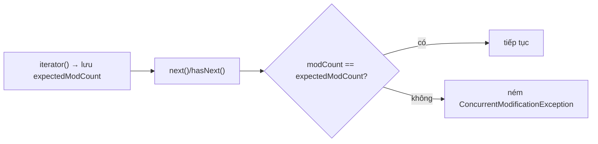

`ArrayList` và `LinkedList` cùng triển khai `List`, nhưng cách lưu trữ dữ liệu của chúng hoàn toàn khác nhau. Sự khác biệt này ảnh hưởng trực tiếp đến tốc độ truy cập, chèn, xóa, mức sử dụng bộ nhớ và khả năng tận dụng CPU cache.

## Mục lục

- [Tổng quan](#1-tổng-quan)
- [ArrayList — mảng động bên trong](#2-arraylist--mảng-động-bên-trong)
- [Cơ chế grow: 1.5x & System.arraycopy](#3-cơ-chế-grow-15x--systemarraycopy)
- [LinkedList — doubly linked list bên trong](#4-linkedlist--doubly-linked-list-bên-trong)
- [Big-O trên giấy vs thực tế phần cứng](#5-big-o-trên-giấy-vs-thực-tế-phần-cứng)
- [Cache locality — vì sao LinkedList thường thua](#6-cache-locality--vì-sao-linkedlist-thường-thua)
- [modCount & fail-fast iterator](#7-modcount--fail-fast-iterator)
- [Xóa khi duyệt — Iterator.remove & removeIf](#8-xóa-khi-duyệt--iteratorremove--removeif)
- [Khi nào thực sự chọn LinkedList](#9-khi-nào-thực-sự-chọn-linkedlist)
- [Anti-patterns cần tránh](#10-anti-patterns-cần-tránh)
- [Tóm tắt — Cheat sheet & nguyên tắc](#11-tóm-tắt--cheat-sheet--nguyên-tắc)

---

## 1. Tổng quan

`ArrayList` lưu các phần tử trong một mảng liên tục và tự mở rộng khi cần; `LinkedList` lưu mỗi phần tử trong một node liên kết với các node lân cận. Vì vậy, không thể kết luận đơn giản rằng `LinkedList` luôn tốt hơn khi chèn/xóa hoặc `ArrayList` chỉ phù hợp để đọc.

Việc lựa chọn phải dựa trên vị trí thao tác, tần suất duyệt, kích thước dữ liệu và chi phí bộ nhớ. Phần này đặt hai cấu trúc trong cùng điều kiện để làm rõ trade-off trước khi đi vào cách triển khai bên trong.

## 2. ArrayList — mảng động bên trong

`ArrayList` bọc một **mảng `Object[]`**. Đơn giản nhưng đó là chìa khóa cho hiệu năng:

```java
public class ArrayList<E> {
    transient Object[] elementData;   // mảng backing thật
    private int size;                 // số phần tử ĐANG dùng (≤ elementData.length)
}
```

- `size` là số phần tử thực; `elementData.length` là **capacity** (sức chứa) — thường lớn hơn `size`.
- `get(i)` = `elementData[i]` → **O(1)**, một phép truy cập mảng.
- `add(e)` ở cuối = `elementData[size++] = e` → **O(1) amortized** (trừ lúc phải grow).
- `add(i, e)` / `remove(i)` ở giữa = dịch chuyển phần đuôi bằng `System.arraycopy` → **O(n)**.

```
ArrayList size=4, capacity=10:
  elementData: [A][B][C][D][ ][ ][ ][ ][ ][ ]
                              └──── slot trống (capacity dư) ────┘
  get(2) = elementData[2] = C   (tức thì)
```

> [!NOTE]
> Phần tử của `ArrayList` (object) vẫn nằm rải trên heap — mảng backing chỉ chứa **reference**. Nhưng dãy reference này **liền mạch**, nên duyệt tuần tự rất thân thiện với CPU prefetch (mục 6).

---

## 3. Cơ chế grow: 1.5x & System.arraycopy

Khi `add` mà mảng đầy (`size == elementData.length`), `ArrayList` **grow**:

```java
private Object[] grow(int minCapacity) {
    int oldCapacity = elementData.length;
    int newCapacity = oldCapacity + (oldCapacity >> 1);  // ×1.5 (oldCapacity + nửa của nó)
    // ... đảm bảo ≥ minCapacity, ≤ MAX_ARRAY_SIZE
    return elementData = Arrays.copyOf(elementData, newCapacity);  // cấp mảng mới + copy
}
```

- Hệ số **1.5x** (không phải 2x như nhiều ngôn ngữ) — cân bằng giữa tốn bộ nhớ và số lần grow.
- `Arrays.copyOf` dùng `System.arraycopy` — một **intrinsic** (lệnh máy `memcpy` tối ưu), nhanh hơn vòng lặp Java.
- Capacity mặc định: mảng rỗng (lazy) → lần `add` đầu cấp **10**.

Vì sao `add` cuối là **O(1) amortized**: mỗi lần grow tốn O(n) copy nhưng xảy ra hiếm dần (sau mỗi 1.5x), nên chi phí trung bình mỗi `add` vẫn là hằng số.

```
add liên tục:  cap 10 → 15 → 22 → 33 → 49 → ...   (mỗi lần copy toàn bộ phần tử cũ)
```

> [!TIP]
> Nếu biết trước số phần tử, dùng `new ArrayList<>(expectedSize)` để cấp đủ capacity ngay từ đầu — **tránh các lần grow + arraycopy** lặp lại. Nạp 1 triệu phần tử không pre-size có thể grow ~30 lần. (Cùng nguyên lý với `initialCapacity` của HashMap.)

`remove`/`add` ở giữa cũng dùng `System.arraycopy` để dịch đuôi:

```java
// remove(i): dịch [i+1..size) lùi 1 ô
System.arraycopy(elementData, i + 1, elementData, i, size - i - 1);
elementData[--size] = null;   // xóa tham chiếu cuối để GC dọn
```

---

## 4. LinkedList — doubly linked list bên trong

`LinkedList` là **danh sách liên kết đôi** — mỗi phần tử là một `Node` object riêng, nối qua con trỏ:

```java
public class LinkedList<E> {
    transient int size = 0;
    transient Node<E> first;     // đầu
    transient Node<E> last;      // cuối
    private static class Node<E> {
        E item;
        Node<E> next;            // node sau
        Node<E> prev;            // node trước
    }
}
```

```
first                                                    last
  │                                                       │
  ▼                                                       ▼
[prev|A|next] ⇄ [prev|B|next] ⇄ [prev|C|next] ⇄ [prev|D|next]
```

- `addFirst`/`addLast`/`add(node đã biết)` = chỉnh vài con trỏ → **O(1)** (khi bạn **đã ở** node đó).
- `get(i)` = duyệt từ đầu hoặc cuối (chọn phía gần hơn) → **O(n)**.
- Mỗi `Node` là **object riêng** với header + 3 reference (item, next, prev) → tốn ~24–40 byte/phần tử **chỉ cho overhead**, gấp nhiều lần `ArrayList`.

> [!WARNING]
> "LinkedList insert O(1)" chỉ đúng khi bạn **đã có tham chiếu tới node** (vd qua `ListIterator`). Nếu phải `get(i)` rồi insert, bạn đã trả O(n) cho việc tìm vị trí — tổng vẫn O(n). Cái "O(1)" thường bị hiểu sai chính ở chỗ này.

---

## 5. Big-O trên giấy vs thực tế phần cứng

| Thao tác | ArrayList | LinkedList | Ghi chú thực tế |
|----------|-----------|------------|------------------|
| `get(i)` | **O(1)** | O(n) | ArrayList thắng tuyệt đối |
| `add` cuối | O(1)* amortized | O(1) | * trừ lúc grow |
| `add(0, e)` đầu | O(n) (dịch mảng) | **O(1)** | LinkedList thắng trên giấy... |
| `remove(i)` giữa | O(n) | O(n) tìm + O(1) sửa | cả hai O(n) |
| Duyệt tuần tự | **O(n) nhanh** | O(n) chậm | ArrayList cache-friendly |
| Bộ nhớ/phần tử | 1 reference + capacity dư | ~3 reference + header/node | LinkedList tốn gấp nhiều lần |

> [!IMPORTANT]
> Ngay cả ở `add(0, e)` (chèn đầu) nơi LinkedList O(1) thắng ArrayList O(n), `ArrayList` vẫn **thường nhanh hơn** với n vừa phải vì `System.arraycopy` là `memcpy` phần cứng cực nhanh, còn LinkedList tốn allocation node + cache miss. Big-O chỉ thắng khi n đủ lớn — và lúc đó thường nên dùng `ArrayDeque` thay vì LinkedList.

---

## 6. Cache locality — vì sao LinkedList thường thua

Đây là lý do sâu xa nhất. CPU đọc RAM theo **cache line** (~64 byte) và **prefetch** các vùng liền kề.

```
ArrayList (mảng reference liền mạch):
  [ref][ref][ref][ref][ref] ...   ← CPU prefetch cả block, duyệt tuyến tính = hit cache

LinkedList (node rải khắp heap):
  node A @0x1000 ─next─▶ node B @0x8F40 ─next─▶ node C @0x2210 ...
  mỗi bước = nhảy địa chỉ ngẫu nhiên → cache MISS → chờ RAM (~100x chậm hơn cache)
```

- Duyệt `ArrayList`: truy cập tuần tự, prefetcher đoán đúng → gần như toàn cache hit.
- Duyệt `LinkedList`: mỗi `next` là một **pointer chase** tới địa chỉ khó đoán → cache miss liên tục.

Một cache miss tốn ~100 chu kỳ CPU (đọc từ RAM) so với ~4 chu kỳ (L1). Với hàng triệu phần tử, chênh lệch này áp đảo mọi ưu thế Big-O lý thuyết của LinkedList.

> [!TIP]
> Ngay cả khi cần thao tác hai đầu (queue/deque), **`ArrayDeque`** (mảng vòng) thường nhanh hơn `LinkedList` vì giữ được cache locality. Thực tế, `LinkedList` gần như **không bao giờ** là lựa chọn tốt nhất trong code hiện đại.

---

## 7. modCount & fail-fast iterator

Cả hai list (và hầu hết collection `java.util`) đều có biến `modCount` đếm số lần **thay đổi cấu trúc** (add/remove). Iterator chụp lại `modCount` lúc tạo (`expectedModCount`) và kiểm tra mỗi bước:

```java
final void checkForComodification() {
    if (modCount != expectedModCount)
        throw new ConcurrentModificationException();   // fail-fast
}
```

Vì vậy sửa list **trong khi** đang duyệt bằng for-each (vốn dùng iterator ngầm) → ném `ConcurrentModificationException`:

```java
for (String s : list) {
    if (s.isBlank()) list.remove(s);   // 😱 modCount đổi → CME ở vòng lặp tiếp theo
}
```



> [!NOTE]
> Fail-fast **không** đảm bảo phát hiện mọi sửa đổi đồng thời — nó là cơ chế **best-effort** để bắt bug sớm, không phải đảm bảo thread-safety. Tên `ConcurrentModificationException` gây hiểu nhầm: nó nổ cả khi **một thread duy nhất** sửa list giữa lúc duyệt, không cần đa luồng.

---

## 8. Xóa khi duyệt — Iterator.remove & removeIf

Cách đúng để xóa trong lúc duyệt:

```java
// 1. Iterator.remove() — cập nhật expectedModCount nội bộ, không CME
Iterator<String> it = list.iterator();
while (it.hasNext()) {
    if (it.next().isBlank()) it.remove();   // ✅ an toàn
}

// 2. removeIf — ngắn gọn, được tối ưu riêng cho từng impl
list.removeIf(String::isBlank);             // ✅ gọn nhất, nhanh nhất

// 3. Thu thập rồi xóa sau / dùng stream filter tạo list mới
List<String> kept = list.stream().filter(s -> !s.isBlank()).toList();
```

> [!TIP]
> `removeIf` trên `ArrayList` được tối ưu đặc biệt: nó quét một lượt, đánh dấu phần tử cần giữ, rồi dịch **một lần** — nhanh hơn nhiều so với gọi `remove(i)` lặp (mỗi lần `remove` là một `arraycopy` O(n) → tổng O(n²)). Luôn ưu tiên `removeIf` khi xóa theo điều kiện.

---

## 9. Khi nào thực sự chọn LinkedList

Hiếm, nhưng có:

| Tình huống | Vì sao LinkedList hợp |
|-----------|------------------------|
| Cần `Deque` + thường xuyên thêm/xóa **hai đầu** | O(1) hai đầu — **nhưng `ArrayDeque` thường vẫn nhanh hơn** |
| Đã giữ tham chiếu node và chèn/xóa **tại chỗ** qua `ListIterator` | O(1) thật sự, không tốn arraycopy |
| Danh sách rất hay splice (cắt/ghép) đoạn lớn | con trỏ rẻ hơn dịch mảng |

> [!IMPORTANT]
> Lời khuyên thực dụng: **mặc định `ArrayList`**; cần hàng đợi hai đầu thì **`ArrayDeque`**. Chỉ cân nhắc `LinkedList` khi đã đo được nó thắng trong ca cụ thể của bạn (rất hiếm). Joshua Bloch và phần lớn cộng đồng đều khuyên gần như không bao giờ dùng `LinkedList`.

---

## 10. Anti-patterns cần tránh

| Anti-pattern | Vì sao sai | Thay bằng |
|--------------|-----------|-----------|
| `LinkedList.get(i)` trong vòng lặp | Mỗi get O(n) → tổng O(n²) | `ArrayList`, hoặc duyệt bằng iterator |
| Chọn LinkedList chỉ vì "insert O(1)" | Cache miss + allocation thắng ưu thế Big-O | `ArrayList` / `ArrayDeque` |
| Không pre-size ArrayList khi biết kích thước | Grow + arraycopy lặp nhiều lần | `new ArrayList<>(n)` |
| `remove(i)` lặp để lọc | Mỗi remove arraycopy O(n) → O(n²) | `removeIf(...)` |
| Sửa list trong for-each | `ConcurrentModificationException` | `Iterator.remove()` / `removeIf` |
| Dùng LinkedList làm stack/queue | Chậm hơn | `ArrayDeque` |

---

## 11. Tóm tắt — Cheat sheet & nguyên tắc

**Cỗ máy trong 6 dòng:**

```
1. ArrayList  = Object[] động, get O(1), add cuối O(1) amortized, grow ×1.5
2. LinkedList = doubly-linked node, get(i) O(n), mỗi node = object + 3 ref
3. cache locality: ArrayList liền mạch (prefetch) > LinkedList pointer chasing
4. add/remove giữa: cả hai O(n) (ArrayList dịch mảng, LinkedList tìm node)
5. modCount → for-each sửa list = ConcurrentModificationException
6. xóa theo điều kiện = removeIf (không phải remove(i) lặp = O(n²))
```

| | ArrayList | LinkedList |
|---|-----------|------------|
| get(i) | **O(1)** | O(n) |
| add cuối | O(1)* | O(1) |
| Bộ nhớ/phần tử | thấp | cao (header + 3 ref/node) |
| Cache | tốt | tệ |
| Khi dùng | **mặc định** | gần như không bao giờ |

**5 nguyên tắc khắc cốt:**

1. **Mặc định `ArrayList`** — thắng gần như mọi tình huống thực tế.
2. **Big-O không tính cache miss** — LinkedList thua vì pointer chasing.
3. **Pre-size khi biết kích thước** — tránh grow + arraycopy lặp.
4. **Xóa theo điều kiện = `removeIf`** — đừng `remove(i)` lặp (O(n²)).
5. **Sửa list khi duyệt = `Iterator.remove`** — for-each sẽ ném CME.

> [!TIP]
> Một câu để nhớ: *ArrayList lưu dữ liệu kề nhau để CPU đọc nhanh; LinkedList rải khắp heap và bắt CPU đi tìm.* Bảng Big-O nói LinkedList "nhanh ở chèn", nhưng phần cứng thực tế gần như luôn nghiêng về ArrayList.
