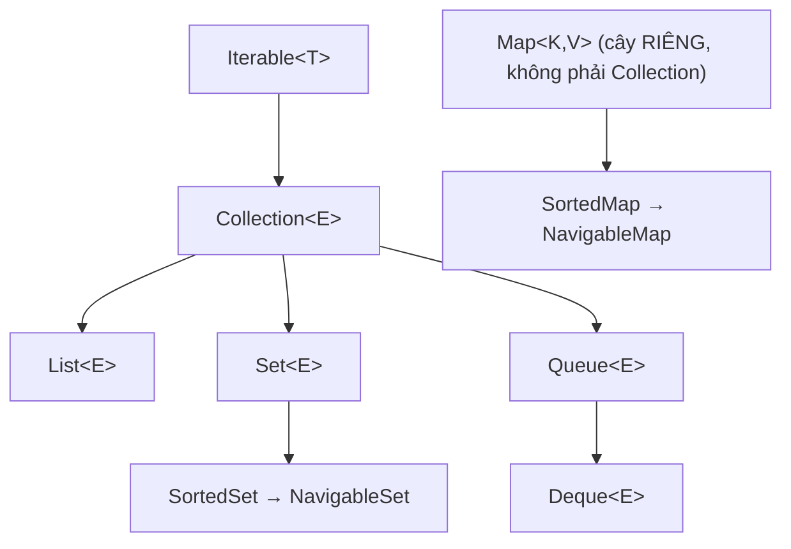
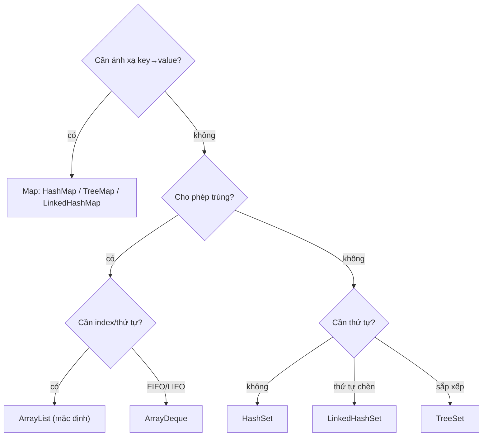

# Collection Framework — Bản đồ kiến trúc & nội lực

## Mục lục

- [Bối cảnh: vì sao có cả một "framework" cho cấu trúc dữ liệu](#1-bối-cảnh-vì-sao-có-cả-một-framework-cho-cấu-trúc-dữ-liệu)
- [Hệ phân cấp interface — Collection vs Map](#2-hệ-phân-cấp-interface--collection-vs-map)
- [Iterable & Iterator — hợp đồng duyệt](#3-iterable--iterator--hợp-đồng-duyệt)
- [Fail-fast — modCount hoạt động thế nào](#4-fail-fast--modcount-hoạt-động-thế-nào)
- [List / Set / Queue / Deque — vai trò từng nhánh](#5-list--set--queue--deque--vai-trò-từng-nhánh)
- [Generics, type erasure & bridge method](#6-generics-type-erasure--bridge-method)
- [Marker interface: RandomAccess & ý nghĩa hiệu năng](#7-marker-interface-randomaccess--ý-nghĩa-hiệu-năng)
- [Immutable & unmodifiable collections](#8-immutable--unmodifiable-collections)
- [Bảng chọn cấu trúc phù hợp](#9-bảng-chọn-cấu-trúc-phù-hợp)
- [Tóm tắt — Cheat sheet](#10-tóm-tắt--cheat-sheet)

---

## 1. Bối cảnh: vì sao có cả một "framework" cho cấu trúc dữ liệu

Trước Java 1.2, mỗi cấu trúc (`Vector`, `Hashtable`, `Stack`) là một class rời rạc với API khác nhau, không thể hoán đổi. Bạn không thể viết một method "nhận bất kỳ tập hợp nào". Collection Framework (1998, do Joshua Bloch thiết kế) giải quyết bằng cách **tách interface khỏi implementation**:

```java
// Sức mạnh của việc lập trình theo interface, không theo class cụ thể
void process(Collection<Order> orders) { ... }   // nhận ArrayList, HashSet, LinkedList...

List<Order> a = new ArrayList<>();   // đổi implementation 1 dòng
List<Order> b = new LinkedList<>();  // code dùng nó không cần biết
```

Toàn bộ framework xoay quanh vài interface gốc + nhiều implementation thay thế nhau được, cộng các algorithm dùng chung trong `Collections` (sort, binarySearch, shuffle...).

> [!IMPORTANT]
> Tư tưởng cốt lõi: **khai báo theo interface (`List`, `Set`, `Map`), khởi tạo theo class (`ArrayList`, `HashSet`)**. Nhờ vậy bạn đổi cấu trúc dữ liệu mà không sửa code phụ thuộc — đây là toàn bộ lý do framework tồn tại.

---

## 2. Hệ phân cấp interface — Collection vs Map

Điểm gây bất ngờ nhất: **`Map` KHÔNG kế thừa `Collection`**. Có hai cây độc lập:



Vì sao `Map` đứng riêng? Vì `Collection` mô hình hoá "một nhóm phần tử **đơn**", còn `Map` là "ánh xạ **cặp** key→value". Ép `Map extends Collection` sẽ tạo ra mơ hồ: `add(E)` thêm gì — key, value, hay entry? Tuy vậy `Map` *kết nối* với Collection qua 3 view: `keySet()` (Set), `values()` (Collection), `entrySet()` (Set\<Entry\>).

| Interface | Bản chất | Đặc trưng |
|-----------|----------|-----------|
| `Collection` | nhóm phần tử đơn | gốc của List/Set/Queue |
| `List` | dãy có thứ tự, cho trùng | truy cập theo index |
| `Set` | tập, không trùng | dựa trên `equals`/`hashCode` hoặc thứ tự |
| `Queue`/`Deque` | hàng đợi (FIFO/LIFO) | thêm/lấy ở đầu/cuối |
| `Map` | ánh xạ key→value | tra cứu theo key |

---

## 3. Iterable & Iterator — hợp đồng duyệt

`Iterable<T>` là interface ở **đỉnh** — chỉ một method `iterator()`. Đây là thứ làm cho enhanced for (`for (x : coll)`) hoạt động: compiler desugar nó thành vòng lặp dùng `Iterator`.

```java
for (Order o : orders) { ... }
// compiler dịch thành:
Iterator<Order> it = orders.iterator();
while (it.hasNext()) { Order o = it.next(); ... }
```

`Iterator<T>` có hợp đồng 3 method:

```java
interface Iterator<E> {
    boolean hasNext();
    E next();              // ném NoSuchElementException nếu hết
    default void remove(); // xoá phần tử CUỐI CÙNG next() trả về (optional)
}
```

> [!TIP]
> `Iterator.remove()` là **cách duy nhất an toàn** để xoá phần tử *trong khi đang duyệt*. Gọi `collection.remove()` trực tiếp trong vòng lặp for-each sẽ gây `ConcurrentModificationException` (xem mục 4).

---

## 4. Fail-fast — modCount hoạt động thế nào

Hầu hết collection (`ArrayList`, `HashMap`...) là **fail-fast**: nếu cấu trúc bị sửa đổi trong lúc đang duyệt (bởi thread khác *hoặc* bởi chính bạn qua method sai), iterator ném `ConcurrentModificationException` (CME) **ngay**, thay vì âm thầm trả dữ liệu sai.

Cơ chế: mỗi collection giữ biến `modCount` (đếm số lần sửa cấu trúc). Khi tạo iterator, nó chụp lại `expectedModCount = modCount`. Mỗi `next()` kiểm tra:

```java
final void checkForComodification() {
    if (modCount != expectedModCount)
        throw new ConcurrentModificationException();
}
```

```java
for (String s : list) {
    if (s.equals("x")) list.remove(s);   // modCount++ → next() phát hiện → CME
}
// Đúng: dùng iterator.remove() (nó cập nhật cả expectedModCount)
list.removeIf(s -> s.equals("x"));       // hoặc removeIf — an toàn
```

> [!WARNING]
> Fail-fast là **best-effort**, KHÔNG phải đảm bảo. Đừng dựa vào CME để "đồng bộ" — nó chỉ là cơ chế phát hiện bug. Với truy cập đa luồng thật sự, dùng concurrent collection (`ConcurrentHashMap`, `CopyOnWriteArrayList`) — chúng **fail-safe** (duyệt trên snapshot, không ném CME).

---

## 5. List / Set / Queue / Deque — vai trò từng nhánh

| Nhánh | Implementation chính | Khi nào dùng |
|-------|---------------------|--------------|
| `List` | `ArrayList`, `LinkedList` | cần thứ tự + index, cho phép trùng |
| `Set` | `HashSet`, `LinkedHashSet`, `TreeSet` | cần loại trùng; cần thứ tự chèn / thứ tự sắp xếp |
| `Queue` | `ArrayDeque`, `PriorityQueue`, `LinkedList` | xử lý FIFO / theo độ ưu tiên |
| `Deque` | `ArrayDeque`, `LinkedList` | dùng làm stack (LIFO) lẫn queue (FIFO) |

> [!NOTE]
> `ArrayDeque` nên là lựa chọn mặc định cho **cả Stack lẫn Queue** — nhanh hơn `LinkedList` (cache-friendly, không tạo node) và thay thế class `Stack`/`Vector` lỗi thời (đồng bộ toàn cục không cần thiết). Tránh dùng `java.util.Stack`.

---

## 6. Generics, type erasure & bridge method

Generics trong collection là **compile-time only** — JVM xoá kiểu (type erasure). `List<String>` và `List<Integer>` cùng một class `List` lúc runtime:

```java
List<String> a = new ArrayList<>();
List<Integer> b = new ArrayList<>();
a.getClass() == b.getClass();   // true! cùng ArrayList.class
```

Lúc compile, `String s = list.get(0)` được chèn một **checkcast** ngầm. Erasure cũng là lý do bạn không thể `new T[]` hay `instanceof List<String>`.

> [!IMPORTANT]
> Hệ quả thực tế: **không thể** có `List<String>` và `List<Integer>` làm hai overload khác nhau (cùng erasure → trùng signature). Và một `List<String>` *có thể* bị "đầu độc" bằng phần tử kiểu khác qua raw type — `ClassCastException` chỉ nổ ra lúc đọc. Vì thế luôn dùng generic, không bao giờ dùng raw type.

Compiler còn sinh **bridge method** để giữ tính đa hình sau erasure khi bạn override method generic — đây là method synthetic bạn thấy trong stack trace đôi khi.

---

## 7. Marker interface: RandomAccess & ý nghĩa hiệu năng

`RandomAccess` là **marker interface** (không method) báo cho thuật toán biết: "truy cập theo index của tôi là O(1)". `ArrayList` implement nó, `LinkedList` thì không.

```java
// Collections.binarySearch & nhiều thuật toán kiểm tra:
if (list instanceof RandomAccess)
    // dùng vòng lặp theo index (rẻ với ArrayList)
else
    // dùng iterator (rẻ với LinkedList — get(i) là O(n)!)
```

> [!TIP]
> Đây là ví dụ đẹp của marker interface: thay đổi *chiến lược thuật toán* dựa trên *khả năng* của cấu trúc dữ liệu, mà không cần method ảo. Khi tự viết thuật toán xử lý `List` lớn, hãy kiểm tra `RandomAccess` để tránh `get(i)` O(n) trên `LinkedList`.

---

## 8. Immutable & unmodifiable collections

Có ba mức "không đổi" dễ nhầm:

| Cách tạo | Bản chất | Sửa được không |
|----------|----------|----------------|
| `Collections.unmodifiableList(x)` | **view** bao quanh list gốc | không sửa qua view, nhưng sửa list gốc thì view đổi theo |
| `List.of(...)` (Java 9+) | **immutable** thật sự | không, ném `UnsupportedOperationException` |
| `List.copyOf(x)` | bản sao immutable | không |

```java
List<Integer> base = new ArrayList<>(List.of(1, 2));
List<Integer> view = Collections.unmodifiableList(base);
base.add(3);            // view giờ thấy [1,2,3]! — chỉ là view
List<Integer> immut = List.of(1, 2);
immut.add(3);           // UnsupportedOperationException ngay lập tức
```

> [!WARNING]
> `List.of()` còn **cấm null** và **giữ thứ tự**, nhưng `Set.of()`/`Map.of()` không đảm bảo thứ tự và ném `IllegalArgumentException` nếu có key/phần tử trùng. Đừng nhầm "immutable" (cấu trúc khoá) với "phần tử bên trong immutable" — `List.of(mutableObj)` vẫn cho sửa object bên trong.

---

## 9. Bảng chọn cấu trúc phù hợp



| Nhu cầu | Chọn | Độ phức tạp chính |
|---------|------|-------------------|
| Danh sách truy cập index | `ArrayList` | get O(1), add cuối amortized O(1) |
| Thêm/xoá hai đầu, stack/queue | `ArrayDeque` | O(1) hai đầu |
| Loại trùng, không cần thứ tự | `HashSet` | add/contains O(1) |
| Loại trùng + giữ thứ tự chèn | `LinkedHashSet` | O(1) + thứ tự |
| Loại trùng + sắp xếp | `TreeSet` | O(log n) |
| Tra cứu key→value | `HashMap` | get/put O(1) |
| Key sắp xếp / range query | `TreeMap` | O(log n), `floorKey`/`ceilingKey` |
| Hàng đợi ưu tiên | `PriorityQueue` | offer/poll O(log n) |

---

## 10. Tóm tắt — Cheat sheet

**Kiến trúc trong 5 dòng:**

```
1. Iterable → Collection → {List, Set, Queue→Deque};  Map là cây RIÊNG
2. for-each = Iterator (hasNext/next/remove)
3. fail-fast = modCount khác expectedModCount → ConcurrentModificationException
4. generics = compile-time, runtime bị erasure (List<String> == List<Integer>)
5. interface để khai báo, class để khởi tạo — đổi impl không sửa code
```

| Quy tắc | Nội dung |
|---------|----------|
| Khai báo | dùng interface (`List`, `Map`) |
| Sửa khi duyệt | `Iterator.remove()` / `removeIf`, không `coll.remove()` |
| Đa luồng | concurrent collection (fail-safe), không dựa CME |
| Immutable | `List.of`/`copyOf` (thật) vs `unmodifiable` (view) |

**5 nguyên tắc khắc cốt:**

1. **`Map` không phải `Collection`** — nhớ 3 view `keySet/values/entrySet`.
2. **Fail-fast là phát hiện bug, không phải cơ chế đồng bộ.**
3. **Generics bị erasure** — luôn dùng generic, tránh raw type.
4. **`ArrayList` + `ArrayDeque`** là hai lựa chọn mặc định tốt nhất.
5. **Phân biệt immutable thật (`of`) vs view (`unmodifiable`).**

> [!TIP]
> Một câu để nhớ: *Collection Framework không cho bạn cấu trúc dữ liệu mới — nó cho bạn quyền đổi cấu trúc dữ liệu mà không phải viết lại code, miễn là bạn lập trình theo interface.*
