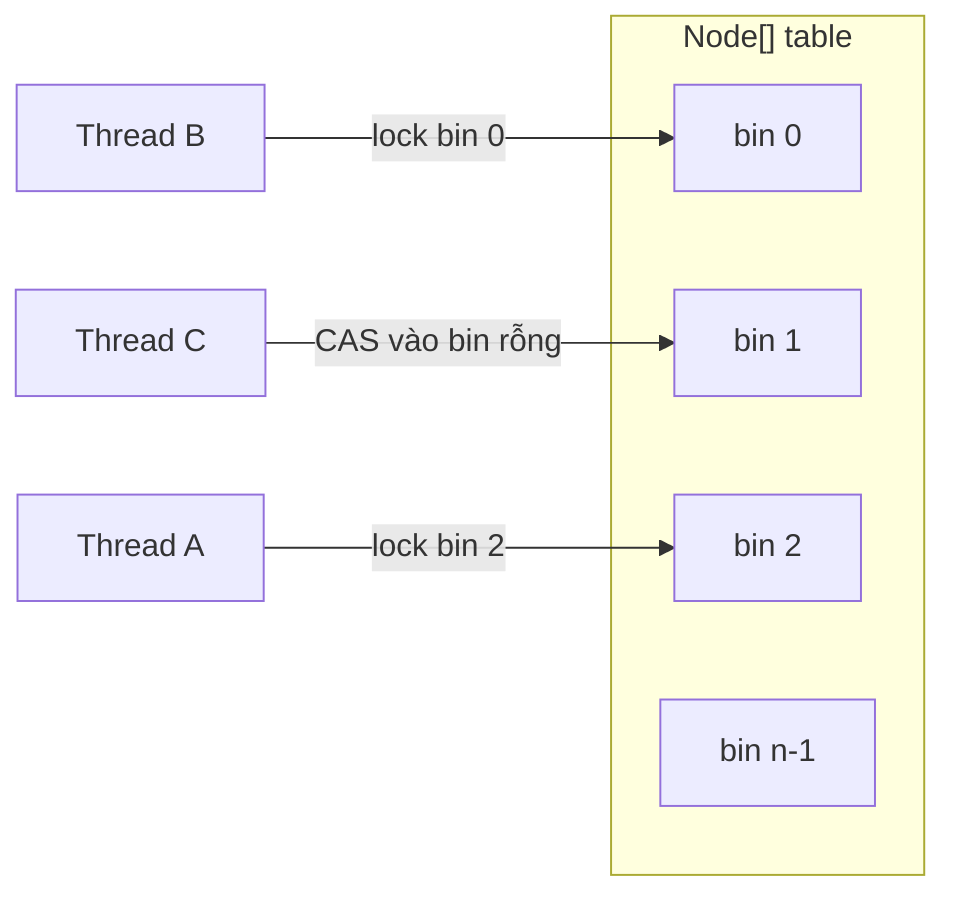
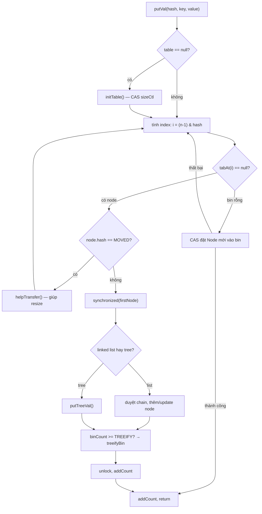
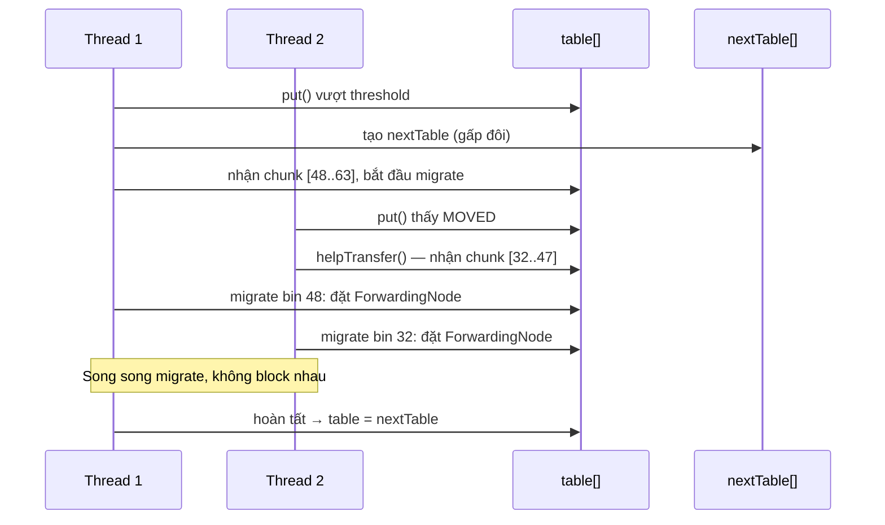

## Mục lục

- [Bối cảnh: 800 thread đánh vào một cache — throughput rớt 95%](#1-bối-cảnh-800-thread-đánh-vào-một-cache--throughput-rớt-95)
- [Từ Segment Lock (Java 7) sang Bin Lock (Java 8+)](#2-từ-segment-lock-java-7-sang-bin-lock-java-8)
- [Cấu trúc nội bộ — Node[], ForwardingNode, TreeBin](#3-cấu-trúc-nội-bộ--node-forwardingnode-treebin)
- [Spread hash — triệt bit-sign và khuấy đều](#4-spread-hash--triệt-bit-sign-và-khuấy-đều)
- [putVal() — CAS + synchronized từng bin](#5-putval--cas--synchronized-từng-bin)
- [Transfer (resize) — concurrent migration từng bin](#6-transfer-resize--concurrent-migration-từng-bin)
- [Size counting — LongAdder-style với CounterCell](#7-size-counting--longadder-style-với-countercell)
- [get() — hoàn toàn lock-free nhờ volatile next](#8-get--hoàn-toàn-lock-free-nhờ-volatile-next)
- [Weakly Consistent Iterator — không ConcurrentModificationException](#9-weakly-consistent-iterator--không-concurrentmodificationexception)
- [Bulk Operations — forEach, search, reduce song song](#10-bulk-operations--foreach-search-reduce-song-song)
- [So sánh: ConcurrentHashMap vs synchronizedMap vs Hashtable](#11-so-sánh-concurrenthashmap-vs-synchronizedmap-vs-hashtable)
- [Null không được phép — lý do thiết kế](#12-null-không-được-phép--lý-do-thiết-kế)
- [Anti-patterns & production pitfalls](#13-anti-patterns--production-pitfalls)
- [Tóm tắt — Cheat sheet & 5 nguyên tắc](#14-tóm-tắt--cheat-sheet--5-nguyên-tắc)

---

## 1. Bối cảnh: 800 thread đánh vào một cache — throughput rớt 95%

Bạn xây một service xác thực token. Mỗi request tra cứu token → user info trong một map cache. Traffic bình thường ~200 RPS, nhưng flash sale kéo lên 8.000 RPS — 800 thread cùng đọc/ghi map.

```java
Map<String, UserInfo> cache = Collections.synchronizedMap(new HashMap<>());

// 800 threads cùng gọi:
UserInfo info = cache.computeIfAbsent(token, this::loadFromDB);
```

Kết quả: latency p99 từ **2ms** nhảy lên **450ms**. Thread dump cho thấy hàng trăm thread **BLOCKED** chờ monitor lock — vì `synchronizedMap` khoá **toàn bộ map** cho mọi thao tác, kể cả `get()`.

Chuyển sang `ConcurrentHashMap`:

```java
Map<String, UserInfo> cache = new ConcurrentHashMap<>();
UserInfo info = cache.computeIfAbsent(token, this::loadFromDB);
```

Latency p99 giảm về **3ms**. Throughput hồi phục. Không đổi logic — chỉ đổi **implementation**.

```text
Benchmark (JMH, 64 threads, 1M ops)         Ops/sec       Avg latency
synchronizedMap.get                          312,000       ~204 μs
ConcurrentHashMap.get                     48,700,000       ~1.3 μs
```

> [!IMPORTANT]
> `ConcurrentHashMap` nhanh không phải vì "không lock" — mà vì lock ở **granularity nhỏ nhất có thể**: chỉ lock **một bin** (một slot trong mảng), cho phép 800 thread thao tác **song song** trên các bin khác nhau mà không tranh chấp.

---

## 2. Từ Segment Lock (Java 7) sang Bin Lock (Java 8+)

### 2.1. Java 7 — Segment (mini-HashMap)

Java 7 chia map thành **16 Segment**, mỗi segment là một mini-HashMap riêng với một `ReentrantLock`:

```
ConcurrentHashMap (Java 7)
├── Segment[0]  ← ReentrantLock + HashEntry[]
├── Segment[1]  ← ReentrantLock + HashEntry[]
├── ...
└── Segment[15] ← ReentrantLock + HashEntry[]
```

Tối đa **16 thread** ghi song song (một thread/segment). Đọc dùng **volatile** read — không cần lock.

**Hạn chế**: segment cố định lúc tạo, không resize theo load. Nếu traffic tập trung vào vài segment → vẫn contention.

### 2.2. Java 8+ — Bin-level lock

JDK 8 loại bỏ `Segment`, dùng trực tiếp **mảng `Node<K,V>[]`** (giống HashMap) nhưng lock ở cấp **từng bin** (phần tử đầu tiên của chain):



- Bin **rỗng** → dùng **CAS** (không lock gì cả)
- Bin **có node** → `synchronized(firstNode)` — chỉ khoá head của bin đó
- Các bin khác **hoàn toàn không bị ảnh hưởng**

Concurrency level thực tế = **số bin đang được ghi** — có thể lên tới hàng nghìn thay vì cố định 16.

---

## 3. Cấu trúc nội bộ — Node[], ForwardingNode, TreeBin

```java
transient volatile Node<K,V>[] table;          // mảng bin chính
private transient volatile Node<K,V>[] nextTable; // mảng mới đang resize
private transient volatile long baseCount;     // base cho size()
private transient volatile int sizeCtl;        // điều khiển resize/init
private transient volatile CounterCell[] counterCells; // phân tán counting

static class Node<K,V> {
    final int hash;
    final K key;
    volatile V val;          // volatile — đọc không cần lock
    volatile Node<K,V> next; // volatile — iterator thấy ngay node mới
}
```

Các loại node đặc biệt:

| Node type | hash value | Vai trò |
|-----------|-----------|---------|
| `Node` | `≥ 0` | Entry thông thường trong linked list |
| `TreeBin` | `-2` | Wrapper quản lý Red-Black tree (khi bin ≥ 8 node) |
| `TreeNode` | `≥ 0` | Node trong cây (bên trong TreeBin) |
| `ForwardingNode` | `-1` (`MOVED`) | Đánh dấu bin đã được migrate sang `nextTable` |
| `ReservationNode` | `-3` | Placeholder cho `computeIfAbsent` (tránh recursive deadlock) |

> [!NOTE]
> `ForwardingNode` là chìa khoá cho **concurrent resize**: khi một thread gặp bin có `ForwardingNode`, nó biết phải tìm ở `nextTable` — hoặc tham gia giúp migrate.

---

## 4. Spread hash — triệt bit-sign và khuấy đều

```java
static final int HASH_BITS = 0x7fffffff; // chỉ giữ 31 bit dương

static final int spread(int h) {
    return (h ^ (h >>> 16)) & HASH_BITS;
}
```

Hai việc xảy ra:
1. **`h ^ (h >>> 16)`** — perturbation giống HashMap: trộn bit cao xuống thấp
2. **`& HASH_BITS`** — xoá bit dấu (bit 31), đảm bảo hash **luôn ≥ 0**

Tại sao cần hash ≥ 0? Vì hash **âm** được dành riêng cho node đặc biệt:

| Hash | Ý nghĩa |
|------|---------|
| `≥ 0` | Entry bình thường |
| `-1` (`MOVED`) | `ForwardingNode` — bin đã migrate |
| `-2` (`TREEBIN`) | `TreeBin` — bin dạng cây |
| `-3` (`RESERVED`) | `ReservationNode` |

> [!TIP]
> Đây là lý do `ConcurrentHashMap` **cấm null key**: `spread(null.hashCode())` sẽ NPE. Nhưng quan trọng hơn — null value tạo mơ hồ ngữ nghĩa trong concurrent context (mục 12).

---

## 5. putVal() — CAS + synchronized từng bin

Đây là trái tim của `ConcurrentHashMap`. Flow đầy đủ:



Source code rút gọn (JDK 17):

```java
final V putVal(K key, V value, boolean onlyIfAbsent) {
    if (key == null || value == null) throw new NullPointerException();
    int hash = spread(key.hashCode());
    int binCount = 0;
    for (Node<K,V>[] tab = table;;) {
        Node<K,V> f; int n, i, fh;
        if (tab == null || (n = tab.length) == 0)
            tab = initTable();                    // lazy init bằng CAS
        else if ((f = tabAt(tab, i = (n - 1) & hash)) == null) {
            // bin rỗng → CAS trực tiếp, KHÔNG lock
            if (casTabAt(tab, i, null, new Node<>(hash, key, value, null)))
                break;
        }
        else if ((fh = f.hash) == MOVED)
            tab = helpTransfer(tab, f);           // giúp migrate
        else {
            synchronized (f) {                    // lock CHỈ bin này
                if (tabAt(tab, i) == f) {         // double-check
                    // ... duyệt list hoặc tree, thêm/update node
                }
            }
        }
    }
    addCount(1L, binCount);                       // cập nhật size
    return null;
}
```

**Điểm then chốt:**
1. **Bin rỗng → CAS** (zero lock, fastest path) — đa số `put` vào bin rỗng
2. **Bin có node → `synchronized(f)`** — lock head node, các bin khác không ảnh hưởng
3. **Double-check** sau khi lấy lock: vì giữa lúc đọc `f` và lấy lock, bin có thể đã bị resize/migrate
4. **`helpTransfer`**: nếu đang resize, thread ghi **tham gia giúp** migrate thay vì chờ

> [!IMPORTANT]
> CAS vào bin rỗng là **fast path** phổ biến nhất. Khi map thưa (nhiều bin rỗng), hầu hết `put` hoàn thành mà **không lock gì cả** — giải thích throughput cực cao ở low contention.

---

## 6. Transfer (resize) — concurrent migration từng bin

Khi `size` vượt `sizeCtl` (threshold), ConcurrentHashMap resize — nhưng **không** dừng mọi thread. Thay vào đó, nó cho phép **nhiều thread cùng migrate song song**, mỗi thread nhận một chunk bin:

```java
// Mỗi thread nhận stride bin để migrate (tối thiểu 16)
int stride = (NCPU > 1) ? (n >>> 3) / NCPU : n;
if (stride < MIN_TRANSFER_STRIDE) stride = MIN_TRANSFER_STRIDE;
```



Khi một bin được migrate xong, head của nó được thay bằng `ForwardingNode`. Mọi thread khác `get()` qua bin này sẽ **tự động chuyển hướng** tìm ở `nextTable`:

```java
// Trong get(): gặp ForwardingNode → tìm ở nextTable
if ((eh = e.hash) == MOVED)
    return ((ForwardingNode<K,V>)e).find(hash, key);
```

> [!TIP]
> Resize trong `ConcurrentHashMap` là **non-blocking** cho reader: `get()` luôn thành công (hoặc ở table cũ, hoặc chuyển tiếp qua `ForwardingNode`). Writer bị ảnh hưởng tối thiểu — chỉ block khi cùng migrate một bin.

---

## 7. Size counting — LongAdder-style với CounterCell

Bài toán: 800 thread cùng `put` → cùng tăng `size`. Nếu dùng một `AtomicLong` → CAS contention cực cao.

Giải pháp: **`CounterCell[]`** — mỗi thread tăng một cell riêng, `size()` tổng hợp:

```java
// Cập nhật count (trong addCount):
if (counterCells != null ||
    !U.compareAndSwapLong(this, BASECOUNT, b = baseCount, b + x)) {
    // CAS baseCount thất bại → dùng CounterCell
    CounterCell a;
    if (counterCells == null || (a = counterCells[threadIdx]) == null
        || !U.compareAndSwapLong(a, CELLVALUE, v = a.value, v + x)) {
        fullAddCount(x, ...); // expand cells
    }
}
```

```java
// size() = baseCount + Σ counterCells[i].value
public int size() {
    long n = sumCount();
    return ((n < 0L) ? 0 : (n > Integer.MAX_VALUE) ? Integer.MAX_VALUE : (int)n);
}

final long sumCount() {
    CounterCell[] cs = counterCells;
    long sum = baseCount;
    if (cs != null)
        for (CounterCell c : cs)
            if (c != null) sum += c.value;
    return sum;
}
```

Cơ chế giống `java.util.concurrent.atomic.LongAdder`:

| Contention | Hành vi |
|-----------|---------|
| Thấp (1-2 thread) | CAS trực tiếp `baseCount` — nhanh, không alloc |
| Cao (nhiều thread CAS fail) | Mỗi thread ghi vào `CounterCell` riêng → không tranh chấp |
| Đọc `size()` | Tổng hợp `baseCount + Σ cells` — **eventually consistent** |

> [!WARNING]
> `size()` của `ConcurrentHashMap` **không** chính xác tuyệt đối tại thời điểm gọi. Nếu đang có thread khác `put/remove`, kết quả có thể lệch. Đây là trade-off có chủ đích: chính xác tuyệt đối đòi hỏi stop-the-world — bất khả thi cho concurrent map.

---

## 8. get() — hoàn toàn lock-free nhờ volatile next

```java
public V get(Object key) {
    Node<K,V>[] tab; Node<K,V> e, p; int n, eh; K ek;
    int h = spread(key.hashCode());
    if ((tab = table) != null && (n = tab.length) > 0 &&
        (e = tabAt(tab, (n - 1) & h)) != null) {        // volatile read
        if ((eh = e.hash) == h) {
            if ((ek = e.key) == key || (ek != null && key.equals(ek)))
                return e.val;                            // hit ở head
        }
        else if (eh < 0)
            return (p = e.find(h, key)) != null ? p.val : null; // tree/fwd
        while ((e = e.next) != null) {                   // duyệt chain
            if (e.hash == h &&
                ((ek = e.key) == key || (ek != null && key.equals(ek))))
                return e.val;
        }
    }
    return null;
}
```

**Không có lock, không có CAS** trong `get()`. Tại sao vẫn thread-safe?

1. **`tabAt(tab, i)`** dùng `Unsafe.getObjectVolatile` — đọc bin head với **volatile semantics** (thấy giá trị mới nhất)
2. **`Node.val`** và **`Node.next`** đều `volatile` — khi writer cập nhật, reader thấy ngay
3. **Immutable key + final hash** — writer không bao giờ thay đổi key/hash sau khi publish node

> [!IMPORTANT]
> `get()` lock-free là lý do `ConcurrentHashMap` scale tuyến tính với read-heavy workload. 800 thread đọc cùng lúc **không tranh chấp gì** — giống đọc một mảng bình thường.

---

## 9. Weakly Consistent Iterator — không ConcurrentModificationException

`HashMap` ném `ConcurrentModificationException` nếu bạn `put/remove` trong khi đang iterate (fail-fast). `ConcurrentHashMap` **không bao giờ** ném exception này:

```java
ConcurrentHashMap<String, Integer> map = new ConcurrentHashMap<>();
map.put("a", 1); map.put("b", 2); map.put("c", 3);

for (Map.Entry<String, Integer> e : map.entrySet()) {
    map.put("d", 4);          // OK — không ném exception
    map.remove("b");          // OK
    System.out.println(e);    // có thể thấy hoặc không thấy "d"
}
```

Ngữ nghĩa: **weakly consistent** — iterator phản ánh trạng thái map **tại hoặc sau** thời điểm tạo iterator. Cụ thể:
- Đảm bảo thấy mọi entry **đã tồn tại** lúc tạo iterator (trừ khi bị remove)
- **Có thể** thấy entry được thêm **sau** khi tạo iterator (không đảm bảo)
- Mỗi entry xuất hiện **tối đa một lần** (không duplicate)

> [!TIP]
> Đây là sự lựa chọn thiết kế đúng cho concurrent: nếu iterator phải "đóng băng" snapshot thì phải copy toàn bộ → tốn O(n) bộ nhớ + thời gian. Weakly consistent là trade-off giữa consistency và performance.

---

## 10. Bulk Operations — forEach, search, reduce song song

JDK 8 thêm các **bulk operations** chạy **parallel** nếu map đủ lớn:

```java
ConcurrentHashMap<String, Long> metrics = new ConcurrentHashMap<>();

// forEach song song (parallelismThreshold = 1000 → parallel nếu size > 1000)
metrics.forEach(1000, (key, value) -> {
    if (value > threshold) alert(key);
});

// search — dừng ngay khi tìm thấy (short-circuit)
String found = metrics.search(1000, (key, value) ->
    value > 1_000_000 ? key : null
);

// reduce — tổng hợp giá trị song song
long total = metrics.reduceValuesToLong(1000, Long::longValue, 0L, Long::sum);
```

**`parallelismThreshold`**: số phần tử tối thiểu để chạy parallel. Nếu `size < threshold` → chạy sequential trên calling thread.

| Threshold | Hành vi |
|-----------|---------|
| `Long.MAX_VALUE` | Luôn sequential |
| `1` | Luôn parallel (ForkJoinPool.commonPool) |
| `1000` | Parallel nếu `size ≥ 1000` |

> [!WARNING]
> Bulk operations **weakly consistent** — giống iterator, chúng có thể thấy entry được thêm/xoá giữa chừng. Không dùng cho tính toán cần **snapshot chính xác** (dùng `ConcurrentHashMap.newKeySet()` + copy nếu cần).

---

## 11. So sánh: ConcurrentHashMap vs synchronizedMap vs Hashtable

| Tiêu chí | `ConcurrentHashMap` | `synchronizedMap` | `Hashtable` |
|----------|--------------------|--------------------|-------------|
| Lock granularity | **Bin-level** | Toàn bộ map | Toàn bộ map |
| get() locking | **Không lock** (volatile read) | Lock toàn map | Lock toàn map |
| Concurrent writes | Song song (khác bin) | **Serialized** | Serialized |
| Iterator | Weakly consistent | Fail-fast | Fail-fast (Enumerator thì không) |
| Null key/value | **Cấm** | Cho phép | **Cấm** |
| Bulk parallel ops | **Có** (forEach, search, reduce) | Không | Không |
| Resize | **Concurrent** (multi-thread help) | Stop-the-world | Stop-the-world |
| `size()` precision | Eventually consistent | Exact (dưới lock) | Exact (dưới lock) |
| Throughput 64 threads | **~48M ops/s** | ~300K ops/s | ~280K ops/s |

> [!IMPORTANT]
> `synchronizedMap` "thread-safe" nhưng **không** scalable. Nó wrap mọi method bằng `synchronized(mutex)`. ConcurrentHashMap thiết kế từ đầu cho **concurrent access** — không phải "thêm lock vào HashMap".

---

## 12. Null không được phép — lý do thiết kế

```java
ConcurrentHashMap<String, String> map = new ConcurrentHashMap<>();
map.put("key", null);   // NullPointerException!
map.put(null, "value"); // NullPointerException!
```

Tại sao? Doug Lea giải thích:

Trong single-thread `HashMap`, `get(key) == null` có 2 nghĩa:
1. Key không tồn tại
2. Key tồn tại, value là `null`

Bạn phân biệt bằng `containsKey`. Nhưng trong concurrent context:

```java
// Thread A:
if (map.containsKey(k)) {
    V v = map.get(k);     // v có thể null — nhưng nghĩa gì?
    // Giữa containsKey và get, Thread B có thể đã remove(k)!
}
```

Kết quả `null` **không thể phân biệt** giữa "key bị xoá sau containsKey" và "key tồn tại với value null". Trong concurrent code, **mọi compound check-then-act đều race**.

> [!TIP]
> Cấm null loại bỏ sự mơ hồ ngay từ API: `get(key) == null` **luôn** nghĩa "key không có trong map tại thời điểm đọc". Đây là **design decision**, không phải limitation.

---

## 13. Anti-patterns & production pitfalls

| Anti-pattern | Vì sao sai | Giải pháp |
|--------------|-----------|-----------|
| `if (!map.containsKey(k)) map.put(k, v)` | Race condition — 2 thread cùng thấy "không có" → put 2 lần | `map.putIfAbsent(k, v)` hoặc `computeIfAbsent` |
| `map.get(k) + 1` rồi `map.put(k, n)` | Lost update — 2 thread đọc cùng giá trị cũ | `map.merge(k, 1, Integer::sum)` |
| Dùng `size()` để quyết định logic | `size()` không chính xác trong concurrent | Dùng `isEmpty()` hoặc `mappingCount()` (trả long) |
| `synchronizedMap` + "performance" | Khoá toàn cục, throughput tụt nặng | `ConcurrentHashMap` |
| Iterate + put/remove bên ngoài iterator | Kết quả không xác định (weakly consistent) | Dùng `compute/merge/replaceAll` atomic |
| `new ConcurrentHashMap<>(1_000_000)` quá lớn | Waste RAM khi map thưa | Để default hoặc tính `initialCapacity` hợp lý |
| Dùng ConcurrentHashMap làm **distributed** lock | Chỉ safe trong **một JVM** | Dùng Redis/ZooKeeper cho distributed |

**Compound operation đúng cách:**

```java
// ❌ Race condition
String old = map.get(key);
if (old == null) {
    map.put(key, newValue);
}

// ✅ Atomic
map.putIfAbsent(key, newValue);

// ✅ Atomic + compute lazily
map.computeIfAbsent(key, k -> expensiveCreate(k));

// ✅ Atomic increment
map.merge(key, 1L, Long::sum);
```

> [!WARNING]
> `computeIfAbsent` **block bin** trong khi chạy lambda. Nếu lambda chậm (I/O, network) → bin đó bị khoá lâu → thread khác ghi vào cùng bin sẽ chờ. Giải pháp: đặt giá trị placeholder (CompletableFuture) rồi complete ngoài lock.

---

## 14. Tóm tắt — Cheat sheet & 5 nguyên tắc

**Cỗ máy trong 6 dòng:**

```
1. Cấu trúc: Node<K,V>[] giống HashMap, nhưng val/next đều volatile
2. Bin rỗng → CAS (zero lock). Bin có node → synchronized(head)
3. get() hoàn toàn lock-free: volatile read table + val + next
4. Resize concurrent: nhiều thread cùng migrate, ForwardingNode chuyển hướng
5. Size counting: baseCount + CounterCell[] (LongAdder-style) → eventually consistent
6. Null cấm hoàn toàn: loại bỏ mơ hồ ngữ nghĩa trong concurrent context
```

| Thao tác | Complexity | Lock? |
|----------|-----------|-------|
| `get` | O(1) avg | **Không** (volatile read) |
| `put` (bin rỗng) | O(1) | **Không** (CAS) |
| `put` (bin có node) | O(1) avg | `synchronized(head)` |
| `size()` | O(counterCells.length) | Không — nhưng eventually consistent |
| `computeIfAbsent` | O(1) avg | `synchronized(head)` + block trong lambda |

**5 nguyên tắc khắc cốt:**

1. **Dùng atomic method** — `putIfAbsent`, `computeIfAbsent`, `merge` thay cho check-then-act thủ công.
2. **`get()` free, `put()` cheap** — read-heavy workload scale tuyến tính với core count.
3. **`size()` chỉ là ước lượng** — không dùng để quyết định logic business chính xác.
4. **Null = bug** — `ConcurrentHashMap` cấm null key và null value. Dùng sentinel value nếu cần.
5. **Bin-level lock ≠ toàn quyền** — `computeIfAbsent` block bin, lambda phải nhanh.

> [!TIP]
> Một câu để nhớ: *`ConcurrentHashMap` không phải "HashMap + lock" — nó là một cấu trúc hoàn toàn khác, thiết kế từ zero cho concurrent access, với get lock-free, put CAS-first, resize cooperative, và size eventually-consistent.*
