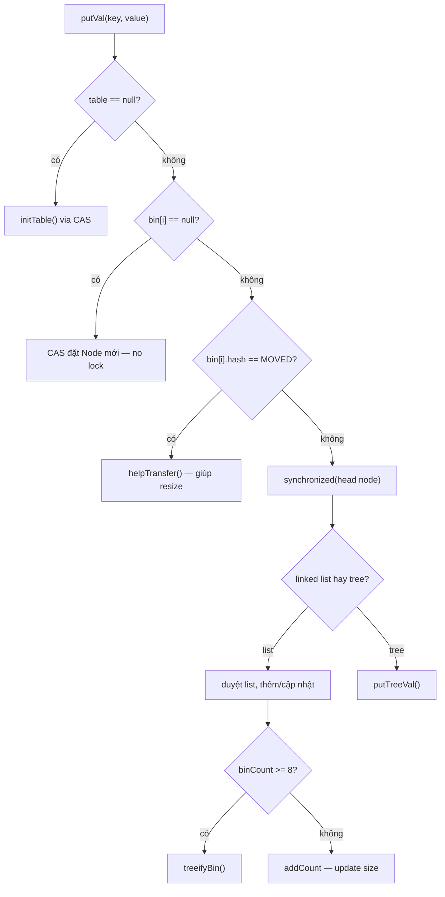

`ConcurrentHashMap` cung cấp bảng key–value cho phép nhiều thread đọc và cập nhật đồng thời. Khác với việc bọc `HashMap` bằng một lock chung, nó giới hạn phạm vi đồng bộ để duy trì throughput khi mức cạnh tranh tăng.

## Mục lục

- [Tổng quan](#1-tổng-quan)
- [Kiến trúc JDK 8+ — từ Segment sang per-bin lock](#2-kiến-trúc-jdk-8--từ-segment-sang-per-bin-lock)
- [Node types — Node, TreeBin, ForwardingNode, ReservationNode](#3-node-types--node-treebin-forwardingnode-reservationnode)
- [put() internals — CAS + synchronized + treeify](#4-put-internals--cas--synchronized--treeify)
- [get() — hoàn toàn lock-free nhờ volatile](#5-get--hoàn-toàn-lock-free-nhờ-volatile)
- [Resize — transfer() song song giữa nhiều thread](#6-resize--transfer-song-song-giữa-nhiều-thread)
- [Size counting — LongAdder-style với CounterCell](#7-size-counting--longadder-style-với-countercell)
- [Treeify trong ConcurrentHashMap — TreeBin wrapper](#8-treeify-trong-concurrenthashmap--treebin-wrapper)
- [Null không được phép — và lý do kỹ thuật](#9-null-không-được-phép--và-lý-do-kỹ-thuật)
- [Bulk operations — forEach, search, reduce với parallelismThreshold](#10-bulk-operations--foreach-search-reduce-với-parallelismthreshold)
- [So sánh: Hashtable vs synchronizedMap vs ConcurrentHashMap](#11-so-sánh-hashtable-vs-synchronizedmap-vs-concurrenthashmap)
- [Pitfalls: compound operations không atomic](#12-pitfalls-compound-operations-không-atomic)
- [ConcurrentHashMap làm cache — computeIfAbsent thundering herd](#13-concurrenthashmap-làm-cache--computeifabsent-thundering-herd)
- [Tóm tắt — Cheat sheet & 5 nguyên tắc](#14-tóm-tắt--cheat-sheet--5-nguyên-tắc)

---

## 1. Tổng quan

Từ Java 8, `ConcurrentHashMap` không còn kiến trúc `Segment` cố định. Việc đọc phần lớn không khóa, trong khi cập nhật phối hợp bằng CAS và khóa theo bin; resize được nhiều thread hỗ trợ thay vì dồn cho một thread duy nhất.

Các chi tiết này giải thích vì sao những API như `computeIfAbsent()`, `putIfAbsent()` và `merge()` quan trọng: chúng giữ toàn bộ read–modify–write trong một thao tác nguyên tử, tránh race condition do ghép nhiều lời gọi riêng lẻ.

## 2. Kiến trúc JDK 8+ — từ Segment sang per-bin lock

**JDK 7**: Chia map thành `Segment[]` (mặc định 16 segment), mỗi segment là một HashMap nhỏ có lock riêng. Tối đa 16 thread song song — dù table có 1 triệu bin.

**JDK 8+**: Xoá `Segment` hoàn toàn. Table là flat array `Node<K,V>[]`, lock **từng bin (bucket)** bằng `synchronized` trên node đầu tiên của bin:

```java
transient volatile Node<K,V>[] table;     // main table
private transient volatile Node<K,V>[] nextTable;  // table mới khi đang resize
private transient volatile long baseCount;         // base size counter
private transient volatile int sizeCtl;            // control: -1 = init, -N = resize, >0 = threshold
private transient volatile CounterCell[] counterCells; // distributed counter
```

```
JDK 7:  16 Segment locks (cố định)
         ┌─────┬─────┬─────┬─────┐
         │Seg 0│Seg 1│...  │Seg15│   ← mỗi segment có lock riêng
         └──┬──┴──┬──┴─────┴──┬──┘
            │     │           │
           [bins][bins]     [bins]

JDK 8+: N bin locks (N = table.length, scale theo size)
         ┌──┬──┬──┬──┬──┬──┬──┬──┐
         │b0│b1│b2│b3│b4│b5│b6│b7│...   ← lock trên head node của từng bin
         └──┴──┴──┴──┴──┴──┴──┴──┘
```

> [!NOTE]
> Granularity lock = số bin = table.length. Với default capacity 16 → 16 bin lock. Sau resize 1024 → 1024 lock. **Lock granularity tự scale** theo kích thước map.

---

## 3. Node types — Node, TreeBin, ForwardingNode, ReservationNode

```java
// Node thường — giống HashMap.Node nhưng val và next là volatile
static class Node<K,V> {
    final int hash;
    final K key;
    volatile V val;        // volatile! get() đọc không cần lock
    volatile Node<K,V> next;
}

// TreeBin — wrapper bọc Red-Black Tree, hash = -2
// Chứa root, first (linked list), lockState cho read/write tree
static final class TreeBin<K,V> extends Node<K,V> {
    TreeNode<K,V> root;
    volatile TreeNode<K,V> first;
    volatile int lockState;  // read-write lock nội bộ cho cây
}

// ForwardingNode — đánh dấu bin đã transfer xong, hash = -1  
// get() gặp node này → forward sang nextTable
static final class ForwardingNode<K,V> extends Node<K,V> {
    final Node<K,V>[] nextTable;
    ForwardingNode(Node<K,V>[] tab) {
        super(MOVED, null, null);  // hash = MOVED = -1
        this.nextTable = tab;
    }
}

// ReservationNode — placeholder cho computeIfAbsent, hash = -3
static final class ReservationNode<K,V> extends Node<K,V> { }
```

| hash value | Node type | Ý nghĩa |
|-----------|-----------|---------|
| ≥ 0 | `Node` | Node thường (linked list) |
| -1 (`MOVED`) | `ForwardingNode` | Bin đã transfer sang table mới |
| -2 (`TREEBIN`) | `TreeBin` | Bin là Red-Black Tree |
| -3 (`RESERVED`) | `ReservationNode` | Placeholder cho compute |

---

## 4. put() internals — CAS + synchronized + treeify

```java
final V putVal(K key, V value, boolean onlyIfAbsent) {
    if (key == null || value == null) throw new NullPointerException();
    int hash = spread(key.hashCode());  // perturbation: (h ^ (h >>> 16)) & 0x7fffffff
    int binCount = 0;

    for (Node<K,V>[] tab = table;;) {
        Node<K,V> f; int n, i, fh;

        // 1) Table chưa init → initTable() (CAS sizeCtl thành -1)
        if (tab == null || (n = tab.length) == 0)
            tab = initTable();

        // 2) Bin rỗng → CAS đặt node mới (KHÔNG cần lock)
        else if ((f = tabAt(tab, i = (n - 1) & hash)) == null) {
            if (casTabAt(tab, i, null, new Node<K,V>(hash, key, value)))
                break;  // CAS thành công → done
        }

        // 3) Bin là ForwardingNode → thread này giúp transfer
        else if ((fh = f.hash) == MOVED)
            tab = helpTransfer(tab, f);

        // 4) Bin có node → synchronized trên head node
        else {
            V oldVal = null;
            synchronized (f) {            // 🔒 Lock CHỈ bin này
                if (tabAt(tab, i) == f) { // double-check head chưa đổi
                    if (fh >= 0) {        // linked list
                        binCount = 1;
                        for (Node<K,V> e = f;; ++binCount) {
                            if (e.hash == hash && key.equals(e.key)) {
                                oldVal = e.val;
                                if (!onlyIfAbsent) e.val = value;
                                break;
                            }
                            if ((e = e.next) == null) {
                                // Thêm node cuối
                                e.next = new Node<>(hash, key, value);
                                break;
                            }
                        }
                    } else if (f instanceof TreeBin) {  // tree
                        binCount = 2;
                        TreeNode<K,V> p = ((TreeBin<K,V>)f).putTreeVal(hash, key, value);
                        if (p != null) { oldVal = p.val; if (!onlyIfAbsent) p.val = value; }
                    }
                }
            }
            if (binCount >= TREEIFY_THRESHOLD)
                treeifyBin(tab, i);   // 8+ nodes → tree
            if (oldVal != null) return oldVal;
            break;
        }
    }
    addCount(1L, binCount);  // cập nhật size + kiểm tra resize
    return null;
}
```



> [!TIP]
> **Bin rỗng** → CAS không cần lock. Đây là common case (hash phân tán tốt → đa số bin chỉ có 0-1 node). CAS trên bin rỗng là **wait-free** — nhanh nhất có thể.

---

## 5. get() — hoàn toàn lock-free nhờ volatile

```java
public V get(Object key) {
    Node<K,V>[] tab; Node<K,V> e, p; int n, eh; K ek;
    int h = spread(key.hashCode());
    if ((tab = table) != null && (n = tab.length) > 0 &&
        (e = tabAt(tab, (n - 1) & h)) != null) {   // volatile read
        if ((eh = e.hash) == h) {
            if ((ek = e.key) == key || (ek != null && key.equals(ek)))
                return e.val;                        // hit ở head node
        }
        else if (eh < 0)                            // TreeBin hoặc ForwardingNode
            return (p = e.find(h, key)) != null ? p.val : null;
        while ((e = e.next) != null) {              // duyệt linked list
            if (e.hash == h && ((ek = e.key) == key || (ek != null && key.equals(ek))))
                return e.val;
        }
    }
    return null;
}
```

**Tại sao không cần lock?**

1. `table` là `volatile` → thấy bản mới nhất.
2. `Node.val` và `Node.next` là `volatile` → đọc thấy write gần nhất.
3. `tabAt()` dùng `Unsafe.getObjectVolatile()` — volatile read cho phần tử mảng.
4. Khi resize đang diễn ra, gặp `ForwardingNode` → forward sang `nextTable` và tìm tiếp.

> [!IMPORTANT]
> `get()` **KHÔNG BAO GIỜ** block hay lock. Ngay cả khi resize đang chạy, get trên bin đã transfer sẽ follow ForwardingNode sang table mới. Đây là lý do ConcurrentHashMap cho read throughput gần như **vô hạn**.

---

## 6. Resize — transfer() song song giữa nhiều thread

Khi `size > sizeCtl` (threshold), bất kỳ thread nào cũng có thể kích hoạt resize. Nhưng thay vì 1 thread làm tất cả, ConcurrentHashMap cho phép **nhiều thread cùng transfer**:

### 6.1. Phân công công việc

```java
// Mỗi thread nhận một "stride" (dải bin) để transfer
// stride tối thiểu = MIN_TRANSFER_STRIDE = 16
private static final int MIN_TRANSFER_STRIDE = 16;

// transferIndex: vị trí hiện tại, giảm dần từ oldTable.length về 0
// Thread claim stride bằng CAS trên transferIndex
```

```
oldTable.length = 64, stride = 16
Thread A claims bins [48..63] ← transferIndex CAS 64 → 48
Thread B claims bins [32..47] ← transferIndex CAS 48 → 32
Thread C claims bins [16..31]
Thread D claims bins [0..15]
→ 4 thread transfer song song!
```

### 6.2. Transfer một bin

```java
// Với mỗi bin trong stride:
synchronized (f) {   // lock head node
    // Tách chain thành lo/hi (giống HashMap mục 7.2)
    // Đặt ForwardingNode vào bin cũ → signal "đã xong"
    setTabAt(tab, i, fwd);
}
```

### 6.3. helpTransfer()

Khi thread đang `put()` gặp `ForwardingNode` → nó không chỉ forward request, mà **join vào quá trình transfer**:

```java
final Node<K,V>[] helpTransfer(Node<K,V>[] tab, Node<K,V> f) {
    if (f instanceof ForwardingNode) {
        Node<K,V>[] nextTab = ((ForwardingNode<K,V>)f).nextTable;
        // CAS để đăng ký tham gia transfer
        transfer(tab, nextTab);  // giúp transfer stride tiếp theo
    }
    return nextTable;
}
```

> [!TIP]
> Resize trong ConcurrentHashMap là **cooperative** — mọi thread đang thao tác trên map đều có thể "xắn tay" giúp transfer. Thay vì 1 thread resize O(n) chặn mọi thứ, n thread cùng chia nhau → amortized cost per thread rất nhỏ.

---

## 7. Size counting — LongAdder-style với CounterCell

Đếm `size` chính xác trong map concurrent là bài toán khó: nếu dùng 1 AtomicLong, mọi thread đều CAS trên cùng 1 biến → contention cao.

ConcurrentHashMap dùng kỹ thuật giống `LongAdder`: phân tán counter thành nhiều cell, mỗi thread cộng vào cell riêng:

```java
private transient volatile long baseCount;                    // base counter
private transient volatile CounterCell[] counterCells;        // distributed cells

@jdk.internal.vm.annotation.Contended  // padding tránh false sharing
static final class CounterCell {
    volatile long value;
}

// addCount(): sau mỗi put/remove
private final void addCount(long x, int check) {
    CounterCell[] cs; long b, s;
    // Thử CAS trên baseCount trước (nhanh khi ít contention)
    if ((cs = counterCells) != null || !U.compareAndSetLong(this, BASECOUNT, b = baseCount, s = b + x)) {
        // CAS thất bại → contention → dùng CounterCell
        CounterCell c; long v;
        int m = cs.length - 1;
        // Hash thread vào cell, CAS trên cell đó
        if ((c = cs[ThreadLocalRandom.getProbe() & m]) == null || 
            !U.compareAndSetLong(c, CELLVALUE, v = c.value, v + x)) {
            fullAddCount(x, ...);  // fallback: expand cells hoặc retry
        }
    }
    // Check nếu cần resize
    if (check >= 0 && s >= sizeCtl) transfer(...);
}

// size() = baseCount + sum(counterCells[i].value)
public int size() {
    long n = sumCount();
    return (n < 0L) ? 0 : (n > Integer.MAX_VALUE) ? Integer.MAX_VALUE : (int) n;
}
```

> [!NOTE]
> `size()` trả về **giá trị xấp xỉ** — vì giữa lúc cộng các cell có thể thread khác đang cập nhật cell khác. Đây là trade-off: chính xác tuyệt đối cần global lock (chậm) vs xấp xỉ nhưng nhanh. Dùng `mappingCount()` trả `long` thay vì `int` cho map lớn.

---

## 8. Treeify trong ConcurrentHashMap — TreeBin wrapper

Khác với HashMap (tree node trực tiếp ở đầu bin), ConcurrentHashMap dùng **`TreeBin`** làm wrapper:

```java
static final class TreeBin<K,V> extends Node<K,V> {
    TreeNode<K,V> root;             // root của Red-Black Tree
    volatile TreeNode<K,V> first;   // head linked list (duy trì song song)
    volatile int lockState;         // 0 = unlocked, >0 = readers, -waiter bit
    static final int WRITER  = 1;
    static final int WAITER  = 2;
    static final int READER  = 4;
}
```

**Tại sao cần TreeBin wrapper?**

1. `TreeBin` luôn ở đầu bin → synchronized lock trên nó (put). Head không bao giờ đổi dù tree xoay.
2. TreeBin có **read-write lock nội bộ** (`lockState`): nhiều reader đọc tree đồng thời, writer lock exclusive khi restructure.
3. `find()` trên TreeBin: nếu writer đang giữ lock → fallback đọc linked list (`first → next → ...`) thay vì chờ. **Read không bao giờ block.**

```java
// TreeBin.find() — lock-free read path
final Node<K,V> find(int h, Object k) {
    if (k != null) {
        for (Node<K,V> e = first; e != null; ) {
            int s; K ek;
            // Nếu có writer đang lock → duyệt linked list (safe, không cần lock)
            if (((s = lockState) & (WAITER|WRITER)) != 0) {
                if (e.hash == h && ((ek = e.key) == k || (ek != null && k.equals(ek))))
                    return e;
                e = e.next;    // fallback linear scan
            }
            // Không ai lock → đọc cây (O(log n))
            else if (U.compareAndSetInt(this, LOCKSTATE, s, s + READER)) {
                TreeNode<K,V> r, p;
                try { p = ((r = root) == null) ? null : r.findTreeNode(h, k, null); }
                finally { if (U.getAndAddInt(this, LOCKSTATE, -READER) == (READER|WAITER)) ... }
                return p;
            }
        }
    }
    return null;
}
```

> [!TIP]
> Design brilliant: khi writer đang restructure tree, reader không block — nó duyệt **linked list** song song (TreeNode vẫn giữ `next` pointer). Throughput đọc không bao giờ giảm về 0.

---

## 9. Null không được phép — và lý do kỹ thuật

```java
map.put("key", null);    // ❌ NullPointerException
map.put(null, "value");  // ❌ NullPointerException
```

**Vì sao HashMap cho phép null mà ConcurrentHashMap không?**

Trong single-thread, `get(key) == null` có 2 ý nghĩa:
1. Key không tồn tại
2. Key tồn tại, value là null

Single-thread → gọi thêm `containsKey()` để phân biệt. Nhưng trong concurrent:

```java
// Thread A:
if (map.containsKey(k)) {   // true
    // → context switch →
    // Thread B: map.remove(k)
    // → context switch back →
    V v = map.get(k);        // null! nhưng ý nghĩa? key bị remove hay value = null?
}
```

Giữa `containsKey` và `get` không atomic → **ambiguity không thể giải quyết** nếu cho phép null value. Cấm null hoàn toàn = mọi `get() == null` chắc chắn nghĩa "không có key".

> [!IMPORTANT]
> Doug Lea (tác giả ConcurrentHashMap) coi việc cho phép null trong HashMap là "design mistake". ConcurrentHashMap fix lại bằng cách cấm hoàn toàn — trade-off nhỏ (không chứa null) đổi lại API rõ ràng, không ambiguity.

---

## 10. Bulk operations — forEach, search, reduce với parallelismThreshold

JDK 8 thêm các bulk operation chạy **song song nội bộ** (dùng ForkJoinPool.commonPool):

```java
ConcurrentHashMap<String, Long> map = ...;

// forEach — parallelism khi size > threshold
map.forEach(10_000, (key, value) -> {
    process(key, value);
});

// search — tìm phần tử đầu tiên thoả điều kiện
String result = map.search(10_000, (key, value) -> 
    value > 1_000_000 ? key : null   // trả non-null = found, stop
);

// reduce — aggregate
long total = map.reduceValuesToLong(10_000, Long::longValue, 0L, Long::sum);
```

Tham số đầu tiên (`parallelismThreshold`):
- `1` → luôn parallel (dùng ForkJoinPool)
- `Long.MAX_VALUE` → luôn sequential (single thread)
- `10_000` → parallel chỉ khi map có > 10.000 entries

> [!NOTE]
> Bulk operations **không** lock toàn map. Chúng duyệt snapshot tại thời điểm bắt đầu, có thể thấy entry được thêm/xoá bởi thread khác **trong lúc duyệt**. Phù hợp cho thống kê, monitoring — không phù hợp cho "đọc chính xác tại 1 thời điểm".

---

## 11. So sánh: Hashtable vs synchronizedMap vs ConcurrentHashMap

| Tiêu chí | `Hashtable` | `synchronizedMap` | `ConcurrentHashMap` |
|----------|-------------|-------------------|---------------------|
| Lock granularity | **Toàn bộ** (synchronized mỗi method) | **Toàn bộ** (wrapper mutex) | **Per-bin** (head node) |
| get() cần lock? | ✅ | ✅ | ❌ (volatile read) |
| Concurrent reads | 1 reader tại 1 thời điểm | 1 reader | **Vô hạn** |
| Concurrent writes | 1 writer | 1 writer | 1 writer **per bin** |
| Null key/value | ❌ / ❌ | ✅ / ✅ | ❌ / ❌ |
| Iterator | fail-fast | fail-fast | **weakly consistent** (không throw) |
| Resize | 1 thread | 1 thread | **Multi-thread cooperative** |
| Size accuracy | Exact (locked) | Exact (locked) | Approximate |
| JDK version | 1.0 (legacy) | 1.2 | 1.5+ (rewrite 1.8) |

**Throughput scaling (JMH, 75% read / 25% write, JDK 17):**

```text
Threads   Hashtable     synchronizedMap   ConcurrentHashMap
1         12M ops/s     11M ops/s         14M ops/s
4         4M ops/s      4M ops/s          52M ops/s
16        1.5M ops/s    1.5M ops/s        180M ops/s
64        0.8M ops/s    0.7M ops/s        450M ops/s
```

> [!WARNING]
> `Hashtable` và `synchronizedMap` **reverse-scale**: nhiều thread hơn → **chậm hơn** do contention. ConcurrentHashMap scale **gần tuyến tính** vì lock granularity tăng theo table size.

---

## 12. Pitfalls: compound operations không atomic

Dù mỗi method riêng lẻ là thread-safe, **chuỗi nhiều method** không atomic:

```java
// ❌ RACE CONDITION — check-then-act không atomic
if (!map.containsKey(key)) {
    map.put(key, computeValue());  // thread khác có thể put giữa 2 dòng
}

// ✅ Atomic — dùng compute methods
map.computeIfAbsent(key, k -> computeValue());
map.compute(key, (k, v) -> v == null ? init() : update(v));
map.merge(key, 1L, Long::sum);  // atomic increment
```

| Method | Atomic? | Dùng khi |
|--------|---------|----------|
| `putIfAbsent(k, v)` | ✅ | Chèn nếu chưa có (value đã tính sẵn) |
| `computeIfAbsent(k, f)` | ✅ | Chèn nếu chưa có (lazy compute) |
| `computeIfPresent(k, f)` | ✅ | Cập nhật nếu đã có |
| `compute(k, f)` | ✅ | Chèn hoặc cập nhật |
| `merge(k, v, f)` | ✅ | Merge value mới với value cũ |
| `replace(k, old, new)` | ✅ | CAS-style update |

> [!WARNING]
> Mapping function trong `computeIfAbsent` chạy **trong synchronized block** trên bin. Nếu function blocking (gọi I/O, chờ lock khác) → có thể **deadlock** hoặc block mọi put trên cùng bin. Giữ function ngắn gọn, thuần tính toán.

---

## 13. ConcurrentHashMap làm cache — computeIfAbsent thundering herd

Pattern cache phổ biến:

```java
ConcurrentHashMap<String, ExpensiveResult> cache = new ConcurrentHashMap<>();

ExpensiveResult get(String key) {
    return cache.computeIfAbsent(key, k -> loadFromDB(k));  // 500ms
}
```

**Vấn đề thundering herd?** KHÔNG — `computeIfAbsent` chỉ cho **1 thread** compute cho mỗi key (lock trên bin). Thread khác cùng key sẽ **block chờ** kết quả.

**Nhưng** nếu nhiều key hash vào **cùng bin** → các thread chờ nhau dù key khác nhau (false contention). Với hash tốt, xác suất này thấp.

**Vấn đề thực sự**: recursive computeIfAbsent trên cùng bin → **deadlock**:

```java
// ❌ DEADLOCK — recursive computeIfAbsent cùng map
map.computeIfAbsent("A", k -> {
    return map.computeIfAbsent("B", k2 -> ...);  // nếu A và B cùng bin → deadlock!
});
```

> [!IMPORTANT]
> `computeIfAbsent` giữ lock trên bin trong suốt quá trình compute. Nếu function bên trong cũng gọi `computeIfAbsent` trên cùng bin → **self-deadlock** (JDK có thể throw `IllegalStateException` từ JDK 9+ để phát hiện).

---

## 14. Tóm tắt — Cheat sheet & 5 nguyên tắc

**Cỗ máy trong 6 dòng:**

```
1. get(): volatile read — KHÔNG lock, KHÔNG block, scale vô hạn
2. put() bin rỗng: CAS — KHÔNG lock (common case)
3. put() bin có node: synchronized(head) — lock CHỈ bin đó
4. resize: multi-thread cooperative transfer, stride = 16+ bins
5. size: LongAdder-style distributed counting (baseCount + CounterCells)
6. null bị cấm — loại bỏ ambiguity get()==null trong concurrent context
```

| Thao tác | Complexity | Lock |
|----------|-----------|------|
| get() | **O(1)** | None (volatile) |
| put() bin rỗng | **O(1)** | CAS (lock-free) |
| put() bin có chain | O(k) k=chain length | synchronized(bin head) |
| size() | O(counterCells.length) | None |
| resize | O(n) amortized | Per-bin during transfer |

**5 nguyên tắc khắc cốt:**

1. **Dùng compute/merge cho compound ops** — `containsKey` + `put` tách rời = race condition.
2. **Không null** — cả key lẫn value. Dùng sentinel value nếu cần "absent" marker.
3. **computeIfAbsent function phải nhanh** — nó chạy trong lock. Blocking = block toàn bin.
4. **size() là approximate** — dùng cho monitoring, đừng dùng cho logic chính xác.
5. **ConcurrentHashMap ≠ "mọi thao tác đều atomic"** — chỉ từng method là atomic. Chuỗi method cần compute/merge.

> [!TIP]
> Một câu để nhớ: *ConcurrentHashMap đạt concurrency bằng cách lock ít nhất có thể — get không lock, put chỉ lock 1 bin, resize chia việc cho nhiều thread. Hiểu được ba điều này là hiểu 90% thiết kế.*
