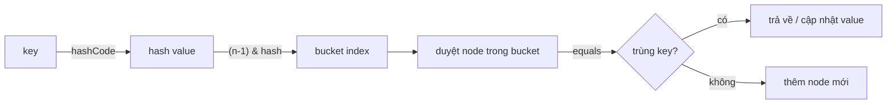
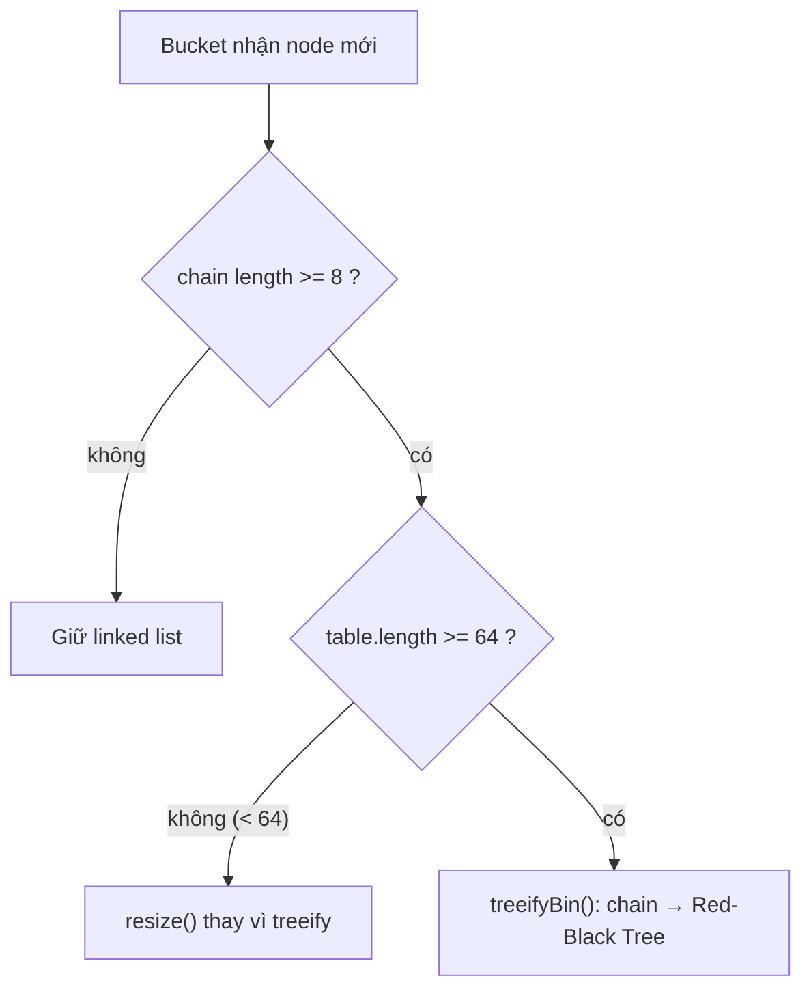
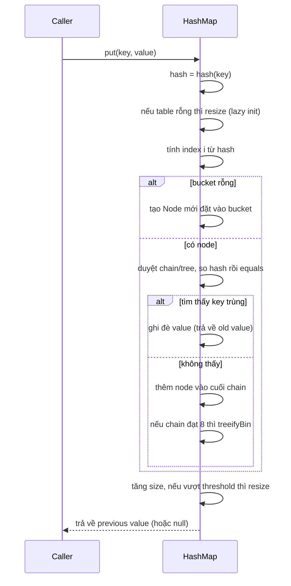

## Mục lục

- [Bối cảnh: Câu chuyện get() chậm gấp 50.000 lần](#1-bối-cảnh-câu-chuyện-get-chậm-gấp-50000-lần)
- [HashMap nhìn Key như thế nào — hashCode & equals](#2-hashmap-nhìn-key-như-thế-nào--hashcode--equals)
- [Cấu trúc nội bộ — Bucket array, Node và các hằng số](#3-cấu-trúc-nội-bộ--bucket-array-node-và-các-hằng-số)
- [Từ hashCode tới index — hàm hash() và phép & (n-1)](#4-từ-hashcode-tới-index--hàm-hash-và-phép--n-1)
- [Collision & Separate Chaining](#5-collision--separate-chaining)
- [Treeify — khi linked list biến thành Red-Black Tree](#6-treeify--khi-linked-list-biến-thành-red-black-tree)
- [Resize — Load Factor 0.75 và phép tách lo/hi](#7-resize--load-factor-075-và-phép-tách-lohi)
- [Flow đầy đủ của put() và get()](#8-flow-đầy-đủ-của-put-và-get)
- [Bug kinh điển: Infinite Loop khi resize đa luồng](#9-bug-kinh-điển-infinite-loop-khi-resize-đa-luồng)
- [Bad hashCode = thảm hoạ: O(1) biến thành O(n)](#10-bad-hashcode--thảm-hoạ-o1-biến-thành-on)
- [Mutable Key Trap — object biến mất khỏi map](#11-mutable-key-trap--object-biến-mất-khỏi-map)
- [So sánh HashMap / LinkedHashMap / TreeMap / Hashtable / ConcurrentHashMap](#12-so-sánh-hashmap--linkedhashmap--treemap--hashtable--concurrenthashmap)
- [Tuning — initialCapacity, loadFactor và tránh resize](#13-tuning--initialcapacity-loadfactor-và-tránh-resize)
- [Real-world & null handling](#14-real-world--null-handling)
- [Anti-patterns cần tránh](#15-anti-patterns-cần-tránh)
- [Tóm tắt — Cheat sheet & 5 nguyên tắc](#16-tóm-tắt--cheat-sheet--5-nguyên-tắc)

---

## 1. Bối cảnh: Câu chuyện get() chậm gấp 50.000 lần

Bạn xây một service dedup giao dịch. Mỗi giao dịch có một `TransactionKey` và bạn nhét chúng vào `HashMap` để tra cứu trùng lặp — thao tác mà ai cũng "biết" là **O(1)**:

```java
Map<TransactionKey, Transaction> seen = new HashMap<>();

for (Transaction tx : incoming) {     // 1.000.000 giao dịch
    if (!seen.containsKey(tx.key())) {
        seen.put(tx.key(), tx);
    }
}
```

Trên môi trường dev (vài nghìn giao dịch) chạy trong **mili-giây**. Lên production với 1 triệu giao dịch, vòng lặp này ngốn **gần 2 phút** và CPU một core dính **100%**. Không có I/O, không có lock, không có GC pause bất thường.

Bạn profiler và thấy 99% thời gian nằm trong `HashMap.getNode()`. Một map đáng lẽ O(1) đang hành xử như... một danh sách liên kết.

Nhìn vào `TransactionKey`:

```java
public final class TransactionKey {
    private final String merchantId;
    private final long    amountCents;

    @Override
    public boolean equals(Object o) { /* so sánh đầy đủ 2 field */ }

    @Override
    public int hashCode() {
        return 42;          // 😱 "tạm thời" — rồi quên sửa
    }
}
```

`hashCode()` trả về **hằng số**. Mọi key rơi vào **cùng một bucket**. HashMap vẫn "đúng" về mặt logic (nhờ `equals`), nhưng mỗi `get` phải duyệt qua **toàn bộ** phần tử trong bucket đó.

> [!IMPORTANT]
> HashMap **không** hỏng vì server yếu hay thiếu RAM. Nó hỏng vì **một method 1 dòng** — `hashCode()`. Hiểu HashMap nghĩa là hiểu chính xác `hashCode` đi vào đâu trong cỗ máy, và điều gì xảy ra khi nó tệ.

Đây là chênh lệch đo được trên cùng 1 triệu key (JMH, JDK 17):

```text
Benchmark                       Mode  Cnt      Score      Error  Units
HashMapBench.goodHashCode       avgt    5      0.042 ±    0.003  us/op   ← O(1), ~42 ns
HashMapBench.constantHashCode   avgt    5   2104.880 ±  61.220  us/op   ← O(n), ~2 ms/op
```

**~50.000 lần** chậm hơn, chỉ vì `return 42`. Trong doc này ta mổ xẻ từng lớp để hiểu vì sao.

---

## 2. HashMap nhìn Key như thế nào — hashCode & equals

HashMap định vị một entry qua **hai bước**, dùng **hai method khác nhau** của `Object`:

1. `hashCode()` → quyết định **bucket nào** (vị trí trong mảng).
2. `equals()` → trong bucket đó, tìm **đúng key nào** (so khớp chính xác).



### 2.1. Hợp đồng (contract) bắt buộc

| Quy tắc | Nội dung | Hậu quả nếu vi phạm |
|---------|----------|---------------------|
| 1 | `a.equals(b)` ⇒ `a.hashCode() == b.hashCode()` | 2 key "bằng nhau" rơi vào 2 bucket khác → `get` trả `null` dù đã `put` |
| 2 | `hashCode()` ổn định trong thời gian key nằm trong map | Đổi hash sau khi put → object "biến mất" (mục 11) |
| 3 | `equals` phản xạ/đối xứng/bắc cầu/nhất quán | Hành vi map không xác định |

> [!WARNING]
> Chiều ngược lại **không** bắt buộc: hai object có cùng `hashCode` **không** nhất thiết `equals`. Đó chính là **collision** — hoàn toàn hợp lệ, HashMap sinh ra để xử lý nó. Cái sai duy nhất là cố tình tạo collision cho **mọi** key (như `return 42`).

### 2.2. hashCode tốt trông như thế nào

```java
@Override
public int hashCode() {
    return Objects.hash(merchantId, amountCents);  // phân tán đều, dễ đọc
}
// hoặc dùng record để compiler tự sinh equals/hashCode đúng contract:
public record TransactionKey(String merchantId, long amountCents) {}
```

Tiêu chí của một `hashCode` tốt: **phân tán đều** (giảm collision) và **rẻ để tính** (được gọi rất nhiều lần).

---

## 3. Cấu trúc nội bộ — Bucket array, Node và các hằng số

Ruột của `HashMap` (JDK 8+) là **một mảng các `Node`**, gọi là `table`. Mỗi phần tử của mảng là một **bucket**:

```java
transient Node<K,V>[] table;   // mảng bucket, độ dài luôn là luỹ thừa của 2
transient int size;            // số entry
int threshold;                 // = capacity * loadFactor → ngưỡng resize
final float loadFactor;        // mặc định 0.75

static class Node<K,V> {
    final int hash;     // cache lại hash của key (không tính lại mỗi lần)
    final K key;
    V value;
    Node<K,V> next;     // con trỏ tới node kế trong cùng bucket (separate chaining)
}
```

Các hằng số quyết định hành vi:

| Hằng số | Giá trị | Ý nghĩa |
|---------|---------|---------|
| `DEFAULT_INITIAL_CAPACITY` | `16` | Số bucket ban đầu |
| `MAXIMUM_CAPACITY` | `1 << 30` | Giới hạn số bucket |
| `DEFAULT_LOAD_FACTOR` | `0.75f` | `size` đạt 75% capacity → resize |
| `TREEIFY_THRESHOLD` | `8` | Bucket ≥ 8 node → cân nhắc đổi sang cây |
| `UNTREEIFY_THRESHOLD` | `6` | Cây co lại ≤ 6 node → đổi về list |
| `MIN_TREEIFY_CAPACITY` | `64` | Table phải ≥ 64 bucket thì mới treeify (nếu không → resize trước) |

Hình dung table với 16 bucket, vài bucket có chain:

```
index:  0    1    2    3    4    5   ...  15
       [ ]  [A]  [ ]  [B]→[C] [ ]  [D]  ... [ ]
                       │
                       └─ bucket 3 có 2 node (collision): B.next = C
```

---

## 4. Từ hashCode tới index — hàm hash() và phép & (n-1)

### 4.1. Vì sao không dùng thẳng hashCode()?

Index bucket được tính bằng:

```java
index = (table.length - 1) & hash;
```

`table.length` luôn là luỹ thừa của 2, nên `length - 1` là một dãy bit 1 ở thấp (vd `16 - 1 = 0b1111`). Phép `&` này **chỉ giữ lại các bit thấp** của hash. Nghĩa là nếu hai hashCode khác nhau ở **bit cao** nhưng giống ở **bit thấp**, chúng vẫn đụng cùng bucket.

Ví dụ với `length = 16` (mask `0b1111`):

```
hashCode A = 0x7FFF0000 → bit thấp 0000 → bucket 0
hashCode B = 0xABCD0000 → bit thấp 0000 → bucket 0   ← đụng nhau dù hash rất khác!
```

### 4.2. Perturbation — trộn bit cao xuống bit thấp

JDK 8 "khuấy" hash trước khi dùng:

```java
static final int hash(Object key) {
    int h;
    return (key == null) ? 0 : (h = key.hashCode()) ^ (h >>> 16);
}
```

`h ^ (h >>> 16)` XOR nửa cao (16 bit trên) vào nửa thấp. Nhờ vậy **bit cao cũng ảnh hưởng tới việc chọn bucket**, giảm collision khi hashCode chỉ khác nhau ở phần cao:

```
h            = 0xABCD1234
h >>> 16     = 0x0000ABCD
h ^ (h>>>16) = 0xABCDB9F9   ← bit thấp giờ đã "mang thông tin" của bit cao
```

> [!NOTE]
> `key == null` → hash `0` → luôn vào **bucket 0**. Đó là lý do HashMap cho phép **đúng một** key `null`.

### 4.3. Vì sao capacity luôn là luỹ thừa của 2?

Vì `(n - 1) & hash` chỉ tương đương `hash % n` **khi n là luỹ thừa của 2**. Phép `&` rẻ hơn `%` rất nhiều, và còn làm cho bước resize (mục 7) tách bucket cực gọn. Nếu bạn truyền `initialCapacity = 10`, HashMap **làm tròn lên 16**.

---

## 5. Collision & Separate Chaining

Khi hai key khác nhau cho ra **cùng index**, đó là **collision**. HashMap xử lý bằng **separate chaining**: các node cùng bucket nối thành **danh sách liên kết** qua con trỏ `next`.

```
put("Aa", 1)  → hash → bucket 5 → [Aa=1]
put("BB", 2)  → hash → bucket 5 → [Aa=1] → [BB=2]   (collision! nối vào cuối)
```

> [!TIP]
> `"Aa"` và `"BB"` là cặp collision kinh điển trong Java: cả hai có `hashCode() == 2112`. Đây là nền tảng của tấn công **Hash DoS** — kẻ tấn công gửi hàng loạt key đụng độ để biến mọi bucket thành list dài, kéo tụt server xuống O(n²).

Chi phí thao tác phụ thuộc **độ dài chain**:

| Tình huống | Độ dài chain | get/put |
|------------|--------------|---------|
| Phân tán lý tưởng | ~1 | **O(1)** |
| Collision vừa phải | k nhỏ | O(k) |
| hashCode hằng số | n | **O(n)** |
| Bị treeify (mục 6) | log n | **O(log n)** |

---

## 6. Treeify — khi linked list biến thành Red-Black Tree

Để chặn worst-case O(n) của chain dài (gồm cả Hash DoS), JDK 8 thêm cơ chế **treeify**: khi một bucket có **≥ 8 node** *và* table đã **≥ 64 bucket**, chain đó được chuyển thành **Red-Black Tree** (cây nhị phân tìm kiếm tự cân bằng), hạ độ phức tạp bucket từ O(n) xuống **O(log n)**.



> [!IMPORTANT]
> Điều kiện kép rất quan trọng: nếu table còn nhỏ (< 64), HashMap **resize trước** chứ không treeify. Lý do: table nhỏ thì chain dài thường do **thiếu bucket**, resize sẽ phân tán lại và rẻ hơn là dựng cây.

Khi cây co lại còn **≤ 6 node** (`UNTREEIFY_THRESHOLD`) sau khi remove/resize, nó **đổi ngược** về linked list. Có hai ngưỡng (8 và 6) tạo một khoảng "đệm" tránh việc treeify/untreeify liên tục quanh ranh giới.

### 6.1. TreeNode internals — Red-Black Tree trong HashMap

```java
static final class TreeNode<K,V> extends LinkedHashMap.Entry<K,V> {
    TreeNode<K,V> parent;   // parent trong cây
    TreeNode<K,V> left;     // child trái
    TreeNode<K,V> right;    // child phải
    TreeNode<K,V> prev;     // linked list (vẫn giữ cho untreeify!)
    boolean red;            // màu node (true = đỏ, false = đen)
}
```

**TreeNode vừa là node cây VÀ linked list** — mỗi TreeNode có cả `parent/left/right` (cây) VÀ `next/prev` (list). Khi untreeify chỉ cần bỏ parent/left/right, list vẫn nguyên.

**Memory cost**: `TreeNode` ~32 bytes overhead so với `Node` (~16 bytes). Treeify node ≈ gấp đôi bộ nhớ per-entry.

**Tie-breaking khi key không Comparable:**
```java
// Nếu key không implement Comparable, dùng:
static int tieBreakOrder(Object a, Object b) {
    int d;
    if (a == null || b == null ||
        (d = a.getClass().getName().compareTo(b.getClass().getName())) == 0)
        d = (System.identityHashCode(a) <= System.identityHashCode(b)) ? -1 : 1;
    return d;  // fallback: so sánh theo class name → identity hash
}
```

> [!NOTE]
> Treeify chỉ là **lưới an toàn**, không phải giấy phép để viết `hashCode` tệ. Cây cần key `Comparable` (hoặc dùng tie-break theo identity hash) và tốn bộ nhớ hơn node thường. Một `hashCode` tốt khiến treeify gần như **không bao giờ** xảy ra.

---

## 7. Resize — Load Factor 0.75 và phép tách lo/hi

### 7.1. Khi nào resize?

Mỗi lần `size` vượt `threshold = capacity * loadFactor`, HashMap **gấp đôi** số bucket và **rehash** lại toàn bộ entry.

```
capacity 16, loadFactor 0.75 → threshold 12
put entry thứ 13 → resize: 16 → 32 bucket, threshold 12 → 24
```

**Vì sao 0.75?** Đây là điểm cân bằng giữa **bộ nhớ** và **collision**: thấp hơn (vd 0.5) tốn bộ nhớ, ít collision; cao hơn (vd 1.0) tiết kiệm bộ nhớ nhưng chain dài hơn. 0.75 là trade-off mặc định đã được kiểm chứng theo phân phối Poisson.

### 7.2. Phép tách lo/hi — tinh tế của luỹ thừa 2

Khi capacity gấp đôi từ `oldCap` → `2*oldCap`, mỗi node trong một bucket cũ chỉ đi về **một trong hai** vị trí mới — và quyết định chỉ bằng **một bit**:

```java
if ((e.hash & oldCap) == 0)
    // ở lại index cũ:        j
else
    // dời sang index mới:    j + oldCap
```

Vì `newCap - 1` chỉ thêm **đúng 1 bit cao** so với `oldCap - 1`, nên việc node ở lại hay dời đi chỉ phụ thuộc bit đó. JDK 8 tách mỗi chain thành 2 chain con (`lo` và `hi`) **mà không cần tính lại hash** và **giữ nguyên thứ tự** trong chain:

```
oldCap = 16, bucket j = 5, chain: A → B → C → D
            (xét bit thứ 4 = oldCap = 16 của mỗi hash)
 ┌─ bit = 0 → lo list → vẫn ở bucket 5
 └─ bit = 1 → hi list → sang bucket 5 + 16 = 21
```

> [!TIP]
> Chính việc **giữ thứ tự** này (khác với Java 7 đảo ngược chain) là điều đã **xoá bỏ bug infinite loop** ở mục 9. Nhưng "xoá bug loop" **không** đồng nghĩa "thread-safe".

### 7.3. Resize đắt cỡ nào?

Resize là **O(n)**: cấp phát mảng mới + duyệt rehash mọi entry. Nếu bạn biết trước số phần tử, hãy **set initialCapacity** để tránh nhiều lần resize (mục 13).

---

## 8. Flow đầy đủ của put() và get()

### 8.1. `put(key, value)`



### 8.2. `get(key)` — `getNode()`

```java
final Node<K,V> getNode(int hash, Object key) {
    Node<K,V>[] tab = table; Node<K,V> first, e; int n; K k;
    if (tab != null && (n = tab.length) > 0 &&
        (first = tab[(n - 1) & hash]) != null) {
        // 1) kiểm tra node đầu (đa số trường hợp dừng ngay đây)
        if (first.hash == hash &&
            ((k = first.key) == key || (key != null && key.equals(k))))
            return first;
        if ((e = first.next) != null) {
            if (first instanceof TreeNode)            // 2) bucket dạng cây
                return ((TreeNode<K,V>)first).getTreeNode(hash, key);
            do {                                       // 3) bucket dạng list
                if (e.hash == hash &&
                    ((k = e.key) == key || (key != null && key.equals(k))))
                    return e;
            } while ((e = e.next) != null);
        }
    }
    return null;
}
```

Hai tối ưu nhỏ nhưng quan trọng:

1. **So `hash` (int) trước `equals`**: `e.hash == hash` loại bỏ nhanh các node khác hash mà không cần gọi `equals` (vốn có thể đắt với String dài).
2. **So `==` trước `equals`**: nếu cùng reference thì khỏi gọi `equals`.

---

## 9. Bug kinh điển: Infinite Loop khi resize đa luồng

Trên **Java 7**, nếu nhiều thread cùng `put` và kích hoạt **resize đồng thời**, chain có thể bị nối thành **vòng tròn** (`A.next = B; B.next = A`). Sau đó một `get` chạm vào bucket đó sẽ **lặp vô hạn**, ghim CPU ở **100%** — một core "đứng hình" không bao giờ thoát.

Nguyên nhân: Java 7 dùng **head insertion** và **đảo ngược thứ tự** chain khi rehash. Hai thread chạy xen kẽ trên cùng một chain có thể tạo con trỏ trỏ vòng lại.

```
Thread 1 vừa kịp: e = A, next = B
Thread 2 hoàn tất resize:  bucket mới = B → A
Thread 1 tiếp tục với con trỏ cũ → nối A → B → A  (vòng tròn)
```

> [!WARNING]
> Java 8 đổi sang **tail insertion** giữ nguyên thứ tự (mục 7.2), nên **không còn vòng lặp vô hạn**. **Nhưng** HashMap vẫn **KHÔNG thread-safe**: dùng đa luồng vẫn có thể **mất update**, đọc ra `null` sai, hoặc `size` lệch. Triệu chứng đổi từ "treo CPU" sang "mất dữ liệu âm thầm" — nguy hiểm không kém.

**Giải pháp đúng** khi cần truy cập đa luồng:

```java
Map<K,V> safe = new ConcurrentHashMap<>();          // ưu tiên: lock theo bin, scale tốt
Map<K,V> sync = Collections.synchronizedMap(new HashMap<>()); // khoá toàn cục, chậm hơn
```

---

## 10. Bad hashCode = thảm hoạ: O(1) biến thành O(n)

Quay lại câu chuyện mục 1. Với `hashCode()` hằng số, **mọi** key vào **một** bucket. Vì table thường < 64 ở giai đoạn đầu hoặc key không `Comparable`, bucket biến thành **list khổng lồ**, và mỗi `get/containsKey` là **O(n)**:

```text
# 1.000.000 phần tử, đo trên JDK 17
hashCode tốt   :  put 1tr =   0.21 s   |  1tr lần get =  0.04 s
hashCode = 42  :  put 1tr = 118.4  s   |  1tr lần get = 121.7 s   (O(n) mỗi thao tác → O(n²) tổng)
```

> [!IMPORTANT]
> Đây là dạng bug **không** ném exception, **không** hiện trong test nhỏ, chỉ "bừng tỉnh" khi dữ liệu lớn ở production. Quy tắc vàng: **hễ override `equals` thì phải override `hashCode`** — và ưu tiên `Objects.hash(...)` hoặc `record`.

Một biến thể tinh vi: `hashCode` chỉ dùng **một field ít biến thiên** (vd `status` chỉ có 3 giá trị) → cả triệu key dồn vào 3 bucket → vẫn O(n).

---

## 11. Mutable Key Trap — object biến mất khỏi map

`hashCode` được dùng để chọn bucket **lúc put**. Nếu bạn **đổi field** của key (làm `hashCode` đổi) **sau khi** đã put, key sẽ "lạc" sang bucket khác khi tra cứu → `get` trả `null` dù entry vẫn nằm trong map:

```java
List<String> key = new ArrayList<>(List.of("a"));
Map<List<String>, String> map = new HashMap<>();
map.put(key, "value");          // hash tính theo ["a"] → bucket X

key.add("b");                    // 😱 hash giờ theo ["a","b"] → bucket Y

map.get(key);                    // tìm ở bucket Y → null
map.containsKey(key);            // false — dù entry vẫn còn trong map!
map.size();                      // 1 — "bóng ma" chiếm chỗ, không cách nào lấy ra
```

```
Lúc put:   hash(["a"])     → bucket 3   → lưu entry ở đây
Sau mutate: hash(["a","b"]) → bucket 9   → get tìm ở 9 → rỗng → null
```

> [!WARNING]
> **Luôn dùng key bất biến** (immutable): `String`, `Integer`, `record`, `enum`, hoặc class chỉ gồm `final` field. Không bao giờ dùng `List`/`Set`/`Map`/array hay POJO có setter làm key nếu nội dung có thể đổi.

---

## 12. So sánh HashMap / LinkedHashMap / TreeMap / Hashtable / ConcurrentHashMap

| Tiêu chí | `HashMap` | `LinkedHashMap` | `TreeMap` | `Hashtable` | `ConcurrentHashMap` |
|----------|-----------|-----------------|-----------|-------------|---------------------|
| Cấu trúc | hash table | hash table + linked list | Red-Black tree | hash table | hash table (bin lock) |
| Thứ tự | **không** | thứ tự chèn / access | **sorted** theo key | không | không |
| get/put | O(1) | O(1) | **O(log n)** | O(1) | O(1) |
| Null key/value | 1 null key, nhiều null value | như HashMap | **không** null key (nếu cần so sánh) | **không** null | **không** null |
| Thread-safe | **Không** | Không | Không | Có (khoá toàn bộ) | **Có** (lock theo bin) |
| Khi nào dùng | mặc định | cần giữ thứ tự / LRU cache | cần duyệt theo thứ tự / range | (legacy — tránh) | đa luồng hiệu năng cao |

> [!TIP]
> `LinkedHashMap` với `accessOrder=true` + override `removeEldestEntry` là cách dựng **LRU cache** chỉ trong vài dòng. `TreeMap` cho bạn `firstKey/lastKey/floorKey/ceilingKey/subMap` — đắt giá khi cần truy vấn theo khoảng.

---

## 13. Tuning — initialCapacity, loadFactor và tránh resize

Nếu biết trước sẽ chứa `n` phần tử, hãy khởi tạo capacity đủ lớn để **không phải resize lần nào**:

```java
// Sai: bắt đầu 16, resize nhiều lần để chứa 1000 phần tử (16→32→…→2048)
Map<K,V> m = new HashMap<>();

// Đúng: tính capacity sao cho n <= capacity * loadFactor
int expected = 1000;
Map<K,V> m2 = new HashMap<>((int)(expected / 0.75f) + 1);

// JDK 19+: tiện lợi hơn, nhận trực tiếp số phần tử mong đợi
Map<K,V> m3 = HashMap.newHashMap(1000);
```

| initialCapacity (cho 1000 phần tử) | Số lần resize | Ghi chú |
|-----------------------------------|---------------|---------|
| mặc định (16) | ~7 lần | mỗi lần rehash toàn bộ → tốn CPU + rác GC |
| `1334` (=1000/0.75) | **0 lần** | tối ưu cho bulk insert |

> [!NOTE]
> Đừng hạ `loadFactor` xuống quá thấp chỉ để "nhanh" — bạn đánh đổi rất nhiều RAM cho mức cải thiện collision rất nhỏ. 0.75 đúng cho hầu hết trường hợp. Chỉ chỉnh khi có số đo cụ thể.

---

## 14. Real-world & null handling

**Đếm tần suất** (idiom phổ biến):

```java
Map<String, Integer> freq = new HashMap<>();
for (String w : words)
    freq.merge(w, 1, Integer::sum);          // gọn hơn getOrDefault + put
```

**Cache với tính toán lười**:

```java
Map<Key, Value> cache = new HashMap<>();
Value v = cache.computeIfAbsent(key, k -> expensiveLoad(k));  // chỉ tính 1 lần
```

**Null handling** — dễ nhầm:

```java
map.put("k", null);
map.get("k");            // null  ← nhưng key TỒN TẠI
map.containsKey("k");    // true  ← phải dùng cái này để phân biệt
map.getOrDefault("k", "default"); // null (vì value đúng là null, không phải "thiếu key")
```

> [!IMPORTANT]
> `get() == null` **không** đồng nghĩa "không có key". Có thể key tồn tại với value `null`. Khi cần phân biệt, dùng `containsKey`. Lưu ý `ConcurrentHashMap` **cấm** null hoàn toàn chính là để loại bỏ sự mơ hồ này trong môi trường đa luồng.

---

## 15. Anti-patterns cần tránh

| Anti-pattern | Vì sao sai | Thay bằng |
|--------------|-----------|-----------|
| Override `equals` mà quên `hashCode` | Vi phạm contract → `get` trả `null` | `Objects.hash(...)` hoặc `record` |
| `hashCode()` trả hằng số / field ít biến thiên | Mọi key vào 1 bucket → O(n) | Trộn đủ field phân tán |
| Dùng key **mutable** (`List`, POJO có setter) | Đổi field → entry "biến mất" | Key immutable (`record`, `final` field) |
| Dùng `HashMap` chia sẻ giữa thread | Mất update, đọc sai, (Java 7) loop | `ConcurrentHashMap` |
| `new HashMap<>()` rồi nhồi hàng triệu entry | Resize nhiều lần, tốn CPU/GC | Set `initialCapacity` / `newHashMap(n)` |
| Lặp rồi `put`/`remove` trên cùng map | `ConcurrentModificationException` (fail-fast) | `Iterator.remove()` / `ConcurrentHashMap` |
| Dùng `Hashtable` cho code mới | Khoá toàn cục, lỗi thời | `ConcurrentHashMap` |

---

## 16. Tóm tắt — Cheat sheet & 5 nguyên tắc

**Cỗ máy trong 6 dòng:**

```
1. index   = (n-1) & (h ^ (h>>>16))      // hash perturbation + mask bit thấp
2. collision → separate chaining (linked list)
3. chain >= 8 && table >= 64 → Red-Black Tree  (O(n) → O(log n))
4. size > capacity*0.75 → resize gấp đôi, tách lo/hi bằng 1 bit
5. tìm entry: so hash (int) trước, rồi mới equals
6. KHÔNG thread-safe — dùng ConcurrentHashMap khi đa luồng
```

| Thao tác | Trung bình | Worst (list) | Worst (tree) |
|----------|-----------|--------------|--------------|
| get / put / remove | **O(1)** | O(n) | O(log n) |
| chứa toàn bộ | O(n) | — | — |

**5 nguyên tắc khắc cốt:**

1. **`equals` đi đôi với `hashCode`** — luôn luôn, không ngoại lệ. Ưu tiên `record`.
2. **Key phải immutable** — đổi field của key sau khi put = mất entry.
3. **`hashCode` phải phân tán đều** — `return 42` biến O(1) thành O(n).
4. **Đa luồng → `ConcurrentHashMap`** — HashMap không thread-safe kể cả Java 8+.
5. **Biết trước kích thước → set `initialCapacity`** — tránh resize lặp lại.

> [!TIP]
> Một câu để nhớ: *HashMap nhanh O(1) chỉ khi `hashCode` của bạn xứng đáng với nó.* Mọi sự cố hiệu năng của HashMap, lần ngược lại, gần như luôn quy về một `hashCode` hoặc một key được thiết kế sai.
