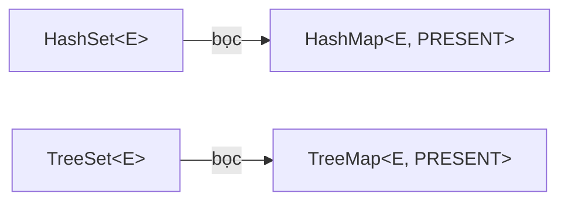

# List vs Map vs Set — Chọn đúng từ bản chất

## Mục lục

- [Cùng một bài toán, ba cấu trúc, ba câu trả lời khác nhau](#1-cùng-một-bài-toán-ba-cấu-trúc-ba-câu-trả-lời-khác-nhau)
- [List — dãy có thứ tự, cho phép trùng](#2-list--dãy-có-thứ-tự-cho-phép-trùng)
- [Set — tập hợp, loại trùng bằng cách nào?](#3-set--tập-hợp-loại-trùng-bằng-cách-nào)
- [Map — ánh xạ key→value](#4-map--ánh-xạ-keyvalue)
- [Set là Map "đội lốt"](#5-set-là-map-đội-lốt)
- [Null handling — ba thái độ khác nhau](#6-null-handling--ba-thái-độ-khác-nhau)
- [Thứ tự — insertion / sorted / không xác định](#7-thứ-tự--insertion--sorted--không-xác-định)
- [Độ phức tạp & bảng so sánh tổng hợp](#8-độ-phức-tạp--bảng-so-sánh-tổng-hợp)
- [Chuyển đổi qua lại & bẫy](#9-chuyển-đổi-qua-lại--bẫy)
- [Tóm tắt — Cheat sheet](#10-tóm-tắt--cheat-sheet)

---

## 1. Cùng một bài toán, ba cấu trúc, ba câu trả lời khác nhau

`List`, `Set` và `Map` là ba trụ cột của Collection: **List** là dãy có thứ tự cho phép trùng, **Set** là tập loại trùng, **Map** là ánh xạ key→value. Chúng quan trọng vì chọn đúng cấu trúc cho câu hỏi bạn hỏi nhiều nhất quyết định trực tiếp độ phức tạp — sai cấu trúc biến O(1) thành O(n), và đôi khi còn cho **kết quả sai** chứ không chỉ chậm.

Ví dụ: nhận danh sách user ID và cần "đếm số ID khác nhau" — chọn sai cấu trúc thì ra sai luôn:

```java
List<Long> ids = List.of(1L, 2L, 2L, 3L, 1L);

new ArrayList<>(ids).size();   // 5 — List GIỮ trùng
new HashSet<>(ids).size();     // 3 — Set LOẠI trùng  ← đáp án đúng
```

Còn "tra số lần xuất hiện của mỗi ID" — chỉ `Map` làm được tự nhiên:

```java
Map<Long, Long> count = ids.stream()
    .collect(Collectors.groupingBy(id -> id, Collectors.counting()));
// {1=2, 2=2, 3=1}
```

Ba cấu trúc trả lời ba câu hỏi khác nhau: **"thứ tự & lặp lại"** (List), **"có hay không / tập khác nhau"** (Set), **"ứng với key này là gì"** (Map).

> [!IMPORTANT]
> Chọn cấu trúc dữ liệu = chọn **câu hỏi bạn sẽ hỏi nhiều nhất**. Hỏi "phần tử thứ i?" → List. Hỏi "đã thấy chưa?" → Set. Hỏi "key này map tới gì?" → Map. Sai cấu trúc biến O(1) thành O(n).

Phần còn lại của doc sẽ đi qua: List — dãy có thứ tự cho trùng (§2) → Set — loại trùng bằng cách nào (§3) → Map — ánh xạ key→value (§4) → vì sao Set là Map "đội lốt" (§5) → null handling ba thái độ khác nhau (§6) → thứ tự insertion/sorted/không xác định (§7) → độ phức tạp & bảng so sánh (§8) → chuyển đổi qua lại & bẫy (§9) → cheat sheet (§10).

---

## 2. List — dãy có thứ tự, cho phép trùng

`List` là **dãy phần tử có chỉ số** (0-based), giữ nguyên thứ tự chèn và cho phép phần tử trùng. Hai implementation chính khác nhau ở cấu trúc bên trong:

| | `ArrayList` | `LinkedList` |
|---|------------|--------------|
| Cấu trúc | mảng động (`Object[]`) | doubly-linked list (node) |
| `get(i)` | **O(1)** | O(n) — phải đi từ đầu/cuối |
| `add` cuối | amortized O(1) | O(1) |
| `add`/`remove` giữa | O(n) (dịch mảng) | O(1) *nếu đã có node*, nhưng tìm node là O(n) |
| Bộ nhớ | gọn (mảng liền) | tốn (mỗi node 2 con trỏ + overhead) |

```java
// ArrayList tăng trưởng: khi đầy, cấp mảng mới lớn hơn 1.5x rồi copy
// (oldCapacity + (oldCapacity >> 1)) — đây là vì sao add amortized O(1)
```

> [!TIP]
> 95% trường hợp dùng `ArrayList`. `LinkedList` chỉ thắng khi bạn thêm/xoá liên tục ở **hai đầu** — và kể cả khi đó `ArrayDeque` thường nhanh hơn. Lợi thế "chèn giữa O(1)" của LinkedList gần như vô dụng vì bạn vẫn phải O(n) để *tìm* vị trí chèn.

---

## 3. Set — tập hợp, loại trùng bằng cách nào?

`Set` đảm bảo **không phần tử trùng**. Nhưng "trùng" định nghĩa thế nào phụ thuộc implementation:

| Implementation | Cơ chế loại trùng | Cấu trúc | Thứ tự |
|----------------|-------------------|----------|--------|
| `HashSet` | `hashCode()` + `equals()` | bảng băm (bọc `HashMap`) | không xác định |
| `LinkedHashSet` | `hashCode()` + `equals()` | băm + linked list | thứ tự chèn |
| `TreeSet` | `compareTo()`/`Comparator` | Red-Black Tree | sắp xếp |

Điểm chí mạng: `HashSet` dùng `hashCode/equals`, còn `TreeSet` dùng `compareTo` — **hai contract khác nhau** và phải nhất quán:

```java
// Nếu compareTo() == 0 nhưng equals() == false → TreeSet coi là TRÙNG,
// còn HashSet coi là KHÁC. Cùng dữ liệu, hai Set cho size khác nhau!
```

> [!WARNING]
> Bỏ một object **mutable** vào `HashSet` rồi đổi field ảnh hưởng `hashCode` → object "biến mất" (cùng bug như mutable key của HashMap). Với `TreeSet`, đổi field ảnh hưởng `compareTo` còn tệ hơn — cây mất bất biến thứ tự, `contains` trả sai. Luôn dùng phần tử immutable cho Set.

---

## 4. Map — ánh xạ key→value

`Map` lưu **cặp** key→value, tra cứu theo key. Cùng bộ ba implementation song song với Set (vì Set xây trên Map):

| Implementation | Cấu trúc | get/put | Thứ tự key |
|----------------|----------|---------|------------|
| `HashMap` | bảng băm | O(1) | không xác định |
| `LinkedHashMap` | băm + linked list | O(1) | chèn / truy cập (LRU) |
| `TreeMap` | Red-Black Tree | O(log n) | sắp xếp + range query |

`LinkedHashMap` còn có chế độ **access-order** — nền tảng để làm **LRU cache** chỉ trong vài dòng:

```java
new LinkedHashMap<K,V>(16, 0.75f, true) {       // true = access-order
    protected boolean removeEldestEntry(Map.Entry<K,V> e) {
        return size() > CAPACITY;                // tự xoá entry cũ nhất
    }
};
```

`TreeMap` cho các truy vấn mà `HashMap` không làm được: `firstKey`, `lastKey`, `floorKey(x)` (key lớn nhất ≤ x), `ceilingKey`, `subMap(a, b)` — hữu ích cho range query / tìm lân cận.

---

## 5. Set là Map "đội lốt"

Chi tiết cài đặt quan trọng: `HashSet` **chính là** một `HashMap` mà value là một object dummy chung:

```java
public class HashSet<E> {
    private transient HashMap<E,Object> map;
    private static final Object PRESENT = new Object();   // value giả dùng chung

    public boolean add(E e) {
        return map.put(e, PRESENT) == null;   // Set chỉ quan tâm KEY
    }
    public boolean contains(Object o) { return map.containsKey(o); }
}
```



> [!NOTE]
> Hệ quả: mọi tính chất hiệu năng và bẫy của `HashMap` (treeify, resize, hàm hash, mutable key) **áp dụng nguyên si** cho `HashSet`. Hiểu HashMap = hiểu luôn HashSet. Đây cũng là vì sao `HashSet` cấm trùng dựa trên `hashCode/equals` — vì nó dùng chính key của HashMap.

---

## 6. Null handling — ba thái độ khác nhau

| Cấu trúc | null |
|----------|------|
| `ArrayList` | cho phép nhiều `null` |
| `HashSet` | cho phép **đúng một** `null` |
| `HashMap` | một key `null`, nhiều value `null` |
| `TreeSet`/`TreeMap` | **NPE** (vì phải `compareTo(null)`) — trừ khi Comparator xử lý null |
| `ConcurrentHashMap` | **cấm hoàn toàn** null (key lẫn value) |

```java
new TreeMap<String,Integer>().put(null, 1);   // NullPointerException
new ConcurrentHashMap<>().put("k", null);      // NullPointerException
```

> [!WARNING]
> `ConcurrentHashMap` cấm null không phải tuỳ tiện: trong môi trường đa luồng, `get()` trả `null` sẽ mơ hồ — "key không tồn tại" hay "value là null"? Không có `containsKey` atomic để phân biệt. Cấm null loại bỏ sự mơ hồ này hoàn toàn.

---

## 7. Thứ tự — insertion / sorted / không xác định

Ba khái niệm "thứ tự" dễ nhầm:

```
HashMap/HashSet       → KHÔNG xác định (theo bucket, có thể đổi giữa các phiên bản JVM)
LinkedHashMap/Set     → thứ tự CHÈN (hoặc access-order cho LRU)
TreeMap/TreeSet       → thứ tự SẮP XẾP (theo compareTo/Comparator)
```

> [!TIP]
> Đừng bao giờ **dựa vào** thứ tự duyệt của `HashMap`/`HashSet` — nó là chi tiết cài đặt, có thể thay đổi. Cần thứ tự chèn ổn định → `LinkedHashMap`. Cần sắp xếp → `TreeMap`. Một bug kinh điển là test pass trên JDK này, fail trên JDK khác vì thứ tự bucket đổi.

---

## 8. Độ phức tạp & bảng so sánh tổng hợp

| Thao tác | ArrayList | LinkedList | HashSet | TreeSet | HashMap | TreeMap |
|----------|-----------|------------|---------|---------|---------|---------|
| get/lookup | O(1) idx | O(n) | O(1) | O(log n) | O(1) | O(log n) |
| add/put | O(1)* | O(1) đầu/cuối | O(1) | O(log n) | O(1) | O(log n) |
| contains | O(n) | O(n) | O(1) | O(log n) | O(1) key | O(log n) |
| remove | O(n) | O(1) node | O(1) | O(log n) | O(1) | O(log n) |
| thứ tự | chèn/index | chèn | không | sắp xếp | không | sắp xếp |
| null | nhiều | nhiều | 1 | không | 1 key | không |

`*` amortized (khi resize là O(n) một lần).

| Câu hỏi chính | Cấu trúc |
|---------------|----------|
| "Phần tử thứ i? Giữ thứ tự + trùng?" | **List** (`ArrayList`) |
| "Đã thấy chưa? Tập khác nhau?" | **Set** (`HashSet`) |
| "Key này map tới gì? Đếm/nhóm?" | **Map** (`HashMap`) |
| "Cần sắp xếp / range query?" | `TreeSet` / `TreeMap` |
| "Cần giữ thứ tự chèn / LRU?" | `LinkedHashSet` / `LinkedHashMap` |

---

## 9. Chuyển đổi qua lại & bẫy

```java
// List → Set (loại trùng, MẤT thứ tự nếu HashSet)
Set<T> set = new HashSet<>(list);
Set<T> ordered = new LinkedHashSet<>(list);   // loại trùng nhưng GIỮ thứ tự

// List → loại trùng nhưng giữ thứ tự + vẫn là List
List<T> distinct = list.stream().distinct().toList();

// Map → List các key/value/entry
List<K> keys = new ArrayList<>(map.keySet());

// đếm tần suất (List → Map)
Map<T, Long> freq = list.stream()
    .collect(Collectors.groupingBy(x -> x, Collectors.counting()));
```

> [!WARNING]
> `new HashSet<>(list)` để loại trùng sẽ **mất thứ tự gốc** — nếu thứ tự quan trọng (vd hiển thị cho user), dùng `LinkedHashSet` hoặc `stream().distinct()`. Và nhớ: `distinct()` dùng `equals/hashCode`, nên phần tử phải implement chúng đúng.

---

## 10. Tóm tắt — Cheat sheet

**Bản chất trong 3 dòng:**

```
List  → dãy có index, cho trùng, giữ thứ tự        → "phần tử thứ i"
Set   → tập, loại trùng (hashCode/equals hoặc cây) → "đã có chưa"
Map   → key→value, tra theo key                    → "key này là gì"
```

| Biến thể | List | Set | Map |
|----------|------|-----|-----|
| Mặc định nhanh | `ArrayList` | `HashSet` | `HashMap` |
| Giữ thứ tự chèn | (mặc định) | `LinkedHashSet` | `LinkedHashMap` |
| Sắp xếp | — | `TreeSet` | `TreeMap` |

**5 nguyên tắc khắc cốt:**

1. **Chọn theo câu hỏi hỏi nhiều nhất** — index/trùng (List), tồn tại (Set), tra key (Map).
2. **HashSet = HashMap đội lốt** — mọi bẫy của HashMap áp dụng.
3. **Phần tử/key phải immutable** với Set/Map băm và cây.
4. **Đừng dựa vào thứ tự của HashMap/HashSet** — dùng Linked/Tree khi cần.
5. **`HashSet` mất thứ tự khi loại trùng** — cần thứ tự thì `LinkedHashSet`.

> [!TIP]
> Một câu để nhớ: *List trả lời "ở đâu", Set trả lời "có không", Map trả lời "là gì" — chọn sai một trong ba và bạn đang trả giá O(n) cho thứ lẽ ra O(1).*
