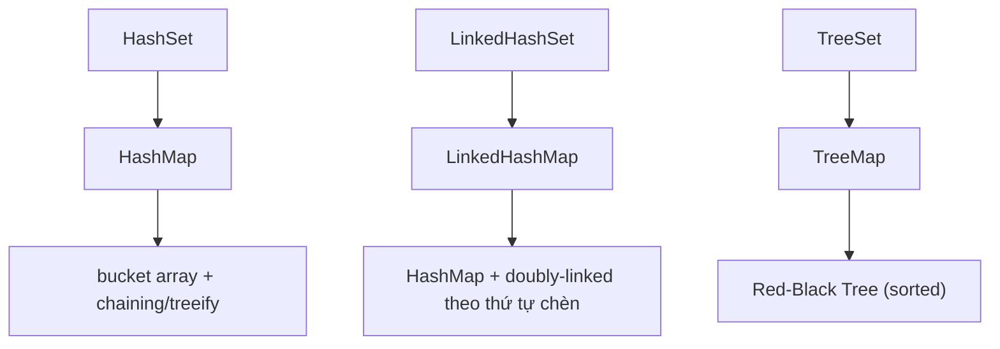
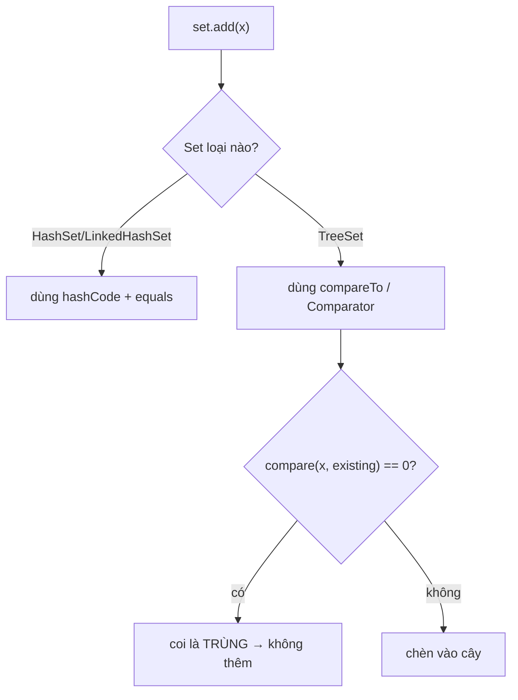
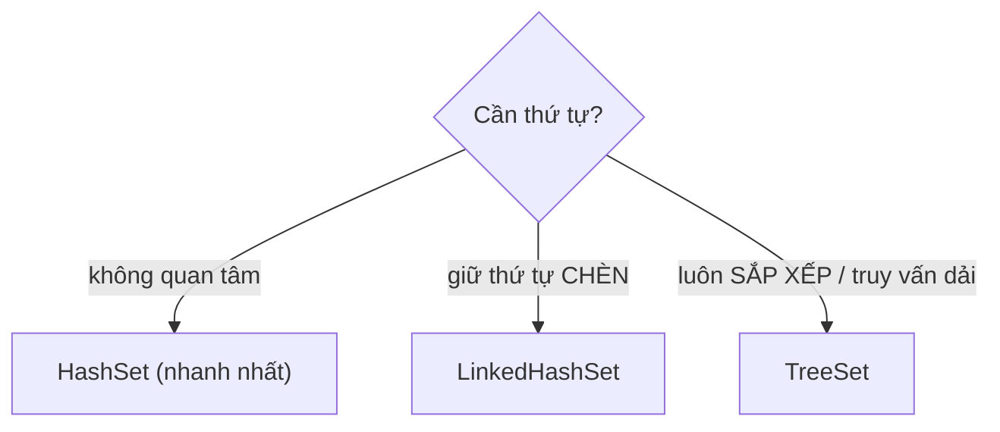

`HashSet`, `LinkedHashSet` và `TreeSet` đều loại bỏ phần tử trùng, nhưng chúng khác nhau về thứ tự, cách xác định trùng lặp và chi phí thao tác. Lựa chọn implementation phải xuất phát từ hợp đồng dữ liệu cần duy trì.

## Mục lục

- [Tổng quan](#1-tổng-quan)
- [Sự thật: Set chỉ là Map đội lốt](#2-sự-thật-set-chỉ-là-map-đội-lốt)
- [HashSet — HashMap với value giả PRESENT](#3-hashset--hashmap-với-value-giả-present)
- [LinkedHashSet — thêm doubly-linked giữ thứ tự chèn](#4-linkedhashset--thêm-doubly-linked-giữ-thứ-tự-chèn)
- [TreeSet — Red-Black Tree qua TreeMap](#5-treeset--red-black-tree-qua-treemap)
- [TreeSet dùng compareTo, KHÔNG dùng equals](#6-treeset-dùng-compareto-không-dùng-equals)
- [So sánh ba loại — thứ tự, độ phức tạp, null](#7-so-sánh-ba-loại--thứ-tự-độ-phức-tạp-null)
- [API điều hướng của TreeSet (NavigableSet)](#8-api-điều-hướng-của-treeset-navigableset)
- [Chọn Set nào & tuning](#9-chọn-set-nào--tuning)
- [Anti-patterns cần tránh](#10-anti-patterns-cần-tránh)
- [Tóm tắt — Cheat sheet & nguyên tắc](#11-tóm-tắt--cheat-sheet--nguyên-tắc)

---

## 1. Tổng quan

`HashSet` ưu tiên tra cứu nhanh và không bảo đảm thứ tự; `LinkedHashSet` giữ thứ tự chèn với chi phí bộ nhớ cao hơn; `TreeSet` duy trì thứ tự sắp xếp và xác định phần tử tương đương qua comparator hoặc `compareTo()`.

Sự khác biệt giữa `equals()` và phép so sánh thứ tự đặc biệt quan trọng. Một comparator không nhất quán với `equals()` có thể khiến `TreeSet` xem hai object khác nhau là cùng một phần tử.

## 2. Sự thật: Set chỉ là Map đội lốt

Bí mật lớn nhất của package `java.util`: `HashSet`, `LinkedHashSet`, `TreeSet` **không tự cài đặt cấu trúc dữ liệu nào cả**. Mỗi cái chỉ là một **wrapper mỏng** quanh một Map tương ứng, dùng **key của Map làm phần tử của Set** và một **value giả** chung cho mọi entry.

| Set | Backing Map | Cấu trúc thật |
|-----|-------------|----------------|
| `HashSet` | `HashMap` | bucket array + chain/tree |
| `LinkedHashSet` | `LinkedHashMap` | HashMap + doubly-linked list |
| `TreeSet` | `TreeMap` | Red-Black Tree |



> [!NOTE]
> Hệ quả thực dụng: mọi tính chất của Set (thứ tự, độ phức tạp, xử lý null, vì sao trùng) đều **kế thừa trực tiếp** từ Map backing. Nắm [HashMap Deep Dive](/collections/hashmap-deep-dive/) là đã nắm 90% HashSet.

---

## 3. HashSet — HashMap với value giả PRESENT

Đọc source `HashSet` (rút gọn) — nó mỏng đến bất ngờ:

```java
public class HashSet<E> implements Set<E> {
    private transient HashMap<E, Object> map;
    private static final Object PRESENT = new Object();   // value giả dùng chung

    public boolean add(E e) {
        return map.put(e, PRESENT) == null;   // put key=phần tử, value=PRESENT
    }                                          // put trả null nghĩa là key chưa có → thêm mới
    public boolean contains(Object o) { return map.containsKey(o); }
    public boolean remove(Object o)   { return map.remove(o) == PRESENT; }
    public int size()                 { return map.size(); }
}
```

- Phần tử Set = **key** của HashMap → mọi tính chất của key áp dụng: cần `equals`+`hashCode` đúng (xem [equals & hashCode](/fundamentals/equals-hashcode/)), phải immutable.
- `PRESENT` là **một object tĩnh duy nhất** chia sẻ cho mọi entry → value không tốn bộ nhớ thêm đáng kể.
- "Trùng" = `hashCode` + `equals` khớp (đúng như HashMap quyết định key trùng).

```
HashSet {"a", "b"}  thực chất là  HashMap { "a"→PRESENT, "b"→PRESENT }
```

Độ phức tạp = y hệt HashMap: `add`/`contains`/`remove` trung bình **O(1)**, worst-case O(log n) (sau treeify). Thứ tự duyệt **không xác định** (theo bucket, đổi sau resize).

> [!WARNING]
> Vì phần tử là key của HashMap, **mọi cái bẫy của HashMap key đều áp dụng**: phần tử mutable đổi field sau khi add → "biến mất" khỏi set (không `contains` lại được); `hashCode` hằng số → O(n). Phần tử Set phải immutable + có `equals`/`hashCode` đúng.

---

## 4. LinkedHashSet — thêm doubly-linked giữ thứ tự chèn

`LinkedHashSet` extends `HashSet` nhưng backing bằng `LinkedHashMap`. `LinkedHashMap` = `HashMap` + một **doubly-linked list** xuyên qua mọi entry theo **thứ tự chèn** (insertion order):

```
HashMap buckets (định vị O(1))         doubly-linked list (thứ tự duyệt)
  bucket[3] → "b"                        head → "a" ⇄ "b" ⇄ "c" → tail
  bucket[7] → "a", "c"                   (đúng thứ tự đã add)
```

- Mỗi entry có thêm 2 con trỏ `before`/`after` nối theo thứ tự chèn.
- `add`/`contains`/`remove` vẫn **O(1)** (định vị qua bucket như HashMap), chỉ thêm chi phí nhỏ chỉnh con trỏ linked list.
- Duyệt cho ra **đúng thứ tự đã chèn** — ổn định, không như HashSet.

```java
Set<String> s = new LinkedHashSet<>();
s.add("banana"); s.add("apple"); s.add("cherry");
System.out.println(s);   // [banana, apple, cherry]  — đúng thứ tự chèn
```

> [!TIP]
> `LinkedHashSet` là lựa chọn tốt khi cần **lọc trùng nhưng giữ thứ tự xuất hiện** — vd dedup một danh sách input mà vẫn giữ thứ tự gốc. Nó cũng cho thời gian duyệt nhanh hơn HashSet một chút (duyệt linked list thay vì quét toàn bucket array, kể cả bucket trống).

---

## 5. TreeSet — Red-Black Tree qua TreeMap

`TreeSet` backing bằng `TreeMap` — một **cây đỏ-đen (Red-Black Tree)**, cây nhị phân tìm kiếm **tự cân bằng**. Không có bucket, không hash; phần tử được giữ **luôn sắp xếp** theo `compareTo`/`Comparator`.

```
Red-Black Tree (luôn cân bằng, cao ~log n):
            [50,B]
           /      \
      [30,R]      [70,R]
      /    \      /    \
  [20,B] [40,B][60,B] [80,B]
  → duyệt in-order = 20,30,40,50,60,70,80 (đã sort)
```

- `add`/`contains`/`remove` = **O(log n)** (đi từ gốc xuống, so sánh mỗi mức).
- Cây tự cân bằng qua **xoay (rotation)** + **tô màu lại (recolor)** → chiều cao luôn ~2·log n, không bao giờ suy biến thành "danh sách" như BST thường.
- Duyệt in-order → phần tử **đã sắp xếp**.

> [!NOTE]
> TreeSet **không** dùng `hashCode`/`equals` chút nào. Phần tử **không cần** override hai method đó — nhưng **bắt buộc** `Comparable` hoặc bạn phải truyền `Comparator`, nếu không `add` ném `ClassCastException` ngay phần tử thứ hai.

---

## 6. TreeSet dùng compareTo, KHÔNG dùng equals

Đây là điểm khác biệt nền tảng và là nguồn của bug mục 1. `TreeMap`/`TreeSet` định nghĩa "hai phần tử trùng nhau" bằng **`compare(a,b) == 0`**, hoàn toàn **bỏ qua `equals`**:

```java
// HashSet: trùng = equals + hashCode
new HashSet<>(...).add(u1); add(u2);   // u1.equals(u2)? → quyết định trùng

// TreeSet: trùng = compare()==0
new TreeSet<>(byScore).add(u1); add(u2); // compare(u1,u2)==0? → quyết định trùng
```



> [!IMPORTANT]
> Nếu comparator của TreeSet trả `0` cho hai phần tử **không** `equals` nhau, phần tử thứ hai **bị nuốt**. Khắc phục: comparator phải **consistent với equals** — tie-break tới một field định danh duy nhất: `comparingInt(User::score).thenComparing(User::id)`. Đây là lý do Javadoc khuyến nghị mạnh "compareTo consistent với equals". Xem [Comparable vs Comparator](/fundamentals/comparable-vs-comparator/).

---

## 7. So sánh ba loại — thứ tự, độ phức tạp, null

| | `HashSet` | `LinkedHashSet` | `TreeSet` |
|---|-----------|------------------|-----------|
| Backing | HashMap | LinkedHashMap | TreeMap (Red-Black) |
| Thứ tự duyệt | **Không xác định** | **Thứ tự chèn** | **Sắp xếp** (compareTo) |
| add/contains/remove | O(1) tb | O(1) tb | **O(log n)** |
| Quyết định "trùng" | equals + hashCode | equals + hashCode | **compareTo/Comparator** |
| Cho phép `null` | **1 null** | **1 null** | **Không** (NPE khi so sánh) |
| Bộ nhớ/phần tử | thấp | + 2 con trỏ | + cấu trúc cây (color, left/right/parent) |
| Cần ở phần tử | equals+hashCode | equals+hashCode | Comparable / Comparator |

> [!WARNING]
> `TreeSet` **cấm `null`** (trừ comparator đặc biệt cho phép): so `null.compareTo(...)` → NPE. `HashSet`/`LinkedHashSet` cho đúng **một** `null` (vì HashMap cho một key null → bucket 0). Đừng nhét `null` vào TreeSet.

---

## 8. API điều hướng của TreeSet (NavigableSet)

Vì luôn sắp xếp, `TreeSet` (qua `NavigableSet`) cho các truy vấn thứ tự mà `HashSet` không có:

```java
NavigableSet<Integer> s = new TreeSet<>(List.of(10, 20, 30, 40, 50));

s.first();            // 10   — nhỏ nhất
s.last();             // 50   — lớn nhất
s.floor(25);          // 20   — phần tử lớn nhất ≤ 25
s.ceiling(25);        // 30   — phần tử nhỏ nhất ≥ 25
s.lower(30);          // 20   — lớn nhất < 30 (nghiêm ngặt)
s.higher(30);         // 40   — nhỏ nhất > 30 (nghiêm ngặt)
s.headSet(30);        // [10, 20]       — các phần tử < 30
s.tailSet(30);        // [30, 40, 50]   — các phần tử ≥ 30
s.subSet(20, 40);     // [20, 30]       — khoảng [20, 40)
s.descendingSet();    // [50,40,30,20,10] — view đảo ngược
```

Mọi thao tác này là **O(log n)** (đi xuống cây). Đây là lý do chọn `TreeSet` khi cần "truy vấn theo dải/lân cận", không chỉ vì muốn sort.

> [!TIP]
> Nếu chỉ cần lấy ra **đã sort một lần** từ một tập lớn, `HashSet` + `stream().sorted()` thường nhanh hơn duy trì `TreeSet` (vì mỗi add vào TreeSet là O(log n)). Chọn `TreeSet` khi cần **truy vấn dải/lân cận lặp lại** hoặc cần luôn-sắp-xếp tại mọi thời điểm.

---

## 9. Chọn Set nào & tuning



| Cần | Chọn |
|-----|------|
| Lọc trùng nhanh nhất, không cần thứ tự | `HashSet` |
| Lọc trùng + giữ thứ tự xuất hiện | `LinkedHashSet` |
| Luôn sắp xếp, floor/ceiling/subSet | `TreeSet` |
| Thread-safe | `ConcurrentHashMap.newKeySet()` / `CopyOnWriteArraySet` (xem [concurrent collections](/collections/concurrent-collections/)) |

Tuning `HashSet`: như HashMap, set `initialCapacity` nếu biết trước kích thước để tránh resize. `new HashSet<>(expectedSize / 0.75 + 1)` hoặc `HashSet.newHashSet(n)` (Java 19+).

---

## 10. Anti-patterns cần tránh

| Anti-pattern | Vì sao sai | Thay bằng |
|--------------|-----------|-----------|
| TreeSet với comparator không tie-break định danh | Phần tử "cùng khóa" bị nuốt | `.thenComparing(idField)` |
| Phần tử HashSet mutable đổi field sau add | "Biến mất" khỏi set | Phần tử immutable |
| Phần tử HashSet quên `equals`/`hashCode` | Không lọc được trùng | Override cặp / dùng `record` |
| Nhét `null` vào TreeSet | NPE khi so sánh | HashSet/LinkedHashSet nếu cần null |
| Dùng TreeSet chỉ để "lấy ra sorted một lần" | Mỗi add O(log n) phí | HashSet + `stream().sorted()` |
| Dựa vào thứ tự duyệt của HashSet | Không xác định, đổi sau resize | LinkedHashSet/TreeSet |

---

## 11. Tóm tắt — Cheat sheet & nguyên tắc

**Cỗ máy trong 5 dòng:**

```
1. Set = Map đội lốt: phần tử là KEY, value là PRESENT giả dùng chung
2. HashSet → HashMap (O(1), không thứ tự, equals+hashCode)
3. LinkedHashSet → LinkedHashMap (O(1), thứ tự CHÈN, +2 con trỏ/entry)
4. TreeSet → TreeMap Red-Black (O(log n), SẮP XẾP, compareTo)
5. TreeSet coi compare()==0 là TRÙNG (KHÔNG dùng equals) → tie-break id!
```

| | HashSet | LinkedHashSet | TreeSet |
|---|---------|---------------|---------|
| Thứ tự | không | chèn | sắp xếp |
| Tốc độ | O(1) | O(1) | O(log n) |
| null | 1 | 1 | không |
| Dựa vào | equals+hashCode | equals+hashCode | compareTo |

**5 nguyên tắc khắc cốt:**

1. **Set chỉ là Map đội lốt** — mọi tính chất kế thừa từ Map backing.
2. **HashSet cần `equals`+`hashCode` đúng**, phần tử immutable.
3. **TreeSet dùng `compareTo`, không `equals`** — tie-break tới field định danh.
4. **TreeSet cấm null**; HashSet/LinkedHashSet cho đúng một null.
5. **Chọn theo nhu cầu thứ tự**: không cần → HashSet; chèn → LinkedHashSet; sắp xếp/dải → TreeSet.

> [!TIP]
> Một câu để nhớ: *Đằng sau mỗi Set là một Map, và cách Map đó nhận diện key chính là cách Set nhận diện phần tử trùng.* HashSet hỏi "cùng hashCode + equals?", TreeSet hỏi "compare ra 0?" — và sự khác biệt đó quyết định phần tử nào được giữ.
