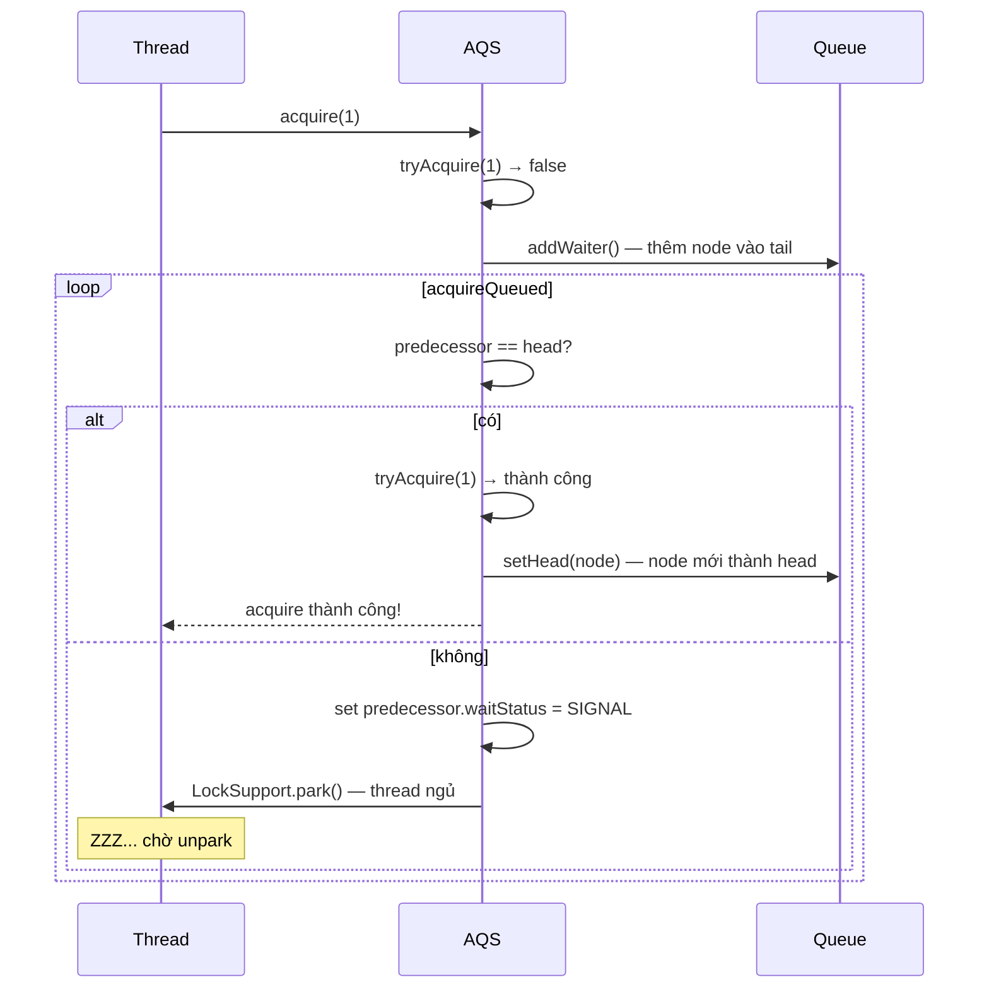

`AbstractQueuedSynchronizer` (AQS) là nền tảng dùng để xây dựng nhiều synchronizer trong `java.util.concurrent`, bao gồm `ReentrantLock`, `Semaphore`, `CountDownLatch` và `ReentrantReadWriteLock`. Nó tách việc quản lý hàng đợi thread khỏi quy tắc cấp quyền truy cập của từng synchronizer.

## Mục lục

- [Tổng quan](#1-tổng-quan)
- [AQS là gì — framework xây synchronizer](#2-aqs-là-gì--framework-xây-synchronizer)
- [State — một int quyết định mọi thứ](#3-state--một-int-quyết-định-mọi-thứ)
- [CLH Queue biến thể — hàng đợi thread chờ lock](#4-clh-queue-biến-thể--hàng-đợi-thread-chờ-lock)
- [Exclusive mode — acquire() và release() chi tiết](#5-exclusive-mode--acquire-và-release-chi-tiết)
- [Shared mode — acquireShared() và releaseShared()](#6-shared-mode--acquireshared-và-releaseshared)
- [ReentrantLock internals — fair vs unfair trên AQS](#7-reentrantlock-internals--fair-vs-unfair-trên-aqs)
- [Semaphore internals — shared permits trên AQS](#8-semaphore-internals--shared-permits-trên-aqs)
- [CountDownLatch internals — shared count-down trên AQS](#9-countdownlatch-internals--shared-count-down-trên-aqs)
- [ReentrantReadWriteLock — state chia đôi 16 bit](#10-reentrantreadwritelock--state-chia-đôi-16-bit)
- [ConditionObject — wait/signal trên AQS](#11-conditionobject--waitsignal-trên-aqs)
- [Cancellation & timeout — node bị huỷ trong queue](#12-cancellation--timeout--node-bị-huỷ-trong-queue)
- [Tóm tắt — Cheat sheet & 5 nguyên tắc](#13-tóm-tắt--cheat-sheet--5-nguyên-tắc)

---

## 1. Tổng quan

AQS quản lý một giá trị trạng thái bằng CAS và một hàng đợi chờ kiểu CLH. Subclass chỉ cần định nghĩa cách acquire/release state ở chế độ exclusive hoặc shared; phần xếp hàng, park, unpark và xử lý hủy chờ được framework đảm nhiệm.

Hiểu cấu trúc này giúp đọc được hành vi của các lock cấp cao, phân tích fairness và contention, đồng thời tránh tự triển khai cơ chế đồng bộ thiếu an toàn.

## 2. AQS là gì — framework xây synchronizer

`AbstractQueuedSynchronizer` (package `java.util.concurrent.locks`) là abstract class. Mỗi synchronizer (Lock, Semaphore, Latch...) **extends AQS** (thường là inner class `Sync`):

```java
// ReentrantLock bên trong:
public class ReentrantLock {
    abstract static class Sync extends AbstractQueuedSynchronizer { ... }
    static final class NonfairSync extends Sync { ... }
    static final class FairSync extends Sync { ... }
    private final Sync sync;
}

// Semaphore:
public class Semaphore {
    abstract static class Sync extends AbstractQueuedSynchronizer { ... }
}

// CountDownLatch:
public class CountDownLatch {
    private static final class Sync extends AbstractQueuedSynchronizer { ... }
}
```

AQS cung cấp:
1. **`state`** (int, volatile) — ý nghĩa do subclass quy định.
2. **FIFO wait queue** (CLH variant) — quản lý thread chờ.
3. **`acquire`/`release`** algorithm — subclass chỉ override "thử" (try).

---

## 3. State — một int quyết định mọi thứ

```java
private volatile int state;

protected final int getState() { return state; }
protected final void setState(int newState) { state = newState; }
protected final boolean compareAndSetState(int expect, int update) {
    return U.compareAndSetInt(this, STATE, expect, update);
}
```

| Synchronizer | state nghĩa là | acquire khi | release khi |
|-------------|----------------|-------------|-------------|
| ReentrantLock | Số lần lock (0 = unlocked, >0 = locked) | CAS 0→1 (hoặc +1 nếu reentrant) | -1, release khi về 0 |
| Semaphore | Số permits còn lại | CAS state - permits >= 0 | CAS state + permits |
| CountDownLatch | Số countdown còn lại | acquire thành công khi state == 0 | CAS state - 1 |
| ReentrantReadWriteLock | High 16 bit = read count, low 16 = write count | Tuỳ read/write mode | Tuỳ mode |

> [!NOTE]
> State chỉ là 1 `int` — ý nghĩa hoàn toàn do subclass tự quy định thông qua `tryAcquire`/`tryRelease`. AQS không biết "lock" hay "permit" là gì — nó chỉ biết "acquire thành công" hay "thất bại cần xếp hàng".

---

## 4. CLH Queue biến thể — hàng đợi thread chờ lock

Khi thread không acquire được (tryAcquire trả false), nó được đưa vào **FIFO queue** dạng **doubly-linked list** (biến thể của CLH lock queue):

```java
static final class Node {
    volatile int waitStatus;    // SIGNAL(-1), CANCELLED(1), CONDITION(-2), PROPAGATE(-3), 0
    volatile Node prev;         // node trước
    volatile Node next;         // node sau
    volatile Thread thread;     // thread đang chờ
    Node nextWaiter;            // dùng cho Condition queue hoặc SHARED/EXCLUSIVE marker

    static final int CANCELLED =  1;   // thread đã cancel, node sẽ bị gỡ
    static final int SIGNAL    = -1;   // successor cần unpark khi node này release
    static final int CONDITION = -2;   // node đang trong condition queue
    static final int PROPAGATE = -3;   // shared release cần propagate
}

// Queue pointers:
private transient volatile Node head;   // head (dummy node, thread = null)
private transient volatile Node tail;   // tail
```

```
Queue structure:
head (dummy) ←→ Node[t1, SIGNAL] ←→ Node[t2, SIGNAL] ←→ Node[t3, 0] = tail
                     ↑                      ↑                    ↑
                thread t1 park         thread t2 park       thread t3 park (hoặc vừa enqueue)
```

**waitStatus = SIGNAL (-1)**: nghĩa là "khi node này release/cancel, phải `unpark` successor". Thread chỉ park khi predecessor có `waitStatus == SIGNAL` — đảm bảo sẽ được đánh thức.

> [!IMPORTANT]
> Queue dùng **dummy head node** — node đầu tiên không chứa thread chờ. Khi head release, node thứ 2 trở thành head mới (thread của nó được unpark). Design này tránh race condition khi queue rỗng → có 1 thread enqueue.

---

## 5. Exclusive mode — acquire() và release() chi tiết

### 5.1. acquire()

```java
public final void acquire(int arg) {
    if (!tryAcquire(arg) &&                          // ① Thử acquire (subclass override)
        acquireQueued(addWaiter(Node.EXCLUSIVE), arg)) // ② Thất bại → enqueue + park
        selfInterrupt();                              // ③ Nếu bị interrupt khi chờ → set flag
}
```

**① `tryAcquire(arg)`** — subclass override. VD ReentrantLock: CAS state 0→1.

**② `addWaiter()`** — thêm node vào cuối queue:

```java
private Node addWaiter(Node mode) {
    Node node = new Node(mode);  // mode = EXCLUSIVE hoặc SHARED
    for (;;) {
        Node oldTail = tail;
        if (oldTail != null) {
            node.setPrevRelaxed(oldTail);       // set prev trước
            if (compareAndSetTail(oldTail, node)) {  // CAS tail
                oldTail.next = node;            // link next sau CAS
                return node;
            }
        } else {
            initializeSyncQueue();  // queue rỗng → tạo dummy head + tail
        }
    }
}
```

**③ `acquireQueued()`** — vòng lặp: park → unpark → thử acquire lại:

```java
final boolean acquireQueued(final Node node, int arg) {
    boolean interrupted = false;
    for (;;) {
        final Node p = node.predecessor();
        // Nếu predecessor là head → thử acquire (tới lượt mình)
        if (p == head && tryAcquire(arg)) {
            setHead(node);       // thành công → trở thành head mới
            p.next = null;       // giải phóng head cũ cho GC
            return interrupted;
        }
        // Chưa tới lượt hoặc tryAcquire thất bại → park
        if (shouldParkAfterFailedAcquire(p, node) &&  // set predecessor SIGNAL
            parkAndCheckInterrupt())                   // LockSupport.park(this)
            interrupted = true;
    }
}
```



### 5.2. release()

```java
public final boolean release(int arg) {
    if (tryRelease(arg)) {         // subclass: giảm state, return true nếu fully released
        Node h = head;
        if (h != null && h.waitStatus != 0)
            unparkSuccessor(h);    // unpark thread đầu queue
        return true;
    }
    return false;
}

private void unparkSuccessor(Node node) {
    int ws = node.waitStatus;
    if (ws < 0) node.compareAndSetWaitStatus(ws, 0);  // clear SIGNAL
    Node s = node.next;
    if (s == null || s.waitStatus > 0) {  // next bị CANCELLED → tìm từ tail ngược lại
        s = null;
        for (Node p = tail; p != node && p != null; p = p.prev)
            if (p.waitStatus <= 0) s = p;
    }
    if (s != null) LockSupport.unpark(s.thread);  // đánh thức successor
}
```

> [!TIP]
> `unparkSuccessor` tìm successor từ **tail ngược lại** (không phải từ head đi tới) khi `next == null` hoặc bị cancel. Lý do: `addWaiter` set `prev` trước `next` — có window mà `prev` set xong nhưng `next` chưa set. Đi từ tail ngược qua prev luôn thấy đầy đủ node.

---

## 6. Shared mode — acquireShared() và releaseShared()

Khác exclusive (chỉ 1 thread acquire), shared cho phép **nhiều thread** acquire đồng thời (VD: Semaphore 10 permits, ReadLock nhiều reader):

```java
public final void acquireShared(int arg) {
    if (tryAcquireShared(arg) < 0)      // < 0 = thất bại, cần xếp hàng
        doAcquireShared(arg);
}

// tryAcquireShared returns:
//   negative = fail (cần queue)
//   0        = success, nhưng không còn permits cho thread sau
//   positive = success, CÒN permits cho thread sau → propagate
```

**Propagation**: khi 1 thread được unpark và acquire shared thành công với return > 0, nó **tiếp tục unpark thread sau** trong queue (nếu cũng shared). Chain reaction cho đến khi hết permits:

```java
private void setHeadAndPropagate(Node node, int propagate) {
    Node h = head;
    setHead(node);
    // Propagate: nếu còn permits HOẶC waitStatus == PROPAGATE → unpark next
    if (propagate > 0 || h == null || h.waitStatus < 0 || ...) {
        Node s = node.next;
        if (s == null || s.isShared())
            doReleaseShared();  // unpark next shared waiter
    }
}
```

> [!NOTE]
> Trong exclusive mode, release chỉ unpark **1 thread** (successor). Trong shared mode, release kích hoạt **chain propagation** — mỗi thread vừa được unpark lại unpark thread tiếp theo. Đây là cách CountDownLatch đánh thức TẤT CẢ thread chờ cùng lúc.

---

## 7. ReentrantLock internals — fair vs unfair trên AQS

### 7.1. Unfair (default)

```java
// NonfairSync.tryAcquire:
final boolean nonfairTryAcquire(int acquires) {
    final Thread current = Thread.currentThread();
    int c = getState();
    if (c == 0) {
        // CAS ngay — KHÔNG kiểm tra queue có ai chờ không
        if (compareAndSetState(0, acquires)) {
            setExclusiveOwnerThread(current);
            return true;
        }
    }
    // Reentrant: cùng thread lock lại → tăng state
    else if (current == getExclusiveOwnerThread()) {
        int nextc = c + acquires;
        if (nextc < 0) throw new Error("Maximum lock count exceeded");
        setState(nextc);  // không cần CAS — chỉ owner mới vào đây
        return true;
    }
    return false;
}
```

### 7.2. Fair

```java
// FairSync.tryAcquire:
protected final boolean tryAcquire(int acquires) {
    final Thread current = Thread.currentThread();
    int c = getState();
    if (c == 0) {
        // hasQueuedPredecessors() — kiểm tra có ai chờ TRƯỚC mình không
        if (!hasQueuedPredecessors() && compareAndSetState(0, acquires)) {
            setExclusiveOwnerThread(current);
            return true;
        }
    }
    else if (current == getExclusiveOwnerThread()) { ... } // reentrant
    return false;
}
```

| | Unfair | Fair |
|-|--------|------|
| Thread mới đến | CAS ngay, có thể **chen hàng** | Kiểm tra queue → xếp cuối |
| Throughput | **Cao hơn** (ít context switch) | Thấp hơn (~2x) |
| Starvation | Có thể (thread trong queue bị "starve") | **Không** — FIFO nghiêm ngặt |
| Default | ✅ | Phải chỉ định `new ReentrantLock(true)` |

> [!TIP]
> Unfair nhanh hơn vì: thread vừa release và thread mới đến có thể **tự acquire mà không cần unpark thread trong queue** (tránh context switch). Với workload throughput-sensitive, unfair tốt hơn. Với latency-sensitive (mỗi thread cần response trong bounded time), dùng fair.

---

## 8. Semaphore internals — shared permits trên AQS

```java
// Semaphore.Sync:
final int nonfairTryAcquireShared(int acquires) {
    for (;;) {
        int available = getState();                   // permits hiện có
        int remaining = available - acquires;         // permits sau acquire
        if (remaining < 0 ||                          // không đủ → return negative (fail)
            compareAndSetState(available, remaining))  // CAS giảm permits
            return remaining;  // negative = fail → queue; >= 0 = success
    }
}

protected final boolean tryReleaseShared(int releases) {
    for (;;) {
        int current = getState();
        int next = current + releases;               // trả permits
        if (next < current) throw new Error("Maximum permit count exceeded");
        if (compareAndSetState(current, next))
            return true;  // triggers doReleaseShared → unpark waiters
    }
}
```

```
state = 3 (3 permits)
Thread A: acquire(1) → state = 2, success
Thread B: acquire(1) → state = 1, success
Thread C: acquire(1) → state = 0, success
Thread D: acquire(1) → state would be -1 → FAIL → enqueue, park

Thread A: release(1) → state = 1 → unpark Thread D
Thread D: retry acquire(1) → state = 0, success!
```

---

## 9. CountDownLatch internals — shared count-down trên AQS

```java
// CountDownLatch.Sync:
protected int tryAcquireShared(int acquires) {
    return (getState() == 0) ? 1 : -1;   // thành công KHI state == 0
}

protected boolean tryReleaseShared(int releases) {
    for (;;) {
        int c = getState();
        if (c == 0) return false;         // đã == 0, không cần release thêm
        int nextc = c - 1;
        if (compareAndSetState(c, nextc))
            return nextc == 0;            // return true KHI count về 0 → trigger unpark all
    }
}
```

```java
CountDownLatch latch = new CountDownLatch(3);  // state = 3

// 3 worker threads:
worker(() -> { doWork(); latch.countDown(); });  // state: 3→2
worker(() -> { doWork(); latch.countDown(); });  // state: 2→1
worker(() -> { doWork(); latch.countDown(); });  // state: 1→0 → unpark ALL waiters

// Main thread:
latch.await();  // tryAcquireShared: state != 0 → park. Khi state=0 → unpark → continue
```

> [!NOTE]
> CountDownLatch là **one-shot**: khi state về 0, không thể reset. `await()` trên latch đã "mở" return ngay lập tức. Cần reuse → dùng `CyclicBarrier` hoặc `Phaser`.

---

## 10. ReentrantReadWriteLock — state chia đôi 16 bit

Một `int` state, chia thành 2 nửa:
- **High 16 bits**: shared read lock count
- **Low 16 bits**: exclusive write lock count (+ reentrant count)

```java
static final int SHARED_SHIFT   = 16;
static final int SHARED_UNIT    = (1 << SHARED_SHIFT);       // 0x00010000
static final int MAX_COUNT      = (1 << SHARED_SHIFT) - 1;   // 65535
static final int EXCLUSIVE_MASK = (1 << SHARED_SHIFT) - 1;   // 0x0000FFFF

static int sharedCount(int c)    { return c >>> SHARED_SHIFT; }  // read count
static int exclusiveCount(int c) { return c & EXCLUSIVE_MASK; }  // write count
```

```
state = 0x00030002
         ^^^^ ^^^^
         │    └── write lock held 2 times (reentrant)
         └────── 3 readers currently holding read lock
```

**Read lock acquire** (shared mode):
- Nếu write lock **không** held (hoặc held bởi chính mình) → CAS tăng high 16 bits.
- Nếu write lock held bởi thread khác → block.

**Write lock acquire** (exclusive mode):
- Nếu state == 0 → CAS set low 16 bits.
- Nếu read lock held bởi ai (high bits > 0) → block (kể cả chính mình hold read!).
- Nếu write already held bởi chính mình → reentrant (tăng low bits).

> [!WARNING]
> **Lock downgrade** (write → read) được phép: giữ write lock, acquire read lock, release write lock. **Lock upgrade** (read → write) **KHÔNG** được phép — sẽ deadlock (thread hold read, muốn write, nhưng write cần wait read release = chính mình).

---

## 11. ConditionObject — wait/signal trên AQS

`Condition` (thay thế `Object.wait/notify`) được implement bởi AQS inner class `ConditionObject`:

```java
public class ConditionObject implements Condition {
    private transient Node firstWaiter;   // đầu condition queue
    private transient Node lastWaiter;    // cuối condition queue
    // Condition queue: singly-linked list (dùng node.nextWaiter)
}
```

**Hai queue riêng biệt:**
- **Sync queue** (AQS): thread chờ acquire lock (head ↔ tail).
- **Condition queue**: thread đã gọi `await()` — chờ signal.

### 11.1. await()

```java
public final void await() throws InterruptedException {
    Node node = addConditionWaiter();   // thêm vào condition queue
    int savedState = fullyRelease(node); // release lock (trả hết reentrant count)
    int interruptMode = 0;
    while (!isOnSyncQueue(node)) {       // chưa được signal (chưa chuyển sang sync queue)
        LockSupport.park(this);          // park
        if ((interruptMode = checkInterruptWhileWaiting(node)) != 0)
            break;
    }
    // Đã được signal → node chuyển sang sync queue → acquireQueued để lấy lock lại
    if (acquireQueued(node, savedState) && interruptMode != THROW_IE)
        interruptMode = REINTERRUPT;
    // Cleanup + handle interrupt
}
```

### 11.2. signal()

```java
public final void signal() {
    if (!isHeldExclusively()) throw new IllegalMonitorStateException();
    Node first = firstWaiter;
    if (first != null)
        doSignal(first);  // chuyển node từ condition queue → sync queue tail
}

private void doSignal(Node first) {
    do {
        if ((firstWaiter = first.nextWaiter) == null)
            lastWaiter = null;
        first.nextWaiter = null;
    } while (!transferForSignal(first) && (first = firstWaiter) != null);
    // transferForSignal: CAS node.waitStatus CONDITION→0, enqueue vào sync queue
}
```

```
TRƯỚC signal:
  Sync queue: [head] ←→ [t2, SIGNAL] ←→ [t3, 0]
  Condition queue: [t4] → [t5] → null

SAU signal(t4):
  Sync queue: [head] ←→ [t2, SIGNAL] ←→ [t3, SIGNAL] ←→ [t4, 0]
  Condition queue: [t5] → null
  → t4 chuyển từ condition queue sang cuối sync queue, chờ acquire lock
```

> [!IMPORTANT]
> `signal()` **không** đánh thức thread ngay — nó chuyển node sang sync queue. Thread chỉ thực sự chạy khi **acquire lock thành công** (tới lượt trong sync queue). Khác với `Object.notify()` cho thread vào "ready" ngay.

---

## 12. Cancellation & timeout — node bị huỷ trong queue

Khi thread bị interrupt hoặc timeout trong `tryAcquireNanos()`:

```java
// acquireQueued with timeout:
if (nanosTimeout <= 0L) {
    cancelAcquire(node);   // đánh dấu node CANCELLED
    return;
}
```

Node bị CANCELLED (`waitStatus = 1`) sẽ bị gỡ khỏi queue bởi thread successor (trong `shouldParkAfterFailedAcquire`):

```java
private static boolean shouldParkAfterFailedAcquire(Node pred, Node node) {
    int ws = pred.waitStatus;
    if (ws == Node.SIGNAL) return true;    // predecessor sẽ unpark → safe to park
    if (ws > 0) {
        // Predecessor bị CANCELLED → skip qua tất cả CANCELLED node
        do { node.prev = pred = pred.prev; } while (pred.waitStatus > 0);
        pred.next = node;
    } else {
        pred.compareAndSetWaitStatus(ws, Node.SIGNAL);  // set predecessor SIGNAL
    }
    return false;  // chưa park — quay lại spin thử acquire 1 lần nữa
}
```

> [!NOTE]
> Cancelled node không bị remove ngay — nó được **lazy cleanup** bởi thread tiếp theo đi qua. Design này tránh cần lock khi remove node giữa queue (vốn phức tạp trong concurrent linked list).

---

## 13. Tóm tắt — Cheat sheet & 5 nguyên tắc

**Cỗ máy trong 6 dòng:**

```
1. state (volatile int): ý nghĩa do subclass quy định (lock count, permits, countdown)
2. tryAcquire/tryRelease: subclass override — CAS trên state
3. acquire thất bại → node vào CLH queue tail (CAS) → park
4. release → unpark head.next → thread thử tryAcquire lại
5. Exclusive: 1 thread acquire. Shared: nhiều thread acquire + propagation
6. ConditionObject: await() release lock + park, signal() chuyển node sang sync queue
```

| Synchronizer | Mode | state meaning | tryAcquire logic |
|-------------|------|---------------|------------------|
| ReentrantLock | Exclusive | lock count (0=free) | CAS 0→1 hoặc +1 reentrant |
| Semaphore | Shared | permits remaining | CAS state - n >= 0 |
| CountDownLatch | Shared | countdown remaining | success khi state == 0 |
| ReadWriteLock (write) | Exclusive | low 16 bits | CAS low bits, check high = 0 |
| ReadWriteLock (read) | Shared | high 16 bits | CAS high bits, check low = 0 or self |

**5 nguyên tắc khắc cốt:**

1. **AQS = state + queue + park/unpark** — mọi synchronizer phức tạp đều quy về: "CAS state thành công?" Không → xếp hàng.
2. **Subclass chỉ override try*** — `tryAcquire`, `tryRelease`, `tryAcquireShared`, `tryReleaseShared`. Queue management, park, cancel do AQS lo.
3. **Fair vs Unfair = có check queue trước CAS không** — unfair cho phép chen → throughput cao hơn, có thể starvation.
4. **Shared propagation** — acquire shared thành công + còn permits → unpark node tiếp theo. Chain reaction đánh thức hàng loạt thread.
5. **ConditionObject dùng queue riêng** — await() chuyển sang condition queue, signal() chuyển ngược về sync queue. Thread chỉ chạy khi acquire lock sau signal.

> [!TIP]
> Một câu để nhớ: *AQS là "hệ điều hành thu nhỏ" cho concurrency primitives — nó quản lý hàng đợi thread, đánh thức đúng thứ tự, và cho phép cancel/timeout. Viết synchronizer mới chỉ cần 1 int state + vài dòng CAS.*
