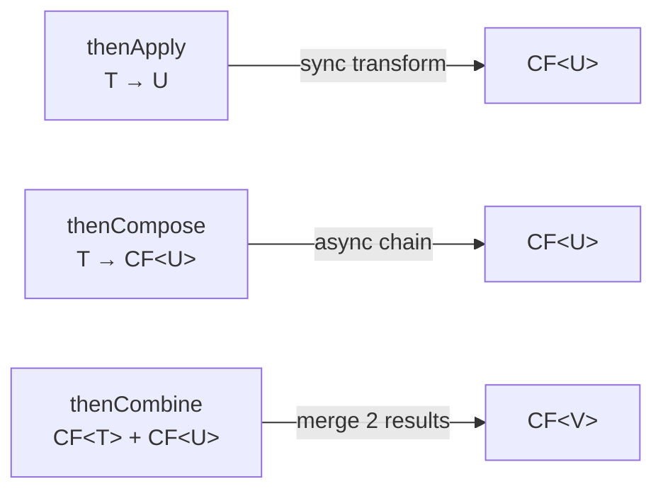
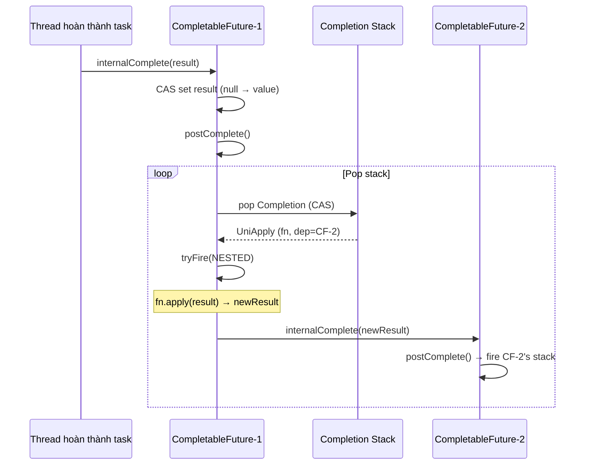

## Mục lục

- [Bối cảnh: 5 API call tuần tự — 2.5s latency, parallel chỉ 600ms](#1-bối-cảnh-5-api-call-tuần-tự--25s-latency-parallel-chỉ-600ms)
- [CompletableFuture vs Future — tại sao cần nó](#2-completablefuture-vs-future--tại-sao-cần-nó)
- [Execution Thread — ai chạy cái gì, ở đâu?](#3-execution-thread--ai-chạy-cái-gì-ở-đâu)
- [Composition: thenApply vs thenCompose vs thenCombine](#4-composition-thenapply-vs-thencompose-vs-thencombine)
- [Exception Handling — exceptionally, handle, whenComplete](#5-exception-handling--exceptionally-handle-whencomplete)
- [allOf / anyOf — orchestrate nhiều futures](#6-allof--anyof--orchestrate-nhiều-futures)
- [Timeout & Cancellation (JDK 9+)](#7-timeout--cancellation-jdk-9)
- [Pipeline Patterns thực chiến](#8-pipeline-patterns-thực-chiến)
- [Internal: Completion Stack & Trigger](#9-internal-completion-stack--trigger)
- [So sánh: CompletableFuture vs RxJava vs Reactor](#10-so-sánh-completablefuture-vs-rxjava-vs-reactor)
- [Anti-patterns & production pitfalls](#11-anti-patterns--production-pitfalls)
- [Tóm tắt — Cheat sheet & 5 nguyên tắc](#12-tóm-tắt--cheat-sheet--5-nguyên-tắc)

---

## 1. Bối cảnh: 5 API call tuần tự — 2.5s latency, parallel chỉ 600ms

Bạn xây trang product detail cần dữ liệu từ 5 microservices:

```java
// Tuần tự — tổng latency = sum(5 calls)
Product product = productService.get(id);       // 500ms
List<Review> reviews = reviewService.get(id);    // 400ms
Pricing pricing = pricingService.get(id);        // 300ms
Inventory inv = inventoryService.get(id);        // 200ms
Recommendation rec = recService.get(id);         // 600ms
// Tổng: 2000ms (tuần tự vì dùng blocking call)
```

Dùng `CompletableFuture` — chạy **song song**:

```java
var productF  = CompletableFuture.supplyAsync(() -> productService.get(id));
var reviewsF  = CompletableFuture.supplyAsync(() -> reviewService.get(id));
var pricingF  = CompletableFuture.supplyAsync(() -> pricingService.get(id));
var invF      = CompletableFuture.supplyAsync(() -> inventoryService.get(id));
var recF      = CompletableFuture.supplyAsync(() -> recService.get(id));

CompletableFuture.allOf(productF, reviewsF, pricingF, invF, recF).join();

// Tổng: max(500, 400, 300, 200, 600) = 600ms — giảm 70%!
return new ProductDetail(productF.join(), reviewsF.join(), ...);
```

> [!IMPORTANT]
> `CompletableFuture` không phải "async for fun" — nó giải quyết bài toán: **orchestrate I/O-bound tasks song song** + **compose kết quả** mà không cần callback hell hay blocking thread.

---

## 2. CompletableFuture vs Future — tại sao cần nó

| Feature | `Future<T>` | `CompletableFuture<T>` |
|---------|-----------|----------------------|
| Get result | `get()` — **blocking** | `get()` + **non-blocking composition** |
| Chain operations | ❌ | ✅ `thenApply`, `thenCompose`, ... |
| Combine results | ❌ (manual) | ✅ `thenCombine`, `allOf`, `anyOf` |
| Handle exceptions | ❌ (try/catch around get) | ✅ `exceptionally`, `handle` |
| Complete manually | ❌ | ✅ `complete(value)`, `completeExceptionally(ex)` |
| Non-blocking callback | ❌ | ✅ `thenAccept`, `whenComplete` |
| Timeout | ❌ (get with timeout, still blocks) | ✅ `orTimeout`, `completeOnTimeout` (JDK 9) |

```java
// Future: phải block để lấy kết quả
Future<String> future = executor.submit(() -> fetchData());
String result = future.get();  // BLOCK here — thread wasted

// CompletableFuture: chain non-blocking
CompletableFuture.supplyAsync(() -> fetchData())
    .thenApply(data -> parse(data))
    .thenAccept(parsed -> save(parsed));  // không block calling thread
```

---

## 3. Execution Thread — ai chạy cái gì, ở đâu?

### 3.1. Default executor

| Method | Executor mặc định |
|--------|-------------------|
| `supplyAsync(supplier)` | **ForkJoinPool.commonPool()** |
| `supplyAsync(supplier, executor)` | Custom executor |
| `thenApply(fn)` | Thread hoàn thành stage trước **HOẶC** calling thread |
| `thenApplyAsync(fn)` | ForkJoinPool.commonPool() |
| `thenApplyAsync(fn, executor)` | Custom executor |

### 3.2. Ai chạy `thenApply`?

```java
CompletableFuture.supplyAsync(() -> {
    // Chạy trên ForkJoinPool thread
    return expensiveIO();
}).thenApply(result -> {
    // Chạy trên ???
    // Nếu supplyAsync CHƯA xong khi thenApply được đăng ký → chạy trên ForkJoinPool thread (cùng thread hoàn thành)
    // Nếu supplyAsync ĐÃ xong → chạy trên calling thread (thread gọi thenApply)
    return transform(result);
});
```

> [!WARNING]
> `thenApply` (không có Async) = **indeterminate thread**. Có thể chạy trên calling thread (main, Tomcat handler) — nếu fn nặng → block calling thread. **Luôn dùng `thenApplyAsync`** nếu fn tốn thời gian hoặc khi cần đảm bảo non-blocking.

### 3.3. Custom executor cho I/O

```java
// ForkJoinPool.commonPool() = CPU cores - 1 threads
// KHÔNG phù hợp cho blocking I/O (đánh cắp thread từ parallel stream)

ExecutorService ioPool = Executors.newFixedThreadPool(32);  // dedicated I/O pool

CompletableFuture.supplyAsync(() -> httpClient.get(url), ioPool)
    .thenApplyAsync(resp -> parse(resp), ioPool);
```

> [!TIP]
> Rule of thumb: CPU-bound → commonPool (default). I/O-bound → custom pool size = `2 * CPU * (1 + wait_time/compute_time)`. Hoặc dùng Virtual Thread executor (JDK 21+): `Executors.newVirtualThreadPerTaskExecutor()`.

---

## 4. Composition: thenApply vs thenCompose vs thenCombine

### 4.1. thenApply — transform value (map)

```java
// T → U: giống Stream.map()
CompletableFuture<String> nameFuture = 
    getUserFuture(id)
    .thenApply(user -> user.getName());  // User → String
```

### 4.2. thenCompose — flatMap (chain async)

```java
// T → CompletableFuture<U>: giống Stream.flatMap()
CompletableFuture<Order> orderFuture = 
    getUserFuture(id)
    .thenCompose(user -> getOrderFuture(user.getId()));  // async → async
    // KHÔNG dùng thenApply ở đây — sẽ cho CompletableFuture<CompletableFuture<Order>>!
```

### 4.3. thenCombine — kết hợp 2 futures

```java
// Chờ CẢ HAI hoàn thành, combine kết quả
CompletableFuture<String> greeting = 
    getFirstNameFuture()
    .thenCombine(getLastNameFuture(), 
        (first, last) -> first + " " + last);
```



| Method | Input → Output | Analogy |
|--------|---------------|---------|
| `thenApply` | `T → U` | `Stream.map()` |
| `thenCompose` | `T → CF<U>` | `Stream.flatMap()` |
| `thenCombine` | `CF<T>` + `CF<U>` → `V` | `zip` |
| `thenAccept` | `T → void` | `forEach` |
| `thenRun` | `() → void` (ignore result) | side-effect |

---

## 5. Exception Handling — exceptionally, handle, whenComplete

### 5.1. Exception propagation

Exception trong pipeline **propagate downstream** — stages sau nhận `CompletionException`:

```java
CompletableFuture.supplyAsync(() -> {
    throw new RuntimeException("boom");   // stage 1 fails
}).thenApply(x -> x + "!")                 // SKIPPED
  .thenApply(x -> x + "?")                // SKIPPED
  .exceptionally(ex -> "fallback");        // CATCHES: ex = CompletionException wrapping "boom"
```

### 5.2. Ba cách handle exception

```java
// 1. exceptionally — chỉ handle error, trả fallback value
cf.exceptionally(ex -> {
    log.error("Failed", ex);
    return defaultValue;
});

// 2. handle — nhận CẢ result VÀ exception (giống bifunction)
cf.handle((result, ex) -> {
    if (ex != null) return defaultValue;
    return transform(result);
});

// 3. whenComplete — peek (không đổi result/exception)
cf.whenComplete((result, ex) -> {
    if (ex != null) metrics.recordFailure();
    else metrics.recordSuccess();
});
// result/exception KHÔNG đổi — chỉ side-effect
```

| Method | Trả value mới? | Nhận exception? | Nhận result? |
|--------|----------------|-----------------|--------------|
| `exceptionally` | ✅ | ✅ | ❌ |
| `handle` | ✅ | ✅ | ✅ |
| `whenComplete` | ❌ (preserve) | ✅ | ✅ |

### 5.3. JDK 12+: exceptionallyAsync, exceptionallyCompose

```java
// exceptionallyCompose: recover bằng async operation (retry, fallback service)
cf.exceptionallyCompose(ex -> 
    CompletableFuture.supplyAsync(() -> fallbackService.get(id))
);
```

---

## 6. allOf / anyOf — orchestrate nhiều futures

### 6.1. allOf — chờ TẤT CẢ

```java
CompletableFuture<Void> all = CompletableFuture.allOf(f1, f2, f3, f4, f5);
all.join();  // block cho đến khi TẤT CẢ hoàn thành (hoặc 1 fail)

// Lấy kết quả:
Result r1 = f1.join();  // đã hoàn thành — không block
Result r2 = f2.join();
```

> [!NOTE]
> `allOf` trả `CompletableFuture<Void>` — không giữ kết quả. Bạn phải `.join()` từng future riêng. Nếu bất kỳ future fail → `allOf` future cũng fail (complete exceptionally).

### 6.2. anyOf — dùng kết quả NHANH NHẤT

```java
CompletableFuture<Object> fastest = CompletableFuture.anyOf(f1, f2, f3);
Object result = fastest.join();  // kết quả từ future hoàn thành đầu tiên
```

### 6.3. Pattern: collect results from allOf

```java
public static <T> CompletableFuture<List<T>> allOfList(
        List<CompletableFuture<T>> futures) {
    return CompletableFuture.allOf(futures.toArray(CompletableFuture[]::new))
        .thenApply(v -> futures.stream()
            .map(CompletableFuture::join)
            .toList());
}

// Dùng:
List<CompletableFuture<Response>> calls = urls.stream()
    .map(url -> CompletableFuture.supplyAsync(() -> httpGet(url)))
    .toList();

List<Response> responses = allOfList(calls).join();
```

---

## 7. Timeout & Cancellation (JDK 9+)

### 7.1. orTimeout

```java
CompletableFuture<Response> resp = callService()
    .orTimeout(3, TimeUnit.SECONDS);  // fail nếu không xong trong 3s
    // throws TimeoutException (wrapped in CompletionException)
```

### 7.2. completeOnTimeout

```java
CompletableFuture<Response> resp = callService()
    .completeOnTimeout(defaultResponse, 3, TimeUnit.SECONDS);
    // trả defaultResponse nếu timeout — KHÔNG throw
```

### 7.3. Cancellation

```java
CompletableFuture<String> cf = CompletableFuture.supplyAsync(() -> slowOperation());

cf.cancel(true);  // complete với CancellationException
// NHƯNG: supplier vẫn có thể đang chạy! cancel() không interrupt thread.
```

> [!WARNING]
> `cancel()` trên CompletableFuture **không** interrupt task đang chạy (khác với `Future.cancel(true)` trên ForkJoinTask). Nó chỉ complete CF với `CancellationException`. Nếu cần interrupt, phải tự quản lý qua executor.

---

## 8. Pipeline Patterns thực chiến

### 8.1. Retry with exponential backoff

```java
public <T> CompletableFuture<T> retryAsync(
        Supplier<CompletableFuture<T>> action, int maxRetries) {
    CompletableFuture<T> cf = action.get();
    for (int i = 0; i < maxRetries; i++) {
        int attempt = i;
        cf = cf.exceptionallyCompose(ex -> {
            long delay = (long) Math.pow(2, attempt) * 100;
            return delay(delay).thenCompose(v -> action.get());
        });
    }
    return cf;
}

private CompletableFuture<Void> delay(long ms) {
    return CompletableFuture.runAsync(() -> {}, 
        CompletableFuture.delayedExecutor(ms, TimeUnit.MILLISECONDS));
}
```

### 8.2. Fan-out / Fan-in

```java
// Fan-out: phát 1 request → N parallel tasks
// Fan-in: collect N results → 1 response
public CompletableFuture<AggregatedResult> aggregate(Request req) {
    var tasks = partitions.stream()
        .map(p -> CompletableFuture.supplyAsync(() -> query(p, req)))
        .toList();
    
    return CompletableFuture.allOf(tasks.toArray(CompletableFuture[]::new))
        .thenApply(v -> tasks.stream()
            .map(CompletableFuture::join)
            .reduce(AggregatedResult::merge)
            .orElse(AggregatedResult.empty()));
}
```

### 8.3. Circuit breaker wrapper

```java
public <T> CompletableFuture<T> withCircuitBreaker(
        Supplier<CompletableFuture<T>> action, T fallback) {
    if (circuitBreaker.isOpen()) {
        return CompletableFuture.completedFuture(fallback);
    }
    return action.get()
        .orTimeout(2, TimeUnit.SECONDS)
        .handle((result, ex) -> {
            if (ex != null) {
                circuitBreaker.recordFailure();
                return fallback;
            }
            circuitBreaker.recordSuccess();
            return result;
        });
}
```

---

## 9. Internal: Completion Stack & Trigger — cách CF hoạt động bên trong

Bên trong, `CompletableFuture` duy trì một **stack** các dependent actions (Completion objects):

```java
// CompletableFuture core fields:
volatile Object result;       // null = chưa xong | value | AltResult(exception)
volatile Completion stack;    // Treiber stack (lock-free, CAS-push)

static abstract class Completion {
    volatile Completion next;   // linked list (stack element)
    abstract CompletableFuture<?> tryFire(int mode);
    // mode: SYNC(0), ASYNC(1), NESTED(-1)
}
```

### 9.1. Memory layout

```
┌─────────────────────────────────────────┐
│         CompletableFuture<T>             │
│                                          │
│  result: null → (khi complete) → value   │
│                                          │
│  stack: ──→ UniApply ──→ UniAccept ──→ null
│             (CF-2)       (CF-3)          │
│             ↓             ↓              │
│          dep=CF-2      dep=CF-3          │
│          fn=lambda1    fn=lambda2        │
└─────────────────────────────────────────┘
```

### 9.2. Treiber Stack — CAS-based lock-free push

```java
// Push completion vào stack (simplified):
final boolean tryPushStack(Completion c) {
    Completion h = stack;       // read current top
    c.next = h;                 // link new node to current top
    return STACK.compareAndSet(this, h, c);  // CAS swap
    // Nếu CAS fail (thread khác push đồng thời) → retry
}
```

**Tại sao Treiber Stack?** Nhiều threads có thể gọi `thenApply()` đồng thời trên cùng CF → cần lock-free push. CAS retry đảm bảo correctness mà không cần lock.

### 9.3. Flow chi tiết khi CF complete



### 9.4. Thread execution: ai chạy completion?

| Variant | Thread chạy fn |
|---------|---------------|
| `thenApply(fn)` | **Thread hoàn thành source** HOẶC **calling thread** (race condition!) |
| `thenApplyAsync(fn)` | **Pool thread** (guaranteed async) |
| `thenApplyAsync(fn, executor)` | Thread từ **executor chỉ định** |

**Tại sao thenApply có thể chạy trên calling thread?**

```java
cf.thenApply(fn);  // gọi lúc cf ĐÃ complete → fn chạy ngay trên calling thread
cf.thenApply(fn);  // gọi lúc cf CHƯA complete → fn chạy trên completing thread sau này
```

Đây là source of **unexpected behavior**: nếu `fn` tốn thời gian và bạn gọi `thenApply` trên event loop thread khi CF đã complete → **block event loop**!

### 9.5. result field — encoding trick

```java
volatile Object result;  // 3 trạng thái encoded:
// (1) null           → chưa complete
// (2) value (Object) → success, result = value
// (3) AltResult(ex)  → failed, result = wrapper chứa exception
//     AltResult(null) → completed with null (phân biệt với "chưa complete")

static final class AltResult {
    final Throwable ex;  // null nếu complete thành công với null value
}
```

**Tại sao cần AltResult?** Vì `null` đã dùng cho "chưa complete" → cần wrapper để biểu thị "complete thành công với giá trị null".

> [!TIP]
> `CompletableFuture` là **push-based** (observer pattern): khi complete → notify dependents. Khác với `Future.get()` là **pull-based** (polling/blocking). Hiểu internal giúp: (1) biết khi nào fn chạy trên thread nào, (2) tránh blocking event loop, (3) debug chain bằng cách nhìn stack field.

---

## 10. So sánh: CompletableFuture vs RxJava vs Reactor

| Tiêu chí | CompletableFuture | RxJava | Reactor (Project) |
|----------|-------------------|--------|-------------------|
| Cardinality | **1 value** (hoặc error) | 0..N values (Observable) | 0..N (Flux) / 0..1 (Mono) |
| Backpressure | ❌ | ✅ (Flowable) | ✅ (built-in) |
| Lazy? | **Eager** (chạy ngay khi tạo) | **Lazy** (chạy khi subscribe) | **Lazy** |
| Cancel | Limited | ✅ (dispose) | ✅ (cancel signal) |
| JDK dependency | ✅ (built-in, JDK 8+) | External lib | External lib |
| Use case | Orchestrate async I/O | Event streams, complex async | Spring WebFlux |

> [!IMPORTANT]
> `CompletableFuture` phù hợp cho: **(1)** orchestrate vài async tasks, **(2)** compose results, **(3)** simple timeout/retry. Nếu cần **stream processing**, **backpressure**, hoặc **complex event handling** → RxJava/Reactor.

---

## 11. Anti-patterns & production pitfalls

| Anti-pattern | Vì sao sai | Giải pháp |
|--------------|-----------|-----------|
| `.get()` không timeout | Block vĩnh viễn nếu task hang | `.get(5, SECONDS)` hoặc `.orTimeout()` |
| Blocking I/O trên commonPool | Đánh cắp thread từ parallel stream/VT scheduler | Custom executor cho I/O |
| `thenApply` (non-async) với fn nặng | Có thể block calling thread | `thenApplyAsync` |
| Swallow exception (empty exceptionally) | Bug bị ẩn | Log + propagate hoặc throw |
| Chain quá dài không handle exception | Exception propagate âm thầm | `handle()` ở cuối chain |
| `allOf` + không check từng future | Nếu 1 fail, kết quả khác vẫn bị bỏ | Check từng future separately |
| `join()` trên event loop/handler thread | Block I/O thread → deadlock/starvation | Non-blocking composition |

**Tránh block calling thread:**

```java
// ❌ Block Tomcat handler thread:
@GetMapping("/data")
public Response getData() {
    return callServiceAsync().join();  // block handler thread!
}

// ✅ Return CF cho framework handle:
@GetMapping("/data")
public CompletableFuture<Response> getData() {
    return callServiceAsync();  // Tomcat release thread ngay
}
```

---

## 12. Tóm tắt — Cheat sheet & 5 nguyên tắc

**Cỗ máy trong 6 dòng:**

```
1. supplyAsync → chạy task trên pool thread, trả CF<T>
2. thenApply = map (sync), thenCompose = flatMap (async chain)
3. allOf = chờ tất cả, anyOf = dùng kết quả nhanh nhất
4. Exception propagate downstream, catch bằng exceptionally/handle
5. orTimeout/completeOnTimeout (JDK 9+) — giới hạn thời gian chờ
6. Non-async methods (thenApply) chạy trên thread hoàn thành HOẶC calling thread — cẩn thận
```

| Pattern | Method |
|---------|--------|
| Transform result | `thenApply` / `thenApplyAsync` |
| Chain async operation | `thenCompose` |
| Combine 2 results | `thenCombine` |
| Wait all | `allOf` + individual `.join()` |
| Race (first wins) | `anyOf` |
| Fallback on error | `exceptionally` / `handle` |
| Timeout | `orTimeout` / `completeOnTimeout` |
| Retry | `exceptionallyCompose` + loop |

**5 nguyên tắc khắc cốt:**

1. **Custom pool cho I/O** — đừng block commonPool. `Executors.newFixedThreadPool(N)` hoặc VT executor.
2. **Dùng Async variant** nếu fn có thể tốn thời gian — `thenApplyAsync`, `thenComposeAsync`.
3. **Luôn handle exception** — ít nhất `whenComplete` để log. CF âm thầm swallow exception nếu không ai `.get()`.
4. **Luôn set timeout** — `orTimeout(N, SECONDS)`. Không có timeout = potential memory leak (CF sống vĩnh viễn).
5. **allOf cho fan-out/fan-in** — song song hoá independent I/O calls, latency = max(calls) thay vì sum.

> [!TIP]
> Một câu để nhớ: *CompletableFuture biến sequential I/O thành parallel orchestration — latency giảm từ sum xuống max. Nhưng luôn nhớ: timeout mọi thứ, handle mọi exception, và đừng bao giờ block pool thread.*
