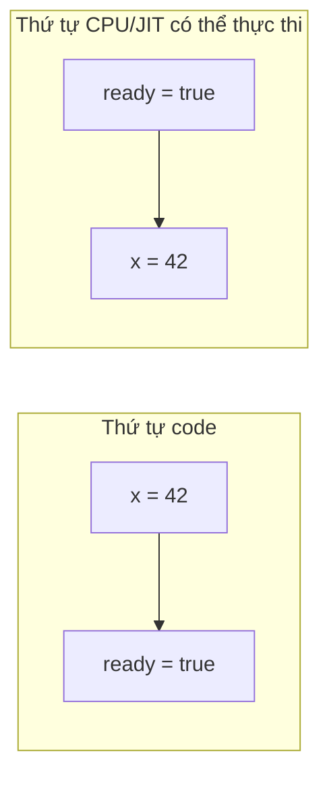
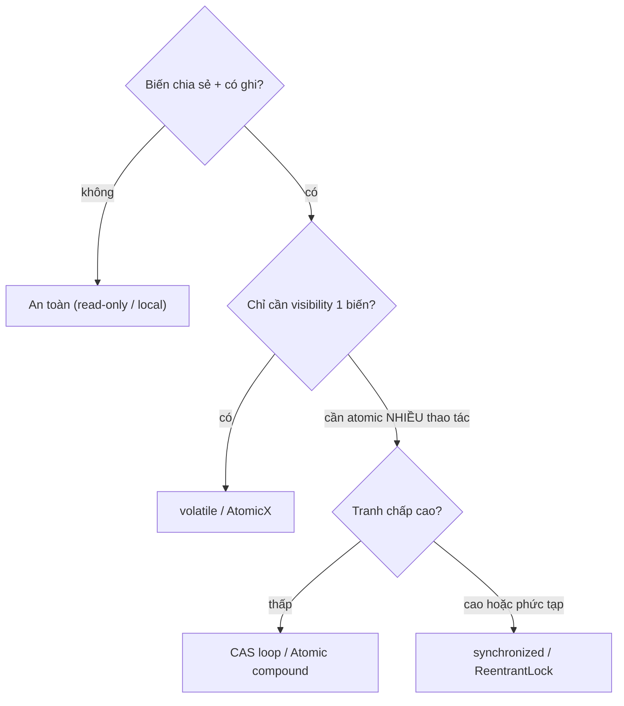

# Data Race vs Race Condition — Hai con quỷ khác nhau

## Mục lục

- [Hai bug, hai nguyên nhân, hay bị gọi nhầm tên](#1-hai-bug-hai-nguyên-nhân-hay-bị-gọi-nhầm-tên)
- [Data race — định nghĩa chính xác theo JMM](#2-data-race--định-nghĩa-chính-xác-theo-jmm)
- [Vì sao data race nguy hiểm: visibility & reordering](#3-vì-sao-data-race-nguy-hiểm-visibility--reordering)
- [Race condition — lỗi logic theo thứ tự](#4-race-condition--lỗi-logic-theo-thứ-tự)
- [Bốn tổ hợp: có/không data race × có/không race condition](#5-bốn-tổ-hợp-cókhông-data-race--cókhông-race-condition)
- [Benign vs harmful race](#6-benign-vs-harmful-race)
- [Cách phát hiện](#7-cách-phát-hiện)
- [Cách khắc phục](#8-cách-khắc-phục)
- [Anti-patterns cần tránh](#9-anti-patterns-cần-tránh)
- [Tóm tắt — Cheat sheet](#10-tóm-tắt--cheat-sheet)

---

## 1. Hai bug, hai nguyên nhân, hay bị gọi nhầm tên

"Data race" và "race condition" thường bị gộp làm một, nhưng chúng là hai lỗi **khác hẳn về bản chất**: một cái thuộc mô hình bộ nhớ (JMM), một cái thuộc logic chương trình. Phân biệt rạch ròi hai khái niệm này là nền tảng để sửa đúng — `volatile`/`Atomic` xoá được data race nhưng không xoá được race condition. Bắt đầu từ ví dụ kinh điển.

Đây là `counter++` chạy trên 2 thread, mỗi thread tăng 1 triệu lần:

```java
class Counter {
    int value = 0;
    void inc() { value++; }   // KHÔNG atomic: read → add → write
}
```

Kết quả cuối **nhỏ hơn 2.000.000** — kinh điển. Nhưng vì sao? Có **hai** vấn đề chồng lên nhau ở đây, và chúng *khác nhau về bản chất*:

1. **Data race**: hai thread đọc/ghi `value` đồng thời không đồng bộ → JMM không đảm bảo thread này thấy giá trị mới nhất của thread kia (visibility), thậm chí compiler/CPU được phép sắp xếp lại lệnh.
2. **Race condition**: `value++` gồm 3 bước (read-modify-write); hai thread xen kẽ → một update bị "đè" (lost update) — đây là lỗi *logic* về thứ tự, độc lập với vấn đề bộ nhớ.

Phần còn lại của doc sẽ đi qua: định nghĩa chính xác data race theo JMM (§2) → vì sao nó nguy hiểm — visibility & reordering (§3) → race condition là gì (§4) → 4 tổ hợp có/không data race × có/không race condition (§5) → benign vs harmful (§6) → cách phát hiện (§7) → cách khắc phục (§8).

> [!IMPORTANT]
> **Data race** là khái niệm ở tầng **mô hình bộ nhớ** (memory model — về visibility & ordering). **Race condition** là khái niệm ở tầng **logic chương trình** (về thứ tự các thao tác tạo kết quả sai). Một chương trình có thể có cái này mà không có cái kia. Gộp chúng làm một là sai lầm phổ biến nhất khi nói về concurrency.

---

## 2. Data race — định nghĩa chính xác theo JMM

Theo **Java Memory Model** (JSR-133), một **data race** xảy ra khi:

> Hai thread truy cập **cùng một biến**, **ít nhất một** là ghi, và **không có quan hệ happens-before** giữa chúng.

Ba điều kiện đồng thời:

```
1. cùng địa chỉ bộ nhớ (biến chia sẻ)
2. ≥ 1 truy cập là write
3. không được sắp thứ tự bởi happens-before (synchronized/volatile/...)
```

Nếu thiếu bất kỳ điều kiện nào → **không** phải data race:

- Cả hai chỉ đọc → không race (read-read luôn an toàn).
- Có `synchronized`/`volatile` tạo happens-before → không race.
- Biến local (trên stack, không chia sẻ) → không race.

> [!NOTE]
> "happens-before" là **xương sống** của JMM: nếu hành động A happens-before B thì mọi thứ A ghi đều **nhìn thấy được** ở B. `synchronized`, `volatile`, `Thread.start/join`, `final` field, các lớp `java.util.concurrent` đều tạo cạnh happens-before. Data race = **thiếu** cạnh đó.

---

## 3. Vì sao data race nguy hiểm: visibility & reordering

Data race không chỉ làm "đọc giá trị cũ". Nó cho phép những hành vi *phản trực giác*:

### 3.1. Visibility — thread không bao giờ thấy update

```java
boolean stop = false;        // KHÔNG volatile
// Thread 1: while (!stop) { ... }   ← có thể chạy MÃI MÃI
// Thread 2: stop = true;            ← Thread 1 có thể không bao giờ thấy
```

JIT được phép **cache** `stop` vào thanh ghi (vì không có lệnh nào nói nó thay đổi), biến vòng lặp thành `while(true)`. Đây là data race, sửa bằng `volatile boolean stop`.

### 3.2. Reordering — lệnh bị sắp xếp lại

```java
int x = 0; boolean ready = false;
// Thread 1:  x = 42; ready = true;
// Thread 2:  if (ready) print(x);   ← có thể in 0!
```

Không có happens-before, compiler/CPU được phép sắp `ready = true` **trước** `x = 42`. Thread 2 thấy `ready` nhưng `x` vẫn 0.



> [!WARNING]
> Data race là **undefined behavior** ở mức JMM — không phải "đôi khi sai giá trị" mà là "compiler được tự do giả định nó không xảy ra và tối ưu dựa trên đó". Đừng bao giờ "chấp nhận" một data race vì "thực tế chạy ổn" — nó là quả bom hẹn giờ qua các phiên bản JVM/CPU.

---

## 4. Race condition — lỗi logic theo thứ tự

**Race condition**: kết quả đúng/sai **phụ thuộc thứ tự (timing)** thực thi của nhiều thread. Hai dạng phổ biến:

### 4.1. Read-modify-write (như `value++`)

```java
value++;   // tách thành: t1=read(value); t2=t1+1; write(value)=t2
// Thread A và B cùng read 5 → cùng write 6 → mất một lần tăng
```

### 4.2. Check-then-act (TOCTOU)

```java
if (!map.containsKey(k)) {   // check
    map.put(k, compute());   // act — thread khác có thể đã put giữa hai dòng
}
// Sửa: map.putIfAbsent(k, ...) / computeIfAbsent — atomic
```

```java
// Lazy init kinh điển — race condition
if (instance == null)          // hai thread cùng thấy null
    instance = new Service();  // tạo HAI instance
```

> [!TIP]
> Race condition thường ẩn ở các thao tác "tưởng đơn lẻ" nhưng thật ra **gồm nhiều bước**: `++`, `check-then-act`, `read-then-write`. Quy tắc: nếu một bất biến phụ thuộc nhiều thao tác, **cả nhóm** phải atomic — đó là lý do `ConcurrentHashMap` cung cấp `compute`/`merge`/`putIfAbsent`.

---

## 5. Bốn tổ hợp: có/không data race × có/không race condition

Đây là phần làm rõ nhất sự khác biệt:

| | Có race condition | Không race condition |
|---|-------------------|----------------------|
| **Có data race** | `value++` không sync (cả hai bug) | hiếm; vd ghi `long` không volatile (word tearing) nhưng logic đúng |
| **Không data race** | `value++` dùng `synchronized` riêng từng phần nhưng logic sai thứ tự; hoặc dùng `AtomicInteger` cho từng op nhưng check-then-act giữa nhiều op | code đúng hoàn toàn |

Ví dụ **race condition KHÔNG data race** (quan trọng nhất để hiểu):

```java
private final AtomicInteger count = new AtomicInteger();
// Mỗi thao tác atomic → KHÔNG data race
if (count.get() < LIMIT) {     // get() atomic
    count.incrementAndGet();   // inc atomic
}
// NHƯNG: giữa get() và inc(), thread khác có thể đã tăng → vượt LIMIT
// → race condition, dù KHÔNG hề có data race
```

> [!IMPORTANT]
> Dùng `Atomic*` / `volatile` xoá được **data race** nhưng **không** tự động xoá **race condition**. Mỗi thao tác đơn lẻ an toàn, nhưng *tổ hợp* nhiều thao tác vẫn cần atomic ở mức cao hơn (lock, CAS loop, hoặc method compound của concurrent collection).

---

## 6. Benign vs harmful race

Không phải mọi race đều gây hại. **Benign race** = race mà kết quả vẫn đúng bất kể thứ tự:

```java
// Lazy init "racy single-check" cho object immutable (String) — benign
private String cachedName;
String name() {
    String n = cachedName;        // có thể đọc cũ
    if (n == null) {
        n = computeName();        // tính lại — vô hại vì kết quả luôn bằng nhau
        cachedName = n;           // race ghi, nhưng giá trị giống nhau
    }
    return n;
}
```

> [!WARNING]
> "Benign" cực kỳ khó đúng và phụ thuộc tinh tế vào JMM (chỉ an toàn nếu giá trị **immutable** và có thể tính lặp lại cho cùng kết quả). 99% trường hợp bạn nghĩ là benign thì thực ra harmful. Trừ khi bạn là chuyên gia JMM, **coi mọi race là harmful** và sửa.

---

## 7. Cách phát hiện

Race khó tái hiện vì phụ thuộc timing. Công cụ:

| Công cụ | Phát hiện | Ghi chú |
|---------|-----------|---------|
| `jcstress` | cả data race lẫn race condition | harness chính thức của OpenJDK, chạy hàng tỉ lần với mọi interleaving |
| ThreadSanitizer (tsan) | data race | dành cho native; JVM dùng bản thử nghiệm |
| Code review + JMM reasoning | cả hai | quan trọng nhất — không công cụ nào thay được hiểu biết |
| Stress test + assertion | race condition | tăng thread, lặp nhiều, kiểm bất biến |
| `-Xint` / đổi JVM/CPU | bộc lộ reordering ẩn | hành vi đổi giữa interpreter vs JIT |

> [!TIP]
> Race **không** xuất hiện đều — test pass 1000 lần không chứng minh code đúng. Dùng `jcstress` cho code concurrency nghiêm túc; nó cố tình tạo mọi thứ tự xen kẽ có thể để lộ bug mà test thường bỏ sót.

---

## 8. Cách khắc phục



| Vấn đề | Công cụ |
|--------|---------|
| Visibility 1 biến | `volatile` |
| Counter / cờ đơn | `AtomicInteger`/`AtomicLong`/`AtomicBoolean` |
| check-then-act trên Map | `putIfAbsent`/`computeIfAbsent`/`merge` |
| Bất biến trên nhiều biến | `synchronized` / `ReentrantLock` |
| Bất biến chỉ cần publish 1 lần | `final` field (an toàn nhờ JMM) |
| Tránh state chia sẻ hoàn toàn | immutable object / confinement (`ThreadLocal`) |

> [!TIP]
> Cách "sửa" tốt nhất là **không chia sẻ state mutable** ngay từ đầu: object immutable, biến local, message passing. Không có biến chia sẻ → không data race → không race condition trên nó. Đồng bộ là phương án khi buộc phải chia sẻ.

---

## 9. Anti-patterns cần tránh

| Anti-pattern | Vì sao sai | Thay bằng |
|--------------|-----------|-----------|
| `volatile` cho `count++` | volatile đảm bảo visibility, KHÔNG atomic RMW | `AtomicInteger.incrementAndGet()` |
| `synchronized` nửa vời (chỉ getter hoặc chỉ setter) | thiếu happens-before một chiều → vẫn race | đồng bộ cả đọc lẫn ghi |
| Atomic cho từng op rồi check-then-act | mỗi op atomic nhưng tổ hợp không | CAS loop / lock bao cả nhóm |
| Tin "test pass nên không có race" | race phụ thuộc timing | jcstress / reasoning JMM |
| "Benign race" tuỳ tiện | gần như luôn harmful thực sự | đồng bộ đúng |
| Double-checked locking thiếu `volatile` | reordering publish object chưa init xong | `volatile` instance hoặc holder idiom |

---

## 10. Tóm tắt — Cheat sheet

**Phân biệt trong 4 dòng:**

```
Data race      = vi phạm JMM: ≥1 write + cùng biến + không happens-before
                 → hậu quả: visibility sai, reordering, UNDEFINED behavior
Race condition = lỗi LOGIC: kết quả phụ thuộc thứ tự thực thi
                 → vd lost update (++), check-then-act (TOCTOU)
```

| | Tầng | Sửa bằng |
|---|------|----------|
| Data race | memory model | `volatile`, `final`, happens-before |
| Race condition | logic | atomic compound (lock/CAS/method compound) |

**5 nguyên tắc khắc cốt:**

1. **Data race ≠ race condition** — một về bộ nhớ, một về logic; có thể tồn tại độc lập.
2. **`volatile`/`Atomic` xoá data race, KHÔNG xoá race condition** trên tổ hợp nhiều op.
3. **Data race là undefined behavior** — không bao giờ "chấp nhận" nó.
4. **Coi mọi race là harmful** trừ khi chứng minh được benign (rất hiếm).
5. **Không chia sẻ mutable state** là cách phòng bệnh tốt nhất.

> [!TIP]
> Một câu để nhớ: *Data race hỏi "thread kia có thấy đúng giá trị không?", race condition hỏi "thứ tự các bước có cho kết quả đúng không?" — sửa một cái không tự động sửa cái kia.*
