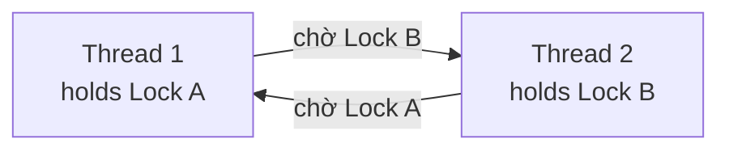
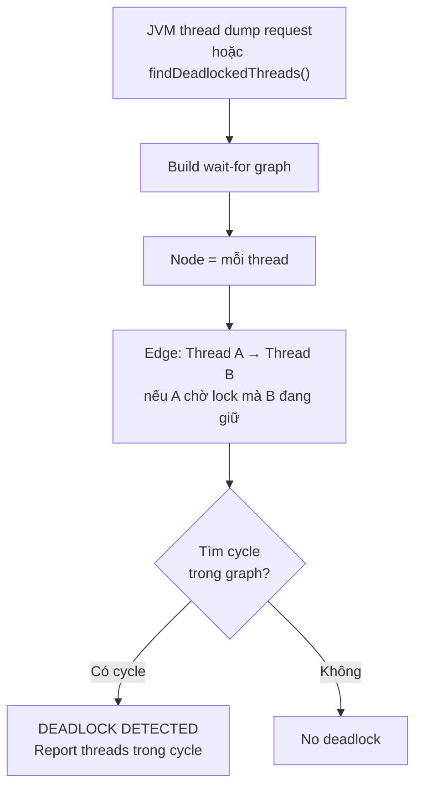

## Mục lục

- [Bối cảnh: Service "treo" — không crash, không log, không response](#1-bối-cảnh-service-treo--không-crash-không-log-không-response)
- [Deadlock là gì — định nghĩa chính xác](#2-deadlock-là-gì--định-nghĩa-chính-xác)
- [4 điều kiện Coffman — phá 1 là thoát](#3-4-điều-kiện-coffman--phá-1-là-thoát)
- [Reproduce deadlock — ví dụ kinh điển](#4-reproduce-deadlock--ví-dụ-kinh-điển)
- [Thread dump & jstack — đọc hiểu deadlock](#5-thread-dump--jstack--đọc-hiểu-deadlock)
- [JMX ThreadMXBean — phát hiện programmatic](#6-jmx-threadmxbean--phát-hiện-programmatic)
- [Lock Ordering — chiến lược phòng tránh số 1](#7-lock-ordering--chiến-lược-phòng-tránh-số-1)
- [tryLock với timeout — tránh chờ vô hạn](#8-trylock-với-timeout--tránh-chờ-vô-hạn)
- [Livelock & Starvation — anh em của deadlock](#9-livelock--starvation--anh-em-của-deadlock)
- [Database Deadlock & JPA](#10-database-deadlock--jpa)
- [Anti-patterns & Tóm tắt](#11-anti-patterns--tóm-tắt)

---

## 1. Bối cảnh: Service "treo" — không crash, không log, không response

Hệ thống chuyển tiền giữa tài khoản. Mỗi transaction khoá cả hai tài khoản nguồn và đích:

```java
public void transfer(Account from, Account to, BigDecimal amount) {
    synchronized (from) {
        synchronized (to) {
            from.debit(amount);
            to.credit(amount);
        }
    }
}
```

Trên dev: chạy tốt. Production, 2 request đồng thời:
- Thread 1: `transfer(A, B, 100)` — lock A, đợi B
- Thread 2: `transfer(B, A, 50)` — lock B, đợi A

Kết quả: cả hai thread **chờ nhau vĩnh viễn**. Service không crash, không exception, không log. Health check timeout. Load balancer đánh dead. Alert: "service không response".

```
thread dump:
"transfer-1" BLOCKED on B, owned by "transfer-2"
"transfer-2" BLOCKED on A, owned by "transfer-1"

Found one Java-level deadlock:
=============================
"transfer-1":
  waiting to lock monitor 0x00007f... (object 0x00000..., Account B),
  which is held by "transfer-2"
"transfer-2":
  waiting to lock monitor 0x00007f... (object 0x00000..., Account A),
  which is held by "transfer-1"
```

> [!IMPORTANT]
> Deadlock là bug **im lặng nhất** — không exception, không stack trace, không error log. Thread chỉ "biến mất" khỏi xử lý. Phát hiện cần **thread dump** hoặc monitoring chủ động.

---

## 2. Deadlock là gì — định nghĩa chính xác

**Deadlock** xảy ra khi **hai hoặc nhiều thread** mỗi thread giữ một resource và **chờ** resource mà thread khác đang giữ, tạo thành **vòng chờ** (circular wait) — không thread nào có thể tiến lên.



---

## 3. 4 điều kiện Coffman — phá 1 là thoát

Deadlock **chỉ** xảy ra khi **cả 4** điều kiện này đồng thời đúng:

| # | Điều kiện | Ý nghĩa | Cách phá |
|---|----------|---------|---------|
| 1 | **Mutual Exclusion** | Resource chỉ 1 thread dùng tại một thời điểm | Dùng concurrent data structure (CAS), không cần lock |
| 2 | **Hold and Wait** | Thread giữ resource trong khi chờ resource khác | Lock tất cả cùng lúc (atomic), hoặc release trước khi request |
| 3 | **No Preemption** | Resource không thể bị giật khỏi thread đang giữ | `tryLock` với timeout — tự nhường nếu không lấy được |
| 4 | **Circular Wait** | Tồn tại vòng chờ T1→T2→...→Tn→T1 | **Lock ordering** — luôn lock theo thứ tự cố định |

> [!TIP]
> Trong thực tế, **phá Circular Wait** (lock ordering) là chiến lược phổ biến và hiệu quả nhất. Các cách khác thường phức tạp hoặc không khả thi trong mọi tình huống.

---

## 4. Reproduce deadlock — ví dụ kinh điển

### 4.1. Hai lock ngược thứ tự

```java
public class DeadlockDemo {
    private final Object lockA = new Object();
    private final Object lockB = new Object();

    public void method1() {
        synchronized (lockA) {          // 1. lock A
            sleep(100);                 // tăng xác suất đụng
            synchronized (lockB) {      // 2. chờ B
                System.out.println("method1");
            }
        }
    }

    public void method2() {
        synchronized (lockB) {          // 1. lock B
            sleep(100);
            synchronized (lockA) {      // 2. chờ A → DEADLOCK
                System.out.println("method2");
            }
        }
    }

    public static void main(String[] args) {
        DeadlockDemo d = new DeadlockDemo();
        new Thread(d::method1, "Thread-A").start();
        new Thread(d::method2, "Thread-B").start();
        // Chương trình KHÔNG BAO GIỜ in gì → treo mãi
    }
}
```

### 4.2. Deadlock ẩn — gọi method alien

```java
// Class A
synchronized void doSomething(B b) {
    b.respond(this);          // gọi method của B → cần lock B → deadlock?
}
synchronized void respond(B b) { /* ... */ }

// Class B
synchronized void doSomething(A a) {
    a.respond(this);          // gọi method của A → cần lock A → deadlock!
}
synchronized void respond(A a) { /* ... */ }
```

> [!WARNING]
> **Gọi alien method** (method của object khác) **trong synchronized block** là nguyên nhân deadlock phổ biến nhất trong code phức tạp. Method đó có thể acquire lock khác mà bạn không biết. Luật: **giảm thiểu code trong synchronized block** — đặc biệt không gọi method bên ngoài.

---

## 5. Thread dump & jstack — đọc hiểu deadlock

### 5.1. Lấy thread dump

```bash
# Cách 1: jstack (JDK tool)
jstack <pid> > thread_dump.txt

# Cách 2: kill signal (Linux/Mac)
kill -3 <pid>    # in thread dump ra stderr/stdout

# Cách 3: jcmd
jcmd <pid> Thread.print

# Cách 4: trong code
Thread.getAllStackTraces().forEach((t, st) ->
    System.out.println(t.getName() + ": " + Arrays.toString(st)));
```

### 5.2. Đọc thread dump — anatomy

```
"transfer-1" #12 prio=5 os_prio=0 tid=0x00007f... nid=0x1a03
   java.lang.Thread.State: BLOCKED (on object monitor)
        at com.example.BankService.transfer(BankService.java:15)
        - waiting to lock <0x000000076ab23c80> (a com.example.Account)    ← ĐANG CHỜ
        - locked <0x000000076ab23c40> (a com.example.Account)             ← ĐÃ GIỮ
        at com.example.TransferHandler.handle(TransferHandler.java:42)
```

| Field | Ý nghĩa |
|-------|---------|
| `BLOCKED` | Thread đang chờ monitor lock |
| `waiting to lock <0x...>` | Object mà thread muốn lock |
| `locked <0x...>` | Object mà thread đã giữ |
| `nid=0x1a03` | Native thread ID (hex) — dùng `top -H` để match CPU |

### 5.3. JVM tự detect deadlock

JVM tự phát hiện deadlock giữa `synchronized` monitor và in ở cuối thread dump:

```
Found one Java-level deadlock:
=============================
"transfer-1":
  waiting to lock monitor 0x00007f40dc002d80
  which is held by "transfer-2"
"transfer-2":
  waiting to lock monitor 0x00007f40dc003380
  which is held by "transfer-1"

Java stack information for the threads listed above:
===================================================
...
```

### 5.4. JVM Deadlock Detection Algorithm — cách JVM tìm deadlock

JVM dùng **wait-for graph** để phát hiện cycle:



**Cách JVM xây dựng wait-for graph:**
1. Duyệt tất cả threads ở trạng thái `BLOCKED`
2. Với mỗi blocked thread: xác định **monitor** nó đang chờ (`_waitingToLock`)
3. Xác định **thread owner** của monitor đó
4. Tạo edge: waiting thread → owning thread
5. Duyệt graph tìm **strongly connected component** (cycle)

```
Ví dụ:
  Thread-A: waiting for lock(Account#1), holds lock(Account#2)
  Thread-B: waiting for lock(Account#2), holds lock(Account#1)

  Wait-for graph:
    Thread-A ──→ Thread-B (A chờ lock mà B giữ)
    Thread-B ──→ Thread-A (B chờ lock mà A giữ)
    → CYCLE → DEADLOCK
```

**ObjectMonitor structure (C++ level, HotSpot):**
```
ObjectMonitor {
    _owner: Thread*        // thread hiện đang giữ lock
    _EntryList: ObjectWaiter*   // threads BLOCKED chờ lock
    _WaitSet: ObjectWaiter*     // threads gọi wait() (WAITING)
    _recursions: int            // reentrant count
    _count: int                 // số thread đang compete
}
```

> [!NOTE]
> JVM **chỉ detect** deadlock giữa **synchronized** (intrinsic lock). Deadlock giữa `ReentrantLock` cần dùng `ThreadMXBean.findDeadlockedThreads()` (mục 6). Deadlock liên quan đến I/O, database lock, hay distributed lock thì **JVM không biết** — cần distributed deadlock detector.

---

## 6. JMX ThreadMXBean — phát hiện programmatic

```java
ThreadMXBean tmx = ManagementFactory.getThreadMXBean();

// Detect deadlock (bao gồm cả ReentrantLock)
long[] deadlockedThreads = tmx.findDeadlockedThreads();

if (deadlockedThreads != null) {
    ThreadInfo[] infos = tmx.getThreadInfo(deadlockedThreads, true, true);
    for (ThreadInfo ti : infos) {
        System.err.println("DEADLOCK: " + ti.getThreadName());
        System.err.println("  State: " + ti.getThreadState());
        System.err.println("  Waiting for: " + ti.getLockName());
        System.err.println("  Held by: " + ti.getLockOwnerName());
        for (StackTraceElement ste : ti.getStackTrace()) {
            System.err.println("    at " + ste);
        }
    }
}
```

### 6.1. Scheduled deadlock detector

```java
ScheduledExecutorService detector = Executors.newSingleThreadScheduledExecutor();
detector.scheduleAtFixedRate(() -> {
    long[] ids = tmx.findDeadlockedThreads();
    if (ids != null) {
        log.error("DEADLOCK DETECTED! Threads: {}", Arrays.toString(ids));
        // alert, dump thread info, hoặc restart
    }
}, 0, 10, TimeUnit.SECONDS);
```

> [!TIP]
> Chạy detector này trong production (interval 10–30s) giúp phát hiện deadlock sớm trước khi health check timeout. Kết hợp với metrics (số thread BLOCKED, lock contention) để alert proactive.

---

## 7. Lock Ordering — chiến lược phòng tránh số 1

**Quy tắc**: tất cả thread phải lock **cùng thứ tự**. Nếu luôn lock A trước B, không bao giờ có vòng chờ A↔B.

### 7.1. Áp dụng cho transfer

```java
public void transfer(Account from, Account to, BigDecimal amount) {
    // Sắp xếp theo ID → thứ tự cố định bất kể from/to
    Account first = from.getId() < to.getId() ? from : to;
    Account second = from.getId() < to.getId() ? to : from;

    synchronized (first) {
        synchronized (second) {
            from.debit(amount);
            to.credit(amount);
        }
    }
}
```

Bây giờ `transfer(A, B)` và `transfer(B, A)` đều lock theo thứ tự ID: A trước B (nếu A.id < B.id) → **không deadlock**.

### 7.2. Khi không có ID — dùng System.identityHashCode

```java
int hashFrom = System.identityHashCode(from);
int hashTo = System.identityHashCode(to);

if (hashFrom < hashTo) {
    synchronized (from) { synchronized (to) { /* transfer */ } }
} else if (hashFrom > hashTo) {
    synchronized (to) { synchronized (from) { /* transfer */ } }
} else {
    // Hash collision — cần tie-breaker lock
    synchronized (tieBreakerLock) {
        synchronized (from) { synchronized (to) { /* transfer */ } }
    }
}
```

> [!NOTE]
> `System.identityHashCode` **có thể trùng** (hash collision). Khi trùng, cần **tie-breaker** lock thứ 3. Đây là pattern trong Effective Java (Item 79).

---

## 8. tryLock với timeout — tránh chờ vô hạn

`ReentrantLock.tryLock(timeout)` thử acquire lock trong thời gian giới hạn. Nếu không được → **bỏ cuộc** thay vì chờ mãi:

```java
private final ReentrantLock lockA = new ReentrantLock();
private final ReentrantLock lockB = new ReentrantLock();

public boolean transfer(Account from, Account to, BigDecimal amount)
        throws InterruptedException {
    long deadline = System.nanoTime() + TimeUnit.SECONDS.toNanos(5);

    while (true) {
        if (lockA.tryLock()) {
            try {
                if (lockB.tryLock()) {
                    try {
                        from.debit(amount);
                        to.credit(amount);
                        return true;           // thành công
                    } finally {
                        lockB.unlock();
                    }
                }
            } finally {
                lockA.unlock();                // release A, thử lại
            }
        }
        if (System.nanoTime() > deadline) {
            return false;                      // timeout — không deadlock, nhưng thất bại
        }
        Thread.sleep(ThreadLocalRandom.current().nextInt(10, 100)); // backoff
    }
}
```

> [!WARNING]
> `tryLock` + backoff tránh deadlock nhưng có thể gây **livelock** (mục 9) nếu backoff không đủ ngẫu nhiên. Luôn dùng **random backoff** + **deadline** tổng.

---

## 9. Livelock & Starvation — anh em của deadlock

### 9.1. Livelock

Thread **không block** nhưng **không tiến** — cả hai liên tục "nhường" nhau:

```java
// Hai người gặp nhau ở cửa hẹp
while (true) {
    if (other.isWaiting()) {
        this.stepBack();     // nhường
    } else {
        this.goThrough();
        break;
    }
    // Cả hai cùng stepBack → cùng thử lại → cùng stepBack → vĩnh viễn
}
```

**Giải pháp**: random backoff (mỗi thread chờ thời gian ngẫu nhiên) hoặc priority-based (một thread luôn ưu tiên).

### 9.2. Starvation

Thread **hợp lệ** nhưng **không bao giờ** được chạy vì thread priority cao hoặc lock unfair chiếm hết CPU:

| Nguyên nhân | Ví dụ | Giải pháp |
|------------|-------|-----------|
| Priority quá chênh | Thread priority 1 không bao giờ được schedule | Không dùng thread priority |
| Unfair lock | `new ReentrantLock(false)` — thread mới lẻn vào trước | `new ReentrantLock(true)` — FIFO |
| Long-running synchronized | Thread giữ lock quá lâu | Giảm scope synchronized, dùng concurrent structure |

> [!NOTE]
> `ReentrantLock(true)` (fair lock) ngăn starvation nhưng **chậm hơn** unfair lock đáng kể (thêm overhead đảm bảo FIFO). Chỉ dùng khi starvation là vấn đề thực đo được.

---

## 10. Database Deadlock & JPA

### 10.1. Database deadlock

Database (MySQL InnoDB, PostgreSQL) cũng có deadlock — và **tự detect**:

```sql
-- Transaction 1:
BEGIN;
UPDATE accounts SET balance = balance - 100 WHERE id = 1;  -- lock row 1
UPDATE accounts SET balance = balance + 100 WHERE id = 2;  -- chờ row 2

-- Transaction 2:
BEGIN;
UPDATE accounts SET balance = balance - 50 WHERE id = 2;   -- lock row 2
UPDATE accounts SET balance = balance + 50 WHERE id = 1;   -- chờ row 1 → DEADLOCK
```

Database chọn **một transaction là victim** → rollback nó → throw error:

```
ERROR 1213 (40001): Deadlock found when trying to get lock; try restarting transaction
```

### 10.2. Xử lý trong Spring/JPA

```java
@Retryable(
    retryFor = CannotAcquireLockException.class,
    maxAttempts = 3,
    backoff = @Backoff(delay = 100, multiplier = 2)
)
@Transactional
public void transfer(Long fromId, Long toId, BigDecimal amount) {
    // Sắp thứ tự SELECT ... FOR UPDATE theo ID
    Long first = Math.min(fromId, toId);
    Long second = Math.max(fromId, toId);

    Account a = accountRepo.findByIdForUpdate(first);    // SELECT ... FOR UPDATE
    Account b = accountRepo.findByIdForUpdate(second);   // cùng thứ tự → no deadlock

    a.setBalance(a.getBalance().subtract(amount));
    b.setBalance(b.getBalance().add(amount));
}
```

> [!TIP]
> **Lock ordering** áp dụng cả cho database row lock: luôn `SELECT ... FOR UPDATE` theo thứ tự ID tăng dần. Kết hợp `@Retryable` để retry khi database chọn transaction làm victim (vì deadlock từ concurrent request khác vẫn có thể xảy ra trong khoảng ngắn).

---

## 11. Anti-patterns & Tóm tắt

### Anti-patterns

| Anti-pattern | Vì sao sai | Sửa |
|--------------|-----------|-----|
| Nested `synchronized` ngược thứ tự | Circular wait → deadlock | Lock ordering (ID, hashCode) |
| Gọi alien method trong synchronized | Method đó có thể lock object khác | Giảm scope, copy data ra rồi gọi ngoài block |
| `synchronized(String literal)` | String intern → nhiều nơi lock cùng object bất ngờ | Lock trên private final Object |
| Không có timeout khi acquire lock | Chờ vĩnh viễn nếu deadlock | `ReentrantLock.tryLock(timeout)` |
| Không monitor deadlock ở production | Phát hiện muộn khi user report | `ThreadMXBean` scheduled detector |
| Mix synchronized + ReentrantLock cho cùng resource | JVM không detect cross-type deadlock | Dùng nhất quán 1 loại |
| Ignore database deadlock exception | Transaction rollback → data inconsistent | Retry với backoff |

### Tóm tắt — Cheat sheet

```
Deadlock = Circular Wait giữa thread/transaction giữ lock chờ nhau

1. 4 điều kiện Coffman: Mutual Exclusion + Hold & Wait + No Preemption + Circular Wait
   → Phá 1 điều kiện = thoát deadlock
2. Phá Circular Wait: LOCK ORDERING (luôn lock theo thứ tự cố định)
3. Phá No Preemption: tryLock(timeout) + random backoff
4. Detect: jstack, ThreadMXBean.findDeadlockedThreads(), thread dump
5. Database: lock ordering + @Retryable
6. Livelock ≠ Deadlock: thread không block nhưng không tiến
7. Starvation: thread hợp lệ nhưng không bao giờ được chạy
```

| Tình huống | Giải pháp |
|-----------|-----------|
| 2 lock nested | Lock ordering by ID |
| Lock ordering không khả thi | `tryLock(timeout)` + backoff |
| Production monitoring | `ThreadMXBean` detector + thread dump on alert |
| Database deadlock | `SELECT ... FOR UPDATE` theo thứ tự + retry |
| Alien method call | Giảm synchronized scope, copy-then-call |

> [!TIP]
> Một câu để nhớ: *Deadlock không crash, không log, không throw — nó chỉ im lặng làm thread biến mất.* Phòng tránh bằng lock ordering, phát hiện bằng thread dump, và luôn có timeout cho mọi thao tác chờ.
