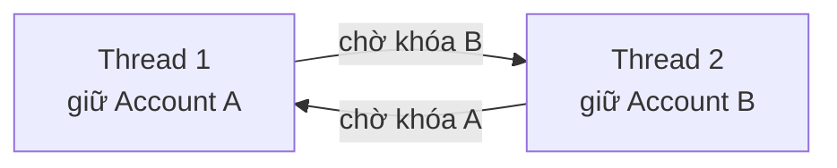
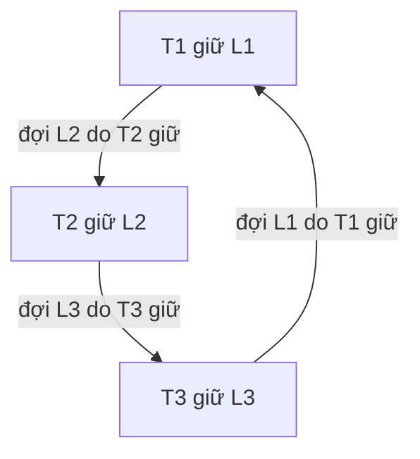

<Callout type="info" title="Phạm vi">
  Trang này nói về deadlock giữa thread trong JVM và deadlock giữa transaction trong database. Mục tiêu không phải là thuộc lòng API lock, mà là nhận ra vòng chờ, thiết kế để vòng đó không thể hình thành, và chẩn đoán được khi sự cố đã xảy ra.
</Callout>

## Mục lục

- [Tổng quan](#1-tổng-quan)
- [Deadlock là gì và không phải là gì](#2-deadlock-là-gì-và-không-phải-là-gì)
  - [Mô hình wait-for graph](#mô-hình-wait-for-graph)
  - [Phân biệt với chậm, livelock và starvation](#phân-biệt-với-chậm-livelock-và-starvation)
- [Bốn điều kiện Coffman](#3-bốn-điều-kiện-coffman)
- [Tái hiện một deadlock có kiểm soát](#4-tái-hiện-một-deadlock-có-kiểm-soát)
- [Đọc thread dump để xác nhận deadlock](#5-đọc-thread-dump-để-xác-nhận-deadlock)
  - [Lấy dump an toàn](#lấy-dump-an-toàn)
  - [Cách lần theo vòng chờ](#cách-lần-theo-vòng-chờ)
  - [Giới hạn của JVM detector](#giới-hạn-của-jvm-detector)
- [Phát hiện bằng ThreadMXBean](#6-phát-hiện-bằng-threadmxbean)
- [Phòng tránh bằng thiết kế](#7-phòng-tránh-bằng-thiết-kế)
  - [Lock ordering: biện pháp chính](#lock-ordering-biện-pháp-chính)
  - [Giảm số lock và phạm vi lock](#giảm-số-lock-và-phạm-vi-lock)
  - [Không gọi code ngoài khi đang giữ lock](#không-gọi-code-ngoài-khi-đang-giữ-lock)
  - [Dùng tryLock khi có thể từ chối hoặc thử lại](#dùng-trylock-khi-có-thể-từ-chối-hoặc-thử-lại)
- [Deadlock ở database và Spring](#8-deadlock-ở-database-và-spring)
- [Runbook khi production bị treo](#9-runbook-khi-production-bị-treo)
- [Livelock và starvation](#10-livelock-và-starvation)
- [Anti-patterns thường gặp](#11-anti-patterns-thường-gặp)
- [Tóm tắt](#12-tóm-tắt)

---

## 1. Tổng quan

**Deadlock** là trạng thái trong đó các thread hoặc transaction không thể tiếp tục vì mỗi bên đang chờ một tài nguyên do bên khác trong cùng nhóm giữ. Chúng không tự giải phóng tài nguyên, nên sự chờ đợi tạo thành một vòng khép kín.

Ví dụ quen thuộc nhất là chuyển tiền giữa hai tài khoản. Request thứ nhất khóa tài khoản A rồi chờ khóa B. Cùng lúc đó, request thứ hai khóa B rồi chờ khóa A. Cả hai request đều chờ mãi, dù CPU có thể gần như rảnh và ứng dụng không hề ném exception.

Điểm quan trọng là: **deadlock không phải chỉ là “thread chờ lâu”**. Muốn kết luận deadlock, phải chứng minh được một vòng chờ. Điều này quyết định cách xử lý:

- Nếu chỉ chậm do một thread đang làm việc lâu, tối ưu hoặc giảm phạm vi critical section có thể đủ.
- Nếu đã có vòng chờ, tăng số thread, tăng timeout, hoặc restart một request không phá được nguyên nhân. Cần giải phóng một bên và sửa thiết kế lock.



## 2. Deadlock là gì và không phải là gì

Một **lock** là quyền truy cập độc quyền vào một tài nguyên chia sẻ. Với `synchronized`, tài nguyên đó là monitor gắn với một object. Với `ReentrantLock`, nó là một ownable synchronizer. Ở database, tài nguyên có thể là row, index entry hoặc predicate lock.

Deadlock xuất hiện khi việc chờ những lock này tạo thành cycle. Chuỗi có thể có hai bên như ví dụ trên, nhưng cũng có thể dài hơn: T1 chờ T2, T2 chờ T3, và T3 chờ T1.

### Mô hình wait-for graph

Cách mô hình hóa đơn giản nhất là **wait-for graph**:

- Mỗi node là một thread hoặc transaction.
- Có cạnh `A → B` khi A đang chờ lock do B giữ.
- Graph có cycle thì tồn tại deadlock.



Mô hình này dùng được ở mọi tầng. `jstack` hiển thị thông tin lock của Java thread. Database hiển thị transaction và row/index lock. Cả hai đều cần được đọc như một graph thay vì từng dòng log rời rạc.

### Phân biệt với chậm, livelock và starvation

| Hiện tượng | Thread có chạy không? | Có tiến triển không? | Dấu hiệu chính | Hướng xử lý |
|---|---:|---:|---|---|
| **Deadlock** | Thường `BLOCKED`/chờ lock | Không, vĩnh viễn nếu không can thiệp | Wait-for graph có cycle | Phá vòng chờ; sửa ordering |
| **Chậm / contention** | Có thể chờ tạm thời | Có; owner cuối cùng sẽ nhả lock | Một owner đang làm việc | Tối ưu critical section, đo contention |
| **Livelock** | Có, liên tục retry/nhường | Không | CPU hoạt động nhưng request không hoàn tất | Backoff ngẫu nhiên, giới hạn retry |
| **Starvation** | Một số thread có thể luôn chờ | Hệ thống vẫn tiến, thread bị bỏ đói không | Không công bằng hoặc ưu tiên lệch | Fairness, giới hạn công việc, thiết kế queue |

`Thread.State.BLOCKED` tự nó **chưa đủ** để kết luận deadlock. Nó chỉ nói rằng thread đang đợi một monitor. Hãy tìm thread owner của monitor đó, rồi tiếp tục lần theo đến khi thấy cycle hoặc thấy owner đang thực sự làm việc.

## 3. Bốn điều kiện Coffman

Năm 1971, Coffman mô tả bốn điều kiện cần để deadlock có thể xuất hiện. Chúng phải cùng tồn tại. Vì vậy, phòng tránh deadlock nghĩa là thiết kế để phá vỡ ít nhất một điều kiện.

| Điều kiện | Nghĩa là gì | Ví dụ Java | Cách phá trong thực tế |
|---|---|---|---|
| **Mutual exclusion** | Tài nguyên chỉ có một owner tại một thời điểm | `synchronized (account)` | Dùng immutable data, message passing hoặc concurrent collection khi phù hợp |
| **Hold and wait** | Thread giữ lock A trong lúc xin lock B | nested `synchronized (a) { synchronized (b) { ... } }` | Không giữ lock qua thao tác phải chờ; gom hoặc tách thao tác |
| **No preemption** | Lock không thể bị hệ thống tước khỏi owner | `lock.lock()` chờ vô hạn | `tryLock(timeout)` để caller tự bỏ cuộc và nhả lock đang giữ |
| **Circular wait** | Có một vòng các thread chờ nhau | A → B → A | Áp dụng tổng thứ tự lock cố định (**lock ordering**) |

Trong Java, không thể loại bỏ mutual exclusion cho mọi bài toán. Ví dụ, cập nhật số dư và kiểm tra bất biến thường vẫn cần đồng bộ. Cũng không nên cố “tước” lock của một thread khác: thread đó có thể đang giữa một cập nhật dang dở.

Do đó, biện pháp thực tế và đáng tin cậy nhất thường là **phá circular wait bằng lock ordering**. Mọi code path cần lấy cùng một nhóm tài nguyên phải lấy chúng theo cùng một thứ tự toàn cục.

<Callout type="idea" title="Kết luận thực hành">
  Đừng cố dự đoán mọi cặp request có thể chạy song song. Hãy định nghĩa một quy tắc thứ tự duy nhất — ví dụ theo `accountId` tăng dần — rồi buộc mọi đường đi của code tuân theo nó.
</Callout>

## 4. Tái hiện một deadlock có kiểm soát

Không dùng `Thread.sleep()` để “hy vọng” hai thread va vào nhau. Timing của sleep không đảm bảo và test sẽ flaky. `CountDownLatch` dưới đây buộc cả hai thread đã giữ lock đầu tiên rồi mới cố lấy lock thứ hai.

```java
import java.util.concurrent.CountDownLatch;

public final class DeadlockDemo {
    private static final Object LOCK_A = new Object();
    private static final Object LOCK_B = new Object();
    private static final CountDownLatch firstLocksHeld = new CountDownLatch(2);

    public static void main(String[] args) {
        Thread t1 = new Thread(() -> lockInOrder(LOCK_A, LOCK_B), "transfer-A-to-B");
        Thread t2 = new Thread(() -> lockInOrder(LOCK_B, LOCK_A), "transfer-B-to-A");

        t1.start();
        t2.start();
    }

    private static void lockInOrder(Object first, Object second) {
        synchronized (first) {
            firstLocksHeld.countDown();   // báo: đã giữ lock đầu tiên
            await(firstLocksHeld);        // không nhả "first" khi chờ ở đây

            synchronized (second) {       // hai thread sẽ cùng chờ lock của nhau
                System.out.println("Không thể tới được đây");
            }
        }
    }

    private static void await(CountDownLatch latch) {
        try {
            latch.await();
        } catch (InterruptedException e) {
            Thread.currentThread().interrupt();
            throw new IllegalStateException("Test bị interrupt", e);
        }
    }
}
```

Diễn tiến được đảm bảo:

1. `transfer-A-to-B` giữ `LOCK_A` và giảm latch từ 2 xuống 1.
2. `transfer-B-to-A` giữ `LOCK_B` và giảm latch từ 1 xuống 0.
3. Cả hai thread qua `await`. Thread thứ nhất xin `LOCK_B`; thread thứ hai xin `LOCK_A`.
4. Không ai có thể nhả lock đầu tiên vì nhả lock chỉ xảy ra sau khi ra khỏi `synchronized` ngoài. Deadlock hình thành.

<Callout type="warn" title="Đừng chạy ví dụ trong test suite không có timeout">
  Process chứa hai non-daemon thread này sẽ không tự kết thúc. Chạy nó như một process riêng rồi lấy thread dump, hoặc đặt timeout cho test harness.
</Callout>

## 5. Đọc thread dump để xác nhận deadlock

Thread dump là ảnh chụp stack trace và trạng thái lock của tất cả Java thread tại một thời điểm. Đây là bằng chứng quan trọng nhất khi JVM process bị treo.

### Lấy dump an toàn

```bash
# Liệt kê Java process và PID
jcmd -l

# Khuyến nghị: dump đầy đủ, gồm ownable synchronizer như ReentrantLock
jcmd <pid> Thread.print -l > thread-dump.txt

# Lựa chọn tương đương từ JDK
jstack -l <pid> > thread-dump.txt

# Linux/macOS: JVM in dump vào standard error của process, không giết process
kill -3 <pid>
```

Lấy từ hai hoặc ba dump, cách nhau khoảng 10 giây, thường hữu ích hơn một dump duy nhất:

- Stack giữ nguyên ở nhiều dump: thread thực sự bị kẹt hoặc đang chờ rất lâu.
- Stack tiến lên: có thể chỉ là contention hoặc tác vụ chậm.
- `kill -9` không phải công cụ chẩn đoán. Nó giết process và mất cơ hội thu thập bằng chứng.

### Cách lần theo vòng chờ

Một đoạn dump của deadlock monitor thường có dạng sau:

```text
"transfer-A-to-B" #21 prio=5 os_prio=0 tid=0x... nid=0x... waiting for monitor entry
   java.lang.Thread.State: BLOCKED (on object monitor)
        at example.DeadlockDemo.lockInOrder(DeadlockDemo.java:25)
        - waiting to lock <0x000000010101c100> (a java.lang.Object)
        - locked <0x000000010101c0f0> (a java.lang.Object)

"transfer-B-to-A" #22 prio=5 os_prio=0 tid=0x... nid=0x... waiting for monitor entry
   java.lang.Thread.State: BLOCKED (on object monitor)
        at example.DeadlockDemo.lockInOrder(DeadlockDemo.java:25)
        - waiting to lock <0x000000010101c0f0> (a java.lang.Object)
        - locked <0x000000010101c100> (a java.lang.Object)
```

Đọc theo bốn bước:

1. Chọn một thread `BLOCKED`, ở đây là `transfer-A-to-B`.
2. Ghi lại object nó **đang chờ**: `0x...c100`.
3. Tìm thread đang **giữ** object đó. Trong ví dụ, `transfer-B-to-A` có dòng `locked <0x...c100>`.
4. Lặp lại với lock mà owner đang chờ. Nếu quay lại thread đầu tiên, bạn đã chứng minh cycle.

Khi JVM nhận ra cycle giữa monitor, phần cuối dump thường có tóm tắt dễ đọc:

```text
Found one Java-level deadlock:
=============================
"transfer-A-to-B":
  waiting to lock monitor 0x...c100
  which is held by "transfer-B-to-A"

"transfer-B-to-A":
  waiting to lock monitor 0x...c0f0
  which is held by "transfer-A-to-B"
```

Tóm tắt này rất tiện, nhưng vẫn cần xem stack trace. Stack cho biết **đường code nào** lấy lock đầu tiên và lock nào bị xin thứ hai. Đó mới là vị trí cần sửa.

### Giới hạn của JVM detector

JVM chỉ nhìn thấy quan hệ sở hữu lock mà nó biết. Nó không thể tự phát hiện các vòng chờ “ngữ nghĩa”, chẳng hạn:

- Thread A chờ phản hồi HTTP từ service B, trong khi B chờ request callback do A xử lý.
- Hai transaction ở hai database khác nhau giữ lock và chờ nhau.
- Một thread chờ connection pool, còn tất cả connection holder lại chờ task trong cùng thread pool.
- Deadlock qua distributed lock, queue hoặc I/O không được biểu diễn là Java monitor/ownable synchronizer.

Với các tình huống này, cần kết hợp trace, metrics pool, log request ID và thông tin lock từ hệ thống bên ngoài để dựng wait-for graph ở cấp hệ thống.

## 6. Phát hiện bằng ThreadMXBean

`ThreadMXBean` cho phép ứng dụng hỏi JVM về deadlock. Nó hữu ích cho health check nội bộ, diagnostics endpoint hoặc tác vụ cảnh báo định kỳ.

```java
import java.lang.management.ManagementFactory;
import java.lang.management.ThreadInfo;
import java.lang.management.ThreadMXBean;

public final class DeadlockDetector {
    private static final ThreadMXBean THREADS = ManagementFactory.getThreadMXBean();

    public static void logDeadlocks() {
        // Monitor + ownable synchronizer, ví dụ synchronized và ReentrantLock.
        long[] ids = THREADS.findDeadlockedThreads();
        if (ids == null) {
            return;
        }

        ThreadInfo[] infos = THREADS.getThreadInfo(ids, true, true);
        for (ThreadInfo info : infos) {
            System.err.printf("Deadlocked thread: %s (%s)%n",
                    info.getThreadName(), info.getThreadState());
            System.err.printf("  Waiting for: %s%n", info.getLockInfo());
            System.err.printf("  Held by: %s%n", info.getLockOwnerName());
            for (StackTraceElement frame : info.getStackTrace()) {
                System.err.println("    at " + frame);
            }
        }
    }
}
```

Có hai API dễ nhầm:

| API | Phát hiện được |
|---|---|
| `findMonitorDeadlockedThreads()` | Chỉ intrinsic monitor, tức lock từ `synchronized` |
| `findDeadlockedThreads()` | Monitor **và** ownable synchronizer như `ReentrantLock` |

Dùng `findDeadlockedThreads()` trừ khi bạn có lý do rõ ràng chỉ quan tâm đến monitor. Dù vậy, detector không thay thế monitoring. Nếu phát hiện deadlock, hành động an toàn thường là ghi đủ thread dump, tạo alert, rồi để runbook quyết định restart/failover. Tự ý `Thread.stop()` một thread đang giữ lock có thể làm hỏng state nghiệp vụ.

## 7. Phòng tránh bằng thiết kế

### Lock ordering: biện pháp chính

Với mọi cặp tài khoản, hãy khóa theo `id` tăng dần, không theo ý nghĩa `from` hay `to`. Vì vậy `transfer(A, B)` và `transfer(B, A)` đều lấy A trước nếu `A.id < B.id`.

```java
public void transfer(Account from, Account to, BigDecimal amount) {
    if (from.id().equals(to.id())) {
        return; // hoặc xử lý riêng; không cần khóa cùng object hai lần
    }

    Account first = from.id() < to.id() ? from : to;
    Account second = from.id() < to.id() ? to : from;

    synchronized (first) {
        synchronized (second) {
            if (from.balance().compareTo(amount) < 0) {
                throw new IllegalArgumentException("Insufficient funds");
            }
            from.debit(amount);
            to.credit(amount);
        }
    }
}
```

Điều kiện quan trọng không phải là “có sắp xếp” mà là **mọi nơi sắp xếp bằng đúng cùng một khóa và cùng chiều**. Nếu một method sắp theo `id` tăng dần còn method khác sắp theo tên giảm dần, cycle vẫn có thể xuất hiện.

Nếu không có business ID ổn định, có thể dùng `System.identityHashCode()` để tạo thứ tự, nhưng phải xử lý collision. `identityHashCode` không bảo đảm duy nhất.

```java
private static final Object TIE_LOCK = new Object();

static void lockBoth(Object left, Object right, Runnable action) {
    int leftHash = System.identityHashCode(left);
    int rightHash = System.identityHashCode(right);

    if (leftHash < rightHash) {
        withLocks(left, right, action);
    } else if (leftHash > rightHash) {
        withLocks(right, left, action);
    } else {
        synchronized (TIE_LOCK) {
            withLocks(left, right, action);
        }
    }
}

private static void withLocks(Object first, Object second, Runnable action) {
    synchronized (first) {
        synchronized (second) {
            action.run();
        }
    }
}
```

`TIE_LOCK` chỉ được dùng trong trường hợp hiếm là collision. Không thay nó bằng string literal hay object public. Lock nên là `private final` để code bên ngoài không thể vô tình giữ nó.

### Giảm số lock và phạm vi lock

Nested lock không luôn sai, nhưng số lock tăng làm số thứ tự cần phối hợp tăng theo. Hãy ưu tiên các thiết kế sau:

- Giữ mutable state trong một aggregate duy nhất để một operation chỉ cần một lock.
- Dùng object immutable: tạo state mới rồi publish an toàn, thay vì sửa nhiều field chia sẻ.
- Không giữ lock khi gọi database, HTTP, file I/O hoặc chờ future. Những thao tác này chậm và có dependencies không kiểm soát được.
- Copy dữ liệu cần thiết vào biến local trong lock, nhả lock, rồi làm công việc nặng ở ngoài.

Ví dụ, đoạn dưới giữ lock trong lúc gửi email. Email service có thể chậm, retry hoặc callback vào code khác; lock bị giữ lâu và mở rộng bề mặt deadlock.

```java
// Không nên: gọi dependency ngoài trong khi giữ lock.
synchronized (order) {
    order.markPaid();
    emailService.sendReceipt(order); // I/O và code bên ngoài
}

// Tốt hơn: chỉ bảo vệ state chung trong critical section ngắn.
Receipt receipt;
synchronized (order) {
    order.markPaid();
    receipt = Receipt.from(order);
}
emailService.sendReceipt(receipt);
```

### Không gọi code ngoài khi đang giữ lock

“Code ngoài” (alien method) là method mà lock footprint của nó không do class hiện tại kiểm soát: callback người dùng cung cấp, listener, framework interceptor, logger có appender tùy biến, service khác, hoặc method trên object lạ.

Bạn không thể biết callback đó có lấy thêm lock, chờ future, hoặc gọi ngược vào object hiện tại hay không. Vì vậy, pattern an toàn là **snapshot under lock, invoke after unlock**:

```java
List<OrderListener> listeners;
OrderSnapshot snapshot;

synchronized (this) {
    applyChange();
    snapshot = OrderSnapshot.from(this);
    listeners = List.copyOf(this.listeners);
}

for (OrderListener listener : listeners) {
    listener.onChanged(snapshot);
}
```

Snapshot giúp callback thấy dữ liệu nhất quán mà không kéo lock của object vào toàn bộ chuỗi gọi.

### Dùng tryLock khi có thể từ chối hoặc thử lại

`ReentrantLock.tryLock(timeout, unit)` không “chữa” thiết kế lock sai. Nó biến việc chờ vô hạn thành thất bại có giới hạn thời gian. Điều đó phù hợp khi caller có thể trả lỗi tạm thời, enqueue retry hoặc bỏ qua một lần cập nhật không quan trọng.

```java
boolean transfer(Account from, Account to, BigDecimal amount)
        throws InterruptedException {
    Account first = from.id() < to.id() ? from : to;
    Account second = from.id() < to.id() ? to : from;

    if (!first.lock().tryLock(200, TimeUnit.MILLISECONDS)) {
        return false; // caller quyết định retry hoặc báo bận
    }

    try {
        if (!second.lock().tryLock(200, TimeUnit.MILLISECONDS)) {
            return false;
        }
        try {
            from.debit(amount);
            to.credit(amount);
            return true;
        } finally {
            second.lock().unlock();
        }
    } finally {
        first.lock().unlock();
    }
}
```

Ba quy tắc đi kèm `tryLock`:

1. Mọi lock đã lấy phải được nhả bằng `finally`, kể cả khi timeout ở lock tiếp theo.
2. Caller phải có contract rõ ràng khi nhận `false`: retry có backoff, trả `409/503`, hay đưa vào queue.
3. Retry của thao tác có side effect phải idempotent, tức chạy lại không được trừ tiền hoặc gửi email hai lần.

<Callout type="warn" title="Timeout không đồng nghĩa hết deadlock">
  Nếu tất cả request timeout rồi retry ngay lập tức theo cùng nhịp, hệ thống có thể chuyển từ deadlock sang livelock hoặc tự tạo quá tải. Hãy dùng deadline tổng, exponential backoff có jitter và giới hạn số lần retry.
</Callout>

## 8. Deadlock ở database và Spring

Database cũng có lock và wait-for graph. Ví dụ với hai row tài khoản:

```sql
-- Transaction 1
BEGIN;
UPDATE account SET balance = balance - 100 WHERE id = 1; -- giữ row 1
UPDATE account SET balance = balance + 100 WHERE id = 2; -- chờ row 2

-- Transaction 2, chạy đồng thời
BEGIN;
UPDATE account SET balance = balance - 50 WHERE id = 2;  -- giữ row 2
UPDATE account SET balance = balance + 50 WHERE id = 1;  -- chờ row 1
```

InnoDB và PostgreSQL có deadlock detector. Khi thấy cycle, database chọn một transaction làm **victim**, rollback transaction đó và trả lỗi. Đây là hành vi đúng: ít nhất một transaction phải bị hủy để phá vòng chờ.

Hai lớp phòng vệ nên được dùng cùng nhau:

1. **Lấy row theo thứ tự nhất quán** để giảm mạnh xác suất cycle.
2. **Retry transaction bị chọn làm victim** với backoff, vì contention từ các query/path khác vẫn có thể tạo deadlock hợp lệ.

```java
@Transactional
public void transfer(long fromId, long toId, BigDecimal amount) {
    long firstId = Math.min(fromId, toId);
    long secondId = Math.max(fromId, toId);

    Account first = repository.findByIdForUpdate(firstId);
    Account second = repository.findByIdForUpdate(secondId);

    Account from = fromId == firstId ? first : second;
    Account to = toId == firstId ? first : second;
    from.debit(amount);
    to.credit(amount);
}
```

Repository có thể dùng `SELECT ... FOR UPDATE`, tùy database và isolation level:

```sql
SELECT * FROM account WHERE id = :id FOR UPDATE;
```

Ở Spring, exception cụ thể phụ thuộc database driver và exception translation. Có thể gặp `DeadlockLoserDataAccessException`, `CannotAcquireLockException` hoặc exception bị bọc khác. Đừng retry mọi `DataAccessException`; chỉ retry lỗi transient đã được xác định là lock/deadlock, và log SQL state/vendor code để xác minh phân loại.

<Callout type="info" title="Retry transaction đúng cách">
  Mỗi lần retry phải bắt đầu transaction mới. Đặt retry ở một bean/proxy khác hoặc dùng cơ chế retry phù hợp, vì self-invocation có thể khiến `@Transactional` và `@Retryable` không được Spring proxy áp dụng. Xem thêm <a href="/interview/transactional-self-invocation">Transactional self-invocation</a>.
</Callout>

## 9. Runbook khi production bị treo

Khi latency tăng hoặc request không hoàn tất, không mặc định restart ngay. Làm theo thứ tự để vừa khôi phục vừa giữ lại bằng chứng.

1. **Xác định phạm vi.** Có phải toàn bộ service treo, chỉ một endpoint, hay chỉ một instance? Kiểm tra active request, error rate, pool queue và database connection usage.
2. **Lấy ít nhất hai thread dump.** Dùng `jcmd <pid> Thread.print -l`, cách nhau 5–10 giây. Lưu kèm timestamp, instance ID và bản build đang chạy.
3. **Tìm cycle trước.** Tìm `Found ... deadlock`, rồi kiểm từng `BLOCKED` thread và các dòng `waiting to lock`/`locked`. Với `ReentrantLock`, xem phần ownable synchronizer khi dùng `-l`.
4. **Map stack trace về nghiệp vụ.** Xác định resource nào bị khóa, code path nào lấy lock đầu tiên, và có path nào lấy thứ tự ngược lại không.
5. **Kiểm tra dependency ngoài JVM.** Thread dump không có cycle nhưng request vẫn treo có thể là connection pool exhaustion, database lock wait, HTTP dependency hoặc executor starvation.
6. **Khôi phục có kiểm soát.** Drain instance hoặc restart/failover theo runbook vận hành. Không dừng riêng một Java thread để “mở khóa”.
7. **Sửa và thêm regression test.** Viết test chạy hai thao tác theo thứ tự ngược, dùng barrier/latch để tái hiện. Thêm metric/alert nếu lớp lỗi này có thể quay lại.

Nói ngắn gọn: **dump trước, restart sau** — trừ khi tình huống khẩn cấp buộc phải khôi phục ngay.

## 10. Livelock và starvation

**Livelock** xảy ra khi thread không bị block nhưng cũng không hoàn thành công việc. Ví dụ, hai worker cùng không lấy được lock thứ hai, cùng nhả lock thứ nhất, rồi lập tức cùng thử lại. Hệ thống nhìn có vẻ hoạt động vì CPU và log đều chạy, nhưng không request nào tiến lên.

Giải pháp là thêm backoff có jitter, giới hạn retry và đôi khi chọn một bên làm winner theo priority ổn định. Không dùng vòng lặp retry vô hạn không delay.

**Starvation** là khi một thread có thể chạy hợp lệ nhưng không bao giờ có cơ hội lấy lock hoặc CPU. `new ReentrantLock(true)` cung cấp fairness gần FIFO và có thể giảm starvation, nhưng fairness giảm throughput trong nhiều workload. Chỉ bật nó khi đo đạc cho thấy fairness cần thiết.

| Vấn đề | Ví dụ | Biện pháp chính |
|---|---|---|
| Livelock | Hai request `tryLock` thất bại cùng nhịp rồi retry ngay | Backoff ngẫu nhiên + retry budget |
| Starvation | Một luồng luôn bị request mới vượt hàng ở unfair lock | Fair lock hoặc queue công việc công bằng |
| Contention cao | Owner hợp lệ giữ lock lâu nên hàng chờ dài | Rút ngắn critical section, phân vùng state |

## 11. Anti-patterns thường gặp

| Anti-pattern | Vì sao nguy hiểm | Thay bằng |
|---|---|---|
| Khóa `from` rồi `to` theo tham số đầu vào | `transfer(A,B)` và `transfer(B,A)` lấy thứ tự ngược nhau | Sắp cả hai theo khóa toàn cục như ID |
| `synchronized` trên string literal hoặc boxed value | Có thể bị intern/cache, khiến code không liên quan dùng chung lock | `private final Object lock = new Object()` |
| Gọi HTTP/DB/callback khi đang giữ monitor | Kéo dependency không kiểm soát vào lock graph | Snapshot trong lock, gọi ngoài lock |
| Dùng `lock.lock()` nhưng thiếu `finally` | Exception làm lock không được nhả, giống treo vĩnh viễn | `try { ... } finally { lock.unlock(); }` |
| Timeout rồi retry ngay vô hạn | Dễ tạo livelock và làm quá tải nặng hơn | Retry budget + exponential backoff + jitter |
| Tưởng `volatile` hoặc `AtomicInteger` giải quyết mọi thứ | Chúng không bảo vệ bất biến trải trên nhiều object/operation | Lock/transaction/CAS protocol cho toàn bộ bất biến |
| Chỉ xem một thread dump | Không biết stack có đang tiến triển không | So sánh nhiều dump có timestamp |
| Retry mọi lỗi database | Che lỗi logic, làm thao tác không idempotent chạy lại | Chỉ retry lỗi transient đã phân loại |

## 12. Tóm tắt

```text
Deadlock = các owner giữ tài nguyên và chờ nhau theo một vòng.

Nhận diện: dựng wait-for graph; cycle là bằng chứng.
Phòng tránh chính: mọi code path lấy nhiều lock theo cùng một thứ tự toàn cục.
Chẩn đoán JVM: jcmd <pid> Thread.print -l hoặc jstack -l, rồi lần theo waiting/locked.
Phát hiện code: ThreadMXBean.findDeadlockedThreads().
Database: lock row theo cùng thứ tự và retry transaction victim một cách idempotent.
```

Ba nguyên tắc nên nhớ:

1. **Lock ordering trước, timeout sau.** Timeout là hàng rào an toàn; thứ tự nhất quán mới loại bỏ nguyên nhân cycle.
2. **Giữ lock ngắn và khép kín.** Đừng để I/O, callback hay dependency ngoài đi vào critical section.
3. **Có bằng chứng trước khi kết luận.** `BLOCKED` hay latency cao chưa phải deadlock; hãy tìm cycle trong dump hoặc trong hệ thống lock liên quan.

<Callout type="idea" title="Một câu để nhớ">
  Khi một thao tác cần nhiều lock, câu hỏi đầu tiên không phải “lấy lock ở đâu?” mà là “toàn hệ thống lấy các lock này theo thứ tự nào?”.
</Callout>

## Tài liệu liên quan

- [AQS Deep Dive](/concurrency/aqs-deep-dive/)
- [Optimistic vs Pessimistic Lock](/concurrency/locks-optimistic-vs-pessimistic/)
- [Data Race vs Race Condition](/concurrency/data-race-vs-race-condition/)
- [Spring Transaction](/spring/spring-transaction/)
