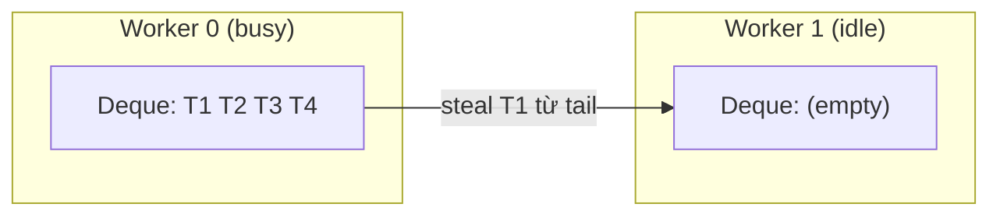
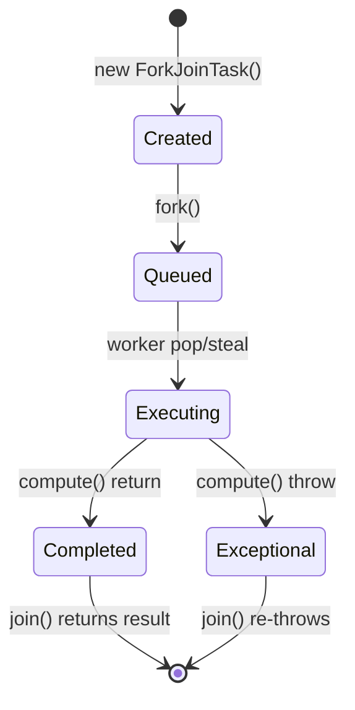

## Mục lục

- [Parallel sort 100M phần tử — 8 core nhưng chỉ 2 core busy](#1-parallel-sort-100m-phần-tử--8-core-nhưng-chỉ-2-core-busy)
- [Fork/Join là gì — divide-and-conquer + work-stealing](#2-forkjoin-là-gì--divide-and-conquer--work-stealing)
- [ForkJoinPool architecture — WorkQueue deque per worker](#3-forkjoinpool-architecture--workqueue-deque-per-worker)
- [Work-Stealing algorithm — idle worker lấy task từ busy worker](#4-work-stealing-algorithm--idle-worker-lấy-task-từ-busy-worker)
- [ForkJoinTask lifecycle — fork(), join(), compute()](#5-forkjointask-lifecycle--fork-join-compute)
- [RecursiveTask vs RecursiveAction — có return vs void](#6-recursivetask-vs-recursiveaction--có-return-vs-void)
- [fork() internals — push vào deque head](#7-fork-internals--push-vào-deque-head)
- [join() internals — steal-back và compensation](#8-join-internals--steal-back-và-compensation)
- [Common Pool — shared ForkJoinPool cho parallel Stream](#9-common-pool--shared-forkjoinpool-cho-parallel-stream)
- [Parallel Stream dùng Fork/Join thế nào](#10-parallel-stream-dùng-forkjoin-thế-nào)
- [Pitfalls: blocking trong Fork/Join task](#11-pitfalls-blocking-trong-forkjoin-task)
- [Tuning: parallelism, threshold, và khi nào KHÔNG dùng](#12-tuning-parallelism-threshold-và-khi-nào-không-dùng)
- [Tóm tắt — Cheat sheet & 5 nguyên tắc](#13-tóm-tắt--cheat-sheet--5-nguyên-tắc)

---

## 1. Parallel sort 100M phần tử — 8 core nhưng chỉ 2 core busy

Fork/Join là framework của Java cho **recursive divide-and-conquer** song song, nổi bật nhờ **work-stealing**: worker hết việc tự lấy task từ worker bận mà không cần central scheduler. Nó cũng là engine chạy `parallelStream()` và `CompletableFuture` mặc định. Cách rõ nhất để thấy vì sao cần nó là viết divide-and-conquer rồi phát hiện CPU gần như không dùng tới.

Bạn viết parallel merge sort: chia array đôi, fork 2 task, join kết quả:

```java
class MergeSort extends RecursiveAction {
    int[] arr; int lo, hi;

    protected void compute() {
        if (hi - lo < 10000) {
            Arrays.sort(arr, lo, hi);  // base case
            return;
        }
        int mid = (lo + hi) / 2;
        MergeSort left = new MergeSort(arr, lo, mid);
        MergeSort right = new MergeSort(arr, mid, hi);
        left.fork();     // fork left task
        right.compute(); // compute right in current thread
        left.join();     // chờ left hoàn thành
        merge(arr, lo, mid, hi);
    }
}
```

Kết quả: 8 core nhưng CPU utilization chỉ 25% — 6 core idle hầu hết thời gian. Vấn đề: **threshold quá lớn** → chỉ tạo ít task → ít việc để steal. Hoặc: **join() block** sớm trước khi worker kịp steal.

Phần còn lại của doc sẽ đi qua: Fork/Join & work-stealing là gì (§2) → kiến trúc ForkJoinPool/WorkQueue (§3) → thuật toán work-stealing (§4) → vòng đời `fork()`/`join()`/`compute()` (§5–§8) → common pool & parallel Stream (§9–§10) → pitfalls với blocking (§11) → tuning (§12).

> [!IMPORTANT]
> Fork/Join nhanh không phải vì "tạo nhiều thread" — mà vì **work-stealing**: worker idle tự lấy việc từ worker busy. Nhưng work-stealing chỉ hiệu quả khi có **đủ task nhỏ** để distribute. Quá ít task = load imbalance. Quá nhiều = overhead.

---

## 2. Fork/Join là gì — divide-and-conquer + work-stealing

**Divide and conquer pattern:**

```
Task(100M elements)
├── fork: Task(0..50M)
│   ├── fork: Task(0..25M)
│   │   ├── fork: Task(0..12.5M)
│   │   └── ...
│   └── fork: Task(25M..50M)
└── compute: Task(50M..100M)
    ├── fork: Task(50M..75M)
    └── ...
```

**Work-stealing**: khi 1 worker hết việc (deque rỗng), nó **steal** task từ deque của worker khác. Tự động cân bằng load mà không cần central scheduler.



---

## 3. ForkJoinPool architecture — WorkQueue deque per worker

```java
public class ForkJoinPool extends AbstractExecutorService {
    volatile WorkQueue[] workQueues;   // array of per-worker deques
    // Even indices: submission queues (external tasks)
    // Odd indices: worker-owned deques (forked tasks)

    static final class WorkQueue {
        ForkJoinTask<?>[] array;   // circular array (deque)
        int base;                  // tail index (victims steal from here)
        int top;                   // head index (owner pushes/pops here)
        ForkJoinWorkerThread owner;
        volatile int source;       // hint: index of queue last stolen from
    }
}
```

```
workQueues array:
index: 0     1      2     3      4     5     ...
      [sub] [W0]  [sub] [W1]  [sub] [W2]
       ↑     ↑            ↑            ↑
   external  worker 0's   worker 1's   worker 2's
   submissions  deque       deque        deque
```

**Deque operations:**
- **Owner** (worker thread): `push()` to top, `pop()` from top — LIFO (depth-first).
- **Stealer** (idle worker): `poll()` from base — FIFO (breadth-first, steal "big" tasks).

> [!TIP]
> Owner xử lý LIFO (depth-first) → subtask nhỏ nhất trước → cache-friendly, less overhead. Stealer lấy FIFO (từ tail) → task lớn nhất (gần root) → nhiều subtask để generate → balance tốt hơn.

---

## 4. Work-Stealing algorithm — idle worker lấy task từ busy worker

```java
// ForkJoinWorkerThread.run() (simplified):
final void run() {
    ForkJoinTask<?> task;
    while ((task = nextTask()) != null) {
        task.doExec();
    }
}

// nextTask(): 
//   1. Pop từ deque của mình (LIFO) → đã fork trước đó
//   2. Nếu deque rỗng → scan workQueues → steal từ victim (random start)
//   3. Nếu steal thất bại → park (await signal)
```

**Scan & steal detail:**

```java
// scan() (simplified concept):
ForkJoinTask<?> scan() {
    WorkQueue[] ws = workQueues;
    int r = ThreadLocalRandom.current().nextInt();  // random start
    for (int i = 0; i < ws.length; i++) {
        WorkQueue q = ws[(r + i) & mask];
        if (q != null && q.base < q.top) {     // victim có task
            ForkJoinTask<?> t = q.poll();       // CAS steal từ base
            if (t != null) return t;
        }
    }
    return null;  // không ai có task → park
}
```

**Contention handling**: steal dùng **CAS** trên `base` index. Nếu 2 stealers cùng steal 1 victim → 1 CAS fail → retry/scan next. Owner pop từ `top` không CAS (trừ khi deque chỉ còn 1 element).

> [!NOTE]
> Work-stealing overhead rất thấp: mỗi steal chỉ là 1 CAS trên int. Không có global lock, không có shared queue. Đây là lý do ForkJoinPool scale tốt trên many-core machines (64+ cores).

---

## 5. ForkJoinTask lifecycle — fork(), join(), compute()

```java
public abstract class ForkJoinTask<V> {
    volatile int status;    // completion status
    // status < 0 = completed (DONE/CANCELLED/EXCEPTIONAL)
    // status >= 0 = not done

    public final ForkJoinTask<V> fork() {
        // Push task vào deque của current worker
        Thread t = Thread.currentThread();
        if (t instanceof ForkJoinWorkerThread wt)
            wt.workQueue.push(this);     // owner's deque
        else
            ForkJoinPool.common.externalPush(this);  // external submit
        return this;
    }

    public final V join() {
        if (doJoin() != NORMAL)     // chờ completion
            reportException();
        return getRawResult();
    }

    // Subclass override:
    protected abstract void compute();  // RecursiveAction
    // hoặc:
    protected abstract V compute();     // RecursiveTask
}
```



---

## 6. RecursiveTask vs RecursiveAction — có return vs void

```java
// RecursiveTask<V> — trả kết quả
class SumTask extends RecursiveTask<Long> {
    int[] arr; int lo, hi;

    protected Long compute() {
        if (hi - lo < THRESHOLD) {
            long sum = 0;
            for (int i = lo; i < hi; i++) sum += arr[i];
            return sum;
        }
        int mid = (lo + hi) / 2;
        SumTask left = new SumTask(arr, lo, mid);
        SumTask right = new SumTask(arr, mid, hi);
        left.fork();
        long rightResult = right.compute();   // compute locally
        long leftResult = left.join();        // join forked task
        return leftResult + rightResult;
    }
}

// RecursiveAction — void (side-effect: sort in-place, update array, ...)
class ParallelSort extends RecursiveAction {
    protected void compute() {
        // divide, fork, join, merge — no return value
    }
}
```

**Invoke pattern chuẩn:**

```java
ForkJoinPool pool = ForkJoinPool.commonPool();
long result = pool.invoke(new SumTask(array, 0, array.length));
// invoke() = submit + join — block cho đến khi result sẵn sàng
```

> [!TIP]
> Pattern tối ưu: `left.fork(); right.compute(); left.join()` — KHÔNG fork cả hai. Fork left → left vào deque. Compute right → current thread làm ngay (không context switch). Join left → chờ result. Tổng: fork 1 task thay vì 2 → giảm 50% fork overhead.

---

## 7. fork() internals — push vào deque head

```java
// WorkQueue.push(ForkJoinTask):
final void push(ForkJoinTask<?> task) {
    ForkJoinTask<?>[] a = array;
    int s = top;
    // Grow array nếu full
    if (a != null && a.length > s - base) {
        a[s & (a.length - 1)] = task;   // store at top index (circular)
        top = s + 1;                     // advance top (no CAS — single owner)
        // Signal idle worker (nếu có) để steal
        ForkJoinPool p = pool;
        if (p != null) p.signalWork();
    }
}
```

**push không cần CAS** vì chỉ owner thread gọi push/pop. `top` write bằng plain store (owner là writer duy nhất). Stealer chỉ đọc `top` (volatile read) và CAS trên `base`.

---

## 8. join() internals — steal-back và compensation

`join()` không chỉ block chờ — nó **cố gắng thực thi task** hoặc steal trong khi chờ:

```java
// doJoin() (simplified concept):
private int doJoin() {
    int s;
    if ((s = status) < 0) return s;  // đã hoàn thành

    // Nếu task vẫn trong deque của mình → pop & exec trực tiếp (cancel fork)
    if (tryUnfork()) {
        doExec();   // thực thi ngay — như chưa fork
        return status;
    }

    // Task đã bị steal bởi worker khác → phải chờ
    // Trong khi chờ: thử exec/steal tasks khác (awaitJoin)
    return awaitDone(false);
}

// awaitDone: thay vì park ngay, cố gắng productive wait
// - Steal tasks liên quan (cùng subtree) nếu tìm thấy
// - Hoặc tạo compensation thread nếu pool đang hết worker
// - Cuối cùng mới park
```

**Compensation**: nếu worker A join task mà phải đợi → A bị "block" → pool mất 1 worker → tạo **compensation thread** tạm thời để giữ parallelism. Thread này tự thoát khi A resume.

> [!IMPORTANT]
> `join()` trong Fork/Join **không** đơn giản là `Future.get()`. Nó thông minh: thử exec local, steal related tasks, hoặc compensate. Đây là lý do Fork/Join hiệu quả hơn naive thread pool + Future cho recursive workload.

---

## 9. Common Pool — shared ForkJoinPool cho parallel Stream

```java
ForkJoinPool commonPool = ForkJoinPool.commonPool();

// Default parallelism = Runtime.getRuntime().availableProcessors() - 1
// Ví dụ: 8 cores → parallelism = 7 (+ 1 caller thread = 8 total)
// Override: -Djava.util.concurrent.ForkJoinPool.common.parallelism=16
```

**Ai dùng common pool?**
- `parallelStream()`
- `CompletableFuture.supplyAsync()` (default executor)
- `Arrays.parallelSort()`

**Vấn đề shared pool:**

```java
// Task A: CPU-intensive parallel stream (dùng hết 7 worker)
list.parallelStream().map(x -> heavyComputation(x)).collect(...);

// Task B (thread khác, cùng JVM): cũng dùng common pool
otherList.parallelStream().map(y -> anotherHeavy(y)).collect(...);

// → A và B CHIA NHAU common pool → throughput cả hai giảm
```

> [!WARNING]
> Common pool là **singleton per JVM**. Mọi parallel stream, CompletableFuture (default), và Arrays.parallelSort chia nhau. Blocking task trong common pool → **starve** mọi parallel stream khác. Giải pháp: custom ForkJoinPool cho workload riêng.

**Custom pool cho isolation:**

```java
ForkJoinPool customPool = new ForkJoinPool(16);  // isolated pool
customPool.submit(() -> {
    list.parallelStream().map(...).collect(...);  // chạy trong customPool
}).get();
```

---

## 10. Parallel Stream dùng Fork/Join thế nào

```java
list.parallelStream()
    .filter(x -> x > 0)
    .map(x -> x * 2)
    .reduce(0, Integer::sum);
```

Bên trong:
1. Source chia thành chunks qua **Spliterator** (`trySplit()`).
2. Mỗi chunk → `ForkJoinTask` submit vào common pool.
3. Pipeline operations (filter, map) chạy sequential **trong mỗi chunk**.
4. Results merge (reduce, collect) qua combiner.

```
Original list: [1, 2, 3, 4, 5, 6, 7, 8]
trySplit() → [1,2,3,4] | [5,6,7,8]
trySplit() → [1,2] | [3,4] | [5,6] | [7,8]

Worker 0: filter+map+reduce [1,2] → 4
Worker 1: filter+map+reduce [3,4] → 14
Worker 2: filter+map+reduce [5,6] → 22
Worker 3: filter+map+reduce [7,8] → 30

Merge: 4 + 14 + 22 + 30 = 70
```

> [!NOTE]
> Spliterator quality quyết định parallel efficiency. `ArrayList.spliterator()` split balanced (O(1) — array slice). `LinkedList.spliterator()` split unbalanced (phải traverse) → parallel stream trên LinkedList thường **chậm hơn** sequential!

---

## 11. Pitfalls: blocking trong Fork/Join task

```java
// ❌ BLOCKING trong Fork/Join task:
list.parallelStream().map(item -> {
    return httpClient.get(item.url());  // blocking I/O — 200ms
}).collect(toList());

// Common pool (7 workers): mỗi worker block 200ms
// Throughput = 7 / 0.2 = 35 items/s — terrible cho 10000 items
// VÀ block mọi parallel stream khác trong JVM!
```

**Giải pháp:**

```java
// 1. Dùng custom pool + nhiều thread cho IO workload
ForkJoinPool ioPool = new ForkJoinPool(64);
ioPool.submit(() -> list.parallelStream().map(...).collect(...)).get();

// 2. Tốt hơn: dùng CompletableFuture + dedicated executor cho IO
ExecutorService ioExecutor = Executors.newFixedThreadPool(64);
List<CompletableFuture<Response>> futures = items.stream()
    .map(item -> CompletableFuture.supplyAsync(() -> httpGet(item), ioExecutor))
    .collect(toList());
List<Response> results = futures.stream()
    .map(CompletableFuture::join)
    .collect(toList());

// 3. JDK 21+: Virtual Threads — no pool exhaustion concern
items.stream().map(item -> Thread.startVirtualThread(() -> httpGet(item)))...
```

**ManagedBlocker** — hint cho ForkJoinPool khi sắp block:

```java
// Nếu PHẢI block trong ForkJoinTask:
ForkJoinPool.managedBlock(new ManagedBlocker() {
    boolean done = false;
    public boolean block() { result = blockingCall(); done = true; return true; }
    public boolean isReleasable() { return done; }
});
// → Pool tạo compensation thread tự động → không starve
```

> [!IMPORTANT]
> Fork/Join + common pool dành cho **CPU-bound, non-blocking** work. Blocking I/O → dùng ThreadPoolExecutor hoặc Virtual Threads. Nếu buộc phải block → ManagedBlocker hoặc custom pool.

---

## 12. Tuning: parallelism, threshold, và khi nào KHÔNG dùng

### 12.1. Parallelism

```
-Djava.util.concurrent.ForkJoinPool.common.parallelism=N
```

- Default: `availableProcessors() - 1`
- CPU-bound: giữ default (= number of cores)
- Nếu dùng custom pool cho mixed workload: có thể tăng

### 12.2. Task threshold (granularity)

```java
// Quá lớn: ít task → ít work stealing → load imbalance
if (hi - lo < 1_000_000) { sequential(); }  // threshold quá lớn

// Quá nhỏ: nhiều task → fork/join overhead > computation
if (hi - lo < 10) { sequential(); }  // threshold quá nhỏ

// Sweet spot: threshold sao cho tổng ~100-10000 tasks
// Rule of thumb: threshold = totalElements / (parallelism * 8..16)
```

### 12.3. Khi nào KHÔNG dùng Fork/Join

| Trường hợp | Lý do | Thay bằng |
|------------|-------|-----------|
| I/O-bound tasks | Worker block → starve pool | ThreadPoolExecutor, Virtual Threads |
| Task không chia nhỏ được | Không thể divide | ThreadPoolExecutor (independent tasks) |
| Dataset nhỏ (< 10K elements) | Fork/join overhead > speedup | Sequential |
| Shared mutable state | Fork/Join giả định independent tasks | Synchronization cần thiết |
| Non-splittable source (LinkedList) | Unbalanced split → 1 worker làm hết | ArrayList, array |

---

## 13. Tóm tắt — Cheat sheet & 5 nguyên tắc

**Cỗ máy trong 6 dòng:**

```
1. ForkJoinPool: per-worker deque (WorkQueue[]) — owner push/pop LIFO, stealer poll FIFO
2. Work-stealing: idle worker CAS steal từ tail deque → auto load balance
3. fork(): push task vào owner's deque head (no CAS — single writer)
4. join(): tryUnfork → exec local, hoặc steal related → compensation thread → park
5. Common pool: singleton, shared by parallelStream/CompletableFuture/parallelSort
6. Parallel Stream: Spliterator.trySplit() → ForkJoinTask per chunk → merge results
```

| Operation | Cost |
|-----------|------|
| fork() | O(1) — push to deque |
| steal | O(1) — CAS on base index |
| join() (task in own deque) | O(1) — pop + exec |
| join() (task stolen by other) | Wait + possible compensation |

**5 nguyên tắc khắc cốt:**

1. **Fork/Join = CPU-bound, recursive, non-blocking** — blocking trong fork/join task = starve pool. I/O → dùng ThreadPoolExecutor.
2. **Work-stealing cần đủ task** — threshold quá lớn = load imbalance. Rule: total tasks ≈ parallelism × 8-16.
3. **Pattern: `left.fork(); right.compute(); left.join()`** — KHÔNG fork cả hai. Fork 1, compute 1 local = giảm 50% overhead.
4. **Common pool là shared** — blocking task ảnh hưởng MỌI parallel stream trong JVM. Isolate bằng custom ForkJoinPool.
5. **Spliterator quality = parallel efficiency** — ArrayList/array split O(1) balanced. LinkedList/IO split unbalanced → parallel stream có thể chậm hơn sequential.

> [!TIP]
> Một câu để nhớ: *Fork/Join biến "chia để trị" thành parallel — nhưng ma thuật nằm ở work-stealing: worker idle tự tìm việc, không cần ai phân công. Hiểu deque push/pop/steal là hiểu toàn bộ cơ chế.*
