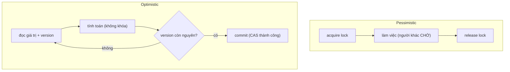
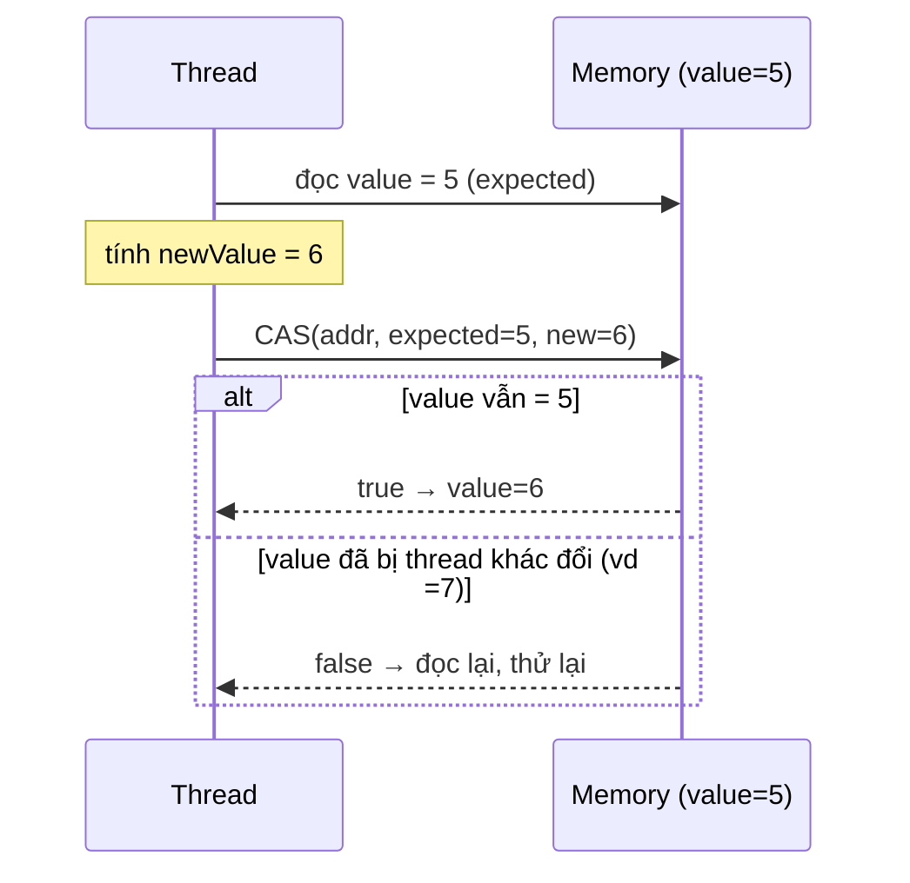
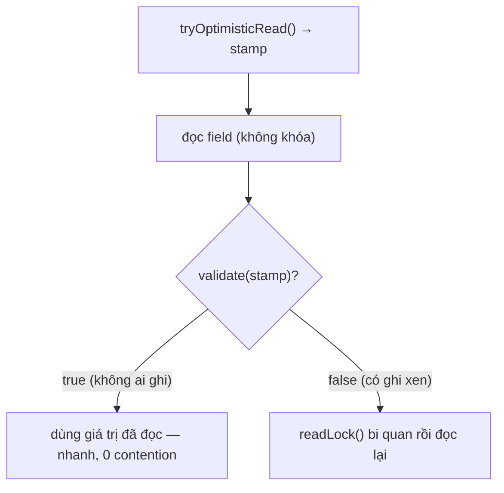
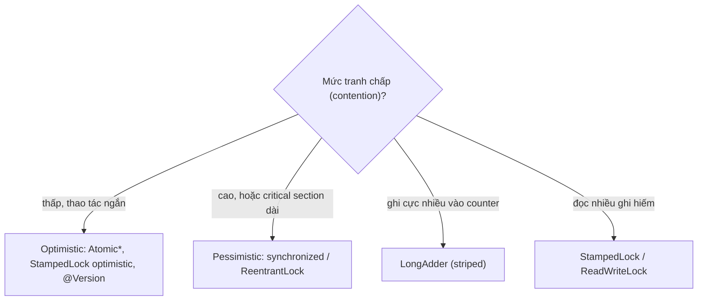

## Mục lục

- [Counter đếm sai dưới tải cao — synchronized vs AtomicInteger vs LongAdder](#1-counter-đếm-sai-dưới-tải-cao--synchronized-vs-atomicinteger-vs-longadder)
- [Hai triết lý: bi quan vs lạc quan](#2-hai-triết-lý-bi-quan-vs-lạc-quan)
- [Pessimistic lock — synchronized & ReentrantLock](#3-pessimistic-lock--synchronized--reentrantlock)
- [CAS — trái tim của optimistic lock](#4-cas--trái-tim-của-optimistic-lock)
- [AtomicInteger — vòng lặp CAS trong thực tế](#5-atomicinteger--vòng-lặp-cas-trong-thực-tế)
- [ABA problem & AtomicStampedReference](#6-aba-problem--atomicstampedreference)
- [StampedLock — optimistic read trong JDK](#7-stampedlock--optimistic-read-trong-jdk)
- [Optimistic lock ở tầng DB — @Version](#8-optimistic-lock-ở-tầng-db--version)
- [Chọn loại nào theo mức contention](#9-chọn-loại-nào-theo-mức-contention)
- [Anti-patterns cần tránh](#10-anti-patterns-cần-tránh)
- [Tóm tắt — Cheat sheet & nguyên tắc](#11-tóm-tắt--cheat-sheet--nguyên-tắc)

---

## 1. Counter đếm sai dưới tải cao — synchronized vs AtomicInteger vs LongAdder

Lock không chỉ có `synchronized`. Có cả một quang phổ từ **bi quan** (chặn thread khác, park) tới **lạc quan** (cho làm, kiểm tra lúc commit). Chọn đúng triết lý quyết định hiệu năng — `AtomicInteger` có thể nhanh hơn `synchronized` 4×, nhưng sai hoàn cảnh thì `LongAdder` lại thắng cả hai. Bắt đầu từ một counter đếm sai.

Một bộ đếm lượt xem dùng biến `int` thường, nhiều thread cùng `++`:

```java
int views = 0;
void onView() { views++; }   // 😱 không atomic: read → +1 → write (3 bước)
```

Dưới 16 thread, sau 1 triệu lượt mỗi thread, `views` ra **ít hơn** 16 triệu rất nhiều. Lý do: `views++` là **ba thao tác** (đọc, cộng, ghi) — hai thread đọc cùng giá trị `v`, cùng ghi `v+1` → mất một lượt (lost update).

Hai cách sửa, hai triết lý:

```java
// Pessimistic: khóa độc quyền
synchronized void onView() { views++; }

// Optimistic: CAS không khóa
AtomicInteger views = new AtomicInteger();
void onView() { views.incrementAndGet(); }   // vòng lặp CAS bên trong
```

```text
Benchmark (16 thread, contention vừa)   Throughput
synchronized counter                    ~  45 M ops/s
AtomicInteger (CAS)                      ~ 180 M ops/s   ← không khóa, không park thread
LongAdder (striped)                      ~ 850 M ops/s   ← chia ô, contention thấp nhất
```

Phần còn lại của doc sẽ đi qua: hai triết lý bi quan vs lạc quan (§2) → pessimistic lock (§3) → CAS — gốc rễ optimistic (§4) → AtomicInteger/CAS loop (§5) → ABA problem (§6) → StampedLock optimistic read (§7) → optimistic ở tầng DB với `@Version` (§8) → cách chọn theo mức contention (§9).

> [!IMPORTANT]
> "Lock" không chỉ có `synchronized`. Có cả một quang phổ từ **bi quan** (chặn thread khác) tới **lạc quan** (cho làm, kiểm tra lúc commit). Chọn đúng phụ thuộc vào **mức tranh chấp (contention)**. Hiểu hai triết lý này là hiểu vì sao `AtomicInteger` nhanh hơn `synchronized`, và khi nào điều ngược lại đúng.

---

## 2. Hai triết lý: bi quan vs lạc quan

| | **Pessimistic (bi quan)** | **Optimistic (lạc quan)** |
|---|---------------------------|----------------------------|
| Giả định | "Chắc chắn sẽ có xung đột" | "Hiếm khi xung đột" |
| Hành động | **Khóa trước**, ai khác phải đợi | Cứ làm, **kiểm tra lúc ghi** |
| Khi xung đột | Thread khác **block/chờ** | Phát hiện → **retry** (làm lại) |
| Chi phí | Context switch, park/unpark thread | CPU quay vòng retry |
| Tốt khi | Contention **cao**, critical section dài | Contention **thấp**, thao tác ngắn |
| Ví dụ Java | `synchronized`, `ReentrantLock` | `AtomicInteger`, `StampedLock`, `@Version` |



> [!NOTE]
> Lạc quan **không phải "không có lock"** theo nghĩa tuyệt đối — nó là "không chặn ai cả; nếu phát hiện người khác đã thay đổi thì làm lại". Đánh đổi: tiết kiệm chi phí khóa khi rảnh, nhưng tốn retry khi đông. Đó là lý do nó **chỉ thắng khi contention thấp**.

---

## 3. Pessimistic lock — synchronized & ReentrantLock

Bi quan = giành quyền **độc quyền** trước khi vào vùng tới hạn. Thread khác bị **chặn** (block) cho tới khi lock được nhả:

```java
private final ReentrantLock lock = new ReentrantLock();
void transfer() {
    lock.lock();              // chờ tới khi giành được
    try {
        // critical section — chỉ một thread tại một thời điểm
    } finally {
        lock.unlock();        // LUÔN nhả trong finally
    }
}
```

Khi một thread không giành được lock, nó bị **park** (OS đưa ra khỏi CPU) và **unpark** khi lock rảnh — qua cơ chế **AQS** (xem [AQS Deep Dive](/concurrency/aqs-deep-dive/)). Chi phí park/unpark là **context switch** (~µs), đắt nếu xung đột nhiều lần ngắn.

> [!TIP]
> Bi quan **thắng khi critical section dài hoặc contention cao**: nếu cứ retry lạc quan sẽ tốn CPU vô ích (livelock kiểu spin), thì chặn thread lại và để nó ngủ rẻ hơn. `synchronized` còn được JIT tối ưu (biased/thin lock, lock elision) cho trường hợp ít/không tranh chấp — xem [synchronized internals](/concurrency/synchronized-internals-deep-dive/).

---

## 4. CAS — trái tim của optimistic lock

**CAS (Compare-And-Swap)** là một lệnh **nguyên tử của CPU** (x86: `cmpxchg`, ARM: `LDREX/STREX`). Ngữ nghĩa:

```
CAS(địa_chỉ, expected, newValue):
    nếu *địa_chỉ == expected:
        *địa_chỉ = newValue;  return true     ← thành công
    ngược lại:
        return false                          ← ai đó đã đổi, không ghi
```

Toàn bộ "so sánh rồi ghi" thực hiện **trong một lệnh nguyên tử** — không thread nào chen ngang được giữa chừng. Đây là **primitive không khóa (lock-free)** mà mọi optimistic lock xây trên đó.



> [!IMPORTANT]
> CAS là lý do optimistic lock tồn tại được: nó cho phép "kiểm tra giá trị chưa đổi **và** ghi giá trị mới" thành một thao tác bất khả phân. Không có CAS, optimistic lock có khe hở race ngay tại bước commit. Trong Java, CAS lộ ra qua `java.lang.invoke.VarHandle` (và `Unsafe` cũ).

---

## 5. AtomicInteger — vòng lặp CAS trong thực tế

`incrementAndGet()` không hề có khóa — nó là **vòng lặp CAS** (gọi là "CAS loop" / spin):

```java
public final int incrementAndGet() {
    int prev, next;
    do {
        prev = get();              // đọc giá trị hiện tại
        next = prev + 1;           // tính giá trị mới
    } while (!compareAndSet(prev, next));  // CAS; thất bại → lặp lại với prev mới
    return next;
}
```

```
Thread A: prev=5, next=6, CAS(5→6) ✓
Thread B: prev=5, next=6, CAS(5→6) ✗ (A đã đổi thành 6)
          → lặp: prev=6, next=7, CAS(6→7) ✓
```

- Không thread nào bị **block/park** — chỉ "quay vòng" đọc lại và thử lại.
- Khi contention **thấp**: gần như luôn CAS thành công ngay lần đầu → rất nhanh.
- Khi contention **cao**: nhiều thread retry liên tục → lãng phí CPU (spin). Lúc này `synchronized` hoặc `LongAdder` tốt hơn.

> [!TIP]
> `LongAdder`/`LongAccumulator` (Java 8+) giải bài toán contention cao của `AtomicLong`: thay vì một biến chung mà mọi thread tranh CAS, nó **chia thành nhiều ô (cell)**, mỗi thread cập nhật ô riêng, `sum()` cộng lại khi cần. Dưới tải ghi cực cao (counter, metrics), `LongAdder` nhanh hơn `AtomicLong` nhiều lần (xem benchmark mục 1).

---

## 6. ABA problem & AtomicStampedReference

CAS chỉ kiểm tra "giá trị có **bằng** expected không", **không** biết "giá trị có **từng bị đổi** không". Sinh ra **ABA problem**:

```
Thread 1: đọc A, chuẩn bị CAS(A → C)
Thread 2: đổi A → B → rồi đổi lại B → A
Thread 1: CAS(A → C) THÀNH CÔNG (vì giá trị vẫn "là A")
          nhưng thực tế đã có 2 lần thay đổi xảy ra ở giữa!
```

Với số đếm thuần túy, ABA thường vô hại. Nhưng với **cấu trúc dữ liệu lock-free** (stack/queue dùng con trỏ), ABA có thể nối lại một node đã bị giải phóng → hỏng cấu trúc.

Cách chống: gắn thêm **version/stamp** vào giá trị, CAS cả (giá trị, stamp):

```java
AtomicStampedReference<Node> top = new AtomicStampedReference<>(node, 0);

int[] stampHolder = new int[1];
Node cur = top.get(stampHolder);          // đọc cả giá trị + stamp
int stamp = stampHolder[0];
// ... tính toán ...
top.compareAndSet(cur, next, stamp, stamp + 1);  // CAS thất bại nếu stamp đã đổi
```

> [!WARNING]
> ABA là cái bẫy tinh vi nhất của lập trình lock-free. Mỗi lần dùng CAS trên **reference** mà object có thể được tái sử dụng/giải phóng, hãy hỏi: "Nếu giá trị quay về đúng như cũ thì sao?". Dùng `AtomicStampedReference` (stamp) hoặc `AtomicMarkableReference` (cờ boolean) để phân biệt "chưa đổi" với "đổi đi rồi đổi lại".

---

## 7. StampedLock — optimistic read trong JDK

`StampedLock` (Java 8) cung cấp **optimistic read** ngay trong thư viện chuẩn — đọc **không khóa**, chỉ kiểm tra lại xem có bị ghi đè giữa chừng không:

```java
private final StampedLock sl = new StampedLock();
private double x, y;

double distanceFromOrigin() {
    long stamp = sl.tryOptimisticRead();    // KHÔNG khóa — chỉ lấy "tem" thời điểm
    double curX = x, curY = y;              // đọc field (có thể bị ghi xen giữa)
    if (!sl.validate(stamp)) {              // có ai ghi sau khi lấy stamp?
        stamp = sl.readLock();              // → fallback sang read lock thật (bi quan)
        try { curX = x; curY = y; }
        finally { sl.unlockRead(stamp); }
    }
    return Math.sqrt(curX * curX + curY * curY);
}
```



- Khi **đọc nhiều, ghi hiếm**: optimistic read gần như luôn `validate` thành công → đọc **không tốn đồng bộ nào**, nhanh hơn cả `ReadWriteLock`.
- `StampedLock` **không reentrant** và không hỗ trợ Condition — khác `ReentrantLock`. Dùng sai dễ deadlock.

> [!CAUTION]
> `StampedLock` mạnh nhưng **dễ dùng sai**: phải copy field ra biến cục bộ **trước** khi `validate`, không reentrant, và phải cẩn thận khi nâng cấp (`tryConvertToWriteLock`). Chỉ dùng khi đã đo được `ReadWriteLock` là nút thắt và pattern là read-mostly.

---

## 8. Optimistic lock ở tầng DB — @Version

Cùng triết lý lạc quan áp lên database. Thay vì `SELECT ... FOR UPDATE` (pessimistic, khóa hàng), dùng **cột version**:

```java
@Entity
class Account {
    @Id Long id;
    long balance;
    @Version int version;     // Hibernate tự quản lý
}
```

Khi update, Hibernate sinh:

```sql
UPDATE account SET balance = ?, version = version + 1
WHERE id = ? AND version = ?    -- version PHẢI khớp giá trị lúc đọc
```

- Nếu `WHERE` khớp (version chưa đổi) → update thành công, version +1.
- Nếu **0 dòng bị ảnh hưởng** (ai đó đã update trước, version đã tăng) → Hibernate ném `OptimisticLockException` → ứng dụng **retry** giao dịch.

| | Pessimistic (`SELECT FOR UPDATE`) | Optimistic (`@Version`) |
|---|-----------------------------------|--------------------------|
| Khóa hàng | Có (người khác chờ) | Không |
| Tốt khi | Tranh chấp cao, transaction ngắn | Tranh chấp thấp, đọc nhiều |
| Rủi ro | Lock contention, deadlock | Phải xử lý retry khi xung đột |

> [!IMPORTANT]
> Optimistic DB lock dịch chuyển trách nhiệm xử lý xung đột sang **tầng ứng dụng**: bạn phải bắt `OptimisticLockException` và **retry** (đọc lại, áp lại thay đổi). Nó tránh giữ khóa DB lâu (tốt cho scale) nhưng yêu cầu logic retry idempotent.

---

## 9. Chọn loại nào theo mức contention



| Tình huống | Lựa chọn |
|-----------|----------|
| Counter đơn giản, contention vừa | `AtomicInteger`/`AtomicLong` |
| Counter, contention cực cao | `LongAdder` |
| Đọc nhiều, ghi rất hiếm | `StampedLock` (optimistic read) |
| Critical section phức tạp/dài | `synchronized` / `ReentrantLock` |
| Cập nhật DB, xung đột hiếm | `@Version` (optimistic) |
| Cập nhật DB, xung đột cao | `SELECT FOR UPDATE` (pessimistic) |

> [!TIP]
> Quy tắc ngón tay cái: **đo trước**. Optimistic thắng khi xung đột hiếm (retry gần như không xảy ra); pessimistic thắng khi xung đột thường xuyên (retry sẽ phí CPU). Đừng mặc định "lock-free luôn nhanh hơn" — dưới contention cao, CAS loop có thể tệ hơn một lock biết park thread.

---

## 10. Anti-patterns cần tránh

| Anti-pattern | Vì sao sai | Thay bằng |
|--------------|-----------|-----------|
| `views++` chia sẻ giữa thread | Không atomic → lost update | `AtomicInteger` / `synchronized` |
| Optimistic CAS loop dưới contention cao | Spin lãng phí CPU | `synchronized` / `LongAdder` |
| CAS reference mà bỏ qua ABA | Cấu trúc lock-free hỏng | `AtomicStampedReference` |
| `@Version` nhưng không retry khi `OptimisticLockException` | Mất update, lỗi lan ra user | Bắt exception + retry idempotent |
| `lock()` mà không `unlock()` trong `finally` | Lock rò khi exception → deadlock | Luôn `try/finally` |
| `StampedLock` dùng như reentrant | Deadlock (không reentrant) | `ReentrantLock` nếu cần reentrant |
| Pessimistic lock giữ qua I/O dài | Chặn mọi thread khác lâu | Giảm phạm vi khóa, optimistic |

---

## 11. Tóm tắt — Cheat sheet & nguyên tắc

**Cỗ máy trong 6 dòng:**

```
1. Pessimistic = khóa trước, người khác CHỜ (synchronized, ReentrantLock)
2. Optimistic  = cứ làm, kiểm tra lúc commit, xung đột → RETRY
3. CAS = lệnh CPU nguyên tử (cmpxchg): so expected, khớp thì ghi, không thì fail
4. AtomicInteger = vòng lặp CAS (spin), không park thread
5. ABA: giá trị quay về cũ qua mặt CAS → dùng AtomicStampedReference
6. DB: @Version (optimistic, retry) vs SELECT FOR UPDATE (pessimistic, khóa hàng)
```

| | Pessimistic | Optimistic |
|---|-------------|------------|
| Cơ chế | block/park | CAS + retry |
| Tốt khi | contention cao | contention thấp |
| Chi phí | context switch | CPU spin |

**5 nguyên tắc khắc cốt:**

1. **Optimistic thắng khi xung đột hiếm**; pessimistic thắng khi xung đột nhiều.
2. **CAS là nền tảng lock-free** — nguyên tử "so rồi ghi" trong một lệnh CPU.
3. **Coi chừng ABA** khi CAS trên reference — dùng stamp/version.
4. **Contention ghi cực cao → `LongAdder`**, không phải `AtomicLong`.
5. **Optimistic DB lock buộc phải có retry** — `@Version` + bắt `OptimisticLockException`.

> [!TIP]
> Một câu để nhớ: *Bi quan giả định "sẽ đụng nhau nên khóa lại"; lạc quan giả định "hiếm khi đụng nên cứ làm, sai thì làm lại".* Chọn sai triết lý so với mức contention thực tế là nguyên nhân số một khiến code đồng bộ vừa chậm vừa khó đoán.
