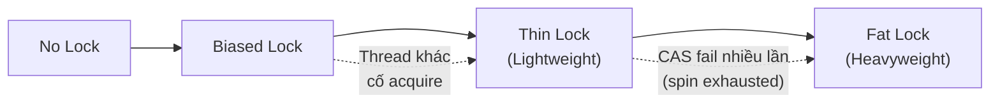

## Mục lục

- [Bối cảnh: lock 1 method mà throughput tụt 10× — lock contention](#1-bối-cảnh-lock-1-method-mà-throughput-tụt-10--lock-contention)
- [Object Header — Mark Word chứa lock state](#2-object-header--mark-word-chứa-lock-state)
- [Lock Escalation — 4 cấp độ lock](#3-lock-escalation--4-cấp-độ-lock)
- [Biased Locking — lock "miễn phí" cho single thread](#4-biased-locking--lock-miễn-phí-cho-single-thread)
- [Thin Lock (Lightweight) — CAS trên mark word](#5-thin-lock-lightweight--cas-trên-mark-word)
- [Fat Lock (Heavyweight) — ObjectMonitor và OS mutex](#6-fat-lock-heavyweight--objectmonitor-và-os-mutex)
- [Monitor Enter/Exit — bytecode và JVM implementation](#7-monitor-enterExit--bytecode-và-jvm-implementation)
- [wait() / notify() / notifyAll() — WaitSet internals](#8-wait--notify--notifyall--waitset-internals)
- [Lock Coarsening — JIT gộp nhiều lock liên tiếp](#9-lock-coarsening--jit-gộp-nhiều-lock-liên-tiếp)
- [Lock Elimination — JIT xoá lock không cần thiết](#10-lock-elimination--jit-xoá-lock-không-cần-thiết)
- [Adaptive Spinning — spin trước khi park](#11-adaptive-spinning--spin-trước-khi-park)
- [synchronized vs ReentrantLock — khi nào dùng gì](#12-synchronized-vs-reentrantlock--khi-nào-dùng-gì)
- [Tóm tắt — Cheat sheet & 5 nguyên tắc](#13-tóm-tắt--cheat-sheet--5-nguyên-tắc)

---

## 1. Bối cảnh: lock 1 method mà throughput tụt 10× — lock contention

Service xử lý order có counter synchronized:

```java
public class OrderCounter {
    private long count = 0;

    public synchronized void increment() { count++; }
    public synchronized long getCount() { return count; }
}
```

32 thread gọi `increment()` liên tục. Throughput: **8 triệu ops/s** (1 thread) → **800K ops/s** (32 threads). Chậm **10 lần** — thêm thread mà chậm đi!

```text
Threads    Ops/s       Avg latency
1          8,200,000   ~120 ns
4          3,500,000   ~1.1 µs
16         1,200,000   ~13 µs
32           800,000   ~40 µs    ← context switch + OS scheduler overhead
```

> [!IMPORTANT]
> `synchronized` **không chậm** — lock **contention** chậm. Khi chỉ 1 thread dùng, biased lock gần như zero-cost. Khi nhiều thread tranh nhau, lock escalate → heavyweight → OS context switch. Hiểu escalation = hiểu khi nào synchronized "rẻ" và khi nào "đắt".

---

## 2. Object Header — Mark Word chứa lock state

Mỗi Java object trên heap bắt đầu bằng **Object Header**:

```
64-bit JVM (compressed oops):
┌──────────────────────────────────────────────┬──────────┐
│              Mark Word (64 bits)              │ Klass Ptr│
│  (lock state, hashCode, GC age, ...)         │ (32 bits)│
└──────────────────────────────────────────────┴──────────┘
│←──────────── Object Header (96 bits) ───────────────────→│
```

**Mark Word layout** — thay đổi tuỳ lock state:

| Lock State | Bit Pattern (64-bit) | Nội dung |
|-----------|---------------------|----------|
| **Unlocked** (normal) | `[hashCode:31][age:4][biased:0][01]` | Identity hash, GC age |
| **Biased** | `[threadID:54][epoch:2][age:4][biased:1][01]` | Thread owner, bias epoch |
| **Thin Lock** (lightweight) | `[lock_record_ptr:62][00]` | Pointer to Lock Record on stack |
| **Fat Lock** (heavyweight) | `[monitor_ptr:62][10]` | Pointer to ObjectMonitor |
| **GC marked** | `[forwarding_addr:62][11]` | Used during GC |

> [!NOTE]
> Lock tag ở 2 bit cuối: `01` = unlocked/biased, `00` = thin lock, `10` = fat lock. JVM nhìn 2 bit cuối để biết ngay object đang ở trạng thái lock nào — O(1) check.

---

## 3. Lock Escalation — 4 cấp độ lock



| Cấp | Chi phí | Khi nào | Mechanism |
|-----|---------|---------|-----------|
| **Biased** | ~0 (1 CMP instruction) | 1 thread duy nhất acquire lặp lại | ThreadID trong mark word |
| **Thin** | CAS (vài ns) | 2+ thread acquire nhưng **không cùng lúc** | Lock Record trên stack |
| **Fat** | OS mutex (µs range) | 2+ thread **đồng thời** contend | ObjectMonitor + park/unpark |

> [!IMPORTANT]
> Lock **chỉ escalate, không de-escalate** (trong lifecycle của 1 lần monitor enter). Fat lock không tự hạ xuống thin. Nhưng sau khi TẤT CẢ thread release, object CÓ THỂ rebias hoặc trở lại unlocked ở lần acquire sau (tuỳ JVM strategy).

---

## 4. Biased Locking — lock "miễn phí" cho single thread

**Ý tưởng**: đa số lock trong thực tế chỉ được acquire bởi **1 thread** (VD: khởi tạo, single-threaded phase). Biased lock "nhớ" thread đầu tiên — lần acquire tiếp theo chỉ cần **check threadID trong mark word** (1 compare), không cần CAS.

```
Lần đầu acquire (bias):
  Mark Word: [threadID = T1][epoch][age][1][01]
  → Ghi threadID vào mark word (CAS 1 lần duy nhất)

Lần sau T1 acquire lại:
  → Check mark word threadID == T1? ✅ → Enter! (không CAS, không atomic op)
  → Chi phí ≈ 1 memory read + 1 compare = ~1 ns
```

**Revoke biased lock** (khi thread khác muốn acquire):
1. Đợi **safepoint** (global pause) — thread bias holder dừng tại safe point.
2. Kiểm tra T1 có còn đang trong synchronized block?
   - Nếu **không** → revoke bias, set mark word về unlocked/thin.
   - Nếu **có** → inflate thẳng lên thin/fat lock.

> [!WARNING]
> **JDK 15 deprecate Biased Locking** (`-XX:-UseBiasedLocking` default OFF từ JDK 18). Lý do: safepoint-based revocation gây latency spike, và modern workload ít có pure single-thread lock pattern. Thin lock với CAS đã đủ nhanh trên hardware hiện đại.

---

## 5. Thin Lock (Lightweight) — CAS trên mark word

Khi có **2 thread** (nhưng không đồng thời contend), biased lock bị revoke → escalate thành **thin lock**:

### 5.1. Lock Record

JVM tạo **Lock Record** trên stack frame của thread đang acquire:

```
Thread T1 stack:
┌───────────────────┐
│ Lock Record       │
│ ├─ displaced mark │  ← copy mark word gốc vào đây (backup)
│ └─ obj reference  │  ← pointer tới object bị lock
└───────────────────┘
```

### 5.2. Acquire flow

```java
// Pseudo-code:
Lock Record lr = allocate_on_stack();
lr.displaced_mark = obj.mark_word;    // backup mark word gốc
lr.obj = obj;

// CAS: swap mark word thành pointer tới Lock Record
if (CAS(obj.mark_word, lr.displaced_mark, ptr_to_lr | 00)) {
    // Thành công! Lock acquired (thin)
} else {
    // CAS fail → có thread khác đã lock
    // Spin một số lần → nếu vẫn fail → inflate lên fat lock
}
```

### 5.3. Release flow

```java
// CAS: swap mark word ngược lại (restore displaced mark)
if (CAS(obj.mark_word, ptr_to_lr, lr.displaced_mark)) {
    // Thành công! Unlock (thin → unlocked)
} else {
    // Mark word đã bị thay đổi (inflated lên fat) → phải release fat lock
    slow_exit(obj);
}
```

> [!TIP]
> Thin lock cost = 1 CAS acquire + 1 CAS release = **~10-20 ns** (no contention). Nhanh hơn 100x so với fat lock (OS mutex). Khi lock "luân phiên" giữa thread (thread A lock → unlock → thread B lock) mà không đồng thời, thin lock vẫn đủ.

---

## 6. Fat Lock (Heavyweight) — ObjectMonitor và OS mutex

Khi thin lock CAS fail nhiều lần (spin exhausted hoặc nhiều thread cùng lúc) → **inflate** thành fat lock. JVM tạo `ObjectMonitor` (C++ struct trong HotSpot):

```cpp
// hotspot/src/share/vm/runtime/objectMonitor.hpp (simplified)
class ObjectMonitor {
    volatile markWord _header;       // displaced mark word (gốc)
    volatile intptr_t _owner;        // thread đang giữ lock (hoặc NULL)
    volatile int _recursions;        // reentrant count
    ObjectWaiter* volatile _EntryList; // thread đang cố acquire (blocked)
    ObjectWaiter* volatile _cxq;      // contention queue (newly blocked)
    ObjectWaiter* volatile _WaitSet;  // thread gọi wait() (waiting)
    volatile int _Spinlock;
    volatile int _SpinDuration;      // adaptive spin count
};
```

```
Object Mark Word: [ObjectMonitor* | 10]

ObjectMonitor:
┌─────────────────────────────────────────────────┐
│ _owner = Thread T1 (đang giữ lock)             │
│ _recursions = 0                                 │
│ _EntryList: T2 → T3 → null (đang chờ acquire) │
│ _WaitSet:   T4 → null (đã gọi wait())         │
│ _cxq:       T5 → null (mới bị block)          │
└─────────────────────────────────────────────────┘
```

### 6.1. Enter (acquire fat lock)

```
1. CAS _owner NULL → current_thread
   → thành công: lock acquired!
   → thất bại: contention

2. Nếu _owner == current_thread → reentrant: _recursions++

3. Spin (adaptive) — CAS thử thêm vài lần
   → spin thành công: avoid park (vẫn ở user-space)

4. Spin exhausted → enqueue vào _cxq → park thread (OS level)
   → Thread chuyển RUNNABLE → BLOCKED
   → Context switch (~5-15 µs)
```

### 6.2. Exit (release fat lock)

```
1. _recursions > 0? → _recursions-- (vẫn giữ lock)
2. _recursions == 0: _owner = NULL
3. Chọn successor từ _EntryList hoặc _cxq → unpark
4. Successor wake up → thử acquire lại (CAS _owner)
```

> [!IMPORTANT]
> Fat lock = **OS mutex** dưới hood (`pthread_mutex` trên Linux, `CRITICAL_SECTION` trên Windows). Cost: park/unpark ≈ 2 context switch ≈ **10-30 µs**. So với thin lock (10-20 ns) → chênh lệch **1000×**. Đó là lý do JVM cố hết sức giữ ở thin/biased.

---

## 7. Monitor Enter/Exit — bytecode và JVM implementation

### 7.1. synchronized method

```java
public synchronized void doWork() { ... }
// Bytecode: ACC_SYNCHRONIZED flag trên method
// JVM: acquire monitor trước khi enter method body, release khi return/throw
```

### 7.2. synchronized block

```java
synchronized (obj) {
    // critical section
}
// Bytecode:
//   monitorenter    ← acquire
//   ... code ...
//   monitorexit     ← release (normal path)
//   monitorexit     ← release (exception path — compiler sinh thêm)
```

```
javap output:
  3: aload_1
  4: dup
  5: astore_2
  6: monitorenter          ← enter
  7: ... (body) ...
  14: aload_2
  15: monitorexit           ← exit (normal)
  16: goto 24
  19: astore_3             ← exception handler
  20: aload_2
  21: monitorexit           ← exit (exception) — đảm bảo unlock
  22: aload_3
  23: athrow
```

> [!NOTE]
> Compiler sinh **2 monitorexit** — một cho normal return, một cho exception path. Đảm bảo lock **luôn** được release kể cả khi throw exception. Đây là advantage so với manual lock (`ReentrantLock.unlock()` trong finally).

---

## 8. wait() / notify() / notifyAll() — WaitSet internals

`Object.wait()` và `notify()` chỉ gọi được khi **đang giữ monitor** (trong synchronized block/method):

### 8.1. wait()

```
Thread T1 đang giữ monitor:
1. Tạo ObjectWaiter node, enqueue vào _WaitSet
2. Release monitor (_owner = NULL, _recursions saved)
3. Park thread → WAITING state
4. Khi được notify: chuyển từ _WaitSet → _EntryList
5. Re-acquire monitor (có thể phải đợi)
6. Restore _recursions → tiếp tục từ sau wait()
```

### 8.2. notify()

```
Thread T2 gọi notify() (đang giữ monitor):
1. Lấy 1 node từ _WaitSet (đầu hoặc cuối, JVM-dependent)
2. Chuyển node sang _EntryList hoặc _cxq
3. KHÔNG unpark ngay — thread chỉ eligible để compete lock
4. Khi T2 exit monitor → successor (có thể là node vừa notify) được unpark
```

### 8.3. notifyAll()

```
Chuyển TẤT CẢ node từ _WaitSet → _EntryList
→ Tất cả sẽ compete lock khi monitor released
→ Chỉ 1 thắng, còn lại block lại
```

> [!WARNING]
> **Spurious wakeup**: Thread có thể thoát `wait()` mà **không** được notify (do OS scheduling). Luôn dùng `while` loop check condition:
> ```java
> synchronized (lock) {
>     while (!condition) {    // WHILE, không phải IF
>         lock.wait();
>     }
> }
> ```

---

## 9. Lock Coarsening — JIT gộp nhiều lock liên tiếp

JIT compiler nhận diện **chuỗi lock/unlock liên tiếp trên cùng object** → gộp thành 1 lock lớn:

```java
// Source:
synchronized (obj) { doA(); }
synchronized (obj) { doB(); }
synchronized (obj) { doC(); }

// JIT coarsened:
synchronized (obj) { doA(); doB(); doC(); }  // 1 lock thay vì 3
```

**Kể cả trong loop** (aggressive coarsening):

```java
for (int i = 0; i < 100; i++) {
    synchronized (obj) { list.add(i); }
}
// JIT có thể coarsen thành:
synchronized (obj) {
    for (int i = 0; i < 100; i++) { list.add(i); }
}
```

> [!NOTE]
> Coarsening **tăng** thời gian giữ lock → tăng contention nếu có thread khác chờ. JIT chỉ coarsen khi xác định contention thấp (profile-guided). Flag: `-XX:+EliminateLocks` (default ON).

---

## 10. Lock Elimination — JIT xoá lock không cần thiết

JIT + **Escape Analysis** phát hiện object **không escape** scope hiện tại → lock trên nó vô nghĩa (không thread nào khác thấy):

```java
public String concat(String a, String b) {
    StringBuffer sb = new StringBuffer();  // sb KHÔNG escape method
    sb.append(a);    // synchronized bên trong StringBuffer
    sb.append(b);    // synchronized bên trong StringBuffer
    return sb.toString();
}
// JIT: sb chỉ dùng local → không ai khác truy cập → XOÁ lock hoàn toàn
// → Chạy như StringBuilder (không sync)
```

**Điều kiện**: object phải **không escape** — không gán vào field, không return, không truyền cho thread khác.

```java
// ❌ Lock elimination KHÔNG xảy ra — object escape
private StringBuffer shared;
public void append(String s) {
    shared.append(s);  // shared escape → lock giữ nguyên
}
```

> [!TIP]
> Flag: `-XX:+DoEscapeAnalysis` (default ON) + `-XX:+EliminateLocks` (default ON). Để verify: `-XX:+PrintEliminatedLocks` (debug build). Đây là lý do `StringBuffer` gần bằng `StringBuilder` khi dùng local — JIT xoá lock rồi.

---

## 11. Adaptive Spinning — spin trước khi park

Trước khi park thread (fat lock → context switch đắt), JVM **spin** — vòng lặp busy-wait kiểm tra lock release:

```
CAS fail → spin loop:
  for (int i = 0; i < spinCount; i++) {
      if (CAS(_owner, NULL, current)) → lock acquired! (avoid park)
      pause;  // x86 PAUSE instruction (reduce power, hint pipeline)
  }
  → spin fail → park thread (OS context switch)
```

**Adaptive**: JVM theo dõi **history** — nếu spin thường thành công → tăng `spinCount`. Nếu spin thường fail → giảm `spinCount` (hoặc bỏ spin luôn):

```
Object A: spin thành công 80% lần → spinCount tăng lên 200
Object B: spin fail 95% lần → spinCount giảm về 0 (park ngay, đừng đốt CPU)
```

> [!NOTE]
> Spin có lợi khi **critical section ngắn** (lock holder sắp release). Nếu critical section dài (I/O, computation), spin = đốt CPU vô ích. JVM adaptive strategy tự điều chỉnh — không cần tune thủ công.

---

## 12. synchronized vs ReentrantLock — khi nào dùng gì

| Tiêu chí | `synchronized` | `ReentrantLock` |
|----------|---------------|-----------------|
| Syntax | Block/method — tự release | Explicit `lock()`/`unlock()` trong try-finally |
| Fair option | Không (luôn unfair) | `new ReentrantLock(true)` |
| tryLock (timeout) | Không | `tryLock(5, SECONDS)` |
| lockInterruptibly | Không | ✅ |
| Multiple conditions | 1 (`wait/notify`) | Nhiều `Condition` objects |
| Performance (no contention) | Gần như bằng nhau (JIT optimize) | Gần bằng |
| Performance (contention) | Gần bằng (adaptive spin + inflate) | Gần bằng |
| Deadlock detection | Không | Không (nhưng tryLock giúp tránh) |
| Auto-release on exception | ✅ | ❌ Phải try-finally |

**Dùng `synchronized` khi:**
- Lock đơn giản, scope rõ ràng (block/method)
- Không cần timeout, interrupt, fair, multiple conditions
- Muốn code ngắn gọn, ít bug (tự release)

**Dùng `ReentrantLock` khi:**
- Cần tryLock / timeout → tránh deadlock
- Cần lockInterruptibly → cancel được
- Cần fair lock → đảm bảo latency bounded
- Cần nhiều Condition → phức tạp hơn wait/notify

> [!TIP]
> Default choice: **`synchronized`**. Chỉ chuyển sang `ReentrantLock` khi cần feature mà synchronized không có. Code đơn giản hơn = ít bug hơn.

---

## 13. Tóm tắt — Cheat sheet & 5 nguyên tắc

**Cỗ máy trong 6 dòng:**

```
1. Lock state nằm trong Object Header Mark Word (2 bit tag: 01/00/10)
2. Biased lock: ghi threadID, lần sau chỉ compare — gần zero cost (deprecated JDK 15+)
3. Thin lock: CAS mark word ↔ Lock Record trên stack — ~10-20 ns
4. Fat lock: ObjectMonitor (C++), _owner/_EntryList/_WaitSet, OS mutex — ~10-30 µs
5. JIT: lock elimination (escape analysis) + lock coarsening (merge adjacent locks)
6. Adaptive spinning: spin trước khi park, adjust spin count theo history
```

| Lock type | Cost | When |
|-----------|------|------|
| Biased | ~1 ns (1 compare) | Single-thread repeated lock |
| Thin (no contention) | ~10-20 ns (CAS) | Multi-thread, alternating |
| Fat (contention) | ~10-30 µs (park/unpark) | Multi-thread, simultaneous |
| Eliminated | 0 ns | Object doesn't escape (JIT) |

**5 nguyên tắc khắc cốt:**

1. **Lock contention là vấn đề, không phải synchronized** — single-thread lock gần zero cost. Giảm contention (shorten critical section, reduce lock scope) hiệu quả hơn đổi lock implementation.
2. **Lock escalation chỉ đi lên** — biased → thin → fat trong 1 acquisition cycle. JVM cố giữ ở level thấp nhất có thể.
3. **JIT aggressive optimize** — escape analysis xoá lock, coarsening gộp lock, adaptive spin tránh park. Đừng tự optimize bằng tay cái JIT đã lo.
4. **Keep critical section SHORT** — spin chỉ lợi khi holder sắp release. I/O trong synchronized = mọi thread park = throughput sập.
5. **Synchronized tự release khi exception** — advantage lớn so với ReentrantLock. Ít code = ít bug. Default choice trừ khi cần advanced features.

> [!TIP]
> Một câu để nhớ: *Synchronized rẻ khi không contention (JVM tối ưu tới tận hardware level), đắt khi contention (OS context switch). Mục tiêu không phải "tránh synchronized" mà là "giảm contention time".*
