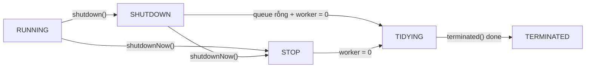
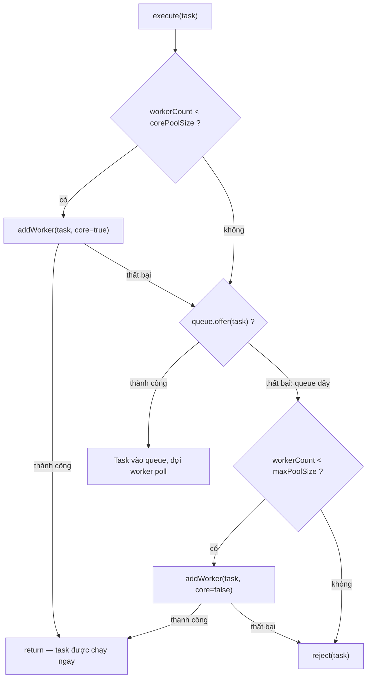

`ThreadPoolExecutor` quản lý một tập worker để tái sử dụng thread và giới hạn lượng công việc chạy đồng thời. Nó tách việc gửi task khỏi chính sách tạo thread, xếp hàng và từ chối task khi hệ thống quá tải.

## Mục lục

- [Tổng quan](#1-tổng-quan)
- [Tại sao cần Thread Pool](#2-tại-sao-cần-thread-pool)
- [Kiến trúc ThreadPoolExecutor — ctl, Worker, BlockingQueue](#3-kiến-trúc-threadpoolexecutor--ctl-worker-blockingqueue)
- [ctl — 32 bit chứa 2 thông tin](#4-ctl--32-bit-chứa-2-thông-tin)
- [Flow execute() — quyết định core, queue hay reject](#5-flow-execute--quyết-định-core-queue-hay-reject)
- [Worker — thread wrapper và main loop](#6-worker--thread-wrapper-và-main-loop)
- [BlockingQueue strategies — chọn queue quyết định hành vi pool](#7-blockingqueue-strategies--chọn-queue-quyết-định-hành-vi-pool)
- [RejectionHandler — khi pool và queue đều đầy](#8-rejectionhandler--khi-pool-và-queue-đều-đầy)
- [Thread Keep-Alive & Idle Timeout](#9-thread-keep-alive--idle-timeout)
- [Shutdown — graceful vs brutal](#10-shutdown--graceful-vs-brutal)
- [Executors factory — tiện nhưng nguy hiểm](#11-executors-factory--tiện-nhưng-nguy-hiểm)
- [ForkJoinPool vs ThreadPoolExecutor](#12-forkjoinpool-vs-threadpoolexecutor)
- [Sizing formula — CPU-bound vs IO-bound](#13-sizing-formula--cpu-bound-vs-io-bound)
- [Anti-patterns & Tóm tắt](#14-anti-patterns--tóm-tắt)

---

## 1. Tổng quan

Một thread mới có chi phí bộ nhớ và lập lịch đáng kể, nên tạo thread không giới hạn có thể làm ứng dụng cạn tài nguyên trước khi tăng được throughput. Thread pool đưa các giới hạn này thành cấu hình rõ ràng qua core size, maximum size, work queue, keep-alive và rejection policy.

Cấu hình đúng phải phản ánh loại workload và năng lực của tài nguyên phía sau. Pool không làm biến mất bottleneck; nó chỉ giúp kiểm soát concurrency và backpressure.

## 2. Tại sao cần Thread Pool

| Cách | Chi phí tạo thread | Kiểm soát tài nguyên | Throughput |
|------|--------------------|-----------------------|-----------|
| `new Thread()` mỗi task | **Đắt**: allocate stack (~1 MB), OS scheduling | Không — có thể tạo vô hạn | Thấp (overhead tạo/huỷ) |
| Thread Pool | **Rẻ**: reuse thread có sẵn | Có — bound pool + queue | Cao |

Thread pool giải quyết 3 vấn đề:
1. **Reuse thread** — tránh overhead tạo/huỷ
2. **Bound tài nguyên** — giới hạn số thread tối đa
3. **Decouple submit và execute** — caller submit task, pool quyết định khi nào chạy

---

## 3. Kiến trúc ThreadPoolExecutor — ctl, Worker, BlockingQueue

```
┌──────────────────────────────────────────────────────┐
│                 ThreadPoolExecutor                   │
│                                                      │
│  ┌─────────┐    ┌────────────────────────┐           │
│  │  ctl    │    │    BlockingQueue       │           │
│  │ (state +│    │  ┌────┬────┬────┬───┐  │           │
│  │  count) │    │  │task│task│task│...│  │           │
│  └─────────┘    │  └────┴────┴────┴───┘  │           │
│                 └─────────────┬──────────┘           │
│                               │ poll/take            │
│  ┌──────────────────────────┐ │                      │
│  │       Workers (HashSet)  │◀┘                      │
│  │  ┌────────┐ ┌────────┐   │                        │
│  │  │Worker 0│ │Worker 1│...│   ← mỗi Worker wrap    │
│  │  │ thread │ │ thread │   │     một Thread thật    │
│  │  └────────┘ └────────┘   │                        │
│  └──────────────────────────┘                        │
│                                                      │
│  corePoolSize / maximumPoolSize / keepAliveTime      │
│  RejectedExecutionHandler                            │
└──────────────────────────────────────────────────────┘
```

Tham số constructor:

```java
public ThreadPoolExecutor(
    int corePoolSize,              // số thread "thường trực"
    int maximumPoolSize,           // số thread tối đa
    long keepAliveTime,            // idle thread > core được thu hồi sau thời gian này
    TimeUnit unit,
    BlockingQueue<Runnable> workQueue,   // hàng đợi task
    ThreadFactory threadFactory,          // đặt tên, priority, daemon
    RejectedExecutionHandler handler      // xử lý khi queue + pool đầy
)
```

---

## 4. ctl — 32 bit chứa 2 thông tin

`ctl` là trái tim trạng thái của ThreadPoolExecutor — một `AtomicInteger` mã hoá **cả** run state **và** worker count trong cùng 32 bit:

```java
private final AtomicInteger ctl = new AtomicInteger(ctlOf(RUNNING, 0));

// Layout: [3 bit runState] [29 bit workerCount]
private static final int COUNT_BITS = Integer.SIZE - 3;       // 29
private static final int COUNT_MASK = (1 << COUNT_BITS) - 1;  // 0x1FFFFFFF

private static int runStateOf(int c)     { return c & ~COUNT_MASK; }
private static int workerCountOf(int c)  { return c & COUNT_MASK; }
private static int ctlOf(int rs, int wc) { return rs | wc; }
```

### 4.1. Năm trạng thái run state

| State | Giá trị (3 bit cao) | Ý nghĩa |
|-------|---------------------|---------|
| **RUNNING** | `111` (= -1 << 29) | Nhận task mới, xử lý queue |
| **SHUTDOWN** | `000` (= 0) | Không nhận task mới, nhưng xử lý hết queue |
| **STOP** | `001` (= 1 << 29) | Không nhận, không xử lý, interrupt worker |
| **TIDYING** | `010` (= 2 << 29) | Mọi task done, workerCount = 0, sắp gọi terminated() |
| **TERMINATED** | `011` (= 3 << 29) | terminated() đã chạy xong |

Transition:



> [!NOTE]
> Vì RUNNING = -1 << 29 (số âm) và các state khác ≥ 0, code JDK so sánh trạng thái đơn giản: `runState < SHUTDOWN` nghĩa là đang RUNNING. Đây là trick dùng dấu âm/dương thay vì enum.

### 4.2. Tại sao gộp vào 1 AtomicInteger?

Để **cập nhật state + count một cách atomic** bằng CAS, không cần lock. Nếu dùng 2 biến riêng, sẽ cần synchronized để đảm bảo consistency — chậm hơn.

### 4.3. addWorker — CAS loop + ReentrantLock dual phase

```java
// Phase 1: CAS increment workerCount
retry:
for (;;) {
    int c = ctl.get();
    int rs = runStateOf(c);
    // check shutdown conditions...
    for (;;) {
        int wc = workerCountOf(c);
        if (wc >= CAPACITY || wc >= (core ? corePoolSize : maximumPoolSize))
            return false;
        if (compareAndIncrementWorkerCount(c))  // CAS: count + 1
            break retry;
        c = ctl.get();
        if (runStateOf(c) != rs)
            continue retry;  // state changed → outer loop
    }
}
// Phase 2: mainLock để thêm Worker vào HashSet
final ReentrantLock mainLock = this.mainLock;
mainLock.lock();
try {
    workers.add(w);           // HashSet<Worker>
    workerAdded = true;
} finally {
    mainLock.unlock();
}
if (workerAdded) w.thread.start();
```

**Tại sao 2 phase?**
- Phase 1 (CAS): nhanh, lock-free — chỉ increment count
- Phase 2 (lock): cần lock vì `workers` là HashSet (not thread-safe) + cần atomic check state

> [!NOTE]
> `workers` HashSet dùng cho: `shutdown()` interrupt all workers, `getPoolSize()`, `getActiveCount()`. Nếu không cần track workers → CAS alone đủ.

---

## 5. Flow execute() — quyết định core, queue hay reject

```java
public void execute(Runnable command) {
    int c = ctl.get();
    if (workerCountOf(c) < corePoolSize) {
        if (addWorker(command, true))          // (1) tạo core worker
            return;
        c = ctl.get();
    }
    if (isRunning(c) && workQueue.offer(command)) {  // (2) đẩy vào queue
        int recheck = ctl.get();
        if (!isRunning(recheck) && remove(command))
            reject(command);                    // pool shutdown giữa chừng
        else if (workerCountOf(recheck) == 0)
            addWorker(null, false);             // đảm bảo có worker xử lý
    }
    else if (!addWorker(command, false))        // (3) tạo non-core worker
        reject(command);                        // (4) reject — đầy hết
}
```



> [!IMPORTANT]
> Thứ tự ưu tiên: **core thread → queue → non-core thread → reject**. Non-core thread chỉ được tạo **sau khi queue đầy**. Nếu dùng `LinkedBlockingQueue` (unbounded), queue **không bao giờ** đầy → non-core thread **không bao giờ** được tạo → `maximumPoolSize` vô nghĩa.

---

## 6. Worker — thread wrapper và main loop

Mỗi Worker là một inner class kế thừa `AbstractQueuedSynchronizer` (AQS) và implement `Runnable`:

```java
private final class Worker extends AbstractQueuedSynchronizer implements Runnable {
    final Thread thread;           // thread thật
    Runnable firstTask;            // task đầu tiên (có thể null nếu tạo để poll queue)

    Worker(Runnable firstTask) {
        setState(-1);              // inhibit interrupts until runWorker
        this.firstTask = firstTask;
        this.thread = getThreadFactory().newThread(this);
    }

    public void run() { runWorker(this); }
}
```

### 6.1. runWorker — main loop

```java
final void runWorker(Worker w) {
    Thread wt = Thread.currentThread();
    Runnable task = w.firstTask;
    w.firstTask = null;
    w.unlock();                    // cho phép interrupt
    boolean completedAbruptly = true;
    try {
        while (task != null || (task = getTask()) != null) {  // lấy task từ queue
            w.lock();
            // kiểm tra nếu pool đang STOP → interrupt
            try {
                beforeExecute(wt, task);    // hook (override để monitor)
                try {
                    task.run();              // CHẠY TASK — nơi business logic thực thi
                } finally {
                    afterExecute(task, thrown);  // hook
                }
            } finally {
                task = null;
                w.completedTasks++;
                w.unlock();
            }
        }
        completedAbruptly = false;
    } finally {
        processWorkerExit(w, completedAbruptly);  // thu hồi worker
    }
}
```

**Loop**: `getTask()` block trên `workQueue.take()` (core thread) hoặc `workQueue.poll(keepAliveTime)` (non-core thread). Khi có task → chạy → quay lại lấy task tiếp. Worker chỉ thoát khi `getTask()` trả `null` (timeout hoặc shutdown).

> [!TIP]
> `beforeExecute` và `afterExecute` là **extension point** — override chúng để log, metrics, set MDC, hay detect task timeout. Đây là lý do ThreadPoolExecutor linh hoạt hơn Executors factory.

---

## 7. BlockingQueue strategies — chọn queue quyết định hành vi pool

| Queue | Bounded? | Hành vi | Khi nào dùng |
|-------|----------|---------|-------------|
| `SynchronousQueue` | 0 capacity | Không chứa gì — handoff trực tiếp | Khi muốn tạo thread ngay (cached pool) |
| `LinkedBlockingQueue` | Unbounded (default) | Queue vô hạn → non-core thread không bao giờ tạo | **Nguy hiểm** — OOM khi task tích tụ |
| `LinkedBlockingQueue(n)` | Bounded | Khi đầy → tạo non-core thread → reject | **Production recommended** |
| `ArrayBlockingQueue(n)` | Bounded | Như trên, dùng mảng (ít GC hơn) | Khi biết trước capacity |
| `PriorityBlockingQueue` | Unbounded | Task ưu tiên cao chạy trước | Task có priority |

### 7.1. SynchronousQueue — "direct handoff"

```
Producer: offer(task) → block cho đến khi có consumer take()
Consumer: take()       → block cho đến khi có producer offer()
```

Không buffer. Mỗi task phải có thread nhận ngay. Nếu không → tạo thread mới (tới max) → reject. Đây là queue của `newCachedThreadPool`.

### 7.2. LinkedBlockingQueue(n) — bounded queue (recommended)

```java
new ThreadPoolExecutor(
    10,                           // core
    50,                           // max
    60, TimeUnit.SECONDS,
    new LinkedBlockingQueue<>(1000),  // bounded queue 1000
    new ThreadPoolExecutor.CallerRunsPolicy()  // reject → caller chạy
);
```

Flow: core 10 thread bận → queue chứa tới 1000 → tạo thêm tới 50 thread → queue vẫn đầy → CallerRunsPolicy.

---

## 8. RejectionHandler — khi pool và queue đều đầy

| Handler | Hành vi | Use case |
|---------|---------|----------|
| `AbortPolicy` (default) | Throw `RejectedExecutionException` | Caller biết task bị từ chối |
| `CallerRunsPolicy` | **Caller thread** chạy task | Back-pressure tự nhiên — slow down producer |
| `DiscardPolicy` | Im lặng bỏ task | Fire-and-forget (metrics, logging) |
| `DiscardOldestPolicy` | Bỏ task cũ nhất trong queue, submit lại task mới | Khi task cũ hết giá trị |

### 8.1. CallerRunsPolicy — back-pressure ngầm

```java
// Khi pool + queue đầy:
// Thread gọi execute() PHẢI TỰ CHẠY task → thread đó bị block
// → không thể submit thêm → producer tự động chậm lại
```

Đây là cơ chế **back-pressure** đơn giản nhất: khi downstream (pool) quá tải, upstream (caller) bị chậm lại tự nhiên thay vì crash.

> [!WARNING]
> `CallerRunsPolicy` có thể **block event loop** nếu caller là thread quan trọng (vd Netty event loop, Tomcat acceptor). Chỉ dùng khi caller có thể "hy sinh" thời gian.

---

## 9. Thread Keep-Alive & Idle Timeout

Khi pool có nhiều hơn `corePoolSize` thread (non-core thread), thread idle quá `keepAliveTime` sẽ bị **thu hồi**:

```java
private Runnable getTask() {
    boolean timed = allowCoreThreadTimeOut || wc > corePoolSize;
    Runnable r = timed ?
        workQueue.poll(keepAliveTime, TimeUnit.NANOSECONDS) :  // timeout → null → thoát
        workQueue.take();                                       // block mãi mãi (core thread)
    return r;
}
```

- **Core thread** (default): `take()` — block vô hạn, không bao giờ bị thu hồi.
- **Non-core thread**: `poll(keepAliveTime)` — idle quá lâu → return null → worker thoát loop → processWorkerExit.

### 9.1. allowCoreThreadTimeOut

```java
executor.allowCoreThreadTimeOut(true);  // core thread cũng bị thu hồi nếu idle
```

Hữu ích khi pool phục vụ traffic không đều — lúc peak cần nhiều thread, lúc idle không cần thread nào.

---

## 10. Shutdown — graceful vs brutal

| Method | Nhận task mới? | Task trong queue? | Worker đang chạy? |
|--------|---------------|-------------------|-------------------|
| `shutdown()` | Không | **Chạy hết** | Chờ xong |
| `shutdownNow()` | Không | **Drain trả lại** `List<Runnable>` | **Interrupt** |

### 10.1. Graceful shutdown pattern

```java
executor.shutdown();                               // không nhận task mới
if (!executor.awaitTermination(60, TimeUnit.SECONDS)) {  // đợi 60s
    List<Runnable> pending = executor.shutdownNow();      // force stop
    log.warn("Force shutdown, {} tasks dropped", pending.size());
    executor.awaitTermination(10, TimeUnit.SECONDS);
}
```

> [!TIP]
> Luôn gọi `shutdown()` trong `finally` hoặc shutdown hook. Thread pool leak (không shutdown) giữ non-daemon thread sống → JVM **không thoát** dù `main()` đã return.

---

## 11. Executors factory — tiện nhưng nguy hiểm

| Factory | Tương đương | Bẫy |
|---------|------------|-----|
| `newFixedThreadPool(n)` | `new TPE(n, n, 0, LinkedBlockingQueue())` | Queue **unbounded** → OOM |
| `newCachedThreadPool()` | `new TPE(0, MAX_INT, 60s, SynchronousQueue())` | Thread **vô hạn** → OOM |
| `newSingleThreadExecutor()` | `new TPE(1, 1, 0, LinkedBlockingQueue())` | Queue unbounded + không thể resize |
| `newScheduledThreadPool(n)` | `ScheduledTPE(n)` | `DelayedWorkQueue` unbounded |

> [!WARNING]
> **Alibaba Java Coding Guidelines** (và nhiều company khác) cấm dùng `Executors` factory trong production. Luôn tự tạo `ThreadPoolExecutor` với bounded queue + explicit rejection handler + named ThreadFactory.

### 11.1. Production-ready pool template

```java
ThreadPoolExecutor pool = new ThreadPoolExecutor(
    Runtime.getRuntime().availableProcessors(),         // core = số CPU
    Runtime.getRuntime().availableProcessors() * 2,     // max = 2x CPU (IO-bound)
    60, TimeUnit.SECONDS,
    new LinkedBlockingQueue<>(5000),                    // bounded queue
    new ThreadFactory() {
        private final AtomicInteger counter = new AtomicInteger();
        @Override
        public Thread newThread(Runnable r) {
            Thread t = new Thread(r, "order-pool-" + counter.incrementAndGet());
            t.setDaemon(false);
            return t;
        }
    },
    new ThreadPoolExecutor.CallerRunsPolicy()           // back-pressure
);
```

---

## 12. ForkJoinPool vs ThreadPoolExecutor

| Tiêu chí | `ThreadPoolExecutor` | `ForkJoinPool` |
|----------|---------------------|----------------|
| Mô hình | Task queue chung | **Work-stealing** — mỗi worker có deque riêng |
| Task loại | Independent tasks | **Recursive** (fork/join, divide-and-conquer) |
| Steal | Không | Worker rảnh **steal** task từ deque worker bận |
| Dùng bởi | Phần lớn server workload | `parallelStream()`, `CompletableFuture.supplyAsync()` |
| commonPool | Không | `ForkJoinPool.commonPool()` — shared, `CPU - 1` thread |

```
ThreadPoolExecutor:                    ForkJoinPool:
┌──────────────────┐                   ┌──────────┐ ┌──────────┐ ┌──────────┐
│  Shared Queue    │                   │ Worker 0 │ │ Worker 1 │ │ Worker 2 │
│ [T1][T2][T3][T4] │                   │ [T1][T2] │ │ [T3]     │ │ []       │
└────────┬─────────┘                   └──────────┘ └──────────┘ └─────┬────┘
         │                                                             │
    All workers                                            steal T3 ◀──┘
    poll từ cùng queue
```

> [!NOTE]
> `ForkJoinPool.commonPool()` là pool **chia sẻ** cho toàn JVM. Nếu task blocking (I/O) chiếm hết common pool thread → `parallelStream()` ở nơi khác bị **chết đói**. Rule: không dùng common pool cho blocking I/O.

---

## 13. Sizing formula — CPU-bound vs IO-bound

| Loại task | Formula | Giải thích |
|----------|---------|-----------|
| **CPU-bound** (tính toán) | `N_threads = N_cpu + 1` | +1 để bù thread bị page fault/context switch |
| **IO-bound** (network, disk) | `N_threads = N_cpu × (1 + W/C)` | W = wait time, C = compute time |
| **Mixed** | Tách thành 2 pool riêng | Tránh IO task starve CPU task |

Ví dụ: 8 CPU, task HTTP call 200ms (W), xử lý 20ms (C):

```
N = 8 × (1 + 200/20) = 8 × 11 = 88 threads
```

> [!TIP]
> Formula là **điểm khởi đầu**. Production phải **đo** bằng load test + metrics (queue size, latency, thread utilization). Dùng `ThreadPoolExecutor` hooks hoặc Micrometer để monitor.

---

## 14. Anti-patterns & Tóm tắt

### Anti-patterns

| Anti-pattern | Vì sao sai | Sửa |
|--------------|-----------|-----|
| `Executors.newCachedThreadPool()` production | Thread vô hạn → OOM | Tự tạo TPE với max bound |
| `Executors.newFixedThreadPool(n)` production | Queue vô hạn → OOM | Bounded queue |
| Không đặt tên thread | Thread dump: `pool-1-thread-1` — vô nghĩa | Custom ThreadFactory |
| Blocking I/O trên ForkJoinPool.commonPool | Starve parallelStream | Pool riêng cho I/O |
| Không shutdown pool | Non-daemon thread giữ JVM sống | `shutdown()` trong finally/hook |
| `submit()` mà không check `Future.get()` | Exception bị nuốt âm thầm | Luôn `get()` hoặc dùng `execute()` |
| Core = max = rất lớn | Tạo hàng trăm thread sẵn, idle lãng phí | Core nhỏ, max lớn, keep-alive timeout |

### Tóm tắt — Cheat sheet

```
ThreadPoolExecutor = core threads + bounded queue + max threads + rejection handler

1. execute(): core thread → queue → non-core thread → reject
2. ctl: [3 bit state][29 bit workerCount] — CAS atomic update
3. Worker: loop getTask() → task.run() → getTask() → ...
4. Core thread: take() (block mãi); Non-core: poll(keepAliveTime) → timeout → exit
5. Shutdown: shutdown() (graceful) → awaitTermination → shutdownNow() (force)
6. KHÔNG dùng Executors factory trong production
```

| Cần gì | Dùng gì |
|--------|---------|
| Server workload (independent tasks) | `ThreadPoolExecutor` custom |
| Recursive / divide-and-conquer | `ForkJoinPool` |
| Scheduled / periodic task | `ScheduledThreadPoolExecutor` |
| IO-bound, high concurrency (Java 21+) | Virtual Threads (`Executors.newVirtualThreadPerTaskExecutor()`) |

> [!TIP]
> Một câu để nhớ: *ThreadPoolExecutor chỉ an toàn khi cả pool size, queue size, và rejection handler đều có bound rõ ràng.* Unbounded ở bất kỳ đâu = OOM chờ xảy ra.
