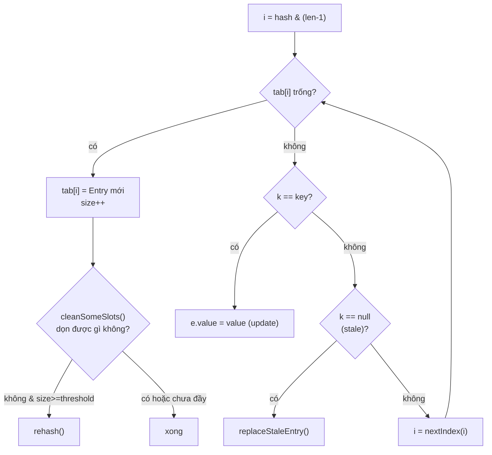
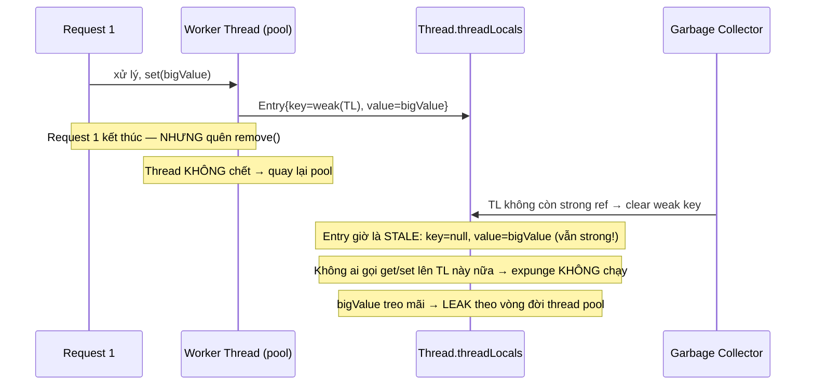

## Mục lục

- [Bối cảnh: truyền context xuyên 7 tầng method](#1-bối-cảnh-truyền-context-xuyên-7-tầng-method)
- [ThreadLocal là gì — mỗi thread một bản sao](#2-threadlocal-là-gì--mỗi-thread-một-bản-sao)
- [Đảo ngược quyền sở hữu — map nằm trong Thread, không nằm trong ThreadLocal](#3-đảo-ngược-quyền-sở-hữu--map-nằm-trong-thread-không-nằm-trong-threadlocal)
- [ThreadLocalMap — open addressing chứ không phải HashMap](#4-threadlocalmap--open-addressing-chứ-không-phải-hashmap)
- [Entry extends WeakReference — vì sao key yếu, value mạnh](#5-entry-extends-weakreference--vì-sao-key-yếu-value-mạnh)
- [threadLocalHashCode & magic number 0x61c88647](#6-threadlocalhashcode--magic-number-0x61c88647)
- [set() chi tiết — probe, replaceStaleEntry, rehash](#7-set-chi-tiết--probe-replacestaleentry-rehash)
- [get() chi tiết — getEntryAfterMiss & expungeStaleEntry](#8-get-chi-tiết--getentryaftermiss--expungestaleentry)
- [remove() — vì sao bắt buộc phải gọi](#9-remove--vì-sao-bắt-buộc-phải-gọi)
- [Memory leak — stale entry trong thread pool](#10-memory-leak--stale-entry-trong-thread-pool)
- [InheritableThreadLocal — truyền context sang thread con](#11-inheritablethreadlocal--truyền-context-sang-thread-con)
- [InheritableThreadLocal + thread pool = bẫy](#12-inheritablethreadlocal--thread-pool--bẫy)
- [ThreadLocal trong thực chiến — Spring & SimpleDateFormat](#13-threadlocal-trong-thực-chiến--spring--simpledateformat)
- [ThreadLocal & Virtual Threads — ScopedValue thay thế](#14-threadlocal--virtual-threads--scopedvalue-thay-thế)
- [Anti-patterns & bug kinh điển](#15-anti-patterns--bug-kinh-điển)
- [Tóm tắt — Cheat sheet & 6 nguyên tắc](#16-tóm-tắt--cheat-sheet--6-nguyên-tắc)

---

## 1. Bối cảnh: truyền context xuyên 7 tầng method

Bạn có một web app. Tại `Controller` bạn biết `userId`, `tenantId`, `traceId`. Nhưng tầng `Repository` ở tận đáy stack cũng cần `tenantId` để chọn schema. Giải pháp ngây thơ: truyền tham số xuyên suốt.

```java
controller.handle(req, userId, tenantId, traceId)
  → service.process(order, tenantId, traceId)
    → validator.validate(order, tenantId)
      → repository.save(order, tenantId)        // tenantId bị "kéo lê" qua 4 tầng
```

Vấn đề:
1. **Ô nhiễm chữ ký method**: mọi method phải thêm tham số dù không dùng — chỉ để "chuyền tay".
2. **Không thể chen vào thư viện**: code của framework/library ở giữa không nhận được context của bạn.
3. **Dễ quên / truyền nhầm**: 4 tầng × N method = vô số chỗ có thể sai.

Giải pháp thay thế: dùng **biến static** `static String tenantId`? Sai ngay — đa luồng sẽ ghi đè lẫn nhau (request A set `tenant=acme`, request B set `tenant=globex`, A đọc ra `globex`).

Cái ta cần: **một biến nhìn thì như static (truy cập ở mọi nơi không cần truyền), nhưng mỗi thread thấy một giá trị riêng**. Đó chính xác là `ThreadLocal`.

```java
public class TenantContext {
    private static final ThreadLocal<String> CURRENT = new ThreadLocal<>();

    public static void set(String tenantId) { CURRENT.set(tenantId); }
    public static String get() { return CURRENT.get(); }
    public static void clear() { CURRENT.remove(); }   // QUAN TRỌNG — xem mục 9, 10
}

// Controller (đầu request):
TenantContext.set(req.getHeader("X-Tenant"));
try {
    service.process(order);     // không cần truyền tenantId nữa
} finally {
    TenantContext.clear();      // bắt buộc trong môi trường thread pool
}

// Repository (đáy stack):
String schema = TenantContext.get();   // lấy đúng tenant của request hiện tại
```

> [!IMPORTANT]
> `ThreadLocal` không phải để "tăng tốc đa luồng" hay "tránh lock" theo nghĩa thông thường. Bản chất nó là **per-thread storage** — kho lưu trữ gắn liền với từng thread. Hai use case kinh điển: (1) **truyền context ngầm** (tenant, user, trace, transaction); (2) **tái sử dụng object không thread-safe** (như `SimpleDateFormat`) mà không cần đồng bộ hoá.

---

## 2. ThreadLocal là gì — mỗi thread một bản sao

`ThreadLocal<T>` (package `java.lang`) cung cấp biến mà **mỗi thread có một bản sao độc lập**. Thread A `set` không ảnh hưởng giá trị thread B đọc ra.

```java
ThreadLocal<Integer> counter = ThreadLocal.withInitial(() -> 0);

// Thread A
counter.set(counter.get() + 1);   // A thấy 1

// Thread B (chạy song song)
counter.get();                    // B thấy 0 — hoàn toàn độc lập với A
```

API tối giản chỉ 4 method:

| Method | Tác dụng |
|--------|----------|
| `get()` | Lấy giá trị của thread hiện tại. Chưa có → gọi `initialValue()` (mặc định `null`). |
| `set(T value)` | Gán giá trị cho thread hiện tại. |
| `remove()` | Xoá entry của thread hiện tại khỏi map. |
| `withInitial(Supplier)` | Factory (Java 8+) tạo ThreadLocal có `initialValue` từ lambda. |

Câu hỏi cốt lõi mà phần còn lại của bài sẽ trả lời: **giá trị "riêng cho mỗi thread" được lưu ở đâu, và làm sao `get()` lấy đúng bản của thread hiện tại?**

---

## 3. Đảo ngược quyền sở hữu — map nằm trong Thread, không nằm trong ThreadLocal

Trực giác sai phổ biến: "`ThreadLocal` chắc chứa một `Map<Thread, T>` bên trong". Nếu vậy:

```java
// THIẾT KẾ NGÂY THƠ (KHÔNG phải cách JDK làm):
class ThreadLocal<T> {
    private final Map<Thread, T> values = new ConcurrentHashMap<>();
    public T get() { return values.get(Thread.currentThread()); }
}
```

Ba thảm hoạ của thiết kế này:
1. **Điểm tranh chấp toàn cục**: mọi thread đọc/ghi chung 1 map → cần đồng bộ → `ConcurrentHashMap` vẫn có overhead, scale kém khi hàng nghìn thread.
2. **Memory leak theo thread**: thread chết nhưng entry keyed bằng nó vẫn nằm trong map → không bao giờ được dọn.
3. **Vòng tham chiếu**: map giữ `Thread` sống mãi.

JDK **đảo ngược quyền sở hữu**: thay vì `ThreadLocal` giữ map các thread, **mỗi `Thread` giữ một map các ThreadLocal**. Map đó nằm ngay trong object `Thread`:

```java
// java.lang.Thread
public class Thread implements Runnable {
    // map cho ThreadLocal thường:
    ThreadLocal.ThreadLocalMap threadLocals = null;
    // map cho InheritableThreadLocal (mục 11):
    ThreadLocal.ThreadLocalMap inheritableThreadLocals = null;
}
```

Và `ThreadLocal.get()` chỉ là: *lấy thread hiện tại → lấy map của nó → tra cứu bằng chính `this`*:

```java
// java.lang.ThreadLocal
public T get() {
    Thread t = Thread.currentThread();
    ThreadLocalMap map = getMap(t);          // = t.threadLocals
    if (map != null) {
        ThreadLocalMap.Entry e = map.getEntry(this);   // key = this (ThreadLocal)
        if (e != null) {
            return (T) e.value;
        }
    }
    return setInitialValue();                // chưa có → khởi tạo
}

ThreadLocalMap getMap(Thread t) {
    return t.threadLocals;
}

void createMap(Thread t, T firstValue) {
    t.threadLocals = new ThreadLocalMap(this, firstValue);
}
```

Hệ quả của thiết kế đảo ngược:

```
┌──────────────────┐         ┌──────────────────────────────────┐
│ Thread-1         │         │ Thread-1.threadLocals            │
│  threadLocals ───┼────────▶│ (ThreadLocalMap)                 │
└──────────────────┘         │  [tenantTL → "acme"]             │
                             │  [userTL   → User(42)]           │
┌──────────────────┐         └──────────────────────────────────┘
│ Thread-2         │         ┌──────────────────────────────────┐
│  threadLocals ───┼────────▶│ Thread-2.threadLocals            │
└──────────────────┘         │  [tenantTL → "globex"]           │
                             └──────────────────────────────────┘
        ▲                              ▲
        │                              │
   cùng 1 object `tenantTL` (ThreadLocal) làm KEY trong cả 2 map
```

> [!IMPORTANT]
> Cùng một object `ThreadLocal` (ví dụ `tenantTL`) là **key** trong map của **mọi** thread. Mỗi thread có map riêng → giá trị riêng. Vì map nằm trong `Thread`, **không cần đồng bộ hoá**: chỉ duy nhất thread sở hữu mới truy cập map của chính nó. Đây là lý do `ThreadLocal` không có `synchronized` ở bất kỳ đâu trong `get`/`set`.

---

## 4. ThreadLocalMap — open addressing chứ không phải HashMap

`ThreadLocalMap` là một **inner static class** của `ThreadLocal`, **không** dùng lại `HashMap`. Nó là hash map tự cài đặt với **open addressing (linear probing)** — xử lý va chạm bằng cách "dời sang ô kế tiếp", **không** dùng linked-list/chaining như `HashMap`.

```java
static class ThreadLocalMap {
    static class Entry extends WeakReference<ThreadLocal<?>> {
        Object value;                    // value = strong reference
        Entry(ThreadLocal<?> k, Object v) {
            super(k);                    // key = weak reference (mục 5)
            value = v;
        }
    }

    private static final int INITIAL_CAPACITY = 16;   // luôn là luỹ thừa của 2
    private Entry[] table;                             // mảng phẳng, không phải bucket of list
    private int size = 0;
    private int threshold;                             // = len * 2/3

    private static int nextIndex(int i, int len) {     // probe tiến (vòng tròn)
        return ((i + 1 < len) ? i + 1 : 0);
    }
    private static int prevIndex(int i, int len) {
        return ((i - 1 >= 0) ? i - 1 : len - 1);
    }
}
```

**Vì sao open addressing thay vì chaining (như HashMap)?**

| Tiêu chí | HashMap (chaining) | ThreadLocalMap (open addressing) |
|----------|--------------------|----------------------------------|
| Cấu trúc | Mảng bucket, mỗi bucket là linked list/cây | Một mảng `Entry[]` phẳng |
| Va chạm | Nối vào list của bucket | Dời sang ô kế (`nextIndex`) cho đến khi gặp ô trống |
| Số lượng entry điển hình | Lớn (hàng nghìn key) | **Rất nhỏ** — mỗi thread thường chỉ có vài ThreadLocal |
| Tối ưu cho | Tra cứu tổng quát | Bộ dữ liệu nhỏ, ít va chạm, cache-friendly (mảng liền kề) |
| Dọn rác | Không cần | Phải dọn **stale entry** (key bị GC) — open addressing tiện cho việc rehash cục bộ |

> [!NOTE]
> Vì mỗi thread thường chỉ dùng vài `ThreadLocal`, một mảng phẳng 16 phần tử là quá đủ và **rất thân thiện với CPU cache** (truy cập tuần tự khi probe). Chaining sẽ phí bộ nhớ cho node + con trỏ. Quan trọng hơn: open addressing cho phép thuật toán **dọn stale entry** (`expungeStaleEntry`) rehash lại cụm entry liền kề một cách rẻ tiền — điều cốt lõi để chống memory leak (mục 8, 10).

---

## 5. Entry extends WeakReference — vì sao key yếu, value mạnh

Đây là chi tiết internal quan trọng nhất, và là gốc rễ của mọi vụ memory leak liên quan ThreadLocal.

```java
static class Entry extends WeakReference<ThreadLocal<?>> {
    Object value;
    Entry(ThreadLocal<?> k, Object v) {
        super(k);     // k (ThreadLocal) được giữ bằng WEAK reference
        value = v;    // v được giữ bằng STRONG reference (field thường)
    }
}
```

Nghĩa là trong mỗi `Entry`:
- **Key** (`ThreadLocal`) → **weak reference**. Nếu không còn strong reference nào khác trỏ tới `ThreadLocal`, GC được phép thu hồi nó → `entry.get()` trả về `null`.
- **Value** (object bạn `set`) → **strong reference** từ field `value`.

**Vì sao key phải yếu?** Hãy tưởng tượng key là strong reference. Chuỗi giữ sống sẽ là:

```
Thread (sống mãi nếu trong pool)
  └─▶ threadLocals (ThreadLocalMap)
        └─▶ Entry
              └─▶ key = ThreadLocal  (strong)
```

Khi biến `ThreadLocal` của bạn ra khỏi scope (ví dụ là field của một object đã chết, hoặc ClassLoader bị unload), lẽ ra nó nên được GC. Nhưng nếu key là strong, `Thread` (sống mãi) sẽ giữ `ThreadLocal` sống mãi theo → **leak chính object ThreadLocal**. Dùng **weak reference cho key** cho phép GC thu hồi `ThreadLocal` ngay khi không còn ai dùng, dù `Thread` vẫn sống.

Chuỗi tham chiếu thực tế (chú ý đường nét đứt là weak):

```
Stack/biến static ──(strong)──▶ ThreadLocal  ◀┄┄(weak)┄┄ Entry.key
                                                            │
Thread ──(strong)──▶ ThreadLocalMap ──(strong)──▶ Entry ────┘
                                                            │
                                          Entry.value ──(strong)──▶ Object (value)
```

> [!WARNING]
> Đây cũng chính là **nửa sau của vấn đề**: key yếu → khi `ThreadLocal` bị GC, key thành `null`, **nhưng `value` vẫn được giữ strong** qua chuỗi `Thread → ThreadLocalMap → Entry → value`. Entry "nửa sống nửa chết" (key=null, value≠null) gọi là **stale entry**. Nếu thread sống mãi (thread pool) và bạn không `remove()`, `value` không bao giờ được thu hồi → **memory leak** (mục 10). Key yếu giải quyết leak object ThreadLocal, nhưng KHÔNG tự giải quyết leak value.

---

## 6. threadLocalHashCode & magic number 0x61c88647

Mỗi instance `ThreadLocal` có một hash code **cố định, gán lúc khởi tạo**, không phải `Object.hashCode()`:

```java
private final int threadLocalHashCode = nextHashCode();

private static AtomicInteger nextHashCode = new AtomicInteger();

private static final int HASH_INCREMENT = 0x61c88647;

private static int nextHashCode() {
    return nextHashCode.getAndAdd(HASH_INCREMENT);
}
```

Cơ chế: có một bộ đếm **static** dùng chung toàn JVM. Mỗi khi `new ThreadLocal()`, hash của nó = giá trị bộ đếm hiện tại; rồi bộ đếm `+= 0x61c88647`. Tức là các `ThreadLocal` lần lượt nhận hash cách đều nhau đúng `0x61c88647`.

Chỉ số ô trong mảng (luỹ thừa của 2 nên dùng AND thay modulo):

```java
int i = key.threadLocalHashCode & (table.length - 1);
```

**`0x61c88647` là số gì?** Đó là **Fibonacci hashing / golden-ratio hashing**. `0x61c88647 ≈ 2³² / φ` (với φ ≈ 1.618 là tỉ lệ vàng). Tính chất kỳ diệu: khi cộng dồn liên tiếp rồi lấy theo modulo một luỹ thừa của 2, dãy kết quả **rải đều gần như hoàn hảo** khắp bảng, giảm tối đa va chạm — ngay cả khi số phần tử nhỏ.

Ví dụ minh hoạ với bảng 16 ô (`& 15`):

```
ThreadLocal #0: hash = 0x00000000 → 0x...0 & 15 = 0
ThreadLocal #1: hash = 0x61c88647 → 0x...7 & 15 = 7
ThreadLocal #2: hash = 0xc3910c8e → 0x...e & 15 = 14
ThreadLocal #3: hash = 0x255992d5 → 0x...5 & 15 = 5
ThreadLocal #4: hash = 0x8722191c → 0x...c & 15 = 12
ThreadLocal #5: hash = 0xe8ea9f63 → 0x...3 & 15 = 3
...   các index 0,7,14,5,12,3,10,1,8,15,6,13,4,11,2,9 — phủ kín 16 ô không trùng
```

> [!TIP]
> Dãy index "0, 7, 14, 5, 12, 3, ..." nhảy đều đặn và **quét hết cả 16 ô trước khi lặp lại**. Đây là lý do `ThreadLocalMap` gần như không va chạm khi bạn có vài chục `ThreadLocal` — golden ratio đảm bảo phân bố cực mịn mà không cần hàm hash phức tạp. So sánh: nếu dùng increment "đẹp" như `+1` hay `+16`, các ThreadLocal sẽ dồn cục vào vài ô liền nhau → probe dài → chậm.

---

## 7. set() chi tiết — probe, replaceStaleEntry, rehash

```java
private void set(ThreadLocal<?> key, Object value) {
    Entry[] tab = table;
    int len = tab.length;
    int i = key.threadLocalHashCode & (len - 1);    // ô lý tưởng

    // Linear probe: đi tới cho đến khi gặp ô trống
    for (Entry e = tab[i]; e != null; e = tab[i = nextIndex(i, len)]) {
        ThreadLocal<?> k = e.get();
        if (k == key) {           // trùng key → cập nhật value
            e.value = value;
            return;
        }
        if (k == null) {          // gặp STALE entry (key đã bị GC)
            replaceStaleEntry(key, value, i);   // tái sử dụng ô + dọn dẹp
            return;
        }
    }

    // Gặp ô trống → đặt entry mới vào đây
    tab[i] = new Entry(key, value);
    int sz = ++size;
    // Dọn vài stale slot; nếu không dọn được gì VÀ đã quá ngưỡng → rehash
    if (!cleanSomeSlots(i, sz) && sz >= threshold)
        rehash();
}
```

Luồng `set()`:



**`cleanSomeSlots(i, n)`** — dọn rác "cơ hội": quét `log2(n)` ô (không quét toàn bộ để khỏi đắt), gặp ô stale (key=null) thì gọi `expungeStaleEntry`. Đây là cách `ThreadLocalMap` dọn dần stale entry mỗi lần ghi.

**`rehash()`** — chỉ resize khi thật cần:

```java
private void rehash() {
    expungeStaleEntries();          // quét TOÀN bộ bảng, dọn mọi stale entry trước
    // Chỉ double size nếu sau khi dọn vẫn còn đông
    if (size >= threshold - threshold / 4)   // tức ~3/4 của threshold (= len/2)
        resize();                            // nhân đôi bảng
}
```

> [!NOTE]
> Điểm tinh tế: trước khi nhân đôi bảng, `rehash()` **dọn sạch stale entry trước** (`expungeStaleEntries`). Rất nhiều trường hợp sau khi dọn, `size` tụt xuống dưới ngưỡng → **không cần resize**. Nghĩa là stale entry vừa gây phình bảng, vừa được dọn đúng lúc cần — thiết kế cố ý để stale entry không lập tức làm bảng lớn lên vô tội vạ.

---

## 8. get() chi tiết — getEntryAfterMiss & expungeStaleEntry

```java
private Entry getEntry(ThreadLocal<?> key) {
    int i = key.threadLocalHashCode & (table.length - 1);
    Entry e = table[i];
    if (e != null && e.get() == key)
        return e;                            // hit ngay ô lý tưởng (đường nhanh)
    else
        return getEntryAfterMiss(key, i, e); // phải probe
}

private Entry getEntryAfterMiss(ThreadLocal<?> key, int i, Entry e) {
    Entry[] tab = table;
    int len = tab.length;
    while (e != null) {
        ThreadLocal<?> k = e.get();
        if (k == key)
            return e;                        // tìm thấy
        if (k == null)
            expungeStaleEntry(i);            // gặp stale → DỌN ngay tại đây
        else
            i = nextIndex(i, len);           // probe tiếp
        e = tab[i];
    }
    return null;                             // không có → get() sẽ gọi initialValue()
}
```

Điểm mấu chốt: **mỗi lần `get()` đi qua một ô stale, nó dọn ô đó luôn** bằng `expungeStaleEntry`. Đây là một trong các "điểm dọn rác cơ hội" rải khắp `ThreadLocalMap`.

### expungeStaleEntry — trái tim của cơ chế dọn rác

```java
private int expungeStaleEntry(int staleSlot) {
    Entry[] tab = table;
    int len = tab.length;

    // 1) Xoá hẳn entry stale: cắt strong ref tới value → value được GC
    tab[staleSlot].value = null;
    tab[staleSlot] = null;
    size--;

    // 2) Rehash cụm entry liền sau cho tới khi gặp ô null
    Entry e;
    int i;
    for (i = nextIndex(staleSlot, len); (e = tab[i]) != null; i = nextIndex(i, len)) {
        ThreadLocal<?> k = e.get();
        if (k == null) {            // lại gặp stale → dọn luôn
            e.value = null;
            tab[i] = null;
            size--;
        } else {
            // entry còn sống nhưng có thể đang lệch khỏi ô lý tưởng (do probe trước đó)
            int h = k.threadLocalHashCode & (len - 1);
            if (h != i) {           // nó nên ở ô h → dời về gần ô lý tưởng
                tab[i] = null;
                while (tab[h] != null)
                    h = nextIndex(h, len);
                tab[h] = e;
            }
        }
    }
    return i;   // trả về index ô null kết thúc cụm
}
```

`expungeStaleEntry` làm 2 việc: **(1)** giải phóng `value` của ô stale (gán `value=null` rồi `tab[slot]=null`); **(2)** **rehash lại cả cụm** entry liền kề để bù lại các "lỗ hổng" probe, giữ cho open addressing luôn gọn (entry càng gần ô lý tưởng càng tốt).

> [!IMPORTANT]
> Bước `tab[staleSlot].value = null` mới là thứ thực sự **phá vỡ chuỗi giữ sống value**. Sau dòng này, không còn strong reference nào tới value → GC thu hồi được. Đây là toàn bộ "phép màu" chống leak: stale entry được phát hiện (key=null) và value bị cắt. Vấn đề duy nhất: việc này **chỉ xảy ra khi bạn gọi lại get/set/remove** trên ThreadLocalMap đó. Nếu thread ngồi im (pool nhàn rỗi), không gì kích hoạt dọn dẹp → value treo lơ lửng (mục 10).

---

## 9. remove() — vì sao bắt buộc phải gọi

```java
private void remove(ThreadLocal<?> key) {
    Entry[] tab = table;
    int len = tab.length;
    int i = key.threadLocalHashCode & (len - 1);
    for (Entry e = tab[i]; e != null; e = tab[i = nextIndex(i, len)]) {
        if (e.get() == key) {
            e.clear();                 // clear weak ref (key = null ngay, không đợi GC)
            expungeStaleEntry(i);      // dọn value + rehash cụm
            return;
        }
    }
}
```

`remove()` là cách **chủ động và tức thì** dọn entry: nó `clear()` weak reference (key về null ngay) rồi `expungeStaleEntry` để cắt value. Khác với cơ chế "dọn cơ hội" của get/set (phụ thuộc may rủi đi qua đúng ô stale), `remove()` **đảm bảo** value được giải phóng ngay lập tức.

> [!IMPORTANT]
> Quy tắc vàng: **trong môi trường thread pool, luôn `remove()` trong khối `finally`.** Vì thread không chết sau request — nó quay lại pool và phục vụ request khác. Nếu bạn `set` mà không `remove`: (1) value leak cho tới khi tình cờ bị dọn cơ hội (có thể không bao giờ); (2) **rò rỉ dữ liệu giữa các request** — request sau đọc `get()` ra value của request trước (xem mục 15). Đây là lỗi bảo mật nghiêm trọng, không chỉ là memory leak.

```java
try {
    TenantContext.set(tenant);
    chain.doFilter(req, res);
} finally {
    TenantContext.clear();   // = ThreadLocal.remove() — KHÔNG BAO GIỜ quên
}
```

---

## 10. Memory leak — stale entry trong thread pool

Ghép các mảnh ở trên lại, đây là kịch bản leak kinh điển. Điều kiện cần: **(a)** thread sống rất lâu (thread pool), **(b)** value to (vd `byte[]`, kết nối, object đồ thị lớn), **(c)** quên `remove()`.



Vì sao key yếu **không cứu** được value:

```
ThreadLocal (key)  ←┄┄ weak ┄┄  Entry.key         → key bị GC, thành null ✓
Worker Thread  ──strong──▶ ThreadLocalMap ──strong──▶ Entry ──strong──▶ value  ✗ (value KẸT)
```

Chuỗi `Thread → Map → Entry → value` toàn **strong reference**, mà `Thread` trong pool sống mãi → `value` không bao giờ tự do, trừ khi:
1. Bạn gọi `remove()` (chủ động — cách đúng), **hoặc**
2. Cùng thread đó tình cờ `get/set` lên một ThreadLocal khác va vào đúng ô stale → `expungeStaleEntry` dọn ké (may rủi, không đáng tin).

> [!WARNING]
> Trường hợp tệ nhất: leak `ClassLoader`. Nếu `value` (hoặc class của value) thuộc một web app, mà `value` bị giữ bởi thread của container (Tomcat) sống xuyên các lần redeploy → cả `ClassLoader` của app không được GC → **leak toàn bộ class + static của app** sau mỗi lần redeploy. Đây là nguyên nhân số 1 của `java.lang.OutOfMemoryError: Metaspace` khi redeploy nhiều lần. Tomcat thậm chí có `ThreadLocalLeakPreventionListener` để cảnh báo. Xem thêm bài [Memory Leak trong JVM](/jvm/memory-leak/) và [Reference Types — Deep Dive](/jvm/reference-types-deep-dive/).

---

## 11. InheritableThreadLocal — truyền context sang thread con

`ThreadLocal` thường **không** truyền sang thread con: thread con có map rỗng. Nhưng đôi khi ta muốn thread con **kế thừa** context của cha (vd `traceId` phải theo sang thread xử lý phụ). Đó là việc của `InheritableThreadLocal`.

```java
public class InheritableThreadLocal<T> extends ThreadLocal<T> {
    // Cho phép biến đổi value khi truyền cho con (mặc định: chia sẻ y nguyên reference)
    protected T childValue(T parentValue) {
        return parentValue;
    }
    // Dùng map RIÊNG: t.inheritableThreadLocals (không phải t.threadLocals)
    ThreadLocalMap getMap(Thread t) {
        return t.inheritableThreadLocals;
    }
    void createMap(Thread t, T firstValue) {
        t.inheritableThreadLocals = new ThreadLocalMap(this, firstValue);
    }
}
```

Điều "kỳ diệu" xảy ra **lúc tạo thread con** (trong `Thread.init`):

```java
// java.lang.Thread (lược giản)
if (inheritThreadLocals && parent.inheritableThreadLocals != null)
    this.inheritableThreadLocals =
        ThreadLocal.createInheritedMap(parent.inheritableThreadLocals);
```

`createInheritedMap` **copy nông** toàn bộ entry của cha sang con, gọi `childValue` cho mỗi value:

```java
private ThreadLocalMap(ThreadLocalMap parentMap) {
    Entry[] parentTable = parentMap.table;
    int len = parentTable.length;
    setThreshold(len);
    table = new Entry[len];
    for (int j = 0; j < len; j++) {
        Entry e = parentTable[j];
        if (e != null) {
            ThreadLocal<Object> key = (ThreadLocal<Object>) e.get();
            if (key != null) {
                Object value = key.childValue(e.value);   // gọi childValue
                Entry c = new Entry(key, value);
                int h = key.threadLocalHashCode & (len - 1);
                while (table[h] != null)                  // probe đặt vào con
                    h = nextIndex(h, len);
                table[h] = c;
                size++;
            }
        }
    }
}
```

```
┌──────────────────────────┐   new Thread()    ┌──────────────────────────┐
│ Parent Thread            │ ────────────────▶ │ Child Thread             │
│ inheritableThreadLocals: │   copy lúc TẠO    │ inheritableThreadLocals: │
│   [traceTL → "abc-123"]  │   (childValue)    │   [traceTL → "abc-123"]  │
└──────────────────────────┘                   └──────────────────────────┘
```

> [!IMPORTANT]
> Hai điểm cốt tử: **(1) Việc kế thừa chỉ xảy ra ĐÚNG MỘT LẦN — lúc `new Thread()`.** Sau đó cha và con hoàn toàn độc lập: cha `set` giá trị mới, con **không** thấy. **(2) Đây là copy NÔNG (shallow):** `childValue` mặc định trả về **cùng reference**. Nếu value là object mutable dùng chung, cha và con cùng trỏ tới một object → sửa bên này ảnh hưởng bên kia. Override `childValue` để deep-copy nếu cần cách ly.

---

## 12. InheritableThreadLocal + thread pool = bẫy

Đây là cú lừa khiến `InheritableThreadLocal` gần như **vô dụng** trong ứng dụng thực tế dùng thread pool.

Logic kế thừa gắn vào thời điểm **tạo thread**. Nhưng thread pool **tái sử dụng** thread đã tạo từ lâu — thường tạo lúc khởi động app, khi context của bạn còn chưa tồn tại.

```java
ExecutorService pool = Executors.newFixedThreadPool(4);   // 4 thread tạo NGAY tại đây
InheritableThreadLocal<String> trace = new InheritableThreadLocal<>();

// Sau này, trong một request:
trace.set("trace-xyz");                 // set trên thread request (vd http-nio-1)
pool.submit(() -> {
    System.out.println(trace.get());    // → null! (KHÔNG phải "trace-xyz")
});
```

Vì sao `null`? Vì worker thread của pool được tạo **trước khi** bạn `set("trace-xyz")`. Lúc các worker đó ra đời, `trace` của thread request còn chưa có gì để kế thừa. `submit` chỉ **đẩy task** vào hàng đợi cho worker có sẵn chạy — **không tạo thread mới**, nên **không kích hoạt** cơ chế kế thừa.

```
Khởi động app:  pool tạo worker-1..4   (trace của request CHƯA tồn tại → worker kế thừa rỗng)
                          │
Trong request:  http-nio-1 set(trace=xyz)
                          │  pool.submit(task)   ← chỉ ENQUEUE, không new Thread
                          ▼
                worker-2 chạy task → trace.get() = null  ✗
```

> [!WARNING]
> Quy tắc: **`InheritableThreadLocal` chỉ hoạt động với thread bạn `new` thủ công, KHÔNG hoạt động với thread pool.** Đừng kỳ vọng nó truyền context qua `ExecutorService`, `@Async`, `CompletableFuture.supplyAsync(...)` (dùng `ForkJoinPool.commonPool`), hay `parallelStream`.

**Giải pháp đúng** để truyền context qua thread pool:

| Cách | Cơ chế |
|------|--------|
| **TransmittableThreadLocal (TTL)** của Alibaba | `extends InheritableThreadLocal`; bọc `Runnable`/`Executor` bằng `TtlRunnable.get(...)` / `TtlExecutors.getTtlExecutor(...)`. Tại thời điểm **submit** task, TTL **chụp** (capture) snapshot context của thread submit, **replay** vào worker khi chạy, rồi **restore** lại sau khi xong. Đây là cách phổ biến nhất trong production. |
| **Truyền tay khi submit** | Đọc context ra biến local trước submit, set lại trong task: `String t = trace.get(); pool.submit(() -> { trace.set(t); try {...} finally { trace.remove(); } });` |
| **Decorator của Spring** | `TaskDecorator` cho `ThreadPoolTaskExecutor`, hoặc `DelegatingSecurityContextExecutor` (Spring Security) để bê `SecurityContext` qua pool. |

---

## 13. ThreadLocal trong thực chiến — Spring & SimpleDateFormat

### Spring dùng ThreadLocal ở đâu?

Phần lớn "ngữ cảnh ngầm" trong Spring đứng trên `ThreadLocal`:

| Thành phần Spring | Lưu gì bằng ThreadLocal |
|-------------------|-------------------------|
| `TransactionSynchronizationManager` | Bind `Connection`/`EntityManager` của transaction hiện tại vào thread — đây là cách `@Transactional` đảm bảo cùng connection xuyên suốt method. Xem [Spring Transaction — Deep Dive](/spring/spring-transaction/). |
| `RequestContextHolder` | `RequestAttributes` (request/session hiện tại) — cho phép lấy `HttpServletRequest` ở bất cứ đâu. |
| `LocaleContextHolder` | `Locale` & `TimeZone` của request. |
| `SecurityContextHolder` | `SecurityContext` (Authentication) — xem [Spring Security — Deep Dive](/spring/spring-security/). |

`SecurityContextHolder` minh hoạ rõ cả hai biến thể:

```java
// 3 chiến lược lưu SecurityContext:
SecurityContextHolder.MODE_THREADLOCAL              // mặc định: ThreadLocal
SecurityContextHolder.MODE_INHERITABLETHREADLOCAL   // InheritableThreadLocal → thread con kế thừa
SecurityContextHolder.MODE_GLOBAL                   // 1 context dùng chung (chỉ cho app dòng lệnh)
```

> [!NOTE]
> Spring có `NamedThreadLocal` (đặt tên cho ThreadLocal để dễ debug) và **luôn dọn dẹp** qua filter: `SecurityContextPersistenceFilter`/`SecurityContextHolderFilter` gọi `SecurityContextHolder.clearContext()` trong `finally`, `RequestContextFilter` gỡ `RequestAttributes` sau request. Chính vì chạy trên thread pool của servlet container, việc clear này là **bắt buộc** — đúng như nguyên tắc mục 9, 10.

### SimpleDateFormat — tái sử dụng object không thread-safe

`SimpleDateFormat` **không** thread-safe (giữ state nội bộ `Calendar`). Dùng chung một instance static giữa nhiều thread → kết quả sai/exception. ThreadLocal cho mỗi thread một instance riêng mà không cần tạo mới mỗi lần:

```java
private static final ThreadLocal<SimpleDateFormat> FMT =
    ThreadLocal.withInitial(() -> new SimpleDateFormat("yyyy-MM-dd"));

String format(Date d) {
    return FMT.get().format(d);   // mỗi thread có SDF riêng → an toàn, không tạo mới
}
```

> [!TIP]
> Từ Java 8 nên ưu tiên `java.time.format.DateTimeFormatter` — **bất biến và thread-safe sẵn**, không cần ThreadLocal. Pattern ThreadLocal+SimpleDateFormat chỉ còn ý nghĩa với code legacy.

---

## 14. ThreadLocal & Virtual Threads — ScopedValue thay thế

Virtual Threads (Java 21, [bài Virtual Threads](/modern-java/virtual-threads/)) thay đổi cuộc chơi. ThreadLocal **vẫn chạy** với virtual thread, nhưng trở nên có vấn đề:

1. **Số lượng bùng nổ**: triết lý virtual thread là tạo **hàng triệu** thread (mỗi task một thread). Mỗi virtual thread có `ThreadLocalMap` riêng → triệu bản copy value → phình bộ nhớ.
2. **Không pool, mất luôn lợi ích tái dùng**: virtual thread dùng-một-lần-rồi-bỏ, nên pattern "ThreadLocal caching object đắt" (như `SimpleDateFormat` ở trên) mất ý nghĩa.
3. **Mutable & rò rỉ**: `ThreadLocal` cho phép `set` bất cứ lúc nào → khó suy luận, dễ quên `remove`.

JEP 446/464 giới thiệu **`ScopedValue`** (preview) — thay thế ThreadLocal cho mô hình hiện đại:

```java
private static final ScopedValue<String> TENANT = ScopedValue.newInstance();

// Bind value cho một SCOPE (không phải set tuỳ tiện):
ScopedValue.where(TENANT, "acme").run(() -> {
    service.process();          // bên trong scope: TENANT.get() == "acme"
});
// Ra khỏi scope: value tự động biến mất — KHÔNG cần remove()
```

So sánh `ThreadLocal` vs `ScopedValue`:

| Tiêu chí | ThreadLocal | ScopedValue |
|----------|-------------|-------------|
| Khả biến | `set()` bất cứ lúc nào | **Bất biến** — chỉ bind qua `where(...).run(...)` |
| Vòng đời | Sống tới khi `remove()` (dễ quên → leak) | **Tự huỷ** khi ra khỏi scope (`run`/`call` kết thúc) |
| Truyền cho thread con | Cần `InheritableThreadLocal` + copy | **Chia sẻ tự nhiên** cho thread con trong `StructuredTaskScope` (không copy) |
| Phù hợp virtual thread | Kém (phình bộ nhớ, dễ leak) | Thiết kế riêng cho mô hình này |

> [!TIP]
> Nguyên tắc thời Java 21+: nếu chỉ cần **truyền context một chiều** xuống các tầng dưới (đa số use case: tenant, user, trace), hãy ưu tiên `ScopedValue` — nó loại bỏ cả lớp lỗi "quên remove → leak/rò rỉ dữ liệu". Chỉ giữ `ThreadLocal` khi thực sự cần ghi-đè được giá trị trong cùng thread.

---

## 15. Anti-patterns & bug kinh điển

**1. Quên `remove()` trong thread pool → rò rỉ dữ liệu giữa request**

```java
// SAI — không clear:
userContext.set(currentUser);
return handle(request);
// → request kế tiếp trên CÙNG worker thread đọc get() ra user của request TRƯỚC → lộ dữ liệu
```

Đây không chỉ là memory leak mà là **lỗ hổng bảo mật**: user A có thể nhìn thấy dữ liệu của user B. Luôn `remove()` trong `finally`.

**2. ThreadLocal không `static` → tạo lại mỗi lần, leak hàng loạt**

```java
// SAI — field instance:
public class Service {
    private final ThreadLocal<X> tl = new ThreadLocal<>();  // mỗi Service một ThreadLocal mới
}
// Mỗi `new Service()` tạo một ThreadLocal khác → key khác → entry khác → tích luỹ stale entry
```

ThreadLocal nên là **`private static final`** — một instance dùng chung, đúng vai trò "key toàn cục".

**3. Kỳ vọng `InheritableThreadLocal` truyền qua thread pool** (mục 12) — không bao giờ hoạt động. Dùng TTL hoặc `TaskDecorator`.

**4. Lưu object nặng/giữ tài nguyên trong ThreadLocal** — connection, `byte[]` lớn, object đồ thị lớn. Càng tăng hậu quả khi leak. Nếu phải lưu, càng phải `remove()` kỷ luật.

**5. Dựa vào dọn rác cơ hội** — "kiểu gì chả có get/set khác dọn giúp". Sai: nếu thread không đụng lại đúng vùng đó, stale entry treo vĩnh viễn. `remove()` là cách **duy nhất** đảm bảo.

> [!WARNING]
> Mẫu an toàn chuẩn cho mọi context filter/interceptor:
> ```java
> CTX.set(value);
> try {
>     // ... toàn bộ xử lý downstream
> } finally {
>     CTX.remove();   // luôn luôn, kể cả khi exception
> }
> ```

---

## 16. Tóm tắt — Cheat sheet & 6 nguyên tắc

**Cỗ máy trong 7 dòng:**

```
1. Map nằm trong Thread (t.threadLocals), KHÔNG nằm trong ThreadLocal → không cần lock
2. ThreadLocalMap = open addressing + linear probing (không phải HashMap/chaining)
3. Entry extends WeakReference: key (ThreadLocal) = WEAK, value = STRONG
4. hash gán cố định khi new, tăng đều theo golden ratio 0x61c88647 → rải rất mịn
5. key bị GC → entry stale (key=null, value≠null) → value KẸT qua Thread→Map→Entry
6. get/set/remove dọn stale cơ hội (expungeStaleEntry); remove() là cách CHẮC CHẮN
7. InheritableThreadLocal copy lúc NEW thread (createInheritedMap) — vô dụng với pool
```

| Khái niệm | Bản chất | Hệ quả thực tế |
|-----------|----------|----------------|
| Vị trí map | Trong `Thread`, key = ThreadLocal | Không đồng bộ, chết theo thread |
| Cấu trúc map | `Entry[]` + linear probing | Nhỏ gọn, cache-friendly, cần dọn stale |
| Key yếu | `WeakReference<ThreadLocal>` | ThreadLocal được GC, nhưng value vẫn kẹt |
| Stale entry | key=null, value≠null | Nguồn gốc memory leak |
| `remove()` | clear key + expunge value | Cách duy nhất chắc chắn chống leak/rò rỉ |
| InheritableThreadLocal | copy lúc tạo thread | Chỉ hợp thread tạo tay, không hợp pool |
| ScopedValue (21) | bất biến, theo scope | Thay thế hiện đại, tự dọn |

**6 nguyên tắc khắc cốt:**

1. **Map sống trong Thread, không trong ThreadLocal** — đây là lý do ThreadLocal không cần lock và tự dọn khi thread chết. Hiểu điều này là hiểu 80% còn lại.
2. **Key yếu chỉ cứu ThreadLocal, không cứu value** — value strong-ref qua `Thread → Map → Entry`. Thread pool sống mãi → value leak nếu không `remove()`.
3. **Luôn `remove()` trong `finally` khi dùng thread pool** — vừa chống leak, vừa chống rò rỉ dữ liệu giữa request (lỗi bảo mật).
4. **ThreadLocal phải `private static final`** — một key dùng chung. Field instance = sinh key vô tội vạ.
5. **InheritableThreadLocal không xuyên thread pool** — kế thừa xảy ra lúc `new Thread()`, không lúc `submit()`. Cần TTL / `TaskDecorator`.
6. **Java 21+: ưu tiên `ScopedValue`** cho truyền context — bất biến, tự huỷ theo scope, hợp virtual thread, miễn nhiễm lỗi "quên remove".

> [!TIP]
> Một câu để nhớ: *ThreadLocal là cái tủ đồ cá nhân gắn vào từng nhân viên (Thread), chứ không phải một sổ đăng ký trung tâm. Tủ tự biến mất khi nhân viên nghỉ việc — nhưng nếu nhân viên làm mãi không nghỉ (thread pool), bạn phải tự dọn tủ (`remove()`), nếu không đồ cũ chất đống và người sau mở tủ ra thấy đồ của người trước.*

---

## Xem thêm

- [AbstractQueuedSynchronizer (AQS) — Deep Dive](/concurrency/aqs-deep-dive/) — nền tảng lock, dùng state thay vì per-thread storage.
- [ThreadPoolExecutor — Deep Dive](/concurrency/threadpool-executor-deep-dive/) — vì sao thread được tái sử dụng, gốc rễ của bẫy ThreadLocal leak.
- [Memory Leak trong JVM](/jvm/memory-leak/) — ThreadLocal là một trong các nguồn leak phổ biến nhất.
- [Reference Types — Deep Dive](/jvm/reference-types-deep-dive/) — Strong/Soft/Weak/Phantom reference, cơ sở của Entry weak key.
- [Virtual Threads](/modern-java/virtual-threads/) — vì sao ThreadLocal không hợp mô hình mới và ScopedValue ra đời.
- [Spring Transaction — Deep Dive](/spring/spring-transaction/) — `TransactionSynchronizationManager` bind connection bằng ThreadLocal.
