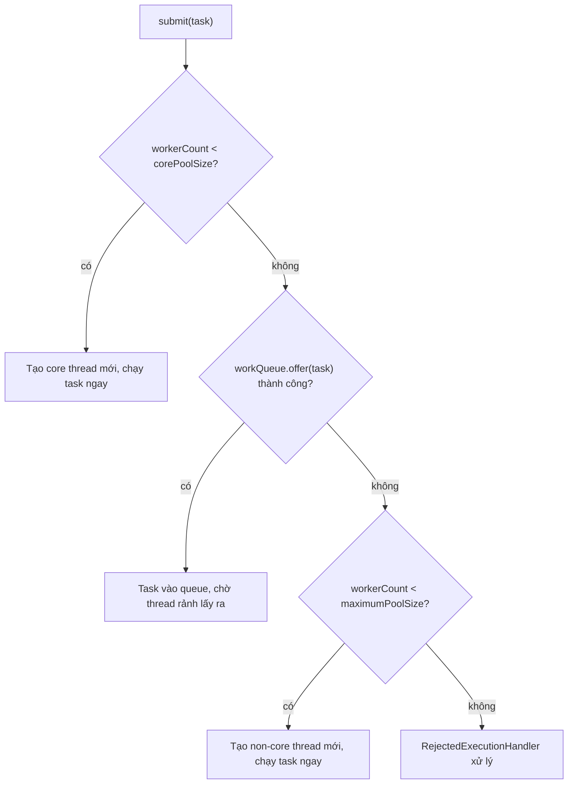
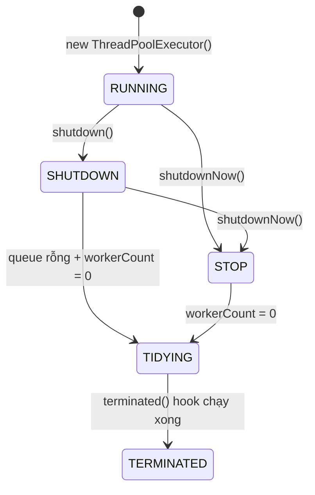

`ThreadPoolExecutor` là bộ máy thực thi task có giới hạn và chính sách điều phối rõ ràng. Năm quyết định—số core thread, số thread tối đa, hàng đợi, thời gian sống và cách từ chối—xác định cách hệ thống phản ứng dưới tải.

## Mục lục

- [Tổng quan](#1-tổng-quan)
- [Kiến trúc tổng quan — 5 tham số quyết định mọi thứ](#2-kiến-trúc-tổng-quan--5-tham-số-quyết-định-mọi-thứ)
- [ctl — đóng gói state và worker count vào 1 biến AtomicInteger](#3-ctl--đóng-gói-state-và-worker-count-vào-1-biến-atomicinteger)
- [Flow execute() — quyết định task đi đâu](#4-flow-execute--quyết-định-task-đi-đâu)
- [Worker — thread vòng lặp vô hạn lấy task từ queue](#5-worker--thread-vòng-lặp-vô-hạn-lấy-task-từ-queue)
- [Work Queue Strategy — chọn queue quyết định hành vi pool](#6-work-queue-strategy--chọn-queue-quyết-định-hành-vi-pool)
- [Rejection Policy — khi cả queue lẫn maxPool đều đầy](#7-rejection-policy--khi-cả-queue-lẫn-maxpool-đều-đầy)
- [Keep-alive & thu hồi thread — allowCoreThreadTimeOut](#8-keep-alive--thu-hồi-thread--allowcoretthreadtimeout)
- [Lifecycle — RUNNING → SHUTDOWN → STOP → TIDYING → TERMINATED](#9-lifecycle--running--shutdown--stop--tidying--terminated)
- [Hook methods — beforeExecute / afterExecute / terminated](#10-hook-methods--beforeexecute--afterexecute--terminated)
- [Bug kinh điển: Task nuốt exception âm thầm](#11-bug-kinh-điển-task-nuốt-exception-âm-thầm)
- [Executors factory — vì sao Alibaba cấm dùng](#12-executors-factory--vì-sao-alibaba-cấm-dùng)
- [Tuning — sizing pool cho CPU-bound vs IO-bound](#13-tuning--sizing-pool-cho-cpu-bound-vs-io-bound)
- [Monitoring — getActiveCount, getQueue().size() và jstack](#14-monitoring--getactivecount-getqueuesize-và-jstack)
- [So sánh ThreadPoolExecutor / ForkJoinPool / Virtual Threads](#15-so-sánh-threadpoolexecutor--forkjoinpool--virtual-threads)
- [Tóm tắt — Cheat sheet & 5 nguyên tắc](#16-tóm-tắt--cheat-sheet--5-nguyên-tắc)

---

## 1. Tổng quan

Khi task được submit, executor không đơn giản tạo thread cho đến `maximumPoolSize`. Nó ưu tiên core worker, sau đó đưa task vào queue, rồi mới mở rộng vượt core nếu queue không nhận thêm được. Thứ tự này khiến loại queue ảnh hưởng trực tiếp đến ý nghĩa của maximum size.

Thiết kế pool cần đi cùng capacity planning và backpressure. Một queue vô hạn có thể che giấu quá tải bằng latency và bộ nhớ tăng dần; một queue hữu hạn buộc hệ thống bộc lộ giới hạn qua rejection policy.

## 2. Kiến trúc tổng quan — 5 tham số quyết định mọi thứ

```java
public ThreadPoolExecutor(
    int corePoolSize,           // số thread "cơ bản" — luôn giữ sống
    int maximumPoolSize,        // số thread tối đa có thể tạo
    long keepAliveTime,         // thread vượt core sống thêm bao lâu khi idle
    TimeUnit unit,
    BlockingQueue<Runnable> workQueue,   // queue chứa task chờ
    ThreadFactory threadFactory,         // tạo thread (đặt tên, daemon, priority)
    RejectedExecutionHandler handler     // policy khi không thể nhận task
)
```

Quy tắc phân luồng (dispatch logic):



> [!WARNING]
> Thứ tự là: **core → queue → max → reject**. KHÔNG phải core → max → queue! Điều này nghĩa là nếu dùng queue vô hạn, `maximumPoolSize` **vô nghĩa** — pool không bao giờ tạo thread quá `corePoolSize`.

---

## 3. ctl — đóng gói state và worker count vào 1 biến AtomicInteger

ThreadPoolExecutor dùng **một `AtomicInteger`** duy nhất gọi là `ctl` để lưu đồng thời **trạng thái pool** (3 bit cao) và **số worker** (29 bit thấp):

```java
private final AtomicInteger ctl = new AtomicInteger(ctlOf(RUNNING, 0));

private static final int COUNT_BITS = Integer.SIZE - 3;        // 29
private static final int COUNT_MASK = (1 << COUNT_BITS) - 1;   // 0x1FFFFFFF

// 5 trạng thái — giá trị giảm dần để dùng phép < so sánh
private static final int RUNNING    = -1 << COUNT_BITS;  // 111... (accept task, xử lý queue)
private static final int SHUTDOWN   =  0 << COUNT_BITS;  // 000... (không accept, xử lý hết queue)
private static final int STOP       =  1 << COUNT_BITS;  // 001... (không accept, bỏ queue, interrupt)
private static final int TIDYING    =  2 << COUNT_BITS;  // 010... (mọi task done, workerCount=0)
private static final int TERMINATED =  3 << COUNT_BITS;  // 011... (terminated() đã chạy xong)

private static int runStateOf(int c)     { return c & ~COUNT_MASK; }  // lấy 3 bit cao
private static int workerCountOf(int c)  { return c & COUNT_MASK; }   // lấy 29 bit thấp
private static int ctlOf(int rs, int wc) { return rs | wc; }          // ghép lại
```

**Vì sao đóng gói?** Vì cần **đọc state + count nguyên tử** (atomic) trong 1 lần. Nếu tách thành 2 biến riêng, giữa việc đọc state và đọc count có thể có thread khác thay đổi → race condition. Với `ctl` chỉ cần 1 `CAS` hoặc 1 `get()`.

> [!NOTE]
> 29 bit cho worker count = tối đa ~536 triệu thread. Đủ rồi — JVM sẽ OOM từ lâu trước khi chạm giới hạn này.

---

## 4. Flow execute() — quyết định task đi đâu

```java
public void execute(Runnable command) {
    if (command == null) throw new NullPointerException();
    int c = ctl.get();

    // Bước 1: số worker < corePoolSize → tạo core worker
    if (workerCountOf(c) < corePoolSize) {
        if (addWorker(command, true))   // true = core
            return;
        c = ctl.get();  // CAS thất bại → đọc lại
    }

    // Bước 2: pool đang RUNNING + offer vào queue thành công
    if (isRunning(c) && workQueue.offer(command)) {
        int recheck = ctl.get();
        // Double-check: pool có thể đã shutdown sau khi offer
        if (!isRunning(recheck) && remove(command))
            reject(command);
        // Edge case: mọi worker đã chết → tạo 1 worker rỗng để drain queue
        else if (workerCountOf(recheck) == 0)
            addWorker(null, false);
    }
    // Bước 3: queue đầy → thử tạo non-core worker
    else if (!addWorker(command, false))
        reject(command);  // max cũng đầy → reject
}
```

**Double-check pattern** (dòng `recheck`): Sau khi offer thành công, pool có thể đã chuyển sang `SHUTDOWN` → cần remove task vừa offer ra và reject. Hoặc ngược lại: mọi worker đã tự thoát (do timeout) mà queue vẫn có task → phải tạo worker mới.

> [!IMPORTANT]
> `workQueue.offer()` là **non-blocking**. Nếu queue đầy, nó trả `false` ngay lập tức (khác với `put()` sẽ block). Đây là lý do pool biết "queue đầy" để thử tạo non-core thread.

---

## 5. Worker — thread vòng lặp vô hạn lấy task từ queue

Mỗi thread trong pool được wrap bởi inner class `Worker`:

```java
private final class Worker extends AbstractQueuedSynchronizer implements Runnable {
    final Thread thread;       // thread thực thi
    Runnable firstTask;        // task đầu tiên (có thể null nếu worker tạo để drain queue)
    volatile long completedTasks;

    Worker(Runnable firstTask) {
        setState(-1);          // inhibit interrupts until runWorker
        this.firstTask = firstTask;
        this.thread = getThreadFactory().newThread(this);
    }

    public void run() { runWorker(this); }
}
```

**`runWorker()`** — trái tim của worker:

```java
final void runWorker(Worker w) {
    Thread wt = Thread.currentThread();
    Runnable task = w.firstTask;
    w.firstTask = null;
    w.unlock();   // cho phép interrupt (setState 0)
    boolean completedAbruptly = true;
    try {
        // Vòng lặp: chạy firstTask, rồi liên tục getTask() từ queue
        while (task != null || (task = getTask()) != null) {
            w.lock();   // đánh dấu "đang busy" (shutdown check)
            // Nếu pool >= STOP, tự interrupt
            if ((runStateAtLeast(ctl.get(), STOP) || ...) && !wt.isInterrupted())
                wt.interrupt();
            try {
                beforeExecute(wt, task);   // hook
                try {
                    task.run();            // 🔥 CHẠY TASK Ở ĐÂY
                } catch (Throwable x) {
                    afterExecute(task, x); // hook
                    throw x;
                }
                afterExecute(task, null);  // hook
            } finally {
                task = null;
                w.completedTasks++;
                w.unlock();
            }
        }
        completedAbruptly = false;
    } finally {
        processWorkerExit(w, completedAbruptly);  // cleanup, có thể tạo worker thay thế
    }
}
```

### 5.1. getTask() — blocking poll với timeout

```java
private Runnable getTask() {
    boolean timedOut = false;
    for (;;) {
        int c = ctl.get();
        // Nếu SHUTDOWN + queue rỗng, hoặc >= STOP → return null (worker thoát)
        if (runStateAtLeast(c, SHUTDOWN) && (runStateAtLeast(c, STOP) || workQueue.isEmpty())) {
            decrementWorkerCount();
            return null;
        }
        int wc = workerCountOf(c);
        // Có cần timeout không?
        boolean timed = allowCoreThreadTimeOut || wc > corePoolSize;
        // Nếu worker count > max hoặc đã timeout → thu hồi
        if ((wc > maximumPoolSize || (timed && timedOut)) && (wc > 1 || workQueue.isEmpty())) {
            if (compareAndDecrementWorkerCount(c))
                return null;
            continue;
        }
        try {
            // 🔑 Đây là nơi thread "ngủ" chờ task:
            Runnable r = timed ?
                workQueue.poll(keepAliveTime, TimeUnit.NANOSECONDS) :  // có timeout
                workQueue.take();   // block vô hạn (core thread mặc định)
            if (r != null) return r;
            timedOut = true;   // poll hết timeout mà không có task → đánh dấu
        } catch (InterruptedException retry) {
            timedOut = false;  // bị interrupt → thử lại (check state mới)
        }
    }
}
```

> [!TIP]
> Core thread mặc định dùng `take()` — **block vô hạn** cho đến khi có task. Non-core thread dùng `poll(keepAliveTime)` — nếu hết timeout trả null → worker thoát. Đây là cơ chế "thu hồi thread idle".

---

## 6. Work Queue Strategy — chọn queue quyết định hành vi pool

| Queue | Đặc điểm | Hệ quả cho pool |
|-------|-----------|-----------------|
| `SynchronousQueue` | Capacity = 0, handoff trực tiếp | **Luôn tạo thread** cho đến max → reject nhanh. Dùng cho task ngắn, cần response nhanh |
| `LinkedBlockingQueue` (unbounded) | Capacity = ∞ | **max vô nghĩa**, queue phình mãi, latency tăng dần. **Nguy hiểm nhất** |
| `LinkedBlockingQueue(n)` (bounded) | Capacity = n | Kiểm soát backpressure, max có tác dụng. **Khuyến nghị production** |
| `ArrayBlockingQueue(n)` | Bounded, array-backed | Như trên, throughput cao hơn chút (cache-friendly) |
| `PriorityBlockingQueue` | Unbounded, sắp xếp | Task quan trọng chạy trước, nhưng starvation risk |

```java
// ❌ Sai: Executors.newFixedThreadPool dùng unbounded queue
new ThreadPoolExecutor(8, 8, 0, SECONDS, new LinkedBlockingQueue<>());  // max = core = 8, queue vô hạn

// ✅ Đúng: bounded queue + max > core + reject policy rõ ràng
new ThreadPoolExecutor(
    8,                          // core: 8 thread luôn sẵn sàng
    32,                         // max: burst lên 32 khi queue đầy
    60, SECONDS,                // non-core idle 60s → thu hồi
    new LinkedBlockingQueue<>(1000),   // queue 1000 task
    new ThreadPoolExecutor.CallerRunsPolicy()  // backpressure tự nhiên
);
```

> [!WARNING]
> `SynchronousQueue` + small max → reject rất nhanh dưới load. `LinkedBlockingQueue()` unbounded + fixed core → latency tăng vô hạn mà không reject. Cả hai cực đều nguy hiểm — bounded queue là trung dung.

---

## 7. Rejection Policy — khi cả queue lẫn maxPool đều đầy

Khi `workQueue.offer()` trả `false` VÀ `workerCount >= maximumPoolSize`, pool gọi `RejectedExecutionHandler`:

| Policy | Hành vi | Khi nào dùng |
|--------|---------|-------------|
| `AbortPolicy` (default) | Throw `RejectedExecutionException` | Muốn fail-fast, caller xử lý exception |
| `CallerRunsPolicy` | Caller thread tự chạy task | **Backpressure tự nhiên**: caller bị chậm → giảm submit rate |
| `DiscardPolicy` | Bỏ task im lặng | Log/metric bị mất → **rất nguy hiểm** |
| `DiscardOldestPolicy` | Bỏ task cũ nhất trong queue, thử submit lại | Queue toàn task cũ, ưu tiên task mới |

```java
// CallerRunsPolicy internals — đơn giản nhưng hiệu quả
public static class CallerRunsPolicy implements RejectedExecutionHandler {
    public void rejectedExecution(Runnable r, ThreadPoolExecutor e) {
        if (!e.isShutdown()) {
            r.run();  // 🔥 Chạy ngay trên thread đang submit!
        }
    }
}
```

> [!TIP]
> `CallerRunsPolicy` tạo **back-pressure** tự nhiên: khi pool quá tải, thread submit phải tự chạy task → nó không thể submit thêm → hệ thống tự điều tiết. Đây là lựa chọn phổ biến nhất trong production.

**Custom handler** — ghi metric rồi reject:

```java
RejectedExecutionHandler monitoredReject = (task, executor) -> {
    metrics.increment("pool.rejected");
    log.warn("Task rejected: queue={}, active={}", 
        executor.getQueue().size(), executor.getActiveCount());
    throw new RejectedExecutionException("Pool exhausted");
};
```

---

## 8. Keep-alive & thu hồi thread — allowCoreThreadTimeOut

Mặc định chỉ **non-core thread** (workerCount > corePoolSize) bị thu hồi khi idle quá `keepAliveTime`. Core thread dùng `take()` block vĩnh viễn.

Bật `allowCoreThreadTimeOut(true)` → **tất cả** thread (kể cả core) dùng `poll(timeout)`. Nếu không có task trong keepAliveTime, thread thoát. Pool có thể co về **0 thread**.

```java
ThreadPoolExecutor pool = new ThreadPoolExecutor(8, 32, 60, SECONDS, queue);
pool.allowCoreThreadTimeOut(true);  // core cũng timeout → co về 0 khi idle
```

Khi nào dùng:
- **Batch processing**: burst lớn rồi idle dài → cho thread chết để giải phóng memory
- **Serverless-style**: ứng dụng có traffic rất lẻ tẻ

> [!NOTE]
> Mỗi lần pool co về 0 rồi lại nhận task, phải **tạo thread mới** (tốn ~1ms). Nếu traffic ổn định, ĐỪNG bật option này — giữ core thread sống sẽ có latency tốt hơn.

---

## 9. Lifecycle — RUNNING → SHUTDOWN → STOP → TIDYING → TERMINATED



| State | Accept task mới? | Xử lý queue? | Interrupt worker? |
|-------|------------------|--------------|-------------------|
| RUNNING | ✅ | ✅ | Không |
| SHUTDOWN | ❌ | ✅ (drain hết) | Không (chờ task hoàn thành) |
| STOP | ❌ | ❌ (bỏ) | ✅ interrupt tất cả |
| TIDYING | ❌ | — | — |
| TERMINATED | ❌ | — | — |

**Graceful shutdown pattern:**

```java
pool.shutdown();                           // không nhận task mới, drain queue
if (!pool.awaitTermination(30, SECONDS)) { // chờ 30s
    pool.shutdownNow();                    // hết kiên nhẫn → interrupt
    pool.awaitTermination(10, SECONDS);    // chờ thêm 10s
}
```

> [!IMPORTANT]
> `shutdown()` **không** block — nó chỉ chuyển state và return ngay. Phải dùng `awaitTermination()` nếu cần chờ. Nhiều người gọi `shutdown()` rồi tưởng "xong" → ứng dụng tắt trong khi task đang chạy dở.

---

## 10. Hook methods — beforeExecute / afterExecute / terminated

ThreadPoolExecutor cung cấp 3 hook (protected, override được):

```java
public class MonitoredPool extends ThreadPoolExecutor {
    
    @Override
    protected void beforeExecute(Thread t, Runnable r) {
        // Gọi TRƯỚC mỗi task.run()
        MDC.put("taskId", ((MyTask) r).getId());   // đặt context logging
        super.beforeExecute(t, r);
    }

    @Override
    protected void afterExecute(Runnable r, Throwable t) {
        // Gọi SAU mỗi task.run() — kể cả khi throw exception
        super.afterExecute(r, t);
        MDC.clear();
        if (t != null) {
            log.error("Task failed", t);
            metrics.increment("pool.task.failed");
        }
    }

    @Override
    protected void terminated() {
        // Gọi 1 lần khi pool chuyển sang TERMINATED
        super.terminated();
        log.info("Pool terminated. Total completed: {}", getCompletedTaskCount());
    }
}
```

> [!TIP]
> `afterExecute(Runnable r, Throwable t)` — tham số `t` chỉ non-null khi task throw **unchecked exception** và task được submit qua `execute()`. Nếu dùng `submit()` (trả Future), exception bị wrap trong Future → `t` luôn null ở đây. Xem mục 11.

---

## 11. Bug kinh điển: Task nuốt exception âm thầm

```java
ExecutorService pool = Executors.newFixedThreadPool(4);

pool.submit(() -> {
    int x = 1 / 0;  // ArithmeticException
    // Exception bị NUỐT — không log, không throw ra ngoài
});
```

Vì sao? `submit()` wrap task vào `FutureTask`. Khi `task.run()` throw, `FutureTask.run()` catch và lưu exception nội bộ. Nó chỉ re-throw khi gọi `future.get()`. Nếu không ai gọi `get()` → exception **biến mất không dấu vết**.

```java
// Fix 1: luôn gọi get() để propagate exception
Future<?> f = pool.submit(task);
f.get();  // throws ExecutionException wrapping original

// Fix 2: dùng execute() thay vì submit() cho fire-and-forget
pool.execute(task);  // exception sẽ kill thread + trigger UncaughtExceptionHandler

// Fix 3: wrap task trong try-catch
pool.submit(() -> {
    try {
        riskyOperation();
    } catch (Exception e) {
        log.error("Task failed", e);
    }
});

// Fix 4: override afterExecute để unwrap FutureTask
@Override
protected void afterExecute(Runnable r, Throwable t) {
    super.afterExecute(r, t);
    if (t == null && r instanceof Future<?> f) {
        try { if (f.isDone()) f.get(); }
        catch (ExecutionException e) { t = e.getCause(); }
        catch (InterruptedException | CancellationException e) { /* ignore */ }
    }
    if (t != null) log.error("Task exception", t);
}
```

> [!WARNING]
> Đây là nguồn bug **âm thầm** phổ biến nhất khi dùng thread pool. Production chạy ngon lành nhưng thực tế hàng nghìn task đang fail mà không ai biết. **Rule**: mỗi `submit()` phải có consumer cho Future, hoặc dùng `execute()` + UncaughtExceptionHandler.

---

## 12. Executors factory — vì sao Alibaba cấm dùng

| Factory method | Tham số ẩn | Rủi ro |
|---------------|-----------|--------|
| `newFixedThreadPool(n)` | `LinkedBlockingQueue()` unbounded | Queue phình → OOM |
| `newSingleThreadExecutor()` | `LinkedBlockingQueue()` unbounded | Như trên, thêm single point of failure |
| `newCachedThreadPool()` | `SynchronousQueue` + max = `Integer.MAX_VALUE` | Tạo thread không kiểm soát → OOM / thrashing |
| `newScheduledThreadPool(n)` | `DelayedWorkQueue` unbounded | Queue phình nếu schedule rate > process rate |

Alibaba Java Coding Guidelines (và nhiều team lớn) **cấm** dùng `Executors.*` và yêu cầu tạo `ThreadPoolExecutor` trực tiếp với tham số tường minh:

```java
// ❌ Alibaba cấm
ExecutorService pool = Executors.newFixedThreadPool(10);

// ✅ Tường minh — ai đọc cũng hiểu giới hạn
ThreadPoolExecutor pool = new ThreadPoolExecutor(
    10, 20, 60, TimeUnit.SECONDS,
    new LinkedBlockingQueue<>(5000),
    new CustomThreadFactory("payment-pool"),
    new ThreadPoolExecutor.CallerRunsPolicy()
);
```

> [!IMPORTANT]
> Vấn đề không phải Executors "sai" — mà là nó **giấu** unbounded queue/thread trong API trông "innocent". Production OOM vì `newCachedThreadPool` tạo 20.000 thread, hoặc vì `newFixedThreadPool` queue 5 triệu task, đều là bug kinh điển.

---

## 13. Tuning — sizing pool cho CPU-bound vs IO-bound

### 13.1. CPU-bound (tính toán, encryption, compression)

```
optimalThreads = numberOfCPUs + 1
```

Thêm 1 thread để cover context switch khi thread bị preempt. Nhiều hơn → context switch thrashing, cache miss tăng.

### 13.2. IO-bound (HTTP call, DB query, file I/O)

```
optimalThreads = numberOfCPUs × (1 + waitTime / computeTime)
```

Ví dụ: 8 core, task mất 200ms compute + 800ms wait I/O:
```
8 × (1 + 800/200) = 8 × 5 = 40 threads
```

### 13.3. Little's Law — cách khác để tính

```
L = λ × W
threads_needed = throughput_target × average_latency
```

Target 1000 req/s, mỗi request mất 100ms:
```
threads = 1000 × 0.1 = 100 threads
```

### 13.4. Thực tế: đo, không đoán

Công thức chỉ là điểm bắt đầu. Dùng **load test** (JMeter, Gatling) + metric (queue size, active count, latency percentiles) để fine-tune:

```java
// Expose metrics cho monitoring
ScheduledExecutorService monitor = Executors.newSingleThreadScheduledExecutor();
monitor.scheduleAtFixedRate(() -> {
    log.info("pool: active={}, queue={}, completed={}",
        pool.getActiveCount(),
        pool.getQueue().size(),
        pool.getCompletedTaskCount());
}, 0, 5, TimeUnit.SECONDS);
```

---

## 14. Monitoring — getActiveCount, getQueue().size() và jstack

| Metric | Ý nghĩa | Red flag |
|--------|---------|----------|
| `getActiveCount()` | Thread đang chạy task | = maxPoolSize liên tục → pool bão hoà |
| `getQueue().size()` | Task đang chờ | Tăng liên tục → throughput < submit rate |
| `getCompletedTaskCount()` | Tổng task đã xong | Đột ngột ngừng tăng → deadlock? |
| `getLargestPoolSize()` | Peak thread count từng đạt | Gần max → pool đã từng stressed |
| `getTaskCount()` | Tổng task (done + queue + running) | So với completed → biết task đang pending |

**jstack khi nghi ngờ deadlock / stuck:**

```bash
jstack <pid> | grep -A 20 "payment-pool"
```

Nếu tất cả thread đều `WAITING` trên cùng lock hoặc I/O → cần tăng pool hoặc giảm blocking.

---

## 15. So sánh ThreadPoolExecutor / ForkJoinPool / Virtual Threads

| Tiêu chí | ThreadPoolExecutor | ForkJoinPool | Virtual Threads (JDK 21+) |
|----------|-------------------|--------------|---------------------------|
| Mô hình | Fixed/elastic pool + shared queue | Work-stealing, per-worker deque | M:N scheduling, millions of threads |
| Task type | Independent, heterogeneous | Recursive, divide-and-conquer | IO-bound, simple blocking |
| Blocking | Thread bị chiếm → cần nhiều thread | Compensation thread khi block | Mount/unmount carrier → rẻ |
| Khi nào | Task độc lập, cần kiểm soát queue/reject | Parallel computation, Stream parallel | Massive IO concurrency |
| Overhead | Medium (OS thread per worker) | Medium (OS thread + stealing) | **Very low** (~1KB per virtual thread) |

> [!NOTE]
> Virtual Threads (JDK 21) không thay thế ThreadPoolExecutor cho mọi trường hợp. Khi cần **kiểm soát concurrency** (rate limit downstream, bounded resource), ThreadPoolExecutor với bounded queue vẫn là lựa chọn đúng. Virtual Threads phù hợp khi bạn muốn "một thread per request" đơn giản.

---

## 16. Tóm tắt — Cheat sheet & 5 nguyên tắc

**Cỗ máy trong 6 dòng:**

```
1. execute(task): core chưa đủ → tạo thread; đủ rồi → offer vào queue
2. Queue đầy → tạo thread đến max; max cũng đầy → reject
3. Worker = vòng lặp while(getTask()) { task.run() }
4. Core thread: take() block vĩnh viễn; non-core: poll(timeout) → tự chết khi idle
5. ctl = 3 bit state | 29 bit workerCount — 1 AtomicInteger cho mọi thứ
6. submit() nuốt exception → luôn handle Future hoặc dùng execute()
```

| Thao tác | Complexity |
|----------|-----------|
| submit/execute (queue chưa đầy) | **O(1)** |
| getTask() (thread chờ) | Blocking |
| shutdown + drain | **O(n)** n = queue size |

**5 nguyên tắc khắc cốt:**

1. **Không dùng unbounded queue** — `LinkedBlockingQueue()` không tham số = bom nổ chậm.
2. **Hiểu thứ tự: core → queue → max → reject** — max vô nghĩa nếu queue vô hạn.
3. **Handle exception từ submit()** — Future không ai get() = exception biến mất.
4. **Đặt tên thread** (ThreadFactory) — jstack mà thấy "pool-1-thread-47" thì vô nghĩa.
5. **Đo và monitor** — getActiveCount, queue size, rejected count là vital signs.

> [!TIP]
> Một câu để nhớ: *ThreadPoolExecutor là một cỗ máy đơn giản — nhưng 5 tham số của nó tương tác phi tuyến. Hiểu thứ tự dispatch (core → queue → max → reject) là hiểu 90% hành vi.*
