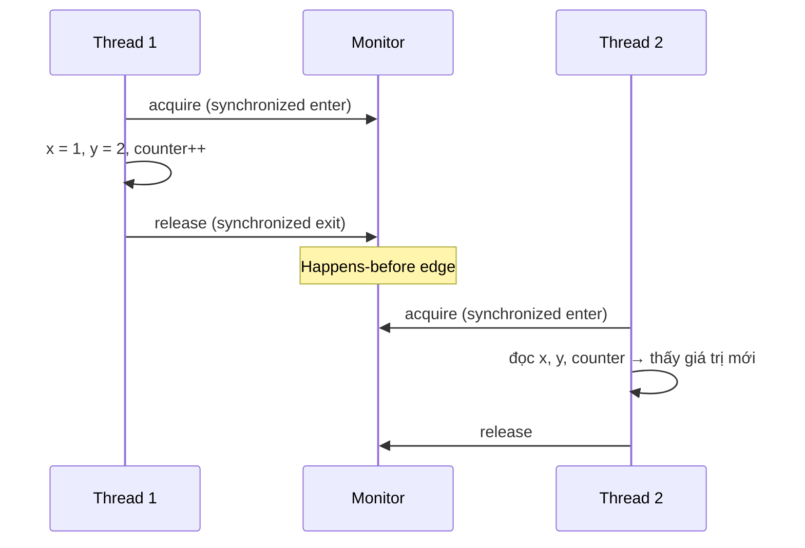
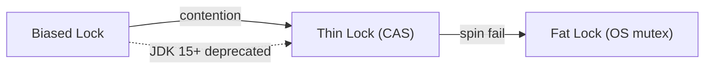
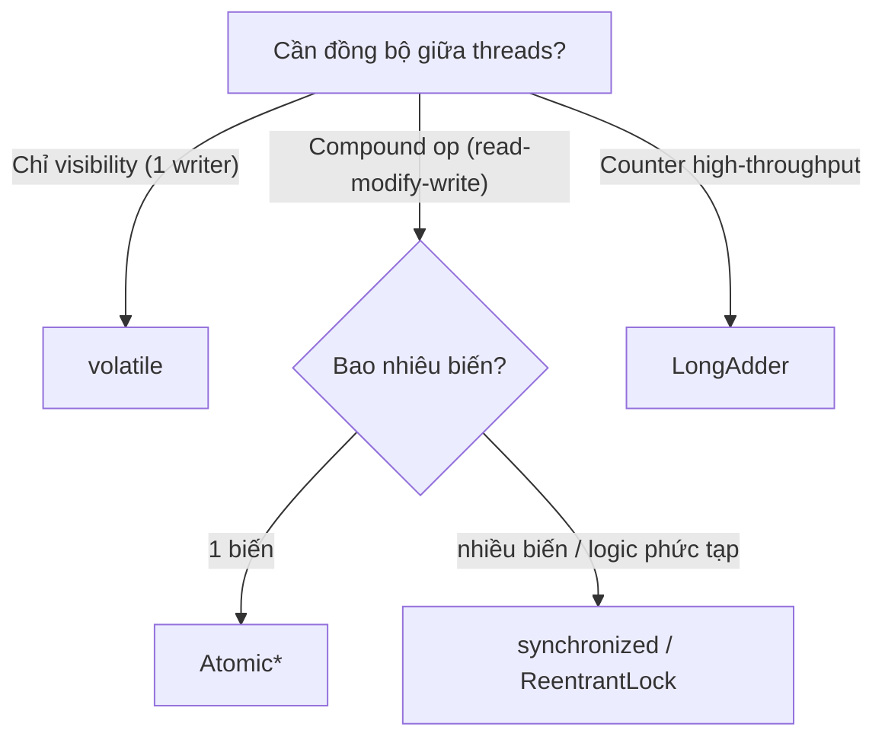

`volatile`, `synchronized` và các atomic class đều hỗ trợ lập trình đa luồng, nhưng chúng giải quyết những phạm vi khác nhau. Chọn sai công cụ có thể tạo ra code nhìn có vẻ an toàn nhưng vẫn mất cập nhật hoặc vi phạm invariant.

## Mục lục

- [Tổng quan](#1-tổng-quan)
- [CPU Cache & Visibility Problem](#2-cpu-cache--visibility-problem)
- [volatile — visibility guarantee & memory barrier](#3-volatile--visibility-guarantee--memory-barrier)
- [volatile KHÔNG phải atomic — count++ vẫn race](#4-volatile-không-phải-atomic--count-vẫn-race)
- [synchronized — monitor lock & happens-before](#5-synchronized--monitor-lock--happens-before)
- [Biased → Thin → Fat lock — escalation nội bộ](#6-biased--thin--fat-lock--escalation-nội-bộ)
- [Atomic* & CAS — lock-free concurrent](#7-atomic--cas--lock-free-concurrent)
- [CAS spin loop — anatomy từ assembly](#8-cas-spin-loop--anatomy-từ-assembly)
- [ABA Problem — khi CAS bị lừa](#9-aba-problem--khi-cas-bị-lừa)
- [LongAdder — khi AtomicLong không đủ nhanh](#10-longadder--khi-atomiclong-không-đủ-nhanh)
- [VarHandle (JDK 9+) — thay thế Unsafe](#11-varhandle-jdk-9--thay-thế-unsafe)
- [So sánh: volatile vs synchronized vs Atomic](#12-so-sánh-volatile-vs-synchronized-vs-atomic)
- [Anti-patterns & production pitfalls](#13-anti-patterns--production-pitfalls)
- [Tóm tắt — Cheat sheet & decision tree](#14-tóm-tắt--cheat-sheet--decision-tree)

---

## 1. Tổng quan

`volatile` bảo đảm visibility và ordering cho việc đọc/ghi một biến, không biến chuỗi read–modify–write thành nguyên tử. `synchronized` bảo vệ một critical section và các invariant gồm nhiều biến. Atomic class dùng CAS để thực hiện một số cập nhật nguyên tử mà không khóa theo cách truyền thống.

Phần này so sánh các bảo đảm cụ thể, chi phí dưới contention và tình huống nên dùng từng cơ chế.

## 2. CPU Cache & Visibility Problem

### 2.1. Tại sao thread không thấy giá trị mới nhất?

CPU hiện đại có **nhiều lớp cache** (L1/L2 per-core, L3 shared):

```
┌─────────┐  ┌─────────┐  ┌─────────┐
│  Core 0 │  │  Core 1 │  │  Core 2 │
│  ┌───┐  │  │  ┌───┐  │  │  ┌───┐  │
│  │L1 │  │  │  │L1 │  │  │  │L1 │  │
│  └───┘  │  │  └───┘  │  │  └───┘  │
│  ┌───┐  │  │  ┌───┐  │  │  ┌───┐  │
│  │L2 │  │  │  │L2 │  │  │  │L2 │  │
│  └───┘  │  │  └───┘  │  │  └───┘  │
└────┬────┘  └────┬────┘  └────┬────┘
     └────────────┼────────────┘
              ┌───┴───┐
              │  L3   │ (shared)
              └───┬───┘
              ┌───┴───┐
              │  RAM  │
              └───────┘
```

Mỗi core đọc biến vào **L1 cache riêng**. Khi Core 0 ghi `counter = 5`, giá trị nằm trong L1 của Core 0 — Core 1 vẫn thấy giá trị **cũ** trong L1 của mình. Đây là **visibility problem**.

### 2.2. Store Buffer & Reordering

Tệ hơn: CPU có **store buffer** — ghi ra buffer trước, flush xuống cache/RAM sau. JIT compiler cũng có quyền **reorder** instructions. Nghĩa là:

```java
// Thread 1:
data = 42;        // ghi data
ready = true;     // ghi flag

// Thread 2:
if (ready) {         // đọc flag
    print(data);     // đọc data — CÓ THỂ thấy 0 thay vì 42!
}
```

Compiler/CPU có thể **đảo thứ tự** ghi `data` và `ready` (vì từ góc nhìn single-thread, thứ tự không ảnh hưởng). Thread 2 thấy `ready = true` nhưng `data` vẫn là 0.

> [!WARNING]
> Java Memory Model (JMM) cho phép reordering trừ khi có **happens-before relationship**. Không có sync → không có đảm bảo visibility hay ordering giữa các thread.

---

## 3. volatile — visibility guarantee & memory barrier

### 3.1. volatile đảm bảo gì?

```java
volatile boolean ready;
volatile int data;
```

1. **Visibility**: mọi ghi vào biến volatile đều **ngay lập tức visible** cho tất cả thread (flush store buffer, invalidate cache line ở core khác).
2. **Ordering** (memory barrier):
   - Ghi volatile = **StoreStore + StoreLoad barrier** (không reorder ghi trước nó, và ghi này flush trước khi đọc tiếp)
   - Đọc volatile = **LoadLoad + LoadStore barrier** (đọc luôn từ main memory, và không reorder các thao tác sau nó)

```
Timeline:
Thread 1:                    Thread 2:
  data = 42         ─┐
  ready = true  ═══════════▶  if (ready)       // volatile read
                     │           print(data)   // GUARANTEED thấy 42
                     └─ StoreStore barrier: data ghi trước ready
                        StoreLoad barrier: flush tất cả xuống memory
```

### 3.2. Happens-before từ volatile

JMM quy định: **ghi volatile happens-before mọi đọc volatile cùng biến đó** từ thread khác. Kết hợp transitivity:

```java
// Thread 1:
x = 1;                  // normal write
y = 2;                  // normal write
volatile_flag = true;   // volatile write — publish barrier

// Thread 2:
if (volatile_flag) {    // volatile read — acquire barrier
    // GUARANTEED: thấy x=1, y=2
    // Mọi ghi TRƯỚC volatile write đều visible sau volatile read
}
```

> [!TIP]
> volatile write = **release** (publish mọi thứ trước nó). volatile read = **acquire** (thấy mọi thứ từ release trở về trước). Đây chính là **release-acquire semantics** — nền tảng của lock-free programming.

---

## 4. volatile KHÔNG phải atomic — count++ vẫn race

```java
volatile int count = 0;

// Thread 1 + Thread 2 cùng:
count++;   // ← BUG: không phải một thao tác
```

`count++` biên dịch thành **3 bước**:

```
1. READ  count     → register (giá trị: 5)
2. ADD   1         → register (giá trị: 6)
3. WRITE register  → count
```

Với volatile, mỗi bước riêng lẻ là visible. Nhưng **giữa** READ và WRITE, thread khác có thể chen vào:

```
Thread 1:  READ count = 5
Thread 2:  READ count = 5     ← cùng đọc 5
Thread 1:  WRITE count = 6
Thread 2:  WRITE count = 6    ← ghi đè! Mất 1 increment
```

> [!IMPORTANT]
> volatile đảm bảo **visibility** (đọc thấy giá trị mới nhất) nhưng **KHÔNG** đảm bảo **atomicity** (read-modify-write). Cho compound operation (++, +=, check-then-act) → cần `synchronized` hoặc `Atomic*`.

**Khi nào volatile đủ?**
- **Flag** (boolean) — một thread ghi, một/nhiều thread đọc: `volatile boolean running`
- **Publish immutable object** — ghi reference một lần: `volatile Config config`
- **Double-checked locking** — singleton pattern: `volatile Singleton instance`

---

## 5. synchronized — monitor lock & happens-before

### 5.1. Monitor concept

Mỗi Java object có một **monitor** (còn gọi intrinsic lock). `synchronized` acquire/release monitor:

```java
synchronized (lock) {    // ACQUIRE: chỉ 1 thread vào tại một thời điểm
    // critical section — mutual exclusion
    counter++;           // an toàn: chỉ 1 thread đọc-sửa-ghi
}                        // RELEASE: thread khác có thể acquire
```

### 5.2. Happens-before guarantee

`synchronized` cung cấp **ba** đảm bảo:
1. **Mutual exclusion** — chỉ 1 thread trong critical section
2. **Visibility** — mọi thay đổi trong synchronized block visible cho thread acquire lock tiếp theo
3. **Ordering** — không reorder qua boundary của synchronized



### 5.3. Reentrant

Java monitor là **reentrant** — cùng thread có thể acquire cùng lock nhiều lần:

```java
synchronized (lock) {
    synchronized (lock) {    // OK — cùng thread, reentrant
        // ...
    }
}
```

JVM dùng **counter** trong object header: mỗi lần cùng thread lock → counter++, unlock → counter--. Khi counter = 0 → thực sự release.

---

## 6. Biased → Thin → Fat lock — escalation nội bộ

JVM tối ưu `synchronized` bằng **lock escalation** — chọn cơ chế nhẹ nhất có thể:



### 6.1. Biased Lock (JDK 6-14)

Giả thuyết: đa số lock chỉ có **1 thread** sử dụng. Biased lock **gắn** lock cho thread đầu tiên acquire — lần acquire tiếp theo **zero overhead** (chỉ check thread ID trong object header).

```
Object header (64 bits, normal):
┌─────────────────────────────────────────────────────────┐
│ Mark Word: [hash:25 | age:4 | biased:1 | lock_state:2]  │
└─────────────────────────────────────────────────────────┘

Biased state: thread_id thay vào vị trí hash
┌─────────────────────────────────────────────────────────┐
│ Mark Word: [thread_id:54 | epoch:2 | age:4 | 1 | 01]    │
└─────────────────────────────────────────────────────────┘
```

> [!NOTE]
> Biased locking bị **deprecated JDK 15**, **disabled by default JDK 18+**. Lý do: overhead revocation (khi có contention) lớn hơn lợi ích trong workload hiện đại (container, short-lived JVM). Thin lock CAS đủ nhanh.

### 6.2. Thin Lock (Lightweight / CAS)

Khi có thread thứ 2 cố acquire:
1. Revoke bias
2. Dùng **CAS** trên mark word: ghi stack pointer của owning thread
3. Nếu CAS thành công → acquire
4. Nếu CAS thất bại → **spin** (busy-wait vài lần)

```
Thin lock state:
┌─────────────────────────────────────────────────────────┐
│ Mark Word: [ptr_to_lock_record:62 | 00]                 │
└─────────────────────────────────────────────────────────┘
Lock record nằm trên stack frame của owning thread
```

### 6.3. Fat Lock (Heavyweight / OS mutex)

Nếu spin thất bại (contention cao) → inflate thành **ObjectMonitor** (OS-level mutex + wait queue):

```
Fat lock state:
┌─────────────────────────────────────────────────────────┐
│ Mark Word: [ptr_to_ObjectMonitor:62 | 10]               │
└─────────────────────────────────────────────────────────┘

ObjectMonitor:
├── _owner         (thread đang giữ lock)
├── _EntryList     (threads chờ acquire)
├── _WaitSet       (threads gọi wait())
└── _count, _recursions
```

Fat lock đắt: thread blocked → OS context switch (~1-10μs). Đây là lý do `synchronized` dưới high contention chậm hơn `Atomic*`.

---

## 7. Atomic* & CAS — lock-free concurrent

### 7.1. Compare-And-Swap

CAS là **hardware instruction** (x86: `CMPXCHG`) — thực hiện **atomic** 3 bước:

```
CAS(address, expectedValue, newValue):
    if (*address == expectedValue):
        *address = newValue
        return true
    else:
        return false    // giá trị đã bị thread khác đổi
```

Tất cả xảy ra trong **1 CPU instruction** — không thể bị interleave.

### 7.2. AtomicInteger internals

```java
public class AtomicInteger {
    private volatile int value;    // volatile đảm bảo visibility

    public final int incrementAndGet() {
        return U.getAndAddInt(this, VALUE_OFFSET, 1) + 1;
        // bên trong: CAS loop
    }
}

// Unsafe.getAndAddInt (simplified):
public final int getAndAddInt(Object o, long offset, int delta) {
    int v;
    do {
        v = getIntVolatile(o, offset);          // đọc giá trị hiện tại
    } while (!compareAndSwapInt(o, offset, v, v + delta));  // CAS
    return v;
}
```

**CAS loop**: đọc → tính → CAS. Nếu CAS fail (thread khác đã đổi) → đọc lại → thử lại. **Không lock**, không block, không context switch.

### 7.3. Atomic* family

| Class | Dùng cho |
|-------|---------|
| `AtomicInteger` / `AtomicLong` | Counter, sequence |
| `AtomicBoolean` | Flag đồng bộ |
| `AtomicReference<V>` | CAS trên reference |
| `AtomicIntegerArray` | CAS từng element trong array |
| `AtomicStampedReference<V>` | Giải ABA problem (mục 9) |
| `AtomicMarkableReference<V>` | CAS + boolean mark |

---

## 8. CAS spin loop — anatomy từ assembly

Khi nhiều thread cùng CAS trên một biến:

```java
// 64 threads cùng:
atomicCounter.incrementAndGet();
```

Mỗi thread chạy spin loop:

```
retry:
    mov eax, [counter_addr]      ; đọc giá trị hiện tại
    lea edx, [eax + 1]          ; tính +1
    lock cmpxchg [counter_addr], edx  ; CAS (atomic trên bus)
    jnz retry                    ; nếu fail → retry
```

**`lock` prefix**: khoá bus/cache line trong 1 instruction — đảm bảo atomic.

**Contention analysis:**

| Số thread | CAS success rate | Throughput |
|-----------|-----------------|-----------|
| 1 | 100% | Baseline |
| 4 | ~75% | ~3x |
| 16 | ~25% | ~6x (diminishing) |
| 64 | ~5% | ~8x (plateau) |

Khi contention quá cao, CAS loop **spin nhiều lần** → cache line bouncing → throughput plateau. Giải pháp: **LongAdder** (mục 10).

> [!WARNING]
> CAS spin loop giả định contention **thấp đến trung bình**. Nếu 64+ thread CAS cùng biến liên tục → `LongAdder` nhanh hơn `AtomicLong` 10-50x. Đừng mù quáng dùng Atomic cho mọi trường hợp.

---

## 9. ABA Problem — khi CAS bị lừa

### 9.1. Vấn đề

CAS chỉ kiểm tra **giá trị** — không biết giá trị có **bị đổi rồi đổi lại** không:

```
Thread 1: đọc A (= "X")
Thread 2: đổi A = "Y"
Thread 2: đổi A = "X" (lại)
Thread 1: CAS(A, "X", "Z") → THÀNH CÔNG (vì A đang = "X")
           nhưng semantic sai — A đã bị modify giữa chừng!
```

### 9.2. Ví dụ: lock-free stack bị lỗi

```java
// Lock-free stack (Treiber stack):
class Node { int val; Node next; }
AtomicReference<Node> top;

void pop() {
    Node t = top.get();          // t = A → B → C
    Node next = t.next;          // next = B
    // Thread khác: pop A, pop B, push A lại
    // top = A → C (A.next đã đổi thành C)
    top.compareAndSet(t, next);  // CAS thành công (top vẫn = A)
    // nhưng next = B → WRONG! top bây giờ trỏ tới B đã bị pop
}
```

### 9.3. Giải pháp: AtomicStampedReference

```java
AtomicStampedReference<Node> top = new AtomicStampedReference<>(null, 0);

void push(Node node) {
    int[] stampHolder = new int[1];
    Node t;
    do {
        t = top.get(stampHolder);
        node.next = t;
    } while (!top.compareAndSet(t, node, stampHolder[0], stampHolder[0] + 1));
    // stamp tăng mỗi lần → dù value quay lại cũ, stamp khác → CAS fail → retry
}
```

> [!TIP]
> ABA hiếm gặp trong counter (giá trị chỉ tăng). Chủ yếu ảnh hưởng **pointer-based** lock-free data structure (stack, queue, list). Trong thực tế, hầu hết dev dùng `ConcurrentLinkedQueue` / `ConcurrentLinkedDeque` (đã handle ABA) thay vì tự viết.

---

## 10. LongAdder — khi AtomicLong không đủ nhanh

### 10.1. Vấn đề của AtomicLong dưới high contention

64 thread cùng `incrementAndGet()` → cache line bouncing cực nặng:

```text
AtomicLong:   1 cache line, 64 threads CAS → 95% retry
              Throughput: ~180M ops/s

LongAdder:    N cells, mỗi thread ghi cell riêng → 0% retry
              Throughput: ~3,200M ops/s (18x faster)
```

### 10.2. Kiến trúc LongAdder

```
LongAdder internals:
┌──────────┐
│   base   │ ← CAS nếu contention thấp
└──────────┘
┌──────┬──────┬──────┬──────┐
│cell 0│cell 1│cell 2│cell 3│ ← thread hash vào cell riêng khi contention cao
└──────┴──────┴──────┴──────┘

sum() = base + Σ cells[i].value
```

- **Low contention**: CAS trực tiếp `base` (nhanh như AtomicLong)
- **High contention**: mỗi thread ghi **cell riêng** (không CAS cạnh tranh)
- **`sum()`**: tổng hợp `base + all cells` — eventually consistent

### 10.2b. Cell internals — @Contended và cache line padding

```java
// Striped64.Cell (base class of LongAdder)
@jdk.internal.vm.annotation.Contended  // ← padding annotation!
static final class Cell {
    volatile long value;
    // ...
}
```

**`@Contended`** thêm **128 bytes padding** xung quanh mỗi Cell → mỗi Cell nằm trên **cache line riêng** (64B hoặc 128B):

```
Không padding (false sharing):
Cache line 64B: [Cell0.value | Cell1.value | ...]
  → Thread 0 ghi Cell0 → invalidate cache line → Thread 1 phải reload Cell1
  → Performance collapse!

Có @Contended padding:
Cache line: [pad...pad | Cell0.value | pad...pad]
Cache line: [pad...pad | Cell1.value | pad...pad]
  → Thread 0 ghi Cell0 → KHÔNG ảnh hưởng Cell1
  → Zero false sharing!
```

**Flow khi LongAdder.add(1):**
1. CAS `base` (nếu thành công → done, 1 CAS)
2. CAS fail → tính `cell_index = Thread.probe & (cells.length - 1)`
3. CAS `cells[cell_index]` (nếu thành công → done)
4. CAS fail → **rehash** probe → thử cell khác
5. Nếu vẫn fail nhiều → **expand cells array** (double size)

### 10.3. Khi nào dùng gì

| Scenario | Chọn |
|----------|------|
| Counter, ít thread (<8) | `AtomicLong` (simpler API) |
| High-throughput counter, nhiều thread | **`LongAdder`** |
| Cần `get()` chính xác real-time | `AtomicLong` |
| Chỉ cần sum khi report (metrics) | **`LongAdder`** (sum eventual) |
| CAS trên reference | `AtomicReference` |

---

## 11. VarHandle (JDK 9+) — thay thế Unsafe

### 11.1. Vấn đề với Unsafe

Trước JDK 9, lock-free code dùng `sun.misc.Unsafe` — internal API, không portable, có thể bị loại bỏ.

### 11.2. VarHandle API

```java
import java.lang.invoke.MethodHandles;
import java.lang.invoke.VarHandle;

class Counter {
    volatile int count;

    private static final VarHandle COUNT;
    static {
        COUNT = MethodHandles.lookup()
            .findVarHandle(Counter.class, "count", int.class);
    }

    void increment() {
        COUNT.getAndAdd(this, 1);           // atomic add
    }

    boolean cas(int expected, int newVal) {
        return COUNT.compareAndSet(this, expected, newVal);  // CAS
    }

    int getOpaque() {
        return (int) COUNT.getOpaque(this); // opaque: no ordering, chỉ atomicity
    }
}
```

### 11.3. Access modes

| Mode | Ordering | Atomicity | Use case |
|------|----------|-----------|----------|
| `get/set` (plain) | Không | Không | Single-thread |
| `getVolatile/setVolatile` | Full fence | Có | = volatile read/write |
| `getAcquire/setRelease` | Acquire/Release | Có | Lock-free (nhẹ hơn volatile) |
| `getOpaque/setOpaque` | Không | **Có** | Counter không cần ordering |
| `compareAndSet` | Full fence | Có | CAS |
| `weakCompareAndSet` | Không đảm bảo | Spurious fail | Hot loop retry |

> [!TIP]
> `getAcquire/setRelease` nhẹ hơn `volatile` (không cần full StoreLoad barrier) — phù hợp cho publish pattern khi bạn biết chính xác ai là producer/consumer.

---

## 12. So sánh: volatile vs synchronized vs Atomic

| Tiêu chí | `volatile` | `synchronized` | `Atomic*` |
|----------|-----------|---------------|-----------|
| Visibility | **Có** | Có | Có (volatile field) |
| Atomicity (single read/write) | **Có** | Có | Có |
| Atomicity (compound: ++, +=) | **Không** | **Có** | **Có** (CAS) |
| Mutual exclusion | Không | **Có** | Không |
| Blocking | Không | **Có** (fat lock) | Không (spin) |
| Reentrant | N/A | **Có** | N/A |
| Deadlock risk | Không | **Có** | Không |
| Performance (low contention) | Rẻ nhất | Rẻ (biased/thin lock) | Rẻ |
| Performance (high contention) | N/A | Kém (fat lock, context switch) | Tốt (nhưng spin) |
| Use case | Flag, publish reference | Critical section, complex logic | Counter, CAS trên 1 biến |



---

## 13. Anti-patterns & production pitfalls

| Anti-pattern | Vì sao sai | Giải pháp |
|--------------|-----------|-----------|
| `volatile int count; count++` | volatile không atomic compound | `AtomicInteger` |
| `synchronized(new Object())` | Lock mới mỗi lần → không mutual exclusion | Lock trên `final` field |
| `synchronized(Integer/String literal)` | Interned → shared globally → deadlock | Lock trên dedicated object |
| `AtomicLong` với 64+ thread | CAS contention → throughput plateau | `LongAdder` |
| Double-checked locking thiếu volatile | Có thể thấy partially constructed object | `volatile` instance field |
| Lock ordering inconsistent | Deadlock (A→B, B→A) | Luôn acquire theo thứ tự cố định |
| `synchronized` trên public field | Code bên ngoài cũng lock → bất ngờ | Private lock object |

**Double-checked locking đúng:**

```java
class Singleton {
    private static volatile Singleton instance;  // MUST be volatile

    public static Singleton getInstance() {
        if (instance == null) {                  // 1st check (no lock)
            synchronized (Singleton.class) {
                if (instance == null) {          // 2nd check (under lock)
                    instance = new Singleton();  // volatile write → publish
                }
            }
        }
        return instance;
    }
}
```

> [!WARNING]
> Thiếu `volatile` → thread khác có thể thấy **partially constructed** object (JIT reorder: allocate → assign reference → run constructor). Với volatile, ghi reference happens-after constructor hoàn thành.

---

## 14. Tóm tắt — Cheat sheet & decision tree

**Cỗ máy trong 6 dòng:**

```
1. volatile: visibility + ordering barrier, KHÔNG atomic compound (++, +=)
2. synchronized: mutual exclusion + visibility + ordering — escalate biased→thin→fat
3. Atomic*: CAS spin loop — lock-free, atomic compound trên 1 biến
4. CAS contention cao → LongAdder (cell-per-thread)
5. VarHandle (JDK 9+): fine-grained access modes, thay thế Unsafe
6. Không sync = không đảm bảo gì (JMM cho phép reorder + cache stale)
```

| Tình huống | Dùng |
|-----------|------|
| Flag start/stop (1 writer, N reader) | `volatile boolean` |
| Publish config mới | `volatile Config` |
| Counter/sequence | `AtomicInteger` / `AtomicLong` |
| Counter cực cao tải | `LongAdder` |
| Check-then-act, compound logic | `synchronized` hoặc `ReentrantLock` |
| Lock-free custom data structure | `VarHandle` + CAS |

**5 nguyên tắc khắc cốt:**

1. **Không sync = undefined** — JMM cho phép reorder và cache stale. Đừng giả định "chạy đúng trên máy tôi" = đúng mọi nơi.
2. **volatile ≠ atomic** — visibility ≠ atomicity. `count++` với volatile vẫn race.
3. **synchronized đủ dùng** — đừng premature optimize sang Atomic/VarHandle trừ khi có benchmark chứng minh contention.
4. **Atomic cho 1 biến, Lock cho nhiều biến** — CAS chỉ atomic trên một memory location.
5. **Đo trước khi tune** — JMH benchmark, không phải gut feeling. JVM tối ưu lock rất tốt.

> [!TIP]
> Một câu để nhớ: *volatile cho bạn thấy đúng, synchronized cho bạn làm đúng, Atomic cho bạn làm đúng mà không chờ. Chọn đúng tool cho đúng problem — đừng bắn đại bác vào chim sẻ.*
