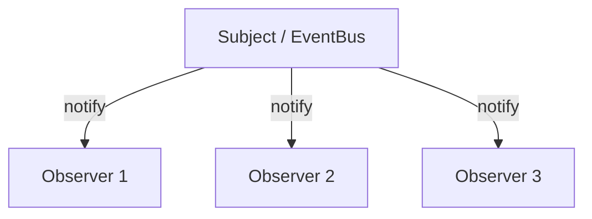
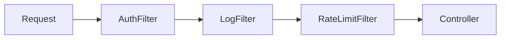

# Behavioral Patterns — Phân chia trách nhiệm & giao tiếp giữa object

Behavioral patterns tập trung vào cách object phân chia trách nhiệm, trao đổi thông tin và thay đổi hành vi. Chúng giúp tách phần điều phối khỏi phần thực thi để code dễ mở rộng hơn khi quy tắc nghiệp vụ thay đổi.

## Mục lục

- [Tổng quan](#1-tổng-quan)
- [Strategy — đóng gói thuật toán có thể hoán đổi](#2-strategy--đóng-gói-thuật-toán-có-thể-hoán-đổi)
- [Observer — pub/sub và bẫy memory leak](#3-observer--pubsub-và-bẫy-memory-leak)
- [Template Method — khung cố định, chi tiết mở](#4-template-method--khung-cố-định-chi-tiết-mở)
- [Chain of Responsibility — chuyền request qua chuỗi xử lý](#5-chain-of-responsibility--chuyền-request-qua-chuỗi-xử-lý)
- [Command — đóng gói hành động thành object](#6-command--đóng-gói-hành-động-thành-object)
- [Iterator & State](#7-iterator--state)
- [Strategy vs State vs Command — phân biệt](#8-strategy-vs-state-vs-command--phân-biệt)
- [Anti-patterns cần tránh](#9-anti-patterns-cần-tránh)
- [Tóm tắt — Cheat sheet](#10-tóm-tắt--cheat-sheet)

---

## 1. Tổng quan

Các pattern trong nhóm này giải quyết nhiều dạng tương tác: Strategy hoán đổi thuật toán, Observer phát sự kiện, Command đóng gói yêu cầu, State biểu diễn chuyển trạng thái và Chain of Responsibility tạo chuỗi xử lý.

Mục tiêu không phải thay mọi `if` bằng một pattern. Chỉ nên áp dụng khi pattern làm rõ điểm biến đổi, giảm coupling hoặc giúp kiểm thử từng hành vi độc lập.

## 2. Strategy — đóng gói thuật toán có thể hoán đổi

> Định nghĩa một họ thuật toán, đóng gói từng cái, và làm chúng **hoán đổi được** lúc runtime.

```java
interface ShippingStrategy { double cost(Order o); }

class StandardShipping implements ShippingStrategy {
    public double cost(Order o) { return o.weight() * 1.0; }
}
class ExpressShipping implements ShippingStrategy {
    public double cost(Order o) { return o.weight() * 2.5 + 10; }
}

class Checkout {
    private ShippingStrategy strategy;                 // cắm thuật toán vào
    void setStrategy(ShippingStrategy s) { this.strategy = s; }
    double total(Order o) { return o.subtotal() + strategy.cost(o); }
}
```

### 2.1. Lambda là Strategy

Trong Java hiện đại, Strategy với interface một-method = **functional interface** → dùng lambda trực tiếp:

```java
// Comparator CHÍNH LÀ Strategy để so sánh — và bạn truyền lambda
list.sort((a, b) -> a.price() - b.price());     // strategy "theo giá"
list.sort(Comparator.comparing(Product::name)); // strategy "theo tên"
```

> [!TIP]
> `Comparator`, `Runnable`, `Function`, `Predicate` đều là Strategy đóng gói dưới dạng functional interface. Khi thuật toán là một method đơn, **đừng tạo class** — truyền lambda/method reference. Strategy "cổ điển" (class riêng) chỉ cần khi thuật toán có state hoặc nhiều method.

---

## 3. Observer — pub/sub và bẫy memory leak

> Một-nhiều: khi object (subject) đổi trạng thái, mọi observer đăng ký được **thông báo tự động**.

```java
interface Observer { void update(Event e); }

class EventBus {
    private final List<Observer> observers = new CopyOnWriteArrayList<>();  // thread-safe duyệt
    public void subscribe(Observer o)   { observers.add(o); }
    public void unsubscribe(Observer o) { observers.remove(o); }            // QUAN TRỌNG
    public void publish(Event e) {
        for (Observer o : observers) o.update(e);   // thông báo tất cả
    }
}
```



> [!WARNING]
> **Lapsed listener / memory leak** là bẫy số một của Observer: nếu observer đăng ký mà **không hủy đăng ký** (`unsubscribe`), subject giữ tham chiếu mạnh tới nó → observer **không bao giờ bị GC** dù đã hết dùng. Đây là nguyên nhân leak kinh điển trong UI (listener của component đã đóng) và Spring (event listener). Giải pháp: luôn `unsubscribe` (vd trong `close()`/`onDestroy()`), hoặc dùng `WeakReference`.

> [!NOTE]
> `java.util.Observer`/`Observable` (Java 1.0) đã bị **deprecated từ Java 9** vì thiết kế kém (Observable là class nên không kế thừa được, không type-safe, không thread-safe rõ ràng). Thực tế dùng: `PropertyChangeListener`, Spring `ApplicationEvent`/`@EventListener`, reactive streams (`Flow.Publisher`/`Subscriber`), hoặc tự viết interface.

---

## 4. Template Method — khung cố định, chi tiết mở

> Định nghĩa **khung của thuật toán** trong method của lớp cha, để lớp con cài đặt các **bước cụ thể** mà không đổi cấu trúc.

```java
abstract class DataImporter {
    // template method: FINAL để con không phá khung
    public final void importData(String file) {
        var raw = read(file);          // bước cố định
        var parsed = parse(raw);       // bước con override
        validate(parsed);              // bước con override
        save(parsed);                  // bước con override
        afterImport();                 // hook — con có thể override hoặc không
    }
    protected abstract List<Row> parse(String raw);   // con BẮT BUỘC cài
    protected abstract void save(List<Row> rows);
    protected void afterImport() {}                   // hook mặc định rỗng
}
class CsvImporter extends DataImporter {
    protected List<Row> parse(String raw) { ... }     // chỉ cắm phần khác biệt
    protected void save(List<Row> rows) { ... }
}
```

> [!TIP]
> So với Strategy (composition — cắm thuật toán từ ngoài), Template Method dùng **kế thừa** (con điền vào chỗ trống của khung). Đánh `final` cho template method để giữ bất biến của thuật toán. JDK: `AbstractList`, `InputStream.read(byte[])` gọi `read()` abstract, `HttpServlet.service()` gọi `doGet`/`doPost`.

---

## 5. Chain of Responsibility — chuyền request qua chuỗi xử lý

> Cho nhiều object cơ hội xử lý request bằng cách **nối thành chuỗi**; mỗi handler hoặc xử lý hoặc chuyền tiếp.

```java
abstract class Handler {
    protected Handler next;
    public Handler setNext(Handler h) { this.next = h; return h; }
    public void handle(Request r) {
        if (canHandle(r)) process(r);
        else if (next != null) next.handle(r);   // chuyền tiếp
    }
    protected abstract boolean canHandle(Request r);
    protected abstract void process(Request r);
}
```

Ví dụ kinh điển: **Servlet Filter chain**, Spring Security filter chain, middleware (auth → log → rate-limit → handler):



> [!NOTE]
> Chain of Responsibility **tách người gửi khỏi người xử lý** — client không biết ai trong chuỗi sẽ xử lý. Bẫy: nếu không handler nào xử lý → request "rơi" âm thầm; nên có handler cuối (default) bắt mọi thứ. Trong JDK/framework: `javax.servlet.Filter`, logging handler chain của `java.util.logging`.

---

## 6. Command — đóng gói hành động thành object

> Đóng gói một **request thành object**, cho phép tham số hoá, xếp hàng, ghi log, và **undo/redo**.

```java
interface Command { void execute(); void undo(); }

class AddTextCommand implements Command {
    private final Document doc; private final String text;
    public void execute() { doc.append(text); }
    public void undo()    { doc.removeLast(text.length()); }   // sức mạnh: hoàn tác
}

class CommandManager {
    private final Deque<Command> history = new ArrayDeque<>();
    void run(Command c) { c.execute(); history.push(c); }
    void undo() { if (!history.isEmpty()) history.pop().undo(); }   // undo stack
}
```

> [!TIP]
> Command toả sáng khi cần: **undo/redo** (editor), **hàng đợi tác vụ** (job queue), **macro** (gộp nhiều command), **transaction/log** (ghi lại để replay). `Runnable` chính là Command đơn giản nhất (chỉ `execute`, không undo) — đó là vì sao `ExecutorService.submit(Runnable)` là pattern Command + queue.

---

## 7. Iterator & State

### 7.1. Iterator

> Truy cập tuần tự các phần tử của collection **mà không lộ cấu trúc bên trong**. Java tích hợp sẵn `Iterator`/`Iterable` (xem doc Collection Framework) — `for-each` là Iterator pattern.

### 7.2. State — hành vi đổi theo trạng thái nội bộ

> Cho object đổi hành vi khi trạng thái nội bộ đổi, như thể đổi class.

```java
interface OrderState { void next(Order o); void cancel(Order o); }
// NEW → PAID → SHIPPED → DELIVERED; mỗi state biết chuyển đi đâu
class NewState implements OrderState {
    public void next(Order o) { o.setState(new PaidState()); }
    public void cancel(Order o) { o.setState(new CancelledState()); }
}
```

Thay cho `switch (status)` khổng lồ rải khắp — mỗi trạng thái là một class biết hành vi và chuyển tiếp của riêng nó (state machine).

---

## 8. Strategy vs State vs Command — phân biệt

Ba pattern đều "đóng gói hành vi vào object" nhưng khác ý định:

| | Strategy | State | Command |
|---|----------|-------|---------|
| Đóng gói | thuật toán (cách làm) | trạng thái + hành vi theo state | một request/hành động |
| Ai đổi | client chọn strategy | object tự chuyển state | client tạo command |
| Biết nhau? | các strategy độc lập | các state biết state kế tiếp | command độc lập |
| Mục tiêu | hoán đổi thuật toán | máy trạng thái | undo/queue/log hành động |

> [!IMPORTANT]
> Strategy và State **giống hệt về UML** (đều "cắm" một object hành vi). Khác biệt: trong **Strategy** client chủ động chọn và các strategy không biết nhau; trong **State** object **tự chuyển** giữa các state và các state biết chuyển tới đâu (mô hình máy trạng thái).

---

## 9. Anti-patterns cần tránh

| Anti-pattern | Vì sao sai | Thay bằng |
|--------------|-----------|-----------|
| `if-else`/`switch` lớn theo loại/trạng thái | vi phạm OCP, khó test | Strategy / State |
| Observer không `unsubscribe` | memory leak (lapsed listener) | hủy đăng ký / WeakReference |
| Dùng `java.util.Observable` | deprecated, thiết kế kém | Spring event / Flow / tự viết |
| Tạo class Strategy cho 1 method | boilerplate | lambda / method reference |
| Chuỗi CoR không có handler cuối | request rơi âm thầm | default handler bắt mọi case |
| Command "fat" gánh cả nghiệp vụ | lẫn lộn trách nhiệm | command mỏng, gọi service |

---

## 10. Tóm tắt — Cheat sheet

**Pattern chính trong 6 dòng:**

```
Strategy   → hoán đổi thuật toán (lambda/Comparator)
Observer   → pub/sub một-nhiều (coi chừng leak listener!)
Template   → khung cố định (final) + bước con override (kế thừa)
CoR        → chuỗi handler chuyền tiếp (Servlet Filter)
Command    → request thành object → undo/redo/queue (Runnable)
State      → hành vi đổi theo trạng thái (state machine)
```

**5 nguyên tắc khắc cốt:**

1. **Thấy `if-else`/`switch` theo loại → nghĩ Strategy/State.**
2. **Observer luôn cần `unsubscribe`** — nếu không sẽ leak.
3. **Strategy = composition + lambda; Template Method = kế thừa + khung final.**
4. **Command đóng gói hành động** → nền của undo/redo và job queue.
5. **Strategy vs State**: client chọn vs object tự chuyển.

> [!TIP]
> Một câu để nhớ: *Behavioral pattern phần lớn là một câu trả lời cho cùng một câu hỏi — "làm sao thêm hành vi mới mà không sửa code cũ?" — và câu trả lời gần như luôn là: thay rẽ nhánh bằng đa hình.*
