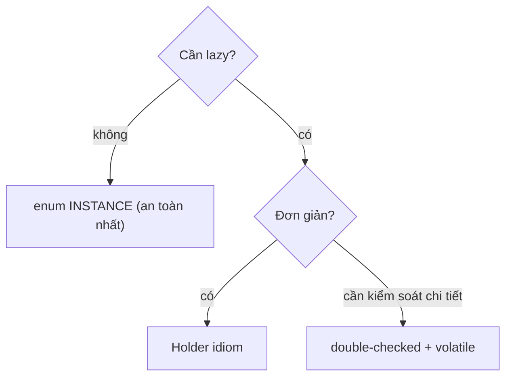
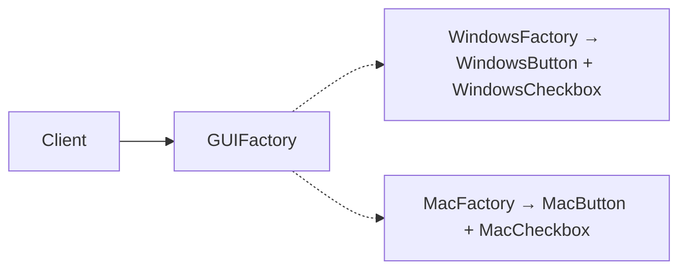
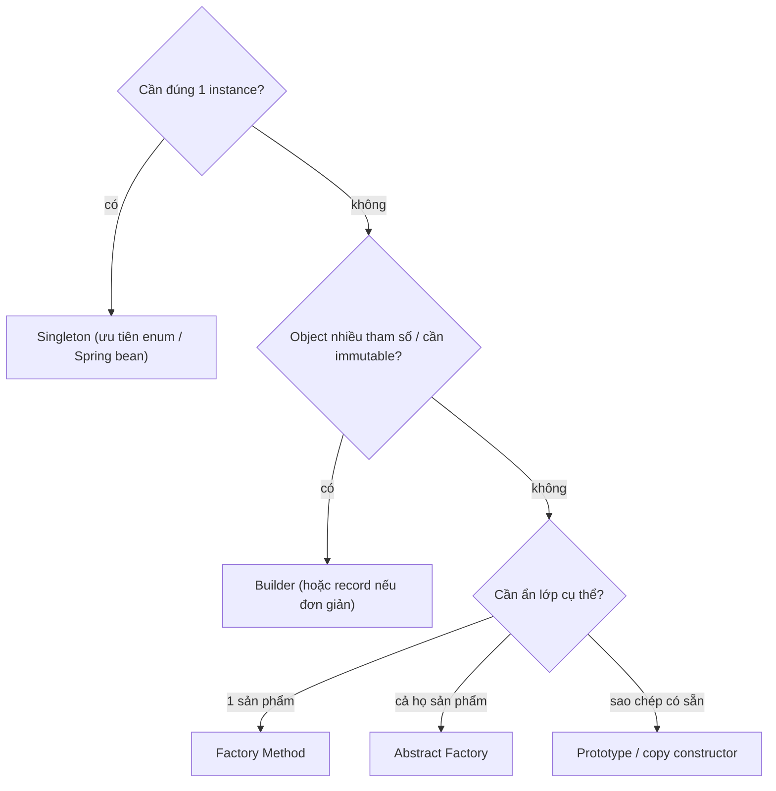

# Creational Patterns — Kiểm soát việc tạo object

Creational patterns kiểm soát cách object được tạo và cấu hình. Chúng hữu ích khi việc khởi tạo có nhiều biến thể, phụ thuộc phức tạp hoặc cần tách khỏi code sử dụng object.

## Mục lục

- [Tổng quan](#1-tổng-quan)
- [Singleton — và mọi cách làm sai](#2-singleton--và-mọi-cách-làm-sai)
- [Factory Method](#3-factory-method)
- [Abstract Factory](#4-abstract-factory)
- [Builder — thuần hoá constructor khổng lồ](#5-builder--thuần-hoá-constructor-khổng-lồ)
- [Prototype — deep vs shallow copy](#6-prototype--deep-vs-shallow-copy)
- [Các pattern trong JDK](#7-các-pattern-trong-jdk)
- [So sánh & khi nào dùng cái nào](#8-so-sánh--khi-nào-dùng-cái-nào)
- [Anti-patterns cần tránh](#9-anti-patterns-cần-tránh)
- [Tóm tắt — Cheat sheet](#10-tóm-tắt--cheat-sheet)

---

## 1. Tổng quan

Singleton, Factory Method, Abstract Factory, Builder và Prototype giải quyết các vấn đề tạo object khác nhau. Có pattern quản lý số lượng instance, có pattern lựa chọn concrete type, và có pattern tổ chức quá trình xây dựng nhiều bước.

Việc dùng pattern chỉ để tránh từ khóa `new` thường làm thiết kế phức tạp hơn. Giá trị thật nằm ở chỗ cô lập quyết định khởi tạo đang có khả năng thay đổi.

## 2. Singleton — và mọi cách làm sai

Singleton đảm bảo một class chỉ có **đúng một instance** toàn cục. Nghe đơn giản nhưng là nơi tập trung nhiều bẫy concurrency nhất.

### 2.1. Lazy + double-checked locking (cần volatile!)

```java
public class Config {
    private static volatile Config instance;   // VOLATILE là bắt buộc
    private Config() {}
    public static Config get() {
        if (instance == null) {                 // check 1 (không lock — nhanh)
            synchronized (Config.class) {
                if (instance == null)           // check 2 (trong lock)
                    instance = new Config();
            }
        }
        return instance;
    }
}
```

Vì sao **bắt buộc `volatile`**? `instance = new Config()` không nguyên tử — gồm: (1) cấp bộ nhớ, (2) gọi constructor, (3) gán tham chiếu. Không có `volatile`, CPU/JIT được phép sắp xếp (3) **trước** (2) → thread khác thấy `instance != null` nhưng object **chưa init xong** → đọc object nửa vời. `volatile` tạo happens-before chặn reordering này.

### 2.2. Holder idiom — lazy mà không cần lock

```java
public class Config {
    private Config() {}
    private static class Holder { static final Config INSTANCE = new Config(); }
    public static Config get() { return Holder.INSTANCE; }   // lazy + thread-safe
}
```

Tận dụng đảm bảo của JVM: class `Holder` chỉ được **nạp & khởi tạo** khi lần đầu `get()` chạm tới — và class init được JVM đảm bảo thread-safe sẵn. Sạch nhất cho lazy singleton.

### 2.3. Enum — chống cả reflection & serialization

```java
public enum Config {
    INSTANCE;
    public void doWork() { ... }
}
```

> [!WARNING]
> Singleton thường (`private constructor`) vẫn bị **phá** bởi: (1) reflection `setAccessible(true)` gọi constructor lần hai, (2) deserialization tạo instance mới, (3) nhiều classloader. **Enum singleton** (Effective Java Item 3) miễn nhiễm cả ba — JVM đảm bảo enum constant là duy nhất, reflection cấm tạo enum, serialization xử lý enum đặc biệt. Đây là cách Joshua Bloch khuyên dùng.



> [!NOTE]
> Singleton bị xem là **anti-pattern** trong nhiều bối cảnh: nó là global state trá hình → khó test (không mock được), giấu dependency, gây coupling ngầm. Trong app dùng Spring, hãy để **container quản lý scope singleton** (bean singleton) thay vì tự viết — vừa lazy, vừa thread-safe, vừa inject/mock được.

---

## 3. Factory Method

> Định nghĩa một method để **tạo object**, nhưng để **lớp con quyết định** tạo lớp cụ thể nào.

```java
abstract class Dialog {
    abstract Button createButton();        // factory method — con override
    void render() {
        Button b = createButton();         // dùng mà không biết lớp cụ thể
        b.onClick(...);
    }
}
class WindowsDialog extends Dialog {
    Button createButton() { return new WindowsButton(); }
}
class WebDialog extends Dialog {
    Button createButton() { return new HtmlButton(); }
}
```

Khác với "simple factory" (một method `switch` tạo object — không phải pattern GoF chính thức), Factory Method dùng **đa hình + kế thừa**: lớp cha định nghĩa *khung*, lớp con cắm *loại object*.

> [!TIP]
> Dấu hiệu cần Factory Method: lớp cha có thuật toán chung nhưng "loại thành phần" thay đổi theo ngữ cảnh. Nó tuân OCP — thêm loại Dialog mới không sửa code cũ. Trong JDK: `Collection.iterator()`, `Calendar.getInstance()`.

---

## 4. Abstract Factory

> Tạo **họ object liên quan** mà không chỉ định lớp cụ thể — đảm bảo các object "khớp bộ" với nhau.

```java
interface GUIFactory {                      // factory cho cả HỌ widget
    Button createButton();
    Checkbox createCheckbox();
}
class WindowsFactory implements GUIFactory {
    public Button createButton() { return new WindowsButton(); }
    public Checkbox createCheckbox() { return new WindowsCheckbox(); }
}
class MacFactory implements GUIFactory {
    public Button createButton() { return new MacButton(); }
    public Checkbox createCheckbox() { return new MacCheckbox(); }
}
// Client chỉ chọn factory 1 lần, mọi widget tạo ra đều ĐỒNG BỘ theo OS
```



> [!NOTE]
> Khác biệt với Factory Method: Factory Method tạo **một** sản phẩm (qua kế thừa), Abstract Factory tạo **cả họ** sản phẩm liên quan (qua composition). Abstract Factory đảm bảo tính nhất quán: bạn không thể vô tình ghép `WindowsButton` với `MacCheckbox`.

---

## 5. Builder — thuần hoá constructor khổng lồ

Vấn đề **telescoping constructor** — nhiều tham số tuỳ chọn:

```java
// Ác mộng: gọi đúng thứ tự, đọc không hiểu, dễ hoán nhầm tham số cùng kiểu
new Pizza(12, true, false, true, false, "thin", null);   // cái gì là cái gì??
```

Builder tách việc xây dựng thành các bước có tên, kết thúc bằng `build()`:

```java
Pizza p = new Pizza.Builder(12)        // tham số bắt buộc vào constructor builder
        .cheese(true)
        .pepperoni(true)
        .crust("thin")
        .build();                       // trả object BẤT BIẾN, đã validate

public class Pizza {
    private final int size; private final boolean cheese; /* final → immutable */
    private Pizza(Builder b) { this.size = b.size; this.cheese = b.cheese; ... }
    public static class Builder {
        private final int size;          // bắt buộc
        private boolean cheese;          // tuỳ chọn, có default
        public Builder(int size) { this.size = size; }
        public Builder cheese(boolean v) { this.cheese = v; return this; }  // fluent
        public Pizza build() {
            if (size <= 0) throw new IllegalArgumentException();  // validate tập trung
            return new Pizza(this);
        }
    }
}
```

> [!TIP]
> Builder toả sáng khi: nhiều tham số (≥4), nhiều tham số *tuỳ chọn*, hoặc cần object **bất biến** sau khi tạo. Bonus: **step builder** (mỗi bước trả interface khác nhau) ép thứ tự/bắt buộc lúc compile. Trong JDK/lib: `StringBuilder`, `Stream.Builder`, `HttpRequest.newBuilder()`, Lombok `@Builder`.

> [!WARNING]
> Đừng dùng Builder cho object 1–2 field đơn giản — nó thêm boilerplate vô ích. Với object bất biến đơn giản, **record** (Java 16+) gọn hơn nhiều. Builder dành cho cấu hình phức tạp, không phải mọi POJO.

---

## 6. Prototype — deep vs shallow copy

> Tạo object mới bằng cách **sao chép** một prototype có sẵn, thay vì `new` từ đầu.

Hữu ích khi tạo object tốn kém (load từ DB/file) và bạn cần nhiều bản tương tự. Bẫy lớn nhất: **shallow vs deep copy**.

```java
class Order implements Cloneable {
    List<Item> items;
    public Order clone() {
        try {
            Order copy = (Order) super.clone();   // shallow: items TRỎ CHUNG list!
            copy.items = new ArrayList<>(this.items);  // deep: phải tự copy field tham chiếu
            return copy;
        } catch (CloneNotSupportedException e) { throw new AssertionError(e); }
    }
}
```

> [!WARNING]
> `Object.clone()` mặc định là **shallow copy** — chỉ copy field bề mặt; field tham chiếu (List, Map, object con) vẫn **chia sẻ** với bản gốc. Sửa bản sao = sửa luôn bản gốc. `Cloneable` còn nhiều khiếm khuyết thiết kế (không có method `clone` trong interface, phải catch checked exception). Thực tế thường dùng **copy constructor** hoặc **static factory** (`Order copy = new Order(original)`) thay cho `Cloneable`.

---

## 7. Các pattern trong JDK

| Pattern | Ví dụ trong JDK |
|---------|-----------------|
| Singleton | `Runtime.getRuntime()`, `Desktop.getDesktop()` |
| Factory Method | `Calendar.getInstance()`, `Collection.iterator()`, `Optional.of()` |
| Abstract Factory | `DocumentBuilderFactory`, `DatatypeFactory` |
| Builder | `StringBuilder`, `Stream.Builder`, `HttpRequest.newBuilder()`, `Locale.Builder` |
| Prototype | `Object.clone()`, `ArrayList(Collection)` copy constructor |

---

## 8. So sánh & khi nào dùng cái nào

| Pattern | Vấn đề giải quyết | Cơ chế |
|---------|-------------------|--------|
| Singleton | đúng một instance toàn cục | static + private constructor / enum |
| Factory Method | hoãn chọn lớp cụ thể cho subclass | kế thừa + override |
| Abstract Factory | tạo cả họ object khớp bộ | composition + interface factory |
| Builder | xây object nhiều tham số / bất biến | fluent + build() |
| Prototype | sao chép object có sẵn | clone / copy constructor |



---

## 9. Anti-patterns cần tránh

| Anti-pattern | Vì sao sai | Thay bằng |
|--------------|-----------|-----------|
| Double-checked locking thiếu `volatile` | publish object chưa init → đọc nửa vời | thêm `volatile` / holder idiom |
| Singleton làm global mutable state | khó test, coupling ngầm | DI / Spring bean singleton |
| Telescoping constructor 7 tham số | khó đọc, dễ hoán nhầm | Builder / record |
| `Cloneable` cho deep copy phức tạp | shallow copy ngầm, API tệ | copy constructor / factory |
| Builder cho POJO 2 field | boilerplate thừa | constructor / record |
| `new` lớp cụ thể rải khắp | coupling, khó đổi impl | factory tập trung / DI |

---

## 10. Tóm tắt — Cheat sheet

**5 pattern trong 5 dòng:**

```
Singleton        → 1 instance: enum (an toàn) / holder (lazy) / DCL+volatile
Factory Method   → subclass quyết định lớp cụ thể (kế thừa)
Abstract Factory → tạo cả HỌ object khớp bộ (composition)
Builder          → object nhiều tham số / bất biến, fluent + build()
Prototype        → sao chép; coi chừng shallow vs deep copy
```

**5 nguyên tắc khắc cốt:**

1. **Singleton ưu tiên enum**; trong Spring để container quản lý.
2. **DCL bắt buộc `volatile`** — nếu không, reordering làm vỡ.
3. **Builder cho nhiều tham số / immutable**; record cho object đơn giản.
4. **`clone()` là shallow** — deep copy phải tự làm; ưu tiên copy constructor.
5. **Mục tiêu chung: giảm coupling tới lớp cụ thể** (DIP/OCP).

> [!TIP]
> Một câu để nhớ: *Creational pattern không phải để "tạo object cho ngầu" — chúng tồn tại để khi bạn cần đổi "tạo cái gì, ở đâu, bao nhiêu", bạn chỉ sửa một chỗ thay vì lùng từng `new` trong cả codebase.*
