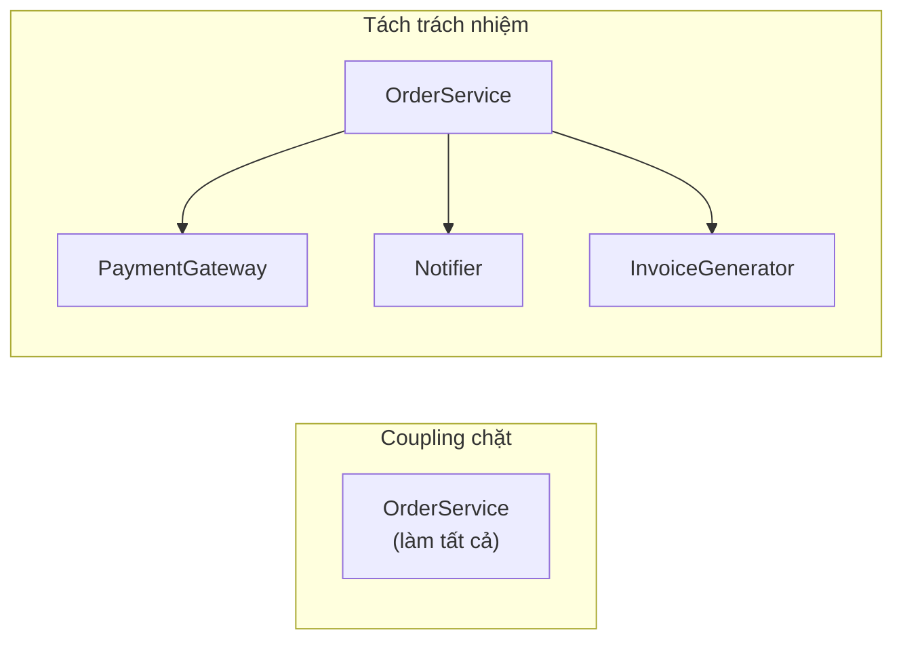
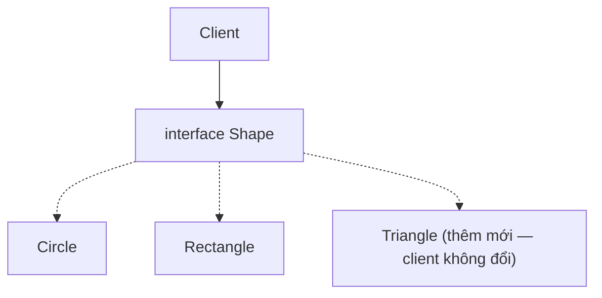
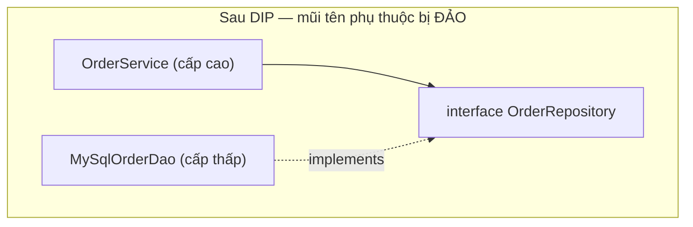

# SOLID — 5 nguyên tắc giữ code không mục ruỗng

## Mục lục

- [Vì sao codebase "thối rữa" theo thời gian](#1-vì-sao-codebase-thối-rữa-theo-thời-gian)
- [S — Single Responsibility Principle](#2-s--single-responsibility-principle)
- [O — Open/Closed Principle](#3-o--openclosed-principle)
- [L — Liskov Substitution Principle](#4-l--liskov-substitution-principle)
- [I — Interface Segregation Principle](#5-i--interface-segregation-principle)
- [D — Dependency Inversion Principle](#6-d--dependency-inversion-principle)
- [SOLID ↔ Design Patterns](#7-solid--design-patterns)
- [Khi nào ĐỪNG cứng nhắc với SOLID](#8-khi-nào-đừng-cứng-nhắc-với-solid)
- [Anti-patterns cần tránh](#9-anti-patterns-cần-tránh)
- [Tóm tắt — Cheat sheet](#10-tóm-tắt--cheat-sheet)

---

## 1. Vì sao codebase "thối rữa" theo thời gian

SOLID (Robert C. Martin) là 5 nguyên tắc giữ code **dễ thay đổi**: thêm tính năng mà không phải sửa code cũ, sửa một chỗ không làm vỡ chỗ khác (low coupling, high cohesion). Chúng quan trọng vì codebase dù viết sạch ban đầu cũng "thối rữa" (code rot) theo thời gian — một service phình lên 2000 dòng gánh đủ thứ trách nhiệm, mỗi lần sửa nhỏ đều rủi ro phá logic lân cận. Gốc rễ của sự thối rữa là **coupling** chặt (sửa chỗ này kéo theo chỗ kia) và **cohesion** thấp (một class gánh nhiều trách nhiệm không liên quan).



> [!IMPORTANT]
> SOLID không phải mục tiêu — nó là **phương tiện** để đạt mục tiêu thật: code chịu được thay đổi mà không lan ra (low coupling, high cohesion). Đừng áp dụng SOLID máy móc; áp dụng khi nó *giảm chi phí thay đổi trong tương lai*.

Phần còn lại của doc sẽ đi qua: Single Responsibility (§2) → Open/Closed (§3) → Liskov Substitution (§4) → Interface Segregation (§5) → Dependency Inversion (§6) → liên hệ SOLID với design patterns (§7) → khi nào ĐỪNG cứng nhắc (§8) → anti-patterns (§9) → cheat sheet (§10).

---

## 2. S — Single Responsibility Principle

> Một class chỉ nên có **một lý do để thay đổi**.

"Trách nhiệm" = một *trục thay đổi*. Câu hỏi đúng không phải "class này làm mấy việc?" mà "**có mấy nhóm người/lý do** có thể yêu cầu sửa nó?".

```java
// VI PHẠM — 3 lý do thay đổi trong 1 class
class Employee {
    BigDecimal calculatePay() { ... }   // đổi khi luật thuế đổi (kế toán)
    void save() { ... }                 // đổi khi schema DB đổi (DBA)
    String reportHours() { ... }        // đổi khi format báo cáo đổi (HR)
}

// SỬA — mỗi trách nhiệm một class
class PayCalculator { BigDecimal calculate(Employee e) { ... } }
class EmployeeRepository { void save(Employee e) { ... } }
class HourReporter { String report(Employee e) { ... } }
```

> [!TIP]
> Dấu hiệu vi phạm SRP: tên class có "And"/"Manager"/"Util", method import từ nhiều domain (SQL + HTTP + format), hoặc nhiều team cùng sửa một file gây conflict liên miên. Tách theo *lý do thay đổi*, không theo "cho gọn".

---

## 3. O — Open/Closed Principle

> Module nên **mở để mở rộng, đóng để sửa đổi** — thêm hành vi mới bằng cách thêm code, không sửa code cũ.

```java
// VI PHẠM — thêm loại hình mới phải SỬA hàm này (và mọi hàm tương tự)
double area(Shape s) {
    if (s instanceof Circle c) return Math.PI * c.r * c.r;
    else if (s instanceof Rectangle r) return r.w * r.h;
    // thêm Triangle → phải sửa ở ĐÂY và mọi switch khác → dễ sót
}

// SỬA — đa hình: thêm loại = thêm class, không đụng code cũ
interface Shape { double area(); }
class Circle implements Shape { public double area() { return Math.PI*r*r; } }
class Triangle implements Shape { public double area() { ... } }   // chỉ THÊM
```



> [!NOTE]
> OCP đạt được nhờ **abstraction** (interface/abstract class) + **đa hình**. Lưu ý đánh đổi: trừu tượng hoá *trước khi* có nhu cầu thật là **over-engineering**. Nguyên tắc thực dụng: lần đầu cứ viết cụ thể; khi điểm đó thay đổi **lần thứ hai/ba**, hãy trừu tượng hoá. Pattern matching + sealed (Java 21) là lựa chọn thay thế khi tập loại *đóng* và đã biết hết.

---

## 4. L — Liskov Substitution Principle

> Object của lớp con phải **thay thế được** object lớp cha mà không phá tính đúng đắn.

Đây là nguyên tắc tinh tế nhất — nó nói về **hợp đồng hành vi**, không chỉ chữ ký method. Ví dụ kinh điển Square–Rectangle:

```java
class Rectangle {
    void setWidth(int w) { this.w = w; }
    void setHeight(int h) { this.h = h; }
    int area() { return w * h; }
}
class Square extends Rectangle {          // "hình vuông LÀ hình chữ nhật" về toán
    void setWidth(int w)  { this.w = this.h = w; }   // ép cả hai bằng nhau
    void setHeight(int h) { this.w = this.h = h; }
}

void test(Rectangle r) {
    r.setWidth(5); r.setHeight(4);
    assert r.area() == 20;     // ĐÚNG với Rectangle, SAI với Square (=16)!
}
```

`Square` thừa kế `Rectangle` *về cú pháp* nhưng **vi phạm hợp đồng** "đặt width không đổi height". Lớp con không thay thế được lớp cha → vi phạm LSP.

Quy tắc hợp đồng cho lớp con:

| Yếu tố | Lớp con được phép |
|--------|-------------------|
| Precondition (điều kiện đầu vào) | **nới lỏng** (yêu cầu ít hơn), không siết chặt |
| Postcondition (đảm bảo đầu ra) | **siết chặt** (đảm bảo nhiều hơn), không nới lỏng |
| Invariant | giữ nguyên hoặc mạnh hơn |
| Exception | không ném exception "mới" mà cha không hứa |

> [!WARNING]
> Dấu hiệu vi phạm LSP: lớp con override method thành `throw new UnsupportedOperationException()` (vd `List` bất biến override `add`), hoặc client phải `if (x instanceof SubType)` để xử lý đặc biệt. Khi đó quan hệ không thật sự là "is-a" — dùng **composition** thay kế thừa.

---

## 5. I — Interface Segregation Principle

> Client không nên bị **buộc phụ thuộc** vào method nó không dùng.

```java
// VI PHẠM — interface "béo", máy in đơn giản bị ép implement cả fax/scan
interface MultiFunctionDevice {
    void print(Doc d);
    void scan(Doc d);
    void fax(Doc d);
}
class SimplePrinter implements MultiFunctionDevice {
    public void print(Doc d) { ... }
    public void scan(Doc d) { throw new UnsupportedOperationException(); }  // 😱
    public void fax(Doc d)  { throw new UnsupportedOperationException(); }
}

// SỬA — tách interface nhỏ, theo vai trò
interface Printer { void print(Doc d); }
interface Scanner { void scan(Doc d); }
interface Fax     { void fax(Doc d); }
class SimplePrinter implements Printer { ... }                  // chỉ cái cần
class AllInOne implements Printer, Scanner, Fax { ... }
```

> [!TIP]
> ISP và LSP liên quan: interface béo *buộc* lớp con ném `UnsupportedOperationException` → vi phạm cả ISP lẫn LSP. Interface nhỏ theo *vai trò* (role interface) cũng giúp test dễ hơn (mock ít method) và giảm coupling. `Comparable`, `Runnable`, `AutoCloseable` là ví dụ interface một-method mẫu mực.

---

## 6. D — Dependency Inversion Principle

> Module cấp cao **không** phụ thuộc module cấp thấp; **cả hai** phụ thuộc vào **abstraction**. Abstraction không phụ thuộc chi tiết; chi tiết phụ thuộc abstraction.

```java
// VI PHẠM — logic nghiệp vụ phụ thuộc TRỰC TIẾP vào chi tiết hạ tầng
class OrderService {
    private final MySqlOrderDao dao = new MySqlOrderDao();   // khoá cứng MySQL
    private final SmtpEmailSender email = new SmtpEmailSender();
}

// SỬA — phụ thuộc interface, chi tiết được "tiêm" vào (DI)
class OrderService {
    private final OrderRepository repo;     // abstraction
    private final Notifier notifier;        // abstraction
    OrderService(OrderRepository repo, Notifier notifier) {   // constructor injection
        this.repo = repo; this.notifier = notifier;
    }
}
```



Điểm "đảo ngược": bình thường cấp cao gọi cấp thấp nên *phụ thuộc* cấp thấp. DIP chèn một interface vào giữa và để **cấp thấp implement interface do cấp cao định nghĩa** → mũi tên phụ thuộc bị đảo. Đây chính là nền tảng của **Spring IoC/DI** (xem doc Spring Core).

> [!IMPORTANT]
> Đừng nhầm: **DIP** (nguyên tắc — phụ thuộc abstraction) ≠ **DI** (kỹ thuật — tiêm dependency từ ngoài vào) ≠ **IoC container** (công cụ tự động hoá DI). DI là *một cách* hiện thực DIP. Bạn có thể đạt DIP bằng tay (constructor injection thủ công) mà không cần Spring.

---

## 7. SOLID ↔ Design Patterns

SOLID là *nguyên tắc*, design pattern là *giải pháp lặp lại* hiện thực hoá chúng:

| Nguyên tắc | Pattern liên quan |
|------------|-------------------|
| OCP | Strategy, Template Method, Decorator |
| LSP | (mọi pattern dùng kế thừa/đa hình đúng) |
| ISP | Adapter, role interfaces |
| DIP | Factory, Abstract Factory, DI container |
| SRP | Facade (gom phối hợp), Command (đóng gói hành động) |

---

## 8. Khi nào ĐỪNG cứng nhắc với SOLID

> [!WARNING]
> SOLID bị lạm dụng dễ tạo ra **abstraction thừa**: hàng chục interface một-implementation, factory cho thứ chỉ `new` một lần, lớp 5 dòng tách thành 5 file. Đây là over-engineering — nó *tăng* chi phí đọc/sửa, ngược lại mục tiêu.

Cân bằng với:

- **YAGNI** (You Aren't Gonna Need It): đừng trừu tượng cho nhu cầu tưởng tượng.
- **KISS / Rule of Three**: trừu tượng hoá khi thấy *lặp lần thứ ba*, không phải lần đầu.
- Code đơn giản, cụ thể, dễ xoá thường tốt hơn code "linh hoạt" mà không ai cần sự linh hoạt đó.

---

## 9. Anti-patterns cần tránh

| Anti-pattern | Vi phạm | Sửa |
|--------------|---------|-----|
| God class (làm mọi thứ) | SRP | tách theo lý do thay đổi |
| `if/switch instanceof` khắp nơi cho loại | OCP | đa hình / sealed + pattern |
| Override thành `throw Unsupported` | LSP, ISP | composition / tách interface |
| Interface "béo" chục method | ISP | role interfaces nhỏ |
| `new` hạ tầng thẳng trong logic | DIP | constructor injection |
| Interface một-impl cho mọi class | (over-eng) | chỉ trừu tượng khi cần |

---

## 10. Tóm tắt — Cheat sheet

**SOLID trong 5 dòng:**

```
S  Single Responsibility — 1 lý do để thay đổi
O  Open/Closed           — thêm code, đừng sửa code cũ (đa hình)
L  Liskov Substitution   — con thay được cha mà không phá hợp đồng
I  Interface Segregation — interface nhỏ theo vai trò, đừng béo
D  Dependency Inversion  — phụ thuộc abstraction, tiêm chi tiết vào
```

| Nguyên tắc | Câu hỏi tự kiểm |
|------------|------------------|
| SRP | "Có mấy lý do để sửa class này?" |
| OCP | "Thêm loại mới có phải sửa code cũ không?" |
| LSP | "Con có thay được cha ở mọi nơi không?" |
| ISP | "Client có bị ép implement method thừa không?" |
| DIP | "Logic có phụ thuộc thẳng vào chi tiết hạ tầng không?" |

**5 nguyên tắc khắc cốt (meta):**

1. **SOLID là phương tiện**, mục tiêu là code chịu được thay đổi.
2. **Tách theo lý do thay đổi**, không theo "cho gọn".
3. **LSP nói về hợp đồng hành vi**, không chỉ chữ ký.
4. **DIP = phụ thuộc interface**; DI/Spring chỉ là cách hiện thực.
5. **Đừng trừu tượng hoá sớm** — Rule of Three, tránh over-engineering.

> [!TIP]
> Một câu để nhớ: *SOLID không làm code "đẹp" — nó làm code rẻ để thay đổi. Mỗi lần bạn phân vân, hỏi "thay đổi sắp tới sẽ lan ra bao nhiêu file?" và tối ưu cho câu trả lời nhỏ nhất.*
