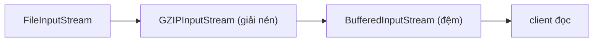
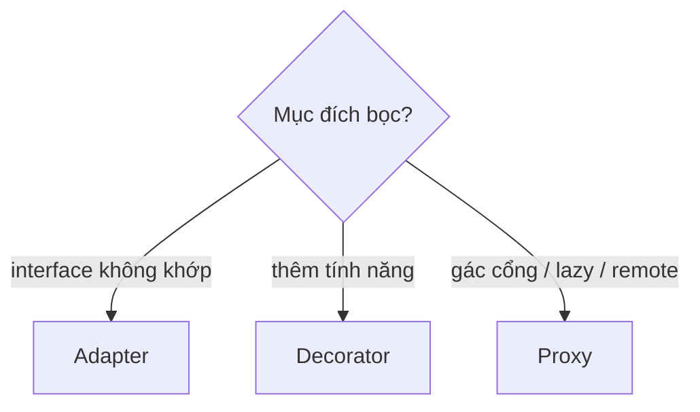
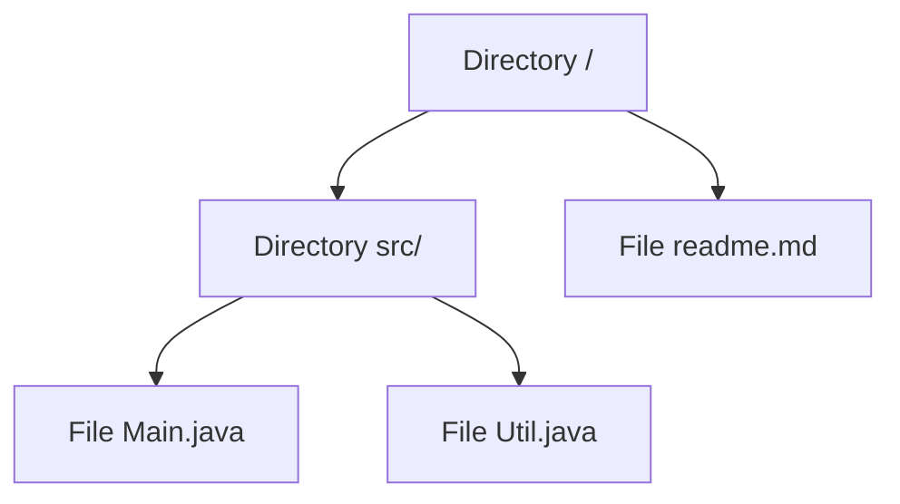

# Structural Patterns — Lắp ghép object thành cấu trúc lớn hơn

## Mục lục

- [Bối cảnh: ba pattern "bọc object" trông giống nhau](#1-bối-cảnh-ba-pattern-bọc-object-trông-giống-nhau)
- [Adapter — làm hai interface không khớp nói chuyện được](#2-adapter--làm-hai-interface-không-khớp-nói-chuyện-được)
- [Decorator — thêm hành vi động bằng cách bọc](#3-decorator--thêm-hành-vi-động-bằng-cách-bọc)
- [Proxy — đại diện kiểm soát truy cập](#4-proxy--đại-diện-kiểm-soát-truy-cập)
- [Adapter vs Decorator vs Proxy — phân biệt dứt khoát](#5-adapter-vs-decorator-vs-proxy--phân-biệt-dứt-khoát)
- [Facade — một cửa cho hệ thống con phức tạp](#6-facade--một-cửa-cho-hệ-thống-con-phức-tạp)
- [Composite — cây đệ quy phần tử/nhóm đồng nhất](#7-composite--cây-đệ-quy-phần-tửnhóm-đồng-nhất)
- [Bridge & Flyweight](#8-bridge--flyweight)
- [Anti-patterns cần tránh](#9-anti-patterns-cần-tránh)
- [Tóm tắt — Cheat sheet](#10-tóm-tắt--cheat-sheet)

---

## 1. Bối cảnh: ba pattern "bọc object" trông giống nhau

Adapter, Decorator, và Proxy đều **bọc một object khác** và đều có cùng "hình dạng" code:

```java
class Wrapper implements SomeInterface {
    private final SomeInterface wrapped;   // đều giữ tham chiếu object bên trong
    Wrapper(SomeInterface w) { this.wrapped = w; }
    public void doIt() { wrapped.doIt(); } // đều uỷ quyền (delegate)
}
```

Khác biệt **không** nằm ở code mà ở **ý định** (intent):

- **Adapter**: đổi *interface* (làm cái không khớp khớp lại) — interface vào ≠ ra.
- **Decorator**: *thêm hành vi* (giữ nguyên interface) — interface vào = ra, chức năng tăng.
- **Proxy**: *kiểm soát truy cập* (giữ nguyên interface) — interface vào = ra, thêm gác cổng.

> [!IMPORTANT]
> Đây là lý do design pattern được phân loại theo **ý định**, không theo cấu trúc code. Ba pattern này gần như giống hệt về mặt UML, nhưng giải quyết ba vấn đề khác nhau. Nhớ ý định = chọn đúng tên khi giao tiếp với đồng đội.

---

## 2. Adapter — làm hai interface không khớp nói chuyện được

> Chuyển interface của một class thành interface khác mà client mong đợi.

Dùng khi bạn có class hữu ích nhưng **interface không khớp** với code của bạn (vd thư viện bên thứ ba, code legacy).

```java
// Client cần interface này
interface MediaPlayer { void play(String file); }

// Nhưng thư viện chỉ có cái này (không sửa được)
class AdvancedPlayer { void playMp4(String f) { ... } }

// Adapter: bọc Advanced, expose interface MediaPlayer
class MediaAdapter implements MediaPlayer {
    private final AdvancedPlayer adaptee = new AdvancedPlayer();
    public void play(String file) { adaptee.playMp4(file); }  // dịch lời gọi
}
```

Hai biến thể:

| | Object Adapter (composition) | Class Adapter (kế thừa) |
|---|------------------------------|--------------------------|
| Cách | giữ tham chiếu adaptee | `extends` adaptee |
| Java hỗ trợ | tốt (khuyên dùng) | hạn chế (đơn kế thừa) |
| Linh hoạt | đổi adaptee runtime | cố định lúc compile |

> [!TIP]
> Trong JDK: `Arrays.asList()` (mảng → List), `Collections.list(Enumeration)` (Enumeration cũ → List), `InputStreamReader` (byte stream → char stream — vừa là adapter). Object adapter (composition) gần như luôn ưu tiên hơn class adapter.

---

## 3. Decorator — thêm hành vi động bằng cách bọc

> Gắn thêm trách nhiệm cho object **một cách động**, là lựa chọn linh hoạt thay cho kế thừa con.

`java.io` là ví dụ Decorator kinh điển nhất trong JDK:

```java
InputStream in =
    new BufferedInputStream(            // + buffering
        new GZIPInputStream(            // + giải nén
            new FileInputStream("a.gz")  // nguồn gốc
        ));
// Mỗi lớp THÊM một tính năng, đều là InputStream → bọc bao nhiêu lớp cũng được
```

Vì sao không dùng kế thừa? Vì tổ hợp tính năng **bùng nổ**: `BufferedFileStream`, `GzipBufferedFileStream`, `EncryptedGzipBufferedFileStream`... Decorator cho phép **kết hợp runtime** thay vì tạo lớp cho mọi tổ hợp.



```java
// Cấu trúc chuẩn của decorator
abstract class StreamDecorator implements InputStream {
    protected final InputStream wrapped;          // giữ object base
    StreamDecorator(InputStream s) { this.wrapped = s; }
}
```

> [!NOTE]
> Decorator giữ **đúng interface** của object gốc (cũng là `InputStream`) nên trong suốt với client — đây là điểm phân biệt với Adapter (đổi interface). Bonus: tuân OCP (thêm decorator mới không sửa lớp cũ) và SRP (mỗi decorator một tính năng).

---

## 4. Proxy — đại diện kiểm soát truy cập

> Cung cấp một **đại diện** cho object khác để kiểm soát truy cập tới nó.

Các loại proxy theo mục đích:

| Loại | Mục đích |
|------|----------|
| Virtual proxy | hoãn tạo object đắt (lazy loading — vd Hibernate lazy entity) |
| Protection proxy | kiểm tra quyền trước khi cho gọi |
| Remote proxy | đại diện cho object ở máy khác (RMI) |
| Caching proxy | cache kết quả |

### 4.1. Dynamic Proxy — vũ khí bí mật của framework

JDK cho tạo proxy **lúc runtime** cho bất kỳ interface nào, qua `java.lang.reflect.Proxy` + `InvocationHandler`:

```java
interface UserService { User find(Long id); }

UserService proxy = (UserService) Proxy.newProxyInstance(
    UserService.class.getClassLoader(),
    new Class[]{ UserService.class },
    (instance, method, args) -> {           // InvocationHandler: chặn MỌI lời gọi
        long t0 = System.nanoTime();
        Object result = method.invoke(realService, args);   // gọi thật
        log.info("{} mất {}ns", method.getName(), System.nanoTime() - t0);
        return result;
    });
```

> [!IMPORTANT]
> Đây là cơ chế nền của **Spring AOP**, `@Transactional`, `@Cacheable`, Mybatis mapper, mock của Mockito. Khi bạn gọi method có `@Transactional`, thực ra bạn gọi một **proxy** mở/commit transaction quanh method thật. Hệ quả thực tế: gọi method `@Transactional` **từ trong cùng class** (self-invocation) **không** đi qua proxy → annotation bị bỏ qua. (Spring dùng JDK dynamic proxy cho interface, CGLIB subclassing cho class.)

---

## 5. Adapter vs Decorator vs Proxy — phân biệt dứt khoát

| | Adapter | Decorator | Proxy |
|---|---------|-----------|-------|
| Ý định | đổi interface | thêm hành vi | kiểm soát truy cập |
| Interface vào/ra | **khác** | **giống**, mạnh hơn | **giống** |
| Client biết object thật? | không cần | không | không (trong suốt) |
| Bọc nhiều lớp? | thường 1 | có (chuỗi) | thường 1 |
| Ví dụ JDK | `InputStreamReader` | `BufferedInputStream` | `Proxy.newProxyInstance` |



> [!TIP]
> Câu hỏi chốt: *Interface sau khi bọc có khác trước không?* Khác → Adapter. Giống nhưng làm thêm việc cho client → Decorator. Giống nhưng kiểm soát/giấu việc truy cập object thật → Proxy.

---

## 6. Facade — một cửa cho hệ thống con phức tạp

> Cung cấp một interface **đơn giản, thống nhất** cho một tập hợp interface phức tạp trong subsystem.

```java
// Không Facade — client phải biết và phối hợp 4 subsystem
videoFile = new VideoFile(name);
codec = CodecFactory.extract(videoFile);
buffer = BitrateReader.read(filename, codec);
result = AudioMixer.fix(buffer);
// ... rườm rà, client coupling với mọi class

// Facade — gói toàn bộ vào 1 method
class VideoConverter {
    public File convert(String name, String format) { /* phối hợp nội bộ */ }
}
new VideoConverter().convert("a.mp4", "ogg");   // client chỉ thấy 1 cửa
```

> [!NOTE]
> Facade **giảm coupling** giữa client và subsystem (liên hệ SRP — gom logic phối hợp về một nơi). Khác Adapter: Facade *đơn giản hoá* một tập interface (nhiều → một dễ dùng), Adapter *chuyển đổi* một interface sang dạng khác. Facade không giấu subsystem — client vẫn dùng trực tiếp nếu cần.

---

## 7. Composite — cây đệ quy phần tử/nhóm đồng nhất

> Tổ chức object thành cấu trúc cây, cho phép client xử lý **phần tử đơn** và **nhóm** **đồng nhất**.

```java
interface FileSystemNode { long size(); }              // interface chung

class File implements FileSystemNode {                  // leaf
    public long size() { return bytes; }
}
class Directory implements FileSystemNode {             // composite
    private final List<FileSystemNode> children = new ArrayList<>();
    public long size() {
        return children.stream().mapToLong(FileSystemNode::size).sum();  // đệ quy
    }
}
// dir.size() tự cộng dồn cả cây — client không cần phân biệt file hay folder
```



> [!TIP]
> Composite tỏa sáng với cấu trúc cây tự nhiên: cây thư mục, cây UI component (Swing `Container`/`Component`), cây tổ chức, AST. Sức mạnh: client gọi `size()` trên gốc, đệ quy tự lan xuống — không `if (isLeaf)`. JDK: `java.awt.Component`/`Container`.

---

## 8. Bridge & Flyweight

### 8.1. Bridge — tách abstraction khỏi implementation

Khi một thứ biến thiên theo **hai chiều độc lập**, kế thừa gây bùng nổ lớp. Bridge tách hai chiều thành hai phân cấp nối nhau bằng composition:

```java
// Hai chiều: loại thông báo (Alert/Reminder) × kênh gửi (Email/SMS/Push)
// Kế thừa: EmailAlert, SmsAlert, PushAlert, EmailReminder... → bùng nổ 2x3=6 lớp
abstract class Notification {           // abstraction
    protected final Channel channel;    // bridge tới implementation
    Notification(Channel c) { this.channel = c; }
    abstract void send(String msg);
}
interface Channel { void deliver(String msg); }   // implementation độc lập
// Giờ: 2 loại + 3 kênh = 2+3 lớp, kết hợp tự do lúc runtime
```

### 8.2. Flyweight — chia sẻ state chung để tiết kiệm bộ nhớ

Khi có **rất nhiều** object giống nhau phần lớn, tách phần **bất biến chia sẻ** (intrinsic) khỏi phần **riêng** (extrinsic):

```java
// Integer cache là flyweight: -128..127 dùng chung instance
Integer a = Integer.valueOf(100);
Integer b = Integer.valueOf(100);
a == b;   // true! cùng instance flyweight  (nhưng 200 == 200 → false)
```

> [!NOTE]
> Flyweight là lý do `Integer.valueOf(-128..127)`, `String` pool, `Boolean.TRUE/FALSE` chia sẻ instance. Đây cũng là **bẫy autoboxing `==`**: số nhỏ `==` đúng (cùng flyweight), số lớn sai (instance mới). Luôn `.equals()` cho wrapper.

---

## 9. Anti-patterns cần tránh

| Anti-pattern | Vì sao sai | Thay bằng |
|--------------|-----------|-----------|
| Gọi `@Transactional` cùng class (self-invocation) | không qua proxy → annotation bị bỏ | tách sang bean khác / inject self |
| Quá nhiều lớp decorator lồng nhau | khó debug stack trace | giới hạn số lớp, đặt tên rõ |
| Facade biến thành God object | gom quá nhiều → vi phạm SRP | tách nhiều facade theo use case |
| Dùng kế thừa cho 2 chiều biến thiên | bùng nổ lớp | Bridge |
| So sánh wrapper bằng `==` (do flyweight) | đúng số nhỏ, sai số lớn | `.equals()` |
| Adapter làm thêm logic nghiệp vụ | lẫn lộn ý định | chỉ dịch interface, logic để chỗ khác |

---

## 10. Tóm tắt — Cheat sheet

**7 pattern trong 7 dòng:**

```
Adapter    → đổi interface cho khớp (interface vào ≠ ra)
Decorator  → thêm hành vi, giữ interface (chuỗi bọc — java.io)
Proxy      → kiểm soát truy cập, giữ interface (AOP, lazy, remote)
Facade     → một cửa đơn giản cho subsystem phức tạp
Composite  → cây phần tử/nhóm đồng nhất (đệ quy)
Bridge     → tách abstraction khỏi implementation (2 chiều độc lập)
Flyweight  → chia sẻ state bất biến để tiết kiệm RAM (Integer cache)
```

**5 nguyên tắc khắc cốt:**

1. **Adapter/Decorator/Proxy giống code, khác ý định** — interface đổi? thêm việc? gác cổng?
2. **Decorator > kế thừa** khi tổ hợp tính năng bùng nổ (java.io).
3. **Proxy là nền của Spring AOP** — coi chừng self-invocation.
4. **Composite cho cấu trúc cây** — client xử lý leaf/nhóm đồng nhất.
5. **Bridge cho 2 chiều biến thiên**; Flyweight cho hàng triệu object giống nhau.

> [!TIP]
> Một câu để nhớ: *Structural pattern không tạo object mới — chúng quyết định object đã có lắp vào nhau ra sao: dịch (Adapter), tô điểm (Decorator), canh gác (Proxy), gom cửa (Facade), xếp cây (Composite).*
