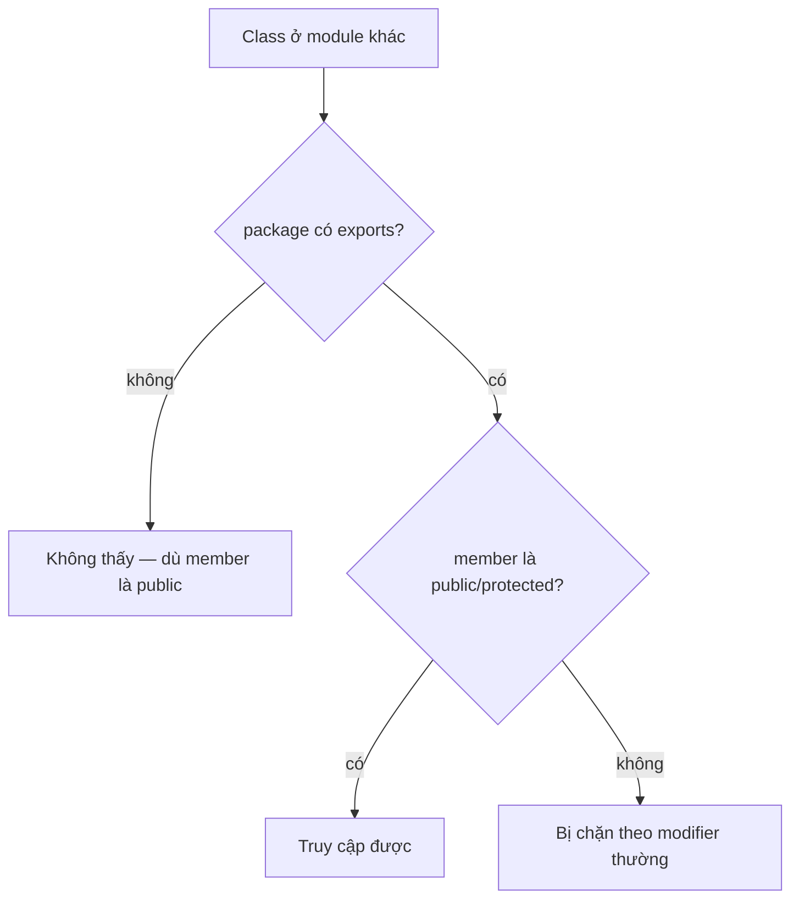

# Access Modifiers — Phạm vi truy cập từ ngôn ngữ tới JVM

## Mục lục

- [Bối cảnh: "protected sao tôi vẫn không gọi được?"](#1-bối-cảnh-protected-sao-tôi-vẫn-không-gọi-được)
- [Bốn mức truy cập & bảng phạm vi](#2-bốn-mức-truy-cập--bảng-phạm-vi)
- [private — và bí mật synthetic accessor](#3-private--và-bí-mật-synthetic-accessor)
- [protected — quy tắc "khác package" gây bẫy](#4-protected--quy-tắc-khác-package-gây-bẫy)
- [default (package-private) — đóng gói cấp package](#5-default-package-private--đóng-gói-cấp-package)
- [Access flag trong bytecode](#6-access-flag-trong-bytecode)
- [JPMS — lớp kiểm soát thứ hai](#7-jpms--lớp-kiểm-soát-thứ-hai)
- [Quy tắc thiết kế & ma trận quyết định](#8-quy-tắc-thiết-kế--ma-trận-quyết-định)
- [Anti-patterns cần tránh](#9-anti-patterns-cần-tránh)
- [Tóm tắt — Cheat sheet](#10-tóm-tắt--cheat-sheet)

---

## 1. Bối cảnh: "protected sao tôi vẫn không gọi được?"

```java
// package shapes
package shapes;
public class Shape {
    protected int area() { return 0; }
}

// package app — class KHÁC package, có kế thừa
package app;
import shapes.Shape;
public class Box extends Shape {
    void test(Shape other) {
        this.area();    // ✅ OK
        other.area();   // ❌ compile error!  "area() has protected access in Shape"
    }
}
```

Cùng là `protected`, cùng là lớp con, nhưng `this.area()` được phép còn `other.area()` thì không. Lý do nằm ở một điều khoản ít người nhớ trong JLS §6.6.2: **`protected` từ ngoài package chỉ cho phép truy cập qua tham chiếu có kiểu là chính lớp con đó (hoặc lớp con sâu hơn), không phải mọi instance của lớp cha.**

> [!IMPORTANT]
> Access modifier không phải bảo mật — nó là **công cụ thiết kế API**. Mức truy cập quyết định *bạn được phép thay đổi gì mà không phá vỡ client*. `public` = hợp đồng vĩnh viễn; `private` = tự do tái cấu trúc. Chọn mức **hẹp nhất có thể**.

---

## 2. Bốn mức truy cập & bảng phạm vi

Java có **4 mức** (theo thứ tự từ rộng → hẹp): `public` → `protected` → *default* → `private`. Lưu ý "default" **không có từ khoá** — bạn đạt được nó bằng cách không viết modifier nào.

| Modifier | Cùng class | Cùng package | Lớp con (khác pkg) | Mọi nơi |
|----------|:---:|:---:|:---:|:---:|
| `public` | ✅ | ✅ | ✅ | ✅ |
| `protected` | ✅ | ✅ | ✅ (có điều kiện §4) | ❌ |
| *default* | ✅ | ✅ | ❌ | ❌ |
| `private` | ✅ | ❌ | ❌ | ❌ |

```
public      ████████████████  toàn thế giới
protected   ████████████      package + subclass
default     ████████          chỉ package
private     ████              chỉ class
```

> [!NOTE]
> Modifier áp dụng cho **member** (field, method, constructor, nested type). Với **top-level class** chỉ có hai lựa chọn: `public` hoặc *default* (package-private). Không có top-level class `private` hay `protected`.

---

## 3. private — và bí mật synthetic accessor

`private` = chỉ truy cập trong **cùng một class** (kể cả các instance khác của cùng class đó). Nhưng nested class làm phát sinh một chuyện thú vị.

### 3.1. Nested class truy cập private của nhau

```java
public class Outer {
    private int secret = 42;
    class Inner {
        int read() { return secret; }   // ✅ Inner đọc private của Outer
    }
}
```

Trước Java 11, JVM **không** cho phép class này truy cập field private của class khác — kể cả nested. Compiler "lách" bằng cách sinh ra **synthetic bridge method** `access$000()` với mức package-private trong `Outer`, rồi `Inner` gọi nó:

```
// Bytecode trước Java 11 (giản lược)
class Outer {
    static int access$000(Outer o) { return o.secret; }  // synthetic, do compiler sinh
}
```

> [!WARNING]
> Synthetic accessor từng là vector tấn công nhỏ (phá đóng gói) và làm phình bytecode. **Java 11 + JEP 181 (Nestmates)** sửa triệt để: thêm thuộc tính `NestHost`/`NestMembers` vào class file, JVM cho nestmate truy cập trực tiếp private của nhau — không cần synthetic method nữa.

### 3.2. private không chặn được cùng-class

Điểm hay quên: `private` là **class-level**, không phải **object-level**. Một method của `Person` đọc được field private của `Person` khác:

```java
public class Person {
    private int age;
    boolean olderThan(Person other) {
        return this.age > other.age;   // ✅ truy cập private của object KHÁC, cùng class
    }
}
```

Đây là lý do `equals(Object o)` so sánh được field private — vì nó nằm trong cùng class.

---

## 4. protected — quy tắc "khác package" gây bẫy

`protected` = `default` (cả package) **cộng thêm** lớp con ở package khác. Nhưng phần "lớp con khác package" có điều kiện ngặt (JLS §6.6.2):

> Từ trong lớp con `S` (ở package khác package của lớp cha), bạn chỉ truy cập member `protected` qua tham chiếu mà **kiểu tĩnh là `S` hoặc con của `S`** — không phải qua tham chiếu kiểu lớp cha.

```java
package app;
public class Box extends Shape {
    void demo(Box b, Shape s) {
        this.area();   // ✅ this là Box
        b.area();      // ✅ b kiểu Box (con)
        s.area();      // ❌ s kiểu Shape (cha) — bị cấm dù s có thể là Box lúc runtime
    }
}
```

Lý do thiết kế: ngăn lớp con dùng quyền `protected` để "soi" vào instance lớp cha mà nó không sở hữu — chỉ cho phép thao tác trên *chính dòng dõi của mình*.

> [!TIP]
> `protected` báo hiệu "method này là **điểm mở rộng** dành cho subclass override/gọi", không phải API công khai. Nếu bạn không thật sự thiết kế cho kế thừa, đừng dùng `protected` — nó là một dạng hợp đồng với người viết subclass.

---

## 5. default (package-private) — đóng gói cấp package

Không viết modifier = **package-private**: chỉ class **trong cùng package** thấy. Đây là mức **mặc định và bị đánh giá thấp**, cực hữu ích để:

- Tạo API **nội bộ package** mà không lộ ra ngoài (vd helper class của một module).
- Cho phép **unit test** trong cùng package truy cập member cần test mà không phải `public`.

```java
package com.app.order;
class OrderValidator { ... }          // không ai ngoài package order thấy
public class OrderService {
    private final OrderValidator v;   // dùng nội bộ, ẩn khỏi client
}
```

> [!NOTE]
> Test convention: đặt test trong **cùng package** (khác source root: `src/test/java/com/app/order/`) để truy cập member package-private. Đây là cách test "internal" mà không phá đóng gói bằng `public`.

---

## 6. Access flag trong bytecode

Mỗi class/field/method trong file `.class` mang một trường `access_flags` 16-bit. Modifier được mã hoá thành bit:

| Modifier | Flag | Giá trị |
|----------|------|---------|
| `public` | `ACC_PUBLIC` | `0x0001` |
| `private` | `ACC_PRIVATE` | `0x0002` |
| `protected` | `ACC_PROTECTED` | `0x0004` |
| *default* | (không bit nào trong 3 cái trên) | — |

Kiểm chứng bằng `javap`:

```bash
javap -p -v Outer.class | grep -A1 "secret"
# flags: (0x0002) ACC_PRIVATE
```

> [!IMPORTANT]
> **Verifier** của JVM kiểm tra access lúc link, không phải lúc compile. Vì thế nếu bạn compile `A` với field `public` rồi sau đó đổi `A` thành `private` và **chỉ recompile `A`** (không recompile class gọi nó), runtime sẽ ném `IllegalAccessError` — một dạng lỗi binary-incompatibility kinh điển.

---

## 7. JPMS — lớp kiểm soát thứ hai

Từ Java 9, **Java Platform Module System** thêm một tầng access *trên cả* 4 modifier. Một class `public` chỉ thật sự truy cập được từ module khác nếu package của nó được **`exports`**:

```java
// module-info.java
module com.app {
    exports com.app.api;          // public trong package này mới ra ngoài
    // com.app.internal KHÔNG export → public cũng vô hình với module khác
}
```



Hệ quả: trong thế giới module, "public" không còn nghĩa "mọi nơi". `exports ... to <module>` (qualified export) còn giới hạn ai được dùng. Reflection cũng bị chặn trừ khi `opens`.

> [!WARNING]
> Đây là vì sao Java 16+ chặn mặc định `setAccessible(true)` xuyên module JDK (`InaccessibleObjectException`). Code cũ dựa vào reflection phá private giờ cần `--add-opens` rõ ràng.

---

## 8. Quy tắc thiết kế & ma trận quyết định

Nguyên tắc vàng (Effective Java, Item 15): **giảm khả năng truy cập của mọi member tới mức thấp nhất có thể.**

| Bạn muốn... | Dùng |
|-------------|------|
| API ổn định cho mọi client | `public` (cẩn trọng — khó đổi sau này) |
| Điểm mở rộng cho subclass | `protected` |
| Chi tiết dùng chung trong package/test | *default* (package-private) |
| Trạng thái & helper nội bộ class | `private` (mặc định nên dùng) |
| Hằng số dùng chung, bất biến | `public static final` |

**Thứ tự quyết định khi viết member mới:** bắt đầu từ `private` → chỉ nới rộng khi thật sự cần. Đừng làm ngược lại (bắt đầu `public` rồi cố thu hẹp — quá muộn vì client đã phụ thuộc).

> [!TIP]
> Field instance **gần như không bao giờ nên `public`** (trừ `public static final` cho hằng số bất biến). Field public phá đóng gói và khoá bạn vào một biểu diễn dữ liệu cụ thể mãi mãi.

---

## 9. Anti-patterns cần tránh

| Anti-pattern | Vì sao sai | Thay bằng |
|--------------|-----------|-----------|
| Field instance `public` | Phá đóng gói, không kiểm soát được thay đổi | `private` + accessor có kiểm soát |
| Mọi thứ `public` cho "tiện" | Khoá cứng API, khó refactor | Mức hẹp nhất có thể |
| `protected` khi không thiết kế cho kế thừa | Hợp đồng ngầm với subclass không tồn tại | *default* hoặc `private` |
| `public static` mảng/collection mutable | Ai cũng sửa được "hằng số" | `List.of(...)` / bản sao bất biến |
| Dùng reflection phá private trong code thường | Mong manh, vỡ khi refactor + JPMS chặn | Thiết kế lại API |
| Mở `public` chỉ để test gọi được | Lộ chi tiết nội bộ ra production API | Test cùng package + *default* |

---

## 10. Tóm tắt — Cheat sheet

**Phạm vi trong 4 dòng:**

```
public     → mọi nơi (nhưng JPMS cần exports)
protected  → package + subclass (subclass khác pkg: chỉ qua ref kiểu chính nó)
default    → chỉ package (mặc định, tốt cho nội bộ + test)
private    → chỉ class (class-level, không phải object-level; nestmate share được)
```

| Tầng kiểm soát | Cơ chế |
|----------------|--------|
| Ngôn ngữ | 4 modifier → `access_flags` bit trong `.class` |
| JVM verifier | kiểm tra access lúc link → `IllegalAccessError` |
| Module (Java 9+) | `exports`/`opens` quyết định public có ra ngoài không |

**5 nguyên tắc khắc cốt:**

1. **Hẹp nhất có thể** — bắt đầu `private`, chỉ nới khi cần.
2. **`public` là hợp đồng** — khó đổi, suy nghĩ kỹ trước khi đặt.
3. **`protected` = điểm mở rộng** cho subclass, không phải "public nhẹ".
4. **default + test cùng package** thay vì mở public để test.
5. **Trong module, public ≠ truy cập được** — phải `exports`.

> [!TIP]
> Một câu để nhớ: *Access modifier không bảo vệ bạn khỏi hacker — nó bảo vệ bạn khỏi chính mình trong tương lai, bằng cách giữ cho bề mặt API đủ nhỏ để còn dám thay đổi.*
