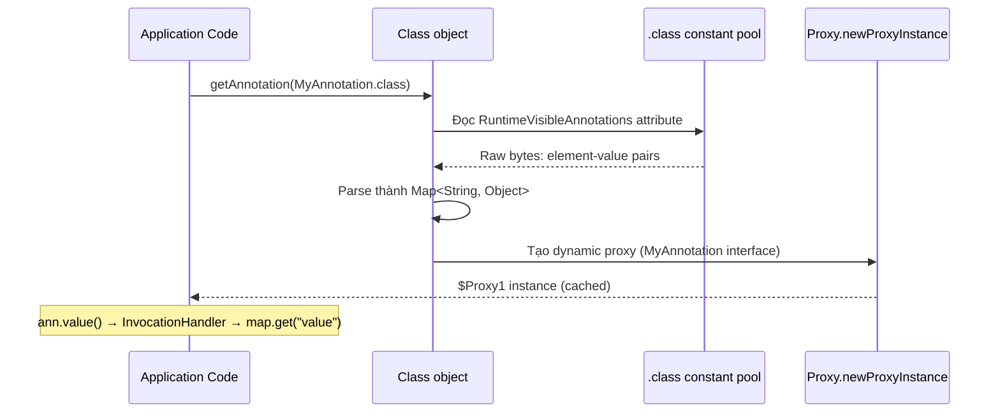

Annotation là metadata gắn vào class, method, field và các phần tử khác của chương trình Java. Bản thân annotation không thực thi logic; compiler, framework hoặc công cụ phải đọc metadata và quyết định hành động tương ứng.

## Mục lục

- [Tổng quan](#1-tổng-quan)
- [Annotation là gì — metadata, không phải code](#2-annotation-là-gì--metadata-không-phải-code)
- [RetentionPolicy — annotation sống ở đâu?](#3-retentionpolicy--annotation-sống-ở-đâu)
- [ElementType — annotation gắn vào đâu?](#4-elementtype--annotation-gắn-vào-đâu)
- [Meta-annotations — annotation cho annotation](#5-meta-annotations--annotation-cho-annotation)
- [Runtime Processing — Reflection API](#6-runtime-processing--reflection-api)
- [Annotation trong Bytecode](#7-annotation-trong-bytecode)
- [Compile-time Processing — APT & AbstractProcessor](#8-compile-time-processing--apt--abstractprocessor)
- [Spring Annotation Internals](#9-spring-annotation-internals)
- [Custom Annotation — thiết kế và implement](#10-custom-annotation--thiết-kế-và-implement)
- [Anti-patterns & Tóm tắt](#11-anti-patterns--tóm-tắt)

---

## 1. Tổng quan

Hiệu lực của annotation phụ thuộc vào nơi nó được giữ lại, phần tử mà nó được phép gắn vào và cơ chế xử lý. Có annotation chỉ tồn tại trong source, có annotation được ghi vào bytecode, và có loại được đọc lúc runtime qua reflection.

Điều này giải thích vì sao hai annotation có cú pháp tương tự nhưng hoạt động hoàn toàn khác nhau, cũng như vì sao một annotation framework có thể không có tác dụng nếu processor hoặc proxy liên quan không tham gia.

## 2. Annotation là gì — metadata, không phải code

Annotation là **metadata** gắn vào code element (class, method, field, parameter...). Nó **không ảnh hưởng** trực tiếp tới runtime behavior — trừ khi có **processor** đọc và hành động theo.

```java
// Định nghĩa annotation
public @interface MyAnnotation {
    String value() default "";   // element (giống method, nhưng là attribute)
    int priority() default 0;
}

// Sử dụng
@MyAnnotation(value = "important", priority = 1)
public class MyClass { ... }
```

### 2.1. @interface — annotation type

`@interface` là syntax đặc biệt. Compiler biến annotation type thành **interface** extends `java.lang.annotation.Annotation`:

```java
// Khi compile, @MyAnnotation trở thành:
public interface MyAnnotation extends java.lang.annotation.Annotation {
    String value();
    int priority();
}
```

Tại runtime, JVM tạo **dynamic proxy** implement interface này khi bạn gọi `getAnnotation()`.

---

## 3. RetentionPolicy — annotation sống ở đâu?

| Retention | Tồn tại ở | Đọc bằng | Ví dụ |
|----------|----------|----------|------|
| `SOURCE` | **Chỉ source code** — compiler loại bỏ | APT (compile-time) | `@Override`, `@SuppressWarnings`, Lombok |
| `CLASS` | **Source + .class file** — nhưng không load vào JVM | Bytecode tool (ASM, ByteBuddy) | Default nếu không specify |
| `RUNTIME` | **Source + .class + JVM runtime** | **Reflection** (`getAnnotation()`) | `@Component`, `@Transactional`, `@Test` |

```java
@Retention(RetentionPolicy.RUNTIME)   // sống tới runtime → reflection đọc được
@Target(ElementType.METHOD)
public @interface Cacheable {
    String key() default "";
    long ttl() default 300;
}
```

> [!NOTE]
> `@Override` là `SOURCE` — compiler check xong thì bỏ, không cần ở runtime. `@Transactional` là `RUNTIME` — Spring đọc bằng reflection lúc tạo proxy. Chọn đúng retention tránh bloat bytecode.

---

## 4. ElementType — annotation gắn vào đâu?

| Target | Gắn vào | Java version |
|--------|---------|-------------|
| `TYPE` | Class, interface, enum, annotation, record | 1.5 |
| `FIELD` | Field (instance + static) | 1.5 |
| `METHOD` | Method | 1.5 |
| `PARAMETER` | Method parameter | 1.5 |
| `CONSTRUCTOR` | Constructor | 1.5 |
| `LOCAL_VARIABLE` | Biến local (chỉ SOURCE — không vào .class) | 1.5 |
| `ANNOTATION_TYPE` | Annotation type (meta-annotation) | 1.5 |
| `PACKAGE` | Package (package-info.java) | 1.5 |
| `TYPE_PARAMETER` | Generic type parameter `<@NotNull T>` | 8 |
| `TYPE_USE` | Bất kỳ type use: `@NotNull String`, `List<@NotNull String>` | 8 |
| `RECORD_COMPONENT` | Record component | 16 |

> [!TIP]
> `TYPE_USE` (Java 8) mạnh nhất — cho phép annotate **bất kỳ** chỗ nào dùng type. Nullability checker (NullAway, Checker Framework) dùng `@Nullable`/`@NonNull` với TYPE_USE để check null tại compile-time.

---

## 5. Meta-annotations — annotation cho annotation

| Meta-annotation | Chức năng |
|----------------|----------|
| `@Retention` | Xác định lifecycle (SOURCE, CLASS, RUNTIME) |
| `@Target` | Xác định nơi gắn (METHOD, TYPE, FIELD...) |
| `@Inherited` | Subclass **kế thừa** annotation từ superclass (chỉ cho class-level) |
| `@Documented` | Xuất hiện trong Javadoc |
| `@Repeatable` | Cho phép gắn nhiều lần cùng annotation |

### 5.1. @Inherited

```java
@Inherited
@Retention(RUNTIME)
@Target(TYPE)
@interface Role { String value(); }

@Role("admin")
class Parent { }

class Child extends Parent { }

// Child.class.getAnnotation(Role.class) → @Role("admin") ← KẾ THỪA!
// Chỉ áp dụng cho class, KHÔNG cho method hay field
```

### 5.2. @Repeatable (Java 8)

```java
@Repeatable(Schedules.class)
@interface Schedule { String cron(); }

@interface Schedules { Schedule[] value(); }  // container annotation

@Schedule(cron = "0 0 * * *")
@Schedule(cron = "0 12 * * *")
class DailyJob { }
```

---

## 6. Runtime Processing — Reflection API

```java
// Đọc annotation trên class
MyAnnotation ann = MyClass.class.getAnnotation(MyAnnotation.class);
String value = ann.value();     // "important"
int priority = ann.priority();  // 1

// Đọc annotation trên method
Method m = MyClass.class.getMethod("process");
if (m.isAnnotationPresent(Cacheable.class)) {
    Cacheable c = m.getAnnotation(Cacheable.class);
    System.out.println("Cache key: " + c.key() + ", TTL: " + c.ttl());
}

// Scan tất cả method có annotation
for (Method method : clazz.getDeclaredMethods()) {
    if (method.isAnnotationPresent(Transactional.class)) {
        // wrap với proxy
    }
}
```

### 6.1. Annotation Proxy — JVM tạo proxy tự động

Khi gọi `getAnnotation()`, JVM tạo **dynamic proxy** implement annotation interface:

```java
// Runtime: ann.getClass()
// → com.sun.proxy.$Proxy1 (dynamic proxy)
// → implements MyAnnotation (annotation interface)
// → handler: AnnotationInvocationHandler
//     └── memberValues: {"value": "important", "priority": 1}  (từ .class file)
```

`AnnotationInvocationHandler` giữ `Map<String, Object>` chứa annotation element values. Mỗi method call (`value()`, `priority()`) được dispatch tới map lookup.

### 6.2. Cách AnnotationInvocationHandler hoạt động — chi tiết nội bộ

```java
// sun.reflect.annotation.AnnotationInvocationHandler (simplified)
class AnnotationInvocationHandler implements InvocationHandler {
    private final Class<? extends Annotation> type;  // MyAnnotation.class
    private final Map<String, Object> memberValues;  // {"value":"important","priority":1}

    @Override
    public Object invoke(Object proxy, Method method, Object[] args) {
        String name = method.getName();

        // Special methods:
        if (name.equals("toString")) return toStringImpl();
        if (name.equals("hashCode")) return hashCodeImpl();
        if (name.equals("equals"))   return equalsImpl(args[0]);
        if (name.equals("annotationType")) return type;

        // Annotation element method → lookup from map:
        Object result = memberValues.get(name);
        // Nếu result là array → clone (để caller không sửa internal state)
        if (result.getClass().isArray()) return cloneArray(result);
        return result;
    }
}
```

**Flow hoàn chỉnh khi gọi `getAnnotation()`:**



> [!NOTE]
> JDK cache annotation proxy per `Class` object — gọi `getAnnotation()` nhiều lần trên cùng class trả về **cùng proxy instance**. Nhưng `getDeclaredAnnotations()` có thể tạo array mới mỗi lần. Spring cache kết quả scan annotation thêm 1 tầng nữa.

### 6.3. Performance: annotation access cost

| Operation | Cost | Ghi chú |
|-----------|------|---------|
| `isAnnotationPresent(X.class)` | O(n) scan annotations array | n = số annotations trên element |
| `getAnnotation(X.class)` (lần đầu) | Parse .class + tạo proxy | Nặng — cold path |
| `getAnnotation(X.class)` (cached) | HashMap lookup | Nhanh — hot path |
| Spring `@Transactional` check | 1 lookup trong annotation cache | BeanPostProcessor đã scan lúc startup |

> [!TIP]
> Nếu scan annotation thủ công trong hot path, **cache kết quả**. Reflection + proxy creation mỗi lần = performance killer. Spring làm đúng: scan 1 lần lúc startup, cache metadata, dùng suốt lifetime.

---

## 7. Annotation trong Bytecode

### 7.1. .class file attribute

Annotation `RUNTIME` được lưu trong .class file dưới attribute `RuntimeVisibleAnnotations`:

```
// javap -v MyClass.class
RuntimeVisibleAnnotations:
  0: #15(#16=s#17)        // @MyAnnotation(value="important")
    MyAnnotation(
      value="important"
      priority=1
    )
```

Annotation `CLASS` → `RuntimeInvisibleAnnotations` (có trong .class nhưng JVM không load vào reflection).

### 7.2. Type annotation (Java 8+)

```java
@NonNull String name;
List<@NonNull String> items;
```

Lưu trong attribute `RuntimeVisibleTypeAnnotations` — kèm **type path** chỉ rõ annotation nằm ở vị trí nào trong generic type.

---

## 8. Compile-time Processing — APT & AbstractProcessor

### 8.1. APT (Annotation Processing Tool)

Compiler (`javac`) hỗ trợ chạy **annotation processor** tại compile-time. Processor có thể:
- **Generate** source code mới (Lombok, MapStruct, Dagger)
- **Validate** code (checker framework)
- **Tạo** metadata files (META-INF/services)

### 8.2. AbstractProcessor

```java
@SupportedAnnotationTypes("com.example.AutoToString")
@SupportedSourceVersion(SourceVersion.RELEASE_17)
public class AutoToStringProcessor extends AbstractProcessor {

    @Override
    public boolean process(Set<? extends TypeElement> annotations,
                           RoundEnvironment roundEnv) {
        for (Element element : roundEnv.getElementsAnnotatedWith(AutoToString.class)) {
            TypeElement typeElement = (TypeElement) element;
            // generate toString() source code
            generateToString(typeElement);
        }
        return true;  // claim annotation — không processor khác xử lý
    }

    private void generateToString(TypeElement type) {
        // Dùng Filer API tạo file Java mới
        JavaFileObject file = processingEnv.getFiler()
            .createSourceFile(type.getQualifiedName() + "ToString");
        try (Writer writer = file.openWriter()) {
            writer.write("// Auto-generated\n");
            // ... generate source code
        }
    }
}
```

### 8.3. Lombok — APT ở mức magic

Lombok dùng APT nhưng **modify AST** (Abstract Syntax Tree) trực tiếp thay vì chỉ generate file mới. Nó dùng internal compiler API (`com.sun.tools.javac.tree`) — đây là **unsupported API** nhưng hoạt động rất hiệu quả:

```java
@Data   // Lombok generate: getter, setter, toString, equals, hashCode, constructor
public class User {
    private String name;
    private int age;
}
// Compile-time: Lombok processor inject methods vào AST
// Runtime: User.class có full getter/setter/toString — KHÔNG runtime overhead
```

> [!WARNING]
> Lombok modify AST dùng internal API — có thể **break** khi JDK upgrade. Đây là trade-off: tiện lợi vs fragility. Alternative: Java Records (JDK 16+), Kotlin data class, IDE generate.

---

## 9. Spring Annotation Internals

### 9.1. @Component scan — ClassPathBeanDefinitionScanner

Spring Boot startup:
1. `@SpringBootApplication` = `@ComponentScan` + `@Configuration` + `@EnableAutoConfiguration`
2. `ClassPathBeanDefinitionScanner` scan **tất cả class** trong base package
3. Với mỗi class: check **bytecode** (dùng ASM, **không** load class) xem có `@Component` (hoặc meta-annotated: `@Service`, `@Repository`, `@Controller`)
4. Nếu match → tạo `BeanDefinition` → register vào `ApplicationContext`

### 9.2. @Autowired — AutowiredAnnotationBeanPostProcessor

```java
// Khi Spring tạo bean:
1. Instantiate object (constructor)
2. AutowiredAnnotationBeanPostProcessor.postProcessProperties()
   → scan field/method có @Autowired
   → resolve dependency từ container
   → inject (reflection: field.set() hoặc method.invoke())
3. @PostConstruct → InitializingBean.afterPropertiesSet()
```

### 9.3. @Transactional — AOP Proxy

```
                    ┌──────────────────────────┐
Client ──────────→  │   TransactionInterceptor │
                    │   (AOP Proxy)            │
                    │                          │
                    │  1. Get transaction      │
                    │  2. Call real method ──────→ RealObject.doTransfer()
                    │  3. Commit / Rollback    │
                    └──────────────────────────┘
```

Spring tạo proxy (JDK dynamic proxy hoặc CGLIB):
- **JDK proxy**: target phải implement interface
- **CGLIB** (default Spring Boot): subclass target → **override method** → insert transaction logic

> [!IMPORTANT]
> `@Transactional` trên **private method** → **không hoạt động** (CGLIB không thể override private). Trên **internal call** (`this.method()`) → **không hoạt động** (bypass proxy). Đây là 2 bug phổ biến nhất với Spring annotation.

---

## 10. Custom Annotation — thiết kế và implement

### 10.1. Ví dụ: @RateLimit

```java
@Retention(RUNTIME)
@Target(METHOD)
public @interface RateLimit {
    int maxRequests() default 100;
    int windowSeconds() default 60;
}
```

### 10.2. AOP Aspect xử lý

```java
@Aspect
@Component
public class RateLimitAspect {
    private final Map<String, AtomicInteger> counters = new ConcurrentHashMap<>();

    @Around("@annotation(rateLimit)")
    public Object enforce(ProceedingJoinPoint pjp, RateLimit rateLimit) throws Throwable {
        String key = pjp.getSignature().toShortString();
        AtomicInteger counter = counters.computeIfAbsent(key, k -> new AtomicInteger());

        if (counter.incrementAndGet() > rateLimit.maxRequests()) {
            throw new RateLimitExceededException("Rate limit exceeded");
        }
        return pjp.proceed();
    }
}
```

### 10.3. Checklist tạo custom annotation

1. **Retention**: RUNTIME (nếu cần reflection/AOP), SOURCE (nếu chỉ compile-time)
2. **Target**: càng hẹp càng tốt — METHOD thay vì TYPE nếu chỉ dùng cho method
3. **Elements**: dùng `default` cho giá trị phổ biến — giảm verbosity
4. **Naming**: verb/adjective (`@Cacheable`, `@Transactional`) hoặc noun (`@Component`)
5. **Processor**: AOP aspect (simple), BeanPostProcessor (complex), APT (compile-time)

---

## 11. Anti-patterns & Tóm tắt

### Anti-patterns

| Anti-pattern | Vì sao sai | Sửa |
|--------------|-----------|-----|
| `@Transactional` trên private method | Proxy không override được | Public hoặc package-private |
| Internal call `this.method()` với `@Transactional` | Bypass proxy | Inject self, hoặc tách service |
| `@Retention(SOURCE)` nhưng cần runtime reflection | Annotation biến mất sau compile | Dùng `RUNTIME` |
| Annotation có quá nhiều element (>5) | Khó dùng, khó nhớ | Tách thành annotation nhỏ hơn hoặc dùng class config |
| Scan base package quá rộng | Startup chậm, scan không cần thiết | Scope narrow: `@ComponentScan(basePackages = "com.example.order")` |
| Dựa vào annotation order | Không đảm bảo order với reflection | Dùng `@Order` hoặc `@Priority` explicit |

### Tóm tắt — Cheat sheet

```
Annotation = metadata, KHÔNG phải code. Logic ở processor.

1. RetentionPolicy: SOURCE (compile-time) → CLASS (bytecode) → RUNTIME (reflection)
2. @Target: TYPE, METHOD, FIELD, PARAMETER, TYPE_USE...
3. Meta-annotations: @Retention, @Target, @Inherited, @Repeatable
4. Runtime: getAnnotation() → JVM tạo dynamic proxy
5. Compile-time: APT + AbstractProcessor → generate code (MapStruct, Lombok)
6. Spring: @Component scan (ASM bytecode), @Autowired (BeanPostProcessor),
   @Transactional (AOP proxy — CGLIB/JDK proxy)
7. @Transactional pitfall: private method + internal call = KHÔNG hoạt động
```

| Cần gì | Dùng gì |
|--------|---------|
| Compile-time code gen | APT + AbstractProcessor (hoặc Lombok) |
| Runtime behavior change | AOP Aspect + RUNTIME annotation |
| Validation at compile | Checker Framework + TYPE_USE |
| Spring bean customization | BeanPostProcessor + RUNTIME annotation |
| Repeatable annotation | `@Repeatable` + container annotation |

> [!TIP]
> Một câu để nhớ: *Annotation là nhãn dán — bản thân nó không làm gì. Giá trị nằm ở người đọc nhãn (processor).* Khi annotation "không hoạt động", vấn đề luôn ở processor, không phải annotation.
