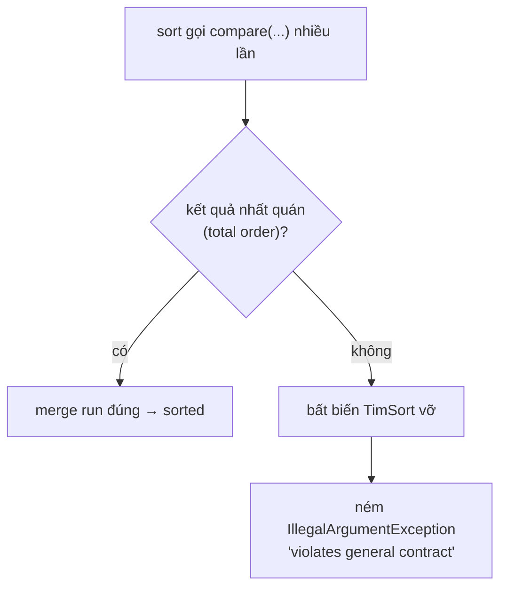
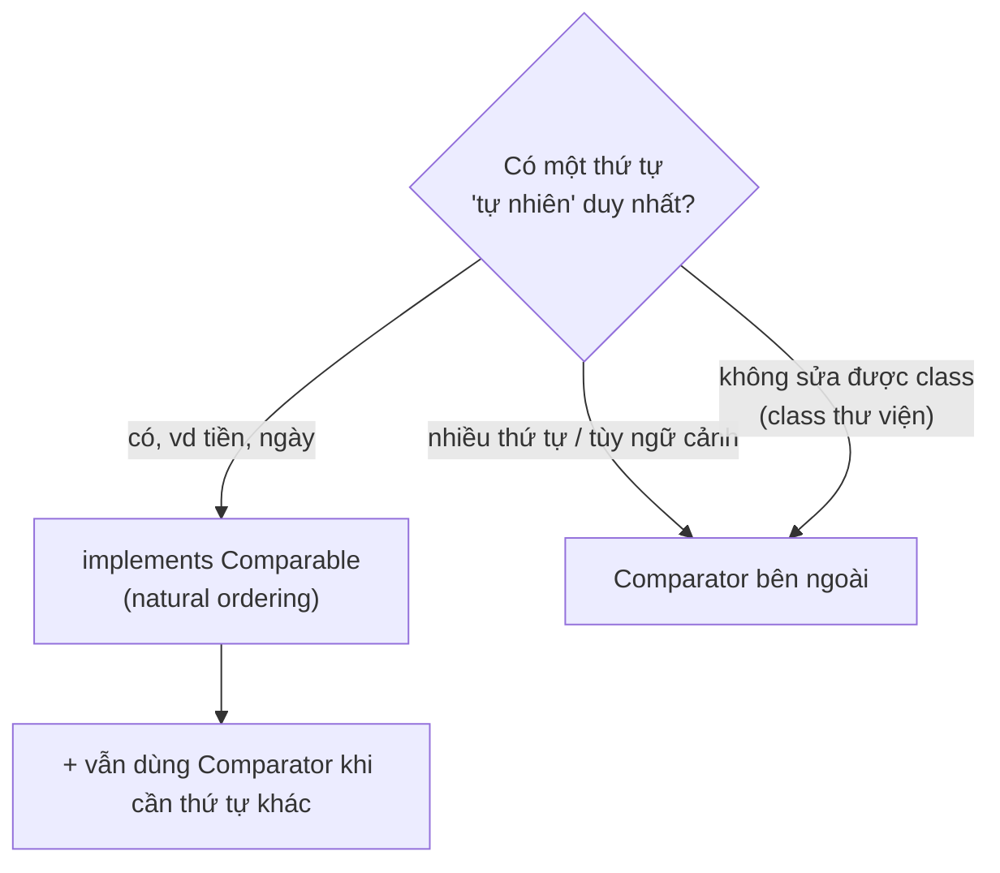

`Comparable` và `Comparator` đều định nghĩa thứ tự cho object, nhưng chúng đặt trách nhiệm ở hai nơi khác nhau. Một loại biểu diễn thứ tự tự nhiên của class; loại còn lại mô tả các chiến lược sắp xếp bên ngoài.

## Mục lục

- [Tổng quan](#1-tổng-quan)
- [Hai cách định nghĩa thứ tự](#2-hai-cách-định-nghĩa-thứ-tự)
- [Hợp đồng tổng thứ tự (total order)](#3-hợp-đồng-tổng-thứ-tự-total-order)
- [Vì sao TimSort phát hiện được vi phạm](#4-vì-sao-timsort-phát-hiện-được-vi-phạm)
- [Bẫy int subtraction overflow](#5-bẫy-int-subtraction-overflow)
- [Consistency với equals — TreeSet "nuốt" phần tử](#6-consistency-với-equals--treeset-nuốt-phần-tử)
- [Comparator chaining hiện đại](#7-comparator-chaining-hiện-đại)
- [null handling & reversed](#8-null-handling--reversed)
- [Comparable hay Comparator — chọn cái nào](#9-comparable-hay-comparator--chọn-cái-nào)
- [Anti-patterns cần tránh](#10-anti-patterns-cần-tránh)
- [Tóm tắt — Cheat sheet & nguyên tắc](#11-tóm-tắt--cheat-sheet--nguyên-tắc)

---

## 1. Tổng quan

Class triển khai `Comparable` khi có một thứ tự mặc định ổn định và có ý nghĩa rộng rãi. `Comparator` phù hợp khi cần nhiều tiêu chí, không thể sửa class hoặc muốn tách quy tắc sắp xếp khỏi domain object.

Cả hai phải tuân thủ các tính chất như phản đối xứng và bắc cầu. Comparator vi phạm hợp đồng có thể làm sort thất bại hoặc khiến sorted collection hoạt động sai.

## 2. Hai cách định nghĩa thứ tự

| | `Comparable<T>` | `Comparator<T>` |
|---|-----------------|------------------|
| Method | `int compareTo(T o)` | `int compare(T a, T b)` |
| Đặt ở đâu | **Trong chính class** | Object **bên ngoài**, tách rời |
| Ý nghĩa | **Natural ordering** (thứ tự "tự nhiên" duy nhất) | Một trong **nhiều** thứ tự tùy ngữ cảnh |
| Sửa được class? | Cần (phải sửa class T) | Không cần (so cả class không sửa được) |
| Số lượng | Một class → một natural order | Vô số comparator khác nhau |
| Ví dụ JDK | `String`, `Integer`, `LocalDate` | `Comparator.comparing(...)` |

```java
// Comparable: natural ordering, gắn liền class
record Money(long cents) implements Comparable<Money> {
    public int compareTo(Money o) { return Long.compare(cents, o.cents); }
}
Collections.sort(moneyList);          // dùng natural ordering

// Comparator: thứ tự bên ngoài, linh hoạt
Comparator<Employee> byName = Comparator.comparing(Employee::name);
employees.sort(byName);               // truyền comparator
employees.sort(byName.reversed());    // đảo ngược, không sửa class
```

Quy ước trả về (cho cả hai):

```
compare(a, b) < 0   →  a đứng TRƯỚC b  (a "nhỏ hơn")
compare(a, b) == 0  →  a, b "bằng" về thứ tự
compare(a, b) > 0   →  a đứng SAU b   (a "lớn hơn")
```

---

## 3. Hợp đồng tổng thứ tự (total order)

`compare`/`compareTo` phải thỏa các tính chất sau cho **mọi** x, y, z:

| # | Tính chất | Phát biểu |
|---|-----------|-----------|
| 1 | **Đối xứng dấu** | `sgn(compare(x,y)) == -sgn(compare(y,x))` |
| 2 | **Bắc cầu** | `compare(x,y)>0 ∧ compare(y,z)>0 ⇒ compare(x,z)>0` |
| 3 | **Nhất quán phần bằng** | `compare(x,y)==0 ⇒ sgn(compare(x,z))==sgn(compare(y,z))` cho mọi z |
| 4 | (khuyến nghị) **Consistent với equals** | `compare(x,y)==0 ⇔ x.equals(y)` |

Bug ở mục 1 vi phạm tính chất **1** (đối xứng): `compare(a,b)` và `compare(b,a)` cùng dấu dương khi a,b "ngang nhau".

> [!NOTE]
> Tính chất 4 chỉ là **khuyến nghị**, không bắt buộc — nhưng vi phạm nó gây hành vi "lạ" trong `TreeSet`/`TreeMap` (mục 6). Mọi class trong JDK có natural ordering không consistent với equals đều ghi rõ trong Javadoc (vd `BigDecimal`: `new BigDecimal("1.0").compareTo(new BigDecimal("1.00")) == 0` nhưng `.equals()` là `false`).

---

## 4. Vì sao TimSort phát hiện được vi phạm

`Collections.sort`/`Arrays.sort` (object) dùng **TimSort** — thuật toán lai merge sort + insertion sort, tối ưu cho dữ liệu thực (nhận diện "run" đã sắp sẵn). TimSort gộp các run theo các bất biến (invariant) về độ dài stack run.

Khi comparator **không** nhất quán, các bất biến này bị phá: TimSort tính toán ranh giới merge dựa trên giả định "nếu a≤b và b≤c thì a≤c". Nếu giả định sai, nó có thể truy cập **ngoài biên mảng** hoặc rơi vào trạng thái vô lý. Từ JDK 7, TimSort **chủ động kiểm tra** và ném `IllegalArgumentException: Comparison method violates its general contract!` thay vì im lặng cho kết quả sai hoặc `ArrayIndexOutOfBoundsException`.



> [!WARNING]
> Exception này **phụ thuộc dữ liệu và kích thước** — comparator sai có thể chạy "ổn" hàng tháng rồi crash khi gặp đúng phân bố dữ liệu kích hoạt nhánh merge. Đừng coi "đang chạy tốt" là bằng chứng comparator đúng. Hãy kiểm tra hợp đồng bằng lý luận, không bằng việc nó chưa nổ.

---

## 5. Bẫy int subtraction overflow

Cách viết comparator "ngắn gọn" kinh điển này **sai**:

```java
Comparator<Integer> bad = (a, b) -> a - b;   // 😱 tràn số
```

`a - b` có vẻ đúng (dương nếu a>b...), nhưng **tràn `int`** khi hiệu vượt khoảng `int`:

```java
int a = Integer.MAX_VALUE;   // 2147483647
int b = -10;
a - b;   // 2147483647 - (-10) = 2147483657 → TRÀN → -2147483639 (ÂM!)
         // → comparator nói a < b, sai hoàn toàn → phá total order
```

Cùng lỗi với `long` field rút gọn `(int)(x - y)`. Luôn dùng **method `compare` tĩnh** không bao giờ tràn:

```java
Comparator<Integer> good = (a, b) -> Integer.compare(a, b);   // ✅ an toàn
Comparator<Foo> byId = Comparator.comparingLong(Foo::id);     // ✅ Long.compare bên trong
```

> [!CAUTION]
> `a - b` chỉ an toàn khi **chắc chắn** cả hai cùng dấu hoặc trong khoảng nhỏ — quá rủi ro để dựa vào. Dùng `Integer.compare`/`Long.compare`/`Double.compare` luôn luôn. `Double.compare` còn xử lý đúng `NaN` và `-0.0` mà phép trừ không làm được.

---

## 6. Consistency với equals — TreeSet "nuốt" phần tử

`TreeSet`/`TreeMap` định nghĩa "trùng nhau" bằng **`compareTo`/`compare` == 0**, **không** dùng `equals`. Nếu comparator coi hai phần tử "bằng" (trả 0) mà `equals` lại bảo "khác", `TreeSet` sẽ **loại bỏ** phần tử thứ hai:

```java
record Person(String name, int age) {}

// Comparator chỉ so theo age:
TreeSet<Person> byAge = new TreeSet<>(Comparator.comparingInt(Person::age));
byAge.add(new Person("An", 30));
byAge.add(new Person("Bình", 30));    // compare == 0 với An → bị coi là TRÙNG → KHÔNG thêm
System.out.println(byAge.size());      // 1  ← "Bình" biến mất!
```

```
TreeSet dùng compare()==0 làm "trùng", không phải equals()
  add(An,30):   cây rỗng → thêm
  add(Bình,30): compare(Bình, An)==0 (cùng age) → "đã có" → bỏ qua
  → set chỉ còn 1 phần tử dù An != Bình
```

> [!IMPORTANT]
> Trong `TreeSet`/`TreeMap`, **comparator/Comparable quyết định danh tính**, không phải `equals`. Nếu cần giữ mọi phần tử mà vẫn sort theo age, comparator phải **phá hòa** (tie-break) bằng một field định danh duy nhất: `comparingInt(Person::age).thenComparing(Person::name)`. Đây cũng là lý do Javadoc khuyến nghị mạnh "compare consistent với equals".

---

## 7. Comparator chaining hiện đại

Java 8+ cho phép dựng comparator phức tạp theo kiểu khai báo, dễ đọc, **đúng hợp đồng** sẵn:

```java
Comparator<Employee> cmp =
    Comparator.comparing(Employee::department)          // sort theo phòng ban
              .thenComparing(Employee::salary)          // cùng phòng → theo lương
              .thenComparing(Employee::name);           // cùng lương → theo tên (tie-break)

employees.sort(cmp);
```

| Builder | Công dụng |
|---------|-----------|
| `Comparator.comparing(keyExtractor)` | So theo một khóa (key) trích từ object |
| `comparingInt/Long/Double(...)` | Như trên nhưng **không box** (hiệu năng) |
| `.thenComparing(...)` | Phá hòa khi khóa trước bằng nhau |
| `.reversed()` | Đảo toàn bộ thứ tự |
| `Comparator.naturalOrder()` / `reverseOrder()` | Dùng Comparable sẵn có |

> [!TIP]
> Ưu tiên `comparingInt`/`comparingLong`/`comparingDouble` thay vì `comparing` khi khóa là số nguyên thủy — tránh autoboxing hàng loạt trong vòng sort (xem [Autoboxing](/fundamentals/autoboxing-unboxing/)). Và luôn `thenComparing` tới một field **định danh duy nhất** để đảm bảo total order chặt chẽ (tránh bẫy mục 6).

---

## 8. null handling & reversed

So sánh có `null` ném NPE trừ khi bọc bằng `nullsFirst`/`nullsLast`:

```java
Comparator<String> byNameNullSafe =
    Comparator.nullsFirst(Comparator.naturalOrder());   // null đứng đầu

List<Employee> emps = ...;
emps.sort(Comparator.comparing(Employee::manager,
                               Comparator.nullsLast(Comparator.naturalOrder())));
```

Lưu ý **thứ tự** của `.reversed()` khi chaining — nó đảo **toàn bộ chuỗi tính tới thời điểm đó**:

```java
// "theo department TĂNG, cùng dept thì salary GIẢM"  — cần reversed đúng chỗ:
Comparator.comparing(Employee::department)
          .thenComparing(Comparator.comparing(Employee::salary).reversed());

// KHÁC với:
Comparator.comparing(Employee::department)
          .thenComparing(Employee::salary)
          .reversed();   // 😱 đảo CẢ department lẫn salary
```

> [!WARNING]
> `.reversed()` ở cuối chuỗi đảo **mọi** tiêu chí trước đó, không chỉ tiêu chí cuối. Khi muốn chỉ đảo một field, hãy `.reversed()` **ngay trên comparator của field đó** rồi mới `thenComparing`.

---

## 9. Comparable hay Comparator — chọn cái nào



| Dùng `Comparable` khi | Dùng `Comparator` khi |
|------------------------|------------------------|
| Có một thứ tự "đúng đắn" duy nhất (Money, Version, Date) | Cần nhiều cách sort khác nhau (theo tên/lương/tuổi) |
| Bạn sở hữu & sửa được class | Class không sửa được (thư viện, JDK) |
| Muốn dùng được với `TreeSet`/`Arrays.sort` không cần truyền gì | Muốn tách logic sort khỏi class dữ liệu |

> [!TIP]
> Hai cái **không loại trừ nhau**: một class có thể `implements Comparable` (natural order) và bạn vẫn truyền `Comparator` riêng khi cần thứ tự khác. `String` có natural order (alphabet) nhưng bạn vẫn sort `String.CASE_INSENSITIVE_ORDER` khi muốn.

---

## 10. Anti-patterns cần tránh

| Anti-pattern | Vì sao sai | Thay bằng |
|--------------|-----------|-----------|
| `(a, b) -> a - b` | Tràn int → phá total order | `Integer.compare(a, b)` |
| Comparator không đối xứng/không bắc cầu | TimSort ném `IllegalArgumentException` | Đảm bảo total order; tie-break đầy đủ |
| `compare`/`compareTo` dùng `==` cho `double` | Sai với `NaN`, `-0.0` | `Double.compare` |
| TreeSet với comparator không tie-break định danh | Phần tử "trùng" bị nuốt | `.thenComparing(idField)` |
| `comparing(...)` cho khóa số nóng | Box hàng loạt | `comparingInt/Long/Double` |
| `.reversed()` cuối chuỗi định chỉ đảo 1 field | Đảo cả chuỗi | `.reversed()` ngay trên field đó |
| So `null` không bọc | NPE | `nullsFirst`/`nullsLast` |

---

## 11. Tóm tắt — Cheat sheet & nguyên tắc

**Cỗ máy trong 5 dòng:**

```
1. Comparable.compareTo  = natural order (TRONG class, 1 thứ tự)
2. Comparator.compare    = external order (NGOÀI class, vô số thứ tự)
3. compare phải là TOTAL ORDER: đối xứng dấu + bắc cầu + nhất quán
4. dùng Integer/Long/Double.compare — KHÔNG dùng a-b (tràn)
5. TreeSet/TreeMap coi compare()==0 là TRÙNG (không phải equals)
```

**Quy ước:** `<0` a trước b · `0` bằng · `>0` a sau b.

**Chaining chuẩn:** `comparingInt(K1).thenComparing(K2).thenComparing(idDuyNhất)`.

**5 nguyên tắc khắc cốt:**

1. **compare là total order** — đối xứng dấu, bắc cầu, nhất quán; nếu không TimSort ném exception.
2. **Không bao giờ `a - b`** — dùng `Type.compare(...)` để tránh tràn.
3. **Luôn tie-break tới field định danh** — đặc biệt cho `TreeSet`/`TreeMap`.
4. **Consistent với equals** — nếu không, TreeSet/TreeMap hành xử "lạ".
5. **`comparingInt/Long/Double` cho khóa số** — tránh autoboxing.

> [!TIP]
> Một câu để nhớ: *Một comparator không phải "trả -1/0/1 cho có" — nó là một lời hứa về một thứ tự nhất quán toàn cục.* TimSort tin lời hứa đó; phá lời hứa, nó không cho kết quả sai mà thẳng tay ném exception.
