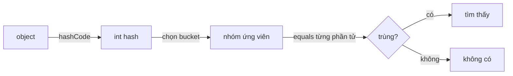
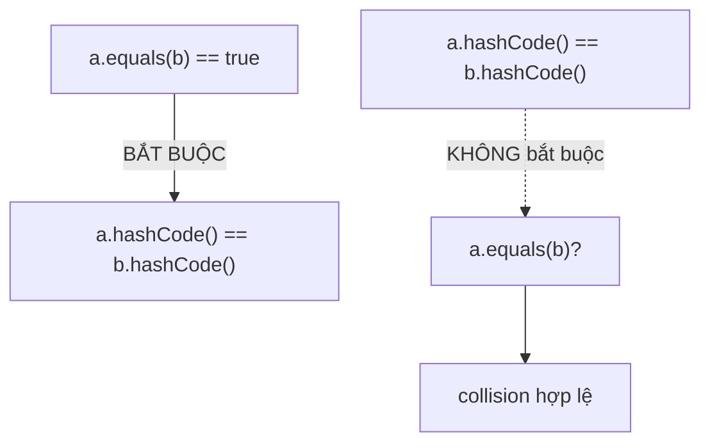

`equals()` xác định hai object có tương đương về mặt logic hay không, còn `hashCode()` hỗ trợ phân phối object trong cấu trúc dựa trên hash. Hai method có vai trò khác nhau nhưng phải tuân thủ một hợp đồng chung.

## Mục lục

- [Tổng quan](#1-tổng-quan)
- [Hai method, hai vai trò khác nhau](#2-hai-method-hai-vai-trò-khác-nhau)
- [Mặc định trong Object — định danh, không phải giá trị](#3-mặc-định-trong-object--định-danh-không-phải-giá-trị)
- [Hợp đồng equals — 5 điều khoản](#4-hợp-đồng-equals--5-điều-khoản)
- [Hợp đồng hashCode — 3 điều khoản](#5-hợp-đồng-hashcode--3-điều-khoản)
- [HashMap dùng cặp method này như thế nào](#6-hashmap-dùng-cặp-method-này-như-thế-nào)
- [Viết equals đúng — bộ khung chuẩn](#7-viết-equals-đúng--bộ-khung-chuẩn)
- [Viết hashCode đúng — Objects.hash & lazy cache](#8-viết-hashcode-đúng--objectshash--lazy-cache)
- [Kế thừa phá vỡ đối xứng — instanceof vs getClass](#9-kế-thừa-phá-vỡ-đối-xứng--instanceof-vs-getclass)
- [Mutable Key Trap — đổi field sau khi put](#10-mutable-key-trap--đổi-field-sau-khi-put)
- [record — compiler tự sinh đúng contract](#11-record--compiler-tự-sinh-đúng-contract)
- [Anti-patterns cần tránh](#12-anti-patterns-cần-tránh)
- [Tóm tắt — Cheat sheet & nguyên tắc](#13-tóm-tắt--cheat-sheet--nguyên-tắc)

---

## 1. Tổng quan

Nếu hai object bằng nhau theo `equals()`, chúng bắt buộc có cùng hash code. Chiều ngược lại không bắt buộc vì collision là hợp lệ. Các collection như `HashMap` và `HashSet` dùng hash để chọn bucket rồi dùng `equals()` để xác định phần tử.

Vi phạm hợp đồng hoặc thay đổi field tham gia equality sau khi insert có thể khiến object không còn được tìm thấy. Vì vậy equality nên phản ánh identity ổn định của domain object.

## 2. Hai method, hai vai trò khác nhau

`Object` định nghĩa cả hai. Chúng phối hợp để trả lời hai câu hỏi **khác nhau**:

| Method | Trả về | Câu hỏi nó trả lời |
|--------|--------|--------------------|
| `hashCode()` | `int` | "Object này thuộc **nhóm/bucket nào**?" (định vị thô, nhanh) |
| `equals(Object)` | `boolean` | "Hai object này có **bằng nhau về giá trị** không?" (so khớp chính xác) |



Ý tưởng cốt lõi: `hashCode` **lọc thô** O(1) để thu hẹp từ hàng triệu object xuống vài ứng viên trong một bucket; `equals` **lọc tinh** để chọn đúng object trong số ứng viên đó. Nếu bước lọc thô sai (hashCode không khớp), bước lọc tinh **không bao giờ được chạy** với đúng nhóm.

> [!NOTE]
> Đây là lý do contract bắt buộc: nếu `a.equals(b)` thì `a` và `b` **phải** cùng bucket, tức `a.hashCode() == b.hashCode()`. Ngược lại không bắt buộc — hai object khác nhau vẫn có thể trùng hashCode (đó là **collision**, hợp lệ).

---

## 3. Mặc định trong Object — định danh, không phải giá trị

Khi bạn không override, bạn nhận hành vi mặc định của `Object`:

```java
public boolean equals(Object obj) {
    return (this == obj);          // so sánh REFERENCE (cùng object trên heap?)
}

public native int hashCode();      // dựa trên định danh (identity hash)
```

`Object.hashCode()` là **identity hash code** — một số gần như ngẫu nhiên gắn với từng object, được tính lần đầu và cache trong **object header** (mark word). Nó **không** phải địa chỉ bộ nhớ trực tiếp (GC có thể di chuyển object, nhưng identity hash phải ổn định), mà thường được sinh bằng thuật toán cấu hình qua `-XX:hashCode=N` của HotSpot (mặc định là một bộ sinh số giả ngẫu nhiên Marsaglia).

```java
Object a = new Object();
Object b = new Object();
a.equals(b);          // false — khác object
a.equals(a);          // true  — cùng object
System.out.println(System.identityHashCode(a)); // vd 1349393271
```

> [!WARNING]
> Mặc định này đúng cho **value-less object** (như `Object`, lock dummy). Nhưng với **value object** (key trong map, phần tử trong set, DTO so sánh bằng nội dung) thì mặc định này **sai** — hai object "giống nhau về dữ liệu" lại bị coi là khác nhau. Bạn buộc phải override cả hai.

---

## 4. Hợp đồng equals — 5 điều khoản

`equals` không phải "muốn so sao thì so". Javadoc của `Object` ràng buộc **5 tính chất toán học** (quan hệ tương đương):

| # | Tính chất | Phát biểu | Vi phạm điển hình |
|---|-----------|-----------|-------------------|
| 1 | **Reflexive** (phản xạ) | `x.equals(x)` luôn `true` | Hiếm gặp |
| 2 | **Symmetric** (đối xứng) | `x.equals(y)` ⇔ `y.equals(x)` | So với class khác kiểu (String vs CaseInsensitiveString) |
| 3 | **Transitive** (bắc cầu) | `x.equals(y)` ∧ `y.equals(z)` ⇒ `x.equals(z)` | Thêm field ở subclass (mục 9) |
| 4 | **Consistent** (nhất quán) | Gọi nhiều lần cho cùng kết quả nếu dữ liệu không đổi | So sánh dựa trên field **mutable** đổi giữa chừng |
| 5 | **Non-null** | `x.equals(null)` luôn `false` | Quên check null → NPE |

Ví dụ vi phạm **đối xứng** kinh điển:

```java
class CaseInsensitiveString {
    private final String s;
    @Override public boolean equals(Object o) {
        if (o instanceof CaseInsensitiveString c) return s.equalsIgnoreCase(c.s);
        if (o instanceof String str) return s.equalsIgnoreCase(str);  // 😱 cố "thân thiện"
        return false;
    }
}

var cis = new CaseInsensitiveString("Hello");
String  str = "hello";
cis.equals(str);   // true
str.equals(cis);   // false  ← String.equals không biết gì về CaseInsensitiveString
```

Hậu quả: cho `cis` vào `List`, gọi `list.contains(str)` cho kết quả **khác nhau tùy thứ tự duyệt** — bug không xác định.

> [!TIP]
> Quy tắc an toàn: `equals` chỉ nên trả `true` cho object **cùng kiểu**. Đừng bao giờ "thông minh" so sánh chéo kiểu khác.

---

## 5. Hợp đồng hashCode — 3 điều khoản

| # | Điều khoản | Hậu quả nếu vi phạm |
|---|-----------|---------------------|
| 1 | `a.equals(b)` ⇒ `a.hashCode() == b.hashCode()` | **Entry biến mất** trong HashMap/HashSet (mục 1) |
| 2 | `hashCode()` nhất quán trong một lần chạy (nếu field tham gia không đổi) | Object "biến mất" giữa chừng (mục 10) |
| 3 | `!a.equals(b)` **không** bắt buộc hashCode khác — được phép trùng (collision) | Không bug, chỉ chậm nếu quá nhiều |

Điều khoản 1 là **một chiều**: `equals` ⇒ `hashCode` bằng. Chiều ngược lại không bắt buộc. Đây là lý do `return 42` (hằng số) vẫn **đúng logic** nhưng biến HashMap thành O(n) — xem chi tiết trong [HashMap Deep Dive](/collections/hashmap-deep-dive/).



---

## 6. HashMap dùng cặp method này như thế nào

Đọc source `HashMap.getNode()` (JDK 17, rút gọn) để thấy **thứ tự** gọi:

```java
final Node<K,V> getNode(Object key) {
    Node<K,V>[] tab; Node<K,V> first, e; int n; K k;
    int hash = hash(key);                          // ① gọi key.hashCode() + trộn bit
    if ((tab = table) != null && (n = tab.length) > 0 &&
        (first = tab[(n - 1) & hash]) != null) {   // ② & (n-1): chọn bucket
        if (first.hash == hash &&                  // ③ so SÁNH HASH (int) trước
            ((k = first.key) == key || (key != null && key.equals(k)))) // ④ rồi equals
            return first;
        // ... duyệt chain/tree, lặp lại ③④
    }
    return null;
}
```

Bốn bước, theo đúng thứ tự:

1. `hash(key)` gọi `key.hashCode()` rồi **trộn bit cao xuống thấp** (`h ^ h>>>16`).
2. `(n - 1) & hash` chọn bucket. **Nếu hashCode sai → sai bucket ngay từ đây** → không bao giờ tìm thấy.
3. So `first.hash == hash` — so sánh **int**, cực rẻ, loại nhanh phần lớn ứng viên.
4. Chỉ khi hash trùng mới gọi `equals` — đắt hơn (so chuỗi, so nhiều field).

> [!IMPORTANT]
> `equals` chỉ được gọi **sau khi** hash trùng. Nếu hai key `equals` nhau nhưng hashCode khác (bug mục 1), bước ③ đã loại chúng ở bucket khác — `equals` **không bao giờ được gọi với đúng ứng viên**. Đó là lý do entry "biến mất" dù logic `equals` hoàn hảo.

Tối ưu này (so hash int trước) cũng là lý do **`hashCode` nên rẻ**: nó được gọi cho mọi thao tác get/put/contains.

---

## 7. Viết equals đúng — bộ khung chuẩn

Khung 5 bước của Joshua Bloch (Effective Java):

```java
@Override
public boolean equals(Object o) {
    if (this == o) return true;                 // 1. shortcut reference (rất nhanh)
    if (!(o instanceof CartKey k)) return false;// 2. null + kiểu (instanceof null = false)
    return userId == k.userId                   // 3. so field nguyên thủy bằng ==
        && region.equals(k.region);             // 4. field object bằng equals (lưu ý null)
}
```

Lưu ý kỹ thuật:

- `instanceof` đã xử lý luôn `null` (`null instanceof X` luôn `false`) → không cần check `o == null` riêng.
- Pattern variable `k` (Java 16+) gộp `instanceof` + cast.
- Field `float`/`double` phải dùng `Float.compare`/`Double.compare` (vì `NaN != NaN`, `0.0 != -0.0`).
- Field array phải dùng `Arrays.equals`, không phải `==`.
- So **field rẻ và hay khác nhau trước** (vd `int id`) để short-circuit sớm, để `String`/collection đắt ở cuối.

> [!WARNING]
> Tham số phải là `Object`, không phải `CartKey`. Nếu viết `public boolean equals(CartKey o)` bạn đã tạo **overload** chứ không **override** — `Object.equals` mặc định vẫn được gọi từ HashMap, và bug quay lại. Luôn dán `@Override` để compiler bắt lỗi này.

---

## 8. Viết hashCode đúng — Objects.hash & lazy cache

Cách đơn giản và đúng nhất:

```java
@Override
public int hashCode() {
    return Objects.hash(userId, region);   // dùng ĐÚNG các field như trong equals
}
```

`Objects.hash` thực chất gọi `Arrays.hashCode` với công thức tích lũy hệ số 31:

```java
int result = 1;
for (Object e : elements)
    result = 31 * result + (e == null ? 0 : e.hashCode());
```

Vì sao hệ số **31**? Nó lẻ và nguyên tố (giảm collision), và `31 * i == (i << 5) - i` → JIT tối ưu thành shift + trừ, rất rẻ.

> [!CAUTION]
> `Objects.hash(...)` tạo một **mảng tạm** (varargs) và **autobox** mỗi nguyên thủy mỗi lần gọi. Trên hot path (key được hash hàng triệu lần) hãy viết tay không boxing:
> ```java
> @Override public int hashCode() {
>     int h = Long.hashCode(userId);
>     return 31 * h + region.hashCode();
> }
> ```

Với key **immutable** mà `hashCode` đắt (vd dựa trên `String` dài), có thể **cache lazy** như `String` làm:

```java
private int hash;          // 0 = chưa tính (mặc định int)
@Override public int hashCode() {
    int h = hash;
    if (h == 0) h = hash = 31 * Long.hashCode(userId) + region.hashCode();
    return h;
}
```

Chỉ làm được điều này khi key **bất biến** — nếu field đổi, cache sai.

---

## 9. Kế thừa phá vỡ đối xứng — instanceof vs getClass

Đây là cái bẫy tinh vi nhất. Thêm field ở subclass khiến **không thể** vừa giữ đối xứng vừa giữ bắc cầu nếu dùng `instanceof`:

```java
class Point {
    final int x, y;
    @Override public boolean equals(Object o) {
        if (!(o instanceof Point p)) return false;
        return x == p.x && y == p.y;
    }
}
class ColorPoint extends Point {
    final Color color;
    @Override public boolean equals(Object o) {
        if (!(o instanceof ColorPoint cp)) return false;
        return super.equals(o) && color == cp.color;
    }
}

Point p = new Point(1, 2);
ColorPoint cp = new ColorPoint(1, 2, RED);
p.equals(cp);   // true  (Point.equals thấy cp là Point, x,y khớp)
cp.equals(p);   // false (ColorPoint.equals thấy p không phải ColorPoint)
```

→ **Vi phạm đối xứng.** Sửa bằng cách "nới lỏng" cho `ColorPoint` so như `Point` lại phá **bắc cầu** (hai ColorPoint khác màu cùng bằng một Point).

Hai lối thoát:

| Cách | Ưu | Nhược |
|------|-----|-------|
| `getClass() != o.getClass()` thay `instanceof` | Giữ đối xứng + bắc cầu nghiêm ngặt | Phá **nguyên lý Liskov** — proxy/subclass do framework sinh (Hibernate, mock) không bao giờ `equals` |
| **Composition thay kế thừa** (Effective Java) | Không có nghịch lý | Phải viết thêm getter ủy quyền |

> [!IMPORTANT]
> Không có cách nào mở rộng một class **instantiable** mà thêm field tham gia `equals` mà vẫn giữ trọn contract. Đây chính là lý do **`record` không cho kế thừa** (final ngầm) và vì sao value class nên là `final`. Nếu cần "thêm thuộc tính", hãy **chứa** (`has-a`) thay vì **kế thừa** (`is-a`).

---

## 10. Mutable Key Trap — đổi field sau khi put

`hashCode` được tính **một lần lúc put** và cache trong `Node.hash`. Nếu sau đó bạn đổi field tham gia hashCode, key rơi vào "bucket cũ" nhưng tính ra "bucket mới" → mất:

```java
class MutableKey {
    int id;
    @Override public int hashCode() { return id; }
    @Override public boolean equals(Object o) {
        return o instanceof MutableKey k && k.id == id;
    }
}

var map = new HashMap<MutableKey, String>();
var key = new MutableKey(); key.id = 1;
map.put(key, "value");      // hash=1 → bucket 1, Node.hash cache = 1

key.id = 2;                 // 😱 đổi field tham gia hashCode

map.get(key);               // hash giờ = 2 → tìm ở bucket 2 → null
map.containsKey(key);       // false
map.size();                 // 1  ← entry vẫn còn ở bucket 1, "rò rỉ"
```

```
Lúc put:   bucket[1] -> (Node.hash=1, key, "value")
Sau đổi:   get(key) tính hash=2 -> nhìn bucket[2] -> trống -> null
           entry vẫn kẹt ở bucket[1], không ai với tới được
```

> [!IMPORTANT]
> **Key của map/phần tử của set phải IMMUTABLE** ở mọi field tham gia `equals`/`hashCode`. Dùng `record`, `final` field, không setter. Đây cũng là lý do **không** dùng `List`/`Set` mutable hay entity JPA (có setter) làm key.

---

## 11. record — compiler tự sinh đúng contract

Từ Java 16, `record` sinh `equals`, `hashCode`, `toString` **đúng contract** dựa trên toàn bộ component, miễn phí:

```java
public record CartKey(long userId, String region) {}
```

Compiler sinh ngầm (đại ý):

```java
public boolean equals(Object o) {
    if (!(o instanceof CartKey other)) return false;
    return this.userId == other.userId && Objects.equals(this.region, other.region);
}
public int hashCode() { /* tổ hợp tất cả component */ }
```

Thực ra JDK dùng `invokedynamic` bootstrap tới `ObjectMethods.bootstrap` để sinh các method này tại runtime — xem [Records & Sealed Deep Dive](/modern-java/records-sealed/) để mổ bytecode.

So sánh nhanh các lựa chọn:

| Cách | equals/hashCode đúng | Boilerplate | Mutable? |
|------|----------------------|-------------|----------|
| Tự viết tay | Dễ sai (quên field, quên @Override) | Nhiều | Tùy |
| IDE generate | Đúng nhưng phải nhớ **re-generate** khi thêm field | Nhiều dòng | Tùy |
| Lombok `@EqualsAndHashCode` | Đúng, tự cập nhật field | Ẩn | Tùy (cẩn thận `callSuper`) |
| **`record`** | Đúng, tự gồm mọi component | **Không** | **Immutable** (đúng cho key) |

> [!TIP]
> Cho **key của map / phần tử set / DTO so theo giá trị** → mặc định chọn `record`. Nó vừa đúng contract, vừa immutable (an toàn mục 10), vừa không boilerplate. Chỉ tự viết tay khi cần loại trừ field khỏi so sánh (vd bỏ qua field cache).

---

## 12. Anti-patterns cần tránh

| Anti-pattern | Vì sao sai | Thay bằng |
|--------------|-----------|-----------|
| Override `equals`, quên `hashCode` | Entry biến mất khỏi HashMap/HashSet | Override **cả hai**, hoặc dùng `record` |
| `equals(MyType o)` thiếu `@Override` | Là **overload** chứ không override → Object.equals vẫn chạy | Tham số `Object` + `@Override` |
| Dùng field **mutable** trong hashCode | Đổi field → key "biến mất" | Field immutable / `record` |
| `hashCode` dùng ít field hơn `equals` | Hợp lệ nhưng nhiều collision → chậm | Dùng **đúng các field** như equals |
| `hashCode` dùng **nhiều** field hơn equals | **Phá contract** — equals true mà hash khác | hashCode ⊆ field của equals |
| So chéo kiểu trong equals (String vs wrapper) | Phá đối xứng | Chỉ so cùng kiểu |
| Kế thừa + thêm field vào equals | Phá đối xứng/bắc cầu | Composition, hoặc `final`/`record` |
| `equals` dùng `==` cho field `double`/array | `NaN`, `-0.0`, array so reference | `Double.compare`, `Arrays.equals` |

---

## 13. Tóm tắt — Cheat sheet & nguyên tắc

**Cỗ máy trong 5 dòng:**

```
1. equals → so GIÁ TRỊ; hashCode → chọn BUCKET (lọc thô O(1))
2. a.equals(b) ⇒ a.hashCode()==b.hashCode()   (một chiều, BẮT BUỘC)
3. HashMap: hash → bucket → so hash(int) → rồi mới equals
4. Field tham gia equals/hashCode phải IMMUTABLE
5. equals dùng field nào thì hashCode dùng ĐÚNG field đó
```

**Khung equals chuẩn:** `this==o` → `instanceof` → so từng field (primitive `==`, object `equals`, double `compare`, array `Arrays.equals`).

**Khung hashCode chuẩn:** `Objects.hash(...)` (tiện) hoặc `31*h + field.hashCode()` (hot path, không boxing); cache lazy nếu immutable + đắt.

**5 nguyên tắc khắc cốt:**

1. **Luôn override cặp đôi** — `equals` không bao giờ đi một mình.
2. **Ưu tiên `record`** cho value object / key — đúng contract + immutable, miễn phí.
3. **Key immutable** — đổi field sau khi put = entry rò rỉ không tìm lại được.
4. **`hashCode` rẻ và phân tán đều** — nó chạy trên mọi get/put.
5. **`final` cho value class** — tránh nghịch lý kế thừa phá đối xứng.

> [!TIP]
> Một câu để nhớ: *`equals` nói "đây đúng là object tôi cần", `hashCode` nói "tìm nó ở ngăn này".* Sai một trong hai, HashMap vẫn chạy mà không báo lỗi — nó chỉ lặng lẽ trả về `null`.
