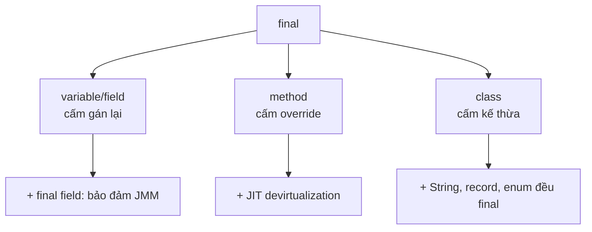

Từ khóa `final` biểu đạt các ràng buộc khác nhau tùy vị trí sử dụng: biến chỉ được gán một lần, method không thể override và class không thể được kế thừa. Nó không đồng nghĩa với object bất biến.

## Mục lục

- [Tổng quan](#1-tổng-quan)
- [Ba cấp độ của final](#2-ba-cấp-độ-của-final)
- [final variable & effectively final](#3-final-variable--effectively-final)
- [final ≠ immutable — sai lầm phổ biến nhất](#4-final--immutable--sai-lầm-phổ-biến-nhất)
- [final field & JMM — bảo đảm safe publication](#5-final-field--jmm--bảo-đảm-safe-publication)
- [final method — devirtualization & inlining](#6-final-method--devirtualization--inlining)
- [final class — đóng kín & tối ưu](#7-final-class--đóng-kín--tối-ưu)
- [final + JIT: constant folding](#8-final--jit-constant-folding)
- [final với lambda & inner class](#9-final-với-lambda--inner-class)
- [Anti-patterns cần tránh](#10-anti-patterns-cần-tránh)
- [Tóm tắt — Cheat sheet & nguyên tắc](#11-tóm-tắt--cheat-sheet--nguyên-tắc)

---

## 1. Tổng quan

Một reference `final` không thể trỏ sang object khác, nhưng trạng thái bên trong object vẫn có thể thay đổi. Với class và method, `final` kiểm soát khả năng mở rộng; với field, nó còn có semantics đặc biệt về publication sau constructor.

Hiểu từng phạm vi giúp dùng `final` để thể hiện ý định thiết kế mà không gán cho nó những bảo đảm mà ngôn ngữ không cung cấp.

## 2. Ba cấp độ của final

`final` áp lên ba thứ khác nhau, ý nghĩa khác nhau:

| Áp lên | Ý nghĩa | Tác động sâu |
|--------|---------|--------------|
| **variable / field / param** | Gán **đúng một lần**, không reassign | final field → JMM safe publication |
| **method** | Không cho **override** | JIT devirtualize + inline dễ hơn |
| **class** | Không cho **kế thừa** | Đóng kín type, tối ưu, an toàn invariant |



---

## 3. final variable & effectively final

`final` trên biến nghĩa là **gán đúng một lần**. Có ba dạng:

```java
final int x = 10;              // local final — gán lúc khai báo
final int y;                   // blank final — gán sau, đúng 1 lần
if (cond) y = 1; else y = 2;   // OK: mọi nhánh gán đúng 1 lần
// y = 3;                      // ✗ compile error

void f(final String name) {    // param final — không reassign trong method
    // name = "x";             // ✗
}
```

**Blank final field** phải được gán trong **mọi constructor** (hoặc initializer) — compiler kiểm tra "definite assignment".

**Effectively final** (Java 8+): một biến *không* khai `final` nhưng *không bao giờ bị gán lại* sau khởi tạo được coi là "effectively final". Lambda và anonymous class chỉ **bắt** được biến cục bộ final hoặc effectively final:

```java
int count = 0;                 // effectively final (không gán lại)
Runnable r = () -> System.out.println(count);  // OK

int n = 0;
Runnable bad = () -> System.out.println(n);
n = 5;                         // 😱 giờ n KHÔNG còn effectively final → lambda trên báo lỗi
```

> [!NOTE]
> Lý do hạn chế này: lambda/inner class **copy giá trị** của biến cục bộ (vì stack của method gốc có thể đã biến mất khi lambda chạy). Nếu cho phép đổi biến, hai bên sẽ thấy giá trị khác nhau → nhập nhằng. Java chọn cấm để tránh nhầm lẫn (khác với "closure thật" trong JS).

---

## 4. final ≠ immutable — sai lầm phổ biến nhất

`final` ngăn **gán lại reference**, **không** ngăn **sửa nội dung** object:

```java
final List<String> list = new ArrayList<>();
list.add("a");          // ✅ OK — sửa nội dung, không gán lại reference
list.add("b");          // ✅ OK
// list = new ArrayList<>();  // ✗ — gán lại reference bị cấm

final int[] arr = {1, 2, 3};
arr[0] = 99;            // ✅ OK — sửa phần tử
```

```
final List<String> list
         │
         ▼ reference KHÓA (không trỏ chỗ khác)
   ┌───────────────┐
   │ ArrayList     │  ← nội dung VẪN sửa được (add/remove/set)
   │ ["a","b"]     │
   └───────────────┘
```

| | `final` | immutable |
|---|---------|-----------|
| Khóa | reference (không trỏ chỗ khác) | nội dung object |
| `final List` | không gán lại được, **vẫn add được** | — |
| Bất biến thật | cần `List.copyOf()` / `Collections.unmodifiableList` | + tất cả field final + không expose mutable |

> [!WARNING]
> `final` chỉ là **một** điều kiện cần để bất biến, không phải đủ. Một object thật sự immutable cần: (1) class `final`, (2) mọi field `private final`, (3) không setter, (4) **copy phòng thủ** mọi mutable field khi nhận vào và trả ra. `record` lo phần lớn việc này (nhưng vẫn cần copy phòng thủ nếu component là collection mutable).

---

## 5. final field & JMM — bảo đảm safe publication

Đây là tầng sâu nhất và ít người biết. **Java Memory Model (JSR-133)** cho `final` field một bảo đảm đặc biệt:

> Khi constructor kết thúc **bình thường**, mọi thread đọc object qua một reference đã được publish sẽ thấy **giá trị đúng** của các **final field** — **không cần** đồng bộ hóa.

Cơ chế: compiler chèn một **freeze (memory barrier)** ở cuối constructor, **trước** khi reference object thoát ra. Barrier này ngăn việc ghi final field bị **sắp xếp xuống sau** việc publish reference:

```
KHÔNG final:                          CÓ final field:
  ghi timeout = 30  ─┐                 ghi timeout = 30
  publish ref       ─┘ có thể đảo →    [freeze barrier]   ← chặn đảo
  thread B đọc 0 (chưa ghi)            publish ref
                                       thread B luôn thấy 30
```

```java
class SafeHolder {
    final int[] data;
    SafeHolder() { data = new int[]{1, 2, 3}; }  // freeze ở cuối ctor
}
// Publish qua field thường (không volatile) vẫn an toàn ĐỌC final field:
sharedHolder = new SafeHolder();   // thread khác đọc data luôn thấy {1,2,3}
```

> [!IMPORTANT]
> Đây là lý do **String** (final field `value`), **các immutable class** trong JDK an toàn chia sẻ giữa thread mà không cần lock. Bảo đảm này **chỉ áp dụng cho final field** và **chỉ khi** `this` không "thoát" khỏi constructor sớm. Nếu bạn rò `this` ra ngoài giữa constructor (đăng ký listener, gán vào static...), bảo đảm mất hiệu lực.

Giới hạn quan trọng:

- Bảo đảm áp cho **chính final field**. Nếu final field trỏ tới object **mutable**, các thay đổi nội dung **sau** constructor **không** được bảo đảm hiển thị.
- Không được để `this` escape trong constructor (vd `Registry.register(this)` giữa ctor) — khi đó thread khác thấy `this` trước freeze.

---

## 6. final method — devirtualization & inlining

Hầu hết lời gọi method trong Java là **virtual** (đa hình): JVM phải tra **vtable** lúc runtime để biết gọi bản override nào. `final` method (và method của `final` class, hay `private`/`static`) **không thể bị override** → JIT biết chắc đích đến:

```java
class Calc {
    final int square(int x) { return x * x; }  // không thể override
}
```

JIT có thể:

- **Devirtualization**: thay lời gọi virtual bằng lời gọi trực tiếp (bỏ tra vtable).
- **Inlining**: chép thẳng thân method vào chỗ gọi → loại chi phí call frame, mở đường cho tối ưu khác (constant folding, loop optimization).

> [!NOTE]
> Trên thực tế, JIT của HotSpot **rất giỏi** tự devirtualize cả method *không* `final` nhờ **Class Hierarchy Analysis** (CHA): nếu lúc runtime chỉ có một class implement, nó vẫn inline (và "deoptimize" nếu sau này có class mới load). Vì vậy đừng thêm `final` chỉ để "tối ưu tốc độ" — lợi ích thường không đáng kể. Dùng `final` method vì **lý do thiết kế** (cấm override để giữ invariant), không phải micro-optimization.

---

## 7. final class — đóng kín & tối ưu

`final class` cấm kế thừa hoàn toàn:

```java
public final class Money { ... }    // không ai extends được
// class Foo extends Money {}       // ✗ compile error
```

Lý do dùng:

| Lý do | Giải thích |
|-------|-----------|
| **An toàn bất biến** | Subclass không thể phá invariant (vd thêm field mutable, ghi đè method) |
| **Bảo mật** | Không thể tạo subclass độc hại override hành vi nhạy cảm |
| **equals/hashCode đúng** | Tránh nghịch lý đối xứng khi subclass thêm field (xem [equals & hashCode](/fundamentals/equals-hashcode/)) |
| **Tối ưu** | JIT devirtualize mọi method của class |

Trong JDK, rất nhiều class quan trọng là `final`: **`String`, `Integer` và mọi wrapper, `LocalDate`, `record` (final ngầm), enum constant**. Sự bất biến + final của `String` là nền tảng cho String pool và an toàn đa luồng.

> [!TIP]
> Nếu muốn "đóng kín có kiểm soát" — cho phép một tập hợp subclass **cố định, biết trước** — dùng **`sealed`** (Java 17) thay vì `final`. `sealed` + `permits` cho phép kế thừa giới hạn và bật **exhaustive switch**. Xem [Records & Sealed](/modern-java/records-sealed/).

---

## 8. final + JIT: constant folding

`static final` của kiểu nguyên thủy/`String` được gán bằng **compile-time constant** trở thành **hằng số biên dịch** — giá trị được **inline thẳng** vào bytecode tại nơi dùng (constant folding):

```java
class Const {
    static final int MAX = 100;        // compile-time constant
    static final int LIMIT = MAX * 2;  // = 200, tính lúc biên dịch
}

int x = Const.MAX;   // bytecode KHÔNG đọc field, mà bipush/ldc thẳng 100
```

Hệ quả thực tế (và cái bẫy của nó):

```java
// File A:  public static final int VERSION = 1;
// File B:  if (A.VERSION == 1) {...}   ← compiler inline số 1 vào B.class
// Sửa A.VERSION = 2, recompile MÌNH A, KHÔNG recompile B
// → B vẫn chạy với "1" cũ đã inline!  (constant folding stale)
```

> [!CAUTION]
> Nếu `static final` là hằng số biên dịch, các class **khác** đã **nướng cứng giá trị cũ** vào bytecode. Đổi hằng số mà chỉ recompile file chứa nó → các file dùng nó vẫn giữ giá trị cũ tới khi **recompile lại toàn bộ**. Đây là lý do hằng số public API cần build sạch khi đổi. Để tránh, dùng method/`enum` nếu giá trị có thể đổi.

`static final` mà **không** phải compile-time constant (vd `static final int N = computeAtRuntime();`) thì không bị inline — nó vẫn là một lần đọc field thật.

---

## 9. final với lambda & inner class

Như mục 3, lambda/anonymous class chỉ bắt được biến cục bộ **final hoặc effectively final**:

```java
List<Runnable> tasks = new ArrayList<>();
for (int i = 0; i < 3; i++) {
    int captured = i;                 // tạo biến mới mỗi vòng (effectively final)
    tasks.add(() -> System.out.println(captured));   // bắt captured riêng từng vòng
}
// in 0, 1, 2 ✓

// Cái bẫy: bắt thẳng biến vòng lặp đổi giá trị (không compile được trong Java, nhưng là lỗi kinh điển ở JS)
```

Lý do và cơ chế "copy giá trị" đã giải thích ở mục 3. Field của object thì **không** chịu hạn chế này (lambda bắt được `this` rồi truy cập field) — chỉ biến **cục bộ** mới cần effectively final.

> [!TIP]
> Khi cần "biến đếm có thể đổi" trong lambda, dùng một object holder (`AtomicInteger`, mảng 1 phần tử `int[] c = {0}`) — bạn bắt **reference** (effectively final) rồi sửa **nội dung**. Nhưng với code đa luồng phải dùng `AtomicInteger`/`LongAdder` để an toàn.

---

## 10. Anti-patterns cần tránh

| Anti-pattern | Vì sao sai | Thay bằng |
|--------------|-----------|-----------|
| Tưởng `final List` là immutable | final chỉ khóa reference, vẫn add được | `List.copyOf()` / unmodifiable |
| Thêm `final` method khắp nơi "cho nhanh" | JIT đã tự devirtualize; lợi ích ~0, giảm linh hoạt | Dùng final vì thiết kế, không vì tốc độ |
| Đổi `public static final` constant rồi chỉ recompile 1 file | Constant folding → file khác giữ giá trị cũ | Recompile toàn bộ; hoặc dùng method/enum |
| Dựa vào final field cho visibility nhưng rò `this` trong ctor | Bảo đảm JMM mất hiệu lực | Không để `this` escape khỏi constructor |
| final field trỏ mutable object rồi sửa sau ctor, kỳ vọng thread thấy | JMM chỉ bảo đảm chính final field | Object immutable / volatile / đồng bộ |
| Gán lại biến muốn dùng trong lambda | Mất effectively final → compile error | Tạo biến copy cục bộ mỗi lần |

---

## 11. Tóm tắt — Cheat sheet & nguyên tắc

**Cỗ máy trong 6 dòng:**

```
1. final variable → gán đúng 1 lần (KHÓA reference, KHÔNG khóa nội dung)
2. final ≠ immutable: final List vẫn add được
3. final FIELD → JMM bảo đảm safe publication (thread khác thấy giá trị đúng, không cần lock)
4. final method → cấm override → JIT devirtualize/inline dễ
5. final class → cấm kế thừa (String, wrapper, record, enum đều final)
6. static final compile-time constant → inline (cẩn thận stale khi đổi)
```

| Cấp | Khóa cái gì | Lợi ích sâu |
|-----|-------------|-------------|
| variable/field | reassign | final field = safe publication (JMM) |
| method | override | devirtualization, inlining |
| class | kế thừa | đóng kín invariant, tối ưu |

**5 nguyên tắc khắc cốt:**

1. **`final` khóa reference, KHÔNG khóa nội dung** — `final List` vẫn add được.
2. **final field = quà từ JMM** — chia sẻ object bất biến giữa thread không cần lock.
3. **Đừng để `this` escape trong constructor** — phá bảo đảm final field.
4. **final cho thiết kế, không cho micro-optimization** — JIT đã tự devirtualize.
5. **Cẩn thận constant folding** — đổi `public static final` cần build sạch.

> [!TIP]
> Một câu để nhớ: *`final` trên biến nói "đừng trỏ chỗ khác"; `final` trên field còn thì thầm với mọi thread "giá trị này đã sẵn sàng".* Tầng đầu là cú pháp; tầng sau là hợp đồng với Memory Model — và đó mới là phần làm nên sự khác biệt khi code đa luồng.
