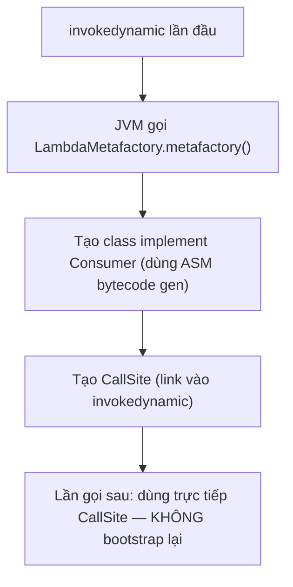

## Mục lục

- [Bối cảnh: Anonymous class tạo hàng nghìn .class file — lambda giải quyết thế nào](#1-bối-cảnh-anonymous-class-tạo-hàng-nghìn-class-file--lambda-giải-quyết-thế-nào)
- [Functional Interface — hợp đồng 1 abstract method](#2-functional-interface--hợp-đồng-1-abstract-method)
- [4 gia đình built-in — Function, Consumer, Supplier, Predicate](#3-4-gia-đình-built-in--function-consumer-supplier-predicate)
- [Lambda Bytecode — invokedynamic & LambdaMetafactory](#4-lambda-bytecode--invokedynamic--lambdametafactory)
- [Method Reference — 4 loại](#5-method-reference--4-loại)
- [Effectively Final & Closure](#6-effectively-final--closure)
- [Type Inference — compiler suy luận type](#7-type-inference--compiler-suy-luận-type)
- [Comparator Composition — functional style](#8-comparator-composition--functional-style)
- [Advanced Patterns — currying, memoization, decorator](#9-advanced-patterns--currying-memoization-decorator)
- [Anti-patterns & Tóm tắt](#10-anti-patterns--tóm-tắt)

---

## 1. Bối cảnh: Anonymous class tạo hàng nghìn .class file — lambda giải quyết thế nào

Trước Java 8, mỗi callback là anonymous class:

```java
button.addActionListener(new ActionListener() {
    @Override
    public void actionPerformed(ActionEvent e) {
        System.out.println("Clicked");
    }
});
```

Mỗi anonymous class tạo **1 file .class** riêng (`ClassName$1.class`, `ClassName$2.class`...). Ứng dụng lớn có hàng nghìn listener/callback → hàng nghìn .class file → **slow startup** (class loading) + **bloat JAR**.

Java 8 lambda:

```java
button.addActionListener(e -> System.out.println("Clicked"));
```

Ngắn gọn hơn, nhưng quan trọng hơn: **không tạo .class file**. Lambda dùng `invokedynamic` — JVM tạo implementation tại **runtime** bằng `LambdaMetafactory`, tránh class file bloat.

> [!IMPORTANT]
> Lambda không chỉ là "anonymous class rút gọn" — nó có **cơ chế bytecode hoàn toàn khác** (`invokedynamic` thay vì `new ClassName$1()`). Hiểu sự khác biệt giúp optimize performance và tránh pitfall.

---

## 2. Functional Interface — hợp đồng 1 abstract method

**Functional Interface** = interface có **đúng 1 abstract method** (SAM — Single Abstract Method).

```java
@FunctionalInterface
public interface Converter<F, T> {
    T convert(F from);       // 1 abstract method → functional interface

    // Cho phép:
    default T convertOrNull(F from) { ... }   // default method — không abstract
    static void helper() { ... }               // static method — không abstract
    // String toString();                       // override Object method — không đếm
}
```

### 2.1. @FunctionalInterface

`@FunctionalInterface` là **optional** nhưng khuyên dùng — compiler sẽ báo lỗi nếu interface có > 1 abstract method:

```java
@FunctionalInterface
interface BadInterface {
    void method1();
    void method2();    // COMPILE ERROR: multiple non-overriding abstract methods
}
```

Không có `@FunctionalInterface`, interface vẫn là functional nếu chỉ có 1 SAM — annotation chỉ để **compiler enforce** + **documentation**.

> [!NOTE]
> Nhiều interface trong JDK **trước** Java 8 đã là functional interface (dù không annotated): `Runnable`, `Callable`, `Comparator`, `ActionListener`. Sau Java 8, chúng được annotated `@FunctionalInterface` retroactively.

---

## 3. 4 gia đình built-in — Function, Consumer, Supplier, Predicate

| Interface | SAM | Input → Output | Ví dụ |
|----------|-----|----------------|-------|
| `Function<T,R>` | `R apply(T t)` | T → R | `Integer::parseInt` |
| `Consumer<T>` | `void accept(T t)` | T → void | `System.out::println` |
| `Supplier<T>` | `T get()` | () → T | `LocalDate::now` |
| `Predicate<T>` | `boolean test(T t)` | T → boolean | `String::isEmpty` |

### 3.1. Biến thể (variants)

| Base | Bi-version | Primitive specialization |
|------|-----------|------------------------|
| `Function<T,R>` | `BiFunction<T,U,R>` | `IntFunction<R>`, `ToIntFunction<T>`, `IntToDoubleFunction` |
| `Consumer<T>` | `BiConsumer<T,U>` | `IntConsumer`, `LongConsumer`, `DoubleConsumer` |
| `Supplier<T>` | — | `IntSupplier`, `LongSupplier`, `DoubleSupplier` |
| `Predicate<T>` | `BiPredicate<T,U>` | `IntPredicate`, `LongPredicate`, `DoublePredicate` |

**Thêm:**

| Interface | SAM | Use case |
|----------|-----|----------|
| `UnaryOperator<T>` | `T apply(T t)` (extends Function<T,T>) | Transform cùng type |
| `BinaryOperator<T>` | `T apply(T a, T b)` (extends BiFunction<T,T,T>) | Reduce |

### 3.2. Composition methods

```java
// Function: andThen, compose
Function<String, Integer> parse = Integer::parseInt;
Function<Integer, String> format = i -> "Value: " + i;
Function<String, String> combined = parse.andThen(format);
// "42" → 42 → "Value: 42"

// Predicate: and, or, negate
Predicate<String> notEmpty = s -> !s.isEmpty();
Predicate<String> startsWith = s -> s.startsWith("A");
Predicate<String> valid = notEmpty.and(startsWith);  // both must be true

// Consumer: andThen
Consumer<String> log = System.out::println;
Consumer<String> save = repository::save;
Consumer<String> logAndSave = log.andThen(save);
```

> [!TIP]
> Dùng **primitive specialization** (`IntFunction`, `ToIntFunction`...) thay vì `Function<Integer, ...>` khi làm việc với primitives. Tránh autoboxing → giảm GC pressure đáng kể trong hot loop.

---

## 4. Lambda Bytecode — invokedynamic & LambdaMetafactory

### 4.1. Lambda ≠ anonymous class

| | Anonymous class | Lambda |
|--|----------------|--------|
| File .class | **Có** (`Outer$1.class`) | **Không** |
| Bytecode | `new Outer$1()` | `invokedynamic` |
| Instance | Mới mỗi lần | JVM có thể **reuse** (nếu non-capturing) |
| `this` | Reference tới anonymous class instance | Reference tới **enclosing class** |
| Capture | Copy hoặc reference outer `this` | Capture effectively final variables |

### 4.2. invokedynamic — bootstrap tại runtime

```java
list.forEach(s -> System.out.println(s));
```

Bytecode:

```
invokedynamic #0:accept:()Ljava/util/function/Consumer;
  BootstrapMethod: LambdaMetafactory.metafactory(
    Lookup, String, MethodType,      // caller info
    MethodType,                       // SAM method type
    MethodHandle,                     // implementation method
    MethodType                        // instantiated method type
  )
```

**Flow tại runtime (chỉ lần đầu):**



`LambdaMetafactory` tạo **lightweight class** tại runtime:
- **Non-capturing lambda** (không capture biến): tạo **singleton** instance → zero allocation
- **Capturing lambda**: tạo instance mới mỗi lần (nhưng class đã tạo sẵn)

### 4.3. LambdaMetafactory — chi tiết bên trong

**Bước 1: Bootstrap (chỉ chạy 1 lần per call-site)**

```java
// LambdaMetafactory.metafactory() simplified:
public static CallSite metafactory(
    MethodHandles.Lookup caller,       // context của caller
    String invokedName,                // tên SAM method ("accept", "apply"...)
    MethodType invokedType,            // () → Consumer (non-capturing) hoặc (captured) → Consumer
    MethodType samMethodType,          // void accept(Object)
    MethodHandle implMethod,           // handle tới lambda body (private static method)
    MethodType instantiatedMethodType  // void accept(String) — after type erasure
) {
    // 1. Generate bytecode cho implementation class (ASM)
    // 2. Define class via Unsafe.defineAnonymousClass (hidden class JDK 15+)
    // 3. Tạo ConstantCallSite → link vào invokedynamic instruction
    return new ConstantCallSite(/* factory method handle */);
}
```

**Bước 2: Generated class structure**

```
// Non-capturing lambda: s -> System.out.println(s)
// LambdaMetafactory generates:
final class EnclosingClass$$Lambda$1 implements Consumer<String> {
    private static final EnclosingClass$$Lambda$1 INSTANCE = new EnclosingClass$$Lambda$1();

    private EnclosingClass$$Lambda$1() {}

    @Override
    public void accept(String s) {
        EnclosingClass.lambda$main$0(s);  // gọi thẳng static method chứa lambda body
    }
}
// → SINGLETON! Zero allocation per invocation
```

```
// Capturing lambda: captured variable `prefix`
// Ví dụ: prefix -> s -> prefix + s (prefix captured)
final class EnclosingClass$$Lambda$2 implements Function<String, String> {
    private final String arg$1;  // captured variable

    private EnclosingClass$$Lambda$2(String arg$1) {
        this.arg$1 = arg$1;
    }

    @Override
    public String apply(String s) {
        return EnclosingClass.lambda$main$1(arg$1, s);
    }
}
// → NEW INSTANCE mỗi lần (vì arg$1 khác nhau)
```

**Bước 3: Lambda body — compiler tạo private static method**

```java
// Source:
list.forEach(s -> System.out.println(s.toUpperCase()));

// javac tạo trong cùng class:
private static void lambda$main$0(String s) {
    System.out.println(s.toUpperCase());
}
```

> [!NOTE]
> Lambda body nằm ngay trong class gốc (private static method) → JIT có thể **inline** trực tiếp, không cần virtual dispatch qua interface. Đây là lý do lambda thường **nhanh hơn** anonymous class.

### 4.4. Memory layout: Non-capturing vs Capturing

```
NON-CAPTURING (singleton — zero allocation):
┌─────────────────────────────────────┐
│ Lambda$$1 (SINGLETON in Metaspace)  │
│  └─ accept() → lambda$main$0        │
│     (no instance fields)            │
└─────────────────────────────────────┘
  Heap allocation: 0 bytes per call

CAPTURING (new instance per call):
┌─────────────────────────────────────┐
│ Lambda$$2 instance (Heap)           │
│  ├─ [Object Header]  12 bytes       │
│  └─ arg$1: String ref  4 bytes      │
│     Total: 16 bytes per call        │
└─────────────────────────────────────┘
```

### 4.5. Tại sao invokedynamic tốt hơn anonymous class?

| Tiêu chí | Anonymous class | Lambda (invokedynamic) |
|----------|----------------|----------------------|
| Startup | Load hàng nghìn .class file | Bootstrap lazy (chỉ khi dùng) |
| Memory | 1 class per anonymous → Metaspace | 1 class per lambda site, singleton possible |
| Optimization | Hard-coded `new Outer$1()` | JVM có thể inline, escape analysis |
| Forward compat | Frozen bytecode pattern | JVM có thể **thay đổi** strategy sau này |

> [!NOTE]
> `invokedynamic` là **indirection point** — JVM có thể thay đổi cách tạo lambda class trong tương lai mà **không** cần recompile code. Đây là lý do JDK team chọn invokedynamic thay vì hard-code strategy.

---

## 5. Method Reference — 4 loại

| Loại | Syntax | Tương đương Lambda |
|------|--------|-------------------|
| **Static** | `Integer::parseInt` | `s -> Integer.parseInt(s)` |
| **Instance (bound)** | `str::toUpperCase` | `() -> str.toUpperCase()` |
| **Instance (unbound)** | `String::toUpperCase` | `s -> s.toUpperCase()` |
| **Constructor** | `ArrayList::new` | `() -> new ArrayList<>()` |

### 5.1. Phân biệt bound vs unbound

```java
String greeting = "hello";

// Bound: object cụ thể đã bind
Supplier<String> bound = greeting::toUpperCase;  // () -> greeting.toUpperCase()

// Unbound: class method, object là parameter đầu tiên
Function<String, String> unbound = String::toUpperCase;  // s -> s.toUpperCase()
```

### 5.2. Method reference cũng dùng invokedynamic

Method reference **cùng** cơ chế `invokedynamic` + `LambdaMetafactory` như lambda. Bytecode gần như giống nhau — JVM nhận `MethodHandle` trỏ tới method target thay vì lambda body.

> [!TIP]
> Ưu tiên method reference khi lambda chỉ delegate 1 method call: `list.forEach(System.out::println)` rõ ràng hơn `list.forEach(s -> System.out.println(s))`. Nhưng nếu lambda có logic phức tạp, **không** ép thành method reference.

---

## 6. Effectively Final & Closure

### 6.1. Lambda capture

Lambda có thể **capture** biến local từ enclosing scope — nhưng biến phải **effectively final** (gán 1 lần, không thay đổi):

```java
int factor = 2;                       // effectively final ✓
// factor = 3;                        // nếu uncomment → compile error
Function<Integer, Integer> multiply = x -> x * factor;
```

### 6.2. Tại sao effectively final? — Bytecode perspective

Lambda capture **copy giá trị** vào lambda instance (không capture reference tới local variable). Lý do nằm ở bytecode:

```java
void example() {
    String prefix = "Hello";   // effectively final
    Consumer<String> c = name -> System.out.println(prefix + " " + name);
    c.accept("World");
}
```

**Bytecode cho lambda creation:**
```
ALOAD 1                    // load prefix từ local var
INVOKEDYNAMIC accept(String)Consumer  // prefix được pass vào factory
// → Lambda instance nhận prefix qua constructor parameter
```

**Generated lambda class:**
```java
class Example$$Lambda$1 implements Consumer<String> {
    private final String arg$1;  // COPY of prefix

    Example$$Lambda$1(String arg$1) {
        this.arg$1 = arg$1;     // copy lúc creation
    }

    void accept(String name) {
        Example.lambda$example$0(this.arg$1, name);
    }
}
```

**Nếu cho phép modify `prefix` sau capture:**
- Lambda giữ **bản sao** `arg$1 = "Hello"`
- Enclosing method đổi `prefix = "Bye"`
- Lambda vẫn thấy `"Hello"` → **inconsistency** → Java cấm

```java
// Nếu Java cho phép (giả sử):
int count = 0;
list.forEach(s -> count++);    // Lambda có BẢN SAO count
// count ở enclosing scope vẫn = 0 → misleading, confusing
```

> [!NOTE]
> Đây khác với JavaScript closures — JS capture **by reference** (biến share giữa closure và enclosing scope). Java capture **by value** (copy) → cần effectively final để tránh surprise.

### 6.3. Workaround khi cần mutable state

```java
// Cách 1: AtomicInteger
AtomicInteger count = new AtomicInteger();
list.forEach(s -> count.incrementAndGet());

// Cách 2: Mảng 1 phần tử (hack)
int[] count = {0};
list.forEach(s -> count[0]++);

// Cách 3: Stream reduce (preferred)
long count = list.stream().filter(predicate).count();
```

> [!WARNING]
> `AtomicInteger` workaround hoạt động nhưng **không thread-safe** khi dùng `parallelStream`. Dùng `Stream.reduce()` hoặc `Stream.collect()` thay vì mutable state trong lambda.

---

## 7. Type Inference — compiler suy luận type

```java
// Compiler suy luận type từ target type:
Function<String, Integer> f = s -> Integer.parseInt(s);
//                             ↑ s suy ra là String (từ Function<String, ...>)

// Comparator — compiler suy luận từ context
List<String> list = Arrays.asList("banana", "apple", "cherry");
list.sort((a, b) -> a.compareTo(b));
//         ↑ ↑ suy ra là String (từ List<String>)

// Explicit type khi cần (hiếm):
list.sort((String a, String b) -> a.compareTo(b));
```

### 7.1. Khi inference thất bại

```java
// Ambiguous — compiler không biết chọn overload nào
void process(Function<String, Integer> f) { ... }
void process(Function<String, String> f) { ... }

process(s -> s.toString());   // COMPILE ERROR: ambiguous
process((Function<String, String>) s -> s.toString());  // explicit cast giải quyết
```

---

## 8. Comparator Composition — functional style

### 8.1. Trước Java 8

```java
Collections.sort(employees, new Comparator<Employee>() {
    @Override
    public int compare(Employee a, Employee b) {
        int result = a.getDepartment().compareTo(b.getDepartment());
        if (result != 0) return result;
        return a.getSalary() - b.getSalary();
    }
});
```

### 8.2. Java 8+ — composition

```java
employees.sort(
    Comparator.comparing(Employee::getDepartment)
              .thenComparing(Employee::getSalary)
              .reversed()
);

// Null-safe:
employees.sort(
    Comparator.comparing(Employee::getDepartment,
                         Comparator.nullsLast(Comparator.naturalOrder()))
              .thenComparingInt(Employee::getSalary)
);
```

`Comparator.comparing()` trả về `Comparator` → chain `thenComparing()` → compose multi-level sort — **functional composition** in action.

---

## 9. Advanced Patterns — currying, memoization, decorator

### 9.1. Currying — function trả về function

```java
// curry: (a, b) -> result  →  a -> (b -> result)
Function<Integer, Function<Integer, Integer>> add = a -> b -> a + b;
Function<Integer, Integer> add5 = add.apply(5);
int result = add5.apply(3);  // 8

// Use case: tạo pre-configured function
Function<String, Function<String, String>> formatter =
    prefix -> value -> prefix + ": " + value;
Function<String, String> errorFormatter = formatter.apply("ERROR");
String msg = errorFormatter.apply("Disk full");  // "ERROR: Disk full"
```

### 9.2. Memoization — cache kết quả function

```java
public static <T, R> Function<T, R> memoize(Function<T, R> fn) {
    Map<T, R> cache = new ConcurrentHashMap<>();
    return input -> cache.computeIfAbsent(input, fn);
}

Function<Integer, BigInteger> factorial = memoize(n ->
    n <= 1 ? BigInteger.ONE : BigInteger.valueOf(n).multiply(
        factorial.apply(n - 1)  // recursive memoized
    )
);
```

### 9.3. Decorator pattern — wrapping function

```java
Function<Request, Response> handler = this::handleRequest;

// Add logging
Function<Request, Response> logged = req -> {
    log.info("Request: {}", req);
    Response res = handler.apply(req);
    log.info("Response: {}", res);
    return res;
};

// Add timing
Function<Request, Response> timed = req -> {
    long start = System.nanoTime();
    Response res = logged.apply(req);
    log.info("Took {}ms", (System.nanoTime() - start) / 1_000_000);
    return res;
};
```

> [!TIP]
> Functional patterns (currying, memoization, decorator) trong Java verbose hơn Scala/Kotlin/Haskell — nhưng vẫn hữu dụng cho configuration, caching, và middleware-style composition.

---

## 10. Anti-patterns & Tóm tắt

### Anti-patterns

| Anti-pattern | Vì sao sai | Sửa |
|--------------|-----------|-----|
| Lambda quá dài (>5 dòng) | Khó đọc, không tên, không debug | Extract thành named method, dùng method reference |
| `Function<Integer, Integer>` cho primitives | Autoboxing mỗi call | `IntUnaryOperator`, `ToIntFunction`... |
| Mutable state trong lambda | Not thread-safe, misleading | `Stream.reduce()`, `collect()` |
| Side effect trong `Stream.map()` | Map nên pure — side effect gây confusion | Dùng `forEach` cho side effect, `map` cho transform |
| Checked exception trong lambda | Phải wrap ugly try-catch | Utility `sneakyThrow`, hoặc wrapper function |
| Overusing functional style | Java ≠ Haskell — quá nhiều compose/curry = unreadable | Balance: functional cho transform, imperative cho control flow |
| Lambda capture mutable field | Giá trị có thể đổi → race condition | Capture local copy, hoặc dùng immutable |

### Tóm tắt — Cheat sheet

```
Functional Interface = 1 abstract method → có thể dùng lambda/method reference

1. Built-in: Function<T,R>, Consumer<T>, Supplier<T>, Predicate<T>
2. Lambda bytecode: invokedynamic + LambdaMetafactory (không tạo .class file)
3. Non-capturing lambda = singleton (zero allocation)
4. Method reference: 4 loại (static, bound instance, unbound instance, constructor)
5. Effectively final: lambda capture COPY giá trị, không capture reference
6. Comparator.comparing().thenComparing() = functional composition
7. Primitive specialization (IntFunction, ToIntFunction) tránh autoboxing
```

| Cần gì | Dùng gì |
|--------|---------|
| Transform T → R | `Function<T,R>` / method reference |
| Side effect (void) | `Consumer<T>` |
| Factory / lazy eval | `Supplier<T>` |
| Filter / condition | `Predicate<T>` |
| Multi-level sort | `Comparator.comparing().thenComparing()` |
| Primitive transform | `IntFunction`, `IntUnaryOperator`, `ToIntFunction` |
| Cached function | Memoization pattern |

> [!TIP]
> Một câu để nhớ: *Lambda là syntax sugar cho functional interface + invokedynamic — nhưng cái "sugar" đó thay đổi cách viết Java mãi mãi.* Dùng đúng chỗ: transform (map/filter/reduce), callback, lazy evaluation. Không dùng: thay thế mọi if/else/for.
