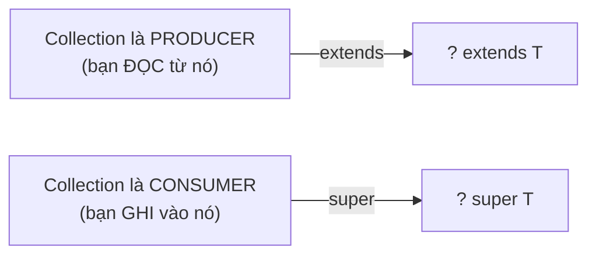

## Mục lục

- [ClassCastException từ hư không — không có cast nào trong code](#1-classcastexception-từ-hư-không--không-có-cast-nào-trong-code)
- [Type Erasure — generics biến mất sau compile](#2-type-erasure--generics-biến-mất-sau-compile)
- [Bridge Methods — compiler tự sinh để giữ polymorphism](#3-bridge-methods--compiler-tự-sinh-để-giữ-polymorphism)
- [Bounded Type Parameters — extends & super ở khai báo](#4-bounded-type-parameters--extends--super-ở-khai-báo)
- [Wildcards & PECS — Producer Extends, Consumer Super](#5-wildcards--pecs--producer-extends-consumer-super)
- [Type Inference — diamond operator & var](#6-type-inference--diamond-operator--var)
- [Reification: Arrays vs Generics — tại sao không có new T[]](#7-reification-arrays-vs-generics--tại-sao-không-có-new-t)
- [Heap Pollution — khi runtime type ≠ compile-time type](#8-heap-pollution--khi-runtime-type--compile-time-type)
- [Recursive Type Bounds — self-referential generics](#9-recursive-type-bounds--self-referential-generics)
- [Generic Methods vs Generic Classes](#10-generic-methods-vs-generic-classes)
- [Type Tokens & Super Type Tokens](#11-type-tokens--super-type-tokens)
- [Anti-patterns & production pitfalls](#12-anti-patterns--production-pitfalls)
- [Tóm tắt — Cheat sheet & 5 nguyên tắc](#13-tóm-tắt--cheat-sheet--5-nguyên-tắc)

---

## 1. ClassCastException từ hư không — không có cast nào trong code

**Generics** (`List<String>`, `Cache<T>`) cho phép viết code type-safe dùng lại cho nhiều kiểu. Nhưng generics trong Java tồn tại **chỉ lúc compile** — runtime, `Cache<User>` và `Cache<Order>` là *cùng một class* `Cache`. Cơ chế này gọi là **type erasure**: compiler kiểm tra type rồi xoá hết đi và chèn cast ở caller. Type safety phụ thuộc hoàn toàn vào compiler check — mà raw type / unchecked cast bypass check đó, để ClassCastException nổ ở nơi không có cast nào nhìn thấy.

Bạn có service deserialize JSON thành object, lưu vào cache generic:

```java
public class Cache<T> {
    private final Map<String, T> store = new HashMap<>();
    
    public void put(String key, T value) { store.put(key, value); }
    public T get(String key) { return store.get(key); }
}
```

Dev khác dùng raw type (bỏ generic):

```java
Cache cache = new Cache();           // raw type — no generic
cache.put("user", new User("Hiệp"));
cache.put("order", "not an order");  // ← compile OK! (raw type = no check)

User user = (User) cache.get("user");    // OK
Order order = (Order) cache.get("order"); // 💥 ClassCastException at runtime!
```

Tệ hơn — ClassCastException **ở nơi không có cast visible**:

```java
Cache<Order> typedCache = (Cache<Order>) cache;  // unchecked — raw→generic
Order o = typedCache.get("order");               
// 💥 CCE tại dòng này — vì compiler insert cast: (Order) store.get(key)
// nhưng store chứa String "not an order"
```

> [!IMPORTANT]
> Generics tồn tại **chỉ** lúc compile. Runtime, `Cache<User>` và `Cache<Order>` là cùng **một class** `Cache`. Type safety phụ thuộc hoàn toàn vào **compiler check** — mà raw type / unchecked cast bypass check đó.

Phần còn lại của doc sẽ đi qua: type erasure cơ chế (§2) → bridge methods (§3) → bounded type parameters (§4) → wildcards & PECS (§5) → type inference & diamond (§6) → reification arrays vs generics (§7) → heap pollution (§8) → recursive type bounds (§9) → generic methods vs generic classes (§10) → type tokens & super type tokens (§11) → anti-patterns (§12) → cheat sheet (§13).

---

## 2. Type Erasure — generics biến mất sau compile

### 2.1. Cơ chế

Compiler Java xoá (erase) tất cả type parameter sau khi check xong:

```java
// Source code:
List<String> list = new ArrayList<>();
list.add("hello");
String s = list.get(0);

// Sau erasure (bytecode tương đương):
List list = new ArrayList();           // raw List
list.add("hello");
String s = (String) list.get(0);      // compiler insert cast
```

| Source | After Erasure |
|--------|--------------|
| `T` (unbounded) | `Object` |
| `T extends Comparable` | `Comparable` |
| `List<String>` | `List` |
| `Map<K,V>` | `Map` |
| `Pair<Integer, String>` | `Pair` |

### 2.2. Chứng minh bằng bytecode

```bash
javap -c Cache.class
```

```
public java.lang.Object get(java.lang.String);
    Code:
       0: aload_0
       1: getfield      #7  // Field store:Ljava/util/Map;
       4: aload_1
       5: invokeinterface #13, 2  // Map.get(Object)Object
      10: areturn                  // trả về Object — không có type info
```

Caller (`typedCache.get("order")`):
```
invokevirtual #5    // Cache.get(String)Object
checkcast     #6    // (Order) ← compiler insert cast ở CALLER
```

> [!TIP]
> Hiểu erasure giải thích tại sao: `new T()` bất khả, `instanceof List<String>` bất khả, `T.class` bất khả — runtime không biết `T` là gì.

### 2.3. Signature attribute — type info vẫn sống trong .class file

Dù runtime xóa generic type, `.class` file **vẫn lưu** thông tin generic trong `Signature` attribute (metadata, không ảnh hưởng execution):

```
// javap -v Cache.class → Signature of get():
  Signature: #20  // (Ljava/lang/String;)TT;
  //           ↑ "trả về T" — chỉ là metadata, runtime không dùng
```

**Ai dùng Signature attribute?**
- Reflection: `Field.getGenericType()`, `Method.getGenericReturnType()`
- Frameworks (Spring, Jackson): `TypeReference<Map<String, List<Integer>>>` → đọc generic args qua reflection
- IDE & decompiler: hiển thị đúng generic types

```java
// Spring ví dụ: lấy generic type từ Signature attribute
class UserService extends BaseService<User> { }

// Spring đọc: UserService → superclass → BaseService<User>
// via Class.getGenericSuperclass() → ParameterizedType.getActualTypeArguments()
Type[] args = ((ParameterizedType) UserService.class.getGenericSuperclass())
              .getActualTypeArguments();
// args[0] = User.class ← framework biết entity type!
```

### 2.4. Tại sao Java chọn erasure?

**Backward compatibility**: JDK 5 thêm generics mà không break binary compatibility với code Java 1.4 (raw types). Nếu dùng reification (như C# .NET) → phải thay đổi class file format, JVM, và toàn bộ ecosystem.

Trade-off: type safety ở compile time, nhưng **mất type info** ở runtime. Signature attribute là **compromise** — giữ metadata cho reflection/tools nhưng JVM execution hoàn toàn erased.

---

## 3. Bridge Methods — compiler tự sinh để giữ polymorphism

### 3.1. Vấn đề

```java
public interface Comparable<T> {
    int compareTo(T other);
}

public class Name implements Comparable<Name> {
    @Override
    public int compareTo(Name other) { ... }  // compile-time: compareTo(Name)
}
```

Sau erasure:
- Interface: `compareTo(Object)` (T → Object)
- Class: `compareTo(Name)` — **signature khác nhau!**

Nếu polymorphism call qua interface reference:
```java
Comparable c = new Name();
c.compareTo(anotherName);  // gọi compareTo(Object) — method nào?
```

### 3.2. Bridge method

Compiler tự sinh **bridge method** để nối:

```java
// Compiler-generated (không thấy trong source):
public int compareTo(Object other) {       // bridge — override interface method
    return this.compareTo((Name) other);   // delegate + cast
}
```

```bash
javap -c Name.class | grep bridge
```
```
public int compareTo(java.lang.Object);
    descriptor: (Ljava/lang/Object;)I
    flags: ACC_PUBLIC, ACC_BRIDGE, ACC_SYNTHETIC
```

> [!NOTE]
> Bridge methods là lý do bạn thấy `ACC_BRIDGE` + `ACC_SYNTHETIC` trong bytecode. Chúng transparent với developer nhưng cần thiết để **erasure + polymorphism** cùng tồn tại.

---

## 4. Bounded Type Parameters — extends & super ở khai báo

### 4.1. Upper bound: `<T extends SomeType>`

```java
// T phải là subtype của Comparable<T>
public static <T extends Comparable<T>> T max(List<T> list) {
    T result = list.get(0);
    for (T item : list)
        if (item.compareTo(result) > 0) result = item;
    return result;
}
```

Sau erasure: `T` → `Comparable` (upper bound thay vì Object). Nghĩa là bytecode có thể gọi `compareTo` trực tiếp mà không cần cast.

### 4.2. Multiple bounds: `<T extends A & B & C>`

```java
public static <T extends Serializable & Comparable<T>> void process(T item) {
    // T phải implement CẢ Serializable VÀ Comparable
}
```

Quy tắc: class bound đầu tiên (nếu có), interfaces sau. Erasure dùng **bound đầu tiên** (leftmost):
- `<T extends Number & Comparable<T>>` → erasure = `Number`
- `<T extends Comparable<T> & Serializable>` → erasure = `Comparable`

---

## 5. Wildcards & PECS — Producer Extends, Consumer Super

### 5.1. Ba loại wildcard

| Wildcard | Đọc | Ghi | Ví dụ |
|----------|-----|-----|-------|
| `<? extends T>` (upper) | Có (as T) | **Không** (trừ null) | `List<? extends Number>` |
| `<? super T>` (lower) | Có (as Object) | **Có** (T hoặc subtype) | `List<? super Integer>` |
| `<?>` (unbounded) | Có (as Object) | **Không** (trừ null) | `List<?>` |

### 5.2. PECS: Producer Extends, Consumer Super

```java
// PRODUCER: đọc elements TỪ collection → extends
public static double sum(List<? extends Number> numbers) {
    double total = 0;
    for (Number n : numbers) total += n.doubleValue();  // đọc as Number ✓
    // numbers.add(1);  ← COMPILE ERROR: không biết actual type
    return total;
}

// CONSUMER: ghi elements VÀO collection → super
public static void fill(List<? super Integer> dest, int value) {
    dest.add(value);          // ghi Integer vào ✓
    // Integer x = dest.get(0);  ← COMPILE ERROR: chỉ biết trả về Object
}
```



### 5.3. Ví dụ thực tế: Collections.copy()

```java
// JDK source:
public static <T> void copy(List<? super T> dest, List<? extends T> src) {
    // src: producer → extends (đọc elements)
    // dest: consumer → super (ghi elements)
    for (int i = 0; i < src.size(); i++)
        dest.set(i, src.get(i));
}

// Dùng:
List<Number> dest = new ArrayList<>();
List<Integer> src = List.of(1, 2, 3);
Collections.copy(dest, src);    // Integer extends Number → OK
```

> [!TIP]
> Mnemonic: **GET = extends, PUT = super**. Nếu bạn `get()` từ collection → extends. Nếu bạn `put()` vào collection → super. Nếu cả hai → không dùng wildcard (dùng exact type).

---

## 6. Type Inference — diamond operator & var

### 6.1. Diamond operator (JDK 7)

```java
// Trước JDK 7: lặp type arguments
Map<String, List<Integer>> map = new HashMap<String, List<Integer>>();

// JDK 7+: compiler infer từ left-hand side
Map<String, List<Integer>> map = new HashMap<>();
```

### 6.2. Type witness

```java
// Compiler không infer được? → explicit type witness
Collections.<String>emptyList();  // explicit: List<String>

// JDK 8+: inference mạnh hơn, hiếm khi cần
List<String> empty = Collections.emptyList();  // infer từ target type
```

### 6.3. var + generics (JDK 10+)

```java
var list = new ArrayList<String>();    // inferred: ArrayList<String>
var map = Map.of("a", 1, "b", 2);    // inferred: Map<String, Integer>

// Cẩn thận: var + diamond = raw-ish behavior
var list = new ArrayList<>();          // inferred: ArrayList<Object> ← có thể không muốn
```

---

## 7. Reification: Arrays vs Generics — tại sao không có new T[]

### 7.1. Java arrays là **reified** (giữ type info runtime)

```java
String[] arr = new String[10];
Object[] oarr = arr;              // covariant — compile OK
oarr[0] = 42;                    // 💥 ArrayStoreException at RUNTIME
// Array biết runtime type = String[] → reject Integer
```

### 7.2. Generics là **erased** (mất type info runtime)

```java
List<String> list = new ArrayList<>();
List rawList = list;
rawList.add(42);                  // NO exception! (erasure → List of Object)
String s = list.get(0);           // 💥 ClassCastException TẠI ĐÂY (cast insert bởi compiler)
```

### 7.3. Tại sao `new T[]` bất khả?

```java
public <T> T[] createArray(int size) {
    return new T[size];    // ❌ COMPILE ERROR
    // Vì runtime không biết T là gì → không biết allocate array type nào
}
```

**Workaround:**

```java
// 1. Truyền Class<T> (type token):
public <T> T[] createArray(Class<T> type, int size) {
    return (T[]) Array.newInstance(type, size);
}

// 2. Dùng Object[] internally:
@SuppressWarnings("unchecked")
public <T> T[] toArray(T[] a) {
    return (T[]) Arrays.copyOf(elementData, size, a.getClass());
}
```

> [!IMPORTANT]
> **Không tạo generic array** (`new List<String>[10]` — compile error). Arrays cần reified type để ArrayStoreException hoạt động, nhưng generics erased → conflict. Dùng `List<List<String>>` thay vì `List<String>[]`.

---

## 8. Heap Pollution — khi runtime type ≠ compile-time type

### 8.1. Định nghĩa

Heap pollution xảy ra khi biến có **parameterized type** trỏ tới object **không đúng type** đó — thường do raw type hoặc unchecked cast.

```java
List<String> strings = new ArrayList<>();
List rawList = strings;        // raw type → unchecked
rawList.add(42);               // heap pollution! List<String> chứa Integer

// Pollution đã xảy ra — đợi đến khi ai đọc:
String s = strings.get(0);     // 💥 CCE: Integer cannot be cast to String
```

### 8.2. @SafeVarargs

Varargs + generics = guaranteed heap pollution warning:

```java
// Compiler warning: "Possible heap pollution from parameterized vararg type"
public static <T> List<T> asList(T... elements) {
    // elements là T[] — nhưng erasure → Object[] runtime
    // Nếu ai cast elements và ghi sai type → pollution
    return Arrays.asList(elements);
}
```

```java
@SafeVarargs  // "Tôi đảm bảo không dùng varargs array theo cách gây pollution"
public static <T> List<T> safeList(T... elements) {
    return List.of(elements);  // chỉ đọc, không expose array → safe
}
```

> [!WARNING]
> `@SafeVarargs` chỉ là **lời hứa** của developer — compiler không verify. Nếu method expose hoặc ghi vào varargs array → vẫn pollution. Chỉ annotate khi chắc chắn method không lưu/expose array.

---

## 9. Recursive Type Bounds — self-referential generics

### 9.1. Pattern

```java
public static <T extends Comparable<T>> T max(Collection<T> c) { ... }
```

Đọc: "T là type mà có thể **so sánh với chính nó**". Đảm bảo `compareTo` nhận cùng type.

### 9.2. Builder pattern với recursive bound

```java
public abstract class Builder<T extends Builder<T>> {
    protected String name;
    
    @SuppressWarnings("unchecked")
    public T withName(String name) {
        this.name = name;
        return (T) this;    // trả về subclass type → chain method trả đúng type
    }
}

public class UserBuilder extends Builder<UserBuilder> {
    private int age;
    
    public UserBuilder withAge(int age) {
        this.age = age;
        return this;
    }
}

// Chain trả đúng type (không cần cast):
UserBuilder builder = new UserBuilder()
    .withName("Hiệp")    // trả UserBuilder (không phải Builder)
    .withAge(25);         // OK — vì withName trả T = UserBuilder
```

### 9.3. Enum — recursive bound kinh điển

```java
// java.lang.Enum definition:
public abstract class Enum<E extends Enum<E>> implements Comparable<E> {
    public final int compareTo(E o) { ... }
}
// Mỗi enum: class Status extends Enum<Status>
// → compareTo nhận Status, không phải Enum khác
```

---

## 10. Generic Methods vs Generic Classes

### 10.1. Khi nào dùng gì?

| Scenario | Generic Class | Generic Method |
|----------|--------------|----------------|
| Type liên quan đến **state** của class | ✓ `class Cache<T>` | |
| Type chỉ dùng trong **1 method** | | ✓ `<T> T find(...)` |
| Utility method (static) | | ✓ (class type param không dùng cho static) |
| Type thay đổi theo mỗi call | | ✓ |

### 10.2. Ví dụ

```java
// Generic CLASS: type gắn với instance lifecycle
public class Repository<T> {
    public T findById(long id) { ... }
    public void save(T entity) { ... }
}

// Generic METHOD: type chỉ tồn tại trong 1 call
public static <T extends Comparable<T>> T max(T a, T b) {
    return a.compareTo(b) >= 0 ? a : b;
}

// Kết hợp: class generic + method generic khác nhau
public class Converter<S> {
    public <T> T convert(S source, Class<T> targetType) { ... }
}
```

---

## 11. Type Tokens & Super Type Tokens

### 11.1. Type Token: `Class<T>`

```java
// Giữ type info runtime qua Class object:
public <T> T deserialize(String json, Class<T> type) {
    return objectMapper.readValue(json, type);
}

User user = deserialize(jsonStr, User.class);  // Class<User> = type token
```

**Hạn chế**: `Class<T>` chỉ đại diện **raw class** — không biểu diễn được `List<String>` (chỉ `List.class`).

### 11.2. Super Type Token (Neal Gafter pattern)

```java
// TypeReference giữ generic type info qua anonymous class trick:
abstract class TypeReference<T> {
    Type getType() {
        // Lấy type argument từ class metadata (không bị erase cho anonymous subclass)
        return ((ParameterizedType) getClass().getGenericSuperclass())
            .getActualTypeArguments()[0];
    }
}

// Dùng:
TypeReference<List<String>> ref = new TypeReference<>() {};
// ref.getType() = ParameterizedType{List<String>}  ← full generic info!
```

**Tại sao hoạt động?** Anonymous class `new TypeReference<List<String>>() {}` tạo subclass. Compiler lưu superclass type arguments trong class file metadata (không bị erase) — vì đây là **inheritance relationship**, không phải instance variable.

Jackson, Gson, TypeLiteral (Guice) đều dùng pattern này:

```java
// Jackson:
List<User> users = mapper.readValue(json, new TypeReference<List<User>>() {});
```

---

## 12. Anti-patterns & production pitfalls

| Anti-pattern | Vì sao sai | Giải pháp |
|--------------|-----------|-----------|
| Raw type (`List` thay `List<String>`) | Mất type safety, unchecked warnings | Luôn parameterize |
| `instanceof List<String>` | Compile error (erasure) | `instanceof List<?>` + cast |
| `new T()` / `new T[]` | T erased → runtime không biết type | Class<T> token hoặc factory |
| `(T) object` unchecked cast | Có thể ClassCastException xa | Validate type trước cast |
| `List<Object>` thay `List<?>` | Cho phép ghi bất kỳ type → unsafe | Wildcard nếu chỉ đọc |
| Return `List<? extends X>` từ public API | Caller không ghi được | Return concrete `List<X>` |
| `@SuppressWarnings("unchecked")` quá rộng | Ẩn bug thật | Scope nhỏ nhất có thể |

**Check và cast an toàn:**

```java
// ❌ Unchecked — có thể lỗi xa:
@SuppressWarnings("unchecked")
List<String> list = (List<String>) rawObject;

// ✅ Defensive:
if (rawObject instanceof List<?> rawList) {
    List<String> list = new ArrayList<>();
    for (Object item : rawList) {
        if (item instanceof String s) list.add(s);
        else throw new IllegalArgumentException("Expected String, got: " + item.getClass());
    }
}
```

---

## 13. Tóm tắt — Cheat sheet & 5 nguyên tắc

**Cỗ máy trong 6 dòng:**

```
1. Type Erasure: compiler check → erase → insert cast ở caller site
2. Bridge methods: compiler sinh để kết nối erased interface + typed implementation
3. PECS: Producer → extends (đọc), Consumer → super (ghi)
4. Reified arrays vs erased generics → new T[] bất khả, dùng Class<T>
5. Heap pollution: raw type / unchecked cast → runtime type ≠ declared type → CCE
6. Super Type Token: anonymous subclass giữ generic info qua class metadata
```

| Tình huống | Pattern |
|-----------|---------|
| Đọc từ collection generic | `<? extends T>` |
| Ghi vào collection generic | `<? super T>` |
| Cần type info runtime | `Class<T>` token |
| Cần full generic type runtime | Super Type Token (`TypeReference`) |
| Builder fluent trả subclass type | Recursive bound `<T extends Builder<T>>` |
| Utility method generic | `<T> T method(...)` (static) |

**5 nguyên tắc khắc cốt:**

1. **Không bao giờ raw type** — `List` = mất safety. `List<?>` nếu không biết type.
2. **PECS** — GET extends, PUT super. Viết API generic linh hoạt.
3. **Erasure = no runtime type** — `new T()`, `T.class`, `instanceof List<T>` đều bất khả. Accept it.
4. **Minimize unchecked cast** — mỗi `@SuppressWarnings("unchecked")` là một potential CCE. Scope nhỏ nhất.
5. **Prefer `List<T>` over `T[]`** — generics + collections an toàn hơn generic arrays.

> [!TIP]
> Một câu để nhớ: *Generics là hợp đồng compile-time: compiler kiểm tra đúng type cho bạn, rồi xoá hết đi lúc runtime. Mọi lỗ hổng generic (CCE runtime) đều bắt nguồn từ chỗ bạn bypass hợp đồng đó — raw type, unchecked cast, reflection.*
