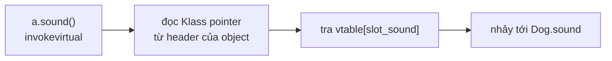
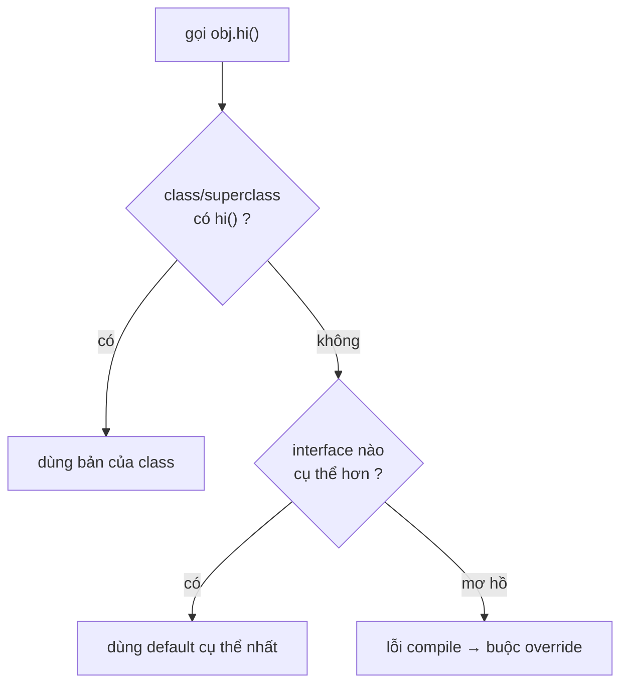

# 4 Tính chất OOP — Nhìn từ tầng JVM

## Mục lục

- [Tôi gọi method của lớp cha hay lớp con](#1-tôi-gọi-method-của-lớp-cha-hay-lớp-con)
- [Encapsulation — đóng gói không chỉ là getter/setter](#2-encapsulation--đóng-gói-không-chỉ-là-gettersetter)
- [Inheritance — object layout & super constructor chaining](#3-inheritance--object-layout--super-constructor-chaining)
- [Polymorphism — invokevirtual, vtable và động cơ dispatch](#4-polymorphism--invokevirtual-vtable-và-động-cơ-dispatch)
- [Overriding vs Overloading — runtime vs compile-time](#5-overriding-vs-overloading--runtime-vs-compile-time)
- [Abstraction — abstract class vs interface vs default method](#6-abstraction--abstract-class-vs-interface-vs-default-method)
- [So sánh & khi nào dùng cái nào](#7-so-sánh--khi-nào-dùng-cái-nào)
- [Anti-patterns cần tránh](#8-anti-patterns-cần-tránh)
- [Tóm tắt — Cheat sheet](#9-tóm-tắt--cheat-sheet)

---

## 1. Tôi gọi method của lớp cha hay lớp con

4 tính chất OOP — **Encapsulation** (đóng gói), **Inheritance** (kế thừa), **Polymorphism** (đa hình), **Abstraction** (trừu tượng) — không phải khái niệm trừu tượng để học thuộc lòng. Mỗi tính chất ứng với một cơ chế cụ thể trong JVM: encapsulation → access flag trong bytecode; inheritance → object layout + `invokespecial`; polymorphism → `invokevirtual` + vtable; abstraction → `invokeinterface` + itable. Hiểu cơ chế = trả lời được mọi câu hỏi "tại sao".

Một câu hỏi phỏng vấn kinh điển — và là nơi 4 tính chất OOP lộ ra bản chất thật của chúng:

```java
class Animal {
    String sound() { return "..."; }
    void describe() { System.out.println("Kêu: " + sound()); }
}
class Dog extends Animal {
    @Override String sound() { return "Gâu"; }
}

Animal a = new Dog();
a.describe();   // in ra gì?
```

Đáp án là `Kêu: Gâu`. Nhưng *vì sao*? `describe()` được định nghĩa trong `Animal`, nó gọi `sound()` — và `Animal.sound()` trả `"..."`. Vì sao kết quả lại là của `Dog`?

Câu trả lời nằm ở **dynamic dispatch**: lời gọi `sound()` không được "buộc cứng" vào `Animal.sound` lúc biên dịch, mà được giải quyết **lúc chạy** dựa trên *kiểu thực* của object (`Dog`), không phải kiểu biến tham chiếu (`Animal`). Đây chính là **polymorphism**, và nó được JVM cài đặt bằng một bảng con trỏ method gọi là **vtable**.

> [!IMPORTANT]
> 4 tính chất OOP không phải khái niệm trừu tượng để học thuộc lòng. Mỗi tính chất ứng với một cơ chế cụ thể trong JVM: encapsulation → access flag trong bytecode; inheritance → object layout + `invokespecial` gọi `<init>` cha; polymorphism → `invokevirtual` + vtable; abstraction → `invokeinterface` + itable. Hiểu cơ chế = trả lời được mọi câu hỏi "tại sao".

Phần còn lại của doc sẽ đi qua: encapsulation — đóng gói không chỉ là getter/setter (§2) → inheritance — object layout & super constructor (§3) → polymorphism — invokevirtual & vtable (§4) → overriding vs overloading (§5) → abstraction — abstract class vs interface vs default method (§6) → so sánh & khi nào dùng (§7) → anti-patterns (§8) → cheat sheet (§9).

---

## 2. Encapsulation — đóng gói không chỉ là getter/setter

**Encapsulation** = che giấu trạng thái nội bộ, chỉ expose hành vi qua interface công khai. Nhưng nói "tạo getter/setter cho mọi field" là **hiểu sai** bản chất.

### 2.1. Đóng gói thật sự = bảo vệ bất biến (invariant)

Một class được đóng gói tốt **không cho phép object rơi vào trạng thái không hợp lệ**:

```java
// Đóng gói TỆ — getter/setter mù quáng, không bảo vệ gì
public class BankAccount {
    private long balance;
    public long getBalance() { return balance; }
    public void setBalance(long b) { this.balance = b; }  // cho phép số âm!
}

// Đóng gói TỐT — bảo vệ invariant "balance >= 0"
public class BankAccount {
    private long balance;
    public long balance() { return balance; }
    public void withdraw(long amount) {
        if (amount <= 0) throw new IllegalArgumentException("amount > 0");
        if (amount > balance) throw new InsufficientFundsException();
        balance -= amount;          // chỉ thay đổi qua hành vi có kiểm soát
    }
}
```

Ở tầng bytecode, `private` được mã hoá bằng **access flag** `ACC_PRIVATE` (0x0002) trong constant pool của field. JVM **kiểm tra flag này lúc link/verify** — truy cập field private từ ngoài class sẽ ném `IllegalAccessError`.

> [!WARNING]
> `private` chỉ là rào ở mức ngôn ngữ + verifier. **Reflection** (`field.setAccessible(true)`) hoặc `Unsafe` có thể xuyên qua. Đóng gói trong Java là *hợp đồng*, không phải *hàng rào an ninh*. Module system (JPMS, Java 9+) với `--illegal-access=deny` mới thật sự chặn được reflection xuyên gói.

### 2.2. Bẫy "encapsulation rò rỉ" — trả về tham chiếu mutable

```java
public class Team {
    private final List<Player> players = new ArrayList<>();
    public List<Player> getPlayers() { return players; }   // 😱 rò rỉ!
}

team.getPlayers().clear();   // người ngoài xoá sạch list nội bộ
```

Field `private` nhưng vẫn bị thao túng vì bạn **trả về tham chiếu tới chính object nội bộ**. Sửa: trả về bản sao phòng thủ hoặc view bất biến.

```java
public List<Player> players() {
    return Collections.unmodifiableList(players);   // hoặc List.copyOf(players)
}
```

---

## 3. Inheritance — object layout & super constructor chaining

**Inheritance** cho phép một class tái sử dụng và mở rộng class khác. Nhưng điều ít người để ý: kế thừa ảnh hưởng tới **bố cục bộ nhớ** của object và **thứ tự khởi tạo**.

### 3.1. Object layout — field cha nằm trước field con

Một `Dog extends Animal` được layout trong heap như sau (HotSpot, 64-bit, compressed oops):

```
┌──────────────────────────────────────┐  địa chỉ object Dog
│ Mark Word        (8 byte)             │  ← object header
│ Klass Pointer    (4 byte, nén)        │  ← trỏ tới metadata lớp Dog (chứa vtable)
├──────────────────────────────────────┤
│ field của Animal (vd: name)           │  ← field LỚP CHA nằm trước
├──────────────────────────────────────┤
│ field của Dog    (vd: breed)          │  ← field lớp con nằm sau
└──────────────────────────────────────┘
```

Field lớp cha luôn nằm trước → một tham chiếu `Animal a = dog` đọc field `name` ở **cùng offset** dù object thật là `Dog`. Đây là nền tảng để upcasting an toàn mà không cần copy.

### 3.2. Super constructor chaining — invokespecial

Constructor con **bắt buộc** gọi constructor cha (ngầm định `super()` nếu bạn không viết). Bytecode của `new Dog()`:

```
new Dog
dup
invokespecial Dog.<init>()V
   └─ trong Dog.<init>: aload_0; invokespecial Animal.<init>()V   ← gọi cha TRƯỚC
   └─ rồi mới khởi tạo field của Dog
```

> [!IMPORTANT]
> Constructor cha chạy **trước** khi field của con được khởi tạo. Bẫy kinh điển: gọi method bị override từ trong constructor cha sẽ chạy bản con — nhưng field con **chưa init**:
> ```java
> class A { A() { init(); } void init() {} }
> class B extends A { int x = 10; void init() { System.out.println(x); } }
> new B();   // in ra 0, KHÔNG phải 10 — vì x chưa được gán khi A.<init> chạy
> ```

### 3.3. Vì sao Java không đa kế thừa (class)?

Để tránh **diamond problem**: nếu `D` kế thừa `B` và `C` mà cả hai cùng kế thừa `A`, field `A.x` xuất hiện mấy lần trong layout của `D`? C++ giải quyết bằng virtual inheritance phức tạp. Java chọn đơn giản: **một class chỉ kế thừa một class**, nhưng implement **nhiều interface** (interface không có state nên không có vấn đề layout).

---

## 4. Polymorphism — invokevirtual, vtable và động cơ dispatch

Đây là phần "động cơ" của OOP. Khi bạn gọi `a.sound()`, compiler **không biết** object thật là gì, nên sinh ra:

```
aload_1                          // đẩy tham chiếu a lên stack
invokevirtual Animal.sound()Ljava/lang/String;
```

`invokevirtual` không phải "nhảy thẳng tới `Animal.sound`". Nó nói: *"tìm method `sound` trong **vtable của kiểu thực** của object trên stack"*.

### 4.1. Vtable hoạt động thế nào

Mỗi class có một **vtable** (virtual method table) — mảng con trỏ tới các method. Klass pointer trong object header trỏ tới metadata lớp, từ đó tới vtable:

```
Object header của Dog ──► Klass(Dog) ──► vtable:
                                          [0] Object.toString
                                          [1] Object.equals
                                          ...
                                          [k] Animal.describe   (Dog không override → trỏ về Animal)
                                          [k+1] Dog.sound       (Dog override → trỏ về Dog!)
```

Điểm mấu chốt: **slot của `sound()` trong vtable của `Dog` trỏ tới `Dog.sound`**. Compiler chỉ cần biết *chỉ số slot* (cố định cho mọi lớp con), JVM dùng object thật để chọn vtable. Vì thế dispatch chỉ tốn ~1-2 lần truy cập bộ nhớ — gần như O(1).



### 4.2. interface dùng invokeinterface + itable

Với interface, không thể dùng slot cố định (một class implement nhiều interface, thứ tự khác nhau). JVM dùng **itable** (interface method table) — tra cứu phức tạp hơn chút: tìm itable của interface trong class, rồi tra method. Chậm hơn `invokevirtual` một chút nhưng JIT thường tối ưu được.

### 4.3. JIT khử ảo (devirtualization)

Nếu JIT phát hiện một call site **luôn** gặp đúng một kiểu (monomorphic), nó **inline** thẳng method, bỏ qua vtable hoàn toàn. Nếu gặp 2 kiểu (bimorphic) → kiểm tra rẻ rồi inline. Đây là lý do code OOP "nhiều lớp ảo" vẫn nhanh trong thực tế.

> [!TIP]
> `final`, `private`, `static` method → dùng `invokespecial`/`invokestatic` (binding tĩnh, không qua vtable) → JIT inline dễ hơn. Đánh dấu `final` cho method không cần override vừa rõ ý định vừa giúp tối ưu.

---

## 5. Overriding vs Overloading — runtime vs compile-time

Hai khái niệm dễ nhầm vì tên giống nhau, nhưng được giải quyết ở **hai thời điểm khác nhau**:

| Tiêu chí | Overriding (ghi đè) | Overloading (nạp chồng) |
|----------|---------------------|--------------------------|
| Quan hệ | Cùng signature, lớp con vs cha | Cùng tên, **khác** tham số |
| Quyết định ở | **Runtime** (dynamic dispatch) | **Compile-time** (kiểu tĩnh) |
| Bytecode | vtable slot phụ thuộc object thật | compiler chọn sẵn method cụ thể |
| Polymorphism? | Có (đa hình thực) | Không (chỉ là cú pháp tiện) |

Bẫy overloading + `null`:

```java
void f(String s) {}
void f(Object o) {}
f(null);   // gọi f(String) — compiler chọn signature CỤ THỂ nhất, lúc biên dịch
```

Bẫy overloading + autoboxing — compiler ưu tiên: **widening > boxing > varargs**:

```java
void g(long x) {}
void g(Integer x) {}
g(1);   // gọi g(long) — widening int→long được ưu tiên hơn boxing int→Integer
```

> [!WARNING]
> Overloading **không** là đa hình. `List<Object> list` chứa `Dog`, gọi `process(list.get(0))` với `process(Dog)`/`process(Cat)` overload → luôn chọn theo kiểu tĩnh `Object`, **không** theo object thật. Muốn dispatch theo kiểu thật giữa nhiều loại, dùng overriding hoặc pattern matching (Java 21).

---

## 6. Abstraction — abstract class vs interface vs default method

**Abstraction** = lộ "cái gì làm được" (hành vi), giấu "làm thế nào" (cài đặt). Java có 2 công cụ: `abstract class` và `interface`.

### 6.1. Khác biệt cốt lõi

| | `abstract class` | `interface` |
|---|------------------|-------------|
| State (field instance) | Có | Không (chỉ `static final`) |
| Constructor | Có | Không |
| Đa kế thừa | Không (1 class) | Có (nhiều interface) |
| Method có thân | Có (cả non-abstract) | `default` / `static` / `private` (Java 8/9+) |
| Dùng khi | "is-a" + chia sẻ state/code | "can-do" + hợp đồng hành vi |

### 6.2. Default method & bài toán đa kế thừa hành vi

Java 8 thêm `default` method vào interface → tái xuất hiện **diamond problem** ở mức hành vi. Nếu hai interface có cùng default method, lớp implement **bắt buộc** phải override để khử mơ hồ:

```java
interface A { default String hi() { return "A"; } }
interface B { default String hi() { return "B"; } }
class C implements A, B {
    @Override public String hi() {
        return A.super.hi();   // chỉ định rõ muốn dùng default của A
    }
}
```

Quy tắc giải quyết của compiler (theo thứ tự ưu tiên):

1. **Class luôn thắng** — method trong class (hoặc cha) > default method.
2. **Interface cụ thể hơn thắng** — `B extends A`, default của `B` > của `A`.
3. Còn lại → mơ hồ → **bắt buộc override**.



> [!NOTE]
> `default` method sinh ra để **tiến hoá interface mà không phá vỡ code cũ** (vd thêm `stream()` vào `Collection`). Đừng lạm dụng nó như "trait có state" — interface vẫn không có field instance.

---

## 7. So sánh & khi nào dùng cái nào

| Tình huống | Chọn | Lý do |
|------------|------|-------|
| Nhiều lớp chia sẻ **state + code** chung | `abstract class` | interface không có field |
| Chỉ cần định nghĩa **hợp đồng** | `interface` | nhẹ, đa kế thừa |
| Object cần **nhiều "vai trò"** | nhiều `interface` | `Comparable` + `Serializable` + ... |
| Muốn thêm method vào interface đã publish | `default` method | không phá code client |
| Hành vi thay đổi theo runtime type | overriding (polymorphism) | dynamic dispatch |
| Nhiều cách gọi cùng một thao tác | overloading | tiện cú pháp, không phải đa hình |

**Nguyên tắc thực dụng:** ưu tiên `interface` cho API public (dễ tiến hoá, dễ mock test), dùng `abstract class` khi thật sự cần chia sẻ state/implementation.

---

## 8. Anti-patterns cần tránh

| Anti-pattern | Vì sao sai | Thay bằng |
|--------------|-----------|-----------|
| Getter/setter cho mọi field | Phá đóng gói, không bảo vệ invariant | Expose hành vi, không expose state |
| Trả về collection nội bộ trực tiếp | Người ngoài sửa được state private | `List.copyOf` / `unmodifiableList` |
| Gọi method override trong constructor cha | Field con chưa init → NPE/giá trị 0 | Khởi tạo xong rồi mới gọi |
| Kế thừa để tái sử dụng code (không "is-a") | Vỡ Liskov, coupling chặt | Composition (delegate) |
| Lạm dụng overloading gây mơ hồ | `null`/autoboxing chọn sai overload | Đặt tên method khác nhau |
| `abstract class` chỉ để chứa hằng số | Không có state thật | `interface` hoặc class util |

> [!TIP]
> "Favor composition over inheritance" — kế thừa tạo coupling cứng giữa cha-con, lớp cha đổi là con vỡ. Composition (chứa object khác và uỷ quyền) linh hoạt hơn và tránh phần lớn vấn đề của 4 tính chất.

---

## 9. Tóm tắt — Cheat sheet

**4 tính chất ↔ cơ chế JVM:**

```
Encapsulation  → ACC_PRIVATE access flag + verifier; bảo vệ invariant
Inheritance    → object layout (field cha trước) + invokespecial gọi <init> cha
Polymorphism   → invokevirtual + vtable (slot cố định) / invokeinterface + itable
Abstraction    → abstract method (no body) + default method resolution rule
```

| Khái niệm | Thời điểm quyết định | Cơ chế |
|-----------|---------------------|--------|
| Overriding | Runtime | vtable lookup theo object thật |
| Overloading | Compile-time | chọn signature theo kiểu tĩnh |
| default method conflict | Compile-time | class wins → specific wins → buộc override |

**5 nguyên tắc khắc cốt:**

1. **Đóng gói = bảo vệ bất biến**, không phải sinh getter/setter máy móc.
2. **Constructor cha chạy trước** — đừng gọi method ảo trong đó.
3. **Overriding = runtime, overloading = compile-time** — đừng nhầm lẫn.
4. **invokevirtual chọn method theo object thật**, không theo kiểu biến.
5. **Composition > Inheritance** khi quan hệ không thật sự là "is-a".

> [!TIP]
> Một câu để nhớ: *Bốn tính chất OOP chỉ là cách con người mô tả ba cơ chế JVM — che field (encapsulation), nối layout + vtable (inheritance + polymorphism), và bỏ trống thân method (abstraction).*
