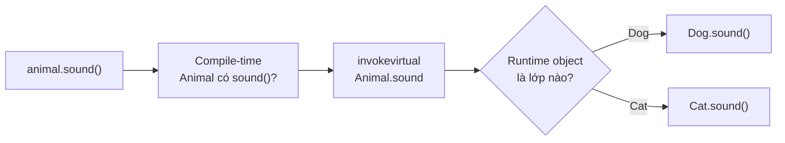
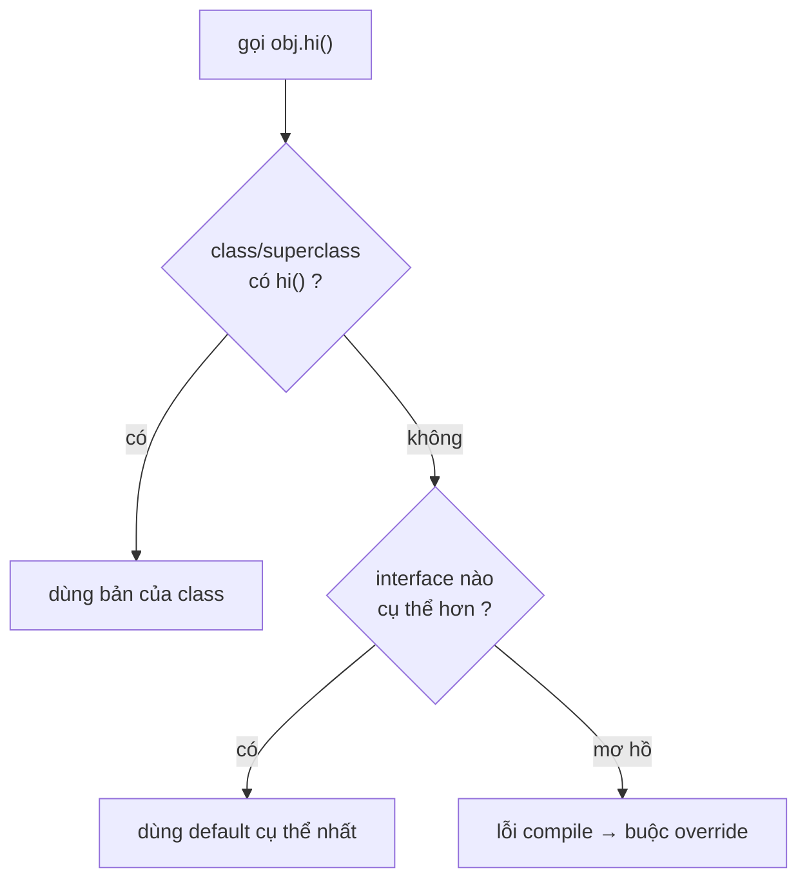

# 4 Tính chất OOP — Nhìn từ tầng JVM

Lập trình hướng đối tượng trong Java thường được trình bày qua encapsulation, inheritance, polymorphism và abstraction. Bốn khái niệm này mô tả cách quản lý trạng thái, tái sử dụng hành vi và làm việc qua hợp đồng chung.

## Mục lục

- [Tổng quan — đâu là 4 tính chất OOP?](#1-tổng-quan--đâu-là-4-tính-chất-oop)
- [Tính chất số 1 — Encapsulation](#2-tính-chất-oop-số-1--encapsulation-đóng-gói)
- [Tính chất số 2 — Inheritance](#3-tính-chất-oop-số-2--inheritance-kế-thừa)
- [Tính chất số 3 — Polymorphism](#4-tính-chất-oop-số-3--polymorphism-đa-hình)
- [Tính chất số 4 — Abstraction](#5-tính-chất-oop-số-4--abstraction-trừu-tượng)
- [So sánh & khi nào dùng cái nào](#6-so-sánh--khi-nào-dùng-cái-nào)
- [Anti-patterns cần tránh](#7-anti-patterns-cần-tránh)
- [Tóm tắt — Cheat sheet](#8-tóm-tắt--cheat-sheet)

---

## 1. Tổng quan — đâu là 4 tính chất OOP?

OOP có đúng **4 tính chất cốt lõi** trong phạm vi tài liệu này:

| Số | Tính chất | Câu hỏi mà nó trả lời | Ý chính |
|----|-----------|------------------------|---------|
| **1** | **Encapsulation — Đóng gói** | Ai được phép đọc hoặc thay đổi trạng thái? | Giấu state và bảo vệ invariant qua API có kiểm soát |
| **2** | **Inheritance — Kế thừa** | Lớp mới có quan hệ “is-a” với lớp nào? | Lớp con nhận state/hành vi từ lớp cha và có thể mở rộng chúng |
| **3** | **Polymorphism — Đa hình** | Cùng một lời gọi nhưng implementation nào sẽ chạy? | Chọn bản override theo object thật tại runtime |
| **4** | **Abstraction — Trừu tượng** | Người dùng cần biết điều gì và không cần biết điều gì? | Chỉ lộ hợp đồng cần thiết, ẩn chi tiết cài đặt |

Có thể nhớ bằng bốn động từ:

```text
Encapsulation → bảo vệ
Inheritance   → kế thừa
Polymorphism  → thay đổi hành vi
Abstraction   → ẩn chi tiết
```

> [!IMPORTANT]
> Bốn phần chính tiếp theo được ghi rõ **“Tính chất OOP số 1”** đến **“Tính chất OOP số 4”**. Overriding và overloading không phải tính chất thứ năm; chúng được giải thích bên trong phần Polymorphism để tránh nhầm lẫn.

Các tính chất này có giá trị khi chúng làm ranh giới thiết kế rõ hơn. Lạm dụng kế thừa hoặc tạo abstraction không có điểm biến đổi thường khiến code khó thay đổi hơn thay vì linh hoạt hơn.

## 2. Tính chất OOP số 1 — Encapsulation (Đóng gói)

**Encapsulation** = che giấu trạng thái nội bộ, chỉ expose hành vi qua interface công khai. Nhưng nói "tạo getter/setter cho mọi field" là **hiểu sai** bản chất.

### 2.1. Đóng gói thật sự = bảo vệ bất biến (invariant)

Một class được đóng gói tốt **không cho phép object rơi vào trạng thái không hợp lệ**:

```java
// Đóng gói TỆ — getter/setter mù quáng, không bảo vệ gì
public class BankAccount {
    private long balance;
    public long getBalance() { return balance; }
    public void setBalance(long b) { this.balance = b; }  // cho phép số âm!
}

// Đóng gói TỐT — bảo vệ invariant "balance >= 0"
public class BankAccount {
    private long balance;
    public long balance() { return balance; }
    public void withdraw(long amount) {
        if (amount <= 0) throw new IllegalArgumentException("amount > 0");
        if (amount > balance) throw new InsufficientFundsException();
        balance -= amount;          // chỉ thay đổi qua hành vi có kiểm soát
    }
}
```

Ở tầng bytecode, `private` được mã hoá bằng **access flag** `ACC_PRIVATE` (0x0002) trong constant pool của field. JVM **kiểm tra flag này lúc link/verify** — truy cập field private từ ngoài class sẽ ném `IllegalAccessError`.

> [!WARNING]
> `private` chỉ là rào ở mức ngôn ngữ + verifier. **Reflection** (`field.setAccessible(true)`) hoặc `Unsafe` có thể xuyên qua. Đóng gói trong Java là *hợp đồng*, không phải *hàng rào an ninh*. Module system (JPMS, Java 9+) với `--illegal-access=deny` mới thật sự chặn được reflection xuyên gói.

### 2.2. Bẫy "encapsulation rò rỉ" — trả về tham chiếu mutable

```java
public class Team {
    private final List<Player> players = new ArrayList<>();
    public List<Player> getPlayers() { return players; }   // 😱 rò rỉ!
}

team.getPlayers().clear();   // người ngoài xoá sạch list nội bộ
```

Field `private` nhưng vẫn bị thao túng vì bạn **trả về tham chiếu tới chính object nội bộ**. Sửa: trả về bản sao phòng thủ hoặc view bất biến.

```java
public List<Player> players() {
    return Collections.unmodifiableList(players);   // hoặc List.copyOf(players)
}
```

---

## 3. Tính chất OOP số 2 — Inheritance (Kế thừa)

**Inheritance** cho phép một class tái sử dụng và mở rộng class khác. Nhưng điều ít người để ý: kế thừa ảnh hưởng tới **bố cục bộ nhớ** của object và **thứ tự khởi tạo**.

### 3.1. Object layout — field cha nằm trước field con

Một `Dog extends Animal` được layout trong heap như sau (HotSpot, 64-bit, compressed oops):

```
┌──────────────────────────────────────┐  địa chỉ object Dog
│ Mark Word        (8 byte)            │  ← object header
│ Klass Pointer    (4 byte, nén)       │  ← trỏ tới metadata lớp Dog (chứa vtable)
├──────────────────────────────────────┤
│ field của Animal (vd: name)          │  ← field LỚP CHA nằm trước
├──────────────────────────────────────┤
│ field của Dog    (vd: breed)         │  ← field lớp con nằm sau
└──────────────────────────────────────┘
```

Field lớp cha luôn nằm trước → một tham chiếu `Animal a = dog` đọc field `name` ở **cùng offset** dù object thật là `Dog`. Đây là nền tảng để upcasting an toàn mà không cần copy.

### 3.2. Super constructor chaining — invokespecial

Constructor con **bắt buộc** gọi constructor cha (ngầm định `super()` nếu bạn không viết). Bytecode của `new Dog()`:

```
new Dog
dup
invokespecial Dog.<init>()V
   └─ trong Dog.<init>: aload_0; invokespecial Animal.<init>()V   ← gọi cha TRƯỚC
   └─ rồi mới khởi tạo field của Dog
```

> [!IMPORTANT]
> Constructor cha chạy **trước** khi field của con được khởi tạo. Bẫy kinh điển: gọi method bị override từ trong constructor cha sẽ chạy bản con — nhưng field con **chưa init**:
> ```java
> class A { A() { init(); } void init() {} }
> class B extends A { int x = 10; void init() { System.out.println(x); } }
> new B();   // in ra 0, KHÔNG phải 10 — vì x chưa được gán khi A.<init> chạy
> ```

### 3.3. Vì sao Java không đa kế thừa (class)?

Để tránh **diamond problem**: nếu `D` kế thừa `B` và `C` mà cả hai cùng kế thừa `A`, field `A.x` xuất hiện mấy lần trong layout của `D`? C++ giải quyết bằng virtual inheritance phức tạp. Java chọn đơn giản: **một class chỉ kế thừa một class**, nhưng implement **nhiều interface** (interface không có state nên không có vấn đề layout).

---

## 4. Tính chất OOP số 3 — Polymorphism (Đa hình)

Đừng bắt đầu bằng vtable. Trước hết, chỉ cần nhớ một câu:

> **Kiểu của biến quyết định method nào được phép gọi; kiểu thật của object quyết định bản override nào sẽ chạy.**

Ví dụ:

```java
class Animal {
    String sound() {
        return "?";
    }
}

class Dog extends Animal {
    @Override
    String sound() {
        return "Gâu";
    }
}

class Cat extends Animal {
    @Override
    String sound() {
        return "Meo";
    }
}

Animal animal = new Dog();
System.out.println(animal.sound()); // Gâu

animal = new Cat();
System.out.println(animal.sound()); // Meo
```

Trong câu `Animal animal = new Dog()` có hai kiểu khác nhau:

| Thành phần | Giá trị | Dùng để làm gì? |
|------------|---------|-----------------|
| Kiểu của biến, hay **kiểu tĩnh** | `Animal` | Compiler kiểm tra có được gọi `sound()` hay không |
| Kiểu của object, hay **kiểu runtime** | `Dog` | JVM chọn implementation thực sự sẽ chạy |

Vì `Animal` khai báo `sound()`, câu `animal.sound()` hợp lệ khi compile. Khi chạy, object đang được tham chiếu là `Dog`, nên `Dog.sound()` được gọi. Việc chọn method tại runtime này gọi là **dynamic dispatch**.

### 4.1. Từ lời gọi Java đến `invokevirtual`

Với lời gọi `animal.sound()`, bytecode có dạng rút gọn:

```text
aload_1
invokevirtual Animal.sound:()Ljava/lang/String;
```

Dòng `Animal.sound` trong bytecode dễ gây hiểu nhầm. Nó **không có nghĩa** JVM luôn chạy `Animal.sound()`. `Animal` là lớp mà compiler dùng để xác nhận lời gọi và ghi tham chiếu method vào bytecode.

Khi thực thi `invokevirtual`, có thể hình dung JVM làm bốn bước:

1. Lấy tham chiếu `animal` trên operand stack.
2. Kiểm tra object thật mà tham chiếu đang trỏ tới — ví dụ `Dog`.
3. Tìm implementation cụ thể nhất của `sound()` cho `Dog`.
4. Chạy `Dog.sound()`.



> [!IMPORTANT]
> `Animal` quyết định **có được gọi** `sound()`; `Dog` hoặc `Cat` quyết định **bản nào chạy**. Đây là ý nghĩa cốt lõi của polymorphism trong ví dụ này.

### 4.2. Vtable giúp chọn method nhanh như thế nào?

Nếu mỗi lần gọi JVM phải tìm method theo tên từ `Dog` lên `Animal` rồi lên `Object`, dispatch sẽ tốn kém. JVM thường tổ chức các virtual method thành một bảng gọi là **vtable** (*virtual method table*).

Hãy coi mỗi method là một ô có số thứ tự cố định:

| Vtable slot | `Animal` | `Dog` | `Cat` |
|-------------|----------|-------|-------|
| `sound()` | `Animal.sound` | `Dog.sound` | `Cat.sound` |
| `describe()` | `Animal.describe` | `Animal.describe` | `Animal.describe` |

Khi lớp con override một method, nó **thay địa chỉ method ở cùng slot**:

- `Dog` override `sound()` → slot `sound` trỏ tới `Dog.sound`.
- `Dog` không override `describe()` → slot `describe` vẫn trỏ tới `Animal.describe`.

Object `Dog` chứa thông tin để JVM biết nó thuộc lớp `Dog`. Từ metadata của lớp, JVM có thể đến vtable và lấy đúng slot:

```text
tham chiếu animal
       │
       ▼
┌──────────────────┐
│ object Dog       │
│ class → Dog      │
└────────┬─────────┘
         │
         ▼
┌──────────────────┐
│ vtable của Dog   │
│ sound → Dog.sound│
└──────────────────┘
```

Do đó có thể ghi nhớ `invokevirtual` theo mô hình đơn giản sau:

```text
object thật → class thật → slot method trong vtable → implementation cần chạy
```

> [!NOTE]
> JVM Specification quy định **kết quả của method lookup**, không bắt buộc JVM phải cài đặt bằng vtable. Vtable là mô hình triển khai phổ biến trong HotSpot và là cách trực quan để hiểu dispatch.

### 4.3. Điều gì được dispatch động, điều gì không?

Dynamic dispatch áp dụng cho **instance method có thể override**. Nó không áp dụng giống vậy cho field và `static` method:

```java
class Animal {
    String label = "Animal";

    static String kind() {
        return "Animal";
    }

    String sound() {
        return "?";
    }
}

class Dog extends Animal {
    String label = "Dog";

    static String kind() {
        return "Dog";
    }

    @Override
    String sound() {
        return "Gâu";
    }
}

Animal animal = new Dog();

System.out.println(animal.label);   // Animal
System.out.println(animal.kind());  // Animal — hợp lệ nhưng không nên viết
System.out.println(animal.sound()); // Gâu
```

| Thành phần | Cách chọn | Kết quả trong ví dụ |
|------------|-----------|---------------------|
| Instance method override | Theo kiểu runtime của object | `Dog.sound()` |
| Field | Theo kiểu tĩnh của biến | `Animal.label` |
| `static` method | Theo kiểu tĩnh tại compile-time | `Animal.kind()` |

Field chỉ bị **che** (*field hiding*), còn `static` method chỉ bị **ẩn** (*method hiding*), không override theo nghĩa đa hình. `animal.kind()` được compiler hiểu như `Animal.kind()`, không dispatch sang `Dog.kind()`. Vì vậy nên viết trực tiếp `Animal.kind()` để tránh gây hiểu nhầm.

### 4.4. Interface dùng `invokeinterface`

Cùng một nguyên tắc cũng áp dụng khi biến có kiểu interface:

```java
interface Speaker {
    String sound();
}

class Dog implements Speaker {
    @Override
    public String sound() {
        return "Gâu";
    }
}

Speaker speaker = new Dog();
speaker.sound(); // chạy Dog.sound()
```

Bytecode thường dùng `invokeinterface` thay vì `invokevirtual`. JVM phải tìm implementation của method interface trong lớp thật; HotSpot có thể dùng cấu trúc như **itable** (*interface method table*) và các cache hỗ trợ dispatch.

Điểm cần nhớ không đổi:

```text
Speaker quyết định lời gọi hợp lệ
Dog quyết định implementation chạy ở runtime
```

### 4.5. JIT có thể bỏ luôn bước tra bảng

Sau một thời gian chạy, JIT quan sát kiểu object xuất hiện tại từng call site:

- Chỉ gặp `Dog` (**monomorphic**) → JIT có thể inline trực tiếp `Dog.sound()`.
- Thường gặp `Dog` và `Cat` (**bimorphic**) → JIT có thể tạo vài phép kiểm tra kiểu nhanh rồi inline.
- Gặp quá nhiều kiểu (**megamorphic**) → thường phải giữ lời gọi gián tiếp.

Vì vậy vtable giải thích đúng **ngữ nghĩa dispatch**, nhưng code máy sau khi JIT tối ưu không nhất thiết còn thực hiện một lần tra vtable ở mọi lời gọi.

> [!TIP]
> Dùng `final` khi thiết kế yêu cầu class hoặc method không được override. Ngoài việc thể hiện ý định rõ ràng, nó còn làm đích gọi dễ xác định hơn; tuy nhiên JIT cũng có thể tự khử dispatch dựa trên dữ liệu profiling mà không cần `final`.

### 4.6. Tóm tắt luồng dispatch

```text
Animal animal = new Dog();
animal.sound();

Compile-time: Animal có sound() không?  → Có, cho phép compile
Bytecode:     invokevirtual Animal.sound
Runtime:      object thật là Dog         → chọn Dog.sound()
JIT:          nếu call site ổn định       → có thể inline Dog.sound()
```

Nếu chỉ nhớ một dòng, hãy nhớ:

```text
Kiểu biến kiểm tra lời gọi; kiểu object chọn bản override.
```

### 4.7. Overriding vs Overloading — runtime vs compile-time

Hai khái niệm dễ nhầm vì tên giống nhau, nhưng được giải quyết ở **hai thời điểm khác nhau**:

| Tiêu chí | Overriding (ghi đè) | Overloading (nạp chồng) |
|----------|---------------------|--------------------------|
| Quan hệ | Cùng signature, lớp con vs cha | Cùng tên, **khác** tham số |
| Quyết định ở | **Runtime** (dynamic dispatch) | **Compile-time** (kiểu tĩnh) |
| Bytecode | vtable slot phụ thuộc object thật | compiler chọn sẵn method cụ thể |
| Polymorphism? | Có (đa hình thực) | Không (chỉ là cú pháp tiện) |

Bẫy overloading + `null`:

```java
void f(String s) {}
void f(Object o) {}
f(null);   // gọi f(String) — compiler chọn signature CỤ THỂ nhất, lúc biên dịch
```

Bẫy overloading + autoboxing — compiler ưu tiên: **widening > boxing > varargs**:

```java
void g(long x) {}
void g(Integer x) {}
g(1);   // gọi g(long) — widening int→long được ưu tiên hơn boxing int→Integer
```

> [!WARNING]
> Overloading **không** là đa hình. `List<Object> list` chứa `Dog`, gọi `process(list.get(0))` với `process(Dog)`/`process(Cat)` overload → luôn chọn theo kiểu tĩnh `Object`, **không** theo object thật. Muốn dispatch theo kiểu thật giữa nhiều loại, dùng overriding hoặc pattern matching (Java 21).

---

## 5. Tính chất OOP số 4 — Abstraction (Trừu tượng)

**Abstraction** = lộ "cái gì làm được" (hành vi), giấu "làm thế nào" (cài đặt). Java có 2 công cụ: `abstract class` và `interface`.

### 5.1. Khác biệt cốt lõi

| | `abstract class` | `interface` |
|---|------------------|-------------|
| State (field instance) | Có | Không (chỉ `static final`) |
| Constructor | Có | Không |
| Đa kế thừa | Không (1 class) | Có (nhiều interface) |
| Method có thân | Có (cả non-abstract) | `default` / `static` / `private` (Java 8/9+) |
| Dùng khi | "is-a" + chia sẻ state/code | "can-do" + hợp đồng hành vi |

### 5.2. Default method & bài toán đa kế thừa hành vi

Java 8 thêm `default` method vào interface → tái xuất hiện **diamond problem** ở mức hành vi. Nếu hai interface có cùng default method, lớp implement **bắt buộc** phải override để khử mơ hồ:

```java
interface A { default String hi() { return "A"; } }
interface B { default String hi() { return "B"; } }
class C implements A, B {
    @Override public String hi() {
        return A.super.hi();   // chỉ định rõ muốn dùng default của A
    }
}
```

Quy tắc giải quyết của compiler (theo thứ tự ưu tiên):

1. **Class luôn thắng** — method trong class (hoặc cha) > default method.
2. **Interface cụ thể hơn thắng** — `B extends A`, default của `B` > của `A`.
3. Còn lại → mơ hồ → **bắt buộc override**.



> [!NOTE]
> `default` method sinh ra để **tiến hoá interface mà không phá vỡ code cũ** (vd thêm `stream()` vào `Collection`). Đừng lạm dụng nó như "trait có state" — interface vẫn không có field instance.

---

## 6. So sánh & khi nào dùng cái nào

| Tình huống | Chọn | Lý do |
|------------|------|-------|
| Nhiều lớp chia sẻ **state + code** chung | `abstract class` | interface không có field |
| Chỉ cần định nghĩa **hợp đồng** | `interface` | nhẹ, đa kế thừa |
| Object cần **nhiều "vai trò"** | nhiều `interface` | `Comparable` + `Serializable` + ... |
| Muốn thêm method vào interface đã publish | `default` method | không phá code client |
| Hành vi thay đổi theo runtime type | overriding (polymorphism) | dynamic dispatch |
| Nhiều cách gọi cùng một thao tác | overloading | tiện cú pháp, không phải đa hình |

**Nguyên tắc thực dụng:** ưu tiên `interface` cho API public (dễ tiến hoá, dễ mock test), dùng `abstract class` khi thật sự cần chia sẻ state/implementation.

---

## 7. Anti-patterns cần tránh

| Anti-pattern | Vì sao sai | Thay bằng |
|--------------|-----------|-----------|
| Getter/setter cho mọi field | Phá đóng gói, không bảo vệ invariant | Expose hành vi, không expose state |
| Trả về collection nội bộ trực tiếp | Người ngoài sửa được state private | `List.copyOf` / `unmodifiableList` |
| Gọi method override trong constructor cha | Field con chưa init → NPE/giá trị 0 | Khởi tạo xong rồi mới gọi |
| Kế thừa để tái sử dụng code (không "is-a") | Vỡ Liskov, coupling chặt | Composition (delegate) |
| Lạm dụng overloading gây mơ hồ | `null`/autoboxing chọn sai overload | Đặt tên method khác nhau |
| `abstract class` chỉ để chứa hằng số | Không có state thật | `interface` hoặc class util |

> [!TIP]
> "Favor composition over inheritance" — kế thừa tạo coupling cứng giữa cha-con, lớp cha đổi là con vỡ. Composition (chứa object khác và uỷ quyền) linh hoạt hơn và tránh phần lớn vấn đề của 4 tính chất.

---

## 8. Tóm tắt — Cheat sheet

**4 tính chất ↔ cơ chế JVM:**

```
Encapsulation  → ACC_PRIVATE access flag + verifier; bảo vệ invariant
Inheritance    → object layout (field cha trước) + invokespecial gọi <init> cha
Polymorphism   → invokevirtual + vtable (slot cố định) / invokeinterface + itable
Abstraction    → abstract method (no body) + default method resolution rule
```

| Khái niệm | Thời điểm quyết định | Cơ chế |
|-----------|---------------------|--------|
| Overriding | Runtime | vtable lookup theo object thật |
| Overloading | Compile-time | chọn signature theo kiểu tĩnh |
| default method conflict | Compile-time | class wins → specific wins → buộc override |

**5 nguyên tắc khắc cốt:**

1. **Đóng gói = bảo vệ bất biến**, không phải sinh getter/setter máy móc.
2. **Constructor cha chạy trước** — đừng gọi method ảo trong đó.
3. **Overriding = runtime, overloading = compile-time** — đừng nhầm lẫn.
4. **invokevirtual chọn method theo object thật**, không theo kiểu biến.
5. **Composition > Inheritance** khi quan hệ không thật sự là "is-a".

> [!TIP]
> Một câu để nhớ: **Encapsulation bảo vệ state; Inheritance tạo quan hệ cha–con; Polymorphism chọn hành vi theo object thật; Abstraction chỉ lộ hợp đồng cần thiết.**
