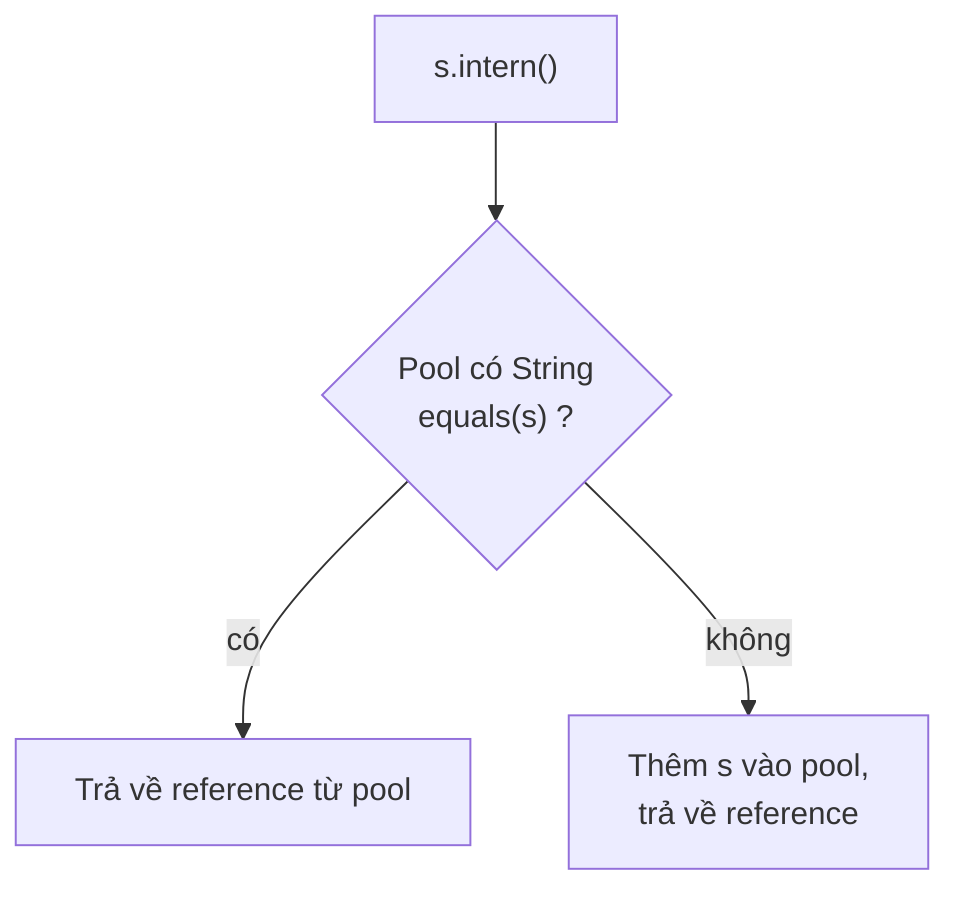

## Mục lục

- [Bối cảnh: Full GC 4 giây — 2 triệu String duplicate chiếm 60% heap](#1-bối-cảnh-full-gc-4-giây--2-triệu-string-duplicate-chiếm-60-heap)
- [String là gì — cấu trúc nội bộ qua các phiên bản JDK](#2-string-là-gì--cấu-trúc-nội-bộ-qua-các-phiên-bản-jdk)
- [Tại sao String immutable — 5 lý do thiết kế](#3-tại-sao-string-immutable--5-lý-do-thiết-kế)
- [String Pool — intern table và intern()](#4-string-pool--intern-table-và-intern)
- [Compact Strings JDK 9 — tiết kiệm 50% bộ nhớ](#5-compact-strings-jdk-9--tiết-kiệm-50-bộ-nhớ)
- [String Concatenation — từ StringBuilder đến invokedynamic](#6-string-concatenation--từ-stringbuilder-đến-invokedynamic)
- [StringBuilder vs StringBuffer — khi nào dùng cái nào](#7-stringbuilder-vs-stringbuffer--khi-nào-dùng-cái-nào)
- [G1 String Deduplication — JVM tự xoá duplicate](#8-g1-string-deduplication--jvm-tự-xoá-duplicate)
- [== vs equals — bẫy kinh điển](#9--vs-equals--bẫy-kinh-điển)
- [Anti-patterns & Tóm tắt](#10-anti-patterns--tóm-tắt)

---

## 1. Bối cảnh: Full GC 4 giây — 2 triệu String duplicate chiếm 60% heap

Service nhận JSON event từ Kafka, parse rồi lưu vào list:

```java
List<Event> events = new ArrayList<>();

void onMessage(String json) {
    Event event = objectMapper.readValue(json, Event.class);
    events.add(event);
}
```

Mỗi `Event` có field `country` (String). 90% traffic từ `"VN"`, 8% từ `"US"`, 2% còn lại. Nhưng Jackson parse tạo **String mới** mỗi lần → 1 triệu event = 900.000 String `"VN"` **khác nhau** (khác reference, cùng nội dung).

Heap dump:
```
Class                 | Instances | Shallow Size | Retained Size
java.lang.String      | 2,100,000 | 50 MB        | 680 MB (60% heap!)
  └─ byte[] (backing) | 2,100,000 | 630 MB       |
```

900.000 String `"VN"` × (header 16B + byte[] 2B + array header 16B) ≈ **30 MB** chỉ cho 2 ký tự lặp đi lặp lại.

Fix: `event.setCountry(event.getCountry().intern())` → tất cả `"VN"` trỏ cùng 1 instance → heap giảm 40%.

> [!IMPORTANT]
> String thường chiếm **25-40% heap** của ứng dụng Java. Hiểu String Pool, intern, compact string, và deduplication là chìa khoá tối ưu bộ nhớ.

---

## 2. String là gì — cấu trúc nội bộ qua các phiên bản JDK

### JDK 8 trở về trước

```java
public final class String {
    private final char[] value;    // UTF-16: mỗi ký tự 2 byte
    private int hash;              // cached hashCode (default 0)
    // Mỗi String = 1 object header (16B) + char[] (16B header + 2B × length)
}
```

### JDK 9+ (Compact Strings)

```java
public final class String {
    private final byte[] value;    // backing array (LATIN1 hoặc UTF16)
    private final byte coder;      // 0 = LATIN1 (1 byte/char), 1 = UTF16 (2 byte/char)
    private int hash;
    private boolean hashIsZero;    // JDK 15+: phân biệt hash=0 chưa tính vs hash thật sự = 0
}
```

| JDK | Backing | Ký tự ASCII `"hello"` | Ký tự Unicode `"xin chào"` |
|-----|---------|----------------------|---------------------------|
| 8 | `char[]` | 5 char × 2B = **10 bytes** | 9 char × 2B = **18 bytes** |
| 9+ | `byte[]` + coder | 5 byte × 1B = **5 bytes** (LATIN1) | 9 char × 2B = **18 bytes** (UTF16) |

> [!NOTE]
> `String` là `final class` — không thể extends. `value` là `final` — reference không đổi sau constructor (nhưng xem mục 3 về reflection hack).

---

## 3. Tại sao String immutable — 5 lý do thiết kế

| # | Lý do | Giải thích |
|---|-------|-----------|
| 1 | **String Pool** | Nhiều reference trỏ cùng object → nếu mutable, sửa 1 chỗ ảnh hưởng tất cả |
| 2 | **hashCode caching** | `hash` tính 1 lần, cache mãi. Nếu mutable → hash đổi → HashMap hỏng |
| 3 | **Thread safety** | Immutable = tự động thread-safe, không cần synchronization |
| 4 | **Security** | Class name, file path, URL, JDBC connection string — nếu mutable, code downstream có thể đổi giá trị |
| 5 | **Class loading** | JVM dùng String để tìm class. Nếu class name bị đổi giữa chừng → undefined behavior |

### 3.1. Reflection hack — "sửa" String immutable

```java
String s = "hello";
Field field = String.class.getDeclaredField("value");
field.setAccessible(true);  // bypass private
byte[] value = (byte[]) field.get(s);
value[0] = 'H';  // s giờ là "Hello" — NHƯNG mọi nơi dùng "hello" cũng bị đổi!
```

> [!WARNING]
> **Không bao giờ** làm điều này trong production. JDK 16+ module system chặn `setAccessible` mặc định (`InaccessibleObjectException`). Đây chỉ để minh hoạ rằng immutability là **convention** được JVM enforce, không phải magic.

---

## 4. String Pool — intern table và intern()

### 4.1. String Pool là gì

String Pool (hay String Intern Table) là **HashTable** native trong JVM (HotSpot: `StringTable`) lưu trữ các String unique. Khi tạo string literal, JVM check pool trước:

```java
String a = "hello";        // (1) tạo "hello" trong pool (nếu chưa có), a trỏ vào pool
String b = "hello";        // (2) tìm thấy "hello" trong pool, b trỏ cùng object
// a == b → true (cùng reference)

String c = new String("hello");  // (3) tạo object MỚI trên heap, KHÔNG vào pool
// c == a → false (khác reference, dù nội dung bằng nhau)

String d = c.intern();     // (4) đẩy vào pool (đã có → trả về reference pool)
// d == a → true
```

### 4.2. intern() hoạt động thế nào



- **JDK 7+**: String Pool nằm trên **heap** (trước đó ở PermGen). Nghĩa là pooled strings **có thể** bị GC nếu không còn reference.
- `StringTable` size mặc định: `60013` (JDK 17). Tuning: `-XX:StringTableSize=1000003` (số nguyên tố → phân tán hash tốt hơn).

### 4.3. Khi nào nên/không nên intern

| Nên | Không nên |
|-----|-----------|
| Field có ít giá trị lặp lại nhiều lần (country code, status, enum name) | String từ user input (unique → pool phình ra, GC pressure) |
| Giảm memory khi giữ hàng triệu object | String chỉ dùng 1 lần rồi bỏ |

> [!TIP]
> Thay vì `intern()` thủ công, dùng **enum** hoặc **HashMap dedup**: `Map<String, String> cache; value = cache.computeIfAbsent(value, Function.identity())`. Kiểm soát size tốt hơn intern table.

---

## 5. Compact Strings JDK 9 — tiết kiệm 50% bộ nhớ

### 5.1. Ý tưởng

Hầu hết String trong ứng dụng phương Tây là ASCII/Latin-1 (1 byte/char đủ). JDK 8 dùng `char[]` (2 byte/char) → lãng phí 50% cho ASCII string.

JDK 9 thay `char[]` bằng `byte[]` + `coder` flag:
- `coder = LATIN1 (0)`: mỗi ký tự 1 byte → **tiết kiệm 50%**
- `coder = UTF16 (1)`: mỗi ký tự 2 byte → như cũ

### 5.2. Khi nào LATIN1 vs UTF16

```java
String ascii = "hello";    // coder = LATIN1 → byte[5]
String vn = "xin chào";   // 'à' > 0xFF → coder = UTF16 → byte[18]
String mix = "hello" + "à"; // concat → UTF16 (cả string chuyển sang UTF16)
```

> [!NOTE]
> Compact Strings **mặc định bật** từ JDK 9. Tắt: `-XX:-CompactStrings`. Benchmark cho thấy lợi ích bộ nhớ lớn (20-30% heap reduction cho ứng dụng điển hình) với overhead CPU không đáng kể.

---

## 6. String Concatenation — từ StringBuilder đến invokedynamic

### 6.1. JDK 8 — compiler tạo StringBuilder

```java
String s = "Hello " + name + "!";

// Compiler (javac) biến thành:
String s = new StringBuilder().append("Hello ").append(name).append("!").toString();
```

Vấn đề: trong vòng lặp:
```java
String result = "";
for (String s : list) {
    result += s;    // mỗi iteration: new StringBuilder → append → toString → new String
}
// O(n²) vì mỗi lần tạo String mới copy toàn bộ nội dung cũ
```

### 6.2. JDK 9+ — invokedynamic (StringConcatFactory)

JDK 9 thay thế StringBuilder bằng `invokedynamic` + `StringConcatFactory`:

```java
String s = "Hello " + name + "!";

// Bytecode:
invokedynamic #makeConcatWithConstants("Hello \u0001!")  // \u0001 = placeholder
```

JVM bootstrap `StringConcatFactory.makeConcatWithConstants()` tạo **strategy tối ưu** tại runtime:
- Tính trước size → allocate `byte[]` đúng kích thước → copy trực tiếp → **không** tạo StringBuilder tạm
- Có thể dùng `Unsafe.allocateInstance` để skip constructor overhead

| JDK | Cơ chế | Ưu điểm |
|-----|--------|---------|
| 8 | `StringBuilder` | Hiểu dễ, profile dễ |
| 9+ | `invokedynamic` | **Nhanh hơn** (ít allocation), JVM tự tối ưu strategy |

> [!IMPORTANT]
> Dù JDK 9+ tối ưu `+`, **vòng lặp concat** vẫn nên dùng `StringBuilder` explicit. `invokedynamic` tối ưu **từng biểu thức** concat, không tối ưu **across iterations**.

---

## 7. StringBuilder vs StringBuffer — khi nào dùng cái nào

| Tiêu chí | `StringBuilder` | `StringBuffer` |
|----------|-----------------|----------------|
| Thread-safe | **Không** | Có (mọi method `synchronized`) |
| Hiệu năng | **Nhanh** | Chậm hơn (lock overhead) |
| Khi nào dùng | **Mặc định** — hầu hết trường hợp | Cần build string từ nhiều thread (rất hiếm) |

### 7.1. Cấu trúc nội bộ

```java
abstract class AbstractStringBuilder {
    byte[] value;      // buffer, KHÔNG final — resize được
    byte coder;        // LATIN1 hoặc UTF16
    int count;         // số byte đã dùng

    // Khi append vượt capacity:
    private void ensureCapacityInternal(int minimumCapacity) {
        int oldCapacity = value.length >> coder;
        if (minimumCapacity > oldCapacity) {
            int newCapacity = (oldCapacity << 1) + 2;  // gấp đôi + 2
            // ... allocate new array, copy old data
        }
    }
}
```

### 7.2. Capacity tuning

```java
// Mặc định: capacity = 16 characters
StringBuilder sb = new StringBuilder();

// Nếu biết trước kích thước:
StringBuilder sb = new StringBuilder(1000);  // tránh resize

// sb.append("hello")  → count = 5, capacity = 16
// sb.append(950 chars) → resize: 16 → 34 → 70 → 142 → 286 → 574 → 1150
// Nếu set 1000 từ đầu → 0 lần resize
```

> [!TIP]
> Set `initialCapacity` khi biết trước output size (giống HashMap initialCapacity). Mỗi lần resize = allocate mảng mới + copy → O(n). Nhiều lần resize = nhiều mảng tạm → GC pressure.

---

## 8. G1 String Deduplication — JVM tự xoá duplicate

### 8.1. Cơ chế

G1 GC (JDK 8u20+) có thể **tự động** phát hiện String có cùng nội dung `byte[]` và **chia sẻ** backing array:

```
Trước dedup:
  String "VN" (obj1) → byte[] {86, 78} (array1)
  String "VN" (obj2) → byte[] {86, 78} (array2)  ← duplicate byte[]

Sau dedup:
  String "VN" (obj1) → byte[] {86, 78} (shared)
  String "VN" (obj2) ──────┘                      ← array2 freed by GC
```

### 8.2. Bật deduplication

```bash
java -XX:+UseG1GC -XX:+UseStringDeduplication -jar app.jar
```

- Chỉ hoạt động với **G1 GC** (và **ZGC** từ JDK 18+)
- Chạy **concurrent** — không tăng pause time
- Chỉ dedup String đã survive **ít nhất 1 Young GC** (tránh dedup string tạm)

### 8.3. Monitoring

```bash
-XX:+PrintStringDeduplicationStatistics  # JDK 8
-Xlog:stringdedup*                       # JDK 9+
```

```
[StringDeduplication] Deduplicated: 1,234,567 strings
  Total: 123.4 MB → 45.6 MB (63.0% reduction)
```

> [!NOTE]
> String Deduplication chia sẻ `byte[]` nhưng **không** giảm số String object. Nếu cần giảm cả object count, dùng `intern()` hoặc enum. Dedup + Compact Strings = double win cho ứng dụng có nhiều string duplicate.

---

## 9. == vs equals — bẫy kinh điển

```java
String a = "hello";
String b = "hello";
String c = new String("hello");
String d = c.intern();

a == b          // true  — cùng pool object
a == c          // false — c trên heap, a trong pool
a.equals(c)     // true  — nội dung giống
a == d          // true  — d = intern() → trả về pool object = a

"hello" == "hel" + "lo"   // true  — compiler optimize constant folding
"hello" == "hel" + name   // false — runtime concat tạo object mới
```

### 9.1. Integer.valueOf cache tương tự

```java
Integer a = 127;
Integer b = 127;
a == b;         // true — Integer cache [-128, 127]

Integer c = 128;
Integer d = 128;
c == d;         // false — ngoài cache → 2 object khác nhau
```

> [!WARNING]
> **Luôn** dùng `.equals()` để so sánh String (và wrapper types). `==` chỉ so reference, không so nội dung. Duy nhất `==` đáng tin khi so với `null` hoặc enum.

---

## 10. Anti-patterns & Tóm tắt

### Anti-patterns

| Anti-pattern | Vì sao sai | Sửa |
|--------------|-----------|-----|
| `result += s` trong vòng lặp | O(n²) — tạo String mới mỗi lần | `StringBuilder` explicit |
| `new String("literal")` | Tạo object thừa trên heap | Dùng literal trực tiếp |
| `intern()` cho mọi String | Pool phình ra, GC pressure | Chỉ intern field có ít giá trị unique lặp nhiều |
| So sánh String bằng `==` | So reference không phải nội dung | `.equals()` hoặc `Objects.equals()` |
| `StringBuffer` cho single-thread | Synchronized overhead vô ích | `StringBuilder` |
| Không set StringBuilder capacity | Nhiều lần resize → GC | Estimate size, set initialCapacity |
| Dùng String cho password | Nằm trong pool, không clear được | `char[]` — clear sau khi dùng |

### Tóm tắt — Cheat sheet

```
String = final class, immutable, backing byte[] (JDK 9+)

1. Immutable vì: pool sharing, hashCode cache, thread-safe, security
2. String Pool: literal tự vào pool; new String() KHÔNG vào pool; intern() đẩy vào
3. Compact Strings (JDK 9+): LATIN1 (1B/char) vs UTF16 (2B/char) → tiết kiệm ~50%
4. Concat: JDK 8 = StringBuilder; JDK 9+ = invokedynamic (nhanh hơn)
5. Loop concat: LUÔN dùng StringBuilder explicit
6. G1 Dedup: -XX:+UseStringDeduplication → chia sẻ byte[] giữa String duplicate
7. == so reference, equals so nội dung — LUÔN dùng equals
```

| Cần gì | Dùng gì |
|--------|---------|
| Build string trong loop | `StringBuilder` (set initialCapacity) |
| Giảm memory cho field lặp nhiều | `intern()`, enum, hoặc custom dedup map |
| Giảm heap tự động | G1 Dedup + Compact Strings |
| So sánh String | `.equals()` — KHÔNG BAO GIỜ `==` |
| Password/secret | `char[]` — zero-fill sau khi dùng |

> [!TIP]
> Một câu để nhớ: *String chiếm 30% heap, nhưng đa số ứng dụng không bao giờ nhìn vào.* Compact Strings + G1 Dedup + intern đúng chỗ có thể giảm 40-60% memory cho String-heavy workload mà không đổi 1 dòng business logic.
