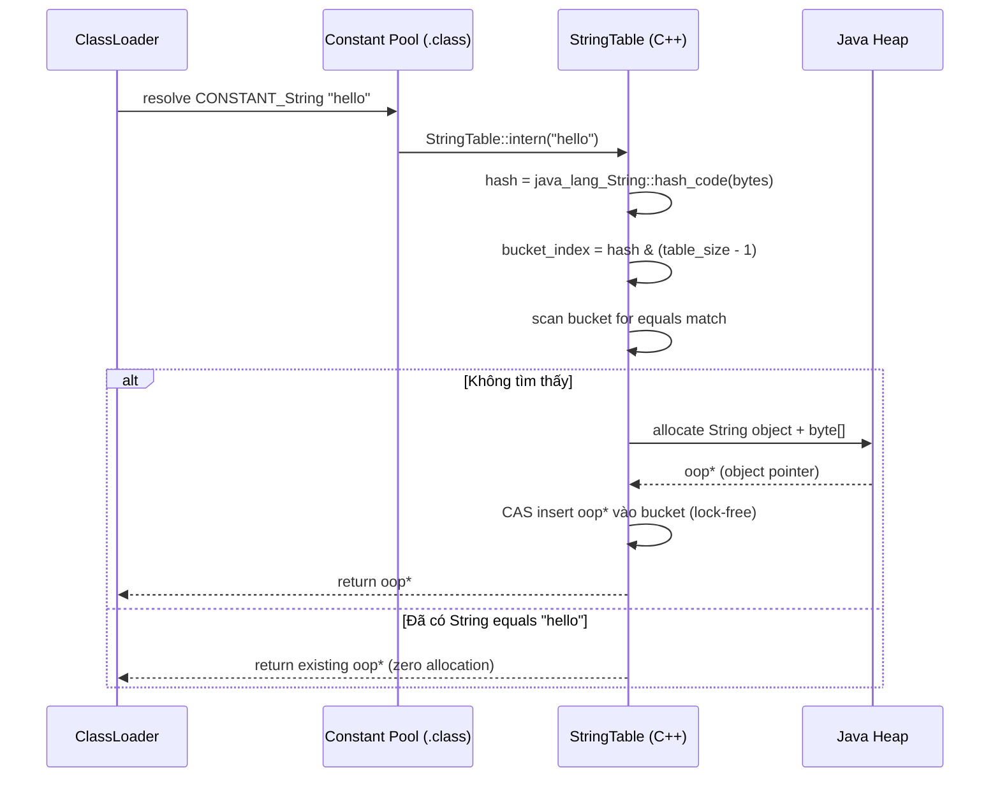
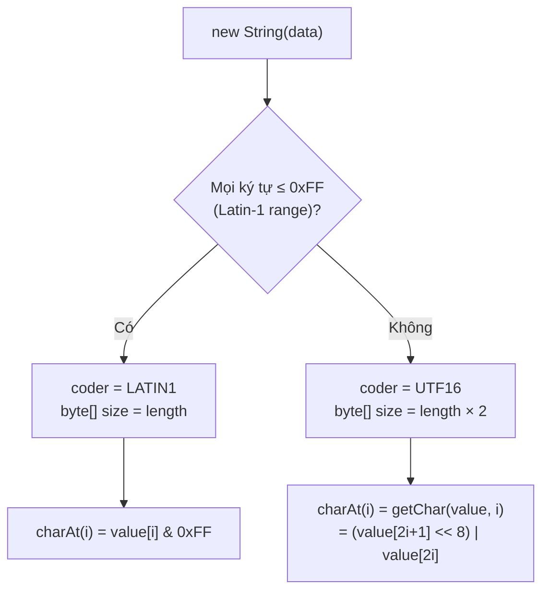
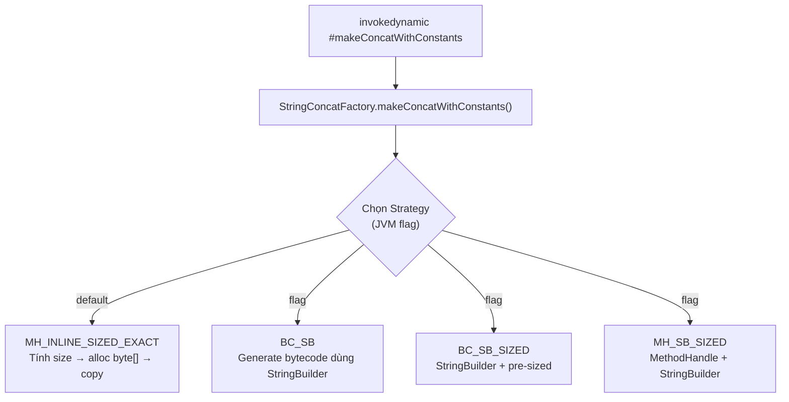
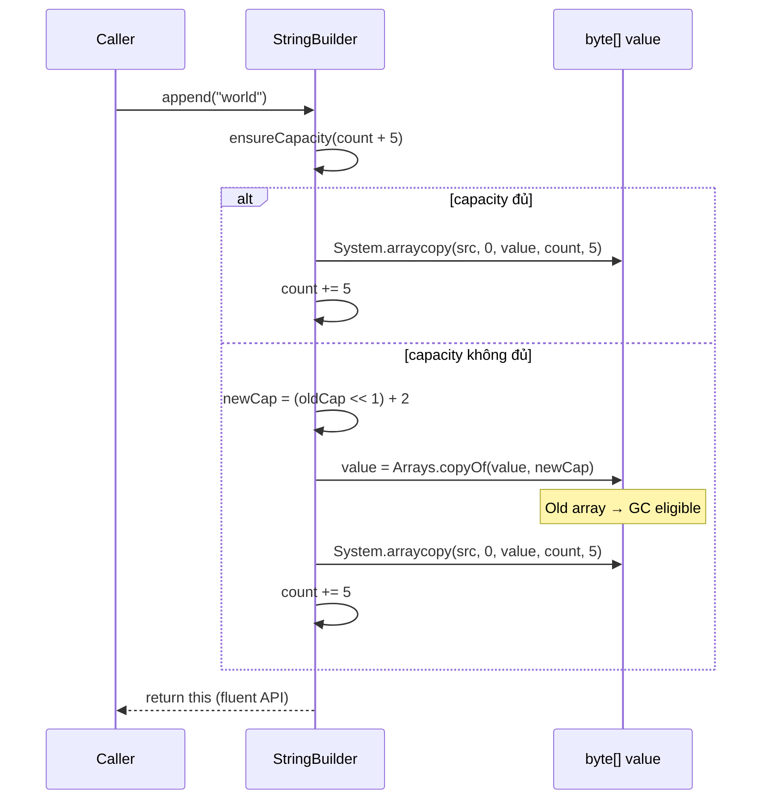
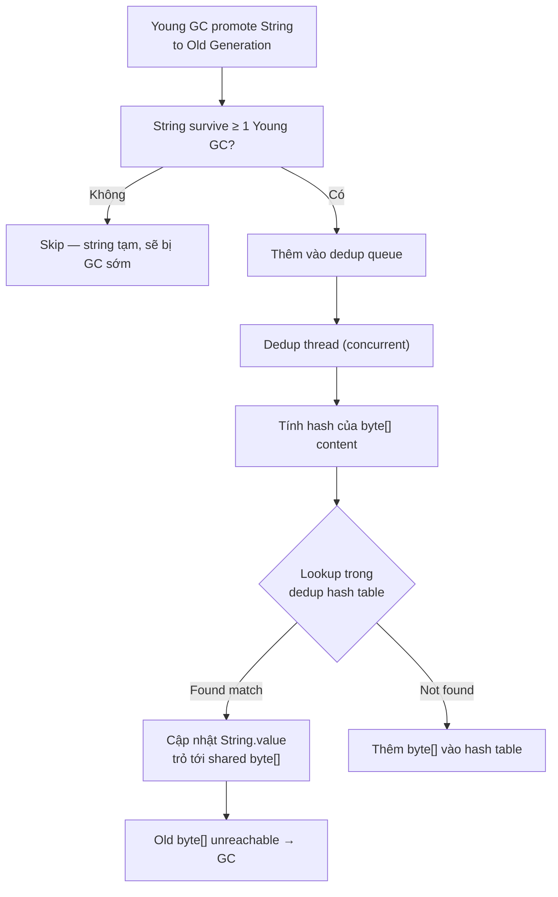

## Mục lục

- [Bối cảnh: Full GC 4 giây — 2 triệu String duplicate chiếm 60% heap](#1-bối-cảnh-full-gc-4-giây--2-triệu-string-duplicate-chiếm-60-heap)
- [String là gì — cấu trúc nội bộ qua các phiên bản JDK](#2-string-là-gì--cấu-trúc-nội-bộ-qua-các-phiên-bản-jdk)
- [Tại sao String immutable — 5 lý do thiết kế](#3-tại-sao-string-immutable--5-lý-do-thiết-kế)
- [String Pool — intern table và intern()](#4-string-pool--intern-table-và-intern)
- [Compact Strings JDK 9 — tiết kiệm 50% bộ nhớ](#5-compact-strings-jdk-9--tiết-kiệm-50-bộ-nhớ)
- [String Concatenation — từ StringBuilder đến invokedynamic](#6-string-concatenation--từ-stringbuilder-đến-invokedynamic)
- [StringBuilder vs StringBuffer — khi nào dùng cái nào](#7-stringbuilder-vs-stringbuffer--khi-nào-dùng-cái-nào)
- [hashCode() — tính toán và caching nội bộ](#8-hashcode--tính-toán-và-caching-nội-bộ)
- [G1 String Deduplication — JVM tự xoá duplicate](#9-g1-string-deduplication--jvm-tự-xoá-duplicate)
- [== vs equals — bẫy kinh điển](#10--vs-equals--bẫy-kinh-điển)
- [Anti-patterns & Tóm tắt](#11-anti-patterns--tóm-tắt)

---

## 1. Bối cảnh: Full GC 4 giây — 2 triệu String duplicate chiếm 60% heap

Service nhận JSON event từ Kafka, parse rồi lưu vào list:

```java
List<Event> events = new ArrayList<>();

void onMessage(String json) {
    Event event = objectMapper.readValue(json, Event.class);
    events.add(event);
}
```

Mỗi `Event` có field `country` (String). 90% traffic từ `"VN"`, 8% từ `"US"`, 2% còn lại. Nhưng Jackson parse tạo **String mới** mỗi lần → 1 triệu event = 900.000 String `"VN"` **khác nhau** (khác reference, cùng nội dung).

Heap dump:
```
Class                 | Instances | Shallow Size | Retained Size
java.lang.String      | 2,100,000 | 50 MB        | 680 MB (60% heap!)
  └─ byte[] (backing) | 2,100,000 | 630 MB       |
```

900.000 String `"VN"` × (header 16B + byte[] 2B + array header 16B) ≈ **30 MB** chỉ cho 2 ký tự lặp đi lặp lại.

Fix: `event.setCountry(event.getCountry().intern())` → tất cả `"VN"` trỏ cùng 1 instance → heap giảm 40%.

> [!IMPORTANT]
> String thường chiếm **25-40% heap** của ứng dụng Java. Hiểu String Pool, intern, compact string, và deduplication là chìa khoá tối ưu bộ nhớ.

---

## 2. String là gì — cấu trúc nội bộ qua các phiên bản JDK

### JDK 8 trở về trước

```java
public final class String {
    private final char[] value;    // UTF-16: mỗi ký tự 2 byte
    private int hash;              // cached hashCode (default 0)
    // Mỗi String = 1 object header (16B) + char[] (16B header + 2B × length)
}
```

### JDK 9+ (Compact Strings)

```java
public final class String {
    private final byte[] value;    // backing array (LATIN1 hoặc UTF16)
    private final byte coder;      // 0 = LATIN1 (1 byte/char), 1 = UTF16 (2 byte/char)
    private int hash;
    private boolean hashIsZero;    // JDK 15+: phân biệt hash=0 chưa tính vs hash thật sự = 0
}
```

### 2.1. Memory Layout chi tiết (64-bit JVM, compressed oops)

```
┌──────────────────────────────────────────────────────────────┐
│              String object "hello" (JDK 17)                  │
├──────────────────────────────────────────────────────────────┤
│  [Object Header]     12 bytes (mark word 8B + klass ptr 4B)  │
│  [value]             4 bytes  → pointer tới byte[]           │
│  [coder]             1 byte   → 0 (LATIN1)                   │
│  [hash]              4 bytes  → 0 (chưa tính) hoặc cached    │
│  [hashIsZero]        1 byte   → false                        │
│  [padding]           2 bytes  → align to 8 bytes             │
├──────────────────────────────────────────────────────────────┤
│  Total String obj:   24 bytes                                │
└──────────────────────────────────────────────────────────────┘
         │
         ▼ value points to:
┌──────────────────────────────────────────────────────────────┐
│              byte[] array "hello"                            │
├──────────────────────────────────────────────────────────────┤
│  [Object Header]     12 bytes                                │
│  [length]            4 bytes  → 5                            │
│  [data]              5 bytes  → {104, 101, 108, 108, 111}    │
│  [padding]           3 bytes  → align to 8 bytes             │
├──────────────────────────────────────────────────────────────┤
│  Total byte[] obj:   24 bytes                                │
└──────────────────────────────────────────────────────────────┘

Total memory cho "hello": 24 + 24 = 48 bytes
```

| JDK | Backing | Ký tự ASCII `"hello"` | Ký tự Unicode `"xin chào"` |
|-----|---------|----------------------|---------------------------|
| 8 | `char[]` | 5 char × 2B = **10 bytes** | 9 char × 2B = **18 bytes** |
| 9+ | `byte[]` + coder | 5 byte × 1B = **5 bytes** (LATIN1) | 9 char × 2B = **18 bytes** (UTF16) |

> [!NOTE]
> `String` là `final class` — không thể extends. `value` là `final` — reference không đổi sau constructor (nhưng xem mục 3 về reflection hack).

---

## 3. Tại sao String immutable — 5 lý do thiết kế

| # | Lý do | Giải thích |
|---|-------|-----------|
| 1 | **String Pool** | Nhiều reference trỏ cùng object → nếu mutable, sửa 1 chỗ ảnh hưởng tất cả |
| 2 | **hashCode caching** | `hash` tính 1 lần, cache mãi. Nếu mutable → hash đổi → HashMap hỏng |
| 3 | **Thread safety** | Immutable = tự động thread-safe, không cần synchronization |
| 4 | **Security** | Class name, file path, URL, JDBC connection string — nếu mutable, code downstream có thể đổi giá trị |
| 5 | **Class loading** | JVM dùng String để tìm class. Nếu class name bị đổi giữa chừng → undefined behavior |

### 3.1. Minh hoạ: Pool sharing nếu mutable sẽ hỏng

```
Giả sử String MUTABLE:

String a = "hello";      // pool: {"hello"}
String b = "hello";      // a và b cùng trỏ tới object "hello" trong pool

a.setValue("world");     // SỬA nội dung object trong pool!

System.out.println(b);  // "world" ← BUG! b không hề thay đổi nhưng bị ảnh hưởng
```

Immutability đảm bảo: `b` luôn là `"hello"` bất kể ai khác giữ reference tới cùng object.

### 3.2. Reflection hack — "sửa" String immutable

```java
String s = "hello";
Field field = String.class.getDeclaredField("value");
field.setAccessible(true);  // bypass private
byte[] value = (byte[]) field.get(s);
value[0] = 'H';  // s giờ là "Hello" — NHƯNG mọi nơi dùng "hello" cũng bị đổi!
```

> [!WARNING]
> **Không bao giờ** làm điều này trong production. JDK 16+ module system chặn `setAccessible` mặc định (`InaccessibleObjectException`). Đây chỉ để minh hoạ rằng immutability là **convention** được JVM enforce, không phải magic.

### 3.3. final keyword — 3 tầng bảo vệ

```java
public final class String {          // (1) final class → không ai extends được
    private final byte[] value;      // (2) final field → reference không đổi sau constructor
    // (3) KHÔNG public setter       → không có cách hợp lệ để sửa nội dung
}
```

Tuy nhiên: `final` trên `value` chỉ đảm bảo **reference** không đổi (không gán `value = newArray`). Nội dung mảng (byte[] elements) vẫn **có thể** bị sửa qua reflection — đó là lý do JDK 16+ thêm strong encapsulation.

---

## 4. String Pool — intern table và intern()

### 4.1. String Pool là gì

String Pool (hay String Intern Table) là **HashTable** native trong JVM (HotSpot: `StringTable`) lưu trữ các String unique. Khi tạo string literal, JVM check pool trước:

```java
String a = "hello";        // (1) tạo "hello" trong pool (nếu chưa có), a trỏ vào pool
String b = "hello";        // (2) tìm thấy "hello" trong pool, b trỏ cùng object
// a == b → true (cùng reference)

String c = new String("hello");  // (3) tạo object MỚI trên heap, KHÔNG vào pool
// c == a → false (khác reference, dù nội dung bằng nhau)

String d = c.intern();     // (4) đẩy vào pool (đã có → trả về reference pool)
// d == a → true
```

### 4.2. StringTable — cấu trúc bên trong JVM (C++ level)

Bên trong HotSpot, String Pool là một **concurrent hash table** viết bằng C++ (`src/hotspot/share/classfile/stringTable.cpp`):

```
┌────────────────────────────────────────────────────────────┐
│                     StringTable (C++)                      │
│                                                            │
│  _the_table: ConcurrentHashTable<StringTableConfig>        │
│  ┌───────┬───────┬───────┬───────┬───────┬───────┐         │
│  │bucket0│bucket1│bucket2│  ...  │  ...  │bucketN│         │
│  └───┬───┴───────┴───┬───┴───────┴───────┴───────┘         │
│      │               │                                     │
│      ▼               ▼                                     │
│  ┌──────┐        ┌──────┐                                  │
│  │oop*  │──→ String "hello" (Java heap)                    │
│  └──────┘        │oop*  │──→ String "world" (Java heap)    │
│                  └──────┘                                  │
└────────────────────────────────────────────────────────────┘

oop* = ordinary object pointer — con trỏ tới Java object trên heap
```

**Flow chi tiết khi JVM gặp String literal `"hello"` lần đầu:**



### 4.3. intern() — từ Java xuống native code

```java
// Java source: String.java
public native String intern();   // native method — JVM thực thi bằng C++
```

**Native implementation flow:**

```
Java: "hello".intern()
  │
  ▼
JNI: JVM_InternString(env, jstring)
  │
  ├─ (1) Chuyển jstring → oop (Java object pointer)
  │
  ├─ (2) Gọi StringTable::intern(oop string)
  │     ├─ Tính hash từ byte[] content
  │     ├─ Lookup trong ConcurrentHashTable (lock-free, CAS-based)
  │     ├─ Nếu found → return existing oop
  │     └─ Nếu not found → insert weak reference → return oop
  │
  └─ (3) Return interned reference về Java
```

**Tại sao lock-free?** Nhiều thread có thể gọi `intern()` đồng thời. ConcurrentHashTable dùng **CAS (Compare-And-Swap)** để insert, tránh lock contention.

### 4.4. String Pool qua các version JDK

| JDK | Vị trí Pool | GC được không? | Hệ quả |
|-----|------------|----------------|---------|
| ≤ 6 | **PermGen** (fixed size) | ❌ Không | `intern()` nhiều → `OutOfMemoryError: PermGen space` |
| 7+ | **Heap** (main heap) | ✅ Có (weak ref) | Pool co giãn, ít OOM |
| 15+ | Heap + **ConcurrentHashTable** | ✅ | Lookup nhanh hơn, resize tự động |

**Tuning StringTable:**

```bash
# Xem statistics
jcmd <pid> VM.stringtable

# Output:
# StringTable statistics:
#   Number of buckets  :     65536
#   Number of entries  :     24356
#   Total footprint    :      2 MB
#   Average bucket size:      0.372
#   Maximum bucket size:         4

# Tăng size nếu load factor cao:
java -XX:StringTableSize=1000003 -jar app.jar   # số nguyên tố → phân tán tốt
```

### 4.5. Khi nào nên/không nên intern

| Nên | Không nên |
|-----|-----------|
| Field có ít giá trị lặp lại nhiều lần (country code, status, enum name) | String từ user input (unique → pool phình ra, GC pressure) |
| Giảm memory khi giữ hàng triệu object có cùng field value | String chỉ dùng 1 lần rồi bỏ |
| Biết trước số lượng unique values nhỏ (< 10.000) | Không kiểm soát được input diversity |

> [!TIP]
> Thay vì `intern()` thủ công, dùng **enum** hoặc **HashMap dedup**: `Map<String, String> cache; value = cache.computeIfAbsent(value, Function.identity())`. Kiểm soát size tốt hơn intern table. Hoặc Guava `Interner<String>` — bounded, evictable, thread-safe.

---

## 5. Compact Strings JDK 9 — tiết kiệm 50% bộ nhớ

### 5.1. Ý tưởng

Hầu hết String trong ứng dụng phương Tây là ASCII/Latin-1 (1 byte/char đủ). JDK 8 dùng `char[]` (2 byte/char) → lãng phí 50% cho ASCII string.

JDK 9 thay `char[]` bằng `byte[]` + `coder` flag:
- `coder = LATIN1 (0)`: mỗi ký tự 1 byte → **tiết kiệm 50%**
- `coder = UTF16 (1)`: mỗi ký tự 2 byte → như cũ

### 5.2. Cơ chế chọn coder — JVM quyết định khi nào?



**Quan trọng:** Quyết định coder xảy ra **khi tạo String** (trong constructor). Không thể thay đổi sau đó (vì immutable).

### 5.3. charAt() khác nhau tuỳ coder

```java
// JDK 17 String.java source (simplified):
public char charAt(int index) {
    if (isLatin1()) {
        return (char)(value[index] & 0xFF);  // 1 memory read, zero-extend
    } else {
        return StringUTF16.charAt(value, index);  // 2 bytes → char
    }
}
```

Mỗi method của String phải check `coder` → **branch prediction** giúp: vì hầu hết string là LATIN1, branch predictor nhanh chóng "học" được pattern này.

### 5.4. Khi nào LATIN1 vs UTF16

```java
String ascii = "hello";        // coder = LATIN1 → byte[5]
String vn = "xin chào";       // 'à' > 0xFF → coder = UTF16 → byte[18]
String mix = "hello" + "à";   // concat → UTF16 (cả string chuyển sang UTF16)
String emoji = "😀";          // coder = UTF16 → byte[4] (surrogate pair)
```

**Chú ý edge case:** Khi concat LATIN1 + UTF16, kết quả **luôn** là UTF16. JVM phải copy và expand LATIN1 bytes sang UTF16 format.

> [!NOTE]
> Compact Strings **mặc định bật** từ JDK 9. Tắt: `-XX:-CompactStrings`. Benchmark cho thấy lợi ích bộ nhớ lớn (20-30% heap reduction cho ứng dụng điển hình) với overhead CPU không đáng kể.

---

## 6. String Concatenation — từ StringBuilder đến invokedynamic

### 6.1. JDK 8 — compiler tạo StringBuilder

```java
String s = "Hello " + name + "!";

// Compiler (javac) biến thành:
String s = new StringBuilder().append("Hello ").append(name).append("!").toString();
```

**Bytecode JDK 8:**
```
NEW java/lang/StringBuilder
DUP
INVOKESPECIAL StringBuilder.<init>
LDC "Hello "
INVOKEVIRTUAL StringBuilder.append(String)
ALOAD_1          // name
INVOKEVIRTUAL StringBuilder.append(String)
LDC "!"
INVOKEVIRTUAL StringBuilder.append(String)
INVOKEVIRTUAL StringBuilder.toString
ASTORE_2         // s
```

Vấn đề trong vòng lặp:
```java
String result = "";
for (String s : list) {
    result += s;    // mỗi iteration: new StringBuilder → append → toString → new String
}
// O(n²) vì mỗi lần tạo String mới copy toàn bộ nội dung cũ
```

### 6.2. JDK 9+ — invokedynamic (StringConcatFactory)

JDK 9 thay thế StringBuilder bằng `invokedynamic` + `StringConcatFactory`:

```java
String s = "Hello " + name + "!";

// Bytecode JDK 9+:
ALOAD_1          // name
INVOKEDYNAMIC makeConcatWithConstants("Hello \u0001!")
ASTORE_2         // s
```

**Một instruction thay vì 9 instructions!** JVM bootstrap `StringConcatFactory.makeConcatWithConstants()` tạo **strategy tối ưu** tại runtime.

### 6.3. StringConcatFactory — 6 strategies nội bộ



**Default strategy (MH_INLINE_SIZED_EXACT):**
1. Tính trước **tổng size** (biết length của từng phần)
2. Allocate `byte[]` đúng size → **zero resize, zero copy thừa**
3. Copy từng phần trực tiếp vào đúng offset
4. Wrap thành String → **1 allocation duy nhất**

So sánh:

| JDK | Cơ chế | Allocations | Ưu điểm |
|-----|--------|-------------|---------|
| 8 | `StringBuilder` | ≥2 (SB + String) | Đơn giản, profile dễ |
| 9+ | `invokedynamic` | **1** (chỉ String+byte[]) | Nhanh hơn, ít GC pressure |

> [!IMPORTANT]
> Dù JDK 9+ tối ưu `+`, **vòng lặp concat** vẫn nên dùng `StringBuilder` explicit. `invokedynamic` tối ưu **từng biểu thức** concat, không tối ưu **across iterations**.

---

## 7. StringBuilder vs StringBuffer — khi nào dùng cái nào

| Tiêu chí | `StringBuilder` | `StringBuffer` |
|----------|-----------------|----------------|
| Thread-safe | **Không** | Có (mọi method `synchronized`) |
| Hiệu năng | **Nhanh** | Chậm hơn (lock overhead ~20-30ns/op) |
| Khi nào dùng | **Mặc định** — hầu hết trường hợp | Cần build string từ nhiều thread (rất hiếm) |

### 7.1. Cấu trúc nội bộ — AbstractStringBuilder

```java
// Cả StringBuilder và StringBuffer extends AbstractStringBuilder
abstract class AbstractStringBuilder {
    byte[] value;      // buffer, KHÔNG final — resize được
    byte coder;        // LATIN1 hoặc UTF16 (giống String)
    int count;         // số byte đã dùng (≤ value.length)

    // Khi append vượt capacity:
    private void ensureCapacityInternal(int minimumCapacity) {
        int oldCapacity = value.length >> coder;
        if (minimumCapacity > oldCapacity) {
            int newCapacity = (oldCapacity << 1) + 2;  // gấp đôi + 2
            value = Arrays.copyOf(value, newCapacity << coder);
        }
    }
}
```

### 7.2. Flow append() chi tiết



### 7.3. toString() — copy hay share?

```java
// StringBuilder.toString() — JDK 17
public String toString() {
    // Tạo String MỚI, copy byte[] — KHÔNG share buffer
    return isLatin1() ? StringLatin1.newString(value, 0, count)
                      : StringUTF16.newString(value, 0, count);
}
```

**Tại sao copy mà không share?** Vì StringBuilder có thể tiếp tục `append()` sau `toString()`. Nếu share byte[] → sửa StringBuilder sẽ corrupt String (vi phạm immutability).

### 7.4. Capacity tuning — tránh resize

```java
// Mặc định: capacity = 16 characters
StringBuilder sb = new StringBuilder();

// Trace capacity growth khi append liên tục:
// append 17 chars: 16 → 34 (16*2 + 2)
// append 35 chars: 34 → 70
// append 71 chars: 70 → 142
// append 143 chars: 142 → 286

// Nếu biết trước output ~200 chars:
StringBuilder sb = new StringBuilder(200);  // 0 lần resize!
```

| Chiến lược | Resize | Allocation thừa |
|------------|--------|-----------------|
| `new StringBuilder()` | Nhiều lần | Mỗi lần resize = 1 array cũ bị bỏ → GC |
| `new StringBuilder(estimatedSize)` | 0 lần | 1 allocation chính xác |

> [!TIP]
> Set `initialCapacity` khi biết trước output size (giống HashMap `initialCapacity`). Mỗi lần resize = allocate mảng mới + `System.arraycopy` → O(n). Nhiều lần resize = nhiều mảng tạm → GC pressure.

---

## 8. hashCode() — tính toán và caching nội bộ

### 8.1. Algorithm

```java
// String.hashCode() — JDK 17 source
public int hashCode() {
    int h = hash;  // cached value
    if (h == 0 && !hashIsZero) {
        h = isLatin1() ? StringLatin1.hashCode(value)
                       : StringUTF16.hashCode(value);
        if (h == 0) {
            hashIsZero = true;  // "hash thật sự = 0, không phải chưa tính"
        } else {
            hash = h;  // cache for future calls
        }
    }
    return h;
}

// Algorithm: s[0]*31^(n-1) + s[1]*31^(n-2) + ... + s[n-1]
static int hashCode(byte[] value) {
    int h = 0;
    for (byte v : value) {
        h = 31 * h + (v & 0xff);
    }
    return h;
}
```

### 8.2. Tại sao dùng 31 làm multiplier?

| Lý do | Giải thích |
|-------|-----------|
| Số nguyên tố lẻ | Phân tán hash tốt, ít collision |
| JIT optimize | `31 * h` = `(h << 5) - h` — compiler tự biến thành shift + subtract (nhanh hơn multiply) |
| Truyền thống | Đã dùng từ JDK 1.0, không đổi được (backward compatibility) |

### 8.3. hashIsZero — giải quyết ambiguity

**Vấn đề:** `hash = 0` có 2 nghĩa: (a) chưa tính, (b) tính rồi nhưng kết quả đúng = 0.

```java
// String có hash thật = 0:
"".hashCode()              // = 0
"\\u0000".hashCode()       // = 0
"polygenelubricants".hashCode()  // thú vị: cũng = 0!
```

Trước JDK 15: mỗi lần gọi `hashCode()` trên string có hash=0, phải **tính lại** (vì không phân biệt được "chưa tính" vs "tính rồi = 0").

JDK 15+: thêm `hashIsZero` flag → tính **đúng 1 lần** dù hash = 0.

### 8.4. Thread safety của hash caching

```java
private int hash;          // KHÔNG volatile!
private boolean hashIsZero; // KHÔNG volatile!
```

**Sao không cần volatile?** Vì String immutable → hash luôn cùng giá trị cho cùng nội dung. Worst case: 2 thread tính hash cùng lúc → tính thừa 1 lần (benign data race). Không có correctness issue — chỉ có nhỏ performance cost. Tradeoff: tránh volatile read overhead cho **mỗi** lần gọi hashCode().

---

## 9. G1 String Deduplication — JVM tự xoá duplicate

### 9.1. Cơ chế hoạt động

G1 GC (JDK 8u20+) có thể **tự động** phát hiện String có cùng nội dung `byte[]` và **chia sẻ** backing array:

```
Trước dedup:
  String "VN" (obj1) → byte[] {86, 78} (array1)   28 bytes
  String "VN" (obj2) → byte[] {86, 78} (array2)   28 bytes ← duplicate!
  String "VN" (obj3) → byte[] {86, 78} (array3)   28 bytes ← duplicate!
  Total byte[] memory: 84 bytes

Sau dedup:
  String "VN" (obj1) ─┐
  String "VN" (obj2) ──┼─→ byte[] {86, 78} (shared)  28 bytes
  String "VN" (obj3) ─┘
  Total byte[] memory: 28 bytes  (giảm 67%!)
```

### 9.2. Dedup process — step by step



### 9.3. Bật deduplication

```bash
java -XX:+UseG1GC -XX:+UseStringDeduplication -jar app.jar

# Tuning:
-XX:StringDeduplicationAgeThreshold=3   # số GC cycles trước khi dedup (default 3)
```

- Chỉ hoạt động với **G1 GC** (và **ZGC** từ JDK 18+)
- Chạy **concurrent** — không tăng pause time
- Chỉ dedup String đã survive **ít nhất N Young GC** (tránh dedup string tạm)

### 9.4. Monitoring

```bash
-Xlog:stringdedup*   # JDK 9+
```

```
[stringdedup] Deduplicated: 1,234,567 strings
  Total: 123.4 MB → 45.6 MB (63.0% reduction)
  Table: 56,789 entries, 2.3 MB overhead
```

### 9.5. Dedup vs intern() vs Compact Strings

| Kỹ thuật | Giảm gì | Tự động? | Overhead |
|----------|---------|----------|----------|
| **Compact Strings** | byte[] size (50% cho ASCII) | ✅ Mặc định bật | Gần zero |
| **G1 Dedup** | Số byte[] objects (share backing) | ✅ Cần flag | CPU nhỏ (concurrent) |
| **intern()** | Cả String object + byte[] | ❌ Manual | Lookup cost mỗi lần intern |

> [!NOTE]
> String Deduplication chia sẻ `byte[]` nhưng **không** giảm số String object. Nếu cần giảm cả object count, dùng `intern()` hoặc enum. Dedup + Compact Strings = double win cho ứng dụng có nhiều string duplicate.

---

## 10. == vs equals — bẫy kinh điển

```java
String a = "hello";
String b = "hello";
String c = new String("hello");
String d = c.intern();

a == b          // true  — cùng pool object
a == c          // false — c trên heap, a trong pool
a.equals(c)     // true  — nội dung giống
a == d          // true  — d = intern() → trả về pool object = a

"hello" == "hel" + "lo"   // true  — compiler optimize constant folding
"hello" == "hel" + name   // false — runtime concat tạo object mới
```

### 10.1. Tại sao constant folding hoạt động

```java
// Compiler thấy "hel" + "lo" = 2 compile-time constants
// → fold thành 1 constant "hello" → trỏ vào pool → == true

// Nhưng:
final String x = "hel";
"hello" == x + "lo"   // true! — x là final → compiler treat như constant

String y = "hel";     // KHÔNG final
"hello" == y + "lo"   // false — y không phải constant → runtime concat → new object
```

### 10.2. Memory diagram

```
          Stack                        Heap / String Pool
        ┌───────┐
    a → │  ref  │ ──────────────────→ ┌─────────────────────┐
        ├───────┤                     │ String "hello"      │ ← POOL
    b → │  ref  │ ──────────────────→ │ (shared by a, b, d) │
        ├───────┤                     └─────────────────────┘
    c → │  ref  │ ──────→ ┌─────────────────────────────────┐
        ├───────┤         │ String "hello"                  │ ← HEAP (separate object)
    d → │  ref  │ ────┐   │ (equals same, != different ref) │
        └───────┘     │   └─────────────────────────────────┘
                      │
                      └──→ (trỏ về pool object — intern() returned pool ref)
```

### 10.3. Integer.valueOf cache tương tự

```java
Integer a = 127;
Integer b = 127;
a == b;         // true — Integer cache [-128, 127]

Integer c = 128;
Integer d = 128;
c == d;         // false — ngoài cache → 2 object khác nhau
```

> [!WARNING]
> **Luôn** dùng `.equals()` để so sánh String (và wrapper types). `==` chỉ so reference, không so nội dung. Duy nhất `==` đáng tin khi so với `null` hoặc enum.

---

## 11. Anti-patterns & Tóm tắt

### Anti-patterns

| Anti-pattern | Vì sao sai | Sửa |
|--------------|-----------|-----|
| `result += s` trong vòng lặp | O(n²) — tạo String mới mỗi lần, copy toàn bộ cũ | `StringBuilder` explicit |
| `new String("literal")` | Tạo object thừa trên heap, bypass pool | Dùng literal trực tiếp |
| `intern()` cho mọi String | Pool phình ra, lookup cost, GC pressure trên StringTable | Chỉ intern field có ít giá trị unique lặp nhiều |
| So sánh String bằng `==` | So reference không phải nội dung | `.equals()` hoặc `Objects.equals()` |
| `StringBuffer` cho single-thread | Synchronized overhead vô ích (~20-30ns/op) | `StringBuilder` |
| Không set StringBuilder capacity | Nhiều lần resize → allocate + copy + GC | Estimate size, set initialCapacity |
| Dùng String cho password | Nằm trong pool/heap, không clear được, toString visible | `char[]` — zero-fill sau khi dùng |

### Tóm tắt — Cheat sheet

```
String = final class, immutable, backing byte[] (JDK 9+)

1. Immutable vì: pool sharing, hashCode cache, thread-safe, security, class loading
2. String Pool: literal tự vào pool; new String() KHÔNG vào pool; intern() đẩy vào
3. Compact Strings (JDK 9+): LATIN1 (1B/char) vs UTF16 (2B/char) → tiết kiệm ~50%
4. Concat: JDK 8 = StringBuilder; JDK 9+ = invokedynamic (nhanh hơn, ít allocation)
5. Loop concat: LUÔN dùng StringBuilder explicit (invokedynamic chỉ tối ưu 1 expression)
6. hashCode(): s[0]*31^(n-1) + ... — cached, lazy, benign data race (no volatile needed)
7. G1 Dedup: -XX:+UseStringDeduplication → share byte[] giữa String duplicate (concurrent)
8. == so reference, equals so nội dung — LUÔN dùng equals cho String
```

| Cần gì | Dùng gì |
|--------|---------|
| Build string trong loop | `StringBuilder` (set initialCapacity) |
| Giảm memory cho field lặp nhiều | `intern()`, enum, hoặc custom dedup map |
| Giảm heap tự động | G1 Dedup + Compact Strings |
| So sánh String | `.equals()` — KHÔNG BAO GIỜ `==` |
| Password/secret | `char[]` — zero-fill sau khi dùng |
| Profile string memory | `jcmd <pid> VM.stringtable` + heap dump |

> [!TIP]
> Một câu để nhớ: *String chiếm 30% heap, nhưng đa số ứng dụng không bao giờ nhìn vào.* Compact Strings + G1 Dedup + intern đúng chỗ có thể giảm 40-60% memory cho String-heavy workload mà không đổi 1 dòng business logic.
