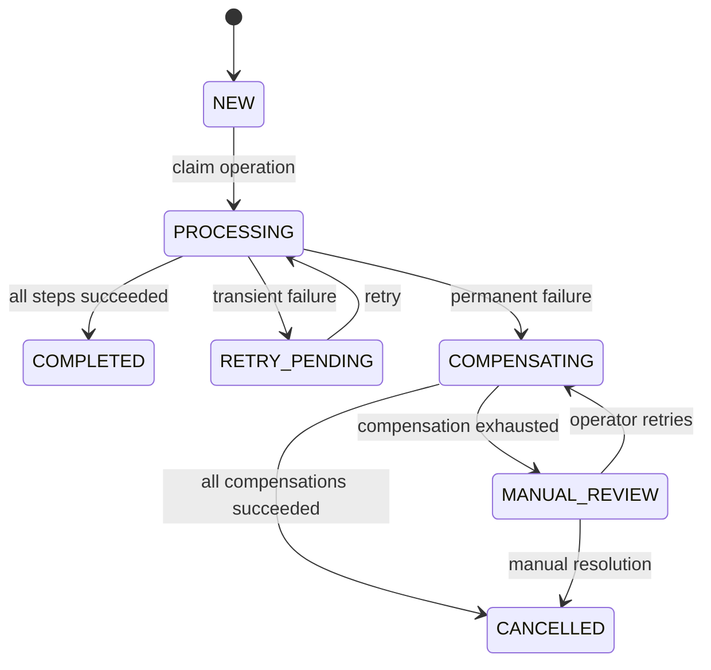
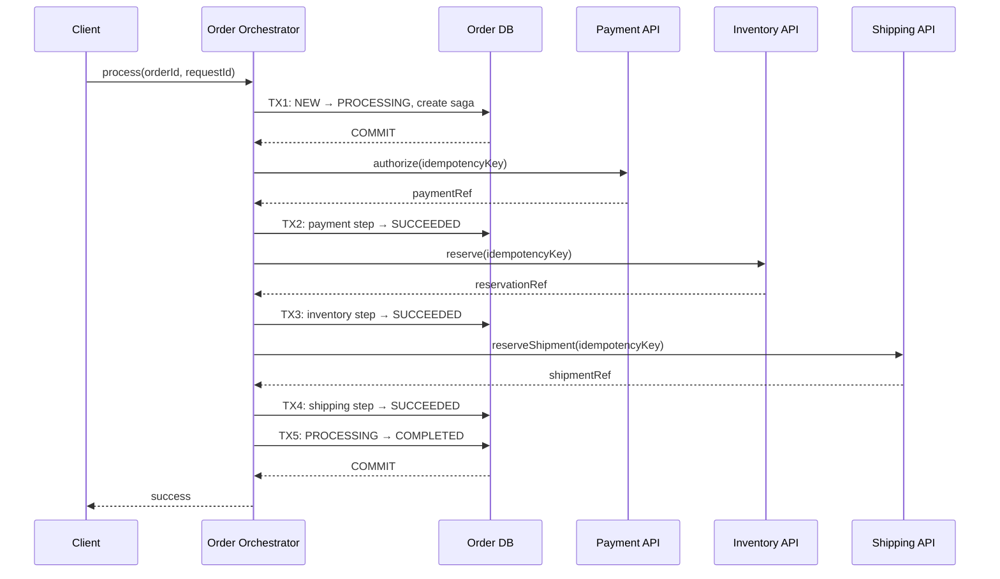
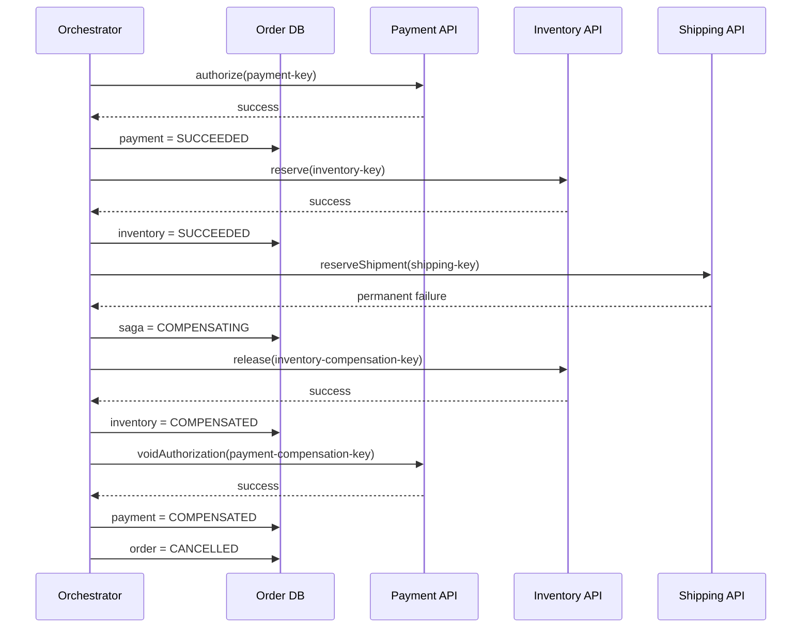
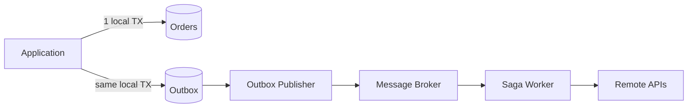
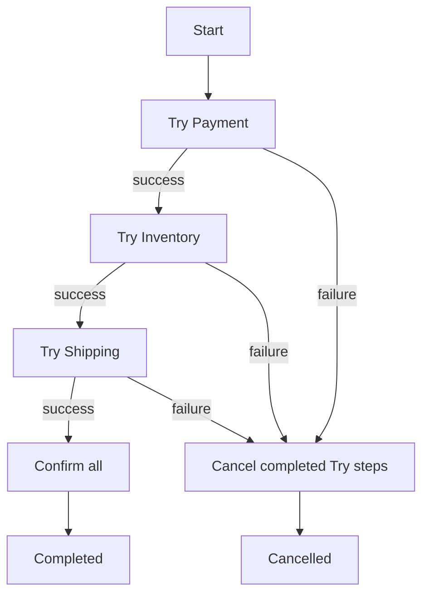
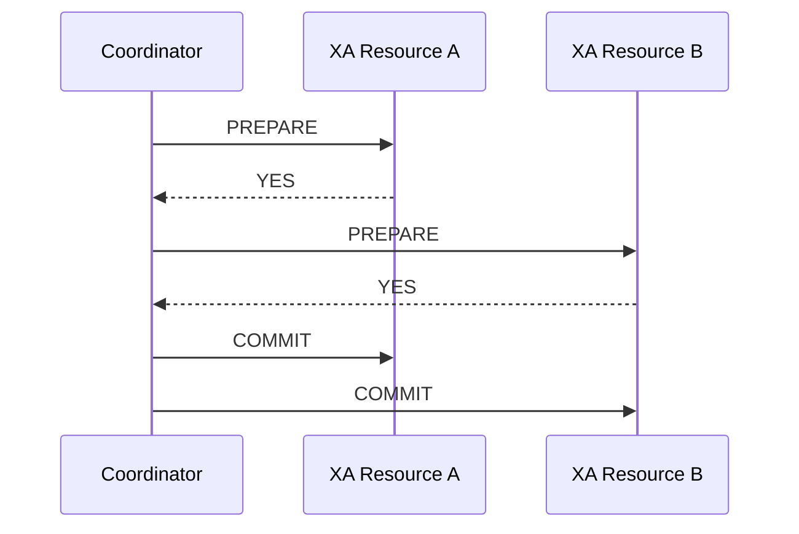
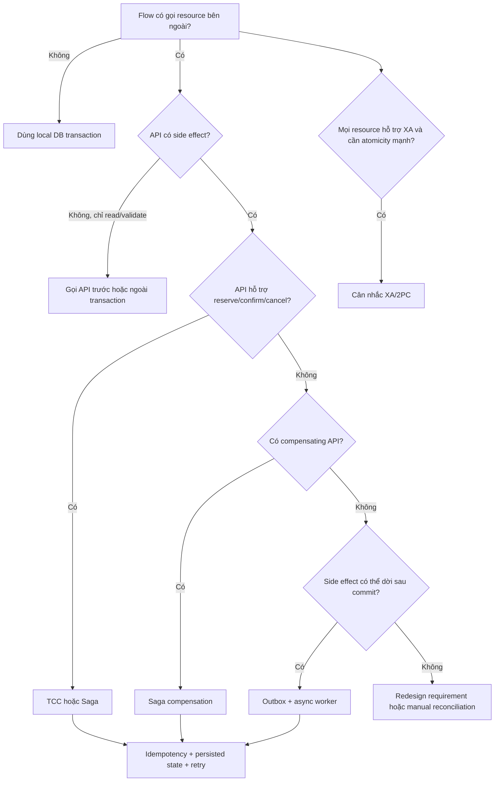

## Mục lục

- [1. Câu hỏi phỏng vấn](#1-câu-hỏi-phỏng-vấn)
- [2. Câu trả lời 30 giây](#2-câu-trả-lời-30-giây)
- [3. Câu trả lời 2 phút ghi điểm](#3-câu-trả-lời-2-phút-ghi-điểm)
- [4. Ba khái niệm phải phân biệt](#4-ba-khái-niệm-phải-phân-biệt)
  - [4.1. Local database transaction](#41-local-database-transaction)
  - [4.2. Long transaction](#42-long-transaction)
  - [4.3. Distributed business transaction](#43-distributed-business-transaction)
- [5. Vì sao @Transactional không rollback được HTTP API](#5-vì-sao-transactional-không-rollback-được-http-api)
- [6. Nghịch lý update trước để API đọc được](#6-nghịch-lý-update-trước-để-api-đọc-được)
- [7. Vì sao giữ transaction mở qua API là thiết kế nguy hiểm](#7-vì-sao-giữ-transaction-mở-qua-api-là-thiết-kế-nguy-hiểm)
- [8. Chọn giải pháp theo loại API](#8-chọn-giải-pháp-theo-loại-api)
- [9. Thiết kế khuyến nghị: state machine và Saga orchestration](#9-thiết-kế-khuyến-nghị-state-machine-và-saga-orchestration)
  - [9.1. State machine](#91-state-machine)
  - [9.2. Luồng thành công](#92-luồng-thành-công)
  - [9.3. Luồng thất bại và compensation](#93-luồng-thất-bại-và-compensation)
- [10. Compensation không phải rollback vật lý](#10-compensation-không-phải-rollback-vật-lý)
- [11. Idempotency: điều kiện bắt buộc để retry an toàn](#11-idempotency-điều-kiện-bắt-buộc-để-retry-an-toàn)
- [12. Crash window: API thành công nhưng chưa kịp lưu DB](#12-crash-window-api-thành-công-nhưng-chưa-kịp-lưu-db)
- [13. Data model tối thiểu cho Saga](#13-data-model-tối-thiểu-cho-saga)
- [14. Spring Boot implementation mẫu](#14-spring-boot-implementation-mẫu)
  - [14.1. Orchestrator không mở long transaction](#141-orchestrator-không-mở-long-transaction)
  - [14.2. Transaction service giữ các transaction ngắn](#142-transaction-service-giữ-các-transaction-ngắn)
  - [14.3. Step executor xử lý idempotency và crash window](#143-step-executor-xử-lý-idempotency-và-crash-window)
  - [14.4. Compensation theo thứ tự ngược](#144-compensation-theo-thứ-tự-ngược)
- [15. Transactional Outbox giải quyết điều gì](#15-transactional-outbox-giải-quyết-điều-gì)
- [16. TCC: Try Confirm Cancel](#16-tcc-try-confirm-cancel)
- [17. XA và Two-Phase Commit](#17-xa-và-two-phase-commit)
- [18. Đồng thời, duplicate request và optimistic locking](#18-đồng-thời-duplicate-request-và-optimistic-locking)
- [19. Timeout, retry và circuit breaker](#19-timeout-retry-và-circuit-breaker)
- [20. Xử lý compensation thất bại](#20-xử-lý-compensation-thất-bại)
- [21. Testing strategy](#21-testing-strategy)
- [22. Monitoring và vận hành](#22-monitoring-và-vận-hành)
- [23. Các anti-pattern thường gặp](#23-các-anti-pattern-thường-gặp)
- [24. Cây quyết định trong phỏng vấn](#24-cây-quyết-định-trong-phỏng-vấn)
- [25. Các câu hỏi đào sâu và câu trả lời mẫu](#25-các-câu-hỏi-đào-sâu-và-câu-trả-lời-mẫu)
- [26. Bài toán mẫu hoàn chỉnh](#26-bài-toán-mẫu-hoàn-chỉnh)
- [27. Tóm tắt cheat sheet](#27-tóm-tắt-cheat-sheet)
- [28. Tài liệu liên quan](#28-tài-liệu-liên-quan)

---

## 1. Câu hỏi phỏng vấn

> *"Tôi có một use case như sau: đầu tiên update database, sau đó gọi nhiều API bên ngoài, cuối cùng lại update hoặc delete dữ liệu. Nếu một API thất bại, tôi muốn rollback toàn bộ. Có nên đặt tất cả trong một method `@Transactional` không? Nếu không thì thiết kế thế nào để dữ liệu không bị lệch?"*

Ví dụ nghiệp vụ:

```text
1. UPDATE order → PROCESSING
2. Payment API   → authorize tiền
3. Inventory API → giữ hàng
4. Shipping API  → tạo vận đơn
5. UPDATE order → COMPLETED
```

Yêu cầu mong muốn:

```text
Nếu bất kỳ bước nào lỗi:
- rollback database;
- hoàn tác payment;
- hoàn tác inventory;
- hoàn tác shipping;
- hệ thống trở về đúng trạng thái ban đầu.
```

Đây không còn là một database transaction đơn lẻ. Nó là **distributed business transaction** — một quy trình nghiệp vụ trải qua nhiều hệ thống độc lập.

> [!IMPORTANT]
> Mấu chốt của câu hỏi: `@Transactional` chỉ quản lý các resource tham gia cùng transaction manager. Một HTTP API thông thường không tham gia transaction JDBC/JPA, nên database có thể rollback nhưng side effect đã xảy ra ở API bên ngoài thì không tự biến mất.

---

## 2. Câu trả lời 30 giây

> Tôi không đặt toàn bộ flow trong một `@Transactional` dài. Làm như vậy giữ connection và lock trong lúc chờ network, nhưng vẫn không rollback được side effect của HTTP API. Nếu API A đã trừ tiền rồi API B thất bại, rollback JDBC chỉ hoàn tác database local; nó không gọi ngược API A.
>
> Tôi sẽ phân loại API. Nếu chúng chỉ đọc hoặc validate thì gọi trước, sau đó dùng một transaction ngắn để update DB. Nếu chúng tạo side effect thì dùng **Saga** hoặc **TCC**: commit trạng thái `PROCESSING`, gọi từng API với **idempotency key**, lưu trạng thái từng bước, và khi lỗi thì chạy **compensating action** theo thứ tự ngược. Dùng **Transactional Outbox** nếu cần phát command/event đáng tin cậy. Chỉ cân nhắc XA/2PC khi mọi participant thật sự hỗ trợ XA; REST API thông thường thì không.

---

## 3. Câu trả lời 2 phút ghi điểm

Một câu trả lời tốt nên đi theo sáu ý:

1. **Xác định transaction boundary.** `@Transactional` của Spring thường quản lý một local database transaction thông qua `PlatformTransactionManager`.
2. **Nêu giới hạn.** HTTP call không dùng cùng JDBC connection và không tham gia transaction manager, nên local rollback không thể rollback remote side effect.
3. **Chỉ ra rủi ro long transaction.** Giữ transaction qua network call làm giữ connection, lock và MVCC snapshot lâu. Nó gây pool exhaustion, lock wait, deadlock và timeout dây chuyền.
4. **Phân loại API.** API read-only/validation nên chạy ngoài transaction và trước transaction ghi. API có side effect cần Saga/TCC.
5. **Đưa thiết kế production.** Dùng trạng thái `PROCESSING`, lưu từng Saga step, idempotency key, retry có kiểm soát, compensation theo thứ tự ngược và reconciliation worker.
6. **Nêu giới hạn của consistency.** Saga cho **eventual consistency**, không cho atomicity tức thời như một local transaction. Nếu business bắt buộc all-or-nothing tuyệt đối, phải đưa thao tác về cùng resource hoặc dùng protocol distributed transaction mà mọi participant hỗ trợ.

> [!TIP]
> Trong phỏng vấn, đừng chỉ nói "dùng Saga". Hãy giải thích thêm bốn từ khóa: **state machine, idempotency, compensation và recovery sau crash**. Đây là phần phân biệt câu trả lời lý thuyết với thiết kế có thể chạy production.

---

## 4. Ba khái niệm phải phân biệt

### 4.1. Local database transaction

Local transaction diễn ra trên một database resource:

```sql
BEGIN;

UPDATE accounts
SET balance = balance - 100
WHERE id = 1;

UPDATE accounts
SET balance = balance + 100
WHERE id = 2;

COMMIT;
```

Hai câu `UPDATE` dùng cùng connection và cùng database transaction. Database có đủ thông tin để commit hoặc rollback cả hai.

Trong Spring:

```java
@Transactional
public void transfer(long fromId, long toId, BigDecimal amount) {
    accountRepository.debit(fromId, amount);
    accountRepository.credit(toId, amount);
}
```

`JpaTransactionManager` hoặc `DataSourceTransactionManager` quản lý lifecycle của transaction này.

### 4.2. Long transaction

Long transaction là transaction bị giữ mở quá lâu trước khi `COMMIT` hoặc `ROLLBACK`.

```text
BEGIN
  ├─ UPDATE DB             20 ms
  ├─ gọi Payment API     2000 ms
  ├─ retry Payment API   4000 ms
  ├─ gọi Inventory API   1500 ms
  └─ COMMIT                10 ms

Tổng thời gian transaction mở: khoảng 7.5 giây
```

Các SQL có thể rất nhanh, nhưng transaction vẫn dài vì application làm network I/O bên trong transaction.

### 4.3. Distributed business transaction

Distributed business transaction là một nghiệp vụ trải qua nhiều resource hoặc service:

```text
Order DB + Payment Service + Inventory Service + Shipping Service
```

Mỗi service có:

- database riêng;
- transaction manager riêng;
- thời điểm commit riêng;
- failure mode riêng.

Không có một JDBC transaction mặc định nào bao phủ tất cả các thành phần trên.

| Khái niệm | Phạm vi | Rollback tự động |
|---|---|---|
| Local transaction | Một DB/resource | Có |
| Long transaction | Một transaction mở lâu | Có trong resource đó, nhưng tốn tài nguyên |
| Distributed business transaction | Nhiều service/resource | Không, trừ khi có protocol phân tán chung |

---

## 5. Vì sao @Transactional không rollback được HTTP API

Xét code sau:

```java
@Transactional(rollbackFor = Exception.class)
public void processOrder(Long orderId) {
    orderRepository.markProcessing(orderId);

    paymentClient.authorize(orderId);   // thành công, remote service đã commit
    inventoryClient.reserve(orderId);   // ném exception

    orderRepository.markCompleted(orderId);
}
```

Khi `inventoryClient.reserve()` ném exception:

```text
Spring TransactionInterceptor
  └─ gọi JpaTransactionManager.rollback()
       └─ JDBC Connection.rollback()
            └─ rollback SQL trên Order DB
```

Không có bước nào tự động gọi:

```java
paymentClient.voidAuthorization(orderId);
```

Lý do:

- Payment service đã commit trên database của nó.
- Order service không sở hữu transaction của Payment service.
- HTTP chỉ là giao thức request/response; nó không mặc định mang semantics `prepare`, `commit`, `rollback`.
- `rollbackFor = Exception.class` chỉ thay đổi quy tắc rollback của Spring transaction local.

Kết quả:

```text
Order DB:       rollback về NEW
Payment Service: tiền vẫn đang bị authorize
Inventory:      chưa reserve
```

> [!WARNING]
> `@Transactional` không biến HTTP call thành một phần của database transaction. Annotation này không phải distributed transaction coordinator.

---

## 6. Nghịch lý update trước để API đọc được

Một lý do thường được đưa ra là:

> "Tôi phải update trước vì API phía sau cần đọc dữ liệu mới."

Có hai khả năng.

### Trường hợp A: update nhưng chưa commit

```text
Order Service TX:
  UPDATE order → PROCESSING
  chưa COMMIT
       │
       └─ gọi API B
             └─ API B dùng connection khác để đọc Order DB
```

Ở isolation level thông thường như `READ_COMMITTED`, API B **không nhìn thấy dữ liệu chưa commit** của transaction A.

```text
UPDATE trước nhưng chưa commit
→ API khác thường vẫn đọc trạng thái cũ
```

### Trường hợp B: commit để API nhìn thấy

```text
UPDATE order → PROCESSING
COMMIT
CALL API B
```

API B nhìn thấy dữ liệu mới. Nhưng transaction đã commit nên không thể dùng `ROLLBACK` để quay lại.

Đây là nghịch lý cốt lõi:

```text
Không commit → service khác không thấy dữ liệu mới.
Commit       → không thể rollback bằng local transaction nữa.
```

Giải pháp là coi `PROCESSING` như một **trạng thái nghiệp vụ đã commit**, không phải kết quả cuối cùng. Nếu flow thất bại, hệ thống chuyển sang `COMPENSATING`, `FAILED` hoặc `CANCELLED` bằng một transaction mới.

> [!IMPORTANT]
> Đừng cố che trạng thái trung gian bằng một transaction kéo dài. Hãy mô hình hóa trạng thái trung gian một cách tường minh và kiểm soát việc ai được phép đọc hoặc xử lý nó.

---

## 7. Vì sao giữ transaction mở qua API là thiết kế nguy hiểm

Code này có vẻ đơn giản:

```java
@Transactional(timeout = 30, rollbackFor = Exception.class)
public void processOrder(Long orderId) {
    orderRepository.markProcessing(orderId);
    paymentClient.authorize(orderId);
    inventoryClient.reserve(orderId);
    shippingClient.create(orderId);
    orderRepository.markCompleted(orderId);
}
```

Nhưng nó có nhiều failure mode.

### Giữ connection pool

Nếu HikariCP có 20 connection và 20 request cùng chờ API trong 10 giây:

```text
20 request × 1 connection = hết pool
Request thứ 21 không lấy được connection
→ connection timeout
→ request retry
→ tải tăng thêm
```

### Giữ lock lâu

Nếu `markProcessing()` update một row, database có thể giữ row lock đến cuối transaction. Request khác muốn update cùng order phải chờ.

### Tăng deadlock và lock timeout

Lock được giữ càng lâu thì cửa sổ tranh chấp càng lớn. Các flow update resource theo thứ tự khác nhau dễ tạo deadlock.

### Giữ MVCC snapshot lâu

Với PostgreSQL hoặc MySQL/InnoDB, transaction cũ có thể làm chậm việc dọn version dữ liệu cũ. Hệ quả là table bloat, purge backlog hoặc tăng chi phí query.

### Network latency không ổn định

Database transaction giờ phụ thuộc vào:

- DNS;
- TLS handshake;
- network;
- timeout của service khác;
- retry policy;
- rate limit;
- thời gian xử lý của vendor.

### Vẫn không có distributed rollback

Đây là điểm quan trọng nhất: chấp nhận toàn bộ chi phí của long transaction nhưng vẫn không rollback được remote API.

| Rủi ro | `@Transactional` dài có giải quyết không? |
|---|:---:|
| Rollback SQL local | Có |
| Rollback HTTP side effect | Không |
| Giữ connection lâu | Có, đây là tác hại |
| Giữ lock lâu | Có thể |
| Crash giữa các API | Không |
| Retry duplicate side effect | Không |

---

## 8. Chọn giải pháp theo loại API

Không phải flow nào cũng cần Saga. Hãy phân loại trước.

| Loại thao tác | Ví dụ | Thiết kế phù hợp |
|---|---|---|
| API chỉ đọc | lấy tỷ giá, lấy cấu hình | Gọi ngoài transaction |
| API validate, không side effect | kiểm tra fraud, kiểm tra địa chỉ | Gọi trước transaction ghi |
| API có thể reserve/cancel | giữ hàng, authorize tiền | TCC hoặc Saga |
| API tạo side effect nhưng có API bù | charge/refund, create/cancel | Saga compensation |
| API có side effect không thể đảo ngược | gửi SMS, email, phát hành chứng thư | Thực hiện sau commit; chấp nhận/kiểm soát duplicate |
| Tất cả resource hỗ trợ XA | JDBC/JMS XA resources | Có thể cân nhắc 2PC |

### API chỉ đọc hoặc validate

```java
public void processOrder(Long orderId) {
    FraudResult fraud = fraudClient.check(orderId);
    InventoryInfo inventory = inventoryClient.check(orderId);

    orderTxService.completeValidatedOrder(orderId, fraud, inventory);
}
```

Transaction chỉ bao phần ghi cuối cùng.

### Side effect không thể hoàn tác

Ví dụ gửi email không thể "thu hồi" sau khi người dùng đã đọc. Hãy gửi sau khi business transaction đã commit, thường qua outbox:

```text
COMMIT order COMPLETED + outbox ORDER_COMPLETED
                    ↓
worker gửi email
```

Nếu gửi trùng, dùng idempotency hoặc deduplication ở consumer.

---

## 9. Thiết kế khuyến nghị: state machine và Saga orchestration

**Saga** chia một distributed business transaction thành nhiều local transaction. Khi một bước thất bại, hệ thống chạy các bước bù trừ đã định nghĩa.

**Orchestration** nghĩa là có một coordinator biết flow hiện tại và quyết định bước tiếp theo.

### 9.1. State machine



Ý nghĩa trạng thái:

| Trạng thái | Ý nghĩa |
|---|---|
| `NEW` | Chưa bắt đầu xử lý |
| `PROCESSING` | Saga đang thực hiện các bước |
| `RETRY_PENDING` | Lỗi tạm thời, sẽ retry |
| `COMPENSATING` | Đang hoàn tác các bước đã thành công |
| `COMPLETED` | Toàn bộ business flow thành công |
| `CANCELLED` | Flow thất bại nhưng compensation đã hoàn tất |
| `MANUAL_REVIEW` | Không thể tự khôi phục, cần vận hành can thiệp |

### 9.2. Luồng thành công



Mỗi database transaction ngắn. Không transaction nào mở trong lúc chờ HTTP.

### 9.3. Luồng thất bại và compensation

Giả sử Payment và Inventory thành công nhưng Shipping thất bại:



Compensation chạy theo thứ tự ngược vì các bước sau thường phụ thuộc vào kết quả của bước trước.

---

## 10. Compensation không phải rollback vật lý

Database rollback đưa dữ liệu về trạng thái trước transaction một cách nguyên tử. Compensation là **một nghiệp vụ mới** nhằm trung hòa tác động cũ.

| Thao tác chính | Compensation |
|---|---|
| Authorize payment | Void authorization |
| Capture payment | Refund |
| Reserve inventory | Release reservation |
| Create shipment | Cancel shipment |
| Create booking | Cancel booking |

Compensation có thể khác rollback ở nhiều điểm:

- Refund có thể mất vài ngày.
- Payment provider có thể giữ phí giao dịch.
- Hàng đã được warehouse pick thì release không còn đơn giản.
- Email đã gửi không thể lấy lại.
- Compensation cũng có thể timeout hoặc thất bại.

Vì vậy Saga cung cấp **business consistency**, không cung cấp physical atomic rollback giống một local database transaction.

> [!IMPORTANT]
> Câu trả lời phỏng vấn chính xác nên nói: "Saga không rollback; Saga chạy compensating transaction." Hai khái niệm có mục tiêu gần nhau nhưng semantics khác nhau.

---

## 11. Idempotency: điều kiện bắt buộc để retry an toàn

Distributed system luôn có trường hợp client không biết request đã thành công hay chưa:

```text
Order Service ── request ──► Payment Service
Order Service ◄── timeout ── network

Không biết:
- Payment chưa nhận request; hoặc
- Payment đã charge nhưng response bị mất.
```

Nếu retry bằng request mới, khách hàng có thể bị charge hai lần.

### Idempotency key

Mỗi logical step dùng một key ổn định:

```text
{operationId}:PAYMENT_AUTHORIZE
{operationId}:INVENTORY_RESERVE
{operationId}:SHIPPING_RESERVE
```

Ví dụ:

```http
POST /payments/authorize
Idempotency-Key: 8f42...:PAYMENT_AUTHORIZE
Content-Type: application/json

{
  "orderId": 1001,
  "amount": 500000
}
```

Payment service lưu kết quả theo key:

```sql
CREATE TABLE idempotent_request (
    idempotency_key VARCHAR(200) PRIMARY KEY,
    request_hash    VARCHAR(64) NOT NULL,
    status          VARCHAR(30) NOT NULL,
    response_body   TEXT,
    created_at      TIMESTAMP NOT NULL
);
```

Khi nhận lại cùng key:

- cùng request payload: trả lại kết quả cũ;
- khác payload: trả `409 Conflict` hoặc lỗi validation;
- request đang xử lý: trả trạng thái hiện tại hoặc chờ theo policy.

> [!WARNING]
> Chỉ thêm UUID mới cho mỗi lần retry không phải idempotency. Mọi retry của cùng một logical operation phải dùng **cùng key**.

Compensation cũng cần idempotent:

```text
release inventory lần 1 → success
release inventory lần 2 → vẫn success/no-op
```

---

## 12. Crash window: API thành công nhưng chưa kịp lưu DB

Đây là failure mode quan trọng nhất mà code `try/catch` đơn giản không giải quyết được:

```text
1. Payment API thành công.
2. Payment đã commit.
3. Order Service crash.
4. Chưa kịp UPDATE saga_step = SUCCEEDED.
```

Sau restart, database local có thể vẫn ghi step là `STARTED`. Hệ thống không biết remote side effect đã xảy ra hay chưa.

Cách xử lý:

1. Trước khi gọi API, lưu step là `STARTED` cùng idempotency key.
2. Gọi API bằng key đó.
3. Khi API trả thành công, lưu `SUCCEEDED` và `external_ref`.
4. Nếu crash giữa bước 2 và 3, worker retry bằng **cùng idempotency key**.
5. Remote service trả lại kết quả cũ thay vì thực hiện lần hai.

```text
DB: step STARTED
      │
      ├─ call remote với key K
      │      └─ remote lưu K → success
      │
      └─ app crash

Recovery:
  retry key K
  → remote tìm thấy K
  → trả lại success + externalRef cũ
  → local DB ghi SUCCEEDED
```

Nếu remote API không hỗ trợ idempotency, cần ít nhất một endpoint tra cứu theo business key hoặc merchant reference:

```http
GET /payments/by-merchant-reference/{operationId}
```

Nếu không có idempotency và cũng không có API tra cứu, không thể tự động phân biệt "chưa thực hiện" với "đã thực hiện nhưng mất response". Khi đó phải có manual reconciliation hoặc chấp nhận rủi ro duplicate.

---

## 13. Data model tối thiểu cho Saga

Một thiết kế tham khảo:

```sql
CREATE TABLE order_saga (
    operation_id    UUID PRIMARY KEY,
    order_id        BIGINT NOT NULL,
    request_id      VARCHAR(100) NOT NULL,
    status          VARCHAR(30) NOT NULL,
    current_step    VARCHAR(50),
    retry_count     INT NOT NULL DEFAULT 0,
    last_error      TEXT,
    version         BIGINT NOT NULL DEFAULT 0,
    created_at      TIMESTAMP NOT NULL,
    updated_at      TIMESTAMP NOT NULL,
    UNIQUE (request_id)
);

CREATE TABLE order_saga_step (
    operation_id    UUID NOT NULL,
    step_name       VARCHAR(50) NOT NULL,
    step_status     VARCHAR(30) NOT NULL,
    idempotency_key VARCHAR(200) NOT NULL,
    external_ref    VARCHAR(200),
    attempt_count   INT NOT NULL DEFAULT 0,
    last_error      TEXT,
    started_at      TIMESTAMP,
    completed_at    TIMESTAMP,
    PRIMARY KEY (operation_id, step_name),
    UNIQUE (idempotency_key)
);
```

Các trạng thái step gợi ý:

```text
PENDING
STARTED
SUCCEEDED
RETRY_PENDING
FAILED
COMPENSATING
COMPENSATED
COMPENSATION_FAILED
```

Tại sao không chỉ lưu một cột `order.status`?

- Không biết API nào đã thành công.
- Không có external reference để cancel/refund.
- Không biết retry step nào.
- Không phân biệt action failure và compensation failure.
- Khó audit timeline.

> [!TIP]
> Với flow quan trọng như payment, hãy lưu lịch sử transition hoặc event append-only. Chỉ giữ trạng thái cuối cùng thường không đủ để điều tra production incident.

---

## 14. Spring Boot implementation mẫu

Code dưới đây minh họa transaction boundary. Nó không phải một framework Saga hoàn chỉnh, nhưng thể hiện các nguyên tắc production quan trọng.

### 14.1. Orchestrator không mở long transaction

```java
@Service
@RequiredArgsConstructor
public class OrderProcessOrchestrator {

    private final OrderTransactionService txService;
    private final SagaStepExecutor stepExecutor;
    private final CompensationService compensationService;

    // Cố ý KHÔNG đặt @Transactional ở đây.
    public ProcessResult process(ProcessOrderCommand command) {
        Saga saga = txService.start(command);

        try {
            PaymentResult payment = stepExecutor.authorizePayment(saga);
            InventoryResult inventory = stepExecutor.reserveInventory(saga);
            ShippingResult shipping = stepExecutor.reserveShipping(saga);

            txService.complete(
                saga.operationId(),
                payment.reference(),
                inventory.reference(),
                shipping.reference()
            );

            return ProcessResult.completed(saga.operationId());
        } catch (PermanentBusinessException ex) {
            txService.markCompensating(saga.operationId(), ex.getMessage());
            compensationService.compensate(saga.operationId());
            return ProcessResult.cancelled(saga.operationId());
        } catch (TransientRemoteException ex) {
            txService.scheduleRetry(saga.operationId(), ex.getMessage());
            return ProcessResult.accepted(saga.operationId());
        }
    }
}
```

Điểm cần nói trong phỏng vấn:

- Orchestrator không giữ database transaction xuyên suốt flow.
- Lỗi permanent và transient được xử lý khác nhau.
- `PROCESSING` không nhất thiết chuyển ngay sang `FAILED` khi timeout; timeout có thể là kết quả không xác định.
- Mỗi method của `txService` là một local transaction ngắn.

### 14.2. Transaction service giữ các transaction ngắn

```java
@Service
@RequiredArgsConstructor
public class OrderTransactionService {

    private final OrderRepository orderRepository;
    private final OrderSagaRepository sagaRepository;

    @Transactional
    public Saga start(ProcessOrderCommand command) {
        int updated = orderRepository.claimForProcessing(
            command.orderId(),
            command.requestId()
        );

        if (updated == 0) {
            throw new OrderAlreadyProcessingException(command.orderId());
        }

        Saga saga = Saga.start(
            UUID.randomUUID(),
            command.orderId(),
            command.requestId()
        );

        return sagaRepository.save(saga);
    }

    @Transactional
    public void complete(
            UUID operationId,
            String paymentRef,
            String inventoryRef,
            String shippingRef) {

        Saga saga = sagaRepository.findForUpdate(operationId)
            .orElseThrow();

        if (saga.isCompleted()) {
            return; // idempotent finalization
        }

        saga.complete();
        orderRepository.markCompleted(
            saga.orderId(),
            paymentRef,
            inventoryRef,
            shippingRef
        );
    }

    @Transactional
    public void markCompensating(UUID operationId, String reason) {
        Saga saga = sagaRepository.findForUpdate(operationId)
            .orElseThrow();
        saga.markCompensating(reason);
    }

    @Transactional
    public void scheduleRetry(UUID operationId, String reason) {
        Saga saga = sagaRepository.findForUpdate(operationId)
            .orElseThrow();
        saga.scheduleRetry(reason);
    }
}
```

Repository claim nên dùng conditional update:

```sql
UPDATE orders
SET status = 'PROCESSING',
    request_id = :requestId,
    updated_at = CURRENT_TIMESTAMP
WHERE id = :orderId
  AND status = 'NEW';
```

Nếu update count bằng `0`, một request khác đã claim order hoặc order không còn ở trạng thái hợp lệ.

> [!IMPORTANT]
> Tách `OrderTransactionService` thành bean riêng còn giúp tránh self-invocation của Spring proxy. Nếu gọi method `@Transactional` bằng `this.complete(...)` trong cùng class, annotation có thể bị bỏ qua.

### 14.3. Step executor xử lý idempotency và crash window

```java
@Service
@RequiredArgsConstructor
public class SagaStepExecutor {

    private final SagaStepTransactionService stepTxService;
    private final PaymentClient paymentClient;
    private final InventoryClient inventoryClient;
    private final ShippingClient shippingClient;

    public PaymentResult authorizePayment(Saga saga) {
        String key = saga.operationId() + ":PAYMENT_AUTHORIZE";

        SagaStep step = stepTxService.startOrLoad(
            saga.operationId(),
            "PAYMENT_AUTHORIZE",
            key
        );

        if (step.isSucceeded()) {
            return PaymentResult.from(step.externalRef());
        }

        try {
            PaymentResult result = paymentClient.authorize(
                saga.orderId(),
                key
            );

            stepTxService.markSucceeded(
                saga.operationId(),
                "PAYMENT_AUTHORIZE",
                result.reference()
            );

            return result;
        } catch (RemoteTimeoutException ex) {
            stepTxService.markUnknownOrRetryPending(
                saga.operationId(),
                "PAYMENT_AUTHORIZE",
                ex.getMessage()
            );
            throw new TransientRemoteException(ex);
        }
    }

    // reserveInventory() và reserveShipping() áp dụng cùng cấu trúc.
}
```

`startOrLoad()` và `markSucceeded()` là các transaction riêng. HTTP call nằm giữa chúng và không có transaction database đang mở.

Nếu application crash sau API success nhưng trước `markSucceeded()`, retry cùng key sẽ nhận lại kết quả cũ từ Payment service.

### 14.4. Compensation theo thứ tự ngược

```java
@Service
@RequiredArgsConstructor
public class CompensationService {

    private final SagaQueryService sagaQueryService;
    private final SagaStepTransactionService stepTxService;
    private final ShippingClient shippingClient;
    private final InventoryClient inventoryClient;
    private final PaymentClient paymentClient;
    private final OrderTransactionService orderTxService;

    public void compensate(UUID operationId) {
        SagaView saga = sagaQueryService.get(operationId);

        // Đảo ngược thứ tự action chính: Shipping → Inventory → Payment.
        compensateShippingIfNeeded(saga);
        compensateInventoryIfNeeded(saga);
        compensatePaymentIfNeeded(saga);

        orderTxService.markCancelled(operationId);
    }

    private void compensateInventoryIfNeeded(SagaView saga) {
        SagaStep step = saga.step("INVENTORY_RESERVE");

        if (!step.requiresCompensation()) {
            return;
        }

        String key = saga.operationId() + ":INVENTORY_RELEASE";
        stepTxService.markCompensating(
            saga.operationId(),
            "INVENTORY_RESERVE",
            key
        );

        try {
            inventoryClient.release(step.externalRef(), key);
            stepTxService.markCompensated(
                saga.operationId(),
                "INVENTORY_RESERVE"
            );
        } catch (Exception ex) {
            stepTxService.markCompensationFailed(
                saga.operationId(),
                "INVENTORY_RESERVE",
                ex.getMessage()
            );
            throw ex;
        }
    }
}
```

Trong production, không nên chỉ compensate trong request thread. Nếu compensation timeout, worker phải có thể tiếp tục từ trạng thái đã lưu.

---

## 15. Transactional Outbox giải quyết điều gì

Có một dual-write problem:

```java
@Transactional
public void createOrder() {
    orderRepository.save(order);
}

messageBroker.publish(new OrderCreated(order.id()));
```

Failure window:

```text
DB commit thành công
application crash trước publish
→ order tồn tại nhưng event bị mất
```

Nếu publish trước commit:

```text
event publish thành công
DB rollback
→ consumer nhận event cho order không tồn tại
```

Transactional Outbox ghi business data và event vào **cùng local transaction**:

```sql
BEGIN;

UPDATE orders
SET status = 'PROCESSING'
WHERE id = :orderId;

INSERT INTO outbox_event (
    event_id,
    aggregate_id,
    event_type,
    payload,
    status,
    created_at
)
VALUES (
    :eventId,
    :orderId,
    'PROCESS_ORDER',
    :payload,
    'PENDING',
    CURRENT_TIMESTAMP
);

COMMIT;
```

Worker hoặc CDC connector gửi event sau commit.



Outbox đảm bảo:

- business update và "ý định gửi message" cùng commit hoặc cùng rollback;
- event không bị mất nếu application crash sau commit;
- publisher có thể retry.

Outbox **không tự giải quyết**:

- duplicate delivery;
- thứ tự event nếu thiết kế partition sai;
- compensation;
- rollback remote side effect;
- idempotency ở consumer.

> [!IMPORTANT]
> Outbox giải quyết reliable messaging cho local DB-to-broker boundary. Saga giải quyết workflow và compensation. Hai pattern thường được dùng cùng nhau, không thay thế nhau.

---

## 16. TCC: Try Confirm Cancel

TCC phù hợp khi resource hỗ trợ trạng thái tạm giữ.

### Try

Giữ resource nhưng chưa tạo tác động cuối cùng:

```text
Payment: authorize tiền, chưa capture
Inventory: reserve hàng, chưa xuất kho
Booking: hold chỗ, chưa confirm
```

### Confirm

Khi tất cả bước Try thành công:

```text
Payment: capture
Inventory: confirm allocation
Booking: confirm
```

### Cancel

Nếu một bước Try thất bại:

```text
Payment: void authorization
Inventory: release reservation
Booking: release hold
```



TCC tốt hơn "thực hiện thật rồi hoàn tiền" vì reservation thường dễ hủy hơn một final side effect.

TCC vẫn cần:

- idempotent `Try`, `Confirm`, `Cancel`;
- expiration cho reservation;
- retry `Confirm`;
- recovery worker;
- xử lý trường hợp coordinator crash.

> [!NOTE]
> Sau khi bắt đầu Confirm, hệ thống thường ưu tiên retry đến khi Confirm thành công thay vì quay sang Cancel. Vì vậy Confirm nên được thiết kế idempotent và có xác suất thất bại nghiệp vụ rất thấp.

---

## 17. XA và Two-Phase Commit

Nếu tất cả resource hỗ trợ distributed transaction, coordinator có thể dùng Two-Phase Commit — 2PC.

### Phase 1: Prepare

Coordinator hỏi mọi participant:

```text
"Bạn có đảm bảo sẽ commit được không?"
```

Participant ghi log và giữ resource ở trạng thái prepared.

### Phase 2: Commit hoặc Rollback

- Tất cả vote YES: coordinator gửi `COMMIT`.
- Có một vote NO: coordinator gửi `ROLLBACK`.



Trong Java, XA thường liên quan đến:

- `JtaTransactionManager`;
- XA-capable JDBC driver;
- XA DataSource;
- JMS XA resource;
- transaction coordinator như Narayana hoặc Atomikos.

Tại sao không dùng XA cho mọi thứ?

- REST API thông thường không phải XA resource.
- Participant giữ lock/resource trong thời gian prepare.
- Coordinator failure tạo transaction ở trạng thái in-doubt.
- Vận hành và recovery phức tạp.
- Latency và khả năng scale kém hơn local transaction.
- Nhiều cloud service hoặc SaaS không hỗ trợ XA.

| Yêu cầu | Saga/TCC | XA/2PC |
|---|---|---|
| HTTP/SaaS API | Phù hợp hơn | Thường không hỗ trợ |
| Consistency | Eventual/business consistency | Atomicity mạnh hơn |
| Lock phân tán | Không giữ suốt flow | Có thể giữ khi prepare |
| Compensation | Cần | Không phải compensation nghiệp vụ thông thường |
| Độ phức tạp | Nằm ở business workflow | Nằm ở infrastructure/protocol |

> [!TIP]
> Câu trả lời an toàn trong phỏng vấn: "Tôi chỉ chọn XA khi atomicity mạnh là bắt buộc, số participant nhỏ, và mọi participant thật sự hỗ trợ XA. Với HTTP microservices, mặc định tôi chọn Saga/TCC và idempotency."

---

## 18. Đồng thời, duplicate request và optimistic locking

Hai request có thể cùng xử lý một order:

```text
Request A: đọc order = NEW
Request B: đọc order = NEW
A bắt đầu payment
B cũng bắt đầu payment
→ duplicate side effect
```

### Conditional state transition

```sql
UPDATE orders
SET status = 'PROCESSING',
    operation_id = :operationId,
    version = version + 1
WHERE id = :orderId
  AND status = 'NEW';
```

Chỉ một request update thành công.

### Request idempotency

Client gửi `requestId` ổn định:

```http
POST /orders/1001/process
Idempotency-Key: client-request-789
```

Database có unique constraint:

```sql
ALTER TABLE order_saga
ADD CONSTRAINT uk_order_saga_request UNIQUE (request_id);
```

Nếu client retry, service trả lại operation cũ.

### Optimistic locking

Entity có `@Version`:

```java
@Entity
public class OrderSagaEntity {
    @Id
    private UUID operationId;

    @Version
    private long version;

    @Enumerated(EnumType.STRING)
    private SagaStatus status;
}
```

Optimistic locking ngăn hai worker ghi đè trạng thái của nhau. Tuy nhiên nó không thay thế idempotency ở remote API.

### Pessimistic lock có nên giữ qua API?

Không nên:

```java
@Lock(LockModeType.PESSIMISTIC_WRITE)
Order findForUpdate(...);

// rồi giữ lock trong lúc gọi HTTP 5 giây
```

Hãy lock ngắn để claim hoặc transition state, commit, rồi gọi API ngoài transaction.

---

## 19. Timeout, retry và circuit breaker

### Timeout

Mọi remote call phải có timeout hữu hạn:

- connect timeout;
- read/response timeout;
- overall deadline.

Không để default vô hạn vì một request treo có thể giữ worker mãi mãi.

### Retry

Chỉ retry lỗi có khả năng tạm thời:

| Lỗi | Có nên retry? |
|---|---|
| Connect timeout | Có, nếu operation idempotent |
| HTTP 502/503/504 | Thường có |
| HTTP 429 | Có, theo `Retry-After` |
| Validation 400 | Không |
| Unauthorized 401/403 | Không, trừ khi refresh credential hợp lệ |
| Insufficient funds | Không |
| Conflict do duplicate key | Có thể đọc lại kết quả cũ |

Retry nên có:

```text
exponential backoff + jitter + max attempts + deadline
```

Ví dụ:

```text
1s → 2s → 4s → 8s, cộng random jitter
```

### Circuit breaker

Khi remote service lỗi diện rộng, circuit breaker ngăn hệ thống tiếp tục dồn request vào dependency đang hỏng.

```text
CLOSED → lỗi vượt ngưỡng → OPEN
OPEN → fail fast
sau cooldown → HALF_OPEN
HALF_OPEN → probe success → CLOSED
```

### Không retry mù

Retry một non-idempotent `charge()` có thể nhân đôi side effect. Phải có idempotency trước khi bật retry.

> [!IMPORTANT]
> Timeout trả lời câu hỏi "chờ bao lâu". Retry trả lời "thử lại thế nào". Idempotency trả lời "thử lại có an toàn không". Circuit breaker trả lời "khi dependency hỏng diện rộng thì bảo vệ hệ thống ra sao".

---

## 20. Xử lý compensation thất bại

Compensation là remote call nên cũng có thể thất bại:

```text
Inventory đã reserve
Payment đã authorize
Shipping thất bại
Release inventory thành công
Void payment timeout
```

Không được đánh dấu order là `CANCELLED` nếu compensation quan trọng chưa hoàn tất.

State hợp lý:

```text
COMPENSATING
  └─ payment compensation = RETRY_PENDING
```

Recovery worker:

1. Scan các step `COMPENSATION_FAILED` hoặc `RETRY_PENDING`.
2. Claim step bằng optimistic/pessimistic locking ngắn.
3. Retry cùng compensation idempotency key.
4. Nếu vượt max attempt, chuyển Saga sang `MANUAL_REVIEW`.
5. Gửi alert kèm operation ID và external reference.

Không nên delete record lỗi vì sẽ mất:

- bằng chứng API nào đã chạy;
- idempotency key;
- external reference;
- retry count;
- nguyên nhân lỗi;
- audit trail.

> [!WARNING]
> `catch (Exception) { log.error(...) }` rồi coi flow đã rollback là một lỗi nghiêm trọng. Compensation failure phải trở thành state bền vững, có retry và alert.

---

## 21. Testing strategy

Happy-path test là chưa đủ. Cần fault-injection tại mọi boundary.

### Unit test state machine

Kiểm tra transition hợp lệ:

```text
NEW → PROCESSING                 hợp lệ
PROCESSING → COMPLETED           hợp lệ
COMPLETED → PROCESSING           không hợp lệ
COMPENSATING → CANCELLED         chỉ khi mọi step đã compensated
```

### Integration test transaction boundary

Kiểm tra rằng:

- transaction DB đã commit trước khi remote call bắt đầu;
- exception remote không để local transaction mở;
- conditional update chỉ cho một worker claim;
- finalization idempotent.

### Contract test cho API

Xác nhận dependency thật sự hỗ trợ:

- idempotency key;
- cùng key trả cùng kết quả;
- cùng key nhưng payload khác bị reject;
- cancel/refund idempotent;
- query theo merchant reference.

### Failure matrix

| Điểm lỗi | Kỳ vọng |
|---|---|
| Trước Payment call | Không có remote side effect |
| Payment timeout trước khi remote nhận | Retry cùng key |
| Payment success nhưng mất response | Retry/query trả kết quả cũ |
| Crash sau Payment success trước local update | Recovery tiếp tục từ `STARTED` |
| Inventory permanent failure | Void Payment |
| Crash giữa hai compensation | Recovery tiếp tục step còn lại |
| Compensation timeout | `COMPENSATION_FAILED`, retry |
| Duplicate client request | Trả cùng Saga, không chạy flow mới |
| Hai worker cùng claim | Chỉ một worker thắng |

### Test với dependency thật hoặc container

Mock thường không mô phỏng được timeout mơ hồ. Nên có integration test với WireMock/Toxiproxy hoặc fault proxy tương đương để tạo:

- delayed response;
- connection reset;
- response bị mất sau khi server xử lý;
- HTTP 429/503;
- duplicate delivery.

---

## 22. Monitoring và vận hành

Metric tối thiểu:

```text
saga_started_total
saga_completed_total
saga_cancelled_total
saga_manual_review_total
saga_duration_seconds
saga_step_duration_seconds
saga_step_retry_total
saga_compensation_total
saga_compensation_failed_total
outbox_pending_count
outbox_oldest_event_age_seconds
```

Alert quan trọng:

- Saga `PROCESSING` quá deadline.
- Saga `COMPENSATING` quá lâu.
- `MANUAL_REVIEW` lớn hơn 0 đối với payment-critical flow.
- Outbox backlog tăng liên tục.
- Retry rate hoặc HTTP 429/5xx tăng đột biến.
- Database connection pool pending tăng.

Log cần có correlation fields:

```json
{
  "operationId": "8f42...",
  "requestId": "client-request-789",
  "orderId": 1001,
  "step": "PAYMENT_AUTHORIZE",
  "idempotencyKey": "8f42...:PAYMENT_AUTHORIZE",
  "externalRef": "pay_123",
  "attempt": 2,
  "status": "SUCCEEDED"
}
```

Distributed tracing nên propagate:

- trace ID;
- operation ID;
- request ID;
- idempotency key ở dạng an toàn.

Không log token, card data hoặc thông tin nhạy cảm.

---

## 23. Các anti-pattern thường gặp

### Anti-pattern 1: Một @Transactional bao toàn flow

```java
@Transactional
public void process() {
    updateDb();
    callApiA();
    callApiB();
    updateDbAgain();
}
```

**Sai vì:** giữ transaction lâu nhưng không rollback remote side effect.

### Anti-pattern 2: Catch exception rồi xóa local record

```java
try {
    paymentClient.charge();
    inventoryClient.reserve();
} catch (Exception ex) {
    orderRepository.delete(order);
}
```

**Sai vì:** xóa local record không refund payment và còn làm mất audit data.

### Anti-pattern 3: Retry bằng UUID mới

```java
for (int i = 0; i < 3; i++) {
    paymentClient.charge(UUID.randomUUID());
}
```

**Sai vì:** remote coi mỗi attempt là operation mới.

### Anti-pattern 4: Chỉ lưu trạng thái tổng

```text
order.status = FAILED
```

**Sai vì:** không biết step nào cần compensate hoặc retry.

### Anti-pattern 5: Outbox được coi là distributed rollback

**Sai vì:** outbox đảm bảo publish đáng tin cậy, không hoàn tác side effect.

### Anti-pattern 6: Retry mọi exception

**Sai vì:** validation error hoặc insufficient funds không trở thành success sau retry. Retry còn có thể khuếch đại outage.

### Anti-pattern 7: Compensation chỉ chạy trong request thread

**Sai vì:** process crash hoặc request timeout sẽ bỏ dở recovery.

### Anti-pattern 8: Dùng `REQUIRES_NEW` để "rollback API"

`REQUIRES_NEW` chỉ tạo một database transaction local mới. Nó không biến remote API thành participant của transaction.

### Anti-pattern 9: Giữ DB lock để chống duplicate trong lúc gọi API

**Sai vì:** khóa row dài. Hãy claim bằng transition ngắn và dùng idempotency key.

### Anti-pattern 10: Nghĩ timeout nghĩa là API thất bại

Timeout chỉ nghĩa là caller không nhận được kết quả đúng hạn. Remote operation có thể đã thành công.

---

## 24. Cây quyết định trong phỏng vấn



Cách trình bày bằng lời:

1. API có side effect không?
2. Nếu không, gọi ngoài transaction.
3. Nếu có, API có reserve/cancel hoặc compensation không?
4. Nếu có, dùng TCC/Saga.
5. Nếu side effect không đảo được, dời nó sau commit qua outbox.
6. Luôn có idempotency, persisted state và recovery.
7. Chỉ nói XA khi mọi participant hỗ trợ và business thật sự cần atomicity mạnh.

---

## 25. Các câu hỏi đào sâu và câu trả lời mẫu

### "Nếu chỉ cần rollback hai lần update DB thì sao?"

Nếu hai update cùng database và API chỉ đọc/không side effect, có thể đặt hai update trong cùng transaction. Nhưng transaction vẫn bị kéo dài qua network call. Tốt hơn là gọi API trước nếu có thể, sau đó thực hiện hai update trong một transaction ngắn.

Nếu API có side effect, DB rollback vẫn không rollback API.

### "Nếu API A thành công, API B thất bại thì làm gì?"

Lưu rằng A đã thành công, sau đó gọi compensation của A. Compensation dùng idempotency key và được retry độc lập. Không chỉ rollback local DB rồi quên A.

### "Nếu compensation cũng thất bại?"

Chuyển step sang `COMPENSATION_FAILED` hoặc `RETRY_PENDING`. Worker retry với backoff. Khi vượt ngưỡng, chuyển Saga sang `MANUAL_REVIEW` và alert. Không được mất trạng thái recovery.

### "Saga đảm bảo ACID không?"

Mỗi local transaction trong Saga vẫn có ACID trên resource của nó. Toàn bộ Saga không có isolation và atomicity tức thời như một local transaction. Nó dùng eventual consistency và compensation để đạt business consistency.

### "Outbox có exactly-once delivery không?"

Thông thường không. Outbox publisher thường cung cấp at-least-once delivery, nghĩa là message có thể trùng. Consumer phải idempotent hoặc deduplicate theo event ID.

### "Tại sao không dùng Kafka transaction?"

Kafka transaction có thể atomic giữa các thao tác Kafka nhất định, và trong một số mô hình có thể kết hợp consume-process-produce. Nó không tự làm cho update database và HTTP side effect trở thành một atomic transaction chung. DB vẫn cần outbox/inbox hoặc chiến lược consistency khác.

### "Có nên dùng @TransactionalEventListener(AFTER_COMMIT) để gọi API?"

Nó đảm bảo listener chỉ được kích hoạt sau commit trong process hiện tại, nhưng event in-memory có thể mất nếu application crash ngay sau commit. Với flow quan trọng, dùng persistent outbox thay vì chỉ dựa vào in-memory event callback.

### "Có thể dùng REQUIRES_NEW cho từng API step không?"

Có thể dùng `REQUIRES_NEW` hoặc transaction riêng để lưu trạng thái step, nhưng HTTP call phải nằm ngoài transaction đó. `REQUIRES_NEW` không quản lý remote API và còn dùng thêm connection nếu transaction ngoài đang bị suspend.

### "API timeout thì mark FAILED luôn được không?"

Không phải lúc nào cũng được. Timeout là trạng thái **unknown outcome**. Remote có thể đã thành công. Cần retry cùng idempotency key hoặc query theo external/business reference trước khi quyết định compensate hay fail.

### "Tại sao không delete record khi flow fail?"

Record chứa operation ID, step status, idempotency key và external reference cần cho recovery, audit và reconciliation. Nên dùng `CANCELLED`/`FAILED` rồi archive theo retention policy sau.

### "Nếu business yêu cầu người dùng không thấy trạng thái PROCESSING?"

Ẩn bằng read model hoặc query rule:

```sql
SELECT *
FROM orders
WHERE status = 'COMPLETED';
```

Hoặc tách draft/process table khỏi bảng public. Không cần giữ transaction mở chỉ để che dữ liệu trung gian.

### "Choreography khác orchestration thế nào?"

- **Orchestration:** một coordinator quyết định step tiếp theo. Dễ quan sát flow, phù hợp quy trình nhiều nhánh.
- **Choreography:** service phát event và service khác tự phản ứng. Coupling trực tiếp thấp hơn nhưng flow phân tán, khó trace và dễ tạo event cycle.

Với bài toán interview có nhiều API tuần tự và compensation rõ, orchestration thường dễ giải thích và kiểm soát hơn.

---

## 26. Bài toán mẫu hoàn chỉnh

### Yêu cầu

Xử lý order cần:

1. Đánh dấu order đang xử lý.
2. Authorize 500.000 VNĐ.
3. Giữ hai sản phẩm trong kho.
4. Giữ slot giao hàng.
5. Hoàn tất order.

Nếu thất bại phải đưa hệ thống về trạng thái nghiệp vụ nhất quán.

### Thiết kế

```text
Local TX 1:
  order NEW → PROCESSING
  create saga + steps
  create outbox PROCESS_ORDER
COMMIT

Worker:
  Payment authorize(key=P)
  persist payment SUCCEEDED

  Inventory reserve(key=I)
  persist inventory SUCCEEDED

  Shipping reserve(key=S)
  persist shipping SUCCEEDED

Local TX cuối:
  order PROCESSING → COMPLETED
  saga → COMPLETED
COMMIT
```

Nếu Inventory thất bại vĩnh viễn:

```text
Payment đã SUCCEEDED
Inventory FAILED

Saga → COMPENSATING
Payment void(key=PC)
Payment step → COMPENSATED
Order → CANCELLED
Saga → CANCELLED
```

Nếu Payment timeout:

```text
Không kết luận Payment thất bại.
Saga step → RETRY_PENDING hoặc UNKNOWN.
Worker retry cùng key P.
Payment trả result cũ nếu request trước đã thành công.
```

Nếu application crash sau Inventory success:

```text
Inventory step local có thể vẫn STARTED.
Worker restart, retry cùng key I.
Inventory trả reservationRef cũ.
Worker persist SUCCEEDED rồi tiếp tục Shipping.
```

Nếu void Payment thất bại năm lần:

```text
Payment compensation → COMPENSATION_FAILED
Saga → MANUAL_REVIEW
Alert vận hành gồm:
  operationId
  orderId
  paymentRef
  idempotency key
  error gần nhất
```

### Consistency model

Trong một khoảng thời gian, hệ thống có thể ở trạng thái:

```text
Order = PROCESSING
Payment = AUTHORIZED
Inventory = RESERVED
Shipping = chưa tạo
```

Đây là trạng thái hợp lệ tạm thời của Saga. Invariant nghiệp vụ phải được định nghĩa theo state machine, không giả định mọi service đổi trạng thái cùng một lúc.

---

## 27. Tóm tắt cheat sheet

### Một câu chốt

> Không thể dùng một `@Transactional` JDBC/JPA thông thường để rollback cả database local và nhiều HTTP API. Với remote side effect, hãy dùng Saga/TCC, compensation, idempotency và persisted recovery state; giữ mỗi database transaction ngắn.

### Bảng lựa chọn

| Tình huống | Giải pháp ưu tiên |
|---|---|
| Nhiều update trên cùng DB | Một local transaction |
| API chỉ validate/read | Gọi API trước, rồi local transaction |
| API cần nhìn thấy record trước | Commit trạng thái `PROCESSING` |
| API có reserve/confirm/cancel | TCC |
| API có action bù | Saga compensation |
| Cần gửi event sau DB commit | Transactional Outbox |
| Side effect không đảo được | Thực hiện sau commit, idempotent/deduplicate |
| Mọi resource hỗ trợ XA và cần atomicity mạnh | Cân nhắc XA/2PC |
| Compensation thất bại | Persist, retry, alert, manual review |

### Bảy nguyên tắc cần nhớ

1. **`@Transactional` chỉ rollback resource tham gia transaction manager.** HTTP API thông thường không tham gia.
2. **Không giữ database transaction qua network I/O.** Nó giữ connection/lock lâu nhưng vẫn không có distributed rollback.
3. **Mô hình hóa trạng thái trung gian.** Dùng `PROCESSING`, `COMPENSATING`, `CANCELLED`, `MANUAL_REVIEW`.
4. **Saga dùng compensating transaction, không phải rollback vật lý.** Compensation có thể chậm hoặc thất bại.
5. **Idempotency là điều kiện để retry an toàn.** Action và compensation đều cần key ổn định.
6. **Persist trạng thái từng step và xử lý crash window.** `try/catch` trong memory là chưa đủ.
7. **Outbox cho reliable messaging; TCC/Saga cho workflow; XA chỉ khi participant hỗ trợ.** Không nhầm vai trò của các pattern.

> [!IMPORTANT]
> Câu trả lời ghi điểm trọn vẹn gồm: **(1)** local transaction không rollback HTTP; **(2)** long transaction giữ connection/lock và vẫn không atomic phân tán; **(3)** API read-only gọi ngoài transaction; **(4)** API có side effect dùng Saga/TCC; **(5)** lưu state từng step; **(6)** idempotency xử lý timeout/crash; **(7)** compensation có retry và manual recovery; **(8)** outbox và XA được dùng đúng phạm vi.

---

## 28. Tài liệu liên quan

- [Spring Transaction — AOP proxy, propagation, rollback và transaction internals](/spring/spring-transaction)
- [Vì sao @Transactional không rollback khi gọi method trong cùng class?](/interview/transactional-self-invocation)
- [Connection Pool trong ứng dụng Spring](/spring/connection-pool)
- [Kafka với Spring Boot](/spring/kafka-spring-boot)
