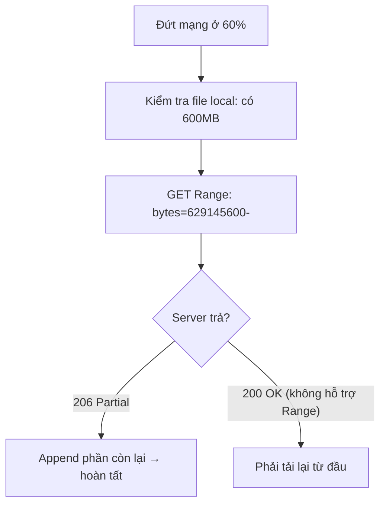
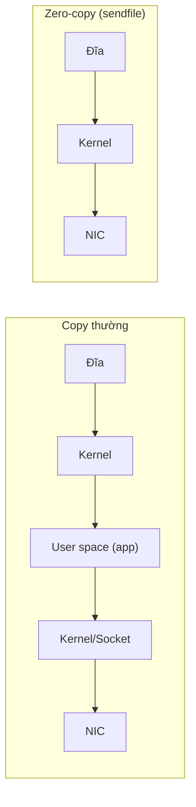

# Download File Lớn — Tải gigabyte mà không nổ RAM

## Mục lục

- [Bối cảnh: vì sao "tải file" lại khó khi file lớn](#1-bối-cảnh-vì-sao-tải-file-lại-khó-khi-file-lớn)
- [Quy tắc số một: stream, đừng buffer toàn bộ](#2-quy-tắc-số-một-stream-đừng-buffer-toàn-bộ)
- [HTTP Range request & resume download](#3-http-range-request--resume-download)
- [Tải song song nhiều phần (multipart/parallel)](#4-tải-song-song-nhiều-phần-multipartparallel)
- [Zero-copy: transferTo, sendfile, FileChannel](#5-zero-copy-transferto-sendfile-filechannel)
- [Toàn vẹn dữ liệu: checksum & atomic rename](#6-toàn-vẹn-dữ-liệu-checksum--atomic-rename)
- [Xử lý lỗi, timeout & retry](#7-xử-lý-lỗi-timeout--retry)
- [Phía server: phục vụ file lớn](#8-phía-server-phục-vụ-file-lớn)
- [Anti-patterns cần tránh](#9-anti-patterns-cần-tránh)
- [Tóm tắt — Cheat sheet](#10-tóm-tắt--cheat-sheet)

---

## 1. Bối cảnh: vì sao "tải file" lại khó khi file lớn

Tải file 5MB thì code nào cũng chạy. Tải file 50GB phơi bày mọi sai lầm:

```java
// 💥 BốN sai lầm trong một dòng:
byte[] data = httpClient.send(req, BodyHandlers.ofByteArray()).body();
Files.write(Path.of("movie.mkv"), data);
// 1. nạp 50GB vào RAM → OutOfMemoryError
// 2. mất hết nếu đứt mạng ở 99% (không resume được)
// 3. không kiểm tra toàn vẹn
// 4. file dở dang trông như file hoàn chỉnh
```

Tải file lớn đúng cách phải giải quyết: **bộ nhớ** (stream), **độ tin cậy** (resume + retry), **tốc độ** (song song + zero-copy), **toàn vẹn** (checksum + atomic).

> [!IMPORTANT]
> Khác biệt tư duy: file nhỏ coi như "một giá trị" (nạp rồi dùng); file lớn coi như "một **luồng** đi qua" (đọc khúc nào ghi khúc đó, không bao giờ giữ toàn bộ). Mọi kỹ thuật dưới đây đều xoay quanh nguyên tắc này.

---

## 2. Quy tắc số một: stream, đừng buffer toàn bộ

Dùng `InputStream` từ response, ghi thẳng ra đĩa theo buffer — bộ nhớ hằng số:

```java
HttpClient client = HttpClient.newHttpClient();
HttpRequest req = HttpRequest.newBuilder(URI.create(url)).build();

// BodyHandlers.ofFile / ofInputStream — KHÔNG nạp hết vào RAM
client.send(req, BodyHandlers.ofFile(Path.of("movie.mkv")));   // stream thẳng ra file

// Hoặc kiểm soát thủ công:
var resp = client.send(req, BodyHandlers.ofInputStream());
try (InputStream in = resp.body();
     OutputStream out = Files.newOutputStream(Path.of("movie.mkv"))) {
    in.transferTo(out);   // copy theo buffer nội bộ, bộ nhớ hằng số
}
```

> [!WARNING]
> Tránh `BodyHandlers.ofByteArray()` và `ofString()` cho file lớn — chúng vật chất hoá toàn bộ vào bộ nhớ. Dùng `ofFile()` (ghi thẳng) hoặc `ofInputStream()` (tự kiểm soát). Đây là lỗi phổ biến nhất khiến service chết OOM khi gặp file to bất ngờ.

---

## 3. HTTP Range request & resume download

`Range` header cho phép tải **một phần** file — nền tảng của resume (tải tiếp sau khi đứt) và tải song song:

```http
GET /movie.mkv HTTP/1.1
Range: bytes=1048576-           # tải TỪ byte 1048576 tới hết

HTTP/1.1 206 Partial Content    # server hỗ trợ → trả 206 (không phải 200)
Content-Range: bytes 1048576-52428799/52428800
Accept-Ranges: bytes
```

Logic resume: xem file local đã tải được bao nhiêu byte, yêu cầu từ đó:

```java
long have = Files.exists(path) ? Files.size(path) : 0;   // đã tải bao nhiêu
HttpRequest req = HttpRequest.newBuilder(uri)
    .header("Range", "bytes=" + have + "-")              // xin phần còn lại
    .build();
// mở file ở chế độ APPEND để ghi nối tiếp
try (var out = Files.newOutputStream(path, StandardOpenOption.CREATE, StandardOpenOption.APPEND)) {
    client.send(req, BodyHandlers.ofInputStream()).body().transferTo(out);
}
```



> [!IMPORTANT]
> Luôn kiểm `Accept-Ranges: bytes` và status `206` trước khi giả định resume hoạt động. Nếu server trả `200` (không hỗ trợ Range), bạn buộc tải lại từ đầu. CDN và file server tĩnh thường hỗ trợ Range; endpoint sinh động (stream từ DB) thường không.

---

## 4. Tải song song nhiều phần (multipart/parallel)

Range request cho phép chia file thành N đoạn, tải **song song** rồi ghép — tăng tốc đáng kể khi băng thông một kết nối bị giới hạn (đây là cách các download manager hoạt động):

```java
// Chia file [0..size) thành N phần, mỗi phần một Range request song song
long part = size / N;
var futures = IntStream.range(0, N).mapToObj(i -> {
    long start = i * part;
    long end = (i == N - 1) ? size - 1 : start + part - 1;
    return CompletableFuture.runAsync(() -> downloadPart(uri, start, end, "part-" + i), executor);
}).toList();
futures.forEach(CompletableFuture::join);   // chờ tất cả
// rồi nối part-0, part-1... theo thứ tự thành file cuối (dùng FileChannel)
```

> [!TIP]
> Tải song song nhanh khi: server giới hạn tốc độ *mỗi kết nối* (không phải mỗi IP), hoặc độ trễ cao (nhiều luồng lấp đầy băng thông). Nhưng đừng lạm dụng — quá nhiều luồng (>8–16) thường không nhanh thêm mà còn bị server rate-limit/chặn. Cân nhắc lịch sự với server.

---

## 5. Zero-copy: transferTo, sendfile, FileChannel

Copy "thường" tốn 4 lần chuyển dữ liệu + 2 lần chuyển context giữa kernel↔user space:

```
đĩa → kernel buffer → user buffer (app) → socket buffer → NIC   (lãng phí)
```

**Zero-copy** để dữ liệu đi thẳng trong kernel, không vòng qua user space:

```java
// FileChannel.transferTo dùng sendfile() của OS — zero-copy
try (FileChannel src = FileChannel.open(filePath, READ);
     WritableByteChannel dst = Channels.newChannel(socket.getOutputStream())) {
    long pos = 0, size = src.size();
    while (pos < size) {
        pos += src.transferTo(pos, size - pos, dst);   // kernel copy thẳng đĩa→socket
    }
}
```



> [!NOTE]
> Zero-copy (`sendfile`) là vì sao Nginx, Kafka, Netty phục vụ file/dữ liệu cực nhanh — chúng tránh copy thừa qua JVM heap. Trong Java: `FileChannel.transferTo`/`transferFrom`. Hệ quả: phục vụ file tĩnh lớn nên dùng cơ chế này thay vì đọc-vào-byte[]-rồi-ghi.

---

## 6. Toàn vẹn dữ liệu: checksum & atomic rename

File tải về có thể hỏng (đứt giữa chừng, lỗi mạng âm thầm). Hai biện pháp:

### 6.1. Checksum

```java
// Tính SHA-256 trong lúc stream (không đọc lại file) rồi so với giá trị server công bố
MessageDigest md = MessageDigest.getInstance("SHA-256");
try (var in = new DigestInputStream(resp.body(), md);
     var out = Files.newOutputStream(tmpPath)) {
    in.transferTo(out);
}
String actual = HexFormat.of().formatHex(md.digest());
if (!actual.equals(expectedSha256)) throw new IOException("Checksum mismatch!");
```

### 6.2. Atomic rename — tránh file dở dang

```java
// Tải vào file TẠM, chỉ rename sang tên thật khi HOÀN TẤT + checksum đúng
Path tmp = Path.of("movie.mkv.part");
// ... tải vào tmp, verify checksum ...
Files.move(tmp, Path.of("movie.mkv"), StandardCopyOption.ATOMIC_MOVE);  // nguyên tử
```

> [!WARNING]
> Nếu ghi thẳng vào tên file cuối, một lần đứt mạng để lại file dở dang trông y như file thật → lần sau code tưởng đã có, dùng file hỏng. Pattern chuẩn: **tải vào `.part`, verify, rồi `ATOMIC_MOVE`**. Người dùng/hệ thống không bao giờ thấy file ở trạng thái nửa vời.

---

## 7. Xử lý lỗi, timeout & retry

```java
HttpClient client = HttpClient.newBuilder()
    .connectTimeout(Duration.ofSeconds(10))   // timeout KẾT NỐI
    .build();
HttpRequest req = HttpRequest.newBuilder(uri)
    .timeout(Duration.ofMinutes(30))          // timeout cả request (file lớn cần dài)
    .build();
```

Retry với **exponential backoff** + tận dụng resume (Range) để không tải lại từ đầu:

| Vấn đề | Xử lý |
|--------|-------|
| Đứt giữa chừng | resume bằng Range từ byte đã có |
| Timeout | tăng request timeout; chia nhỏ |
| 5xx/429 tạm thời | retry với backoff (1s, 2s, 4s...) |
| 429 Too Many Requests | tôn trọng `Retry-After` header |
| Checksum sai | xoá `.part`, tải lại |

> [!TIP]
> Kết hợp resume + retry là chìa khoá độ tin cậy: mỗi lần retry không bắt đầu lại từ 0 mà tiếp tục từ byte đã tải (`Range`). Một file 50GB qua mạng chập chờn có thể cần hàng chục lần resume mới xong — thiết kế để điều đó là bình thường, không phải lỗi.

---

## 8. Phía server: phục vụ file lớn

Đối xứng với client, server phục vụ file lớn cũng phải stream + hỗ trợ Range:

```java
// Spring: trả Resource / StreamingResponseBody — KHÔNG đọc cả file vào RAM
@GetMapping("/download/{id}")
public ResponseEntity<Resource> download(@PathVariable String id) {
    FileSystemResource file = new FileSystemResource(pathFor(id));
    return ResponseEntity.ok()
        .header(HttpHeaders.ACCEPT_RANGES, "bytes")          // báo hỗ trợ resume
        .contentType(MediaType.APPLICATION_OCTET_STREAM)
        .body(file);   // Spring tự xử lý Range request + stream
}
```

> [!NOTE]
> Spring `Resource` (và `ResourceHttpRequestHandler` cho static) tự xử lý `Range` → trả `206 Partial Content`, cho phép client resume/tải song song. Đừng tự đọc file vào `byte[]` rồi trả — vừa OOM vừa mất khả năng resume. Để framework + zero-copy lo phần truyền.

---

## 9. Anti-patterns cần tránh

| Anti-pattern | Vì sao sai | Thay bằng |
|--------------|-----------|-----------|
| `ofByteArray()`/`readAllBytes` file lớn | OOM | `ofFile`/`ofInputStream` + stream |
| Ghi thẳng vào tên file cuối | file dở dang trông như thật | `.part` + `ATOMIC_MOVE` |
| Không resume, đứt là tải lại | lãng phí, có thể không bao giờ xong | Range request + append |
| Không checksum | dùng file hỏng âm thầm | SHA-256 verify |
| Không timeout | treo vô hạn khi mạng chết | connect + request timeout |
| Quá nhiều luồng song song | bị rate-limit/chặn, không nhanh thêm | giới hạn 4–8 luồng |
| Server đọc cả file vào RAM | OOM, không Range | stream + `Accept-Ranges` |

---

## 10. Tóm tắt — Cheat sheet

**Checklist tải file lớn:**

```
1. STREAM   → ofFile/ofInputStream + transferTo (đừng readAllBytes)
2. RESUME   → Range: bytes=N-  → 206 Partial Content, append
3. SONG SONG→ chia Range nhiều phần, tải đồng thời (giới hạn luồng)
4. ZERO-COPY→ FileChannel.transferTo (sendfile) cho phục vụ file
5. TOÀN VẸN → checksum (SHA-256) + tải vào .part + ATOMIC_MOVE
6. BỀN BỈ   → timeout + retry backoff + tôn trọng Retry-After
```

| Tình huống | Kỹ thuật |
|------------|----------|
| Tải file lớn an toàn RAM | `BodyHandlers.ofFile` |
| Mạng chập chờn | Range resume + retry |
| Tăng tốc băng thông | tải song song nhiều phần |
| Server phục vụ file tĩnh | zero-copy `transferTo` + `Accept-Ranges` |
| Đảm bảo không hỏng | checksum + atomic rename |

**5 nguyên tắc khắc cốt:**

1. **Stream, đừng buffer toàn bộ** — `ofFile`/`transferTo`, không `readAllBytes`.
2. **Range request (206)** là nền của resume và tải song song.
3. **Zero-copy `transferTo`** cho phục vụ file nhanh (sendfile).
4. **`.part` + `ATOMIC_MOVE` + checksum** đảm bảo không bao giờ dùng file hỏng/dở.
5. **Timeout + retry + resume** — coi đứt mạng là chuyện thường, thiết kế để hồi phục.

> [!TIP]
> Một câu để nhớ: *Tải file nhỏ là chép một giá trị; tải file lớn là quản một luồng có thể đứt bất cứ lúc nào — stream để khỏi nổ RAM, Range để tải tiếp, checksum + atomic để biết khi nào thật sự xong.*
