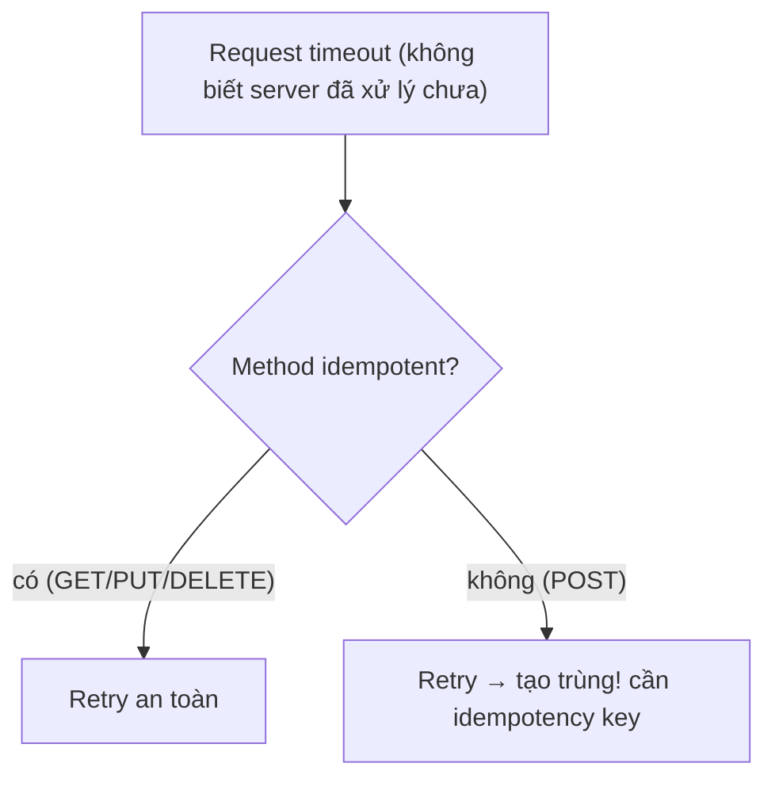

# REST vs SOAP — Phong cách kiến trúc vs Giao thức

REST và SOAP tiếp cận việc xây dựng API từ hai hướng khác nhau. REST là một architectural style xoay quanh resource và semantics của HTTP, còn SOAP là protocol dựa trên message envelope và bộ tiêu chuẩn liên quan.

## Mục lục

- [Tổng quan](#1-tổng-quan)
- [SOAP — giao thức envelope nghiêm ngặt](#2-soap--giao-thức-envelope-nghiêm-ngặt)
- [REST — ràng buộc kiến trúc, không phải giao thức](#3-rest--ràng-buộc-kiến-trúc-không-phải-giao-thức)
- [HTTP method & status làm ngữ nghĩa](#4-http-method--status-làm-ngữ-nghĩa)
- [Idempotency & an toàn — vì sao quan trọng](#5-idempotency--an-toàn--vì-sao-quan-trọng)
- [Richardson Maturity Model & HATEOAS](#6-richardson-maturity-model--hateoas)
- [Contract & versioning: WSDL vs OpenAPI](#7-contract--versioning-wsdl-vs-openapi)
- [Khi nào SOAP vẫn thắng](#8-khi-nào-soap-vẫn-thắng)
- [Anti-patterns cần tránh](#9-anti-patterns-cần-tránh)
- [Tóm tắt — Cheat sheet](#10-tóm-tắt--cheat-sheet)

---

## 1. Tổng quan

Việc so sánh chỉ theo JSON và XML bỏ qua khác biệt chính. REST tận dụng URI, HTTP method, status code và cache; SOAP cung cấp contract WSDL cùng các chuẩn như WS-Security và reliable messaging.

Lựa chọn phụ thuộc vào contract, interoperability, yêu cầu bảo mật, hạ tầng và hệ sinh thái tích hợp. Cả hai đều có thể phù hợp nếu được đặt đúng bối cảnh.

## 2. SOAP — giao thức envelope nghiêm ngặt

SOAP (Simple Object Access Protocol) bọc mọi message trong một **Envelope** XML gồm Header (metadata: bảo mật, transaction) + Body (payload hoặc Fault):

```xml
<soap:Envelope xmlns:soap="http://www.w3.org/2003/05/soap-envelope">
  <soap:Header>
    <wsse:Security>...</wsse:Security>   <!-- WS-Security: chữ ký, mã hoá -->
  </soap:Header>
  <soap:Body>
    <m:GetUserResponse><m:Name>alice</m:Name></m:GetUserResponse>
    <!-- hoặc <soap:Fault> nếu lỗi -->
  </soap:Body>
</soap:Envelope>
```

Đặc trưng SOAP:

- **WSDL** (Web Services Description Language): file XML mô tả *chính xác* mọi operation, kiểu dữ liệu, endpoint → sinh client code tự động, hợp đồng chặt.
- **Transport-agnostic**: chạy trên HTTP, SMTP, JMS, TCP... (REST gắn chặt HTTP).
- **WS-\***: bộ chuẩn doanh nghiệp — WS-Security, WS-AtomicTransaction, WS-ReliableMessaging.

> [!NOTE]
> SOAP thường chỉ dùng `POST` tới **một** endpoint; HTTP chỉ là "ống dẫn", ngữ nghĩa nằm trong XML body. Vì thế SOAP không tận dụng cache HTTP, status code, hay URL có nghĩa. Đổi lại nó có hợp đồng WSDL rất chặt và bộ chuẩn bảo mật/giao dịch cấp doanh nghiệp.

---

## 3. REST — ràng buộc kiến trúc, không phải giao thức

REST (Roy Fielding, luận án 2000) là tập **6 ràng buộc**. Tuân đủ → "RESTful":

| Ràng buộc | Ý nghĩa |
|-----------|---------|
| Client–Server | tách giao diện khỏi lưu trữ |
| **Stateless** | mỗi request tự chứa đủ thông tin; server không giữ session |
| Cacheable | response tự đánh dấu cache được hay không |
| Uniform Interface | giao diện đồng nhất (resource, method chuẩn) |
| Layered System | proxy/gateway/cache xen vào trong suốt |
| Code on Demand (tuỳ chọn) | server gửi code chạy (hiếm dùng) |

Khái niệm trung tâm: **resource** (tài nguyên) định danh bằng URL, thao tác bằng HTTP method:

```
/users           GET (danh sách), POST (tạo)
/users/123       GET (chi tiết), PUT (thay thế), PATCH (sửa phần), DELETE (xoá)
/users/123/orders   GET (đơn của user 123)
```

> [!WARNING]
> **Stateless** là ràng buộc hay bị vi phạm nhất: lưu trạng thái đăng nhập trong session server làm hỏng khả năng scale ngang (request sau phải về đúng server cũ). REST đúng nghĩa: mỗi request mang token (JWT) tự xác thực — server nào xử lý cũng được. Đây là lý do REST scale tốt.

---

## 4. HTTP method & status làm ngữ nghĩa

Sức mạnh REST là **không tự phát minh ngữ nghĩa** — dùng sẵn của HTTP:

| Method | Ngữ nghĩa | An toàn? | Idempotent? |
|--------|-----------|----------|-------------|
| GET | đọc | ✅ | ✅ |
| POST | tạo mới / hành động | ❌ | ❌ |
| PUT | thay thế toàn bộ | ❌ | ✅ |
| PATCH | sửa một phần | ❌ | ❌ (thường) |
| DELETE | xoá | ❌ | ✅ |

Và **status code** mang ý nghĩa kết quả:

```
2xx thành công   200 OK, 201 Created, 204 No Content
3xx chuyển hướng 301, 304 Not Modified (cache)
4xx lỗi client   400 Bad Request, 401, 403, 404, 409 Conflict, 422
5xx lỗi server   500, 502, 503
```

> [!WARNING]
> Anti-pattern kinh điển: trả `200 OK` kèm `{"error": "not found"}` trong body. Điều này phá vỡ toàn bộ hạ tầng HTTP — client, proxy, monitoring đều tưởng thành công. Hãy trả **đúng status code**: 404 cho không tìm thấy, 400 cho input sai, 409 cho xung đột. Status code *là* một phần API của bạn.

---

## 5. Idempotency & an toàn — vì sao quan trọng

Hai tính chất quyết định cách client retry an toàn:

- **Safe** (an toàn): không đổi state server (GET). Gọi bao nhiêu lần cũng được.
- **Idempotent** (lũy đẳng): gọi nhiều lần cho cùng kết quả như gọi một lần (PUT, DELETE, GET).



> [!IMPORTANT]
> Idempotency là nền của **độ tin cậy** trong hệ phân tán: mạng có thể timeout *sau khi* server đã xử lý nhưng *trước khi* client nhận response. Với method idempotent, client cứ retry. Với `POST` (tạo order, charge tiền), retry có thể tạo **trùng** — giải pháp: **idempotency key** (client gửi UUID, server nhớ key đã xử lý để bỏ qua lần hai). Stripe, PayPal đều dùng cơ chế này.

---

## 6. Richardson Maturity Model & HATEOAS

Leonard Richardson chia "độ RESTful" thành 4 cấp:

```
Level 0: một endpoint, POST mọi thứ (= SOAP-ish, "RPC qua HTTP")
Level 1: nhiều resource (URL có nghĩa) nhưng vẫn 1 method
Level 2: dùng đúng HTTP method + status code  ← phần lớn "REST API" dừng ở đây
Level 3: HATEOAS — response chứa link điều hướng bước tiếp theo
```

**HATEOAS** (Hypermedia As The Engine Of Application State) — response tự mô tả hành động kế tiếp bằng link:

```json
{
  "id": 123, "status": "PENDING",
  "_links": {
    "self":   { "href": "/orders/123" },
    "cancel": { "href": "/orders/123/cancel" },   // client biết làm gì tiếp
    "pay":    { "href": "/orders/123/payment" }
  }
}
```

> [!NOTE]
> HATEOAS (Level 3) là REST "thuần" theo Fielding, nhưng **rất ít API thực tế** đạt tới — vì client thường hard-code URL cho đơn giản. Phần lớn "REST API" trong công nghiệp là **Level 2** (resource + HTTP method đúng). Biết điều này để không tranh cãi vô ích về "có phải REST thật không".

---

## 7. Contract & versioning: WSDL vs OpenAPI

| | SOAP | REST |
|---|------|------|
| Mô tả hợp đồng | **WSDL** (bắt buộc, máy sinh client) | **OpenAPI/Swagger** (tuỳ chọn, phổ biến) |
| Kiểu dữ liệu | XSD nghiêm ngặt | JSON Schema / OpenAPI |
| Versioning | namespace WSDL mới | URL (`/v2/`), header, content negotiation |

REST versioning thường gây tranh luận:

```
URL path:     /v2/users          ← rõ ràng, phổ biến nhất
Header:       Accept: application/vnd.api.v2+json   ← "sạch" hơn nhưng khó test
Query param:  /users?version=2    ← ít khuyên dùng
```

> [!TIP]
> Cách bền nhất là **tiến hoá không phá vỡ** (như Protobuf): chỉ *thêm* field, không xoá/đổi nghĩa field cũ → client cũ vẫn chạy, khỏi cần version mới. Chỉ bump version (`/v2/`) khi buộc phải thay đổi phá vỡ. Versioning là chi phí — tránh được thì tốt nhất.

---

## 8. Khi nào SOAP vẫn thắng

SOAP chưa chết — nó thắng ở vài chỗ:

- **Giao dịch tài chính/ngân hàng**: cần WS-AtomicTransaction (2-phase commit cross-service), WS-ReliableMessaging (đảm bảo gửi đúng một lần).
- **Bảo mật cấp message**: WS-Security ký/mã hoá *từng phần* message (không chỉ kênh TLS) — cần khi message đi qua nhiều trung gian.
- **Hợp đồng chặt, sinh client tự động**: WSDL ép kiểu nghiêm ngặt, hợp với tích hợp doanh nghiệp lớn (B2B, hệ thống legacy, chính phủ).

> [!NOTE]
> Quy tắc thực dụng: **REST cho hầu hết API web/mobile/microservice** (đơn giản, nhẹ, cache, scale). **SOAP khi cần WS-\*** (transaction phân tán, bảo mật message-level, hợp đồng cứng trong môi trường doanh nghiệp/tài chính). Và đừng quên các lựa chọn mới: **gRPC** (RPC nhị phân hiệu năng cao, dùng Protobuf) và **GraphQL** (client tự chọn field) cho các nhu cầu khác.

---

## 9. Anti-patterns cần tránh

| Anti-pattern | Vì sao sai | Thay bằng |
|--------------|-----------|-----------|
| `200 OK` + lỗi trong body | phá hạ tầng HTTP/monitoring | đúng status code (404/400/409) |
| Động từ trong URL (`/getUser`, `/createOrder`) | không RESTful, lẫn ngữ nghĩa | danh từ resource + HTTP method |
| GET làm thay đổi state | GET phải safe; cache/crawler gọi → hỏng dữ liệu | dùng POST/PUT |
| Lưu session trong server | phá stateless, khó scale | token tự chứa (JWT) |
| Retry POST không có idempotency key | tạo bản ghi trùng | idempotency key |
| Dùng SOAP cho API public đơn giản | nặng nề thừa thãi | REST/JSON |
| Bump `/v2/` cho mọi thay đổi nhỏ | bùng nổ version | tiến hoá thêm field không phá vỡ |

---

## 10. Tóm tắt — Cheat sheet

**Khác biệt cốt lõi:**

```
SOAP = GIAO THỨC: XML envelope + WSDL + WS-*  (nghiêm ngặt, doanh nghiệp)
REST = PHONG CÁCH: stateless + resource + dùng HTTP đúng cách (nhẹ, scale)
```

| | SOAP | REST |
|---|------|------|
| Bản chất | protocol | architectural style |
| Định dạng | XML bắt buộc | thường JSON (tự do) |
| Transport | HTTP/SMTP/JMS... | HTTP |
| Ngữ nghĩa | trong XML body | HTTP method + status + URL |
| Hợp đồng | WSDL (bắt buộc) | OpenAPI (tuỳ chọn) |
| Mạnh ở | transaction, WS-Security | đơn giản, cache, scale |

**5 nguyên tắc khắc cốt:**

1. **SOAP là giao thức, REST là phong cách** — khác cấp, đừng so trực tiếp.
2. **REST dùng HTTP method + status code làm ngữ nghĩa** — đừng trả 200 cho lỗi.
3. **Stateless** giúp REST scale — token tự chứa, không session server.
4. **Idempotency + idempotency key** là nền của retry an toàn.
5. **SOAP thắng khi cần WS-\*** (transaction phân tán, bảo mật message-level).

> [!TIP]
> Một câu để nhớ: *REST không phải "JSON qua HTTP" — nó là dùng HTTP đúng như được thiết kế (method, status, URL, stateless). SOAP gói mọi thứ vào XML và tự lo ngữ nghĩa. Chọn REST cho web, SOAP cho khi hợp đồng và WS-\* là bắt buộc.*
