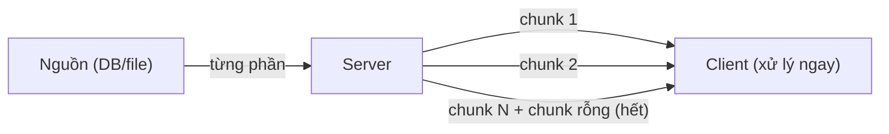
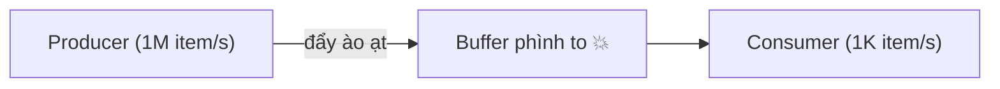

# Streaming Data — Xử lý dữ liệu không nạp hết vào bộ nhớ

## Mục lục

- [Bối cảnh: bài toán "dữ liệu lớn hơn RAM" và "kết quả đến dần"](#1-bối-cảnh-bài-toán-dữ-liệu-lớn-hơn-ram-và-kết-quả-đến-dần)
- [Streaming ở tầng IO — đọc/ghi theo luồng](#2-streaming-ở-tầng-io--đọcghi-theo-luồng)
- [Chunked transfer encoding — stream qua HTTP/1.1](#3-chunked-transfer-encoding--stream-qua-http11)
- [Server push: SSE vs WebSocket vs Long-polling](#4-server-push-sse-vs-websocket-vs-long-polling)
- [Backpressure — vấn đề cốt lõi của streaming](#5-backpressure--vấn-đề-cốt-lõi-của-streaming)
- [Reactive Streams & Flow API](#6-reactive-streams--flow-api)
- [HTTP/2 & gRPC streaming](#7-http2--grpc-streaming)
- [Java Stream lazy vs stream dữ liệu](#8-java-stream-lazy-vs-stream-dữ-liệu)
- [Anti-patterns cần tránh](#9-anti-patterns-cần-tránh)
- [Tóm tắt — Cheat sheet](#10-tóm-tắt--cheat-sheet)

---

## 1. Bối cảnh: bài toán "dữ liệu lớn hơn RAM" và "kết quả đến dần"

Hai tình huống buộc phải stream thay vì nạp hết:

```java
// SAI: nạp file 10GB vào RAM → OutOfMemoryError
byte[] all = Files.readAllBytes(Path.of("huge.csv"));   // 💥

// SAI: chờ toàn bộ kết quả query 1 triệu dòng rồi mới trả → chậm + tốn RAM
List<Row> all = jdbc.query("SELECT * FROM events");      // 💥
```

Streaming = **xử lý dữ liệu theo từng phần khi nó đến/được đọc**, không giữ toàn bộ trong bộ nhớ. Hai lợi ích: (1) bộ nhớ hằng số bất kể dữ liệu lớn cỡ nào, (2) độ trễ thấp — bắt đầu xử lý/hiển thị ngay phần đầu thay vì chờ hết.

> [!IMPORTANT]
> Tư tưởng streaming xuyên suốt mọi tầng: IO (đọc file/socket theo buffer), HTTP (chunked/SSE), database (cursor/fetch size), xử lý (lazy Stream), reactive (publisher/subscriber). Nguyên tắc chung: **đừng giữ thứ bạn không cần giữ** — tiêu thụ rồi bỏ.

---

## 2. Streaming ở tầng IO — đọc/ghi theo luồng

`InputStream`/`OutputStream` bản chất *đã là* streaming — đọc từng khối (buffer) thay vì cả file:

```java
// Bộ nhớ hằng số: chỉ giữ 8KB tại một thời điểm, copy file bao to cũng được
try (var in = new BufferedInputStream(new FileInputStream("huge.bin"));
     var out = new BufferedOutputStream(new FileOutputStream("copy.bin"))) {
    byte[] buf = new byte[8192];
    int n;
    while ((n = in.read(buf)) != -1) {   // đọc từng khối
        out.write(buf, 0, n);            // ghi ra ngay, không tích trữ
    }
}
// Java 9+: in.transferTo(out) làm đúng việc này
```

> [!TIP]
> Với dòng văn bản: `Files.lines(path)` trả `Stream<String>` **lazy** — đọc từng dòng khi stream được tiêu thụ, không nạp cả file. Nhớ đóng nó (try-with-resources) vì nó giữ file handle. Đây là khác biệt với `Files.readAllLines` (nạp hết vào `List`).

---

## 3. Chunked transfer encoding — stream qua HTTP/1.1

Bình thường HTTP response cần `Content-Length` (phải biết trước kích thước). Nhưng khi server *tạo dữ liệu dần* (chưa biết tổng kích thước), HTTP/1.1 dùng **chunked transfer encoding**:

```http
HTTP/1.1 200 OK
Transfer-Encoding: chunked

7\r\n          ← kích thước chunk (hex)
Mozilla\r\n    ← dữ liệu chunk
9\r\n
Developer\r\n
0\r\n\r\n       ← chunk rỗng = kết thúc
```

Server gửi từng chunk khi sẵn sàng; client xử lý ngay. Đây là nền của: tải file lớn (server đọc đĩa và đẩy dần), export CSV khổng lồ, log streaming.



> [!NOTE]
> Trong Spring, trả `StreamingResponseBody` hay `ResponseEntity<Flux<T>>` (WebFlux) sẽ dùng chunked — server không gom hết vào RAM mà ghi dần ra socket. Đây là cách export hàng triệu dòng mà không OOM.

---

## 4. Server push: SSE vs WebSocket vs Long-polling

Khi *server* cần đẩy dữ liệu tới client liên tục (giá cổ phiếu, thông báo, chat), có ba kỹ thuật:

| | Long-polling | SSE | WebSocket |
|---|--------------|-----|-----------|
| Chiều | client hỏi lại liên tục | server → client (1 chiều) | song công (2 chiều) |
| Giao thức | HTTP thường | HTTP (chunked, `text/event-stream`) | nâng cấp từ HTTP → ws:// |
| Tự reconnect | thủ công | **tự động** (built-in) | thủ công |
| Dữ liệu | bất kỳ | text (UTF-8) | text + binary |
| Hợp với | tương thích cũ | feed/notification 1 chiều | chat, game, collaborative |

```java
// SSE trong Spring — server đẩy event, client nhận dần
@GetMapping(value = "/stream", produces = MediaType.TEXT_EVENT_STREAM_VALUE)
public Flux<PriceUpdate> stream() {
    return priceService.updates();   // mỗi update đẩy ngay tới browser
}
```

> [!TIP]
> Chọn đúng: cần **2 chiều** (chat, game) → WebSocket. Chỉ server → client (dashboard, notification, log) → **SSE** (đơn giản hơn nhiều, tự reconnect, chạy trên HTTP thường, qua được proxy/firewall dễ). Long-polling chỉ khi buộc phải tương thích hạ tầng cũ. Đừng mặc định WebSocket cho mọi thứ — nó phức tạp hơn cần thiết cho luồng một chiều.

---

## 5. Backpressure — vấn đề cốt lõi của streaming

Vấn đề lớn nhất khi stream: **producer nhanh hơn consumer**. Nếu producer cứ đẩy, consumer không kịp xử lý → hàng đợi phình → OOM.



**Backpressure** = cơ chế để consumer *báo ngược* cho producer "tôi chỉ nhận được N item nữa thôi, chậm lại". Đây là khác biệt then chốt giữa stream "ngây thơ" (push mù) và stream có kiểm soát.

| Chiến lược khi quá tải | Hành vi |
|------------------------|---------|
| Buffer | xếp hàng (rủi ro OOM nếu vô hạn) |
| Drop | bỏ bớt item (mất dữ liệu, vd metric) |
| Latest | chỉ giữ item mới nhất |
| Block/request-N | consumer yêu cầu đúng số lượng kham được |

> [!WARNING]
> Bỏ qua backpressure là nguyên nhân số một của OOM/crash trong hệ thống streaming. `Flux.buffer()` không giới hạn, đọc Kafka không kiểm soát fetch, hay đẩy WebSocket không chờ ack — đều có thể làm tràn bộ nhớ. Luôn thiết kế "consumer điều khiển tốc độ", không phải "producer đẩy mù".

---

## 6. Reactive Streams & Flow API

**Reactive Streams** là chuẩn (đưa vào JDK 9 dưới dạng `java.util.concurrent.Flow`) giải quyết backpressure bằng 4 interface:

```java
public interface Flow {
    interface Publisher<T> { void subscribe(Subscriber<? super T> s); }
    interface Subscriber<T> {
        void onSubscribe(Subscription s);   // nhận handle để yêu cầu
        void onNext(T item);
        void onError(Throwable t);
        void onComplete();
    }
    interface Subscription {
        void request(long n);   // ← BACKPRESSURE: "gửi cho tôi n item nữa"
        void cancel();
    }
}
```

Mấu chốt là `Subscription.request(n)`: consumer **chủ động kéo** đúng số lượng mình kham được (pull-based demand) thay vì bị đẩy mù. Producer chỉ được gửi tối đa số đã được request.

> [!NOTE]
> Bạn hiếm khi implement `Flow` trực tiếp — dùng thư viện: **Project Reactor** (`Flux`/`Mono` — nền của Spring WebFlux), **RxJava**, **Akka Streams**. Tất cả tuân chuẩn Reactive Streams nên ghép được với nhau. Chúng cho toán tử `map`/`filter`/`flatMap`/`buffer`/`window` trên *luồng vô hạn* với backpressure tự động.

---

## 7. HTTP/2 & gRPC streaming

HTTP/2 hỗ trợ **multiplexing** (nhiều stream song song trên một kết nối TCP) và streaming hai chiều ở tầng giao thức. **gRPC** (trên HTTP/2) cho 4 kiểu:

```
Unary:           1 request → 1 response          (như REST thường)
Server streaming: 1 request → N response          (vd tải danh sách lớn dần)
Client streaming: N request → 1 response          (vd upload chunks)
Bidirectional:   N request ↔ N response          (chat, đồng bộ real-time)
```

> [!TIP]
> gRPC streaming + Protobuf là combo mạnh cho giao tiếp microservice nội bộ cần thông lượng cao và streaming: nhị phân nhỏ gọn, multiplexing, backpressure qua HTTP/2 flow control. Cho client web (browser) thì SSE/WebSocket vẫn phổ biến hơn vì gRPC-web cần proxy.

---

## 8. Java Stream lazy vs stream dữ liệu

Đừng nhầm `java.util.stream.Stream` (xử lý collection) với "streaming dữ liệu qua mạng" — nhưng chúng chung tư tưởng **lazy**:

```java
// Java Stream LAZY: không xử lý gì cho tới khi gặp terminal operation
Files.lines(path)                     // nguồn lazy — chưa đọc file
     .filter(l -> l.contains("ERROR")) // chưa chạy
     .map(String::toUpperCase)         // chưa chạy
     .limit(10)                        // short-circuit
     .forEach(System.out::println);    // TERMINAL → giờ mới đọc, đọc tới khi đủ 10 thì DỪNG
```

Nhờ lazy + short-circuit (`limit`, `findFirst`, `anyMatch`), Java Stream xử lý nguồn **vô hạn/rất lớn** mà chỉ đọc phần cần thiết — cùng tinh thần với streaming IO.

> [!IMPORTANT]
> Điểm chung của mọi "stream" (IO stream, HTTP chunk, Java Stream, reactive Flux): **pull khi cần, xử lý từng phần, không vật chất hoá toàn bộ**. Khác biệt là Java Stream pull đồng bộ một consumer, còn reactive xử lý bất đồng bộ + backpressure + nhiều operator trên luồng theo thời gian.

---

## 9. Anti-patterns cần tránh

| Anti-pattern | Vì sao sai | Thay bằng |
|--------------|-----------|-----------|
| `Files.readAllBytes` cho file lớn | nạp hết → OOM | `InputStream`/`transferTo`/`Files.lines` |
| `SELECT *` nạp cả triệu dòng vào List | OOM + chậm | cursor / fetch size / streaming query |
| Stream không backpressure | producer tràn buffer → OOM | Reactive Streams (`request(n)`) |
| WebSocket cho luồng 1 chiều | phức tạp thừa | SSE |
| Quên đóng `Files.lines`/stream | rò file handle | try-with-resources |
| Buffer vô hạn "cho chắc" | che giấu, vẫn OOM | giới hạn buffer + chiến lược drop/latest |
| Gom hết response rồi mới trả | trễ cao, tốn RAM | chunked / `StreamingResponseBody` |

---

## 10. Tóm tắt — Cheat sheet

**Các tầng streaming:**

```
IO       → InputStream/OutputStream theo buffer, transferTo, Files.lines (lazy)
HTTP/1.1 → chunked transfer encoding (Transfer-Encoding: chunked)
Push     → SSE (1 chiều, tự reconnect) / WebSocket (2 chiều) / long-poll (cũ)
Reactive → Flow/Reactor/RxJava + backpressure (request(n))
HTTP/2   → multiplexing, gRPC 4 kiểu streaming
```

| Nhu cầu | Chọn |
|---------|------|
| Copy/đọc file lớn | InputStream + buffer / `transferTo` |
| Export dữ liệu lớn qua HTTP | chunked / `StreamingResponseBody` |
| Server đẩy 1 chiều (notification) | SSE |
| Real-time 2 chiều (chat/game) | WebSocket |
| Luồng async + backpressure | Reactor `Flux` / RxJava |
| Microservice thông lượng cao | gRPC streaming |

**5 nguyên tắc khắc cốt:**

1. **Đừng vật chất hoá toàn bộ** — xử lý từng phần, bộ nhớ hằng số.
2. **Backpressure là bắt buộc** — consumer điều khiển tốc độ, không đẩy mù.
3. **SSE cho 1 chiều, WebSocket cho 2 chiều** — đừng mặc định WebSocket.
4. **Java Stream lazy + short-circuit** xử lý nguồn lớn/vô hạn hiệu quả.
5. **Luôn đóng stream** (try-with-resources) để khỏi rò tài nguyên.

> [!TIP]
> Một câu để nhớ: *Streaming là nghệ thuật "không giữ thứ vừa đi qua tay" — từ buffer 8KB copy file 10GB, tới `request(n)` giữ consumer khỏi chết đuối. Hỏi luôn: ai điều khiển tốc độ, và mình đang giữ bao nhiêu trong RAM?*
