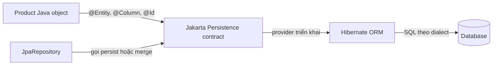
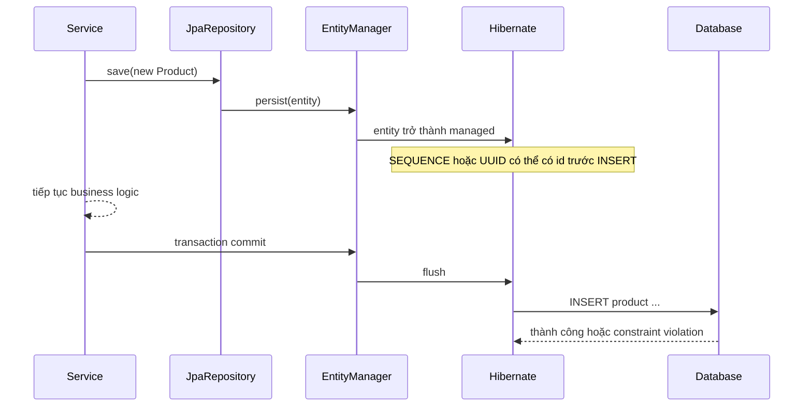
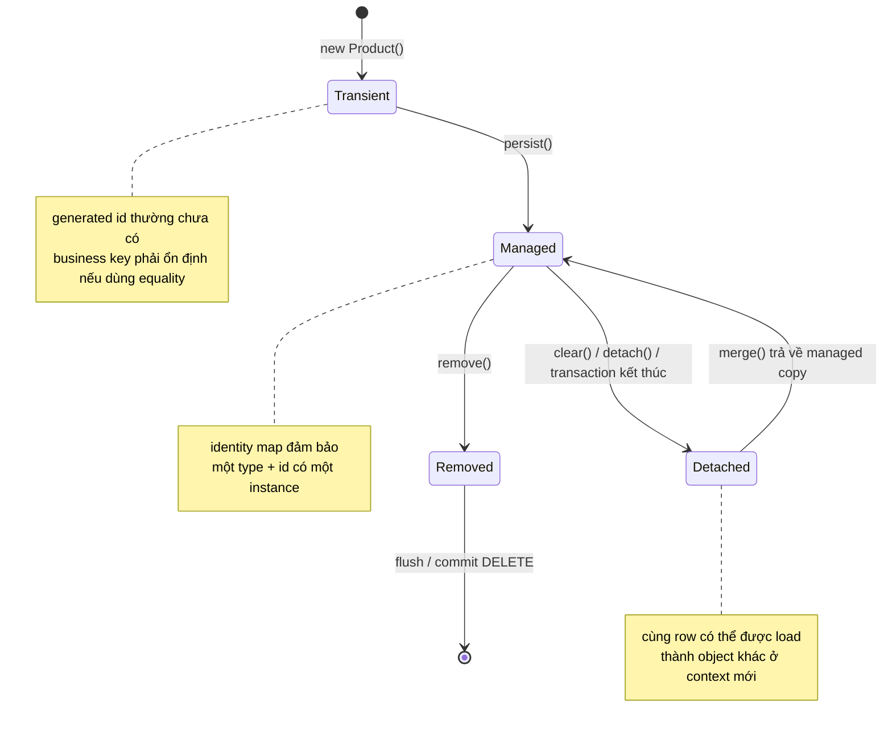

Entity mapping là quá trình mô tả cách một object Java tương ứng với dữ liệu quan hệ. Identity là quy tắc trả lời câu hỏi quan trọng hơn: “Hai object này có đại diện cho cùng một bản ghi nghiệp vụ hay không?”. Mapping sai thường gây lỗi ngay khi khởi động hoặc chạy SQL. Identity sai nguy hiểm hơn vì lỗi có thể chỉ xuất hiện khi entity đi qua nhiều transaction, proxy hoặc `HashSet`.

> [!NOTE]
> Bài viết dùng annotation thuộc package `jakarta.persistence`. Nếu dự án còn import `javax.persistence`, đó là API JPA cũ trước Jakarta EE 9; ý tưởng mapping tương tự nhưng không nên trộn hai namespace trong cùng ứng dụng.

## Mục lục

- [1. Ba lớp cần phân biệt](#1-ba-lớp-cần-phân-biệt)
- [2. Hợp đồng của một entity](#2-hợp-đồng-của-một-entity)
  - [2.1. Yêu cầu tối thiểu](#21-yêu-cầu-tối-thiểu)
  - [2.2. Field access và property access](#22-field-access-và-property-access)
  - [2.3. Tên bảng tên cột và naming strategy](#23-tên-bảng-tên-cột-và-naming-strategy)
- [3. Ví dụ mapping hoàn chỉnh](#3-ví-dụ-mapping-hoàn-chỉnh)
  - [3.1. Entity Product](#31-entity-product)
  - [3.2. DDL và SQL Hibernate sinh ra](#32-ddl-và-sql-hibernate-sinh-ra)
- [4. Ánh xạ kiểu dữ liệu cơ bản](#4-ánh-xạ-kiểu-dữ-liệu-cơ-bản)
  - [4.1. Enum](#41-enum)
  - [4.2. Ngày giờ](#42-ngày-giờ)
  - [4.3. Tiền tệ và số thập phân](#43-tiền-tệ-và-số-thập-phân)
  - [4.4. LOB và dữ liệu lớn](#44-lob-và-dữ-liệu-lớn)
  - [4.5. AttributeConverter](#45-attributeconverter)
  - [4.6. Nullability và validation](#46-nullability-và-validation)
- [5. Simple key và chiến lược sinh khóa](#5-simple-key-và-chiến-lược-sinh-khóa)
  - [5.1. Primary key là persistent identity](#51-primary-key-là-persistent-identity)
  - [5.2. So sánh các GenerationType](#52-so-sánh-các-generationtype)
  - [5.3. Sequence và allocationSize](#53-sequence-và-allocationsize)
  - [5.4. UUID](#54-uuid)
  - [5.5. Surrogate key và natural key](#55-surrogate-key-và-natural-key)
- [6. Composite key](#6-composite-key)
  - [6.1. EmbeddedId](#61-embeddedid)
  - [6.2. IdClass](#62-idclass)
  - [6.3. Chọn cách nào](#63-chọn-cách-nào)
- [7. equals và hashCode cho entity](#7-equals-và-hashcode-cho-entity)
  - [7.1. Vì sao bài toán khó](#71-vì-sao-bài-toán-khó)
  - [7.2. Ưu tiên business key bất biến](#72-ưu-tiên-business-key-bất-biến)
  - [7.3. Khi chỉ có generated id](#73-khi-chỉ-có-generated-id)
  - [7.4. Proxy và entity inheritance](#74-proxy-và-entity-inheritance)
- [8. Spring Data JPA tham gia ở đâu](#8-spring-data-jpa-tham-gia-ở-đâu)
  - [8.1. Repository và transaction service](#81-repository-và-transaction-service)
  - [8.2. save không đồng nghĩa với INSERT ngay lập tức](#82-save-không-đồng-nghĩa-với-insert-ngay-lập-tức)
  - [8.3. Entity có id được gán thủ công](#83-entity-có-id-được-gán-thủ-công)
- [9. Identity qua vòng đời entity](#9-identity-qua-vòng-đời-entity)
- [10. Anti-pattern và cách sửa](#10-anti-pattern-và-cách-sửa)
- [11. Kiểm thử mapping và identity](#11-kiểm-thử-mapping-và-identity)
- [12. Checklist và cheat sheet](#12-checklist-và-cheat-sheet)
- [13. Tài liệu liên quan](#13-tài-liệu-liên-quan)

---

## 1. Ba lớp cần phân biệt

Trong một ứng dụng Spring Boot, ba cái tên thường xuất hiện cùng nhau nhưng không cùng vai trò:

| Lớp | Vai trò | Ví dụ API |
|---|---|---|
| **Jakarta Persistence** thường được gọi là JPA | Đặc tả chuẩn: định nghĩa annotation, lifecycle và hành vi portable giữa provider | `@Entity`, `@Id`, `EntityManager` |
| **Hibernate ORM** | Persistence provider: triển khai đặc tả và thực sự tạo SQL, dirty checking, proxy, cache | `Session`, `@NaturalId`, `@UuidGenerator` |
| **Spring Data JPA** | Abstraction phía trên JPA: sinh repository và giảm code CRUD | `JpaRepository`, derived query, `save()` |

**Portable** nghĩa là code chỉ dựa trên hợp đồng Jakarta Persistence và có thể đổi provider với ít thay đổi. `@Entity` là chuẩn Jakarta Persistence. `@NaturalId` là tính năng riêng của Hibernate. `JpaRepository` thuộc Spring Data JPA và cuối cùng vẫn gọi `EntityManager`.



> [!IMPORTANT]
> Mapping annotation không phải do Spring Data JPA diễn giải. Hibernate đọc metadata Jakarta Persistence và quản lý entity; Spring Data JPA chỉ cung cấp lớp repository tiện dụng ở phía trên.

## 2. Hợp đồng của một entity

Entity là object có **persistent identity** — định danh tồn tại bền vững trong database. Một entity không đơn thuần là DTO có thêm `@Entity`; nó phải đáp ứng quy tắc để provider có thể khởi tạo, theo dõi và ánh xạ trạng thái.

### 2.1. Yêu cầu tối thiểu

Một entity portable theo Jakarta Persistence nên:

- Được đánh dấu `@Entity` và có một primary key bằng `@Id` hoặc `@EmbeddedId`.
- Là top-level class hoặc static member class, không phải `record`, `enum` hay interface.
- Có constructor không tham số `public` hoặc `protected` để provider khởi tạo.
- Không khai báo class, persistent field hoặc persistent method là `final` theo hợp đồng portable.
- Giữ persistent state trong field hoặc JavaBeans property được provider truy cập.

```java
@Entity
public class Customer {
    @Id
    private Long id;

    private String name;

    protected Customer() { // dành cho persistence provider
    }

    public Customer(Long id, String name) {
        this.id = id;
        this.name = name;
    }
}
```

Hibernate có thể persist một số mô hình ít chặt hơn đặc tả, nhưng class hoặc accessor `final` có thể làm mất khả năng tạo lazy proxy. Nếu không chủ đích phụ thuộc Hibernate, hãy giữ mô hình portable.

> [!WARNING]
> Đừng dùng Java `record` làm entity. Jakarta Persistence hiện đại cho phép `record` làm một số **embeddable** hoặc primary-key class, nhưng entity vẫn cần mô hình có lifecycle và trạng thái mutable do provider quản lý.

### 2.2. Field access và property access

**Access strategy** là cách provider đọc và ghi persistent state:

- **Field access**: annotation mapping đặt trên field. Hibernate đọc và ghi field trực tiếp.
- **Property access**: annotation mapping đặt trên getter. Hibernate gọi getter và setter theo quy ước JavaBeans.

Vị trí của `@Id` thường quyết định access strategy mặc định cho cả entity hierarchy:

```java
// Field access
@Id
private Long id;

// Property access
@Id
public Long getId() {
    return id;
}
```

Field access phù hợp với domain model muốn giữ setter ở mức tối thiểu. Property access hữu ích khi logic đọc hoặc ghi bắt buộc phải đi qua accessor. Có thể dùng `@Access(AccessType.FIELD)` hoặc `@Access(AccessType.PROPERTY)` để chỉ rõ lựa chọn.

> [!WARNING]
> Không đặt `@Id` trên field rồi rải `@Column` lên getter một cách ngẫu nhiên. Trộn hai strategy mà không có `@Access` rõ ràng tạo mapping không portable và rất khó review.

`@Transient` loại một field hoặc property khỏi persistent state. Từ khóa Java `transient` cũng loại field khỏi field-access mapping, nhưng `@Transient` thể hiện ý định ORM rõ hơn.

### 2.3. Tên bảng tên cột và naming strategy

`@Table` và `@Column` ghi đè tên hoặc constraint mặc định:

```java
@Entity(name = "Product")             // tên entity dùng trong JPQL
@Table(name = "product")              // tên bảng vật lý
public class Product {
    @Column(name = "display_name", nullable = false, length = 200)
    private String name;
}
```

Ba loại tên cần phân biệt:

| Tên | Dùng ở đâu | Ví dụ |
|---|---|---|
| Entity name | JPQL và metamodel | `select p from Product p` |
| Logical name | Metadata trung gian do provider suy ra | `displayName` |
| Physical name | Identifier thật trong database | `display_name` |

Jakarta Persistence định nghĩa quy tắc mặc định cơ bản, nhưng naming strategy nâng cao là khái niệm của provider. Spring Boot thường cấu hình Hibernate chuyển camelCase sang snake_case. Đừng dựa vào hành vi đó khi schema do DBA hoặc migration tool quản lý; hãy khai báo rõ tên quan trọng và kiểm tra DDL migration.

## 3. Ví dụ mapping hoàn chỉnh

Ví dụ sau dùng surrogate key dạng sequence, natural key `sku`, enum dạng chuỗi, tiền tệ bằng `BigDecimal`, timestamp bằng `Instant` và optimistic locking bằng `@Version`.

### 3.1. Entity Product

```java
package com.example.catalog;

import jakarta.persistence.Access;
import jakarta.persistence.AccessType;
import jakarta.persistence.Column;
import jakarta.persistence.Entity;
import jakarta.persistence.EnumType;
import jakarta.persistence.Enumerated;
import jakarta.persistence.GeneratedValue;
import jakarta.persistence.GenerationType;
import jakarta.persistence.Id;
import jakarta.persistence.PrePersist;
import jakarta.persistence.SequenceGenerator;
import jakarta.persistence.Table;
import jakarta.persistence.UniqueConstraint;
import jakarta.persistence.Version;

import java.math.BigDecimal;
import java.time.Instant;
import java.util.Objects;

@Entity
@Table(
    name = "product",
    uniqueConstraints = @UniqueConstraint(
        name = "uk_product_sku",
        columnNames = "sku"
    )
)
@Access(AccessType.FIELD)
public class Product {

    @Id
    @GeneratedValue(strategy = GenerationType.SEQUENCE, generator = "product_seq")
    @SequenceGenerator(
        name = "product_seq",
        sequenceName = "product_seq",
        allocationSize = 50
    )
    private Long id;

    @Column(nullable = false, updatable = false, length = 64)
    private String sku;

    @Column(nullable = false, length = 200)
    private String name;

    @Column(nullable = false, precision = 19, scale = 2)
    private BigDecimal price;

    @Enumerated(EnumType.STRING)
    @Column(nullable = false, length = 32)
    private ProductStatus status;

    @Column(name = "created_at", nullable = false, updatable = false)
    private Instant createdAt;

    @Version
    @Column(nullable = false)
    private Long version;

    protected Product() {
    }

    public Product(String sku, String name, BigDecimal price) {
        this.sku = Objects.requireNonNull(sku);
        this.name = Objects.requireNonNull(name);
        this.price = Objects.requireNonNull(price);
        this.status = ProductStatus.DRAFT;
    }

    @PrePersist
    void initializeCreatedAt() {
        if (createdAt == null) {
            createdAt = Instant.now();
        }
    }

    public void rename(String newName) {
        this.name = Objects.requireNonNull(newName);
    }

    public void changePrice(BigDecimal newPrice) {
        if (newPrice.signum() < 0) {
            throw new IllegalArgumentException("price must be non-negative");
        }
        this.price = newPrice;
    }

    public Long getId() { return id; }
    public String getSku() { return sku; }
    public String getName() { return name; }
    public BigDecimal getPrice() { return price; }
    public ProductStatus getStatus() { return status; }
    public Instant getCreatedAt() { return createdAt; }
    public Long getVersion() { return version; }
}

enum ProductStatus {
    DRAFT,
    ACTIVE,
    DISCONTINUED
}
```

`@Version` không phải một phần của primary key. Nó lưu số phiên bản để Hibernate phát hiện hai transaction cùng cập nhật một row; câu `UPDATE` sẽ kèm điều kiện version cũ.

### 3.2. DDL và SQL Hibernate sinh ra

Nếu Hibernate tạo schema trên PostgreSQL, DDL đại diện có dạng:

```sql
create sequence product_seq start with 1 increment by 50;

create table product (
    id bigint not null,
    version bigint not null,
    price numeric(19,2) not null,
    created_at timestamp(6) with time zone not null,
    sku varchar(64) not null,
    status varchar(32) not null,
    name varchar(200) not null,
    primary key (id),
    constraint uk_product_sku unique (sku)
);
```

Khi persist entity đầu tiên, SQL đại diện là:

```sql
select nextval('product_seq');

insert into product
    (created_at, name, price, sku, status, version, id)
values
    (?, ?, ?, ?, ?, ?, ?);
```

Khi đổi giá của entity đang managed, Hibernate dirty checking phát hiện thay đổi và flush:

```sql
update product
set name = ?, price = ?, status = ?, version = ?
where id = ? and version = ?;
```

SQL chính xác phụ thuộc Hibernate version, database dialect, `@DynamicUpdate` và cấu hình batching. Điều cần kiểm tra là constraint, kiểu cột, chiến lược lấy id và điều kiện `version`, không phải thứ tự cột trong ví dụ.

> [!TIP]
> Trong production, dùng Flyway hoặc Liquibase làm nguồn sự thật cho schema. `spring.jpa.hibernate.ddl-auto=validate` giúp xác nhận mapping khớp schema mà không tự sửa database.

## 4. Ánh xạ kiểu dữ liệu cơ bản

**Basic type** là giá trị được lưu vào một cột đơn theo mapping chuẩn, ví dụ `String`, `Long`, `BigDecimal`, `UUID` hoặc các type trong `java.time`.

### 4.1. Enum

Luôn ghi rõ cách lưu enum:

```java
@Enumerated(EnumType.STRING)
@Column(nullable = false, length = 32)
private ProductStatus status;
```

`EnumType.STRING` lưu `ACTIVE`; `EnumType.ORDINAL` lưu vị trí `1`. Ordinal dễ hỏng dữ liệu khi chèn, xóa hoặc đổi thứ tự constant.

```sql
-- Dữ liệu STRING vẫn đọc được bằng mắt và không phụ thuộc thứ tự enum
select status from product where id = 42;
-- ACTIVE
```

Nếu tên enum cũng cần thay đổi độc lập với giá trị database, dùng `AttributeConverter` thay vì dựa trực tiếp vào `name()`.

### 4.2. Ngày giờ

Ưu tiên Java Time API:

| Java type | Ý nghĩa phù hợp | Ví dụ nghiệp vụ |
|---|---|---|
| `LocalDate` | Ngày không có giờ và múi giờ | ngày sinh |
| `LocalDateTime` | Ngày giờ địa phương, không biểu diễn một thời điểm toàn cầu | giờ mở cửa theo lịch địa phương |
| `Instant` | Một thời điểm tuyệt đối trên UTC timeline | `createdAt`, thời điểm phát sự kiện |
| `OffsetDateTime` | Ngày giờ kèm UTC offset | thời điểm cần giữ offset đã nhập |

`@Temporal` chỉ dành cho `java.util.Date` và `Calendar` kiểu cũ; không đặt nó lên `java.time.Instant` hoặc `LocalDate`.

> [!WARNING]
> `LocalDateTime` không chứa timezone. Đừng dùng nó cho audit timestamp nếu hệ thống chạy nhiều vùng; dùng `Instant`, chuẩn hóa UTC và kiểm thử mapping của dialect.

### 4.3. Tiền tệ và số thập phân

Không dùng `double` cho tiền vì biểu diễn nhị phân không chính xác với nhiều số thập phân. Dùng `BigDecimal` và khai báo precision, scale:

```java
@Column(nullable = false, precision = 19, scale = 2)
private BigDecimal price;
```

**Precision** là tổng số chữ số; **scale** là số chữ số sau dấu thập phân. `numeric(19,2)` chứa tối đa 17 chữ số phần nguyên và 2 chữ số phần thập phân.

Nếu nhiều loại tiền cùng xuất hiện, thêm mã tiền tệ, ví dụ `currency char(3)`, hoặc đóng gói amount và currency trong `@Embeddable`. Một con số `100.00` tự nó chưa cho biết là VND, USD hay EUR.

### 4.4. LOB và dữ liệu lớn

`@Lob` báo cho provider ánh xạ **large object** — dữ liệu text hoặc binary lớn:

```java
@Lob
@Column(name = "manual_text")
private String manualText;

@Lob
@Basic(fetch = FetchType.LAZY)
private byte[] imageBytes;
```

`LAZY` trên basic attribute chỉ là hint trong Jakarta Persistence. Việc lazy-load LOB có thể cần Hibernate bytecode enhancement và còn phụ thuộc dialect. Đừng giả định annotation này chắc chắn ngăn cột lớn được đọc.

Với file lớn, object storage thường phù hợp hơn database; entity chỉ lưu object key, checksum, MIME type và kích thước.

### 4.5. AttributeConverter

`AttributeConverter<X, Y>` biến domain type `X` thành kiểu cột `Y`. Ví dụ lưu một value object `EmailAddress` thành `varchar`:

```java
public record EmailAddress(String value) {
    public EmailAddress {
        if (value == null || !value.contains("@")) {
            throw new IllegalArgumentException("invalid email");
        }
        value = value.toLowerCase();
    }
}

@Converter(autoApply = true)
public class EmailAddressConverter
        implements AttributeConverter<EmailAddress, String> {

    @Override
    public String convertToDatabaseColumn(EmailAddress attribute) {
        return attribute == null ? null : attribute.value();
    }

    @Override
    public EmailAddress convertToEntityAttribute(String dbData) {
        return dbData == null ? null : new EmailAddress(dbData);
    }
}
```

Converter phù hợp với mapping một cột. Nếu value object cần nhiều cột, dùng `@Embeddable`. Không dựa vào converter cho primary key, version, association hoặc field đã có `@Enumerated`; các trường hợp này có quy tắc mapping riêng.

### 4.6. Nullability và validation

Ba lớp kiểm soát null có mục tiêu khác nhau:

| Cơ chế | Chạy ở đâu | Giá trị |
|---|---|---|
| `Objects.requireNonNull()` hoặc domain method | Ngay khi tạo hoặc sửa object | fail fast trong Java |
| Bean Validation `@NotNull` | Validation layer và lifecycle tích hợp | thông báo lỗi ứng dụng |
| `@Column(nullable = false)` và DB `NOT NULL` | Metadata mapping và database | bảo vệ dữ liệu cuối cùng |

`nullable = false` không thay thế validation trong Java. Ngược lại, `@NotNull` cũng không thay thế constraint database vì dữ liệu có thể được ghi từ ứng dụng khác hoặc SQL trực tiếp.

## 5. Simple key và chiến lược sinh khóa

### 5.1. Primary key là persistent identity

Mọi entity phải có primary key. Trong một persistence context, cặp `(entity type, primary key)` xác định duy nhất một managed instance. Đây là **identity map**: hai lần `find(Product.class, 42L)` trong cùng persistence context trả về cùng object reference.

```java
Product first = entityManager.find(Product.class, 42L);
Product second = entityManager.find(Product.class, 42L);

assert first == second; // cùng persistence context
```

Không được thay đổi primary key sau khi entity đã persistent. Nếu nghiệp vụ cho phép đổi `sku`, `email` hoặc mã hợp đồng, những field đó không nên là primary key vật lý.

### 5.2. So sánh các GenerationType

| Strategy | Nơi sinh id | Điểm mạnh | Trade-off chính |
|---|---|---|---|
| `AUTO` | Provider chọn | code ngắn, tương đối portable | lựa chọn có thể khác giữa provider hoặc dialect |
| `SEQUENCE` | Database sequence | lấy id trước `INSERT`, hỗ trợ allocation và batching tốt | database phải hỗ trợ sequence; cấu hình phải khớp DDL |
| `IDENTITY` | Identity hoặc auto-increment column khi `INSERT` | tự nhiên với MySQL và schema legacy | thường phải `INSERT` sớm để biết id; hạn chế insert batching |
| `TABLE` | Bảng riêng giữ counter | dùng được khi DB không có sequence | contention, thêm round-trip và locking |
| `UUID` | Provider sinh UUID | sinh trước SQL, phù hợp hệ phân tán | index và foreign key rộng hơn số nguyên |

Với database hỗ trợ sequence như PostgreSQL hoặc Oracle, `SEQUENCE` thường là lựa chọn tốt cho numeric surrogate key. Với MySQL auto-increment, `IDENTITY` là lựa chọn tự nhiên. Đừng chọn `AUTO` nếu hệ thống cần DDL và performance có thể dự đoán chính xác.

### 5.3. Sequence và allocationSize

`allocationSize` cho phép provider dành trước một dải id để giảm số lần gọi database:

```java
@SequenceGenerator(
    name = "product_seq",
    sequenceName = "product_seq",
    allocationSize = 50
)
```

Với allocation 50, Hibernate không nhất thiết gọi `nextval` cho từng entity. Đổi lại, id có thể có khoảng trống sau restart hoặc rollback. Primary key chỉ cần duy nhất và bất biến; nó không phải số thứ tự nghiệp vụ liên tục.

> [!WARNING]
> `allocationSize` trong mapping phải tương thích với `INCREMENT BY` của sequence do migration tạo. Schema lệch cấu hình có thể làm ứng dụng khởi động thất bại hoặc phân bổ id sai tùy provider và optimizer.

Đừng dùng primary key làm số hóa đơn cần liên tục theo pháp lý. Hãy tạo một cơ chế numbering nghiệp vụ riêng với transaction và quy tắc audit riêng.

### 5.4. UUID

Từ Jakarta Persistence 3.1, chuẩn đã có `GenerationType.UUID`:

```java
@Id
@GeneratedValue(strategy = GenerationType.UUID)
private UUID id;
```

UUID có thể được tạo trước khi chạy `INSERT`, giúp tạo aggregate và event trong hệ phân tán mà không cần round-trip lấy sequence. Tuy nhiên UUID ngẫu nhiên rộng hơn `bigint` và có locality kém hơn trong B-tree index.

Nếu cần điều khiển kiểu UUID cụ thể, Hibernate có `@UuidGenerator`; đó là extension của Hibernate, không phải annotation portable của JPA:

```java
@Id
@GeneratedValue
@org.hibernate.annotations.UuidGenerator
private UUID id;
```

Lưu bằng native UUID type nếu database hỗ trợ. Chỉ lưu text khi có lý do tương thích; `varchar(36)` chiếm nhiều không gian index hơn dạng binary hoặc native.

### 5.5. Surrogate key và natural key

**Surrogate key** là khóa kỹ thuật không mang ý nghĩa nghiệp vụ, ví dụ sequence `id`. **Natural key** hay business key là tập thuộc tính xác định duy nhất đối tượng trong domain, ví dụ `sku`.

Mô hình thực tế thường dùng cả hai:

```java
@Id
@GeneratedValue(strategy = GenerationType.SEQUENCE)
private Long id; // surrogate key cho PK và FK

@Column(nullable = false, updatable = false, unique = true)
private String sku; // natural key cho nghiệp vụ
```

Surrogate key giúp foreign key nhỏ và ổn định. Natural key vẫn phải có unique constraint ở database nếu nghiệp vụ yêu cầu duy nhất. Hibernate cung cấp `@NaturalId` để tối ưu lookup theo natural key, nhưng đây là API riêng của Hibernate:

```java
@org.hibernate.annotations.NaturalId(mutable = false)
@Column(nullable = false, updatable = false, unique = true)
private String sku;
```

`unique = true` chủ yếu hữu ích khi sinh schema. Với schema do migration quản lý, hãy tạo constraint có tên rõ ràng trong migration và xử lý lỗi duplicate ở transaction boundary.

## 6. Composite key

**Composite key** là primary key gồm nhiều cột. Chỉ dùng nó khi identity của schema thực sự là tổ hợp và việc thay bằng surrogate key không hợp lý, ví dụ dòng chi tiết được xác định bởi `(order_id, line_no)`.

### 6.1. EmbeddedId

`@EmbeddedId` gom key thành một value object. Đây thường là mô hình dễ đọc hơn:

```java
@Embeddable
public class OrderLineId implements Serializable {
    @Column(name = "order_id")
    private Long orderId;

    @Column(name = "line_no")
    private Integer lineNo;

    protected OrderLineId() {
    }

    public OrderLineId(Long orderId, Integer lineNo) {
        this.orderId = Objects.requireNonNull(orderId);
        this.lineNo = Objects.requireNonNull(lineNo);
    }

    @Override
    public boolean equals(Object other) {
        if (this == other) return true;
        if (!(other instanceof OrderLineId that)) return false;
        return orderId.equals(that.orderId) && lineNo.equals(that.lineNo);
    }

    @Override
    public int hashCode() {
        return Objects.hash(orderId, lineNo);
    }
}

@Entity
@Table(name = "order_line")
public class OrderLine {
    @EmbeddedId
    private OrderLineId id;

    @Column(nullable = false, precision = 19, scale = 2)
    private BigDecimal unitPrice;

    protected OrderLine() {
    }
}
```

Primary-key class bắt buộc có `equals()` và `hashCode()` nhất quán với phép so sánh của các cột database. Jakarta Persistence 3.2 cho phép một số primary-key class là `record`; nếu ứng dụng chạy stack cũ hơn, class thường có constructor không tham số vẫn tương thích rộng hơn.

### 6.2. IdClass

`@IdClass` giữ từng phần key trực tiếp trên entity, còn class key lặp lại cùng tên và kiểu:

```java
public class OrderLineId implements Serializable {
    private Long orderId;
    private Integer lineNo;

    public OrderLineId() {
    }

    // equals() và hashCode() theo cả hai field
}

@Entity
@IdClass(OrderLineId.class)
public class OrderLine {
    @Id
    private Long orderId;

    @Id
    private Integer lineNo;
}
```

Tên và type của field trong `IdClass` phải khớp với các field `@Id` trên entity. Sự lặp lại này dễ drift khi refactor.

### 6.3. Chọn cách nào

| Tiêu chí | `@EmbeddedId` | `@IdClass` |
|---|---|---|
| Biểu diễn trong Java | một object `entity.getId()` | nhiều field trực tiếp |
| Đóng gói invariant | tốt | yếu hơn |
| JPQL path | `line.id.orderId` | `line.orderId` |
| Khả năng drift | thấp hơn | class key và entity phải đồng bộ |

Mặc định chọn `@EmbeddedId` vì identity được đóng gói thành value object. Chọn `@IdClass` khi schema hoặc query model hiện có cần các phần key nằm trực tiếp trên entity.

Nếu một phần composite key đồng thời là foreign key, `@MapsId` giúp tái sử dụng cột identity cho association. Chủ đề ownership, `mappedBy`, cascade và `@MapsId` được trình bày sâu hơn trong [Relationship Mapping](./relationships-mapping).

## 7. equals và hashCode cho entity

### 7.1. Vì sao bài toán khó

Java object identity dùng toán tử `==`: hai reference có trỏ tới cùng object trên heap không. Database identity dùng primary key. Hai khái niệm trùng nhau trong một persistence context nhờ identity map, nhưng không còn trùng khi cùng row được load ở hai transaction khác nhau.

Generated id còn tạo ra một chuyển đổi:

```text
new Product(...)       id = null
persist(product)       id = 101
detach / load lại      object khác, id vẫn = 101
```

Nếu `hashCode()` dựa trực tiếp vào generated id, hash đổi từ `0` sang hash của `101` sau `persist`. Một object đã nằm trong `HashSet` sẽ “mất dấu” vì collection tìm nó ở bucket mới trong khi entry còn ở bucket cũ.

```java
Set<Product> products = new HashSet<>();
Product product = new Product("SKU-42", "Keyboard", new BigDecimal("79.90"));

products.add(product);          // hash tính khi id còn null
entityManager.persist(product); // id được gán

products.contains(product);     // có thể false nếu hashCode phụ thuộc id
```

### 7.2. Ưu tiên business key bất biến

Nếu có natural key thật sự duy nhất, được gán từ lúc tạo và không đổi, dùng nó cho equality:

```java
@Override
public boolean equals(Object other) {
    if (this == other) return true;
    if (!(other instanceof Product that)) return false;
    return getSku().equals(that.getSku());
}

@Override
public int hashCode() {
    return getSku().hashCode();
}
```

Để cách này đúng, `sku` phải:

- Không null từ constructor.
- Không đổi trong suốt vòng đời object.
- Có unique constraint tương ứng trong database.
- Thực sự biểu diễn cùng khái niệm identity trong domain.

Đừng chọn một field chỉ vì hiện tại “có vẻ unique”. Email, username hoặc mã hiển thị thường có yêu cầu đổi về sau.

### 7.3. Khi chỉ có generated id

Nếu entity không có business key bất biến, có thể so sánh generated id nhưng phải giữ hash ổn định:

```java
@Override
public boolean equals(Object other) {
    if (this == other) return true;
    if (!(other instanceof Product that)) return false;
    return id != null && id.equals(that.getId());
}

@Override
public int hashCode() {
    return Product.class.hashCode();
}
```

Điều kiện `id != null` rất quan trọng: hai entity transient đều có id null nhưng không phải cùng entity. Constant hash theo entity type giữ object ở cùng bucket trước và sau khi persist. Đổi lại, `HashSet` có nhiều entity cùng type sẽ có collision; đây là trade-off correctness đổi lấy performance cục bộ.

Nếu collection hashed rất lớn hoặc equality là phần quan trọng của domain, quay lại thiết kế business key thay vì tối ưu một generated-id implementation ngày càng phức tạp.

> [!CAUTION]
> Không dùng Lombok `@Data` cho entity. Method tự sinh có thể đưa field mutable, lazy association hoặc collection hai chiều vào `equals()`, `hashCode()` và `toString()`, gây đổi hash, load ngoài ý muốn hoặc đệ quy vô hạn. Nếu dùng Lombok, cấu hình từng method và include field một cách chủ đích.

### 7.4. Proxy và entity inheritance

Hibernate có thể đại diện một association lazy bằng **proxy** — object subclass được sinh runtime và chưa tải toàn bộ row. Vì proxy không có đúng runtime class như entity thật, `getClass() == other.getClass()` có thể làm hai đại diện của cùng row khác nhau.

Với leaf entity không có inheritance, `instanceof Product` và đọc id qua getter thường tương thích proxy hơn. Getter của identifier thường không cần khởi tạo proxy.

Entity inheritance làm bài toán khó hơn: `instanceof` có thể coi hai subtype là cùng base type, còn `getClass()` lại không thân thiện với proxy. Không có một template equality duy nhất đúng cho mọi hierarchy và mọi provider. Hãy quyết định equality ở root, không đưa field mutable của subtype vào contract và viết test với proxy thật.

Nếu cần kiểm tra persistent class bằng API Hibernate, chấp nhận rõ dependency vào Hibernate thay vì giả vờ code còn portable. Đọc thêm về lazy proxy trong [Fetching Strategies & Proxies](./fetching-strategies-and-proxies).

## 8. Spring Data JPA tham gia ở đâu

### 8.1. Repository và transaction service

Spring Data JPA sinh implementation repository; entity vẫn được Hibernate quản lý thông qua JPA:

```java
public interface ProductRepository extends JpaRepository<Product, Long> {
    Optional<Product> findBySku(String sku);
}
```

Đặt transaction boundary ở service để một use case có persistence context rõ ràng:

```java
@Service
@Transactional(readOnly = true)
public class ProductService {
    private final ProductRepository repository;

    public ProductService(ProductRepository repository) {
        this.repository = repository;
    }

    @Transactional
    public Product create(String sku, String name, BigDecimal price) {
        if (repository.findBySku(sku).isPresent()) {
            throw new IllegalArgumentException("SKU already exists");
        }
        return repository.save(new Product(sku, name, price));
    }

    @Transactional
    public void rename(long id, String newName) {
        Product product = repository.findById(id)
            .orElseThrow(() -> new NoSuchElementException("product not found"));

        product.rename(newName);
        // Không cần save(product): entity đang managed, dirty checking sẽ UPDATE.
    }
}
```

Check `findBySku()` giúp thông báo lỗi đẹp nhưng không chống race condition. Hai transaction vẫn có thể cùng thấy “chưa tồn tại”; unique constraint `uk_product_sku` ở database mới là hàng rào cuối cùng.

### 8.2. save không đồng nghĩa với INSERT ngay lập tức

`JpaRepository.save(entity)` không phải API Jakarta Persistence. Spring Data JPA xác định entity mới hay cũ rồi gọi:

- `EntityManager.persist()` cho entity mới.
- `EntityManager.merge()` cho entity được xem là đã tồn tại.

`persist()` chuyển entity thành managed, nhưng `INSERT` thường chờ đến flush hoặc commit. Ngoại lệ đáng chú ý là `IDENTITY`: provider thường phải insert sớm để lấy generated id từ database.



`saveAndFlush()` ép đồng bộ sớm hơn nhưng không commit transaction. Chỉ dùng khi phần logic tiếp theo thực sự cần SQL đã chạy, ví dụ cần bắt constraint violation trước một bước khác. Lạm dụng flush làm giảm batching và tăng round-trip.

### 8.3. Entity có id được gán thủ công

Spring Data JPA mặc định xét nullable `@Version` trước, sau đó xét id để quyết định entity có mới hay không. Entity có manually assigned id và không có nullable version dễ bị xem là “đã tồn tại”, khiến `save()` gọi `merge()`.

Ba lựa chọn:

1. Dùng nullable `@Version` nếu optimistic locking phù hợp.
2. Gọi `EntityManager.persist()` rõ ràng trong repository tùy biến.
3. Implement `org.springframework.data.domain.Persistable<ID>` và cung cấp `isNew()` đúng lifecycle.

Đây là quy tắc của Spring Data JPA, không phải quy tắc identity của Jakarta Persistence.

## 9. Identity qua vòng đời entity

Entity đi qua bốn trạng thái chính. Chi tiết thao tác `persist`, `merge`, `detach` và dirty checking nằm trong [Persistence Context & Entity Lifecycle](./persistence-context-and-entity-lifecycle).



Điểm dễ nhầm nhất của `merge()` là object truyền vào không tự trở thành managed. `merge()` trả về một managed copy:

```java
Product managed = entityManager.merge(detached);

assert managed != detached;
// Tiếp tục thay đổi managed, không thay đổi detached.
```

Equality phải giữ ý nghĩa hợp lý khi object chuyển trạng thái. Đó là lý do business key bất biến thường dễ hiểu hơn generated id thay đổi từ null sang có giá trị.

## 10. Anti-pattern và cách sửa

| Anti-pattern | Hậu quả | Cách sửa |
|---|---|---|
| Entity không có constructor không tham số | provider không khởi tạo được | thêm constructor `protected` |
| Dùng `record` làm entity | không đáp ứng hợp đồng entity portable | dùng class; chỉ dùng record cho value object hoặc key khi stack hỗ trợ |
| Trộn annotation trên field và getter | access strategy mơ hồ | chọn một strategy hoặc chỉ rõ bằng `@Access` |
| Dựa hoàn toàn vào naming mặc định với schema legacy | sai tên cột, khác môi trường | khai báo `@Table`, `@Column` quan trọng và dùng `ddl-auto=validate` |
| `EnumType.ORDINAL` | reorder enum làm đổi nghĩa dữ liệu cũ | dùng `STRING` hoặc converter có code ổn định |
| Dùng `double` cho tiền | sai số làm tròn | `BigDecimal` với precision và scale |
| Dùng `LocalDateTime` cho timestamp toàn cầu | mất timezone và diễn giải sai | dùng `Instant` hoặc `OffsetDateTime` |
| Dùng `IDENTITY` cho batch lớn mà không đo | insert batching bị hạn chế | cân nhắc `SEQUENCE` với allocation nếu DB hỗ trợ |
| Kỳ vọng id liên tục không có khoảng trống | rollback hoặc allocation tạo gap | tách business number khỏi primary key |
| Đổi primary key sau khi persist | hành vi không xác định, identity map sai | primary key bất biến |
| `equals()` trả true khi cả hai id null | mọi transient entity bị coi là một | chỉ so id khi id khác null |
| `hashCode()` dùng generated id trực tiếp | object mất dấu trong `HashSet` sau persist | business key bất biến hoặc constant hash ổn định |
| Đưa association vào `equals()` hoặc `toString()` | lazy load, recursion, query bất ngờ | chỉ dùng identity field chủ đích |
| Lombok `@Data` trên entity | equality và `toString()` quá rộng | tự viết method hoặc cấu hình Lombok tường minh |
| Chỉ check duplicate bằng query | race condition giữa transaction | unique constraint database và xử lý violation |
| Gọi `save()` cho mọi managed entity | che mờ dirty checking và có thể merge thừa | sửa entity trong transaction, để flush tự động |

## 11. Kiểm thử mapping và identity

Một `@DataJpaTest` với database thật hoặc Testcontainers cho độ tin cậy cao hơn H2 khi production dùng dialect khác. Test tối thiểu nên persist, flush, clear rồi load lại:

```java
@DataJpaTest
class ProductMappingTest {

    @Autowired
    private TestEntityManager entityManager;

    @Test
    void persistsAndLoadsMappedValues() {
        Product product = new Product(
            "SKU-42",
            "Mechanical Keyboard",
            new BigDecimal("79.90")
        );

        entityManager.persistAndFlush(product);
        Long id = product.getId();
        entityManager.clear(); // buộc lần đọc sau đi xuống database

        Product loaded = entityManager.find(Product.class, id);

        assertThat(loaded.getSku()).isEqualTo("SKU-42");
        assertThat(loaded.getPrice()).isEqualByComparingTo("79.90");
        assertThat(loaded.getCreatedAt()).isNotNull();
        assertThat(loaded.getVersion()).isNotNull();
    }
}
```

Sau khi bổ sung implementation theo business key ở mục 7.2, kiểm thử equality riêng khỏi database:

```java
@Test
void transientProductsUseImmutableSkuForEquality() {
    Product first = new Product("SKU-42", "Keyboard", new BigDecimal("79.90"));
    Product second = new Product("SKU-42", "Renamed", new BigDecimal("89.90"));

    assertThat(first).isEqualTo(second);
    assertThat(first.hashCode()).isEqualTo(second.hashCode());
}
```

Nếu equality dựa trên generated id, test thêm ba tình huống: hai transient entity không bằng nhau, hash không đổi sau persist, và entity bằng proxy hoặc object load từ persistence context khác.

Để quan sát SQL khi học hoặc debug local:

```yaml
spring:
  jpa:
    properties:
      hibernate:
        format_sql: true

logging:
  level:
    org.hibernate.SQL: DEBUG
    org.hibernate.orm.jdbc.bind: TRACE
```

Không bật bind-value logging bừa bãi ở production vì log có thể chứa dữ liệu nhạy cảm và tạo lượng I/O lớn.

## 12. Checklist và cheat sheet

**Thiết kế entity**

- [ ] Import `jakarta.persistence`, không trộn với `javax.persistence`.
- [ ] Có `@Entity`, primary key và constructor không tham số `protected` hoặc `public`.
- [ ] Chọn field access hoặc property access nhất quán.
- [ ] Entity không phải `record`; tránh `final` nếu cần portable proxy behavior.
- [ ] Domain method giữ invariant thay vì mở setter cho mọi field.

**Mapping schema**

- [ ] Tên bảng, cột, length, precision, scale và constraint khớp migration.
- [ ] Enum lưu bằng `STRING` hoặc stable code.
- [ ] Timestamp toàn cầu dùng `Instant` hoặc `OffsetDateTime`.
- [ ] Tiền dùng `BigDecimal`; amount đi cùng currency khi cần.
- [ ] Database có `NOT NULL`, `UNIQUE` và foreign key thật; annotation không phải hàng rào duy nhất.

**Identity**

- [ ] Primary key không đổi sau persist.
- [ ] Strategy sinh id phù hợp database và batch workload.
- [ ] `allocationSize` khớp sequence DDL.
- [ ] Composite key đóng gói bằng `@EmbeddedId` khi không có lý do chọn `@IdClass`.
- [ ] Primary-key class có `equals()` và `hashCode()` theo toàn bộ thành phần key.

**Equality**

- [ ] Ưu tiên natural key bất biến, non-null và có unique constraint.
- [ ] Hai entity transient có generated id null không được tự động bằng nhau.
- [ ] `hashCode()` không thay đổi sau khi entity vào hashed collection.
- [ ] Không đưa field mutable, collection hoặc association lazy vào equality.
- [ ] Có test với transient, managed, detached và proxy nếu ứng dụng dùng entity qua các biên đó.

**Ghi nhớ trong 6 dòng**

```text
@Entity + @Id                 → một entity có persistent identity
vị trí @Id                   → quyết định access strategy mặc định
SEQUENCE                      → tốt cho pre-allocation và batching
IDENTITY                      → thường cần INSERT để biết id
business key bất biến         → lựa chọn tốt nhất cho equals/hashCode
save() của Spring Data JPA    → chọn persist hoặc merge; commit mới kết thúc transaction
```

## 13. Tài liệu liên quan

- [Tổng quan JPA và Hibernate](./jpa-hibernate-overview) — phân biệt specification, provider và repository abstraction.
- [Persistence Context và Entity Lifecycle](./persistence-context-and-entity-lifecycle) — managed, detached, dirty checking, flush và merge.
- [Relationship Mapping](./relationships-mapping) — ownership, foreign key, cascade, orphan removal và `@MapsId`.
- [Fetching Strategies và Proxies](./fetching-strategies-and-proxies) — lazy loading, proxy và tác động tới entity method.
- [Spring Data JPA](./spring-data-jpa) — repository, derived query và cơ chế `save()`.

Nguồn chuẩn để đối chiếu phiên bản:

- [Jakarta Persistence Specification 3.2](https://jakarta.ee/specifications/persistence/3.2/jakarta-persistence-spec-3.2)
- [Hibernate ORM User Guide](https://docs.hibernate.org/stable/orm/userguide/html_single/)
- [Spring Data JPA — Persisting Entities](https://docs.spring.io/spring-data/jpa/reference/jpa/entity-persistence.html)
