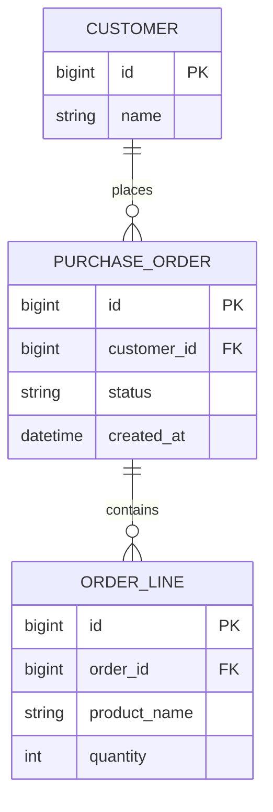
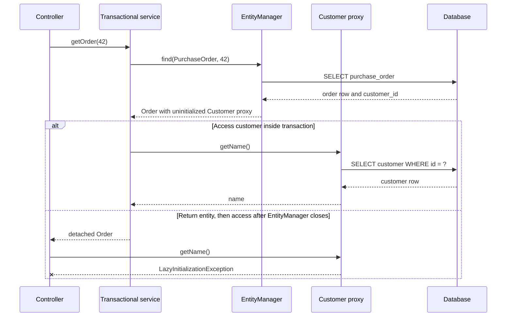
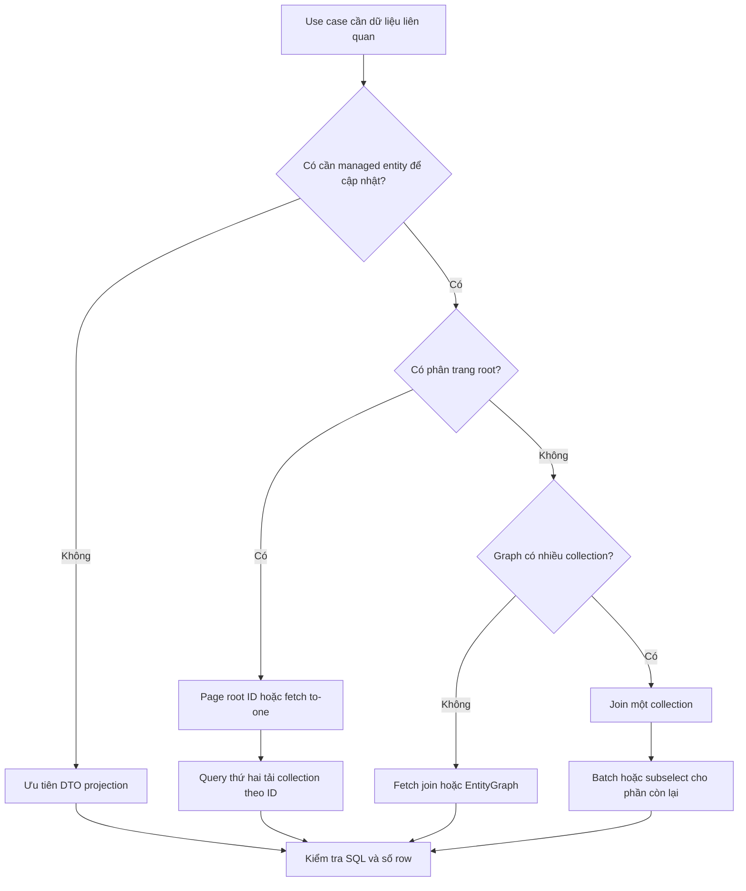

Fetching strategy là cách ứng dụng quyết định **dữ liệu liên quan nào cần được tải, tải vào lúc nào và bằng bao nhiêu câu SQL**. Chọn sai thường không làm kết quả nghiệp vụ sai ngay. Nó làm hệ thống chậm dần, phát sinh `LazyInitializationException`, hoặc tạo hàng nghìn truy vấn chỉ từ một API tưởng như đơn giản.

> [!NOTE]
> Bài viết dùng **Jakarta Persistence** (chuẩn API, thường vẫn được gọi là JPA), **Hibernate ORM** (persistence provider triển khai chuẩn đó) và **Spring Data JPA** (lớp repository xây trên JPA). Annotation `@EntityGraph` của Spring Data là tiện ích; `EntityGraph` và query hint bên dưới mới thuộc chuẩn Jakarta Persistence.

## Mục lục

- [1. Bức tranh tổng thể](#1-bức-tranh-tổng-thể)
- [2. Mô hình ví dụ](#2-mô-hình-ví-dụ)
  - [2.1. Quan hệ dữ liệu](#21-quan-hệ-dữ-liệu)
  - [2.2. Mapping domain](#22-mapping-domain)
- [3. LAZY và EAGER theo Jakarta Persistence](#3-lazy-và-eager-theo-jakarta-persistence)
  - [3.1. Giá trị mặc định](#31-giá-trị-mặc-định)
  - [3.2. EAGER không đồng nghĩa với JOIN](#32-eager-không-đồng-nghĩa-với-join)
  - [3.3. LAZY cho basic field cần được kiểm chứng](#33-lazy-cho-basic-field-cần-được-kiểm-chứng)
- [4. Hibernate proxy và persistent collection](#4-hibernate-proxy-và-persistent-collection)
  - [4.1. Proxy đại diện cho to-one association](#41-proxy-đại-diện-cho-to-one-association)
  - [4.2. Collection wrapper theo dõi trạng thái](#42-collection-wrapper-theo-dõi-trạng-thái)
  - [4.3. Kiểm tra và khởi tạo có chủ đích](#43-kiểm-tra-và-khởi-tạo-có-chủ-đích)
- [5. Lifecycle tải dữ liệu](#5-lifecycle-tải-dữ-liệu)
- [6. LazyInitializationException](#6-lazyinitializationexception)
  - [6.1. Nguyên nhân gốc](#61-nguyên-nhân-gốc)
  - [6.2. Cách sửa theo ranh giới use case](#62-cách-sửa-theo-ranh-giới-use-case)
  - [6.3. Những cách chữa làm vấn đề nặng hơn](#63-những-cách-chữa-làm-vấn-đề-nặng-hơn)
- [7. Bài toán N cộng 1 query](#7-bài-toán-n-cộng-1-query)
  - [7.1. N cộng 1 với LAZY](#71-n-cộng-1-với-lazy)
  - [7.2. N cộng 1 vẫn xảy ra với EAGER](#72-n-cộng-1-vẫn-xảy-ra-với-eager)
  - [7.3. Đọc số truy vấn đúng cách](#73-đọc-số-truy-vấn-đúng-cách)
- [8. Chọn fetch plan theo use case](#8-chọn-fetch-plan-theo-use-case)
  - [8.1. Fetch join](#81-fetch-join)
  - [8.2. EntityGraph](#82-entitygraph)
  - [8.3. Batch fetching](#83-batch-fetching)
  - [8.4. Subselect fetching](#84-subselect-fetching)
  - [8.5. DTO projection](#85-dto-projection)
  - [8.6. Bảng so sánh](#86-bảng-so-sánh)
- [9. Cạm bẫy với nhiều collection và phân trang](#9-cạm-bẫy-với-nhiều-collection-và-phân-trang)
  - [9.1. Cartesian product](#91-cartesian-product)
  - [9.2. MultipleBagFetchException](#92-multiplebagfetchexception)
  - [9.3. Pagination trap](#93-pagination-trap)
- [10. Spring Data JPA trong thực tế](#10-spring-data-jpa-trong-thực-tế)
  - [10.1. Repository biểu diễn fetch plan](#101-repository-biểu-diễn-fetch-plan)
  - [10.2. Service giữ transaction và mapping DTO](#102-service-giữ-transaction-và-mapping-dto)
  - [10.3. Không trả entity trực tiếp qua REST](#103-không-trả-entity-trực-tiếp-qua-rest)
- [11. Kiểm thử và quan sát SQL](#11-kiểm-thử-và-quan-sát-sql)
  - [11.1. Bật log có chọn lọc](#111-bật-log-có-chọn-lọc)
  - [11.2. Test số statement bằng Hibernate Statistics](#112-test-số-statement-bằng-hibernate-statistics)
- [12. Anti-pattern và cách sửa](#12-anti-pattern-và-cách-sửa)
- [13. Decision guide](#13-decision-guide)
- [14. Checklist và cheat sheet](#14-checklist-và-cheat-sheet)
- [15. Tài liệu liên quan](#15-tài-liệu-liên-quan)

---

## 1. Bức tranh tổng thể

Một **fetch plan** là kế hoạch tải dữ liệu cho một thao tác cụ thể. Ví dụ, màn hình danh sách đơn hàng chỉ cần mã đơn và tên khách hàng. Màn hình chi tiết lại cần thêm các dòng hàng. Hai use case đó không nên dùng chung một object graph tải sẵn mọi thứ.

Cần tách hai câu hỏi:

1. **Khi nào tải?** `LAZY` trì hoãn đến lúc truy cập; `EAGER` yêu cầu trạng thái phải sẵn sàng.
2. **Tải bằng cách nào?** Hibernate có thể dùng SQL join, secondary select, batch `IN`, subselect hoặc projection.

`FetchType` chủ yếu trả lời câu hỏi thứ nhất. Fetch join, entity graph và các chiến lược riêng của Hibernate mới quyết định query shape cho từng use case.

> [!IMPORTANT]
> Quy tắc thực dụng: map hầu hết association là `LAZY`, sau đó khai báo dữ liệu cần dùng ngay tại query boundary. Đừng map toàn bộ domain thành `EAGER` để tránh phải suy nghĩ về fetch plan.

## 2. Mô hình ví dụ

### 2.1. Quan hệ dữ liệu

Ta dùng ba entity: khách hàng, đơn hàng và dòng hàng. Một khách hàng có nhiều đơn; một đơn có nhiều dòng hàng.



### 2.2. Mapping domain

Ví dụ dùng field access và namespace `jakarta.persistence` của Spring Boot hiện đại:

```java
@Entity
@Table(name = "customer")
public class Customer {
    @Id
    @GeneratedValue(strategy = GenerationType.IDENTITY)
    private Long id;

    @Column(nullable = false)
    private String name;

    protected Customer() {
    }

    public Customer(String name) {
        this.name = name;
    }

    public Long getId() {
        return id;
    }

    public String getName() {
        return name;
    }
}
```

```java
@Entity
@Table(name = "purchase_order")
public class PurchaseOrder {
    @Id
    @GeneratedValue(strategy = GenerationType.IDENTITY)
    private Long id;

    @ManyToOne(fetch = FetchType.LAZY, optional = false)
    @JoinColumn(name = "customer_id", nullable = false)
    private Customer customer;

    @Enumerated(EnumType.STRING)
    @Column(nullable = false)
    private OrderStatus status;

    @Column(name = "created_at", nullable = false)
    private Instant createdAt;

    @OneToMany(mappedBy = "order", cascade = CascadeType.ALL, orphanRemoval = true)
    private List<OrderLine> lines = new ArrayList<>();

    protected PurchaseOrder() {
    }

    public Long getId() {
        return id;
    }

    public Customer getCustomer() {
        return customer;
    }

    public OrderStatus getStatus() {
        return status;
    }

    public Instant getCreatedAt() {
        return createdAt;
    }

    public List<OrderLine> getLines() {
        return lines;
    }
}
```

```java
@Entity
@Table(name = "order_line")
public class OrderLine {
    @Id
    @GeneratedValue(strategy = GenerationType.IDENTITY)
    private Long id;

    @ManyToOne(fetch = FetchType.LAZY, optional = false)
    @JoinColumn(name = "order_id", nullable = false)
    private PurchaseOrder order;

    @Column(name = "product_name", nullable = false)
    private String productName;

    @Column(nullable = false)
    private int quantity;

    protected OrderLine() {
    }

    public String getProductName() {
        return productName;
    }

    public int getQuantity() {
        return quantity;
    }
}
```

`customer` và `lines` đều được map `LAZY`. Mapping này không nói rằng chúng **không bao giờ** được tải sớm. Nó chỉ giữ cho query mặc định nhỏ, để mỗi use case chủ động chọn fetch plan.

Xem thêm cách thiết kế owning side, `mappedBy`, cascade và helper method tại [Mapping Relationships](./relationships-mapping.md).

## 3. LAZY và EAGER theo Jakarta Persistence

### 3.1. Giá trị mặc định

`FetchType.LAZY` biểu thị mong muốn trì hoãn việc tải cho tới khi thuộc tính được dùng, nhưng theo Jakarta Persistence nó chỉ là một **hint**. Provider được phép tải sớm hơn. `FetchType.EAGER` là một **requirement**: provider phải làm cho dữ liệu sẵn sàng trong trạng thái entity trả về.

| Mapping | Mặc định theo Jakarta Persistence |
|---|---|
| `@ManyToOne` | `EAGER` |
| `@OneToOne` | `EAGER` |
| `@OneToMany` | `LAZY` |
| `@ManyToMany` | `LAZY` |
| `@ElementCollection` | `LAZY` |
| `@Basic` | `EAGER` |

Hai mặc định `EAGER` cho to-one thường gây over-fetching. Vì vậy nên viết rõ:

```java
@ManyToOne(fetch = FetchType.LAZY)
private Customer customer;
```

Viết tường minh còn giúp reviewer nhìn mapping là hiểu ý đồ, thay vì phải nhớ mặc định của từng annotation.

### 3.2. EAGER không đồng nghĩa với JOIN

Đây là nhầm lẫn phổ biến nhất. `EAGER` nói **dữ liệu phải được tải**, không bắt provider dùng cùng một câu SQL có `JOIN`.

Với `EntityManager.find()`, Hibernate có thể tạo SQL join theo static fetch plan:

```sql
select
    po.id,
    po.created_at,
    po.status,
    c.id,
    c.name
from purchase_order po
join customer c on c.id = po.customer_id
where po.id = ?;
```

Nhưng một JPQL query không có fetch join có thể lấy đơn hàng trước, rồi dùng secondary select để thỏa mapping `EAGER`:

```sql
select po.id, po.created_at, po.customer_id, po.status
from purchase_order po;

select c.id, c.name
from customer c
where c.id = ?;
-- Có thể lặp lại cho các customer chưa có trong persistence context.
```

Do đó đổi `LAZY` thành `EAGER` không phải cách sửa N+1 đáng tin cậy. Fetch plan cần nằm ở query.

### 3.3. LAZY cho basic field cần được kiểm chứng

`@Basic(fetch = FetchType.LAZY)` thường được dùng cho `@Lob` hoặc cột văn bản lớn:

```java
@Lob
@Basic(fetch = FetchType.LAZY)
private String rawPayload;
```

Đây vẫn chỉ là hint của Jakarta Persistence. Với Hibernate, lazy basic attribute thường cần **bytecode enhancement** để chặn lúc field được đọc. Nếu enhancement không được bật, cột có thể vẫn xuất hiện trong SQL ban đầu.

Nói ngắn gọn: đừng kết luận basic field đã lazy chỉ vì có annotation. Hãy xem SQL và dùng `PersistenceUnitUtil.isLoaded(entity, "rawPayload")` trong test.

## 4. Hibernate proxy và persistent collection

### 4.1. Proxy đại diện cho to-one association

**Proxy** là object đại diện chứa ít nhất type và identifier của entity thật. Khi code gọi một thuộc tính cần dữ liệu, Hibernate dùng persistence context hiện tại để chạy SQL và khởi tạo proxy.

```java
PurchaseOrder order = entityManager.find(PurchaseOrder.class, 42L);

Customer customer = order.getCustomer(); // thường chưa cần SELECT customer
Long customerId = customer.getId();       // Hibernate proxy thường đọc được id
String name = customer.getName();         // có thể kích hoạt SELECT customer
```

Hibernate có thể tạo runtime subclass proxy, hoặc dùng field interception khi entity đã được bytecode-enhance. Jakarta Persistence chỉ quy định hành vi tải dữ liệu; cơ chế proxy cụ thể là chi tiết của provider.

`EntityManager.getReference()` chủ động xin một reference có thể chưa được khởi tạo:

```java
Customer reference = entityManager.getReference(Customer.class, customerId);
order.changeCustomer(reference);
```

Cách này hữu ích khi chỉ cần thiết lập khóa ngoại. Nếu truy cập state khác identifier, provider có thể phải query database và có thể báo entity không tồn tại.

> [!WARNING]
> Tránh `final` entity hoặc `final` getter nếu dự án dựa vào subclass proxy mà không có bytecode enhancement. Cũng không dùng Lombok `@Data` cho entity: `toString()`, `equals()` hoặc `hashCode()` sinh tự động có thể đi qua association và vô tình khởi tạo proxy.

### 4.2. Collection wrapper theo dõi trạng thái

Với to-many association, Hibernate không đặt một entity proxy vào field. Nó thay collection bằng wrapper như `PersistentBag`, `PersistentSet` hoặc `PersistentList`. Wrapper biết owner, trạng thái initialized và các thay đổi cần dirty checking.

```java
List<OrderLine> lines = order.getLines();
// Wrapper tồn tại nhưng nội dung có thể chưa được tải.

int size = lines.size();
// Thường kích hoạt SELECT order_line ... WHERE order_id = ?
```

Đừng thay collection managed bằng collection mới trong setter tùy tiện. Hãy dùng helper method để thêm hoặc xóa phần tử và giữ hai phía quan hệ nhất quán.

### 4.3. Kiểm tra và khởi tạo có chủ đích

Jakarta Persistence cung cấp API portable để hỏi trạng thái load:

```java
PersistenceUnitUtil util = entityManagerFactory.getPersistenceUnitUtil();

boolean customerLoaded = util.isLoaded(order, "customer");
boolean linesLoaded = util.isLoaded(order, "lines");
```

Hibernate có thêm API riêng:

```java
boolean initialized = Hibernate.isInitialized(order.getLines());
Hibernate.initialize(order.getLines());
```

`Hibernate.initialize()` chỉ hoạt động khi proxy hoặc collection vẫn gắn với một Session đang mở. Nó phù hợp cho đoạn code infrastructure hoặc trường hợp cần tải có chủ đích trong transaction. Trong business query, fetch join hoặc entity graph thường biểu đạt intent rõ hơn.

## 5. Lifecycle tải dữ liệu

Sơ đồ sau cho thấy sự khác nhau giữa truy cập lazy association trong và ngoài persistence context. **Persistence context** là vùng mà `EntityManager` theo dõi entity managed và liên kết proxy với Session Hibernate bên dưới.



Sau khi transaction kết thúc, entity thường trở thành **detached**: object vẫn còn trong bộ nhớ nhưng không còn được persistence context quản lý. Dữ liệu đã tải vẫn đọc được. Dữ liệu lazy chưa tải thì không còn Session để truy vấn.

Đọc thêm về managed, detached, dirty checking và flush tại [Persistence Context & Entity Lifecycle](./persistence-context-and-entity-lifecycle.md).

## 6. LazyInitializationException

### 6.1. Nguyên nhân gốc

`LazyInitializationException` là exception riêng của Hibernate. Nó xuất hiện khi code cần khởi tạo proxy hoặc persistent collection nhưng Session đã đóng, bị clear, hoặc object đã detached.

Anti-pattern điển hình:

```java
@Service
public class OrderService {
    private final PurchaseOrderRepository repository;

    public OrderService(PurchaseOrderRepository repository) {
        this.repository = repository;
    }

    @Transactional(readOnly = true)
    public PurchaseOrder find(Long id) {
        return repository.findById(id).orElseThrow();
    }
}
```

```java
@RestController
class OrderController {
    @GetMapping("/orders/{id}")
    OrderResponse get(@PathVariable Long id) {
        PurchaseOrder order = orderService.find(id); // transaction đã kết thúc
        return OrderResponse.from(order);            // getLines() có thể nổ
    }
}
```

Lỗi không nằm ở `LAZY`. Lỗi nằm ở fetch boundary: service trả object graph chưa đủ dữ liệu cho code phía ngoài transaction.

### 6.2. Cách sửa theo ranh giới use case

Fetch đúng graph và map DTO khi persistence context còn mở:

```java
public interface PurchaseOrderRepository
        extends JpaRepository<PurchaseOrder, Long> {

    @Query("""
        select o
        from PurchaseOrder o
        join fetch o.customer
        left join fetch o.lines
        where o.id = :id
        """)
    Optional<PurchaseOrder> findDetailsById(Long id);
}
```

```java
public record OrderLineResponse(String productName, int quantity) {
}

public record OrderResponse(
        Long id,
        String customerName,
        String status,
        List<OrderLineResponse> lines
) {
    static OrderResponse from(PurchaseOrder order) {
        List<OrderLineResponse> lines = order.getLines().stream()
                .map(line -> new OrderLineResponse(
                        line.getProductName(), line.getQuantity()))
                .toList();

        return new OrderResponse(
                order.getId(),
                order.getCustomer().getName(),
                order.getStatus().name(),
                lines
        );
    }
}
```

```java
@Transactional(readOnly = true)
public OrderResponse getDetails(Long id) {
    PurchaseOrder order = repository.findDetailsById(id)
            .orElseThrow(() -> new OrderNotFoundException(id));
    return OrderResponse.from(order);
}
```

Transaction bao quanh cả query lẫn mapping. DTO ra khỏi service không chứa proxy nên controller và JSON serializer không thể chạy thêm SQL ngoài ý muốn.

### 6.3. Những cách chữa làm vấn đề nặng hơn

| Cách chữa tạm | Vì sao nguy hiểm | Cách thay thế |
|---|---|---|
| Đổi mọi association thành `EAGER` | Over-fetching và N+1 vẫn có thể xảy ra | Giữ `LAZY`, tạo fetch plan theo use case |
| Bật Open Session in View rồi truy cập entity ở controller | SQL bị giấu trong web layer, khó kiểm soát transaction và số query | Map DTO trong transactional service |
| Bật `hibernate.enable_lazy_load_no_trans` | Hibernate có thể mở Session tạm cho từng lần lazy load, làm N+1 khó thấy hơn | Tải đủ dữ liệu trong transaction hiện tại |
| Gọi getter hàng loạt để “warm up” | Intent mơ hồ và dễ bỏ sót association | Fetch join, entity graph hoặc projection |
| Bắt `LazyInitializationException` | Exception là tín hiệu thiết kế fetch boundary sai, không phải lỗi có thể recover | Sửa query và ranh giới transaction |

Open Session in View có use case riêng, nhưng không nên là cơ chế fetch plan mặc định. Nếu bật, hãy xem SQL của toàn request và không để JSON serialization tự quyết định association nào bị tải.

## 7. Bài toán N cộng 1 query

**N+1 query** là tình huống một query lấy N root row, sau đó phát sinh thêm tối đa N query để tải association. Chi phí lớn nhất thường là network round trip và latency, không phải độ dài từng câu SQL.

### 7.1. N cộng 1 với LAZY

```java
List<PurchaseOrder> orders = repository.findAll(); // 1 query

for (PurchaseOrder order : orders) {
    log.info("Customer: {}", order.getCustomer().getName()); // thêm nhiều query
}
```

SQL minh họa:

```sql
select po.id, po.created_at, po.customer_id, po.status
from purchase_order po;

select c.id, c.name from customer c where c.id = 101;
select c.id, c.name from customer c where c.id = 102;
select c.id, c.name from customer c where c.id = 103;
-- ...
```

Con số thực tế có thể ít hơn N vì persistence context là identity map: cùng một `customer_id` đã được tải thì được tái sử dụng. Vấn đề vẫn là số round trip tăng theo dữ liệu.

### 7.2. N cộng 1 vẫn xảy ra với EAGER

Giả sử bỏ `fetch = LAZY` khỏi `@ManyToOne`. Mặc định `@ManyToOne` trở thành `EAGER`. Query sau không hề yêu cầu fetch join:

```java
@Query("select o from PurchaseOrder o")
List<PurchaseOrder> findAllOrders();
```

Hibernate phải bảo đảm `customer` đã được tải, nhưng có thể thực hiện bằng secondary select. Kết quả vẫn có thể là một query cho đơn và nhiều query cho khách hàng.

> [!IMPORTANT]
> `EAGER` quyết định trạng thái phải sẵn sàng; `JOIN FETCH` quyết định association tham gia query hiện tại. Hai khái niệm không thay thế cho nhau.

### 7.3. Đọc số truy vấn đúng cách

Khi chẩn đoán, ghi lại bốn con số:

- Số root entity trả về.
- Số SQL statement.
- Số row database trả về cho từng statement.
- Thời gian và số round trip thực tế.

Một query join duy nhất chưa chắc tốt nếu nó trả hàng trăm nghìn row lặp. Ngược lại, hai query có kiểm soát thường tốt hơn một cartesian product khổng lồ.

## 8. Chọn fetch plan theo use case

### 8.1. Fetch join

Fetch join là cú pháp JPQL hoặc HQL yêu cầu association được tải cùng query với root entity:

```java
@Query("""
    select o
    from PurchaseOrder o
    join fetch o.customer
    left join fetch o.lines
    where o.status = :status
    order by o.createdAt desc
    """)
List<PurchaseOrder> findWithDetailsByStatus(OrderStatus status);
```

SQL điển hình:

```sql
select
    po.id, po.created_at, po.status,
    c.id, c.name,
    l.id, l.product_name, l.quantity
from purchase_order po
join customer c on c.id = po.customer_id
left join order_line l on l.order_id = po.id
where po.status = ?
order by po.created_at desc;
```

Mỗi dòng hàng tạo một SQL row, nên cột của order và customer bị lặp. Hibernate ghép các row về cùng entity trong persistence context. Hibernate 6 trở lên loại root reference trùng khi materialize kết quả fetch join; không nên thêm `distinct` một cách máy móc chỉ để che cartesian product.

Fetch join phù hợp khi:

- Cần managed entity để thay đổi state trong cùng transaction.
- Graph nhỏ và biết trước.
- Fetch một chuỗi to-one, hoặc một collection có kích thước hợp lý.

Không dùng alias của fetched association trong điều kiện để “lọc collection”. Entity trong persistence context có thể trông như collection đầy đủ nhưng thực tế chỉ chứa phần tử khớp điều kiện. Hãy dùng query khác hoặc DTO cho filtered view.

### 8.2. EntityGraph

**Entity graph** là template chuẩn Jakarta Persistence mô tả attribute cần tải cho một query hoặc `find`. Nó tách fetch plan khỏi chuỗi JPQL.

Spring Data JPA cung cấp annotation tiện lợi:

```java
public interface PurchaseOrderRepository
        extends JpaRepository<PurchaseOrder, Long> {

    @EntityGraph(
        type = EntityGraph.EntityGraphType.FETCH,
        attributePaths = {"customer", "lines"}
    )
    Optional<PurchaseOrder> findDetailedById(Long id);
}
```

Tương đương ở API Jakarta Persistence:

```java
EntityGraph<PurchaseOrder> graph =
        entityManager.createEntityGraph(PurchaseOrder.class);
graph.addAttributeNodes("customer", "lines");

Map<String, Object> hints = Map.of(
        "jakarta.persistence.fetchgraph", graph
);

PurchaseOrder order = entityManager.find(
        PurchaseOrder.class,
        id,
        hints
);
```

Hai loại graph có semantics khác nhau:

| Loại | Attribute có trong graph | Attribute không có trong graph |
|---|---|---|
| `FETCH` hay `jakarta.persistence.fetchgraph` | Được xem là `EAGER` | Được xem là `LAZY` cho thao tác đó |
| `LOAD` hay `jakarta.persistence.loadgraph` | Được xem là `EAGER` | Giữ fetch semantics của mapping |

Provider vẫn được phép tải thêm state. Entity graph quy định **state cần có**, không bảo đảm chính xác Hibernate sẽ dùng một SQL join. Luôn kiểm tra SQL nếu query shape quan trọng.

### 8.3. Batch fetching

Batch fetching là tối ưu riêng của Hibernate. Khi một lazy proxy hoặc collection được truy cập, Hibernate tải một nhóm association chưa khởi tạo bằng điều kiện `IN` thay vì từng query riêng.

Cấu hình toàn cục trong Spring Boot:

```properties
spring.jpa.properties.hibernate.default_batch_fetch_size=32
```

Hoặc cấu hình có chọn lọc:

```java
@OneToMany(mappedBy = "order")
@BatchSize(size = 32)
private List<OrderLine> lines = new ArrayList<>();
```

SQL minh họa:

```sql
select l.order_id, l.id, l.product_name, l.quantity
from order_line l
where l.order_id in (?, ?, ?, ?, ?, ?, ?, ?);
```

Với N owner và batch size B, số secondary select xấp xỉ `ceil(N / B)`, tùy số association thực sự chưa được tải. Batch fetching **giảm** N+1 chứ không biến intent thành một query rõ ràng. Nó hữu ích khi đường truy cập động, hoặc join fetch sẽ làm result set phình lớn.

> [!NOTE]
> `hibernate.default_batch_fetch_size` cho SELECT fetching không liên quan đến `hibernate.jdbc.batch_size`, vốn batch các lệnh DML như `INSERT`, `UPDATE` và `DELETE`.

### 8.4. Subselect fetching

Subselect fetching cũng là tính năng riêng của Hibernate. Sau khi query một nhóm parent, lần đầu truy cập một collection có thể tải collection cho toàn bộ nhóm bằng một secondary query chứa lại parent query dưới dạng subselect.

```java
@OneToMany(mappedBy = "order")
@Fetch(FetchMode.SUBSELECT)
private List<OrderLine> lines = new ArrayList<>();
```

```sql
select l.order_id, l.id, l.product_name, l.quantity
from order_line l
where l.order_id in (
    select po.id
    from purchase_order po
    where po.status = ?
);
```

Subselect phù hợp khi vừa tải một tập parent đồng nhất và biết phần lớn collection của tập đó sẽ được dùng. Nó có thể tải dư nếu persistence context đang giữ nhiều parent hơn dự kiến. Batch fetching thường dễ giới hạn chi phí hơn.

### 8.5. DTO projection

**DTO projection** chọn thẳng các cột cần cho read model và không materialize managed entity. Đây thường là lựa chọn tốt nhất cho list API, báo cáo và màn hình chỉ đọc.

```java
package com.example.orders;

public record OrderSummary(
        Long id,
        String customerName,
        long totalLines
) {
}
```

```java
public interface PurchaseOrderRepository
        extends JpaRepository<PurchaseOrder, Long> {

    @Query("""
        select new com.example.orders.OrderSummary(
            o.id,
            c.name,
            count(l.id)
        )
        from PurchaseOrder o
        join o.customer c
        left join o.lines l
        where o.status = :status
        group by o.id, c.name
        order by o.id desc
        """)
    List<OrderSummary> findSummariesByStatus(OrderStatus status);
}
```

SQL chỉ chọn cột cần thiết:

```sql
select po.id, c.name, count(l.id)
from purchase_order po
join customer c on c.id = po.customer_id
left join order_line l on l.order_id = po.id
where po.status = ?
group by po.id, c.name
order by po.id desc;
```

JPQL constructor expression là cơ chế của JPA. Spring Data JPA còn hỗ trợ class-based và interface-based projection, nhưng nested projection có thể tạo join và materialize nhiều dữ liệu hơn dự kiến. Với query quan trọng, explicit DTO query dễ quan sát nhất.

### 8.6. Bảng so sánh

| Kỹ thuật | Chuẩn hay riêng provider | Điểm mạnh | Cạm bẫy chính |
|---|---|---|---|
| JPQL `join fetch` | JPA | Query shape rõ, tốt cho graph nhỏ | Row lặp, không an toàn với nhiều collection hoặc pagination |
| Entity graph | JPA; Spring Data có annotation hỗ trợ | Tái sử dụng query, fetch plan tách khỏi JPQL | Không bảo đảm đúng một SQL join |
| Batch fetching | Hibernate | Giảm round trip cho lazy access động | Vẫn là secondary selects, có thể tải dư |
| Subselect fetching | Hibernate | Một query cho collection của cả nhóm parent | Phụ thuộc tập parent trong persistence context |
| DTO projection | JPA; Spring Data có hỗ trợ thêm | Ít cột, không proxy, hợp read API | Không có dirty checking, cần mapping read model |

## 9. Cạm bẫy với nhiều collection và phân trang

### 9.1. Cartesian product

Giả sử một order có 10 `lines` và 6 `adjustments`. Fetch join cả hai collection tạo tới `10 × 6 = 60` SQL row cho **một** order. Đây là cartesian product ở cấp collection.

```java
select o
from PurchaseOrder o
left join fetch o.lines
left join fetch o.adjustments
where o.id = :id
```

Persistence context có thể khử trùng entity Java, nhưng database, network và JDBC vẫn phải xử lý toàn bộ row. `distinct` không xóa chi phí này vì các row khác nhau ở cột line hoặc adjustment.

Cách sửa:

- Join fetch một collection, tải collection còn lại bằng batch hoặc subselect.
- Chạy hai query trong cùng persistence context; identity map sẽ ghép association vào cùng root entity.
- Dùng DTO query riêng nếu màn hình chỉ cần aggregate hoặc vài cột.

### 9.2. MultipleBagFetchException

Trong Hibernate, **bag** là collection cho phép phần tử trùng và không có cột index bền vững. Một `List` không có `@OrderColumn` thường được xử lý như bag. Hibernate có thể ném `MultipleBagFetchException` khi một query đồng thời fetch nhiều bag vì không thể tái tạo hai bag một cách an toàn từ result set cartesian.

```java
@OneToMany(mappedBy = "order")
private List<OrderLine> lines;

@OneToMany(mappedBy = "order")
private List<OrderAdjustment> adjustments;
```

Không đổi cả hai sang `Set` chỉ để làm exception biến mất. Cách đó thay đổi semantics equality và vẫn giữ cartesian product. Chỉ dùng `Set` khi domain thật sự là tập hợp, hoặc `@OrderColumn` khi thứ tự là dữ liệu nghiệp vụ. Cách sửa fetch plan vẫn là split query, batch hoặc subselect.

### 9.3. Pagination trap

Pagination hoạt động trên root row. Collection fetch join lại tạo nhiều SQL row cho mỗi root. Vì vậy provider không thể áp dụng `limit` trực tiếp mà vẫn chắc chắn trả đủ collection cho từng order.

Hibernate có thể đọc toàn bộ result set rồi phân trang trong memory. Đây là lỗi hiệu năng nghiêm trọng. Hãy bật chế độ fail-fast:

```properties
spring.jpa.properties.hibernate.query.fail_on_pagination_over_collection_fetch=true
```

Giải pháp portable và dễ kiểm soát là hai bước.

**Bước 1 — phân trang chỉ lấy root ID:**

```java
@Query(
    value = """
        select o.id
        from PurchaseOrder o
        where o.status = :status
        order by o.createdAt desc, o.id desc
        """,
    countQuery = """
        select count(o)
        from PurchaseOrder o
        where o.status = :status
        """
)
Page<Long> findPageIds(OrderStatus status, Pageable pageable);
```

**Bước 2 — fetch graph theo danh sách ID:**

```java
@Query("""
    select o
    from PurchaseOrder o
    join fetch o.customer
    left join fetch o.lines
    where o.id in :ids
    """)
List<PurchaseOrder> findPageDetails(Collection<Long> ids);
```

Query thứ hai không bảo toàn thứ tự của `IN`. Service cần sắp kết quả theo vị trí ID từ page đầu tiên trước khi map DTO. Với dataset lớn và infinite scroll, keyset pagination giúp bước lấy ID ổn định hơn offset pagination.

Fetch join to-one không nhân số root row nên thường dùng được cùng pagination. Cạm bẫy chủ yếu nằm ở to-many collection fetch join.

## 10. Spring Data JPA trong thực tế

### 10.1. Repository biểu diễn fetch plan

Đừng tạo một method `findById()` rồi dùng cho mọi màn hình. Tên repository method nên thể hiện shape dữ liệu:

```java
public interface PurchaseOrderRepository
        extends JpaRepository<PurchaseOrder, Long> {

    // Spring Data JPA + JPA EntityGraph
    @EntityGraph(attributePaths = "customer")
    Page<PurchaseOrder> findByStatus(OrderStatus status, Pageable pageable);

    // JPQL fetch join cho màn hình detail
    @Query("""
        select o
        from PurchaseOrder o
        join fetch o.customer
        left join fetch o.lines
        where o.id = :id
        """)
    Optional<PurchaseOrder> findDetailsById(Long id);

    // DTO projection cho dashboard
    @Query("""
        select new com.example.orders.OrderSummary(
            o.id, c.name, count(l.id)
        )
        from PurchaseOrder o
        join o.customer c
        left join o.lines l
        group by o.id, c.name
        """)
    List<OrderSummary> findDashboardRows();
}
```

`@EntityGraph` ở ví dụ trên là `org.springframework.data.jpa.repository.EntityGraph`. Nó chuyển metadata thành JPA entity graph khi thực thi repository query. Hibernate vẫn là provider tạo SQL cuối cùng.

### 10.2. Service giữ transaction và mapping DTO

Transaction boundary nên bao trọn query, business rule và DTO mapping cần association:

```java
@Service
public class OrderQueryService {
    private final PurchaseOrderRepository repository;

    public OrderQueryService(PurchaseOrderRepository repository) {
        this.repository = repository;
    }

    @Transactional(readOnly = true)
    public OrderResponse getDetails(Long id) {
        PurchaseOrder order = repository.findDetailsById(id)
                .orElseThrow(() -> new OrderNotFoundException(id));

        return OrderResponse.from(order);
    }
}
```

`@Transactional` là tính năng của Spring, không phải annotation JPA. Spring mở hoặc tham gia transaction và gắn `EntityManager` với thread cho lời gọi đó. Xem cơ chế đầy đủ tại [Transactions with JPA](./transactions-with-jpa.md) và [Spring Data JPA](./spring-data-jpa.md).

### 10.3. Không trả entity trực tiếp qua REST

JSON serializer gọi getter theo cấu trúc object. Với entity, điều này có thể:

- Khởi tạo lazy association và tạo N+1 trong lúc serialize.
- Ném `LazyInitializationException` nếu persistence context đã đóng.
- Đi vòng vô hạn qua quan hệ hai chiều như order → lines → order.
- Lộ cột nội bộ mà API không nên công khai.

Annotation Jackson như `@JsonIgnore` chỉ xử lý serialization shape. Nó không thay fetch plan và làm persistence model phụ thuộc API. DTO ở application boundary an toàn và dễ version hơn.

## 11. Kiểm thử và quan sát SQL

### 11.1. Bật log có chọn lọc

Trong môi trường local hoặc test:

```properties
# SQL statement
logging.level.org.hibernate.SQL=DEBUG

# Bind parameter trên Hibernate 6 và 7
logging.level.org.hibernate.orm.jdbc.bind=TRACE

# Không dùng trong production nếu dữ liệu nhạy cảm có thể xuất hiện trong bind value.
```

`spring.jpa.show-sql=true` tiện để thử nhanh nhưng không đi qua logging framework đầy đủ. Logger category dễ lọc, định dạng và tắt hơn.

Khi review một endpoint, đừng chỉ nhìn SQL của repository test. Hãy xem toàn request để bắt query do mapper, serializer, log statement, `toString()` hoặc template engine kích hoạt.

### 11.2. Test số statement bằng Hibernate Statistics

Bật statistics trong profile test:

```properties
spring.jpa.properties.hibernate.generate_statistics=true
```

Ví dụ integration test xác minh fetch plan detail dùng đúng một prepared statement:

```java
@SpringBootTest
@Transactional
class OrderFetchingTest {
    @Autowired
    private EntityManagerFactory entityManagerFactory;

    @Autowired
    private PurchaseOrderRepository repository;

    @Test
    void detail_query_fetches_customer_and_lines_in_one_statement() {
        SessionFactory sessionFactory = entityManagerFactory
                .unwrap(SessionFactory.class);
        Statistics statistics = sessionFactory.getStatistics();
        statistics.clear();

        PurchaseOrder order = repository.findDetailsById(42L).orElseThrow();

        assertThat(Hibernate.isInitialized(order.getCustomer())).isTrue();
        assertThat(Hibernate.isInitialized(order.getLines())).isTrue();
        assertThat(statistics.getPrepareStatementCount()).isEqualTo(1L);
    }
}
```

Fixture cần được tạo trước khi `statistics.clear()`. Nếu test tự setup dữ liệu sau đó, các `INSERT` và query lấy sequence cũng được đếm. Khi dùng second-level cache, hãy cô lập hoặc xóa cache để kết quả không phụ thuộc thứ tự chạy test.

Test số query là regression test hữu ích, nhưng đừng đóng đinh mọi query thành “phải đúng một”. Với graph lớn, hai query ổn định có thể tốt hơn một join tạo rất nhiều row.

## 12. Anti-pattern và cách sửa

| Anti-pattern | Triệu chứng | Cách sửa |
|---|---|---|
| Mọi association đều `EAGER` | Query nhỏ kéo theo graph lớn, memory tăng | `LAZY` ở mapping, fetch plan tại query |
| Gọi `findAll()` rồi duyệt association | N+1 tăng theo số root | Fetch join, entity graph, DTO hoặc batch |
| Fetch join nhiều collection | Row cartesian, heap tăng, có thể `MultipleBagFetchException` | Join một collection, split query cho phần còn lại |
| Collection fetch join cùng `Pageable` | In-memory pagination hoặc exception khi fail-fast | Page ID trước, fetch detail sau |
| Trả entity từ controller | Lazy query lúc serialize, vòng lặp JSON | Map DTO trong transaction |
| `equals()`, `hashCode()`, `toString()` đi qua association | Query bất ngờ, recursion, collection load | Chỉ dùng identity hoặc business key ổn định; loại association khỏi các method này |
| Dùng `Set` chỉ để né multiple bag | Semantics sai, cartesian vẫn còn | Chọn collection theo domain và sửa fetch plan |
| Batch size cực lớn | SQL `IN` dài, bind nhiều, tải dư | Bắt đầu khoảng 16–64 rồi đo trên DB thật |
| Đếm query nhưng bỏ qua số row | Một query vẫn chậm và tốn memory | Đo statement, row, latency và execution plan |
| Tin rằng annotation bảo đảm SQL shape | Hành vi thay đổi theo provider hoặc query | Xem SQL và viết integration test |

## 13. Decision guide



Nếu chưa chắc, bắt đầu từ DTO cho read-only API; dùng fetch join hoặc entity graph cho command cần managed entity; dùng batch hoặc subselect khi graph động hoặc nhiều collection. Sau đó đo SQL thật thay vì suy đoán từ annotation.

## 14. Checklist và cheat sheet

**Khi thiết kế mapping:**

- [ ] Đặt `fetch = LAZY` rõ ràng cho `@ManyToOne` và `@OneToOne`, trừ khi có lý do đã đo được.
- [ ] Chọn `List`, `Set` và `@OrderColumn` theo semantics domain, không theo mẹo né exception.
- [ ] Không đưa association vào `toString()`, hoặc vào `equals()` và `hashCode()` thiếu kiểm soát.
- [ ] Kiểm chứng lazy basic field nếu dùng `@Basic(fetch = LAZY)`.

**Khi viết query:**

- [ ] Liệt kê đúng dữ liệu use case sẽ đọc.
- [ ] Dùng fetch join hoặc entity graph cho graph nhỏ cần managed entity.
- [ ] Dùng DTO projection cho list, dashboard và read-only API.
- [ ] Không fetch join nhiều collection song song nếu cardinality có thể lớn.
- [ ] Không collection fetch join trực tiếp với pagination.
- [ ] Cân nhắc batch hoặc subselect cho collection thứ hai.

**Khi giữ transaction boundary:**

- [ ] Truy cập association và map DTO khi persistence context còn mở.
- [ ] Không dựa vào Open Session in View để che fetch plan thiếu.
- [ ] Không trả entity hoặc Hibernate proxy ra API boundary.

**Khi kiểm thử:**

- [ ] Xem SQL và bind parameter của toàn use case.
- [ ] Đo cả statement count, row count, latency và memory.
- [ ] Có integration test chặn N+1 cho query quan trọng.
- [ ] Bật `hibernate.query.fail_on_pagination_over_collection_fetch=true`.

**Cheat sheet một dòng:**

```text
Mapping LAZY → query khai báo fetch plan → map DTO trong transaction → đo SQL và số row
```

## 15. Tài liệu liên quan

- [JPA và Hibernate Overview](./jpa-hibernate-overview.md) — phân biệt specification, provider, persistence context và Spring Data JPA.
- [Mapping Relationships](./relationships-mapping.md) — owning side, `mappedBy`, cascade, orphan removal và collection semantics.
- [Persistence Context & Entity Lifecycle](./persistence-context-and-entity-lifecycle.md) — managed, detached, identity map và dirty checking.
- [JPQL, Criteria và Native Query](./jpql-criteria-and-native-query.md) — cách biểu diễn query và projection.
- [Hibernate Performance Troubleshooting](./hibernate-performance-troubleshooting.md) — quy trình đo, đọc log và xử lý bottleneck.
- [Transactions with JPA](./transactions-with-jpa.md) — transaction boundary và mối quan hệ với persistence context.

Nguồn chuẩn để tra cứu thêm: [Jakarta Persistence specification](https://jakarta.ee/specifications/persistence/), [Hibernate ORM documentation](https://docs.hibernate.org/orm/) và [Spring Data JPA reference](https://docs.spring.io/spring-data/jpa/reference/).
