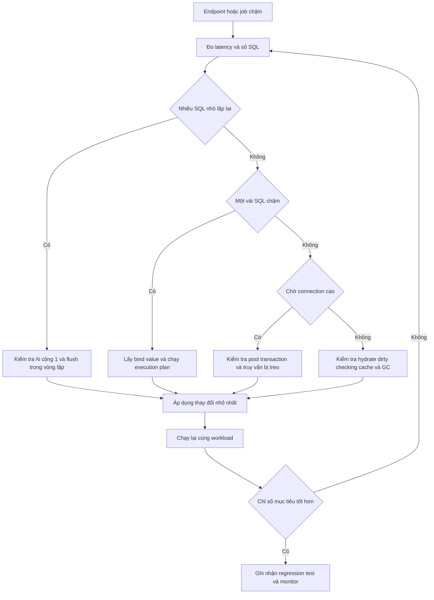

Tối ưu Hibernate không bắt đầu bằng việc thêm cache hay đổi mọi quan hệ thành `LAZY`. Điểm bắt đầu đúng là xác định request nào chậm, Hibernate đã sinh bao nhiêu câu SQL, các bind parameter là gì, database thực thi chúng ra sao và connection bị giữ trong bao lâu.

Tài liệu này trình bày một quy trình chẩn đoán có thể lặp lại cho ứng dụng Spring Boot dùng Jakarta Persistence, Hibernate ORM và Spring Data JPA. Các ví dụ dùng Hibernate 6, import `jakarta.persistence.*` và cú pháp cấu hình của Spring Boot hiện đại.

> [!IMPORTANT]
> Mọi con số như batch size, kích thước pool hay ngưỡng slow query chỉ là điểm khởi đầu. Hãy đo trên dữ liệu và workload gần production, sau đó so sánh trước và sau cùng một kịch bản.

## Mục lục

- [Phân biệt JPA Hibernate và Spring Data JPA](#1-phân-biệt-jpa-hibernate-và-spring-data-jpa)
  - [Jakarta Persistence](#jakarta-persistence)
  - [Hibernate ORM](#hibernate-orm)
  - [Spring Data JPA](#spring-data-jpa)
- [Quy trình chẩn đoán dựa trên bằng chứng](#2-quy-trình-chẩn-đoán-dựa-trên-bằng-chứng)
  - [Xác lập đường chuẩn](#xác-lập-đường-chuẩn)
  - [Luồng chẩn đoán](#luồng-chẩn-đoán)
- [Bật khả năng quan sát](#3-bật-khả-năng-quan-sát)
  - [Ghi SQL và bind parameter](#ghi-sql-và-bind-parameter)
  - [Đọc Hibernate statistics](#đọc-hibernate-statistics)
  - [Quan sát từ ứng dụng đến cơ sở dữ liệu](#quan-sát-từ-ứng-dụng-đến-cơ-sở-dữ-liệu)
- [Mô hình ví dụ](#4-mô-hình-ví-dụ)
  - [Entity và quan hệ](#entity-và-quan-hệ)
  - [Repository và service](#repository-và-service)
- [Phát hiện và sửa N cộng 1](#5-phát-hiện-và-sửa-n-cộng-1)
  - [SQL biểu hiện vấn đề](#sql-biểu-hiện-vấn-đề)
  - [Fetch join và EntityGraph](#fetch-join-và-entitygraph)
  - [DTO projection và batch fetching](#dto-projection-và-batch-fetching)
- [Kiểm soát persistence context và flush](#6-kiểm-soát-persistence-context-và-flush)
  - [First level cache và dirty checking](#first-level-cache-và-dirty-checking)
  - [Flush bất ngờ trong vòng lặp](#flush-bất-ngờ-trong-vòng-lặp)
  - [Đọc dữ liệu chỉ đọc](#đọc-dữ-liệu-chỉ-đọc)
- [Tăng tốc ghi dữ liệu bằng JDBC batching](#7-tăng-tốc-ghi-dữ-liệu-bằng-jdbc-batching)
  - [Điều kiện để batching hoạt động](#điều-kiện-để-batching-hoạt-động)
  - [Flush và clear theo chunk](#flush-và-clear-theo-chunk)
  - [Bulk update và delete](#bulk-update-và-delete)
- [Dùng cache đúng chỗ](#8-dùng-cache-đúng-chỗ)
  - [Ba loại cache dễ nhầm](#ba-loại-cache-dễ-nhầm)
  - [Cấu hình second level cache](#cấu-hình-second-level-cache)
  - [Khi không nên dùng cache](#khi-không-nên-dùng-cache)
- [Đọc execution plan và thiết kế index](#9-đọc-execution-plan-và-thiết-kế-index)
  - [Lấy câu SQL đại diện](#lấy-câu-sql-đại-diện)
  - [Đọc plan theo thứ tự](#đọc-plan-theo-thứ-tự)
  - [Ví dụ index ghép](#ví-dụ-index-ghép)
- [Tránh bẫy phân trang](#10-tránh-bẫy-phân-trang)
  - [Fetch collection cùng pagination](#fetch-collection-cùng-pagination)
  - [Offset pagination và keyset pagination](#offset-pagination-và-keyset-pagination)
- [Chẩn đoán connection pool và transaction](#11-chẩn-đoán-connection-pool-và-transaction)
  - [Nhận biết pool bị nghẽn](#nhận-biết-pool-bị-nghẽn)
  - [Thu hẹp transaction và tắt OSIV](#thu-hẹp-transaction-và-tắt-osiv)
- [Đo trước và sau thay đổi](#12-đo-trước-và-sau-thay-đổi)
  - [Test số lượng câu SQL](#test-số-lượng-câu-sql)
  - [Benchmark có ý nghĩa](#benchmark-có-ý-nghĩa)
- [Anti pattern và cách sửa](#13-anti-pattern-và-cách-sửa)
- [Checklist xử lý sự cố](#14-checklist-xử-lý-sự-cố)
  - [Checklist điều tra](#checklist-điều-tra)
  - [Cheat sheet theo triệu chứng](#cheat-sheet-theo-triệu-chứng)
  - [Cấu hình tham khảo](#cấu-hình-tham-khảo)
- [Tài liệu liên quan](#15-tài-liệu-liên-quan)

---

## 1. Phân biệt JPA Hibernate và Spring Data JPA

Ba tên này thường xuất hiện cùng nhau nhưng chịu trách nhiệm ở ba lớp khác nhau. Phân biệt đúng lớp giúp đặt cấu hình và tìm nguyên nhân đúng chỗ.

### Jakarta Persistence

**Jakarta Persistence**, thường vẫn được gọi là JPA, là đặc tả chuẩn cho ORM trong Java. ORM, viết tắt của Object Relational Mapping, là cơ chế ánh xạ object Java sang bảng quan hệ. Đặc tả định nghĩa các API như `EntityManager`, annotation `@Entity`, JPQL, persistence context và lifecycle của entity.

JPA không tự thực thi SQL. Nó cũng không quy định logger category, thuật toán batching hay implementation cache cụ thể.

### Hibernate ORM

**Hibernate ORM** là một persistence provider triển khai Jakarta Persistence. Hibernate tạo SQL, theo dõi dirty state, quản lý proxy, flush persistence context, tích hợp JDBC batching và cung cấp second-level cache tùy chọn.

Các cấu hình có tiền tố `hibernate.*`, `SessionFactory`, `Statistics`, `@BatchSize` và `@Cache` là API hoặc tính năng riêng của Hibernate. Nếu đổi provider, những phần này có thể phải thay đổi.

### Spring Data JPA

**Spring Data JPA** xây abstraction repository phía trên JPA. `JpaRepository`, derived query, `@Query`, `Specification` và `@EntityGraph` trên repository giúp giảm code lặp. Cuối cùng, repository vẫn gọi `EntityManager`, và Hibernate vẫn là bên sinh SQL nếu ứng dụng chọn Hibernate làm provider.

```text
Application service
       │
       ▼
Spring Data JPA repository     ← abstraction tiện dụng
       │
       ▼
Jakarta Persistence API       ← hợp đồng chuẩn
       │
       ▼
Hibernate ORM                 ← provider sinh SQL và quản lý entity
       │
       ▼
JDBC driver → connection pool → database
```

> [!NOTE]
> `repository.findAll()` chậm không có nghĩa Spring Data JPA là nguyên nhân. Hãy lần theo SQL do Hibernate sinh ra, thời gian chờ connection và execution plan của database.

## 2. Quy trình chẩn đoán dựa trên bằng chứng

Tối ưu theo trực giác dễ chuyển chi phí từ chỗ này sang chỗ khác. Ví dụ, fetch join có thể xóa N+1 nhưng lại tạo Cartesian product rất lớn. Cache có thể giảm số lần đọc nhưng lại thêm chi phí invalidation và rủi ro dữ liệu cũ.

### Xác lập đường chuẩn

**Baseline**, hay đường chuẩn, là bộ số đo trước khi sửa. Với mỗi endpoint hoặc job chậm, tối thiểu hãy ghi lại:

- p50, p95 và p99 latency. p95 là thời gian mà 95% request hoàn thành nhanh hơn hoặc bằng giá trị đó.
- Throughput, tức số request hoặc bản ghi xử lý trong một đơn vị thời gian.
- Số câu SQL, số row trả về và lượng dữ liệu truyền từ database.
- Thời gian lấy connection, thời gian thực thi SQL và thời gian hydrate entity. Hydrate là quá trình biến row thành object entity.
- CPU, I/O, lock wait và execution plan ở database.
- Kích thước dữ liệu, tham số truy vấn và trạng thái warm cache hay cold cache.

So sánh hai lần chạy chỉ có ý nghĩa khi workload, dữ liệu, connection pool và trạng thái cache tương đương.

### Luồng chẩn đoán



Thứ tự hữu ích nhất thường là: **đếm SQL → xem SQL và bind value → đo database → xem transaction và pool → mới cân nhắc cache**.

## 3. Bật khả năng quan sát

Khả năng quan sát, hay observability, là khả năng suy ra trạng thái bên trong hệ thống từ log, metric và trace. Với Hibernate, cần nhìn thấy cả câu SQL lẫn tham số vì cùng một SQL có thể nhanh với giá trị này nhưng chậm với giá trị khác.

### Ghi SQL và bind parameter

Trong môi trường phát triển hoặc một phiên điều tra có kiểm soát, cấu hình Spring Boot như sau:

```yaml
spring:
  jpa:
    show-sql: false
    properties:
      hibernate:
        format_sql: true
        use_sql_comments: true
        generate_statistics: true
        log_slow_query: 250

logging:
  level:
    org.hibernate.SQL: DEBUG
    org.hibernate.orm.jdbc.bind: TRACE
```

- `org.hibernate.SQL` ghi câu SQL trong Hibernate 6.
- `org.hibernate.orm.jdbc.bind` ghi bind parameter, tức giá trị được truyền vào dấu `?` của `PreparedStatement`.
- `hibernate.log_slow_query` ghi truy vấn vượt ngưỡng mili giây. Nó là tín hiệu sàng lọc, không thay thế slow-query log của database.
- `hibernate.use_sql_comments` thêm comment để liên hệ SQL với thao tác ORM dễ hơn.

Không nên dùng `spring.jpa.show-sql=true` làm cơ chế logging chính. Nó thường ghi thẳng ra standard output, khó gắn correlation ID và khó kiểm soát bằng logging framework.

> [!WARNING]
> Bind value có thể chứa email, token hoặc dữ liệu cá nhân. Không bật `TRACE` rộng rãi trong production. Nếu phải điều tra production, hãy giới hạn thời gian, phạm vi logger, quyền truy cập log và chính sách masking.

### Đọc Hibernate statistics

Hibernate `Statistics` cung cấp counter ở mức `SessionFactory`: số statement được prepare, entity được load, cache hit, flush và transaction. Counter này rất hữu ích để phát hiện regression về số query.

```java
import jakarta.persistence.EntityManagerFactory;
import org.hibernate.SessionFactory;
import org.hibernate.stat.Statistics;
import org.springframework.stereotype.Component;

@Component
public class HibernateStatsReader {
    private final Statistics statistics;

    public HibernateStatsReader(EntityManagerFactory entityManagerFactory) {
        this.statistics = entityManagerFactory
            .unwrap(SessionFactory.class)
            .getStatistics();
    }

    public String snapshot() {
        return "statements=%d, entities=%d, l2Hits=%d, l2Misses=%d"
            .formatted(
                statistics.getPrepareStatementCount(),
                statistics.getEntityLoadCount(),
                statistics.getSecondLevelCacheHitCount(),
                statistics.getSecondLevelCacheMissCount()
            );
    }
}
```

`generate_statistics` tạo thêm công việc trên hot path. Hãy bật khi test, benchmark hoặc điều tra; chỉ giữ lâu dài sau khi đã đo overhead phù hợp với hệ thống.

Statistics là số liệu toàn cục của một `SessionFactory`. Hai request hoặc hai test chạy song song có thể làm counter lẫn nhau. Muốn đo theo request, nên kết hợp trace, JDBC instrumentation hoặc một datasource proxy đã được đội dự án phê duyệt.

### Quan sát từ ứng dụng đến cơ sở dữ liệu

Một request chậm cần được tách thành các khoảng thời gian:

```text
request latency
├── chờ thread
├── chờ connection từ pool
├── database parse plan execute và lock wait
├── truyền rows qua mạng
├── Hibernate hydrate entity và dirty checking
└── serialize response
```

Log SQL chỉ trả lời Hibernate đã gửi gì. Metric của pool trả lời request chờ connection bao lâu. Slow-query log và execution plan trả lời database tốn thời gian ở đâu. Trace giúp nối các mảnh này theo cùng một request.

## 4. Mô hình ví dụ

Các phần tiếp theo dùng hai entity tối giản: một khách hàng có nhiều đơn mua. Quan hệ từ đơn mua đến khách hàng để `LAZY`, nghĩa là Hibernate chưa tải `Customer` khi chỉ tải `PurchaseOrder`.

### Entity và quan hệ

```java
package com.example.order;

import jakarta.persistence.Entity;
import jakarta.persistence.FetchType;
import jakarta.persistence.GeneratedValue;
import jakarta.persistence.GenerationType;
import jakarta.persistence.Id;
import jakarta.persistence.JoinColumn;
import jakarta.persistence.ManyToOne;
import jakarta.persistence.Table;
import java.math.BigDecimal;
import java.time.Instant;

@Entity
@Table(name = "purchase_order")
public class PurchaseOrder {
    @Id
    @GeneratedValue(strategy = GenerationType.IDENTITY)
    private Long id;

    @ManyToOne(fetch = FetchType.LAZY, optional = false)
    @JoinColumn(name = "customer_id", nullable = false)
    private Customer customer;

    private String externalId;
    private String status;
    private BigDecimal total;
    private Instant createdAt;

    protected PurchaseOrder() {}

    public Long getId() {
        return id;
    }

    public Customer getCustomer() {
        return customer;
    }

    public BigDecimal getTotal() {
        return total;
    }

    // constructor và business methods
}
```

```java
package com.example.order;

import jakarta.persistence.Entity;
import jakarta.persistence.GeneratedValue;
import jakarta.persistence.GenerationType;
import jakarta.persistence.Id;
import jakarta.persistence.Table;

@Entity
@Table(name = "customer")
public class Customer {
    @Id
    @GeneratedValue(strategy = GenerationType.IDENTITY)
    private Long id;

    private String name;

    protected Customer() {}

    public String getName() {
        return name;
    }
}
```

`LAZY` là chiến lược tải, không phải cam kết rằng association sẽ không bao giờ được query. Khi code gọi `order.getCustomer().getName()`, Hibernate có thể khởi tạo proxy bằng một câu `SELECT` khác.

### Repository và service

```java
package com.example.order;

import java.util.List;
import org.springframework.data.jpa.repository.JpaRepository;

public interface PurchaseOrderRepository
        extends JpaRepository<PurchaseOrder, Long> {

    List<PurchaseOrder> findTop100ByStatusOrderByCreatedAtDesc(String status);
}
```

```java
package com.example.order;

import java.util.List;
import org.springframework.stereotype.Service;
import org.springframework.transaction.annotation.Transactional;

@Service
public class OrderQueryService {
    private final PurchaseOrderRepository repository;

    public OrderQueryService(PurchaseOrderRepository repository) {
        this.repository = repository;
    }

    @Transactional(readOnly = true)
    public List<OrderRow> recentPaidOrders() {
        return repository.findTop100ByStatusOrderByCreatedAtDesc("PAID")
            .stream()
            .map(order -> new OrderRow(
                order.getId(),
                order.getCustomer().getName(),
                order.getTotal()
            ))
            .toList();
    }
}
```

Code trông gọn nhưng việc truy cập `customer.name` tạo điều kiện cho N+1.

## 5. Phát hiện và sửa N cộng 1

**N+1 query** là tình huống một câu query tải N bản ghi cha, sau đó phát sinh thêm tối đa N query để tải dữ liệu liên quan. Vấn đề chính là số round trip đến database tăng theo số bản ghi.

### SQL biểu hiện vấn đề

Với 100 đơn thuộc nhiều khách hàng, Hibernate có thể sinh SQL đại diện sau:

```sql
-- 1 query tải danh sách đơn
select
    po.id,
    po.customer_id,
    po.status,
    po.total,
    po.created_at
from purchase_order po
where po.status = ?
order by po.created_at desc
fetch first 100 rows only;

-- lặp lại cho từng customer chưa có trong persistence context
select c.id, c.name
from customer c
where c.id = ?;
```

Số query thực tế có thể nhỏ hơn 101 nếu nhiều đơn trỏ cùng một khách hàng đã được first-level cache giữ. Tuy vậy, hình dạng tải vẫn phụ thuộc dữ liệu và dễ thoái hóa khi cardinality tăng. Cardinality ở đây là số khách hàng khác nhau trong tập kết quả.

Đổi `@ManyToOne` thành `EAGER` không đảm bảo một câu SQL duy nhất. EAGER chỉ yêu cầu association đã sẵn sàng khi entity được trả cho ứng dụng; provider vẫn có thể dùng secondary select.

### Fetch join và EntityGraph

Nếu use case luôn cần khách hàng, fetch đúng quan hệ trong cùng query:

```java
@Query("""
    select o
    from PurchaseOrder o
    join fetch o.customer
    where o.status = :status
    order by o.createdAt desc
    """)
List<PurchaseOrder> findRecentWithCustomer(
    @Param("status") String status,
    Pageable pageable
);
```

Vì đây là quan hệ to-one, join không nhân số row của mỗi đơn. SQL đại diện trở thành:

```sql
select
    po.id,
    po.customer_id,
    po.status,
    po.total,
    po.created_at,
    c.id,
    c.name
from purchase_order po
join customer c on c.id = po.customer_id
where po.status = ?
order by po.created_at desc
fetch first ? rows only;
```

`@EntityGraph` là lựa chọn khác khi muốn giữ derived query của Spring Data JPA:

```java
@EntityGraph(attributePaths = "customer")
List<PurchaseOrder> findTop100ByStatusOrderByCreatedAtDesc(String status);
```

Fetch plan nên đi theo từng use case, không nên biến mọi association thành EAGER ở mapping. Chi tiết về proxy, fetch join và các bẫy collection nằm trong [Fetching Strategies và Proxies](./fetching-strategies-and-proxies).

### DTO projection và batch fetching

Nếu response chỉ cần ba cột, DTO projection tránh hydrate entity đầy đủ và tránh dirty checking:

```java
public record OrderRow(Long id, String customerName, BigDecimal total) {}
```

```java
@Query("""
    select new com.example.order.OrderRow(o.id, c.name, o.total)
    from PurchaseOrder o
    join o.customer c
    where o.status = :status
    order by o.createdAt desc
    """)
List<OrderRow> findRecentRows(
    @Param("status") String status,
    Pageable pageable
);
```

Khi không thể thay fetch plan, Hibernate batch fetching có thể gom nhiều proxy chưa khởi tạo vào truy vấn `IN`:

```yaml
spring:
  jpa:
    properties:
      hibernate:
        default_batch_fetch_size: 32
```

SQL chuyển từ nhiều query `where id = ?` thành ít query hơn:

```sql
select c.id, c.name
from customer c
where c.id in (?, ?, ?, ?, ?, ?, ?, ?);
```

Batch fetching giảm N+1 thành gần `N / batch_size + 1`, nhưng vẫn tải entity qua nhiều query. Nếu DTO hoặc fetch join mô tả đúng dữ liệu cần dùng, chúng thường rõ ràng hơn.

## 6. Kiểm soát persistence context và flush

**Persistence context** là vùng quản lý entity của `EntityManager`. Nó bảo đảm trong cùng context, một database row tương ứng với một managed object. Hibernate thường hiện thực vùng này bằng `Session`.

### First level cache và dirty checking

First-level cache là cache bắt buộc, sống cùng persistence context và không cần cấu hình. Hai lần `find` cùng kiểu entity và ID trong một context thường chỉ cần một câu SQL:

```java
Customer first = entityManager.find(Customer.class, 42L);
Customer second = entityManager.find(Customer.class, 42L);

assert first == second;
```

Tuy nhiên, JPQL vẫn có thể phải chạy để database xác định ID nào khớp điều kiện. First-level cache không biến mọi query lặp lại thành cache hit.

**Dirty checking** là quá trình Hibernate so sánh trạng thái managed entity để tìm thay đổi cần `UPDATE`. Context giữ hàng chục nghìn entity sẽ tốn heap và làm flush chậm, ngay cả khi code không gọi `save()` cho từng entity.

### Flush bất ngờ trong vòng lặp

**Flush** đồng bộ thay đổi đang chờ trong persistence context xuống database nhưng chưa commit transaction. Với flush mode `AUTO`, Hibernate có thể flush trước một query nếu query đó có thể bị ảnh hưởng bởi thay đổi đang chờ.

Anti-pattern:

```java
for (ImportRow row : rows) {
    entityManager.persist(toEntity(row));

    // Query có thể kích hoạt AUTO flush nhiều lần.
    long duplicated = entityManager.createQuery("""
        select count(o) from PurchaseOrder o where o.externalId = :id
        """, Long.class)
        .setParameter("id", row.externalId())
        .getSingleResult();
}
```

Cách sửa thường là tải trước các khóa đã tồn tại bằng một query theo chunk, dùng unique constraint để bảo vệ tính đúng, rồi persist phần còn thiếu. Đừng đổi flush mode chỉ để che thiết kế truy cập dữ liệu kém.

`entityManager.clear()` xóa toàn bộ managed entity khỏi context và chuyển chúng thành detached. Sau `clear`, thay đổi tiếp theo trên object cũ không còn được tự động ghi xuống database.

### Đọc dữ liệu chỉ đọc

Đặt ranh giới đọc rõ ràng:

```java
@Transactional(readOnly = true)
public List<OrderRow> report(...) {
    return repository.findReportRows(...);
}
```

Trong stack Spring và Hibernate, `readOnly = true` cho phép transaction manager áp dụng các tối ưu provider-specific, chẳng hạn hạn chế flush tự động. Đây không phải cơ chế bảo mật và không phải mọi database đều từ chối câu lệnh ghi. Muốn báo cáo nhẹ, DTO projection và giới hạn số row vẫn quan trọng hơn annotation.

## 7. Tăng tốc ghi dữ liệu bằng JDBC batching

**JDBC batching** gom nhiều statement cùng hình dạng để gửi xuống database theo một batch, nhờ đó giảm round trip. Batching không đồng nghĩa với một câu multi-row `INSERT`; hình thức thực tế phụ thuộc JDBC driver và database.

### Điều kiện để batching hoạt động

```yaml
spring:
  jpa:
    properties:
      hibernate:
        jdbc:
          batch_size: 50
        order_inserts: true
        order_updates: true
```

- Các statement cần có cùng SQL shape và được flush gần nhau.
- Tất cả thao tác phải đi qua cùng persistence context và transaction phù hợp.
- `order_inserts` và `order_updates` cho phép Hibernate sắp xếp action để tạo batch lớn hơn. Đổi lại, flush có thêm chi phí sắp xếp.
- JDBC driver có thể cần option riêng, ví dụ rewrite batched inserts. Hãy kiểm tra tài liệu driver đang dùng.

`GenerationType.IDENTITY` thường buộc Hibernate insert ngay để lấy generated key, vì vậy chặn insert batching cho entity đó. Với database hỗ trợ sequence, có thể dùng pooled sequence:

```java
@Id
@GeneratedValue(strategy = GenerationType.SEQUENCE, generator = "event_seq")
@SequenceGenerator(
    name = "event_seq",
    sequenceName = "event_seq",
    allocationSize = 50
)
private Long id;
```

`allocationSize` giảm số lần lấy sequence value. Giá trị phải phù hợp với cách sequence được quản lý trong schema và mọi ứng dụng cùng ghi vào sequence đó.

> [!NOTE]
> `saveAll()` của Spring Data JPA không tự biến thao tác thành JDBC batch. Nó vẫn lặp qua các entity; batching chỉ xảy ra khi Hibernate và driver thỏa các điều kiện ở trên.

### Flush và clear theo chunk

Batch 50 statement nhưng giữ một triệu managed entity vẫn có thể hết heap. Flush và clear theo chunk để chặn persistence context tăng không giới hạn:

```java
@Transactional
public void importEvents(List<EventInput> inputs) {
    int batchSize = 50;

    for (int i = 0; i < inputs.size(); i++) {
        entityManager.persist(Event.from(inputs.get(i)));

        if ((i + 1) % batchSize == 0) {
            entityManager.flush();
            entityManager.clear();
        }
    }

    entityManager.flush();
    entityManager.clear();
}
```

Chunk ở đây chỉ giới hạn bộ nhớ; toàn bộ method vẫn là một transaction. Nếu một triệu row trong một transaction gây transaction log lớn hoặc lock kéo dài, hãy chia transaction theo chunk ở một bean điều phối khác. Việc chia transaction thay đổi tính atomic: chunk trước có thể đã commit khi chunk sau thất bại.

### Bulk update và delete

Khi cập nhật nhiều row theo cùng điều kiện, JPQL bulk DML thường hiệu quả hơn việc load từng entity rồi dirty check:

```java
@Modifying(flushAutomatically = true, clearAutomatically = true)
@Query("""
    update PurchaseOrder o
    set o.status = :newStatus
    where o.status = :oldStatus
      and o.createdAt < :cutoff
    """)
int transitionOldOrders(
    @Param("oldStatus") String oldStatus,
    @Param("newStatus") String newStatus,
    @Param("cutoff") Instant cutoff
);
```

Bulk JPQL đi thẳng đến database. Nó bỏ qua managed state hiện có, entity callback và cascade ở cấp entity. Vì vậy phải flush thay đổi cần giữ trước bulk query và clear persistence context sau đó. Nếu không, code có thể tiếp tục đọc entity cũ trong memory.

## 8. Dùng cache đúng chỗ

Cache chỉ hữu ích khi tỷ lệ đọc lại đủ cao và chấp nhận được chiến lược nhất quán. Cache không sửa N+1, index thiếu hoặc query trả quá nhiều row; nó chỉ có thể làm triệu chứng ít xuất hiện trong một số workload.

### Ba loại cache dễ nhầm

| Loại | Phạm vi | Lưu gì | Thuộc lớp nào |
|---|---|---|---|
| First-level cache | Một persistence context | Managed entity theo type và ID | Jakarta Persistence yêu cầu |
| Second-level cache | Nhiều session trong một `SessionFactory` | State của entity và collection đã cấu hình | Hibernate và cache provider |
| Query cache | Nhiều session | Biểu diễn kết quả theo query, parameter và pagination | Hibernate, tùy chọn |

Với Hibernate hiện đại, cách entity hoặc collection được lưu trong query cache phụ thuộc **query cache layout**. Layout `FULL` giữ dữ liệu đã fetch; `SHALLOW` chủ yếu giữ identifier; còn `AUTO` chọn layout dựa trên việc entity hoặc collection có L2 cache hay không. `SHALLOW` với L2 hit ratio thấp có thể phát sinh thêm nhiều query khi cache miss. Vì hành vi này thay đổi giữa các nhánh Hibernate 6, hãy xác nhận version và `hibernate.cache.query_cache_layout` trước khi ước lượng memory hoặc số SQL.

Spring Cache với `@Cacheable` là abstraction cache ở method level. Nó khác Hibernate second-level cache về key, lifecycle và invalidation. Không bật cả hai cho cùng dữ liệu nếu chưa xác định lớp nào chịu trách nhiệm làm mới.

### Cấu hình second level cache

Second-level cache cần một cache provider tương thích và cấu hình region factory của provider đó. Phần chung phía Hibernate có dạng:

```yaml
spring:
  jpa:
    properties:
      hibernate:
        cache:
          use_second_level_cache: true
          use_query_cache: false
```

Entity phải được chọn rõ ràng:

```java
import jakarta.persistence.Cacheable;
import jakarta.persistence.Entity;
import org.hibernate.annotations.Cache;
import org.hibernate.annotations.CacheConcurrencyStrategy;

@Entity
@Cacheable
@Cache(usage = CacheConcurrencyStrategy.READ_WRITE)
public class ProductCatalogItem {
    // fields
}
```

`READ_WRITE` là chiến lược concurrency của Hibernate nhằm phối hợp update và cache entry. Dữ liệu bất biến phù hợp hơn với `READ_ONLY`, có overhead thấp hơn. Hỗ trợ chiến lược cụ thể phụ thuộc cache provider.

Chỉ bật query cache cho query có tính lặp lại cao, tập kết quả tương đối ổn định và khả năng invalidation chấp nhận được:

```java
import org.hibernate.jpa.HibernateHints;

List<ProductCatalogItem> items = entityManager.createQuery(
        "select p from ProductCatalogItem p where p.active = true",
        ProductCatalogItem.class
    )
    .setHint(HibernateHints.HINT_CACHEABLE, true)
    .getResultList();
```

### Khi không nên dùng cache

Không ưu tiên L2 hoặc query cache khi:

- Dữ liệu ghi thường xuyên nên invalidation xảy ra liên tục.
- Query có rất nhiều tổ hợp parameter, khiến hit ratio thấp.
- Kết quả lớn hoặc entity nặng làm cache chiếm nhiều heap hay network.
- Nhiều service khác ghi trực tiếp vào cùng bảng nhưng không cùng cơ chế invalidation.
- Yêu cầu nhất quán nghiêm ngặt nhưng topology cache chưa được chứng minh.

Theo dõi hit ratio, miss, put, eviction, kích thước region và latency khi cache miss. Một hit ratio đẹp nhưng latency tổng thể không giảm vẫn không phải tối ưu thành công.

## 9. Đọc execution plan và thiết kế index

Execution plan là kế hoạch database chọn để đọc, join, sort và aggregate dữ liệu. Hibernate có thể sinh SQL hợp lý nhưng database vẫn phải quét nhiều row nếu thiếu index hoặc thống kê bảng lỗi thời.

### Lấy câu SQL đại diện

Quy trình thực tế:

1. Lấy SQL từ logger hoặc database statement statistics.
2. Thay dấu `?` bằng bind value đại diện cho request chậm.
3. Chạy `EXPLAIN` trên đúng loại và kích thước dữ liệu gần production.
4. So sánh estimated rows với actual rows nếu database hỗ trợ execution analysis.
5. Kiểm tra scan, join, sort, temporary spill, buffer read và lock wait.

Ví dụ PostgreSQL:

```sql
explain (analyze, buffers)
select po.id, po.customer_id, po.total, po.created_at
from purchase_order po
where po.customer_id = 42
  and po.created_at < timestamp '2026-08-01 00:00:00'
order by po.created_at desc
limit 50;
```

> [!WARNING]
> `EXPLAIN ANALYZE` thực sự chạy câu lệnh. Với query nặng, hãy dùng staging hoặc giới hạn an toàn. Với `UPDATE` và `DELETE`, chỉ chạy trong transaction có rollback được kiểm soát hoặc trên bản sao dữ liệu.

### Đọc plan theo thứ tự

Bắt đầu từ node thực hiện nhiều công việc nhất, không chỉ nhìn dòng đầu:

- **Actual time** cho biết thời gian quan sát được ở node.
- **Rows** và **loops** phải đọc cùng nhau. Tổng công việc gần với rows nhân loops.
- Chênh lệch lớn giữa estimated rows và actual rows thường khiến planner chọn join hoặc scan kém.
- **Seq Scan** không mặc nhiên xấu. Nếu phần lớn bảng khớp điều kiện, quét tuần tự có thể rẻ hơn nhiều random index lookup.
- Sort tràn ra disk, nested loop với inner side lớn và số buffer read cao là các dấu hiệu cần điều tra.

**Selectivity** là tỷ lệ row khớp điều kiện. Index hữu ích nhất khi điều kiện loại bỏ đủ nhiều row hoặc giúp tránh sort. Nói ngắn gọn: đọc plan và số liệu thật, không tối ưu theo tên node.

### Ví dụ index ghép

Query ở trên lọc bằng equality trên `customer_id`, sau đó lấy các bản ghi mới nhất theo `created_at`. Index phù hợp với PostgreSQL có thể là:

```sql
create index idx_purchase_order_customer_created
    on purchase_order (customer_id, created_at desc);
```

Thứ tự cột index phản ánh access pattern: tìm một customer trước, sau đó đi theo thứ tự thời gian. Một index riêng cho từng cột không luôn thay thế được index ghép này.

Không thêm index chỉ vì một query xuất hiện trong log. Mỗi index tăng chi phí insert, update, vacuum hoặc maintenance và chiếm storage. Sau khi thêm, chạy lại plan với bind value đại diện và đo write throughput.

## 10. Tránh bẫy phân trang

Phân trang giới hạn dữ liệu trả về, nhưng cách kết hợp fetch và cách chọn trang quyết định chi phí thực tế.

### Fetch collection cùng pagination

Fetch join collection nhân một row cha thành nhiều row SQL. Khi kết hợp với `Pageable`, Hibernate có thể phải tải toàn bộ tập kết quả rồi phân trang trong memory để không cắt mất phần tử collection.

Anti-pattern:

```java
@Query("""
    select distinct o
    from PurchaseOrder o
    left join fetch o.lines
    where o.status = :status
    """)
Page<PurchaseOrder> findPageWithLines(
    @Param("status") String status,
    Pageable pageable
);
```

Bật chế độ fail-fast để lỗi xuất hiện trong test thay vì âm thầm chạy chậm:

```yaml
spring:
  jpa:
    properties:
      hibernate:
        query:
          fail_on_pagination_over_collection_fetch: true
```

Cách sửa an toàn là hai bước:

1. Query một page ID của entity cha, có thứ tự ổn định.
2. Query lần hai để fetch collection theo `where o.id in :ids`.
3. Sắp kết quả theo thứ tự ID ban đầu nếu query thứ hai không bảo toàn thứ tự.

DTO projection aggregate cũng là lựa chọn tốt nếu response không cần object graph có thể sửa.

### Offset pagination và keyset pagination

Offset pagination dùng `offset N limit M`. Database vẫn có thể phải tìm và bỏ qua N row, nên trang càng sâu càng chậm. Nó cũng dễ trùng hoặc bỏ sót khi dữ liệu mới được chèn giữa hai request.

Keyset pagination, còn gọi là seek pagination, lấy trang tiếp theo dựa trên khóa cuối của trang trước:

```sql
select po.id, po.created_at, po.total
from purchase_order po
where po.status = ?
  and (po.created_at, po.id) < (?, ?)
order by po.created_at desc, po.id desc
limit 50;
```

`id` là tie-breaker, tức khóa phụ tạo thứ tự duy nhất khi nhiều row có cùng `created_at`. Index nên bắt đầu bằng các cột filter equality rồi theo các cột order, tùy database và access pattern.

Keyset không phù hợp nếu UI bắt buộc nhảy trực tiếp đến trang 317. Với feed, batch job và nút “xem thêm”, nó thường ổn định và rẻ hơn offset sâu.

## 11. Chẩn đoán connection pool và transaction

Connection pool giữ sẵn một số JDBC connection để tái sử dụng. Khi mọi connection đều bận, request tiếp theo phải chờ dù SQL riêng lẻ có thể chạy nhanh.

### Nhận biết pool bị nghẽn

Với HikariCP thường dùng trong Spring Boot, theo dõi ít nhất:

- Active connection gần maximum trong thời gian dài.
- Pending thread lớn hơn 0, tức thread đang chờ mượn connection.
- Connection acquisition time tăng.
- Timeout lấy connection xuất hiện cùng lúc với latency cao.
- Database có lock wait, long-running query hoặc giới hạn connection ở phía server.

Tăng pool từ 10 lên 100 không tạo thêm CPU hoặc I/O cho database. Pool quá lớn có thể tăng context switching, lock contention và làm database quá tải nhanh hơn.

Một cách ước lượng ban đầu là dựa trên concurrency thật và thời gian giữ connection, sau đó load test. Giới hạn database, số instance ứng dụng và workload khác phải được tính chung.

### Thu hẹp transaction và tắt OSIV

Anti-pattern giữ connection trong khi gọi dịch vụ ngoài:

```java
@Transactional
public Receipt checkout(Command command) {
    Order order = repository.findById(command.orderId()).orElseThrow();
    PaymentResult payment = paymentClient.charge(command.payment());
    order.markPaid(payment.reference());
    return Receipt.from(order);
}
```

Sau lần truy cập database đầu tiên, transaction có thể giữ connection trong lúc HTTP call chờ hàng giây. Cách sửa phụ thuộc yêu cầu nhất quán: tách remote call khỏi local transaction, dùng state machine và idempotency, hoặc dùng outbox cho side effect bất đồng bộ. Không đơn giản di chuyển annotation nếu điều đó phá vỡ invariant nghiệp vụ.

**OSIV**, viết tắt của Open Session in View, giữ persistence context qua tầng web để lazy loading còn hoạt động khi render hoặc serialize response. Nó che N+1 khỏi service layer và cho phép SQL phát sinh ở vị trí khó kiểm soát.

```yaml
spring:
  jpa:
    open-in-view: false
```

Khi tắt OSIV, service phải trả DTO hoặc khởi tạo đúng dữ liệu trong transaction. Đây là ranh giới rõ ràng hơn, nhưng cần sửa các endpoint đang vô tình dựa vào lazy loading sau transaction.

Đọc thêm về ranh giới transaction tại [Transactions with JPA](./transactions-with-jpa) và cơ chế Spring proxy tại [Spring Transaction](../spring/spring-transaction).

## 12. Đo trước và sau thay đổi

Một thay đổi hiệu năng chưa hoàn tất nếu không có phép đo lặp lại hoặc regression test bảo vệ hành vi.

### Test số lượng câu SQL

Có thể dùng Hibernate statistics trong integration test để khóa số query ở một use case ổn định:

```java
@SpringBootTest
@Transactional
class OrderQueryCountTest {
    @Autowired OrderQueryService service;
    @Autowired EntityManager entityManager;
    @Autowired EntityManagerFactory entityManagerFactory;

    @Test
    void loadsRecentOrdersWithoutNPlusOne() {
        entityManager.flush();
        entityManager.clear();

        Statistics statistics = entityManagerFactory
            .unwrap(SessionFactory.class)
            .getStatistics();
        statistics.clear();

        List<OrderRow> rows = service.recentPaidOrders();

        assertThat(rows).isNotEmpty();
        assertThat(statistics.getPrepareStatementCount()).isLessThanOrEqualTo(2);
    }
}
```

Ngưỡng `2` chỉ là ví dụ; hãy đặt theo contract của use case, kể cả count query nếu dùng `Page`. Không chạy test thống kê song song vì counter thuộc toàn `SessionFactory`. Dữ liệu test cũng phải đủ đa dạng để N+1 thực sự lộ ra.

Test query count không thay thế integration test với database thật. H2 hoặc database in-memory có optimizer, dialect, locking và behavior sequence khác production.

### Benchmark có ý nghĩa

Một benchmark đáng tin cần:

- Warm up JVM, connection pool, prepared statement và cache trước khi đo steady state.
- Dữ liệu đủ lớn để index, sort và pagination thể hiện chi phí.
- Phân phối parameter gần thực tế, gồm cả giá trị phổ biến và hiếm.
- Đủ concurrency để lộ pool saturation và lock contention.
- Ghi p50, p95, p99, throughput, error rate, query count và tài nguyên database.
- Chạy nhiều vòng và báo độ biến thiên, không chỉ chọn lần nhanh nhất.

Với microbenchmark Java, JMH xử lý warmup và dead-code elimination tốt hơn tự đo bằng `System.nanoTime()`. Với Hibernate, benchmark cấp endpoint hoặc integration thường có giá trị hơn vì chi phí nằm ở network, driver và database.

## 13. Anti pattern và cách sửa

| Anti-pattern | Vì sao chậm hoặc rủi ro | Cách sửa ưu tiên |
|---|---|---|
| Đổi mọi quan hệ thành EAGER | Over-fetching và vẫn có thể sinh secondary select | Giữ mapping thận trọng, chọn fetch plan theo use case |
| Gọi `findAll()` rồi lọc bằng stream | Tải và hydrate toàn bảng | Đẩy filter, projection và limit xuống query |
| Gọi repository trong vòng lặp | Tạo N+1 round trip | Query theo tập ID, join hoặc preload theo chunk |
| Fetch join nhiều collection | Cartesian product, duplicate row, có thể gặp `MultipleBagFetchException` | Tách query, batch fetch hoặc DTO |
| Dùng `Page` khi không cần tổng số | Tạo thêm count query đắt | Dùng `Slice`, keyset hoặc giới hạn đơn giản |
| Gọi `saveAndFlush()` cho từng row | Phá khả năng gom batch và tăng round trip | Persist theo batch, flush theo chunk |
| Tin rằng `saveAll()` tự batch | Spring Data chỉ lặp thao tác save | Bật Hibernate batching, chọn ID strategy và kiểm tra driver |
| Giữ transaction qua HTTP call | Giữ connection và lock lâu | Thiết kế lại ranh giới, idempotency và state transition |
| Bật query cache toàn cục | Hit ratio thấp, invalidation và memory overhead | Chỉ cache từng query đã đo |
| Tăng pool khi latency tăng | Có thể dồn thêm tải vào database đang nghẽn | Đo acquisition, SQL, lock và capacity trước |
| Log bind parameter lâu dài | Tăng I/O và lộ dữ liệu nhạy cảm | Bật có thời hạn, sampling và masking |
| Chỉ đo trên dữ liệu nhỏ | Plan và bottleneck không giống production | Dùng volume và distribution đại diện |

## 14. Checklist xử lý sự cố

### Checklist điều tra

- [ ] Chọn một endpoint, job hoặc query cụ thể; không tối ưu “toàn bộ Hibernate”.
- [ ] Ghi baseline latency, throughput, error rate và kích thước dữ liệu.
- [ ] Đếm SQL và tìm statement lặp theo số row.
- [ ] Ghi SQL cùng bind value an toàn.
- [ ] Xác nhận transaction boundary, flush và thời gian giữ connection.
- [ ] Kiểm tra số row trả về so với số field response thực sự cần.
- [ ] Chạy execution plan với parameter đại diện.
- [ ] Kiểm tra index, sort, cardinality estimate, loops, buffer và lock wait.
- [ ] Kiểm tra active, pending, acquisition time và timeout của pool.
- [ ] Kiểm tra persistence context có tăng không giới hạn trong batch job hay không.
- [ ] Xác nhận ID strategy có cho phép insert batching.
- [ ] Chỉ cân nhắc L2 hoặc query cache sau khi SQL và plan đã hợp lý.
- [ ] Chạy lại đúng workload và lưu kết quả trước sau.
- [ ] Thêm query-count test, benchmark hoặc dashboard để phát hiện regression.

### Cheat sheet theo triệu chứng

| Triệu chứng | Bằng chứng cần lấy | Nghi phạm thường gặp | Hành động đầu tiên |
|---|---|---|---|
| Số SQL tăng theo số item | SQL log và statement count | N+1, repository trong loop | Fetch plan, DTO hoặc query theo tập ID |
| Một SQL chiếm phần lớn latency | Bind value và execution plan | Thiếu index, estimate sai, sort spill | Sửa query hoặc index rồi chạy lại plan |
| Heap tăng trong import | Entity count và heap profile | Persistence context quá lớn | Flush và clear theo chunk |
| Insert throughput thấp | Batch metrics và SQL shape | IDENTITY, flush từng row, driver | Sequence phù hợp, batching, kiểm tra driver |
| Pool pending tăng | Pool metrics và transaction trace | Query chậm, remote call trong transaction | Rút ngắn thời gian giữ connection |
| CPU app cao dù DB nhanh | Profile CPU và entity load count | Hydrate quá nhiều, dirty checking | Projection và giới hạn result set |
| Trang sâu chậm dần | Plan theo offset | Offset pagination | Keyset pagination |
| Sau bulk update đọc dữ liệu cũ | Persistence context state | Bulk DML bỏ qua managed entity | Flush trước và clear sau |
| Cache hit thấp | Hit miss put eviction | Key phân mảnh, dữ liệu đổi liên tục | Tắt cache hoặc thu hẹp use case |

### Cấu hình tham khảo

Cấu hình sau phù hợp để bắt đầu điều tra trong development hoặc test. Không copy nguyên xi sang production:

```yaml
spring:
  jpa:
    open-in-view: false
    show-sql: false
    properties:
      hibernate:
        format_sql: true
        use_sql_comments: true
        generate_statistics: true
        log_slow_query: 250
        default_batch_fetch_size: 32
        jdbc:
          batch_size: 50
        order_inserts: true
        order_updates: true
        query:
          fail_on_pagination_over_collection_fetch: true

logging:
  level:
    org.hibernate.SQL: DEBUG
    org.hibernate.orm.jdbc.bind: TRACE
```

Trước khi áp dụng, xác nhận tên property với phiên bản Hibernate đang dùng. Sau đó kiểm tra bằng log và statistics rằng cấu hình thực sự có hiệu lực; một property đúng cú pháp nhưng không thay đổi SQL vẫn chưa phải bằng chứng batching hay batch fetching đang hoạt động.

## 15. Tài liệu liên quan

- [JPA và Hibernate Overview](./jpa-hibernate-overview) — vai trò của đặc tả và provider.
- [Persistence Context và Entity Lifecycle](./persistence-context-and-entity-lifecycle) — managed state, dirty checking và flush.
- [Fetching Strategies và Proxies](./fetching-strategies-and-proxies) — lazy loading, fetch join và N+1.
- [JPQL Criteria và Native Query](./jpql-criteria-and-native-query) — chọn loại query và projection.
- [Spring Data JPA](./spring-data-jpa) — repository, pagination và custom query.
- [Transactions with JPA](./transactions-with-jpa) — transaction boundary và locking.

Khi xử lý sự cố, hãy giữ lại ba artefact: SQL có bind value đã khử dữ liệu nhạy cảm, execution plan và kết quả benchmark trước sau. Chúng biến một thay đổi “có vẻ nhanh hơn” thành quyết định kỹ thuật có thể kiểm chứng.
