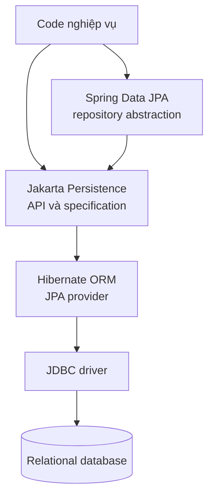
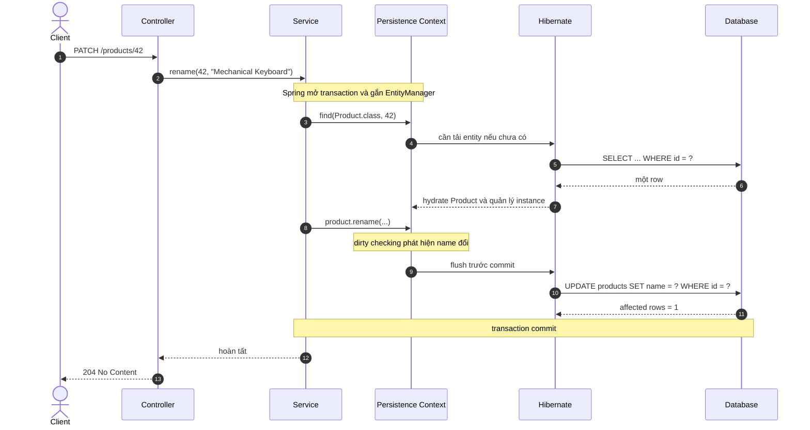
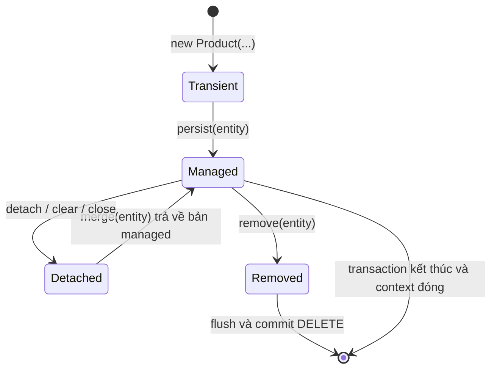

> [!NOTE]
> Bài này dành cho người đã biết Java và SQL cơ bản. Sau khi đọc, bạn có thể giải thích JPA, Hibernate và Spring Data JPA nằm ở đâu trong ứng dụng Spring Boot; dự đoán khi nào SQL được sinh; và nhận ra những lỗi ORM phổ biến trước khi chúng xuất hiện ở production.

## Mục lục

- [Bức tranh tổng thể](#bức-tranh-tổng-thể)
  - [Vì sao cần ORM](#vì-sao-cần-orm)
  - [Từ javax sang jakarta](#từ-javax-sang-jakarta)
- [Phân biệt JPA Hibernate và Spring Data JPA](#phân-biệt-jpa-hibernate-và-spring-data-jpa)
  - [Jakarta Persistence JPA](#jakarta-persistence-jpa)
  - [Hibernate ORM](#hibernate-orm)
  - [Spring Data JPA](#spring-data-jpa)
- [Kiến trúc và luồng thực thi](#kiến-trúc-và-luồng-thực-thi)
  - [Các thành phần nền tảng](#các-thành-phần-nền-tảng)
  - [Một request đi qua hệ thống như thế nào](#một-request-đi-qua-hệ-thống-như-thế-nào)
- [Ví dụ tối giản với Spring Boot](#ví-dụ-tối-giản-với-spring-boot)
  - [Mô hình dữ liệu](#mô-hình-dữ-liệu)
  - [Khai báo entity](#khai-báo-entity)
  - [Cấu hình quan sát SQL](#cấu-hình-quan-sát-sql)
  - [Ghi và cập nhật entity](#ghi-và-cập-nhật-entity)
  - [Đọc dữ liệu bằng Spring Data JPA](#đọc-dữ-liệu-bằng-spring-data-jpa)
- [Cơ chế cốt lõi cần nắm](#cơ-chế-cốt-lõi-cần-nắm)
  - [Trạng thái entity](#trạng-thái-entity)
  - [Persistence context và identity map](#persistence-context-và-identity-map)
  - [Unit of Work dirty checking và flush](#unit-of-work-dirty-checking-và-flush)
  - [EntityManager và Session](#entitymanager-và-session)
- [Query quan hệ và chiến lược tải](#query-quan-hệ-và-chiến-lược-tải)
  - [JPQL Criteria và native SQL](#jpql-criteria-và-native-sql)
  - [Lazy eager và N cộng một](#lazy-eager-và-n-cộng-một)
- [Transaction là biên an toàn](#transaction-là-biên-an-toàn)
  - [Ranh giới transaction](#ranh-giới-transaction)
  - [Flush không phải commit](#flush-không-phải-commit)
- [Chọn JPA JDBC hay jOOQ](#chọn-jpa-jdbc-hay-jooq)
- [Anti-pattern và cách sửa](#anti-pattern-và-cách-sửa)
  - [Trả entity trực tiếp qua API](#trả-entity-trực-tiếp-qua-api)
  - [Dùng save cho mọi thay đổi](#dùng-save-cho-mọi-thay-đổi)
  - [Đặt eager cho mọi quan hệ](#đặt-eager-cho-mọi-quan-hệ)
  - [Mở transaction quá rộng](#mở-transaction-quá-rộng)
  - [Tin rằng ORM loại bỏ nhu cầu hiểu SQL](#tin-rằng-orm-loại-bỏ-nhu-cầu-hiểu-sql)
- [Kiểm thử và quan sát](#kiểm-thử-và-quan-sát)
  - [Integration test nhỏ](#integration-test-nhỏ)
  - [Đọc log SQL đúng cách](#đọc-log-sql-đúng-cách)
- [Lộ trình học tiếp](#lộ-trình-học-tiếp)
- [Cheat sheet và checklist](#cheat-sheet-và-checklist)

## Bức tranh tổng thể

Ứng dụng Java làm việc với object, còn cơ sở dữ liệu quan hệ lưu dữ liệu trong bảng, hàng và khóa ngoại. Khoảng cách giữa hai mô hình này thường được gọi là **object-relational impedance mismatch** — sự không khớp giữa mô hình object và mô hình quan hệ. Ví dụ, một `Order` có danh sách `OrderItem`, nhưng database biểu diễn quan hệ đó bằng hai bảng và một cột khóa ngoại.

**ORM (Object-Relational Mapping)** là kỹ thuật ánh xạ object sang dữ liệu quan hệ. ORM cho phép code thao tác với entity và quan hệ giữa chúng, sau đó chuyển các thao tác đó thành SQL. ORM không thay thế database và cũng không làm SQL biến mất. Nó chỉ thêm một lớp quản lý trạng thái, ánh xạ và sinh câu lệnh ở giữa ứng dụng với JDBC.

```text
Java object  ⇄  ORM  ⇄  JDBC  ⇄  Database
Product          JPA      driver     products table
```

### Vì sao cần ORM

Không có ORM, một thao tác đọc đơn giản thường phải tự viết SQL, bind tham số, duyệt `ResultSet`, chuyển từng cột thành object và quản lý transaction. Với ORM, phần ánh xạ lặp lại được gom vào metadata như `@Entity`, `@Id` và `@Column`.

ORM hữu ích nhất khi ứng dụng có domain giàu quan hệ và nhiều thao tác CRUD — tạo, đọc, sửa, xóa. Đổi lại, lập trình viên phải hiểu persistence context, lifecycle, fetching và SQL được sinh. Nếu không, lớp abstraction thuận tiện có thể che khuất query dư thừa hoặc transaction quá dài.

> [!IMPORTANT]
> Mô hình tinh thần đúng là: **JPA quản lý object trong một transaction và Hibernate đồng bộ thay đổi thành SQL**. Đừng hình dung mỗi lời gọi Java luôn tương ứng ngay với đúng một câu SQL.

### Từ javax sang jakarta

**JPA** là tên quen thuộc của đặc tả Java Persistence API. Tên chính thức hiện đại là **Jakarta Persistence**. Từ Jakarta Persistence 3.0, package API đổi từ `javax.persistence.*` sang `jakarta.persistence.*`.

```java
// Ứng dụng hiện đại: Spring Boot 3 và Hibernate ORM 6+
import jakarta.persistence.Entity;
import jakarta.persistence.EntityManager;
import jakarta.persistence.Id;
```

Code cũ dùng `javax.persistence.*` thuộc thế hệ Java EE/JPA 2.x. Không nên trộn hai namespace trong cùng ứng dụng. Khi nâng cấp, cần nâng đồng bộ framework, provider và các thư viện có khai báo entity.

## Phân biệt JPA Hibernate và Spring Data JPA

Ba tên này giải quyết ba lớp khác nhau. Nhầm chúng dẫn đến những câu như “JPA sinh SQL lỗi” trong khi thành phần thực sự sinh SQL là Hibernate, hoặc “Hibernate repository” trong khi repository đang do Spring Data tạo.

| Thành phần | Loại | Cung cấp gì | Ví dụ API |
|---|---|---|---|
| Jakarta Persistence, thường gọi JPA | Đặc tả và API chuẩn | Quy tắc mapping, lifecycle, query, persistence context | `@Entity`, `EntityManager`, JPQL |
| Hibernate ORM | Persistence provider | Hiện thực JPA, dirty checking, SQL generation, cache, extension riêng | `Session`, `@BatchSize`, HQL |
| Spring Data JPA | Abstraction của Spring trên JPA | Tạo repository, query derivation, pagination, specification | `JpaRepository`, `@Query`, `Page` |



### Jakarta Persistence JPA

Jakarta Persistence định nghĩa **hợp đồng**. Hợp đồng này mô tả entity là gì, entity chuyển trạng thái ra sao, `EntityManager` phải hành xử thế nào và JPQL có ý nghĩa gì. Đặc tả không phải là chương trình tự chạy độc lập.

Một ứng dụng chỉ dùng API chuẩn sẽ ít phụ thuộc provider hơn:

```java
@PersistenceContext
private EntityManager entityManager;

public Product find(long id) {
    return entityManager.find(Product.class, id);
}
```

Trong thực tế, khả năng đổi provider không phải lúc nào cũng là mục tiêu chính. Giá trị lớn hơn của JPA là một mô hình lập trình thống nhất và một tập khái niệm chuẩn.

### Hibernate ORM

Hibernate ORM là **persistence provider** — thư viện hiện thực hợp đồng Jakarta Persistence. Nó đọc metadata mapping, theo dõi entity đang managed, tạo SQL theo SQL dialect của database và gọi JDBC.

**Dialect** là bộ quy tắc Hibernate dùng để thích nghi SQL với từng hệ quản trị. Ví dụ, cú pháp phân trang, kiểu dữ liệu và cách sinh khóa có thể khác giữa PostgreSQL, MySQL và Oracle.

Hibernate còn có API và tính năng riêng ngoài JPA. `Session` là API native tương ứng gần nhất với `EntityManager`; HQL mở rộng JPQL; `@BatchSize` và các annotation trong `org.hibernate.annotations` là extension của Hibernate. Dùng extension khi nó giải quyết vấn đề thật, nhưng hãy ghi nhận rằng code đó không còn hoàn toàn portable giữa các provider.

### Spring Data JPA

Spring Data JPA không phải ORM và không hiện thực JPA. Nó tạo lớp repository ở phía trên JPA để giảm code lặp lại.

```java
public interface ProductRepository extends JpaRepository<Product, Long> {
    Optional<Product> findBySku(String sku);
}
```

Spring sinh implementation cho interface này. Khi method chạy, repository vẫn gọi `EntityManager`; Hibernate vẫn là thành phần chuyển thao tác thành SQL.

> [!TIP]
> Cách nhớ ngắn: **JPA viết luật, Hibernate thi hành luật, Spring Data JPA giảm code gọi luật**.

Xem riêng [Spring Data JPA](./spring-data-jpa) để hiểu query derivation, `save`, projection và custom repository.

## Kiến trúc và luồng thực thi

### Các thành phần nền tảng

Các thuật ngữ sau xuất hiện xuyên suốt JPA/Hibernate:

| Thuật ngữ | Ý nghĩa thực tế |
|---|---|
| Entity | Object có identity bền vững và được ánh xạ tới dữ liệu trong database |
| Persistence unit | Nhóm cấu hình mô tả tập entity, provider và kết nối database |
| `EntityManagerFactory` | Factory nặng, thread-safe, dùng để tạo `EntityManager`; thường có một instance cho mỗi persistence unit |
| `EntityManager` | API thao tác với entity và persistence context; không thread-safe |
| Persistence context | Vùng theo dõi các entity managed, thường gắn với một transaction |
| JDBC driver | Thành phần gửi SQL và nhận kết quả từ database |
| Transaction | Đơn vị công việc nguyên tử: hoặc commit toàn bộ, hoặc rollback toàn bộ |

Trong Spring Boot, auto-configuration thường tạo `DataSource`, `EntityManagerFactory`, transaction manager và repository. `EntityManager` được inject thường là proxy do Spring quản lý. Proxy này chuyển lời gọi tới `EntityManager` đang gắn với transaction hiện tại; nó không biến một `EntityManager` thật thành object an toàn để chia sẻ giữa các thread.

### Một request đi qua hệ thống như thế nào



**Hydration** là quá trình biến một row từ kết quả SQL thành entity Java. Sau hydration, entity được đặt vào persistence context và trở thành managed. Từ đó, Hibernate có thể theo dõi thay đổi mà không cần gọi `update()` thủ công.

## Ví dụ tối giản với Spring Boot

Ví dụ dùng một bảng `products`. Mục tiêu không phải xây đủ REST API, mà là quan sát đường đi từ entity đến SQL.

### Mô hình dữ liệu

```sql
create table products (
    id          bigint generated by default as identity primary key,
    sku         varchar(50) not null unique,
    name        varchar(200) not null,
    price       numeric(19, 2) not null,
    version     bigint not null
);
```

Cột `version` phục vụ **optimistic locking** — cơ chế phát hiện hai transaction cùng sửa một row mà không khóa row trong suốt thời gian xử lý. Hibernate thêm version vào điều kiện `UPDATE`; nếu không row nào khớp, thay đổi đã bị transaction khác vượt qua và thao tác hiện tại phải thất bại thay vì ghi đè im lặng.

### Khai báo entity

```java
package com.example.catalog;

import jakarta.persistence.Column;
import jakarta.persistence.Entity;
import jakarta.persistence.GeneratedValue;
import jakarta.persistence.GenerationType;
import jakarta.persistence.Id;
import jakarta.persistence.Table;
import jakarta.persistence.Version;

import java.math.BigDecimal;

@Entity
@Table(name = "products")
public class Product {

    @Id
    @GeneratedValue(strategy = GenerationType.IDENTITY)
    private Long id;

    @Column(nullable = false, unique = true, length = 50)
    private String sku;

    @Column(nullable = false, length = 200)
    private String name;

    @Column(nullable = false, precision = 19, scale = 2)
    private BigDecimal price;

    @Version
    private long version;

    protected Product() {
        // Constructor không tham số cho JPA.
    }

    public Product(String sku, String name, BigDecimal price) {
        this.sku = sku;
        this.name = name;
        changePrice(price);
    }

    public void rename(String newName) {
        if (newName == null || newName.isBlank()) {
            throw new IllegalArgumentException("Product name must not be blank");
        }
        this.name = newName;
    }

    public void changePrice(BigDecimal newPrice) {
        if (newPrice == null || newPrice.signum() < 0) {
            throw new IllegalArgumentException("Price must be non-negative");
        }
        this.price = newPrice;
    }

    public Long getId() {
        return id;
    }

    public String getName() {
        return name;
    }
}
```

Một entity hiện đại nên bảo vệ invariant bằng method nghiệp vụ như `changePrice` thay vì mở setter cho mọi field. **Invariant** là điều kiện luôn phải đúng, ở đây là giá không âm. Mapping entity không đồng nghĩa với việc biến entity thành túi dữ liệu không có hành vi.

Chiến lược identity yêu cầu database sinh khóa khi `INSERT`. Vì vậy Hibernate có thể phải gửi `INSERT` sớm hơn dự kiến để lấy `id`. Thời điểm chính xác còn phụ thuộc chiến lược sinh khóa, provider và việc ứng dụng gọi `flush`. Xem sâu hơn tại [Entity mapping và identity](./entity-mapping-and-identity).

### Cấu hình quan sát SQL

Trong môi trường học hoặc local, có thể bật log sau:

```yaml
spring:
  jpa:
    hibernate:
      ddl-auto: validate
    properties:
      hibernate:
        format_sql: true

logging:
  level:
    org.hibernate.SQL: DEBUG
    org.hibernate.orm.jdbc.bind: TRACE
```

`org.hibernate.SQL` in câu SQL. `org.hibernate.orm.jdbc.bind` in giá trị bind vào dấu `?` trên Hibernate ORM hiện đại. Không nên bật bind logging ở production nếu tham số có dữ liệu cá nhân, token hoặc bí mật.

`ddl-auto: validate` chỉ kiểm tra schema có phù hợp mapping hay không. Ở production, nên quản lý thay đổi schema bằng công cụ migration như Flyway hoặc Liquibase thay vì để Hibernate tự `update` schema.

### Ghi và cập nhật entity

```java
package com.example.catalog;

import jakarta.persistence.EntityManager;
import jakarta.persistence.PersistenceContext;
import org.springframework.stereotype.Service;
import org.springframework.transaction.annotation.Transactional;

import java.math.BigDecimal;

@Service
public class ProductService {

    @PersistenceContext
    private EntityManager entityManager;

    @Transactional
    public Long create(String sku, String name, BigDecimal price) {
        Product product = new Product(sku, name, price);
        entityManager.persist(product);
        return product.getId();
    }

    @Transactional
    public void rename(long id, String newName) {
        Product product = entityManager.find(Product.class, id);
        if (product == null) {
            throw new IllegalArgumentException("Product not found: " + id);
        }
        product.rename(newName);
        // Không cần entityManager.merge(product) hoặc repository.save(product).
        // product đang managed; dirty checking sẽ tạo UPDATE khi flush.
    }
}
```

Khi `create` chạy với `GenerationType.IDENTITY`, SQL điển hình là:

```sql
insert into products (name, price, sku, version)
values (?, ?, ?, ?);

-- bind: ["Mechanical Keyboard", 129.90, "KB-001", 0]
```

Khi `rename` chạy, Hibernate đọc row rồi cập nhật entity khi flush:

```sql
select p.id, p.name, p.price, p.sku, p.version
from products p
where p.id = ?;

update products
set name = ?, price = ?, sku = ?, version = ?
where id = ? and version = ?;
```

Tên alias, thứ tự cột và việc chỉ cập nhật cột thay đổi có thể khác theo version, dialect và cấu hình. Mặc định, Hibernate thường sinh `UPDATE` gồm nhiều cột mapped. `@DynamicUpdate` có thể làm SQL động theo cột thay đổi, nhưng nó tăng số dạng statement và không nên được thêm chỉ vì “trông SQL gọn hơn”. Hãy đo workload trước khi dùng extension này.

Điều kiện `version = ?` ngăn lost update. **Lost update** là lỗi một transaction ghi đè thay đổi đã commit của transaction khác mà không biết. Sau update thành công, Hibernate tăng `version`; nếu affected rows bằng 0, nó báo lỗi optimistic locking.

### Đọc dữ liệu bằng Spring Data JPA

```java
package com.example.catalog;

import org.springframework.data.jpa.repository.JpaRepository;

import java.util.Optional;

public interface ProductRepository extends JpaRepository<Product, Long> {
    Optional<Product> findBySku(String sku);
}
```

```java
@Service
public class ProductQueryService {

    private final ProductRepository products;

    public ProductQueryService(ProductRepository products) {
        this.products = products;
    }

    @Transactional(readOnly = true)
    public ProductSummary findBySku(String sku) {
        Product product = products.findBySku(sku)
                .orElseThrow(() -> new IllegalArgumentException("Unknown SKU: " + sku));
        return new ProductSummary(product.getId(), product.getName());
    }
}

public record ProductSummary(Long id, String name) {}
```

Tên method `findBySku` được Spring Data phân tích để tạo query. Hibernate vẫn biên dịch query thành SQL, bind `sku` và hydrate entity. `readOnly = true` là gợi ý tối ưu cho transaction/provider; nó không phải cơ chế phân quyền và không bảo đảm database sẽ chặn mọi câu ghi trong mọi cấu hình.

## Cơ chế cốt lõi cần nắm

### Trạng thái entity

Một entity không chỉ là POJO có annotation. Nó có trạng thái so với persistence context:



| Trạng thái | Diễn giải | Hibernate có theo dõi thay đổi không |
|---|---|---|
| Transient, hay new | Object mới, chưa thuộc persistence context | Không |
| Managed, hay persistent | Object đang nằm trong persistence context | Có |
| Detached | Từng managed nhưng context đã đóng hoặc object bị detach | Không |
| Removed | Đã được đánh dấu xóa; `DELETE` thường gửi lúc flush | Có, cho đến khi xóa được đồng bộ |

`persist(entity)` đưa entity mới vào trạng thái managed. `merge(entity)` có nghĩa khác: nó **copy state** từ object truyền vào sang một instance managed và trả instance managed đó về.

```java
Product managed = entityManager.merge(detachedProduct);

// detachedProduct vẫn detached.
// Hãy tiếp tục làm việc với managed, không bỏ qua giá trị trả về.
```

Chi tiết về `persist`, `merge`, `remove`, `detach`, `refresh` và lifecycle nằm trong [Persistence Context và Entity Lifecycle](./persistence-context-and-entity-lifecycle).

### Persistence context và identity map

Persistence context là vùng làm việc của JPA. Nó giữ entity theo cặp `(entity type, primary key)`. Cấu trúc này tạo ra **identity map** — trong cùng một persistence context, cùng một row được biểu diễn bởi cùng một Java instance.

```java
Product first = entityManager.find(Product.class, 42L);  // có thể SELECT
Product second = entityManager.find(Product.class, 42L); // lấy từ context

assert first == second;
```

Lần `find` thứ hai thường không tạo thêm `SELECT` vì entity đã có trong first-level cache. **First-level cache** chính là persistence context và luôn tồn tại theo mô hình JPA/Hibernate; nó khác second-level cache dùng chung giữa nhiều session và phải được cấu hình riêng.

Identity map bảo đảm một transaction không có hai bản managed mâu thuẫn của cùng row. Nó cũng là nền cho dirty checking và quan hệ object nhất quán.

### Unit of Work dirty checking và flush

**Unit of Work** là mẫu thiết kế gom nhiều thay đổi object thành một đơn vị rồi đồng bộ chúng cùng nhau. Persistence context đóng vai trò Unit of Work.

Khi entity được hydrate, Hibernate giữ thông tin trạng thái ban đầu. Trước khi commit hoặc tại một điểm cần đồng bộ, **dirty checking** so sánh trạng thái hiện tại với trạng thái ban đầu để tìm field đã đổi. Hibernate sau đó xếp `INSERT`, `UPDATE` và `DELETE` vào hàng đợi hành động.

```text
find Product → managed snapshot
rename       → Java field thay đổi, chưa chắc đã có SQL
flush        → dirty checking → tạo và chạy UPDATE
commit       → database xác nhận transaction
```

**Flush** là đồng bộ thay đổi trong persistence context xuống database bằng SQL. Flush có thể xảy ra:

- trước khi transaction commit;
- trước một query có thể bị ảnh hưởng bởi thay đổi chưa đồng bộ khi flush mode là `AUTO`;
- khi code gọi `entityManager.flush()`;
- sớm hơn trong một số trường hợp cần lấy khóa hoặc kiểm tra ràng buộc.

Flush không kết thúc transaction. SQL đã chạy sau flush vẫn có thể bị rollback.

### EntityManager và Session

`EntityManager` là API chuẩn Jakarta Persistence. `Session` là API native của Hibernate và trên Hibernate hiện đại có quan hệ tương thích chặt với `EntityManager`. Khi cần tính năng riêng, có thể unwrap:

```java
import org.hibernate.Session;

Session session = entityManager.unwrap(Session.class);
```

Chỉ unwrap khi API chuẩn không đáp ứng nhu cầu. Nếu toàn bộ code nghiệp vụ phụ thuộc `Session`, ứng dụng đang chủ động gắn với Hibernate; điều đó có thể hợp lý, nhưng phải là quyết định có ý thức.

> [!WARNING]
> `EntityManager` và `Session` không thread-safe. Không lưu chúng trong static field, không truyền sang task chạy async, và không dùng cùng một instance thật đồng thời ở nhiều thread. Trong Spring, hãy để transaction manager cấp context theo luồng thực thi hiện tại.

## Query quan hệ và chiến lược tải

### JPQL Criteria và native SQL

JPA cung cấp nhiều mức query:

| Cách query | Viết theo | Phù hợp khi |
|---|---|---|
| `find` | Entity type và primary key | Tìm một entity theo khóa |
| JPQL | Entity và field Java | Query domain phổ biến, cần portable |
| Criteria API | Cây biểu thức type-safe ở mức Java | Query động có nhiều điều kiện tùy chọn |
| Native SQL | Bảng, cột và cú pháp database | Cần CTE, window function, hint hoặc tối ưu đặc thù |
| Spring Data derived query | Tên method repository | Điều kiện đơn giản, tên vẫn dễ đọc |

JPQL truy vấn entity chứ không truy vấn trực tiếp tên bảng:

```java
List<Product> products = entityManager.createQuery("""
        select p
        from Product p
        where p.price >= :minPrice
        order by p.name
        """, Product.class)
    .setParameter("minPrice", new BigDecimal("100.00"))
    .getResultList();
```

Hibernate có thể sinh SQL tương đương:

```sql
select p.id, p.name, p.price, p.sku, p.version
from products p
where p.price >= ?
order by p.name;
```

Không nối input người dùng trực tiếp vào JPQL hoặc SQL. Luôn bind parameter như `:minPrice` để tránh injection và giúp database tái sử dụng execution plan.

Xem [JPQL, Criteria và native query](./jpql-criteria-and-native-query) để chọn đúng công cụ cho query tĩnh, query động và SQL đặc thù.

### Lazy eager và N cộng một

**Fetching strategy** là quy tắc quyết định khi nào dữ liệu liên quan được tải. `LAZY` trì hoãn tải đến khi quan hệ được truy cập. `EAGER` yêu cầu quan hệ phải sẵn sàng, nhưng không bảo đảm provider luôn dùng một câu `JOIN` duy nhất.

Đừng suy luận mặc định chỉ từ trực giác:

- `@OneToMany` và `@ManyToMany` mặc định là `LAZY` theo JPA;
- `@ManyToOne` và `@OneToOne` mặc định là `EAGER` theo JPA;
- trong thiết kế thực tế, quan hệ to-one thường được khai báo `LAZY` rõ ràng và query sẽ fetch đúng dữ liệu theo từng use case.

Lỗi **N cộng một query** xảy ra khi query đầu tải N entity, sau đó mỗi entity kích hoạt thêm một query cho quan hệ:

```sql
select o.id, o.customer_id from orders o;       -- 1 query
select c.id, c.name from customers c where c.id = ?; -- lặp N lần
```

Không sửa N cộng một bằng cách chuyển tất cả sang `EAGER`. Cách sửa phụ thuộc màn hình hoặc use case:

- dùng `join fetch` cho một graph nhỏ cần ngay;
- dùng `@EntityGraph` để mô tả fetch plan;
- dùng DTO projection nếu chỉ cần vài cột;
- dùng batch fetching khi cần tải nhiều proxy/collection theo nhóm;
- đo số query và kích thước kết quả, vì join nhiều collection có thể gây Cartesian product.

Đọc tiếp [Relationships Mapping](./relationships-mapping) và [Fetching Strategies và Proxies](./fetching-strategies-and-proxies) trước khi thiết kế aggregate có nhiều quan hệ.

## Transaction là biên an toàn

### Ranh giới transaction

Transaction nên bao quanh một use case nghiệp vụ hoàn chỉnh và thường đặt ở service layer:

```java
@Transactional
public void changePrice(long productId, BigDecimal newPrice) {
    Product product = entityManager.find(Product.class, productId);
    if (product == null) {
        throw new IllegalArgumentException("Product not found: " + productId);
    }
    product.changePrice(newPrice);
}
```

Trong method này, thao tác đọc, thay đổi object, dirty checking và flush cùng nằm trong một transaction. Khi method kết thúc thành công, Spring yêu cầu commit. Khi exception phù hợp quy tắc rollback thoát ra, Spring rollback.

Không nên để controller tự ghép nhiều repository call mà không có service transaction. Mỗi call có thể chạy trong context khác nhau, làm mất tính nguyên tử và khiến entity sớm detached.

### Flush không phải commit

Ba thời điểm sau khác nhau:

| Thao tác | Điều gì xảy ra | Có thể rollback không |
|---|---|---|
| Thay đổi field của entity managed | Chỉ state Java đổi | Có |
| `flush()` | Hibernate gửi SQL xuống database | Có |
| `commit` | Database xác nhận transaction | Không thể rollback bằng transaction cũ |

`flush()` hữu ích khi cần phát hiện sớm lỗi unique constraint hoặc foreign key trong đúng vị trí code mong muốn:

```java
entityManager.persist(product);
entityManager.flush(); // buộc INSERT; lỗi constraint xuất hiện tại đây
```

Tuy nhiên, gọi flush liên tục làm giảm khả năng batching và tăng round trip. Chỉ flush thủ công khi có lý do về tính đúng đắn hoặc cần kiểm soát thời điểm lỗi.

Chi tiết về propagation, isolation, rollback và proxy `@Transactional` nằm tại [Transactions với JPA](./transactions-with-jpa).

## Chọn JPA JDBC hay jOOQ

Không có công cụ truy cập dữ liệu tốt nhất cho mọi workload. Chọn theo hình dạng bài toán:

| Tiêu chí | JPA với Hibernate | Spring JDBC hoặc JDBC | jOOQ |
|---|---|---|---|
| Mô hình chính | Entity graph và Unit of Work | SQL và row mapping | SQL type-safe bằng DSL |
| CRUD domain | Rất thuận tiện | Nhiều code thủ công hơn | Tốt nhưng rõ SQL hơn ORM |
| Query báo cáo phức tạp | Có thể khó kiểm soát | Toàn quyền SQL | Rất mạnh |
| Dirty checking | Có | Không | Không theo mô hình JPA |
| Tính portable giữa database | Tương đối cao với JPQL | Phụ thuộc SQL đã viết | Hỗ trợ nhiều dialect nhưng vẫn thiên SQL |
| Đường cong học | Mapping, lifecycle, fetching | JDBC và SQL | SQL cùng DSL/code generation |

Chọn JPA/Hibernate khi domain có lifecycle và quan hệ cần được quản lý trong transaction. Chọn JDBC khi query đơn giản, cần ít abstraction hoặc cần kiểm soát tuyệt đối. Chọn jOOQ khi ứng dụng lấy SQL phức tạp làm trung tâm và muốn type safety.

Một ứng dụng có thể dùng cả hai cách. Ví dụ, dùng JPA cho command side cập nhật aggregate và jOOQ cho dashboard báo cáo. Nếu trộn trong cùng transaction, cần hiểu cả hai đang dùng connection nào và phải flush JPA trước khi query SQL cần nhìn thấy thay đổi chưa đồng bộ.

> [!TIP]
> Quy tắc thực dụng: nếu đang cố ép một báo cáo nhiều CTE, window function và aggregate vào entity graph, hãy cân nhắc SQL-first. Nếu đang tự viết hàng trăm mapper CRUD và logic theo dõi thay đổi, JPA có thể phù hợp hơn.

## Anti-pattern và cách sửa

### Trả entity trực tiếp qua API

**Anti-pattern:** controller trả entity JPA làm JSON.

```java
@GetMapping("/{id}")
Product get(@PathVariable long id) {
    return repository.findById(id).orElseThrow();
}
```

Vấn đề có thể xuất hiện gồm lazy loading ngoài transaction, vòng lặp serialize quan hệ hai chiều, lộ field nội bộ và API bị khóa chặt vào schema persistence.

**Cách sửa:** ánh xạ sang DTO trong transaction hoặc query thẳng projection cần thiết.

```java
public record ProductResponse(Long id, String name) {}

@Transactional(readOnly = true)
public ProductResponse get(long id) {
    Product product = repository.findById(id).orElseThrow();
    return new ProductResponse(product.getId(), product.getName());
}
```

### Dùng save cho mọi thay đổi

**Anti-pattern:** gọi `save` sau mỗi setter dù entity đã managed.

```java
Product product = repository.findById(id).orElseThrow();
product.rename(newName);
repository.save(product); // thừa trong cùng persistence context
```

Entity vừa đọc trong transaction đang managed. Dirty checking sẽ lưu thay đổi. Lời gọi `save` thừa làm code che khuất lifecycle; tùy việc Spring Data nhận diện entity mới hay cũ, nó sẽ đi theo `persist` hoặc `merge`.

**Cách sửa:** dùng `save` để đưa entity mới vào repository khi phong cách code yêu cầu; với entity managed, thay đổi nó trong transaction và để Unit of Work flush.

### Đặt eager cho mọi quan hệ

**Anti-pattern:** đổi toàn bộ association sang `EAGER` để tránh `LazyInitializationException`.

Điều này chuyển lỗi “tải quá muộn” thành lỗi “luôn tải quá nhiều”. Eager association còn có thể tạo query phụ mà người viết không dự đoán.

**Cách sửa:** giữ fetch mặc định có chủ đích, thường ưu tiên `LAZY` cho association, rồi định nghĩa fetch plan ở query bằng fetch join, entity graph hoặc DTO projection. Sửa ranh giới transaction nếu dữ liệu đáng lẽ phải được truy cập trong use case.

### Mở transaction quá rộng

**Anti-pattern:** giữ transaction trong lúc gọi HTTP service, gửi email hoặc chờ người dùng.

Transaction dài giữ database connection lâu hơn và có thể giữ lock. Nó làm tăng contention — mức độ nhiều transaction tranh chấp cùng tài nguyên — và giảm throughput.

**Cách sửa:** giữ transaction quanh phần đọc/ghi database cần tính nguyên tử. Với external side effect, cân nhắc outbox pattern hoặc tách orchestration để không giữ connection trong lúc chờ mạng.

### Tin rằng ORM loại bỏ nhu cầu hiểu SQL

**Anti-pattern:** đánh giá hiệu năng bằng số dòng Java thay vì SQL, execution plan và số round trip.

Một repository method ngắn có thể sinh hàng trăm query do N cộng một. Một fetch join tưởng tối ưu có thể nhân số row do Cartesian product. Một transaction sửa một entity có thể update nhiều cột.

**Cách sửa:** bật SQL log ở local/test, đo query count cho use case quan trọng, xem `EXPLAIN` hoặc `EXPLAIN ANALYZE` trên query chậm và theo dõi metrics ở production. Xem [Hibernate Performance Troubleshooting](./hibernate-performance-troubleshooting) để có quy trình chẩn đoán thay vì đoán.

Các anti-pattern khác cần nhớ:

| Anti-pattern | Hậu quả | Hướng sửa |
|---|---|---|
| Dùng `CascadeType.ALL` ở mọi quan hệ | Xóa hoặc persist lan truyền ngoài ý muốn | Chỉ chọn cascade phù hợp ownership/lifecycle |
| Dùng `equals` và `hashCode` dựa trên ID sinh tự động một cách ngây thơ | Hash thay đổi sau persist, collection hoạt động sai | Chọn business key ổn định hoặc chiến lược identity được thiết kế kỹ |
| Dùng `ddl-auto: update` ở production | Schema thay đổi khó review, khó rollback | Migration có version bằng Flyway/Liquibase |
| Gọi bulk JPQL rồi tiếp tục tin state managed | Persistence context giữ dữ liệu cũ | `clear`/refresh có chủ đích sau bulk update |
| Phân trang trên fetch join collection | Duplicate row, giới hạn áp dụng sai hoặc tải vào memory | Hai bước query ID rồi fetch graph, hoặc projection |
| Bật Open Session in View để che mọi lazy load | SQL phát sinh ở web layer, khó kiểm soát transaction | Tắt hoặc đánh giá có chủ đích; tải DTO trong service |

## Kiểm thử và quan sát

### Integration test nhỏ

Test ORM đáng tin cậy phải flush và clear. Nếu chỉ assert object vừa thay đổi trong cùng persistence context, test có thể pass dù mapping hoặc SQL thực tế sai.

```java
import static org.assertj.core.api.Assertions.assertThat;

import jakarta.persistence.EntityManager;
import org.junit.jupiter.api.Test;
import org.springframework.beans.factory.annotation.Autowired;
import org.springframework.boot.test.autoconfigure.orm.jpa.DataJpaTest;

import java.math.BigDecimal;

@DataJpaTest
class ProductMappingTest {

    @Autowired
    EntityManager entityManager;

    @Test
    void persists_and_loads_product() {
        Product product = new Product(
                "KB-001",
                "Mechanical Keyboard",
                new BigDecimal("129.90")
        );

        entityManager.persist(product);
        entityManager.flush(); // bảo đảm SQL đang chờ được gửi và constraint được kiểm tra
        Long id = product.getId();
        entityManager.clear(); // lần đọc sau phải đi qua database

        Product reloaded = entityManager.find(Product.class, id);

        assertThat(reloaded.getName()).isEqualTo("Mechanical Keyboard");
    }
}
```

`@DataJpaTest` thường dùng embedded database nếu dự án có dependency tương ứng. Với hành vi phụ thuộc dialect, index, lock, kiểu dữ liệu hoặc execution plan, hãy dùng Testcontainers chạy đúng loại và phiên bản database gần production. H2 không phải bản thay thế hoàn hảo cho PostgreSQL, MySQL hay Oracle.

Để kiểm chứng dirty checking, có thể thêm test thay đổi entity managed, `flush`, `clear`, rồi đọc lại. Để kiểm chứng optimistic locking, dùng hai transaction độc lập cùng đọc một version và xác nhận transaction commit sau thất bại.

### Đọc log SQL đúng cách

Khi xem một use case, kiểm tra theo thứ tự:

1. Có bao nhiêu câu SQL và bao nhiêu round trip?
2. Parameter thực tế là gì, có query lặp theo N entity không?
3. Query lấy bao nhiêu cột và bao nhiêu row so với dữ liệu cần dùng?
4. `UPDATE` hoặc `DELETE` có điều kiện khóa/version đúng không?
5. Index có phục vụ predicate và join không?
6. Transaction giữ connection và lock trong bao lâu?

Log SQL cho biết câu lệnh, nhưng không cho biết toàn bộ chi phí. Kết hợp log với statistics/metrics, slow query log của database và execution plan. Đừng chỉ format SQL đẹp rồi kết luận query nhanh.

> [!WARNING]
> Không dựa vào `spring.jpa.show-sql=true` như giải pháp observability production. Output thường thiếu ngữ cảnh, parameter tách rời và có thể làm log nhiễu. Dùng logging category, datasource proxy hoặc công cụ APM phù hợp, đồng thời che dữ liệu nhạy cảm.

## Lộ trình học tiếp

Nên học theo thứ tự từ trạng thái object đến query và hiệu năng:

1. [Entity Mapping và Identity](./entity-mapping-and-identity) — khóa chính, value type, embeddable và chiến lược `equals`/`hashCode`.
2. [Persistence Context và Entity Lifecycle](./persistence-context-and-entity-lifecycle) — managed, detached, dirty checking, flush và merge.
3. [Relationships Mapping](./relationships-mapping) — ownership, khóa ngoại, cascade và orphan removal.
4. [Fetching Strategies và Proxies](./fetching-strategies-and-proxies) — lazy loading, fetch join, entity graph và N cộng một.
5. [JPQL, Criteria và Native Query](./jpql-criteria-and-native-query) — các cách diễn đạt query và projection.
6. [Transactions với JPA](./transactions-with-jpa) — transaction boundary, isolation, locking và rollback.
7. [Spring Data JPA](./spring-data-jpa) — repository abstraction mà không quên cơ chế bên dưới.
8. [Hibernate Performance Troubleshooting](./hibernate-performance-troubleshooting) — đo, đọc SQL và xử lý bottleneck.

## Cheat sheet và checklist

| Câu hỏi | Câu trả lời ngắn |
|---|---|
| JPA có phải thư viện ORM không? | Không. Jakarta Persistence là specification và API; cần provider như Hibernate. |
| Hibernate có phải Spring Data JPA không? | Không. Hibernate là ORM/provider; Spring Data JPA tạo repository trên JPA. |
| `persist` có luôn chạy `INSERT` ngay không? | Không luôn. SQL thường chạy khi flush, nhưng IDENTITY có thể buộc insert sớm để lấy khóa. |
| Sửa entity managed có cần `save` không? | Không. Dirty checking ghi thay đổi khi flush. |
| `merge` có attach chính object truyền vào không? | Không. Nó copy state và trả về một instance managed. |
| Flush có phải commit không? | Không. Flush gửi SQL; transaction vẫn có thể rollback. |
| Persistence context có phải cache không? | Nó hoạt động như first-level cache và identity map, nhưng còn theo dõi lifecycle/thay đổi. |
| `LAZY` có luôn tốt hơn `EAGER` không? | Không tuyệt đối. Hãy chọn fetch plan theo use case và đo SQL. |
| `@Transactional(readOnly = true)` có cấm ghi không? | Không phải trong mọi hệ thống. Nó chủ yếu là hint tối ưu. |
| ORM có loại bỏ nhu cầu học SQL không? | Không. SQL, index, execution plan và transaction database vẫn quyết định hiệu năng. |

Checklist trước khi đưa một use case JPA vào production:

- [ ] Entity dùng `jakarta.persistence.*`, không trộn `javax.persistence.*`.
- [ ] Transaction boundary nằm ở use case/service và không ôm lời gọi mạng dài.
- [ ] Entity mới dùng `persist`/`save` có chủ đích; entity managed dựa vào dirty checking.
- [ ] Không bỏ qua object trả về từ `merge`.
- [ ] Quan hệ có ownership, cascade và fetch strategy được chọn rõ ràng.
- [ ] API trả DTO/projection, không vô tình serialize entity graph.
- [ ] Use case quan trọng được kiểm tra số query để phát hiện N cộng một.
- [ ] Mapping được test bằng `flush` và `clear`; hành vi đặc thù được test với database thật.
- [ ] Schema production do migration có version quản lý, không dùng `ddl-auto: update`.
- [ ] Có optimistic locking hoặc chiến lược concurrency phù hợp cho dữ liệu dễ bị ghi đồng thời.
- [ ] SQL chậm được phân tích bằng execution plan, không tối ưu theo phỏng đoán.
- [ ] Log bind parameter và SQL production không làm lộ dữ liệu nhạy cảm.

> [!TIP]
> Một câu để nhớ: **ứng dụng thay đổi entity, persistence context theo dõi Unit of Work, Hibernate sinh SQL, JDBC gửi SQL, còn database mới là nơi bảo đảm constraint và transaction**.
