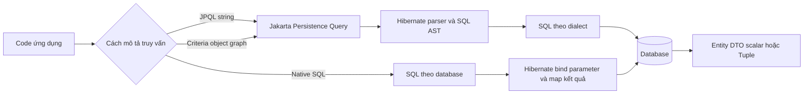
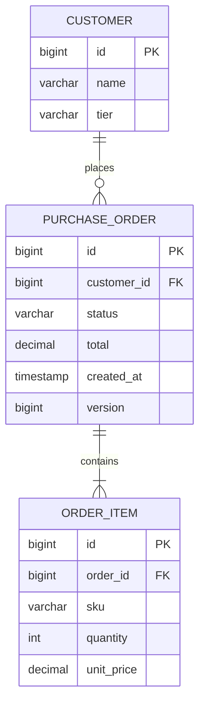
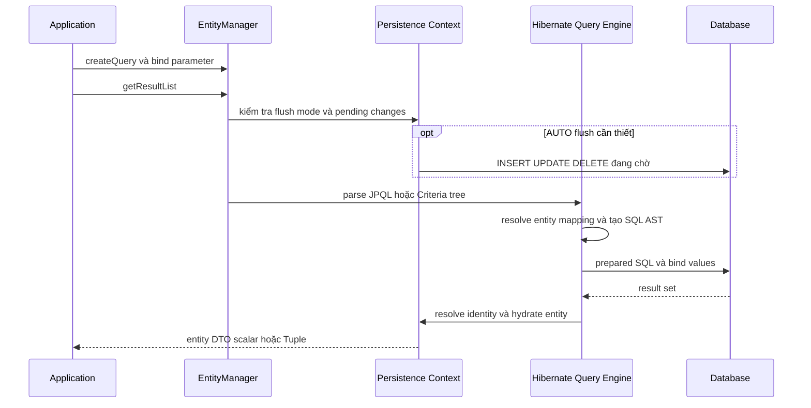

JPQL, Criteria API và native SQL giải cùng một bài toán: lấy đúng dữ liệu từ database. Điểm khác nhau nằm ở mức trừu tượng, khả năng tạo truy vấn động, độ an toàn khi refactor và mức phụ thuộc vào database.

Tài liệu này dùng Jakarta Persistence API hiện đại với package `jakarta.persistence`. Hibernate được xem là **persistence provider** — thư viện hiện thực Jakarta Persistence — còn Spring Data JPA là lớp repository xây trên API đó. Các tính năng riêng của Hibernate hoặc Spring Data JPA sẽ được đánh dấu rõ.

> [!NOTE]
> Các câu SQL trong bài là dạng minh họa mà Hibernate có thể sinh cho PostgreSQL. Alias, thứ tự cột và cú pháp phân trang có thể khác theo phiên bản Hibernate và SQL dialect. Hãy đọc log của chính ứng dụng thay vì phụ thuộc vào chuỗi SQL trong tài liệu.

## Mục lục

- [1 Mô hình tinh thần](#1-mô-hình-tinh-thần)
  - [1.1 Ranh giới giữa JPA Hibernate và Spring Data JPA](#11-ranh-giới-giữa-jpa-hibernate-và-spring-data-jpa)
  - [1.2 Domain dùng trong ví dụ](#12-domain-dùng-trong-ví-dụ)
- [2 Chọn công cụ truy vấn](#2-chọn-công-cụ-truy-vấn)
- [3 JPQL truy vấn trên mô hình entity](#3-jpql-truy-vấn-trên-mô-hình-entity)
  - [3.1 TypedQuery và named parameter](#31-typedquery-và-named-parameter)
  - [3.2 Join và fetch join](#32-join-và-fetch-join)
  - [3.3 Projection entity DTO và Tuple](#33-projection-entity-dto-và-tuple)
  - [3.4 Aggregation và subquery](#34-aggregation-và-subquery)
  - [3.5 Bulk update và delete](#35-bulk-update-và-delete)
  - [3.6 Named query và HQL](#36-named-query-và-hql)
- [4 Criteria API cho truy vấn động](#4-criteria-api-cho-truy-vấn-động)
  - [4.1 Viết lại JPQL bằng Criteria API](#41-viết-lại-jpql-bằng-criteria-api)
  - [4.2 Ghép bộ lọc tùy chọn](#42-ghép-bộ-lọc-tùy-chọn)
  - [4.3 Static metamodel](#43-static-metamodel)
  - [4.4 Spring Data JPA Specification](#44-spring-data-jpa-specification)
- [5 Native query khi cần nói SQL](#5-native-query-khi-cần-nói-sql)
  - [5.1 Khi nào native SQL hợp lý](#51-khi-nào-native-sql-hợp-lý)
  - [5.2 Ánh xạ entity và DTO](#52-ánh-xạ-entity-và-dto)
  - [5.3 Native query trong Spring Data JPA](#53-native-query-trong-spring-data-jpa)
  - [5.4 API riêng của Hibernate](#54-api-riêng-của-hibernate)
- [6 Pagination sorting và count query](#6-pagination-sorting-và-count-query)
  - [6.1 Offset pagination](#61-offset-pagination)
  - [6.2 Count query](#62-count-query)
  - [6.3 Keyset pagination](#63-keyset-pagination)
  - [6.4 Fetch join collection cùng pagination](#64-fetch-join-collection-cùng-pagination)
- [7 Luồng thực thi và SQL Hibernate sinh ra](#7-luồng-thực-thi-và-sql-hibernate-sinh-ra)
  - [7.1 Flush trước query](#71-flush-trước-query)
  - [7.2 Quan sát SQL và bind parameter](#72-quan-sát-sql-và-bind-parameter)
- [8 Anti-pattern và cách sửa](#8-anti-pattern-và-cách-sửa)
- [9 Kiểm thử truy vấn](#9-kiểm-thử-truy-vấn)
- [10 Checklist và cheat sheet](#10-checklist-và-cheat-sheet)
  - [Chọn API](#chọn-api)
  - [Viết query](#viết-query)
  - [Fetch và pagination](#fetch-và-pagination)
  - [Tính nhất quán](#tính-nhất-quán)
  - [Bảng cú pháp nhanh](#bảng-cú-pháp-nhanh)
- [11 Tài liệu liên quan](#11-tài-liệu-liên-quan)

---

## 1 Mô hình tinh thần

**JPQL** — Jakarta Persistence Query Language — là ngôn ngữ truy vấn bằng chuỗi trên entity và thuộc tính Java. **Criteria API** biểu diễn cùng mô hình truy vấn bằng object Java. **Native query** gửi SQL gần như trực tiếp cho database.



JPQL và Criteria API dùng **abstract persistence schema** — mô hình logic gồm entity, thuộc tính và quan hệ — thay vì tên bảng và khóa ngoại vật lý. Native SQL thì đi thẳng vào schema database.

### 1.1 Ranh giới giữa JPA Hibernate và Spring Data JPA

| Lớp | Vai trò | Ví dụ trong bài |
|---|---|---|
| Jakarta Persistence | Specification và API chuẩn, ưu tiên tính portable | `EntityManager`, JPQL, `CriteriaBuilder`, `@SqlResultSetMapping` |
| Hibernate ORM | Provider hiện thực JPA và cung cấp HQL hoặc API mở rộng | SQL generation, `Session`, `NativeQuery`, query statistics |
| Spring Data JPA | Repository abstraction dùng JPA ở bên dưới | `@Query`, `Specification`, `Pageable`, interface projection |

JPQL không đồng nghĩa với HQL. **HQL** — Hibernate Query Language — là ngôn ngữ của Hibernate. HQL hỗ trợ JPQL và thêm nhiều cú pháp riêng. Một truy vấn dùng extension của HQL có thể chạy tốt với Hibernate nhưng không còn portable sang provider khác.

> [!IMPORTANT]
> `@Query` không phải annotation của JPA. Nó thuộc Spring Data JPA. Tương tự, `Session` và `NativeQuery` thuộc Hibernate. Nếu mục tiêu là thay provider dễ dàng, giữ logic lõi trên `EntityManager`, JPQL và Criteria API.

### 1.2 Domain dùng trong ví dụ

Các ví dụ dùng ba entity: `Customer`, `PurchaseOrder` và `OrderItem`. Tên `PurchaseOrder` tránh đụng từ khóa `ORDER` trong SQL.



Phần mapping tối thiểu:

```java
@Entity
@Table(name = "purchase_orders")
public class PurchaseOrder {
    @Id
    @GeneratedValue(strategy = GenerationType.IDENTITY)
    private Long id;

    @ManyToOne(fetch = FetchType.LAZY, optional = false)
    @JoinColumn(name = "customer_id", nullable = false)
    private Customer customer;

    @Enumerated(EnumType.STRING)
    private OrderStatus status;

    @Column(nullable = false, precision = 19, scale = 2)
    private BigDecimal total;

    @Column(name = "created_at", nullable = false)
    private Instant createdAt;

    @Version
    private long version;

    @OneToMany(mappedBy = "order", fetch = FetchType.LAZY)
    private List<OrderItem> items = new ArrayList<>();
}

public enum OrderStatus {
    NEW, PAID, SHIPPED, CANCELLED
}
```

JPQL dùng `PurchaseOrder`, `customer`, `createdAt`; SQL dùng `purchase_orders`, `customer_id`, `created_at`. Đây là khác biệt cần nhớ trước mọi ví dụ tiếp theo.

## 2 Chọn công cụ truy vấn

Không có một API tốt nhất cho mọi truy vấn. Chọn công cụ theo phần nào của truy vấn thay đổi và mức phụ thuộc database chấp nhận được.

| Nhu cầu | Lựa chọn mặc định | Lý do |
|---|---|---|
| Truy vấn cố định, đọc dễ | JPQL với `TypedQuery<T>` | Ngắn, portable, bám mô hình entity |
| Nhiều bộ lọc tùy chọn | Criteria API hoặc Spring Data `Specification` | Ghép `Predicate` mà không nối chuỗi |
| Projection đơn giản | JPQL constructor expression | Chỉ lấy cột cần thiết, trả DTO rõ kiểu |
| Window function, CTE, JSON, database hint | Native SQL | Dùng trọn sức mạnh SQL dialect |
| CRUD và query phổ biến trong Spring | Spring Data repository | Giảm mã lặp, vẫn chạy trên JPA provider |
| Câu truy vấn tận dụng extension Hibernate | HQL | Mạnh hơn JPQL nhưng chấp nhận vendor lock-in |

Quy tắc thực dụng: bắt đầu bằng JPQL. Chuyển sang Criteria khi **cấu trúc điều kiện** thay đổi theo input. Chỉ dùng native SQL khi JPQL hoặc Criteria không diễn đạt tốt, hoặc execution plan cần cú pháp riêng của database.

## 3 JPQL truy vấn trên mô hình entity

JPQL đọc gần giống SQL nhưng tên xuất hiện trong query là tên entity và thuộc tính Java.

```sql
select o
from PurchaseOrder o
where o.status = :status
  and o.total >= :minTotal
order by o.createdAt desc, o.id desc
```

Hibernate có thể dịch truy vấn đó thành:

```sql
select
    po1_0.id,
    po1_0.created_at,
    po1_0.customer_id,
    po1_0.status,
    po1_0.total,
    po1_0.version
from purchase_orders po1_0
where po1_0.status = ?
  and po1_0.total >= ?
order by po1_0.created_at desc, po1_0.id desc
```

Hibernate bind giá trị vào `?`; nó không chèn literal trực tiếp vào chuỗi SQL. Cách này hỗ trợ plan cache và loại bỏ phần lớn rủi ro SQL injection ở vị trí nhận parameter.

### 3.1 TypedQuery và named parameter

`TypedQuery<T>` là query biết kiểu kết quả. Dùng nó thay cho `Query` thô khi API cho phép để compiler phát hiện sai kiểu sớm hơn.

```java
public List<PurchaseOrder> findPaidOrders(BigDecimal minTotal) {
    return entityManager.createQuery("""
            select o
            from PurchaseOrder o
            where o.status = :status
              and o.total >= :minTotal
            order by o.createdAt desc, o.id desc
            """, PurchaseOrder.class)
        .setParameter("status", OrderStatus.PAID)
        .setParameter("minTotal", minTotal)
        .getResultList();
}
```

**Named parameter** là placeholder có tên như `:status`. Nó dễ đọc hơn positional parameter `?1`, nhất là khi query có nhiều điều kiện.

Với `LIKE`, bind cả pattern làm parameter:

```java
String escaped = escapeLike(userInput.toLowerCase(Locale.ROOT));

List<Customer> customers = entityManager.createQuery("""
        select c
        from Customer c
        where lower(c.name) like :pattern escape '\\'
        """, Customer.class)
    .setParameter("pattern", "%" + escaped + "%")
    .getResultList();
```

```java
private static String escapeLike(String value) {
    return value
        .replace("\\", "\\\\")
        .replace("%", "\\%")
        .replace("_", "\\_");
}
```

Binding parameter ngăn input phá cấu trúc query. Việc escape `%` và `_` giải quyết vấn đề khác: hai ký tự này là wildcard của `LIKE`, nên phải escape nếu yêu cầu nghiệp vụ là tìm chuỗi literal.

> [!WARNING]
> Parameter chỉ đại diện cho **giá trị**. Không thể bind tên thuộc tính, tên bảng hoặc `asc` và `desc`. Với sorting do client gửi lên, hãy map từ một allowlist như `createdAt`, `total`, `id` sang expression đã biết; không nối input thẳng vào JPQL hoặc SQL.

### 3.2 Join và fetch join

`join` dùng association để lọc hoặc projection. Nó không tự hứa rằng association đã được nạp vào entity trả về.

```sql
select o
from PurchaseOrder o
join o.customer c
where c.tier = :tier
```

```sql
select
    po1_0.id, po1_0.created_at, po1_0.customer_id,
    po1_0.status, po1_0.total, po1_0.version
from purchase_orders po1_0
join customers c1_0 on c1_0.id = po1_0.customer_id
where c1_0.tier = ?
```

`join fetch` là **fetch join**: ngoài việc join, nó yêu cầu provider khởi tạo association như side effect của query.

```sql
select o
from PurchaseOrder o
join fetch o.customer
where o.id = :id
```

```sql
select
    po1_0.id, po1_0.created_at, po1_0.status, po1_0.total,
    c1_0.id, c1_0.name, c1_0.tier
from purchase_orders po1_0
join customers c1_0 on c1_0.id = po1_0.customer_id
where po1_0.id = ?
```

Fetch join hữu ích để tránh N+1 khi biết chắc association cần dùng trong use case. Tuy nhiên, fetch một collection nhân số row SQL theo số phần tử con:

```sql
select distinct o
from PurchaseOrder o
left join fetch o.items
where o.id in :ids
```

`distinct` diễn đạt rằng kết quả entity gốc không nên lặp. Hibernate hiện đại cũng hợp nhất nhiều row SQL về cùng identity entity trong persistence context. Dù vậy, database vẫn phải đọc tập row đã bị nhân lên.

> [!WARNING]
> Không fetch join nhiều collection to-many trong cùng một query nếu chưa đo kích thước kết quả. Hai collection có lần lượt 20 và 30 phần tử có thể tạo 600 row cho chỉ một entity gốc. Xem thêm [Fetching strategies và proxy](./fetching-strategies-and-proxies).

### 3.3 Projection entity DTO và Tuple

**Projection** là hình dạng dữ liệu trả về. Trả entity thuận tiện khi cần navigation và dirty checking. Trả DTO phù hợp hơn cho màn hình chỉ đọc vì chỉ chọn đúng cột cần dùng.

```java
package com.example.order.api;

public record OrderSummary(
    Long id,
    String customerName,
    BigDecimal total,
    Instant createdAt
) {}
```

JPQL chuẩn dùng constructor expression với tên class đầy đủ:

```java
List<OrderSummary> summaries = entityManager.createQuery("""
        select new com.example.order.api.OrderSummary(
            o.id,
            c.name,
            o.total,
            o.createdAt
        )
        from PurchaseOrder o
        join o.customer c
        where o.status = :status
        order by o.createdAt desc, o.id desc
        """, OrderSummary.class)
    .setParameter("status", OrderStatus.PAID)
    .getResultList();
```

Constructor của DTO phải khớp số lượng, thứ tự và kiểu biểu thức. Record phù hợp vì canonical constructor đã có sẵn.

Khi hình dạng kết quả mang tính ad hoc, dùng `Tuple`:

```java
List<Tuple> rows = entityManager.createQuery("""
        select o.id as orderId, o.total as total
        from PurchaseOrder o
        where o.status = :status
        """, Tuple.class)
    .setParameter("status", OrderStatus.PAID)
    .getResultList();

for (Tuple row : rows) {
    Long orderId = row.get("orderId", Long.class);
    BigDecimal total = row.get("total", BigDecimal.class);
}
```

`Tuple` tránh cast từ `Object[]`, nhưng alias vẫn là chuỗi và chỉ được kiểm tra lúc chạy. Với query ổn định ở production, DTO thường dễ refactor hơn.

| Projection | Được quản lý bởi persistence context | Dirty checking | Trường hợp dùng |
|---|---:|---:|---|
| Entity | Có | Có | Nghiệp vụ cần cập nhật hoặc navigation |
| DTO hoặc record | Không | Không | API response, report, màn hình chỉ đọc |
| `Tuple` | Không | Không | Query ad hoc, nhiều biểu thức khác kiểu |
| Scalar như `Long` | Không | Không | Count, sum, một cột duy nhất |

### 3.4 Aggregation và subquery

Aggregation gom nhiều row thành giá trị như `count`, `sum` hoặc `avg`. Các biểu thức không aggregate trong `select` phải xuất hiện trong `group by` theo quy tắc JPQL và database.

```java
public record StatusTotal(
    OrderStatus status,
    Long orderCount,
    BigDecimal revenue
) {}
```

```java
List<StatusTotal> totals = entityManager.createQuery("""
        select new com.example.order.api.StatusTotal(
            o.status,
            count(o),
            sum(o.total)
        )
        from PurchaseOrder o
        where o.createdAt >= :from
        group by o.status
        having count(o) >= :minimumOrders
        order by sum(o.total) desc
        """, StatusTotal.class)
    .setParameter("from", from)
    .setParameter("minimumOrders", 10L)
    .getResultList();
```

**Subquery** là query lồng bên trong query khác. Trong JPQL portable, subquery dùng trong `WHERE` hoặc `HAVING`, không dùng như derived table trong `FROM`.

Ví dụ lấy đơn có ít nhất một item số lượng từ 10 trở lên:

```sql
select o
from PurchaseOrder o
where exists (
    select i.id
    from OrderItem i
    where i.order = o
      and i.quantity >= :minimumQuantity
)
```

Đây là **correlated subquery** vì query con tham chiếu alias `o` của query ngoài. Với điều kiện chỉ cần biết row có tồn tại, `exists` thường diễn đạt ý định rõ hơn join cộng `distinct`. Execution plan thực tế vẫn do database optimizer quyết định.

### 3.5 Bulk update và delete

JPQL bulk update hoặc delete tác động trực tiếp nhiều row mà không nạp từng entity:

```java
@Transactional
public int cancelExpiredOrders(Instant cutoff) {
    int affected = entityManager.createQuery("""
            update PurchaseOrder o
            set o.status = :cancelled
            where o.status = :current
              and o.createdAt < :cutoff
            """)
        .setParameter("cancelled", OrderStatus.CANCELLED)
        .setParameter("current", OrderStatus.NEW)
        .setParameter("cutoff", cutoff)
        .executeUpdate();

    entityManager.clear();
    return affected;
}
```

Bulk DML không đồng bộ các entity đang managed trong persistence context. Nó cũng không đi qua dirty checking cho từng entity, không kích hoạt entity lifecycle callback theo từng object và không tự áp dụng cascade như `EntityManager.remove()`.

Ví dụ lỗi nếu bỏ `clear()`:

```java
PurchaseOrder order = entityManager.find(PurchaseOrder.class, id); // status = NEW
cancelExpiredOrders(cutoff);                                      // DB = CANCELLED
order.getStatus();                                                // vẫn có thể là NEW trong memory
```

Nếu bulk update phải tham gia optimistic locking, cập nhật version một cách có chủ đích và kiểm tra thiết kế theo provider hoặc database. Đừng giả định `@Version` tự tăng như dirty checking thông thường.

> [!IMPORTANT]
> Trước bulk DML, cân nhắc `flush()` để đẩy thay đổi đang chờ xuống database. Sau bulk DML, dùng `clear()`, `refresh()` hoặc thực hiện trong transaction tách biệt để tránh state cũ. Đọc thêm [Persistence context và entity lifecycle](./persistence-context-and-entity-lifecycle).

Trong Spring Data JPA, method bulk DML cần `@Modifying`:

```java
@Modifying(flushAutomatically = true, clearAutomatically = true)
@Query("""
    update PurchaseOrder o
    set o.status = :cancelled
    where o.status = :current and o.createdAt < :cutoff
    """)
int cancelExpired(
    @Param("current") OrderStatus current,
    @Param("cancelled") OrderStatus cancelled,
    @Param("cutoff") Instant cutoff
);
```

`@Modifying` là Spring Data JPA; bulk update semantics vẫn do Jakarta Persistence quy định.

### 3.6 Named query và HQL

`@NamedQuery` đặt JPQL dưới một tên ổn định và thường được provider parse khi persistence unit khởi tạo. Nó phù hợp với query dùng lại nhiều nơi nhưng làm entity dễ bị chất đầy query.

```java
@NamedQuery(
    name = "PurchaseOrder.findRecentPaid",
    query = """
        select o
        from PurchaseOrder o
        where o.status = :status
        order by o.createdAt desc, o.id desc
        """
)
@Entity
public class PurchaseOrder {
    // ...
}
```

```java
List<PurchaseOrder> orders = entityManager
    .createNamedQuery("PurchaseOrder.findRecentPaid", PurchaseOrder.class)
    .setParameter("status", OrderStatus.PAID)
    .setMaxResults(20)
    .getResultList();
```

Hibernate còn có HQL với CTE, window function và nhiều cú pháp mở rộng tùy phiên bản. Hãy ghi rõ trong code review khi query là HQL chứ không phải JPQL. Điều đó biến vendor lock-in từ sự cố bất ngờ thành quyết định có chủ đích.

## 4 Criteria API cho truy vấn động

Criteria API tạo một **query object graph** — cây object đại diện cho `select`, `from`, `where`, `join` và `order by`. Semantics gần với JPQL; lợi ích chính là ghép cấu trúc query bằng Java.

Đổi lại, Criteria dài hơn và string-based path như `root.get("status")` vẫn có thể sai lúc runtime. Static metamodel sẽ xử lý điểm yếu đó ở mục 4.3.

### 4.1 Viết lại JPQL bằng Criteria API

JPQL:

```sql
select o
from PurchaseOrder o
where o.status = :status
  and o.total >= :minTotal
order by o.createdAt desc, o.id desc
```

Criteria tương đương:

```java
CriteriaBuilder cb = entityManager.getCriteriaBuilder();
CriteriaQuery<PurchaseOrder> cq = cb.createQuery(PurchaseOrder.class);
Root<PurchaseOrder> order = cq.from(PurchaseOrder.class);

cq.select(order)
    .where(
        cb.equal(order.get("status"), OrderStatus.PAID),
        cb.greaterThanOrEqualTo(order.get("total"), minTotal)
    )
    .orderBy(
        cb.desc(order.get("createdAt")),
        cb.desc(order.get("id"))
    );

List<PurchaseOrder> result = entityManager.createQuery(cq).getResultList();
```

Hai `Predicate` truyền vào `where` được kết hợp bằng `AND`. Dùng `cb.or(...)`, `cb.not(...)`, `cb.exists(...)` khi cần cấu trúc khác.

### 4.2 Ghép bộ lọc tùy chọn

Đây là trường hợp Criteria đáng dùng: request có bốn filter, mỗi filter có thể vắng mặt.

```java
public record OrderFilter(
    OrderStatus status,
    Long customerId,
    BigDecimal minTotal,
    Instant createdAfter
) {}
```

```java
@Repository
public class OrderQueryRepository {
    private final EntityManager entityManager;

    public OrderQueryRepository(EntityManager entityManager) {
        this.entityManager = entityManager;
    }

    public List<PurchaseOrder> search(
            OrderFilter filter,
            int offset,
            int limit) {

        CriteriaBuilder cb = entityManager.getCriteriaBuilder();
        CriteriaQuery<PurchaseOrder> cq = cb.createQuery(PurchaseOrder.class);
        Root<PurchaseOrder> order = cq.from(PurchaseOrder.class);
        List<Predicate> predicates = new ArrayList<>();

        if (filter.status() != null) {
            predicates.add(cb.equal(order.get("status"), filter.status()));
        }
        if (filter.customerId() != null) {
            predicates.add(cb.equal(
                order.get("customer").get("id"),
                filter.customerId()
            ));
        }
        if (filter.minTotal() != null) {
            predicates.add(cb.greaterThanOrEqualTo(
                order.get("total"),
                filter.minTotal()
            ));
        }
        if (filter.createdAfter() != null) {
            predicates.add(cb.greaterThanOrEqualTo(
                order.get("createdAt"),
                filter.createdAfter()
            ));
        }

        cq.select(order)
            .where(predicates.toArray(Predicate[]::new))
            .orderBy(
                cb.desc(order.get("createdAt")),
                cb.desc(order.get("id"))
            );

        return entityManager.createQuery(cq)
            .setFirstResult(offset)
            .setMaxResults(limit)
            .getResultList();
    }
}
```

Không nối chuỗi kiểu `jpql += " and ..."`. Danh sách `Predicate` giữ value binding, cấu trúc ngoặc và kiểu expression trong API query.

Criteria cũng hỗ trợ projection:

```java
CriteriaQuery<OrderSummary> cq = cb.createQuery(OrderSummary.class);
Root<PurchaseOrder> order = cq.from(PurchaseOrder.class);
Join<PurchaseOrder, Customer> customer = order.join("customer");

cq.select(cb.construct(
    OrderSummary.class,
    order.get("id"),
    customer.get("name"),
    order.get("total"),
    order.get("createdAt")
));
```

### 4.3 Static metamodel

**Static metamodel** là các class được annotation processor sinh ra, chẳng hạn `PurchaseOrder_`. Mỗi field metamodel đại diện cho một thuộc tính entity bằng kiểu Java cụ thể.

```java
Root<PurchaseOrder> order = cq.from(PurchaseOrder.class);

Predicate paid = cb.equal(
    order.get(PurchaseOrder_.status),
    OrderStatus.PAID
);

Predicate expensive = cb.greaterThanOrEqualTo(
    order.get(PurchaseOrder_.total),
    new BigDecimal("1000.00")
);

cq.where(paid, expensive)
  .orderBy(cb.desc(order.get(PurchaseOrder_.createdAt)));
```

Nếu đổi tên `status`, code dùng `PurchaseOrder_.status` sẽ lỗi compile sau khi metamodel được sinh lại. Code dùng `order.get("status")` chỉ lỗi lúc query chạy.

Static metamodel đáng dùng khi codebase có nhiều Criteria phức tạp. Với vài query nhỏ, chi phí cấu hình annotation processor có thể không đáng; đó là trade-off của dự án, không phải yêu cầu bắt buộc của JPA runtime.

### 4.4 Spring Data JPA Specification

`Specification<T>` là abstraction của Spring Data JPA để đóng gói và kết hợp `Predicate` Criteria. Nó không nằm trong Jakarta Persistence.

```java
public interface PurchaseOrderRepository
        extends JpaRepository<PurchaseOrder, Long>,
                JpaSpecificationExecutor<PurchaseOrder> {
}
```

```java
public final class OrderSpecifications {
    private OrderSpecifications() {}

    public static Specification<PurchaseOrder> hasStatus(OrderStatus status) {
        return (root, query, cb) -> cb.equal(root.get("status"), status);
    }

    public static Specification<PurchaseOrder> totalAtLeast(BigDecimal value) {
        return (root, query, cb) ->
            cb.greaterThanOrEqualTo(root.get("total"), value);
    }
}
```

```java
Specification<PurchaseOrder> spec =
    OrderSpecifications.hasStatus(OrderStatus.PAID)
        .and(OrderSpecifications.totalAtLeast(new BigDecimal("500.00")));

Page<PurchaseOrder> page = repository.findAll(
    spec,
    PageRequest.of(
        0,
        20,
        Sort.by(Sort.Order.desc("createdAt"), Sort.Order.desc("id"))
    )
);
```

Specification tốt nên biểu diễn predicate nghiệp vụ nhỏ và tái sử dụng được. Đừng biến một specification thành nơi vừa fetch collection, vừa đổi projection, vừa group, vừa xử lý pagination; khi query đã có nhiều trách nhiệm, custom repository dùng Criteria trực tiếp thường rõ hơn.

## 5 Native query khi cần nói SQL

Native query là SQL theo schema vật lý. Hibernate vẫn giúp bind parameter, thực thi và map kết quả, nhưng không dịch tên entity hay association sang bảng và join.

### 5.1 Khi nào native SQL hợp lý

Dùng native SQL khi lợi ích cụ thể lớn hơn chi phí portability:

- Window function như `row_number()` hoặc `percentile_cont()`.
- CTE, recursive query hoặc lateral join mà JPQL không diễn đạt portable.
- Kiểu và operator riêng như PostgreSQL `jsonb`, array hoặc full-text search.
- Query report lớn cần kiểm soát chính xác SQL và execution plan.
- Database hint hoặc cú pháp locking riêng.

Ví dụ xếp hạng đơn theo doanh thu trong từng khách hàng:

```sql
select
    po.id as order_id,
    po.customer_id,
    po.total,
    row_number() over (
        partition by po.customer_id
        order by po.total desc, po.id desc
    ) as revenue_rank
from purchase_orders po
where po.created_at >= ?
```

JPQL portable không có derived table và không đảm bảo toàn bộ window function. Native SQL diễn đạt bài toán trực tiếp hơn.

> [!NOTE]
> HQL hiện đại của Hibernate hỗ trợ nhiều cấu trúc SQL nâng cao. Đó có thể là điểm giữa JPQL và native SQL, nhưng vẫn là dependency vào Hibernate. Chọn HQL extension nếu muốn giữ entity model trong query; chọn native SQL nếu cần kiểm soát schema và cú pháp database.

### 5.2 Ánh xạ entity và DTO

Khi native query trả đủ cột cần để hydrate entity, có thể map thẳng về entity:

```java
@SuppressWarnings("unchecked")
public List<PurchaseOrder> findNative(OrderStatus status) {
    return entityManager.createNativeQuery("""
            select po.*
            from purchase_orders po
            where po.status = ?
            order by po.created_at desc, po.id desc
            """, PurchaseOrder.class)
        .setParameter(1, status.name())
        .getResultList();
}
```

Trong native SQL portable, placeholder dùng cú pháp SQL `?`; lời gọi `setParameter(1, value)` bind placeholder đầu tiên. Dạng `?1` thuộc JPQL, còn named parameter trong native query có thể phụ thuộc provider.

Map entity từ `select *` khá mong manh: thêm cột trùng tên khi join hoặc thay schema dễ gây lỗi mapping. Với query production, liệt kê cột và alias rõ ràng.

Để map DTO theo chuẩn JPA, khai báo `@SqlResultSetMapping`:

```java
@SqlResultSetMapping(
    name = "OrderSummaryMapping",
    classes = @ConstructorResult(
        targetClass = OrderSummary.class,
        columns = {
            @ColumnResult(name = "order_id", type = Long.class),
            @ColumnResult(name = "customer_name", type = String.class),
            @ColumnResult(name = "total", type = BigDecimal.class),
            @ColumnResult(name = "created_at", type = Instant.class)
        }
    )
)
@Entity
public class PurchaseOrder {
    // mapping entity...
}
```

```java
@SuppressWarnings("unchecked")
List<OrderSummary> rows = entityManager.createNativeQuery("""
        select
            po.id as order_id,
            c.name as customer_name,
            po.total as total,
            po.created_at as created_at
        from purchase_orders po
        join customers c on c.id = po.customer_id
        where po.status = ?
        order by po.created_at desc, po.id desc
        """, "OrderSummaryMapping")
    .setParameter(1, OrderStatus.PAID.name())
    .getResultList();
```

Tên alias SQL phải khớp chính xác `@ColumnResult`. Kiểu timestamp trả về còn phụ thuộc JDBC driver và mapping; hãy kiểm thử trên đúng database production.

### 5.3 Native query trong Spring Data JPA

Spring Data JPA hỗ trợ `@Query(nativeQuery = true)`. Interface projection map alias cột vào getter:

```java
public interface OrderTotalView {
    Long getOrderId();
    String getCustomerName();
    BigDecimal getTotal();
}
```

```java
public interface PurchaseOrderRepository
        extends JpaRepository<PurchaseOrder, Long> {

    @Query(
        value = """
            select
                po.id as orderId,
                c.name as customerName,
                po.total as total
            from purchase_orders po
            join customers c on c.id = po.customer_id
            where po.status = :status
            order by po.created_at desc, po.id desc
            """,
        countQuery = """
            select count(*)
            from purchase_orders po
            where po.status = :status
            """,
        nativeQuery = true
    )
    Page<OrderTotalView> findSummaries(
        @Param("status") String status,
        Pageable pageable
    );
}
```

Ở đây named parameter do Spring Data xử lý trên provider đang dùng; đây không phải cam kết portability của native SQL thuần JPA. Alias camelCase giúp Spring map `orderId` và `customerName` vào getter tương ứng.

Các phiên bản Spring Data JPA mới còn cung cấp `@NativeQuery` như annotation tiện ích trên `@Query(nativeQuery = true)`. `@Query` vẫn hữu ích khi dự án cần tương thích với dải phiên bản Spring Data rộng hơn.

### 5.4 API riêng của Hibernate

Khi cần kiểm soát kiểu scalar hoặc API native mạnh hơn, unwrap `EntityManager` thành Hibernate `Session`:

```java
Session session = entityManager.unwrap(Session.class);

NativeQuery<Object[]> query = session.createNativeQuery("""
    select po.id as order_id, po.total as total
    from purchase_orders po
    where po.status = :status
    """, Object[].class);

query.addScalar("order_id", Long.class);
query.addScalar("total", BigDecimal.class);
query.setParameter("status", OrderStatus.PAID.name());

List<Object[]> rows = query.getResultList();
```

`Session`, `NativeQuery` và `addScalar` là Hibernate-specific. Đổi provider sẽ buộc viết lại đoạn này. Hãy đặt code đó sau một repository interface để vendor lock-in không lan vào service.

## 6 Pagination sorting và count query

Pagination không chỉ là thêm `limit`. Kết quả phải có thứ tự ổn định, count query phải phản ánh cùng điều kiện và fetch strategy không được làm sai phạm vi trang.

### 6.1 Offset pagination

Jakarta Persistence cung cấp `setFirstResult` và `setMaxResults`:

```java
int page = 2;
int size = 20;

List<OrderSummary> result = entityManager.createQuery("""
        select new com.example.order.api.OrderSummary(
            o.id, c.name, o.total, o.createdAt
        )
        from PurchaseOrder o
        join o.customer c
        where o.status = :status
        order by o.createdAt desc, o.id desc
        """, OrderSummary.class)
    .setParameter("status", OrderStatus.PAID)
    .setFirstResult(page * size)
    .setMaxResults(size)
    .getResultList();
```

Hibernate có thể sinh:

```sql
select po1_0.id, c1_0.name, po1_0.total, po1_0.created_at
from purchase_orders po1_0
join customers c1_0 on c1_0.id = po1_0.customer_id
where po1_0.status = ?
order by po1_0.created_at desc, po1_0.id desc
offset ? rows fetch first ? rows only
```

`id` là tie-breaker — cột phá hòa khi nhiều row có cùng `createdAt`. Nếu chỉ sort theo timestamp, row có thể nhảy giữa hai trang vì database không cam kết thứ tự giữa các giá trị bằng nhau.

Trong Spring Data JPA:

```java
Pageable pageable = PageRequest.of(
    2,
    20,
    Sort.by(Sort.Order.desc("createdAt"), Sort.Order.desc("id"))
);

Page<PurchaseOrder> result = repository.findByStatus(
    OrderStatus.PAID,
    pageable
);
```

`Page` thường chạy query dữ liệu và thêm query `count`. `Slice` chỉ cần biết còn trang kế tiếp hay không nên có thể tránh tổng count đắt đỏ.

### 6.2 Count query

Query dữ liệu có join không có nghĩa count query phải copy nguyên join đó.

```sql
-- Data query
select o
from PurchaseOrder o
join fetch o.customer
where o.status = :status
```

```sql
-- Count query gọn hơn
select count(o)
from PurchaseOrder o
where o.status = :status
```

Nếu join tham gia điều kiện lọc, count query phải giữ join hoặc biểu diễn điều kiện tương đương:

```sql
select count(distinct o.id)
from PurchaseOrder o
join o.items i
where i.sku = :sku
```

Không dùng `count(o)` trong ví dụ trên nếu một order có nhiều item cùng SKU; join sẽ nhân row và tổng count bị lớn hơn số order.

Với native SQL phức tạp, luôn cân nhắc khai báo `countQuery` thủ công. Spring Data chỉ có thể suy ra count đáng tin cậy cho query đủ đơn giản.

### 6.3 Keyset pagination

Offset sâu buộc database bỏ qua nhiều row trước khi lấy trang cần thiết. **Keyset pagination** — còn gọi là seek pagination — dùng giá trị sort cuối cùng của trang trước làm cursor.

```sql
select o
from PurchaseOrder o
where o.status = :status
  and (
      o.createdAt < :cursorCreatedAt
      or (o.createdAt = :cursorCreatedAt and o.id < :cursorId)
  )
order by o.createdAt desc, o.id desc
```

```java
List<PurchaseOrder> nextPage = entityManager.createQuery(jpql, PurchaseOrder.class)
    .setParameter("status", OrderStatus.PAID)
    .setParameter("cursorCreatedAt", cursor.createdAt())
    .setParameter("cursorId", cursor.id())
    .setMaxResults(20)
    .getResultList();
```

Với thứ tự giảm dần, trang tiếp theo dùng `<`. Nếu sort tăng dần, dùng `>`. Cursor phải chứa toàn bộ khóa sort, ở đây là cả `createdAt` và `id`.

Index phù hợp thường bắt đầu bằng cột equality rồi tới các cột sort, ví dụ `(status, created_at, id)`. Hình dạng index tối ưu vẫn phụ thuộc database và phân phối dữ liệu; xác nhận bằng execution plan.

| Tiêu chí | Offset | Keyset |
|---|---|---|
| Nhảy tới trang bất kỳ | Dễ | Không tự nhiên |
| Trang sâu | Có thể chậm | Thường ổn định hơn |
| Dữ liệu được chèn trong lúc phân trang | Dễ trùng hoặc bỏ row | Ổn định hơn theo cursor |
| API | Số trang | Cursor từ row cuối |

### 6.4 Fetch join collection cùng pagination

Pagination áp dụng trên row SQL, còn collection fetch join nhân nhiều row cho một entity. Vì vậy provider không thể luôn giới hạn đúng số entity gốc ngay tại database.

```sql
select o
from PurchaseOrder o
left join fetch o.items
order by o.createdAt desc
```

Nếu query này kết hợp `setMaxResults(20)`, Hibernate có thể phải phân trang trong memory sau khi đọc một tập kết quả lớn. Đây là vấn đề hiệu năng, không phải tối ưu nhỏ.

Cách sửa portable là hai bước trong cùng transaction:

```java
List<Long> ids = entityManager.createQuery("""
        select o.id
        from PurchaseOrder o
        where o.status = :status
        order by o.createdAt desc, o.id desc
        """, Long.class)
    .setParameter("status", OrderStatus.PAID)
    .setFirstResult(offset)
    .setMaxResults(size)
    .getResultList();

if (ids.isEmpty()) {
    return List.of();
}

List<PurchaseOrder> orders = entityManager.createQuery("""
        select distinct o
        from PurchaseOrder o
        left join fetch o.items
        where o.id in :ids
        """, PurchaseOrder.class)
    .setParameter("ids", ids)
    .getResultList();
```

Query thứ hai với `IN` không đảm bảo giữ thứ tự của `ids`. Hãy sắp lại trong Java bằng map vị trí, hoặc thêm một chiến lược ordering phù hợp database.

Trong môi trường Hibernate, bật fail-fast để lỗi xuất hiện khi test thay vì âm thầm pagination trong memory:

```properties
spring.jpa.properties.hibernate.query.fail_on_pagination_over_collection_fetch=true
```

Đây là property riêng của Hibernate, không thuộc Jakarta Persistence.

## 7 Luồng thực thi và SQL Hibernate sinh ra

Một query không đi thẳng từ chuỗi JPQL tới database. Hibernate parse query, resolve mapping, tạo SQL theo dialect, flush khi cần, bind parameter, chạy JDBC rồi materialize kết quả.



Nếu kết quả là entity, Hibernate tra persistence context theo identity trước. Cùng một entity id trong một persistence context sẽ trỏ tới cùng Java object. DTO, scalar và `Tuple` không trở thành managed entity.

### 7.1 Flush trước query

Với flush mode mặc định `AUTO`, provider có thể flush thay đổi đang chờ trước query nếu chúng có thể ảnh hưởng kết quả.

```java
PurchaseOrder order = new PurchaseOrder(...);
entityManager.persist(order); // INSERT có thể chưa chạy ngay

long count = entityManager.createQuery("""
        select count(o)
        from PurchaseOrder o
        """, Long.class)
    .getSingleResult();         // Hibernate có thể flush INSERT trước SELECT
```

Vì thế một method tưởng chỉ chạy `SELECT` vẫn có thể phát SQL ghi và ném lỗi constraint. Hiểu flush quan trọng hơn việc cố ghi nhớ chính xác lúc từng provider gửi SQL. Xem [Transactions với JPA](./transactions-with-jpa) và [Persistence context](./persistence-context-and-entity-lifecycle).

### 7.2 Quan sát SQL và bind parameter

Trong Spring Boot dùng Hibernate, cấu hình log phù hợp cho môi trường phát triển:

```properties
spring.jpa.show-sql=false
spring.jpa.properties.hibernate.format_sql=true
logging.level.org.hibernate.SQL=DEBUG
logging.level.org.hibernate.orm.jdbc.bind=TRACE
```

`org.hibernate.SQL` cho biết SQL. `org.hibernate.orm.jdbc.bind` cho biết giá trị bind trên Hibernate hiện đại. Tránh `show-sql=true` trong ứng dụng cần logging có cấu trúc vì nó thường ghi thẳng ra console.

> [!WARNING]
> Bind log có thể lộ email, token hoặc dữ liệu cá nhân. Chỉ bật `TRACE` có kiểm soát và không giữ cấu hình này mặc định ở production.

Đọc log theo bốn câu hỏi:

1. Một use case phát bao nhiêu câu SQL?
2. Có N+1 khi duyệt association không?
3. Query có lấy thừa cột hoặc nhân row do fetch join không?
4. `WHERE` và `ORDER BY` có hình dạng hỗ trợ index không?

Sau đó dùng `EXPLAIN` hoặc `EXPLAIN ANALYZE` trên database thật. SQL đẹp về mặt cú pháp chưa đảm bảo execution plan tốt.

## 8 Anti-pattern và cách sửa

| Anti-pattern | Hậu quả | Cách sửa |
|---|---|---|
| Dùng tên bảng trong JPQL như `from purchase_orders` | Lỗi parse vì JPQL cần entity name | Dùng `from PurchaseOrder` hoặc chuyển hẳn sang native SQL |
| Nối input vào query | SQL injection, lỗi quoting, mất plan reuse | Bind value bằng `setParameter`; allowlist field sort |
| Luôn trả entity cho màn hình list | Lấy thừa cột, dễ kích hoạt lazy load | Dùng DTO projection với đúng trường cần hiển thị |
| Dùng `Object[]` cho query ổn định | Cast theo vị trí, khó refactor | Dùng constructor projection hoặc record |
| Fetch join mọi association | Cartesian product, SQL rất lớn | Fetch theo use case; tách query hoặc dùng batch fetching |
| Collection fetch join cộng pagination | Pagination trong memory hoặc trang sai | Phân trang id trước rồi fetch dữ liệu |
| Bulk update rồi tiếp tục dùng entity managed | Đọc state cũ, có thể ghi đè DB | `flush` trước; `clear` hoặc `refresh` sau |
| `Page` cho mọi endpoint | Count query đắt dù client không cần tổng | Dùng `Slice` hoặc cursor khi chỉ cần trang kế |
| Offset rất sâu | Database bỏ qua lượng row lớn | Dùng keyset pagination và index khớp sort |
| Criteria cho query cố định hai điều kiện | Code dài che mất ý định | Dùng JPQL typed query |
| Nối JPQL động bằng nhiều nhánh chuỗi | Sai khoảng trắng, ngoặc, binding | Dùng Criteria hoặc `Specification` |
| Native query không có test trên database thật | Sai dialect, alias hoặc JDBC type | Integration test bằng đúng database production |
| Native `select *` qua nhiều bảng | Cột trùng và mapping mong manh | Liệt kê cột, alias rõ, map DTO |
| Copy data query thành count query nguyên xi | Fetch thừa hoặc count trùng row | Bỏ fetch; chỉ giữ join lọc; dùng `count(distinct ...)` khi cần |
| Tin rằng `getSingleResult()` trả `null` | Ném exception khi 0 hoặc nhiều row | Dùng API phù hợp hoặc xử lý `NoResultException` và `NonUniqueResultException` |

Một anti-pattern phổ biến khác là chọn API theo sở thích cá nhân. Criteria không tự nhanh hơn JPQL; cả hai thường đi vào cùng query engine và có thể sinh SQL tương đương. Hiệu năng đến từ hình dạng SQL, index, lượng dữ liệu và fetch plan.

## 9 Kiểm thử truy vấn

Query cần integration test vì compiler không xác nhận JPQL string, mapping SQL, collation hay behavior của dialect.

Ví dụ kiểm tra projection và thứ tự ổn định:

```java
@DataJpaTest
class OrderQueryRepositoryTest {
    @Autowired EntityManager entityManager;

    @Test
    void returnsPaidOrdersInDeterministicOrder() {
        Customer customer = persistCustomer("An", CustomerTier.GOLD);
        Instant sameTime = Instant.parse("2026-08-01T10:00:00Z");

        PurchaseOrder first = persistOrder(
            customer, OrderStatus.PAID, "100.00", sameTime
        );
        PurchaseOrder second = persistOrder(
            customer, OrderStatus.PAID, "200.00", sameTime
        );
        persistOrder(customer, OrderStatus.NEW, "300.00", sameTime);

        entityManager.flush();
        entityManager.clear();

        List<OrderSummary> rows = entityManager.createQuery("""
                select new com.example.order.api.OrderSummary(
                    o.id, c.name, o.total, o.createdAt
                )
                from PurchaseOrder o
                join o.customer c
                where o.status = :status
                order by o.createdAt desc, o.id desc
                """, OrderSummary.class)
            .setParameter("status", OrderStatus.PAID)
            .getResultList();

        assertThat(rows).extracting(OrderSummary::id)
            .containsExactly(second.getId(), first.getId());
    }
}
```

`flush()` buộc lỗi ghi dữ liệu xuất hiện trong pha arrange. `clear()` ngăn test vô tình thành công chỉ vì entity còn sẵn trong persistence context.

Checklist test theo loại query:

- Không có kết quả, đúng một kết quả và nhiều kết quả.
- Giá trị `null`, boundary của thời gian và số tiền.
- Hai row có cùng khóa sort để xác nhận tie-breaker.
- Join to-many có nhiều phần tử để phát hiện duplicate count.
- Bulk update xác nhận cả database state và persistence context state.
- Pagination xác nhận không trùng hoặc bỏ row qua nhiều trang.
- Native SQL chạy trên cùng database engine và major version với production. H2 không mô phỏng đầy đủ PostgreSQL, MySQL hoặc Oracle.
- Quan sát số query để phát hiện N+1; xem thêm [Hibernate performance troubleshooting](./hibernate-performance-troubleshooting).

## 10 Checklist và cheat sheet

### Chọn API

- Query cố định và portable: JPQL với `TypedQuery<T>`.
- Filter động: Criteria API.
- Filter động trong repository Spring: `Specification`.
- Cần HQL extension nhưng vẫn muốn query theo entity: HQL, ghi rõ Hibernate-specific.
- Cần cú pháp hoặc execution plan theo database: native SQL.

### Viết query

- Dùng entity name và Java attribute trong JPQL; dùng table và column trong SQL.
- Bind mọi value bằng parameter.
- Dùng allowlist cho field và direction của sorting.
- Thêm tie-breaker duy nhất như `id` vào `order by`.
- Chọn DTO cho read model; chọn entity khi thật sự cần managed state.
- Dùng `exists` khi câu hỏi là một row liên quan có tồn tại hay không.
- Không đoán SQL hoặc query plan; đọc log và `EXPLAIN`.

### Fetch và pagination

- `join` để lọc hoặc projection; `join fetch` để khởi tạo association.
- Không fetch join nhiều collection to-many nếu chưa đo row explosion.
- Không collection fetch join trực tiếp với offset pagination.
- `Page` khi cần tổng số; `Slice` hoặc cursor khi chỉ cần biết còn dữ liệu.
- Dùng keyset cho feed hoặc trang sâu.
- Viết count query riêng khi data query có join, group hoặc native SQL phức tạp.

### Tính nhất quán

- Nhớ rằng query có thể kích hoạt flush.
- Bulk DML bỏ qua state của entity đang managed; flush và clear có chủ đích.
- Test native query trên database thật.
- Bao API Hibernate-specific sau repository boundary.

### Bảng cú pháp nhanh

| Mục tiêu | JPQL hoặc API |
|---|---|
| Entity theo id | `select o from PurchaseOrder o where o.id = :id` |
| Fetch to-one | `join fetch o.customer` |
| Kiểm tra tồn tại | `where exists (select i.id from OrderItem i where i.order = o)` |
| DTO | `select new com.example.OrderSummary(o.id, o.total)` |
| Aggregate | `select o.status, count(o) from PurchaseOrder o group by o.status` |
| Bulk update | `update PurchaseOrder o set o.status = :status where ...` |
| Criteria predicate | `cb.equal(root.get(PurchaseOrder_.status), status)` |
| Offset | `query.setFirstResult(offset).setMaxResults(size)` |
| Spring pagination | `Pageable`, `Page`, `Slice` |
| Native JPA | `entityManager.createNativeQuery(sql, mapping)` |
| Hibernate extension | `entityManager.unwrap(Session.class)` |

## 11 Tài liệu liên quan

- [Tổng quan JPA và Hibernate](./jpa-hibernate-overview) — vị trí của specification, provider và repository abstraction.
- [Persistence context và entity lifecycle](./persistence-context-and-entity-lifecycle) — managed state, dirty checking và flush.
- [Fetching strategies và proxy](./fetching-strategies-and-proxies) — N+1, lazy loading, fetch join và batch fetching.
- [Spring Data JPA](./spring-data-jpa) — repository, query derivation, projection và custom repository.
- [Transactions với JPA](./transactions-with-jpa) — transaction boundary, flush và rollback.
- [Hibernate performance troubleshooting](./hibernate-performance-troubleshooting) — SQL log, query count và execution plan.

Tài liệu chính thức để tra cứu sâu hơn:

- [Jakarta Persistence 3.2 specification](https://jakarta.ee/specifications/persistence/3.2/jakarta-persistence-spec-3.2)
- [Hibernate Query Language guide](https://docs.jboss.org/hibernate/orm/7.0/querylanguage/html_single/Hibernate_Query_Language.html)
- [Spring Data JPA query methods](https://docs.spring.io/spring-data/jpa/reference/jpa/query-methods.html)
- [Spring Data JPA Specifications](https://docs.spring.io/spring-data/jpa/reference/jpa/specifications.html)
