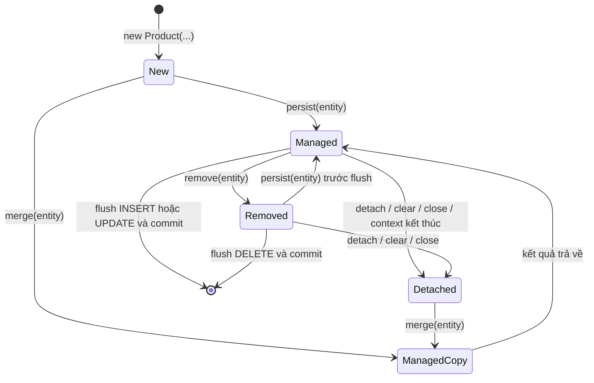
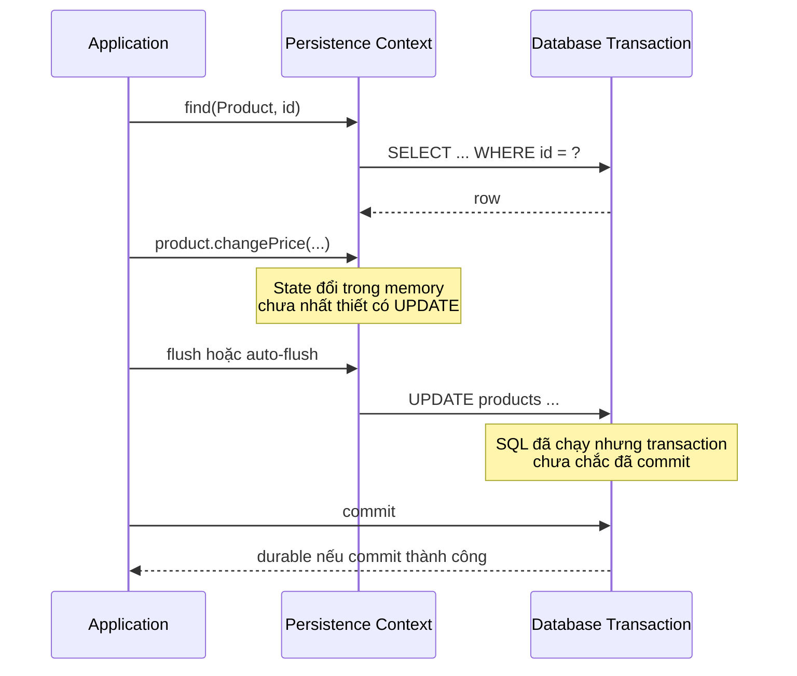

Persistence context là nền tảng để hiểu vì sao sửa một Java object có thể sinh `UPDATE`, vì sao cùng một row thường chỉ có một object đại diện, và vì sao `flush()` không đồng nghĩa với `commit`. Nếu chưa có mô hình đúng về phần này, các API như `persist`, `merge`, `detach` hay `save` rất dễ bị dùng theo thói quen thay vì theo trạng thái thật của entity.

> [!NOTE]
> Bài viết dùng Jakarta Persistence (JPA) làm chuẩn API, Hibernate ORM làm persistence provider, và Spring Data JPA làm lớp repository phía trên. Ví dụ giả định Spring Boot hiện đại với package `jakarta.persistence.*`; tên SQL cụ thể có thể khác theo database dialect và cấu hình naming.

## Mục lục

- [1. Bức tranh tổng thể](#1-bức-tranh-tổng-thể)
  - [Ba lớp thường bị gọi lẫn](#ba-lớp-thường-bị-gọi-lẫn)
  - [Persistence context thực sự giữ gì](#persistence-context-thực-sự-giữ-gì)
- [2. Mô hình ví dụ xuyên suốt](#2-mô-hình-ví-dụ-xuyên-suốt)
  - [Entity Product](#entity-product)
  - [Service dùng EntityManager](#service-dùng-entitymanager)
- [3. Bốn trạng thái của entity](#3-bốn-trạng-thái-của-entity)
  - [New hoặc transient](#new-hoặc-transient)
  - [Managed hoặc persistent](#managed-hoặc-persistent)
  - [Detached](#detached)
  - [Removed](#removed)
  - [Cách hỏi trạng thái hiện tại](#cách-hỏi-trạng-thái-hiện-tại)
  - [Lifecycle callback không phải trạng thái](#lifecycle-callback-không-phải-trạng-thái)
- [4. Identity map và first-level cache](#4-identity-map-và-first-level-cache)
  - [Một định danh một managed instance](#một-định-danh-một-managed-instance)
  - [First-level cache không phải query cache](#first-level-cache-không-phải-query-cache)
  - [Phạm vi sống của persistence context](#phạm-vi-sống-của-persistence-context)
- [5. Các thao tác chuyển trạng thái](#5-các-thao-tác-chuyển-trạng-thái)
  - [persist tạo managed instance](#persist-tạo-managed-instance)
  - [find và getReference đưa entity vào context](#find-và-getreference-đưa-entity-vào-context)
  - [merge sao chép trạng thái](#merge-sao-chép-trạng-thái)
  - [remove lên lịch xóa](#remove-lên-lịch-xóa)
  - [detach clear và close](#detach-clear-và-close)
  - [refresh lấy lại trạng thái từ database](#refresh-lấy-lại-trạng-thái-từ-database)
- [6. Dirty checking](#6-dirty-checking)
  - [Hibernate phát hiện thay đổi như thế nào](#hibernate-phát-hiện-thay-đổi-như-thế-nào)
  - [Dirty checking không áp dụng cho detached entity](#dirty-checking-không-áp-dụng-cho-detached-entity)
  - [Tối ưu dirty checking có chủ đích](#tối-ưu-dirty-checking-có-chủ-đích)
- [7. Flush không phải commit](#7-flush-không-phải-commit)
  - [Luồng write-behind](#luồng-write-behind)
  - [Khi nào flush xảy ra](#khi-nào-flush-xảy-ra)
  - [FlushModeType AUTO và COMMIT](#flushmodetype-auto-và-commit)
  - [Ngoại lệ của chiến lược sinh id](#ngoại-lệ-của-chiến-lược-sinh-id)
  - [Thứ tự SQL không nhất thiết là thứ tự gọi API](#thứ-tự-sql-không-nhất-thiết-là-thứ-tự-gọi-api)
- [8. Persistence context trong Spring](#8-persistence-context-trong-spring)
  - [EntityManager gắn với transaction](#entitymanager-gắn-với-transaction)
  - [Spring Data JPA save làm gì](#spring-data-jpa-save-làm-gì)
  - [Open EntityManager in View](#open-entitymanager-in-view)
- [9. Quan hệ cascade và orphan removal](#9-quan-hệ-cascade-và-orphan-removal)
  - [Cascade truyền thao tác lifecycle](#cascade-truyền-thao-tác-lifecycle)
  - [Hai phía quan hệ vẫn phải đồng bộ](#hai-phía-quan-hệ-vẫn-phải-đồng-bộ)
- [10. Bulk update và dữ liệu stale](#10-bulk-update-và-dữ-liệu-stale)
- [11. Anti-pattern và cách sửa](#11-anti-pattern-và-cách-sửa)
  - [Bỏ qua object trả về từ merge](#bỏ-qua-object-trả-về-từ-merge)
  - [Gọi save cho mọi thay đổi](#gọi-save-cho-mọi-thay-đổi)
  - [Mong detached entity tự cập nhật](#mong-detached-entity-tự-cập-nhật)
  - [Giữ context quá lâu](#giữ-context-quá-lâu)
  - [Flush từng bản ghi trong batch](#flush-từng-bản-ghi-trong-batch)
  - [Dùng clear trước khi flush](#dùng-clear-trước-khi-flush)
  - [Tiếp tục transaction sau lỗi flush](#tiếp-tục-transaction-sau-lỗi-flush)
- [12. Cách kiểm chứng hành vi](#12-cách-kiểm-chứng-hành-vi)
  - [Bật log đúng chỗ](#bật-log-đúng-chỗ)
  - [Integration test cho dirty checking](#integration-test-cho-dirty-checking)
  - [Những điều nên quan sát](#những-điều-nên-quan-sát)
- [13. Cheat sheet](#13-cheat-sheet)
- [14. Checklist trước khi đưa code lên production](#14-checklist-trước-khi-đưa-code-lên-production)
- [15. Đọc tiếp](#15-đọc-tiếp)

---

## 1. Bức tranh tổng thể

### Ba lớp thường bị gọi lẫn

**Jakarta Persistence**, thường vẫn được gọi là JPA, là specification: nó định nghĩa annotation, interface và quy tắc hành vi như `@Entity`, `EntityManager`, `persist()` hay `merge()`. JPA không tự thực thi SQL.

**Hibernate ORM** là một persistence provider, tức implementation thực thi specification đó. Hibernate quản lý snapshot để dirty checking, sinh SQL theo dialect, hỗ trợ proxy, batching và có thêm API riêng như `Session` hoặc `@DynamicUpdate`.

**Spring Data JPA** nằm cao hơn JPA. Nó tạo repository implementation, dẫn xuất query từ tên method và cung cấp `save()`, nhưng cuối cùng vẫn ủy quyền cho `EntityManager` của JPA.

```text
Application service
       │
       ├── Spring Data JPA repository (tiện ích, không phải JPA specification)
       │            │
       └──────── EntityManager (Jakarta Persistence API)
                    │
              Hibernate Session (implementation)
                    │
              JDBC driver → Database
```

Với Hibernate, một `EntityManager` có thể được unwrap thành `Session`:

```java
Session session = entityManager.unwrap(Session.class);
```

Chỉ unwrap khi thật sự cần tính năng riêng của Hibernate. Giữ phần lớn code ở API JPA giúp giảm coupling với provider.

### Persistence context thực sự giữ gì

**Persistence context** là tập hợp các entity instance đang được quản lý. Với mỗi cặp _entity type + persistent identity_ trong một context, chỉ có một managed instance đại diện.

Nó đảm nhiệm ba vai trò chính:

- **Identity map**: cùng định danh trả về cùng Java object trong một context.
- **First-level cache**: lookup theo primary key có thể dùng object đã quản lý thay vì đọc lại row.
- **Unit of Work**: gom các thay đổi trong bộ nhớ, phát hiện entity nào bị sửa, rồi chuyển chúng thành `INSERT`, `UPDATE`, `DELETE` khi flush.

> [!IMPORTANT]
> Persistence context không phải database transaction và cũng không phải second-level cache. Transaction quyết định tính atomic và commit/rollback ở database; context quyết định object nào đang được quản lý và trạng thái nào cần đồng bộ.

## 2. Mô hình ví dụ xuyên suốt

### Entity Product

Ví dụ dùng một entity nhỏ để nhìn rõ lifecycle. `@Version` là cột phiên bản phục vụ optimistic locking; Hibernate tăng giá trị này khi entity được cập nhật.

```java
package com.example.catalog;

import jakarta.persistence.Column;
import jakarta.persistence.Entity;
import jakarta.persistence.GeneratedValue;
import jakarta.persistence.GenerationType;
import jakarta.persistence.Id;
import jakarta.persistence.SequenceGenerator;
import jakarta.persistence.Table;
import jakarta.persistence.Version;

import java.math.BigDecimal;

@Entity
@Table(name = "products")
public class Product {

    @Id
    @GeneratedValue(strategy = GenerationType.SEQUENCE, generator = "product_seq")
    @SequenceGenerator(
        name = "product_seq",
        sequenceName = "product_seq",
        allocationSize = 50
    )
    private Long id;

    @Version
    private long version;

    @Column(nullable = false, length = 200)
    private String name;

    @Column(nullable = false, precision = 19, scale = 2)
    private BigDecimal price;

    protected Product() {
        // Constructor cho persistence provider.
    }

    public Product(String name, BigDecimal price) {
        this.name = name;
        this.price = price;
    }

    public Long getId() {
        return id;
    }

    public BigDecimal getPrice() {
        return price;
    }

    public void rename(String newName) {
        if (newName == null || newName.isBlank()) {
            throw new IllegalArgumentException("Product name must not be blank");
        }
        this.name = newName;
    }

    public void changePrice(BigDecimal newPrice) {
        if (newPrice == null || newPrice.signum() < 0) {
            throw new IllegalArgumentException("Price must be non-negative");
        }
        this.price = newPrice;
    }
}
```

Entity giữ invariant trong method nghiệp vụ thay vì public setter cho mọi field. Cách này không thay đổi cơ chế dirty checking: Hibernate vẫn quan sát persistent state ở thời điểm flush.

### Service dùng EntityManager

Trong Spring Boot, `EntityManager` được inject thường là một shared proxy. Proxy này chuyển lời gọi đến `EntityManager` thực đang gắn với transaction hiện tại.

```java
package com.example.catalog;

import jakarta.persistence.EntityManager;
import jakarta.persistence.EntityNotFoundException;
import org.springframework.stereotype.Service;
import org.springframework.transaction.annotation.Transactional;

import java.math.BigDecimal;

@Service
public class ProductService {

    private final EntityManager entityManager;

    public ProductService(EntityManager entityManager) {
        this.entityManager = entityManager;
    }

    @Transactional
    public Long create(String name, BigDecimal price) {
        Product product = new Product(name, price);
        entityManager.persist(product);
        return product.getId();
    }

    @Transactional
    public void changePrice(Long id, BigDecimal newPrice) {
        Product product = entityManager.find(Product.class, id);
        if (product == null) {
            throw new EntityNotFoundException("Product not found: " + id);
        }

        product.changePrice(newPrice);
        // Không cần entityManager.merge(product) hoặc repository.save(product).
        // product đang managed; dirty checking sẽ xử lý UPDATE.
    }
}
```

## 3. Bốn trạng thái của entity

Jakarta Persistence gọi bốn trạng thái là **new**, **managed**, **detached** và **removed**. Tài liệu Hibernate thường dùng **transient** gần nghĩa với new và **persistent** gần nghĩa với managed.



`ManagedCopy` trong sơ đồ không phải trạng thái thứ năm. Nó nhấn mạnh rằng `merge()` trả về một object managed khác, còn object truyền vào vẫn new hoặc detached.

| Trạng thái | Có persistent identity | Được context quản lý | Sửa field tự sinh `UPDATE` |
|---|---:|---:|---:|
| New / transient | Chưa nhất thiết | Không | Không |
| Managed / persistent | Có | Có | Có, khi flush phát hiện dirty |
| Detached | Có | Không | Không |
| Removed | Có | Có cho đến khi detach/context kết thúc | Đang được lên lịch `DELETE` |

### New hoặc transient

Entity vừa tạo bằng `new` chưa gắn với persistence context:

```java
Product product = new Product("Mechanical Keyboard", new BigDecimal("89.90"));

assert product.getId() == null;
assert !entityManager.contains(product);
```

Object này chỉ là Java object bình thường. Nếu transaction kết thúc mà không gọi `persist()` hoặc không có cascade persist từ entity khác, database không biết nó tồn tại.

### Managed hoặc persistent

Entity trở thành managed sau `persist()`, `find()`, query, hoặc khi nó là object trả về từ `merge()`:

```java
entityManager.persist(product);

assert entityManager.contains(product);
product.changePrice(new BigDecimal("79.90"));
```

Không có API `update()` trong JPA cho managed entity. Thay đổi trực tiếp trên object là đủ; provider phát hiện khác biệt lúc flush.

### Detached

Detached entity từng có persistent identity nhưng không còn thuộc context hiện tại. Điều này xảy ra sau `detach()`, `clear()`, `close()`, hoặc khi transaction-scoped context kết thúc.

```java
Product product = entityManager.find(Product.class, id);
entityManager.detach(product);

assert !entityManager.contains(product);
product.changePrice(new BigDecimal("69.90")); // Chỉ đổi object trong RAM.
```

Detached object vẫn dùng được như dữ liệu thường, nhưng lazy association chưa load có thể không truy cập được nữa. Muốn ghi thay đổi, hãy load managed entity rồi áp dụng dữ liệu đầu vào, hoặc dùng `merge()` và tiếp tục làm việc với object mà `merge()` trả về.

### Removed

`remove()` chuyển một managed entity sang trạng thái removed. `DELETE` thường được hoãn đến flush:

```java
Product product = entityManager.find(Product.class, id);
entityManager.remove(product);

assert !entityManager.contains(product); // JPA định nghĩa contains trả false cho removed.
```

Object chưa biến mất khỏi heap. Nó chỉ được đánh dấu để xóa row. Transaction rollback sẽ làm database không nhận thay đổi đó.

### Cách hỏi trạng thái hiện tại

`EntityManager.contains(entity)` trả về `true` khi object là managed trong chính context đó. Nó không trả lời “row này có tồn tại trong database không?”.

```java
Product first = entityManager.find(Product.class, id);

assert entityManager.contains(first);

entityManager.detach(first);

assert !entityManager.contains(first);
assert first.getId() != null; // Có id không đồng nghĩa với managed.
```

> [!TIP]
> Khi debug một đoạn code “sửa entity nhưng không có SQL”, kiểm tra `entityManager.contains(entity)` trước. Câu hỏi đúng là “object này có đang managed trong context hiện tại không?”, không phải “object này có id không?”.

### Lifecycle callback không phải trạng thái

Jakarta Persistence còn định nghĩa các callback theo sự kiện: `@PrePersist`, `@PostPersist`, `@PreUpdate`, `@PostUpdate`, `@PreRemove`, `@PostRemove` và `@PostLoad`. Chúng là hook chạy quanh lifecycle operation; chúng không tạo thêm trạng thái entity.

```java
@PrePersist
void onCreate() {
    createdAt = Instant.now();
    updatedAt = createdAt;
}

@PreUpdate
void onUpdate() {
    updatedAt = Instant.now();
}
```

`@PreUpdate` gắn với một database update do provider thực hiện, không chạy ngay tại mỗi setter. Thời điểm callback sau operation còn phụ thuộc SQL được thực thi ngay hay bị hoãn đến flush.

Giữ callback nhỏ, đồng bộ và chỉ liên quan state của chính entity. Với code portable, không gọi `EntityManager`, chạy query, sửa relationship hoặc phát external side effect từ callback. Audit phức tạp nên dùng entity listener hoặc cơ chế auditing rõ ràng; gửi message/email nên chạy sau commit hoặc qua outbox.

## 4. Identity map và first-level cache

### Một định danh một managed instance

Trong cùng persistence context, hai lần tìm cùng entity type và id trả về cùng reference:

```java
Product first = entityManager.find(Product.class, id);
Product second = entityManager.find(Product.class, id);

assert first == second;
```

SQL thường chỉ xuất hiện ở lần đầu:

```sql
select
    p.id,
    p.name,
    p.price,
    p.version
from products p
where p.id = ?;
```

Quy tắc này bảo toàn tính nhất quán trong memory. Nếu `first.changePrice(...)`, code đọc `second.getPrice()` thấy ngay giá trị mới vì hai biến trỏ tới cùng object.

Sau `clear()`, lần `find()` tiếp theo tạo một managed instance mới:

```java
Product beforeClear = entityManager.find(Product.class, id);
entityManager.clear();
Product afterClear = entityManager.find(Product.class, id);

assert beforeClear != afterClear;
```

### First-level cache không phải query cache

First-level cache là bắt buộc và gắn với persistence context. Nó đặc biệt hiệu quả cho lookup theo identity. Tuy nhiên, chạy cùng một JPQL hai lần vẫn có thể gửi hai câu `SELECT`; Hibernate dùng kết quả id của query để tái sử dụng managed instances đã có.

```java
List<Product> first = entityManager
    .createQuery("select p from Product p where p.price > :price", Product.class)
    .setParameter("price", new BigDecimal("50"))
    .getResultList();

List<Product> second = entityManager
    .createQuery("select p from Product p where p.price > :price", Product.class)
    .setParameter("price", new BigDecimal("50"))
    .getResultList();
```

Muốn cache kết quả query hoặc chia sẻ entity giữa nhiều context cần cơ chế khác, ví dụ Hibernate second-level cache/query cache. Không nên suy luận rằng persistence context sẽ loại bỏ mọi `SELECT` lặp lại.

### Phạm vi sống của persistence context

Kiểu phổ biến nhất là **transaction-scoped persistence context**: context sống theo transaction. Đây là mô hình nên mặc định dùng trong service Spring.

**Extended persistence context** sống lâu hơn một transaction và giữ entity managed qua nhiều transaction. Jakarta Persistence hỗ trợ nó, nhưng trong web application stateless, nó làm tăng nguy cơ dữ liệu cũ, xung đột đồng thời và giữ quá nhiều object trong memory.

> [!NOTE]
> Nói ngắn gọn: dùng một persistence context cho một transaction nghiệp vụ ngắn. Chỉ chọn extended context khi thật sự thiết kế một conversation nhiều bước và đã xử lý rõ stale data, locking và memory growth.

## 5. Các thao tác chuyển trạng thái

### persist tạo managed instance

`persist(entity)` gắn chính object truyền vào với context. Với entity new, object đó trở thành managed:

```java
Product product = new Product("Trackball", new BigDecimal("49.00"));

entityManager.persist(product);

assert entityManager.contains(product);
```

Với sequence trên PostgreSQL, SQL quan sát được có thể gần như sau:

```sql
select nextval('product_seq');

-- Thường chạy ở flush, không nhất thiết ngay tại persist().
insert into products (name, price, version, id)
values (?, ?, ?, ?);
```

Gọi `persist()` với detached entity là sai semantic và có thể ném `EntityExistsException` ngay, hoặc một `PersistenceException` xuất hiện ở flush/commit tùy provider. Nếu entity đã tồn tại, hãy load bản managed hoặc merge có chủ đích.

### find và getReference đưa entity vào context

`find()` trả entity managed hoặc `null` nếu không có row:

```java
Product product = entityManager.find(Product.class, id);
if (product == null) {
    throw new EntityNotFoundException("Product not found: " + id);
}
```

`getReference()` cho phép provider trả một reference mà chưa cần load đầy đủ state ngay. Hibernate thường dùng proxy hoặc cơ chế lazy tương đương:

```java
Product reference = entityManager.getReference(Product.class, id);
// Hữu ích khi chỉ cần reference để gán quan hệ.
```

Đừng dùng `getReference()` như một cách chắc chắn để kiểm tra row tồn tại. Lỗi `EntityNotFoundException` có thể chỉ xuất hiện khi state thật được truy cập.

### merge sao chép trạng thái

`merge()` là API dễ hiểu sai nhất. Nó **không gắn lại chính object truyền vào**. Nó sao chép state từ object nguồn sang một managed instance đích và trả managed instance đó.

```java
Product detached = loadOutsideCurrentContext();

Product managed = entityManager.merge(detached);

assert managed != detached;
assert entityManager.contains(managed);
assert !entityManager.contains(detached);
```

Hibernate có thể cần đọc row hiện tại trước khi copy state:

```sql
select
    p.id,
    p.name,
    p.price,
    p.version
from products p
where p.id = ?;

-- Sau khi dirty checking/flush:
update products
set name = ?, price = ?, version = ?
where id = ? and version = ?;
```

Sau `merge()`, chỉ tiếp tục thao tác trên object trả về:

```java
Product managed = entityManager.merge(detached);

managed.changePrice(new BigDecimal("39.00"));  // Được theo dõi.
detached.changePrice(new BigDecimal("29.00")); // Không được theo dõi.
```

Với object graph, merge có thể copy nhiều field và lan theo `CascadeType.MERGE`. Dữ liệu detached thiếu field hoặc được map từ request không cẩn thận có thể ghi đè state mới trong database. Với command cập nhật thông thường, cách rõ ràng hơn là load managed entity rồi áp dụng đúng field được phép sửa:

```java
@Transactional
public void rename(Long id, String requestedName) {
    Product managed = entityManager.find(Product.class, id);
    if (managed == null) {
        throw new EntityNotFoundException("Product not found: " + id);
    }
    managed.rename(requestedName);
}
```

> [!WARNING]
> Đừng coi `merge()` là “upsert an toàn”. Nó có semantics copy state, có thể phát sinh `SELECT`, chịu ảnh hưởng cascade và optimistic locking, và object đầu vào vẫn detached.

### remove lên lịch xóa

JPA yêu cầu `remove()` nhận một managed entity:

```java
@Transactional
public void delete(Long id) {
    Product product = entityManager.find(Product.class, id);
    if (product != null) {
        entityManager.remove(product);
    }
}
```

SQL thường xuất hiện khi flush. Có `@Version`, Hibernate dùng version trong điều kiện để phát hiện concurrent modification:

```sql
delete from products
where id = ? and version = ?;
```

Nếu chỉ có detached object, load managed entity trước khi xóa. Cách khác là merge rồi remove object trả về, nhưng thường tốn thêm thao tác và che khuất ý định.

### detach clear và close

- `detach(entity)` loại một entity khỏi context.
- `clear()` detach toàn bộ entity trong context.
- `close()` kết thúc application-managed `EntityManager`; mọi entity còn lại trở thành detached.

```java
Product product = entityManager.find(Product.class, id);
product.changePrice(new BigDecimal("59.00"));

entityManager.flush(); // Đồng bộ thay đổi cần giữ.
entityManager.detach(product);
```

Theo Jakarta Persistence, nếu đã sửa entity và cần semantics portable trước `detach()`, hãy `flush()` trước. Nếu `clear()` trước flush, các thay đổi pending có thể bị mất khỏi context.

Trong Spring, không tự gọi `close()` trên `EntityManager` được inject. Spring quản lý lifecycle của delegate theo transaction/request.

### refresh lấy lại trạng thái từ database

`refresh(entity)` nạp lại state từ database và ghi đè thay đổi chưa flush trên managed entity:

```java
Product product = entityManager.find(Product.class, id);
product.changePrice(new BigDecimal("1.00"));

entityManager.refresh(product);

// price trở về giá trị đang có trong database.
```

`refresh()` hữu ích khi database trigger, stored procedure hoặc process khác vừa thay đổi row và code thực sự cần state mới. Đừng gọi nó mặc định sau mỗi `save`; đó thường là một round trip không cần thiết.

## 6. Dirty checking

**Dirty checking** là cơ chế phát hiện state của managed entity đã khác state ban đầu hay chưa. Nhờ nó, business code sửa object mà không cần viết câu `UPDATE` thủ công.

### Hibernate phát hiện thay đổi như thế nào

Mô hình phổ biến của Hibernate gồm bốn bước:

1. Khi load entity, Hibernate giữ state tham chiếu, thường được gọi là loaded-state snapshot.
2. Code thay đổi persistent field trên managed entity.
3. Khi flush, Hibernate so sánh state hiện tại với state ban đầu, hoặc dùng thông tin theo dõi thay đổi từ bytecode enhancement.
4. Nếu entity dirty, Hibernate đưa `UPDATE` vào action queue và cập nhật version nếu có.

```java
@Transactional
public void applyDiscount(Long id) {
    Product product = entityManager.find(Product.class, id);
    product.changePrice(product.getPrice().multiply(new BigDecimal("0.90")));
}
```

SQL điển hình:

```sql
select p.id, p.name, p.price, p.version
from products p
where p.id = ?;

update products
set name = ?, price = ?, version = ?
where id = ? and version = ?;
```

Hibernate mặc định có thể update mọi cột updatable dù chỉ `price` đổi. `@DynamicUpdate` là extension của Hibernate giúp tạo SQL chỉ chứa cột dirty, nhưng làm tăng số biến thể SQL và có thể giảm khả năng tái sử dụng prepared statement/batching. Chỉ dùng sau khi đo.

### Dirty checking không áp dụng cho detached entity

```java
Product detached;

try (EntityManager local = entityManagerFactory.createEntityManager()) {
    detached = local.find(Product.class, id);
} // local đóng, detached không còn được quản lý.

detached.changePrice(new BigDecimal("19.00"));
// Không có context nào theo dõi thay đổi này; không tự sinh UPDATE.
```

Cách sửa ưu tiên trong request mới là truyền id cùng dữ liệu cần đổi, mở transaction, load managed entity và gọi method nghiệp vụ. Cách này tránh merge cả object graph từ client.

### Tối ưu dirty checking có chủ đích

Với transaction chỉ đọc, `@Transactional(readOnly = true)` cho Spring và provider cơ hội tối ưu. Đây là hint về cách thực thi, không phải cơ chế bảo mật và không thay thế quyền read-only ở database.

```java
@Transactional(readOnly = true)
public ProductView getProduct(Long id) {
    Product product = entityManager.find(Product.class, id);
    return new ProductView(product.getId(), product.getPrice());
}

public record ProductView(Long id, BigDecimal price) {}
```

Với tác vụ xử lý hàng trăm nghìn row, đừng giữ tất cả entity managed. Dùng pagination/stream phù hợp, flush và clear theo chunk, hoặc cân nhắc JDBC/bulk DML nếu không cần lifecycle từng entity.

## 7. Flush không phải commit

**Flush** là đồng bộ state trong persistence context xuống database bằng SQL. **Commit** là kết thúc transaction thành công và làm thay đổi trở nên durable theo bảo đảm của database.

### Luồng write-behind

Persistence context hoạt động như transactional write-behind cache: thay đổi được ghi vào object trước, còn DML được hoãn và gom lại.



Nếu gọi `flush()` rồi transaction rollback, SQL đã gửi vẫn bị rollback:

```java
@Transactional
public void changeThenFail(Long id) {
    Product product = entityManager.find(Product.class, id);
    product.changePrice(new BigDecimal("9.00"));

    entityManager.flush(); // UPDATE chạy và constraint được kiểm tra.
    throw new IllegalStateException("rollback transaction");
}
```

Sau method này, database không giữ mức giá `9.00` nếu exception làm transaction rollback.

### Khi nào flush xảy ra

Các thời điểm quan trọng:

- Khi gọi `entityManager.flush()`.
- Trước commit transaction.
- Trước một số query trong `AUTO` mode để query nhìn thấy thay đổi liên quan đang pending.
- Khi provider buộc phải chạy SQL sớm, ví dụ một số chiến lược sinh id.

Flush chỉ hợp lệ khi có transaction active và context đã join transaction. Gọi ngoài điều kiện đó có thể ném `TransactionRequiredException`.

`flush()` hữu ích để fail fast với unique constraint, foreign key hoặc optimistic lock trước khi chạy bước tiếp theo:

```java
entityManager.persist(product);
entityManager.flush(); // Muốn lỗi database xuất hiện ngay tại đây.

publishInProcessEvent(product.getId());
```

Tuy nhiên, flush không bảo đảm transaction cuối cùng sẽ commit. Với external side effect như gửi email hoặc publish message, hãy dùng transaction synchronization/outbox thay vì coi `flush()` là bằng chứng dữ liệu đã bền vững.

### FlushModeType AUTO và COMMIT

Jakarta Persistence định nghĩa hai mode:

| Mode | Hành vi cần nhớ |
|---|---|
| `AUTO` | Mặc định. Provider phải bảo đảm query trong transaction nhìn thấy các thay đổi có thể ảnh hưởng kết quả; Hibernate thường auto-flush các query space liên quan. |
| `COMMIT` | Flush tại commit; provider vẫn được phép flush sớm. Ảnh hưởng của thay đổi chưa flush lên kết quả query là không được specification bảo đảm. |

Ví dụ `AUTO`:

```java
Product product = entityManager.find(Product.class, id);
product.changePrice(new BigDecimal("109.00"));

long expensiveCount = entityManager.createQuery("""
    select count(p) from Product p where p.price >= :min
    """, Long.class)
    .setParameter("min", new BigDecimal("100"))
    .getSingleResult();
```

Hibernate có thể flush `UPDATE products` trước `SELECT count(...)` vì thay đổi pending ảnh hưởng kết quả query trên `Product`.

> [!WARNING]
> Đừng dùng `COMMIT` như cam kết “không bao giờ flush sớm”. Specification cho phép provider flush trước commit. Nếu logic phụ thuộc chính xác vào thời điểm SQL chạy, hãy thiết kế lại boundary hoặc gọi `flush()` rõ ràng ở điểm cần fail fast.

Hibernate có thêm `ALWAYS` và `MANUAL` trên API `Session`; đó không phải `FlushModeType` portable của JPA. `MANUAL` dễ làm mất update nếu quên flush, nên không dùng như tối ưu mặc định.

### Ngoại lệ của chiến lược sinh id

Với sequence, Hibernate thường có thể lấy id trước rồi hoãn `INSERT` đến flush. Với `GenerationType.IDENTITY`, database chỉ sinh id khi thực thi `INSERT`, nên provider thường phải insert sớm hơn để biết id.

```java
entityManager.persist(product);
Long id = product.getId();
```

Vì vậy không nên viết test khẳng định “`persist()` tuyệt đối không chạy INSERT”. Thời điểm phụ thuộc chiến lược id, transaction và provider.

### Thứ tự SQL không nhất thiết là thứ tự gọi API

Hibernate xếp action vào queue để giữ foreign key đúng và tạo cơ hội batching. Thứ tự `INSERT`, `UPDATE`, collection operation và `DELETE` khi flush không nhất thiết trùng thứ tự code gọi `persist()`/`remove()`.

Khi cần thay một row cũ bằng row mới có cùng unique key trong một transaction, đừng dựa vào thứ tự gọi API để đoán SQL. Có thể cần flush có chủ đích sau delete, nhưng trước hết hãy xem lại domain operation và constraint.

## 8. Persistence context trong Spring

### EntityManager gắn với transaction

`@Transactional` của Spring xác lập transaction boundary. Với JPA, `JpaTransactionManager` lấy hoặc tạo `EntityManager`, bind nó với execution context hiện tại, và flush/commit hoặc rollback khi method kết thúc.

```text
HTTP request
  → Controller
    → @Transactional Service method
      → Spring mở transaction và gắn EntityManager
      → Repository/EntityManager dùng cùng persistence context
      → dirty checking + flush
      → commit hoặc rollback
```

Hai repository được gọi trong cùng transaction thường nhìn thấy cùng managed instance của một entity. Khi rời transaction-scoped context, entity trở thành detached.

> [!IMPORTANT]
> Đặt transaction boundary ở service theo một use case nghiệp vụ. Nhiều repository call rời rạc, mỗi call một transaction, không tạo thành một Unit of Work atomic cho toàn use case.

Xem chi tiết proxy, propagation và rollback trong [Transactions với JPA](./transactions-with-jpa).

### Spring Data JPA save làm gì

`CrudRepository.save(entity)` không phải lifecycle operation của JPA. Spring Data JPA kiểm tra entity có “new” hay không, sau đó gọi:

- `EntityManager.persist(entity)` nếu được xem là new.
- `EntityManager.merge(entity)` nếu được xem là đã tồn tại.

```java
Product saved = productRepository.save(product);
```

Vì nhánh merge có thể trả object khác, luôn dùng `saved` nếu code không chắc entity ở nhánh nào. Với entity đã managed trong transaction, gọi `save()` sau mỗi setter thường là dư thừa; dirty checking đã đủ.

`saveAndFlush()` gọi save rồi ép flush. Nó **không commit** transaction. Chỉ dùng khi bước sau thật sự cần SQL đã chạy hoặc cần bắt lỗi constraint sớm.

Với manually assigned id, cách Spring Data nhận biết “new” cần được thiết kế rõ, thường qua nullable `@Version` hoặc `Persistable.isNew()`. Có id khác `null` không tự chứng minh row đã tồn tại.

Xem thêm abstraction repository và query derivation trong [Spring Data JPA](./spring-data-jpa).

### Open EntityManager in View

**Open EntityManager in View** (OSIV) giữ persistence context mở đến tầng web/view thay vì kết thúc ngay ở service. Nó cho phép lazy loading trong controller hoặc serialization, nhưng kéo dài Unit of Work và che giấu query phát sinh ngoài service.

Rủi ro thường gặp:

- N+1 query xuất hiện lúc JSON serialization.
- Lazy query chạy ngoài service transaction, có thể mượn thêm connection và thực thi theo chế độ auto-commit.
- API response vô tình phụ thuộc entity graph.
- Boundary giữa data access và presentation bị mờ.

Thiết kế dễ kiểm soát hơn là fetch đúng dữ liệu trong service, map sang DTO khi context còn mở, rồi trả DTO. Xem [Fetching Strategies & Proxies](./fetching-strategies-and-proxies) để xử lý lazy loading và N+1 có chủ đích.

## 9. Quan hệ cascade và orphan removal

### Cascade truyền thao tác lifecycle

Cascade quyết định một lifecycle operation có lan từ parent sang associated entity hay không:

| Cascade | Operation được truyền |
|---|---|
| `PERSIST` | `persist()` |
| `MERGE` | `merge()` |
| `REMOVE` | `remove()` |
| `REFRESH` | `refresh()` |
| `DETACH` | `detach()` |
| `ALL` | Tất cả các operation trên |

Cascade là theo operation, không phải “lưu mọi thứ tự động”. Ví dụ parent managed tham chiếu child new nhưng không có cascade persist có thể làm flush thất bại.

`orphanRemoval = true` có semantics khác `CascadeType.REMOVE`: bỏ child khỏi collection/association của parent sẽ lên lịch xóa child đó. Chỉ dùng khi child thực sự thuộc lifecycle sở hữu độc quyền của parent.

### Hai phía quan hệ vẫn phải đồng bộ

Với quan hệ hai chiều, persistence provider ghi foreign key theo **owning side**. Cascade không tự sửa cả hai phía trong object graph.

```java
public void addLine(OrderLine line) {
    lines.add(line);
    line.attachTo(this);
}

public void removeLine(OrderLine line) {
    lines.remove(line);
    line.detachFromOrder();
}
```

Helper method giữ hai phía nhất quán trong memory và giúp dirty checking tạo SQL đúng. Xem mô hình owning side, cascade và orphan removal đầy đủ trong [Relationships Mapping](./relationships-mapping).

## 10. Bulk update và dữ liệu stale

JPQL bulk `update`/`delete` và native DML tác động trực tiếp database. Chúng không đi qua lifecycle từng managed entity, không dùng dirty checking cho từng object, và có thể để first-level cache chứa state cũ.

```java
Product product = entityManager.find(Product.class, id); // price = 100

entityManager.createQuery("""
    update Product p
       set p.price = p.price * 0.9
     where p.id = :id
    """)
    .setParameter("id", id)
    .executeUpdate();

// product trong memory vẫn có thể là 100.
```

Cách xử lý rõ ràng:

```java
entityManager.flush(); // Đẩy thay đổi entity pending trước bulk DML.

int affected = entityManager.createQuery("""
    update Product p
       set p.price = p.price * 0.9
     where p.id = :id
    """)
    .setParameter("id", id)
    .executeUpdate();

entityManager.clear(); // Loại state stale; lần đọc sau load lại.
```

Hoặc gọi `refresh(product)` nếu chỉ cần cập nhật một managed entity. Với Spring Data JPA, `@Modifying(clearAutomatically = true, flushAutomatically = true)` có thể hỗ trợ, nhưng hãy hiểu nó flush/clear toàn context và có thể ảnh hưởng các thay đổi pending khác.

> [!WARNING]
> Bulk DML còn bỏ qua entity callback và cascade theo từng entity. Optimistic version cũng không tự tăng trừ khi câu bulk update chủ động cập nhật version. Chỉ chọn bulk operation khi chấp nhận các semantics đó.

Xem cách viết JPQL và native query trong [JPQL, Criteria & Native Query](./jpql-criteria-and-native-query).

## 11. Anti-pattern và cách sửa

### Bỏ qua object trả về từ merge

```java
// Sai
entityManager.merge(detached);
detached.changePrice(newPrice);

// Đúng
Product managed = entityManager.merge(detached);
managed.changePrice(newPrice);
```

Tốt hơn nữa, với API update, load managed entity bằng id rồi áp dụng command vào nó. Cách này kiểm soát field được phép thay đổi và tránh merge graph không đầy đủ.

### Gọi save cho mọi thay đổi

```java
@Transactional
public void rename(Long id, String name) {
    Product product = productRepository.findById(id).orElseThrow();
    product.rename(name);
    productRepository.save(product); // Dư thừa vì product đã managed.
}
```

Sửa bằng cách bỏ `save()` ở cuối. Giữ `save()` khi tạo entity mới hoặc khi API boundary thật sự nhận một entity chưa biết trạng thái và chấp nhận semantics persist/merge của Spring Data.

### Mong detached entity tự cập nhật

```java
Product product = service.load(id); // Transaction load đã kết thúc.
product.rename("New name");         // Không có UPDATE.
```

Sửa bằng transaction command:

```java
service.rename(id, "New name"); // Service mở transaction và sửa managed entity.
```

### Giữ context quá lâu

Load hàng chục nghìn entity vào một context làm tăng memory, snapshot và chi phí dirty checking. Context cũng trả lại state cũ nếu database bị thay đổi ngoài nó.

Sửa bằng chunk:

```java
for (int i = 0; i < products.size(); i++) {
    process(products.get(i));

    if ((i + 1) % 50 == 0) {
        entityManager.flush();
        entityManager.clear();
    }
}
```

Sau `clear()`, mọi reference cũ đều detached. Không tiếp tục sửa chúng với kỳ vọng Hibernate theo dõi.

### Flush từng bản ghi trong batch

```java
for (Product product : products) {
    entityManager.persist(product);
    entityManager.flush(); // Phá cơ hội gom batch và tăng round trip.
}
```

Sửa bằng flush/clear theo chunk hợp lý và cấu hình JDBC batching. Kiểm tra SQL/metrics thật vì generator id, quan hệ và thứ tự action đều ảnh hưởng batching.

### Dùng clear trước khi flush

```java
Product product = entityManager.find(Product.class, id);
product.rename("Lost change");
entityManager.clear(); // Pending change có thể bị bỏ.
```

Nếu cần giữ thay đổi, gọi `flush()` rồi `clear()`. Nếu mục tiêu là hủy thay đổi local, rollback transaction diễn đạt ý định rõ hơn.

### Tiếp tục transaction sau lỗi flush

Constraint violation hoặc optimistic lock failure ở flush thường khiến transaction bị đánh dấu rollback-only. Bắt exception rồi tiếp tục ghi trong cùng transaction tạo ra hành vi khó đoán và thường kết thúc bằng rollback.

```java
try {
    entityManager.flush();
} catch (RuntimeException ex) {
    // Không tiếp tục sử dụng transaction như thể nó còn lành mạnh.
    throw ex;
}
```

Sửa bằng cách để transaction rollback, rồi retry toàn use case trong transaction mới nếu lỗi thuộc loại có thể retry. Chiến lược retry phải đi cùng idempotency và optimistic/pessimistic locking phù hợp.

## 12. Cách kiểm chứng hành vi

### Bật log đúng chỗ

Trong môi trường local/test, bật SQL và bind parameter có chọn lọc:

```yaml
logging:
  level:
    org.hibernate.SQL: DEBUG
    org.hibernate.orm.jdbc.bind: TRACE
    org.springframework.orm.jpa.JpaTransactionManager: DEBUG
```

`org.hibernate.SQL` cho biết SQL chạy lúc nào. `org.hibernate.orm.jdbc.bind` cho biết giá trị bind trên Hibernate hiện đại. Không bật TRACE chứa dữ liệu nhạy cảm ở production.

### Integration test cho dirty checking

Test nên `flush()` rồi `clear()` trước khi assert. Nếu không, lần đọc kiểm tra có thể chỉ lấy object từ first-level cache và tạo cảm giác update đã xuống database dù SQL chưa chạy.

```java
@DataJpaTest
class ProductLifecycleTest {

    @Autowired
    private EntityManager entityManager;

    @Test
    void managed_entity_is_updated_by_dirty_checking() {
        Product product = new Product("Keyboard", new BigDecimal("100.00"));
        entityManager.persist(product);
        entityManager.flush();
        entityManager.clear();

        Product managed = entityManager.find(Product.class, product.getId());
        managed.changePrice(new BigDecimal("90.00"));

        entityManager.flush();
        entityManager.clear();

        Product reloaded = entityManager.find(Product.class, product.getId());
        assertThat(reloaded.getPrice()).isEqualByComparingTo("90.00");
    }

    @Test
    void changing_detached_entity_does_not_update_database() {
        Product product = new Product("Mouse", new BigDecimal("50.00"));
        entityManager.persist(product);
        entityManager.flush();
        entityManager.detach(product);

        product.changePrice(new BigDecimal("1.00"));
        entityManager.flush();
        entityManager.clear();

        Product reloaded = entityManager.find(Product.class, product.getId());
        assertThat(reloaded.getPrice()).isEqualByComparingTo("50.00");
    }
}
```

`@DataJpaTest` thường rollback sau mỗi test. Điều đó không cản việc kiểm tra flush trong transaction test; nó chỉ không để dữ liệu tồn tại sau test.

### Những điều nên quan sát

Khi chạy test, kiểm tra lần lượt:

1. `persist()` với sequence có lấy id trước nhưng hoãn `INSERT` không.
2. Hai lần `find()` cùng id trong một context có bao nhiêu `SELECT`.
3. Sửa managed entity có sinh `UPDATE` mà không gọi `save()` không.
4. `flush()` có làm lỗi constraint xuất hiện sớm không.
5. `clear()` có khiến lần `find()` sau chạy lại `SELECT` không.
6. Bulk update có làm object đã managed bị stale không.
7. Version có xuất hiện trong `WHERE` của `UPDATE`/`DELETE` không.

> [!TIP]
> SQL log là bằng chứng, không phải trực giác. Khi timing khác dự đoán, kiểm tra transaction boundary, flush mode, id generator và entity có đang managed hay không trước khi kết luận Hibernate “tự chạy SQL ngẫu nhiên”.

## 13. Cheat sheet

| API hoặc sự kiện | Đầu vào | Kết quả trên object | SQL thường xảy ra |
|---|---|---|---|
| `new Entity()` | Không có | New/transient | Không |
| `persist(x)` | New | Chính `x` trở thành managed | `INSERT` tại/before flush; có thể sớm vì id |
| `find(Type, id)` | Type + id | Trả managed entity hoặc `null` | `SELECT` nếu context chưa có |
| `getReference(Type, id)` | Type + id | Trả managed reference | Có thể hoãn `SELECT` |
| `merge(x)` | New hoặc detached | Trả managed copy; `x` không đổi trạng thái | Có thể `SELECT`, sau đó `INSERT`/`UPDATE` |
| `remove(x)` | Managed | `x` thành removed | `DELETE` tại/before flush |
| `detach(x)` | Managed | `x` thành detached | Không tự flush |
| `clear()` | Context | Tất cả entity thành detached | Không tự flush |
| `refresh(x)` | Managed | Ghi đè state local bằng database state | `SELECT` |
| Sửa field | Managed | Entity có thể thành dirty | `UPDATE` khi flush |
| `flush()` | Context đã join transaction | Entity vẫn managed | Gửi DML, chưa commit |
| `commit` | Transaction | Context có thể kết thúc | Flush trước, rồi commit |
| `rollback` | Transaction | Database hủy thay đổi | Entity in-memory không nên tiếp tục dùng như state tin cậy |

Các câu cần nhớ:

1. **Có id không đồng nghĩa với managed.**
2. **Managed entity không cần `save()` để update.**
3. **`merge()` trả managed copy; object đầu vào không được attach lại.**
4. **`flush()` gửi SQL nhưng không commit.**
5. **First-level cache gắn với persistence context, không dùng chung toàn application.**
6. **Bulk DML bỏ qua state đang managed; flush rồi clear/refresh khi cần.**
7. **Context càng dài, memory và nguy cơ stale data càng lớn.**

## 14. Checklist trước khi đưa code lên production

- [ ] Transaction boundary nằm ở service/use case, không rải rác theo từng repository call.
- [ ] Code biết entity đang new, managed hay detached trước khi chọn `persist`/`merge`.
- [ ] Kết quả trả về từ `merge()` hoặc Spring Data `save()` được dùng khi có thể đi qua nhánh merge.
- [ ] Managed entity không bị `save()` lặp lại chỉ vì thói quen.
- [ ] API update load managed entity và chỉ áp dụng field được phép sửa.
- [ ] Có `@Version` cho aggregate có nguy cơ concurrent update.
- [ ] Cascade chỉ đặt theo ownership lifecycle thực tế; không dùng `CascadeType.ALL` mặc định cho mọi quan hệ.
- [ ] Hai phía của bidirectional relationship được cập nhật bằng helper method.
- [ ] Bulk DML có chiến lược `flush` và `clear`/`refresh` rõ ràng.
- [ ] Batch job flush/clear theo chunk, không giữ toàn bộ dataset trong một context.
- [ ] Không dựa vào `flush()` để kích hoạt external side effect như thể transaction đã commit.
- [ ] Integration test dùng `flush()` + `clear()` để xác minh database state thật.
- [ ] SQL log, bind log và transaction log chỉ bật ở mức phù hợp, không làm lộ dữ liệu production.
- [ ] Lazy association được fetch/map sang DTO trong boundary chủ động, không phụ thuộc OSIV ngoài ý muốn.

## 15. Đọc tiếp

- [JPA & Hibernate Overview](./jpa-hibernate-overview) — vị trí của specification, provider và ORM trong ứng dụng.
- [Entity Mapping & Identity](./entity-mapping-and-identity) — mapping id, version và `equals`/`hashCode` qua các trạng thái lifecycle.
- [Transactions với JPA](./transactions-with-jpa) — transaction boundary, rollback, propagation và locking.
- [Fetching Strategies & Proxies](./fetching-strategies-and-proxies) — lazy loading, proxy, N+1 và fetch plan.
- [Hibernate Performance Troubleshooting](./hibernate-performance-troubleshooting) — đọc SQL, batch, cache và đo bottleneck.

Tài liệu chuẩn để tra cứu semantics chi tiết: [Jakarta Persistence specification](https://jakarta.ee/specifications/persistence/) và [Hibernate ORM User Guide](https://docs.jboss.org/hibernate/orm/current/userguide/html_single/Hibernate_User_Guide.html).
