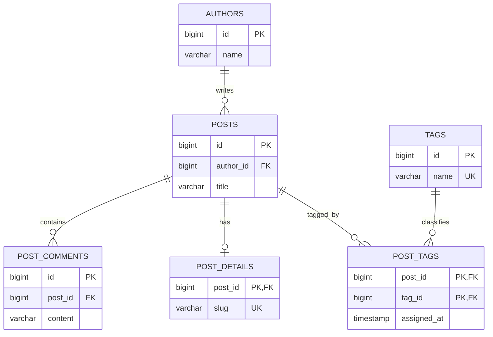
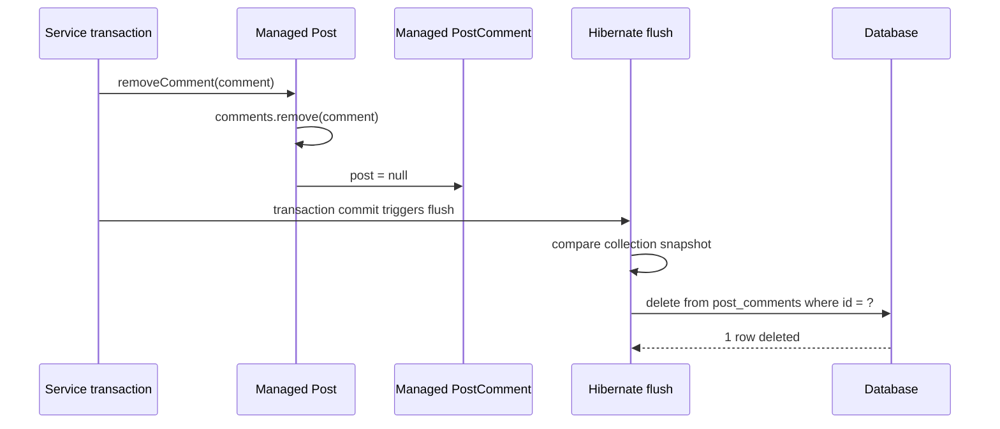

Relationship mapping biến liên kết giữa các object Java thành foreign key hoặc join table trong cơ sở dữ liệu quan hệ. Mapping đúng không chỉ giúp đọc được dữ liệu. Nó còn quyết định bên nào được ghi foreign key, thao tác nào lan truyền sang entity liên quan và một child bị tách khỏi parent có bị xóa hay không.

> [!NOTE]
> Bài viết dùng API `jakarta.persistence.*`, phù hợp với Jakarta Persistence hiện đại và Spring Boot 3+. Ví dụ SQL minh họa theo PostgreSQL; tên sequence, cú pháp lấy ID và thứ tự câu lệnh có thể khác theo dialect, chiến lược sinh khóa và phiên bản Hibernate.

## Mục lục

- [Bức tranh tổng thể](#1-bức-tranh-tổng-thể)
  - [Ba lớp cần phân biệt](#11-ba-lớp-cần-phân-biệt)
  - [Bốn loại quan hệ](#12-bốn-loại-quan-hệ)
- [Mô hình ví dụ và lược đồ](#2-mô-hình-ví-dụ-và-lược-đồ)
- [ManyToOne và OneToMany](#3-manytoone-và-onetomany)
  - [ManyToOne là mapping cốt lõi](#31-manytoone-là-mapping-cốt-lõi)
  - [OneToMany hai chiều](#32-onetomany-hai-chiều)
  - [OneToMany một chiều](#33-onetomany-một-chiều)
- [OneToOne](#4-onetoone)
  - [Foreign key duy nhất](#41-foreign-key-duy-nhất)
  - [Shared primary key với MapsId](#42-shared-primary-key-với-mapsid)
- [ManyToMany và association entity](#5-manytomany-và-association-entity)
  - [ManyToMany trực tiếp](#51-manytomany-trực-tiếp)
  - [Khi nào tách association entity](#52-khi-nào-tách-association-entity)
- [Owning side inverse side và mappedBy](#6-owning-side-inverse-side-và-mappedby)
  - [Quy tắc ownership](#61-quy-tắc-ownership)
  - [Helper method giữ object graph nhất quán](#62-helper-method-giữ-object-graph-nhất-quán)
  - [SQL phụ thuộc vào side được thay đổi](#63-sql-phụ-thuộc-vào-side-được-thay-đổi)
- [Cascade và orphanRemoval](#7-cascade-và-orphanremoval)
  - [Cascade truyền thao tác EntityManager](#71-cascade-truyền-thao-tác-entitymanager)
  - [Orphan removal xóa child rời aggregate](#72-orphan-removal-xóa-child-rời-aggregate)
  - [CascadeType REMOVE khác database cascade](#73-cascadetype-remove-khác-database-cascade)
  - [Chọn cascade theo aggregate boundary](#74-chọn-cascade-theo-aggregate-boundary)
- [Fetch strategy và tác động lên SQL](#8-fetch-strategy-và-tác-động-lên-sql)
  - [Giá trị mặc định của Jakarta Persistence](#81-giá-trị-mặc-định-của-jakarta-persistence)
  - [Mapping không phải query plan](#82-mapping-không-phải-query-plan)
- [Ví dụ Spring Boot hoàn chỉnh](#9-ví-dụ-spring-boot-hoàn-chỉnh)
  - [Entity root và child](#91-entity-root-và-child)
  - [Repository và service](#92-repository-và-service)
  - [SQL Hibernate sinh ra](#93-sql-hibernate-sinh-ra)
- [Kiểm thử mapping](#10-kiểm-thử-mapping)
  - [Integration test với DataJpaTest](#101-integration-test-với-datajpatest)
  - [Quan sát SQL và ràng buộc database](#102-quan-sát-sql-và-ràng-buộc-database)
- [Anti-pattern và cách sửa](#11-anti-pattern-và-cách-sửa)
- [Checklist thiết kế relationship](#12-checklist-thiết-kế-relationship)
- [Cheat sheet](#13-cheat-sheet)
- [Tài liệu liên quan](#14-tài-liệu-liên-quan)

---

## 1. Bức tranh tổng thể

Trong Java, `post.getComments()` trông giống một collection nằm bên trong `Post`. Trong database, `post_comments` mới là bảng chứa từng comment, còn cột `post_id` là foreign key trỏ về `posts.id`. **Foreign key** là ràng buộc đảm bảo giá trị ở bảng con tham chiếu tới một row tồn tại ở bảng cha.

ORM không làm hai mô hình này trở thành một. Nó chỉ duy trì phép ánh xạ giữa object reference và khóa ngoại. Vì vậy, trước khi đặt annotation, hãy trả lời ba câu hỏi:

1. Foreign key hoặc join table nằm ở đâu?
2. Entity nào sở hữu việc cập nhật liên kết đó?
3. Lifecycle của hai entity có thực sự đi cùng nhau không?

### 1.1. Ba lớp cần phân biệt

| Lớp | Vai trò | Ví dụ trong bài |
|---|---|---|
| **Jakarta Persistence** thường được gọi là JPA | Đặc tả chuẩn: định nghĩa annotation, `EntityManager`, cascade và lifecycle | `@OneToMany`, `mappedBy`, `orphanRemoval` |
| **Hibernate ORM** | Persistence provider triển khai đặc tả và tạo SQL | Dirty checking collection rồi phát `DELETE` cho orphan |
| **Spring Data JPA** | Repository abstraction xây trên JPA, giảm code truy cập dữ liệu | `JpaRepository<Post, Long>` và `save(...)` |

`@OneToMany` là API của Jakarta Persistence, không phải annotation riêng của Spring Data JPA. Hibernate đọc metadata đó để quản lý association. Spring Data JPA chỉ gọi `EntityManager.persist()` hoặc `EntityManager.merge()` khi cần lưu root entity; chính JPA provider mới thực thi cascade.

> [!IMPORTANT]
> `repository.save(parent)` không tự động lưu mọi object có thể đi tới từ `parent`. Child chỉ được persist hoặc merge theo graph khi relationship khai báo cascade tương ứng, hoặc khi application lưu child một cách tường minh.

### 1.2. Bốn loại quan hệ

**Cardinality** là số lượng bản ghi ở hai đầu một quan hệ. Jakarta Persistence có bốn annotation chính:

| Quan hệ | Ý nghĩa object model | Mapping relational thường dùng | Fetch mặc định theo JPA |
|---|---|---|---|
| `@ManyToOne` | Nhiều child tham chiếu một parent | Foreign key ở bảng child | `EAGER` |
| `@OneToMany` | Một parent chứa nhiều child | Foreign key ở bảng child hoặc join table | `LAZY` |
| `@OneToOne` | Mỗi bên có tối đa một entity liên quan | Foreign key có `UNIQUE` hoặc shared primary key | `EAGER` |
| `@ManyToMany` | Nhiều entity ở cả hai phía | Join table chứa hai foreign key | `LAZY` |

**To-one** là association trỏ tới một entity, gồm `ManyToOne` và `OneToOne`. **To-many** là association dạng collection, gồm `OneToMany` và `ManyToMany`.

Nói ngắn gọn: cardinality mô tả domain, còn vị trí foreign key quyết định cách mapping.

## 2. Mô hình ví dụ và lược đồ

Ta dùng hệ thống blog nhỏ:

- Một tác giả viết nhiều bài.
- Một bài có nhiều bình luận.
- Một bài có tối đa một bộ metadata chi tiết.
- Một bài được gắn nhiều tag. Khi quan hệ tag cần thêm thời điểm gắn, join row trở thành entity `PostTag`.



Lược đồ nên được bảo vệ bằng constraint thật, không chỉ bằng annotation Java:

```sql
create sequence post_seq start with 1 increment by 50;
create sequence comment_seq start with 1 increment by 50;

create table posts (
    id bigint primary key,
    title varchar(200) not null
);

create table post_comments (
    id bigint primary key,
    post_id bigint not null,
    content varchar(1000) not null,
    constraint fk_comment_post
        foreign key (post_id) references posts(id)
);

create index idx_comment_post_id on post_comments(post_id);
```

`optional = false` và `nullable = false` giúp object mapping thể hiện đúng ý định. Tuy nhiên, `NOT NULL`, `FOREIGN KEY` và `UNIQUE` trong migration mới là hàng rào cuối cùng trước dữ liệu sai. Không nên dựa vào `spring.jpa.hibernate.ddl-auto=update` để quản lý schema production.

## 3. ManyToOne và OneToMany

### 3.1. ManyToOne là mapping cốt lõi

Với `PostComment -> Post`, bảng `post_comments` chứa `post_id`. Vì vậy `PostComment.post` là owning side, tức **phía sở hữu** chịu trách nhiệm ghi foreign key.

```java
@Entity
@Table(name = "post_comments")
public class PostComment {
    @Id
    @GeneratedValue(strategy = GenerationType.SEQUENCE, generator = "comment_seq")
    @SequenceGenerator(name = "comment_seq", sequenceName = "comment_seq", allocationSize = 50)
    private Long id;

    @Column(nullable = false, length = 1000)
    private String content;

    @ManyToOne(fetch = FetchType.LAZY, optional = false)
    @JoinColumn(name = "post_id", nullable = false)
    private Post post;

    protected PostComment() {
    }
}
```

`@JoinColumn(name = "post_id")` mô tả cột foreign key trên bảng của owning side. `optional = false` nói rằng association không được `null` ở object model. `nullable = false` mô tả nullability của cột khi provider sinh DDL.

Ta chủ động ghi `fetch = LAZY` vì mặc định JPA của `ManyToOne` là `EAGER`. `LAZY` là một **hint** theo đặc tả, tức provider được phép tải sớm hơn. Hibernate thường hiện thực to-one lazy bằng proxy hoặc bytecode enhancement, nhưng code nghiệp vụ không nên giả định chỉ annotation là đủ để có đúng số query.

Nếu domain chỉ cần đi từ comment tới post, mapping một chiều `ManyToOne` như trên đã đủ. Không cần thêm `Post.comments` chỉ để có mapping “đối xứng”.

### 3.2. OneToMany hai chiều

Khi cần đi từ `Post` tới comments, thêm inverse side, tức **phía không sở hữu** phản chiếu association do child quản lý:

```java
@OneToMany(
    mappedBy = "post",
    cascade = {CascadeType.PERSIST, CascadeType.MERGE},
    orphanRemoval = true
)
private List<PostComment> comments = new ArrayList<>();
```

`mappedBy = "post"` trỏ tới **tên field Java** `PostComment.post`, không phải tên cột `post_id`. Điều này nói với provider rằng hai field cùng mô tả một relationship. Hibernate không tạo thêm join table cho `Post.comments`.

```text
Post.comments                       PostComment.post
inverse side                       owning side
@OneToMany(mappedBy = "post")      @ManyToOne @JoinColumn("post_id")
        └───────────────────────────────┘
                  cùng một FK
```

Quan hệ này là bidirectional, nghĩa là object graph có thể được điều hướng theo cả hai hướng. Database vẫn chỉ có một foreign key `post_comments.post_id`.

> [!WARNING]
> Bidirectional không có nghĩa Hibernate tự sửa đầu còn lại ngay lập tức. Application chịu trách nhiệm giữ `post.getComments()` và `comment.getPost()` nhất quán trong bộ nhớ.

### 3.3. OneToMany một chiều

Unidirectional `OneToMany` chỉ có collection ở parent:

```java
@OneToMany(cascade = CascadeType.PERSIST)
@JoinColumn(name = "post_id")
private List<PostComment> comments = new ArrayList<>();
```

`@JoinColumn` ở đây yêu cầu mapping một chiều qua foreign key. Nếu bỏ `@JoinColumn`, mapping mặc định của unidirectional `OneToMany` dùng join table.

Mapping này phù hợp khi child thật sự không cần biết parent. Tuy nhiên, với domain parent-child thông thường, `ManyToOne` ở child cộng với `OneToMany(mappedBy = ...)` ở parent thường rõ hơn. Foreign key nằm đúng nơi nó thuộc về, helper method dễ giữ invariant và Hibernate cập nhật association hiệu quả hơn.

Đừng thêm collection chỉ để “đủ cặp”. Nếu use case chỉ truy vấn comments theo `post_id`, một `ManyToOne` cùng repository query có thể đơn giản hơn việc duy trì collection lớn trên `Post`.

## 4. OneToOne

### 4.1. Foreign key duy nhất

`OneToOne` qua foreign key thực chất là một to-one association có constraint `UNIQUE`. Ví dụ `PostDetails` giữ `post_id`:

```java
@Entity
@Table(
    name = "post_details",
    uniqueConstraints = @UniqueConstraint(
        name = "uk_post_details_post",
        columnNames = "post_id"
    )
)
public class PostDetails {
    @Id
    @GeneratedValue(strategy = GenerationType.SEQUENCE)
    private Long id;

    @Column(nullable = false, unique = true)
    private String slug;

    @OneToOne(fetch = FetchType.LAZY, optional = false)
    @JoinColumn(name = "post_id", nullable = false)
    private Post post;
}
```

`PostDetails.post` là owning side vì bảng `post_details` chứa foreign key. Nếu cần điều hướng ngược, `Post` khai báo:

```java
@OneToOne(
    mappedBy = "post",
    fetch = FetchType.LAZY,
    cascade = CascadeType.ALL,
    orphanRemoval = true
)
private PostDetails details;
```

Không có `UNIQUE`, database vẫn cho nhiều row `post_details` cùng trỏ tới một post. Khi đó schema là many-to-one dù Java khai báo one-to-one. Hãy kiểm tra migration, không chỉ nhìn annotation.

### 4.2. Shared primary key với MapsId

Nếu details không có identity độc lập, dùng shared primary key. Cột `post_details.post_id` vừa là primary key vừa là foreign key:

```java
@Entity
@Table(name = "post_details")
public class PostDetails {
    @Id
    private Long id;

    @MapsId
    @OneToOne(fetch = FetchType.LAZY, optional = false)
    @JoinColumn(name = "post_id")
    private Post post;

    @Column(nullable = false, unique = true)
    private String slug;
}
```

`@MapsId` bảo provider lấy ID của `Post` làm ID cho `PostDetails`. Mapping này biểu đạt ownership lifecycle mạnh: details không thể tồn tại nếu không có post.

```sql
create table post_details (
    post_id bigint primary key,
    slug varchar(255) not null unique,
    constraint fk_details_post
        foreign key (post_id) references posts(id)
);
```

> [!TIP]
> Chỉ cần mapping hai chiều khi cả hai hướng đều có use case. Unidirectional `PostDetails -> Post` hoặc `Post -> PostDetails` thường dễ fetch và serialize hơn.

## 5. ManyToMany và association entity

### 5.1. ManyToMany trực tiếp

Many-to-many trực tiếp phù hợp khi join row chỉ có hai foreign key và không có lifecycle hay dữ liệu nghiệp vụ riêng.

```java
// Post là owning side
@ManyToMany(fetch = FetchType.LAZY)
@JoinTable(
    name = "post_tags",
    joinColumns = @JoinColumn(name = "post_id"),
    inverseJoinColumns = @JoinColumn(name = "tag_id"),
    uniqueConstraints = @UniqueConstraint(
        name = "uk_post_tag",
        columnNames = {"post_id", "tag_id"}
    )
)
private Set<Tag> tags = new HashSet<>();
```

```java
// Tag là inverse side
@ManyToMany(mappedBy = "tags", fetch = FetchType.LAZY)
private Set<Post> posts = new HashSet<>();
```

Hai helper method phải cập nhật cả hai collection:

```java
public void addTag(Tag tag) {
    if (tags.add(tag)) {
        tag.getPostsInternal().add(this);
    }
}

public void removeTag(Tag tag) {
    if (tags.remove(tag)) {
        tag.getPostsInternal().remove(this);
    }
}
```

Không dùng `CascadeType.REMOVE` hoặc `CascadeType.ALL` một cách máy móc ở đây. `Tag` thường được nhiều post chia sẻ. Xóa một post chỉ nên xóa row trong `post_tags`, không được xóa tag và làm ảnh hưởng post khác.

> [!NOTE]
> `Set` thể hiện tốt việc một cặp post-tag không được lặp. Dù vậy, database vẫn cần primary key hoặc unique constraint trên `(post_id, tag_id)`. Tính đúng đắn không nên phụ thuộc hoàn toàn vào `equals()` và `hashCode()` của entity.

### 5.2. Khi nào tách association entity

Ngay khi join row có thêm `assigned_at`, `assigned_by`, `position`, `status` hoặc identity riêng, nó không còn là “chi tiết mapping”. Hãy nâng nó thành association entity, tức **entity đại diện chính quan hệ**.

```java
@Embeddable
public class PostTagId implements Serializable {
    private Long postId;
    private Long tagId;

    protected PostTagId() {
    }

    public PostTagId(Long postId, Long tagId) {
        this.postId = postId;
        this.tagId = tagId;
    }

    @Override
    public boolean equals(Object other) {
        if (this == other) {
            return true;
        }
        if (!(other instanceof PostTagId that)) {
            return false;
        }
        return Objects.equals(postId, that.postId)
            && Objects.equals(tagId, that.tagId);
    }

    @Override
    public int hashCode() {
        return Objects.hash(postId, tagId);
    }
}
```

Composite key phải `Serializable` và có `equals()` cùng `hashCode()` theo giá trị khóa. Class thường có no-arg constructor như trên hoạt động portable hơn qua các phiên bản Jakarta Persistence và Hibernate so với dựa vào hỗ trợ record của một provider cụ thể.

```java
@Entity
@Table(name = "post_tags")
public class PostTag {
    @EmbeddedId
    private PostTagId id;

    @MapsId("postId")
    @ManyToOne(fetch = FetchType.LAZY, optional = false)
    @JoinColumn(name = "post_id", nullable = false)
    private Post post;

    @MapsId("tagId")
    @ManyToOne(fetch = FetchType.LAZY, optional = false)
    @JoinColumn(name = "tag_id", nullable = false)
    private Tag tag;

    @Column(name = "assigned_at", nullable = false)
    private Instant assignedAt;

    protected PostTag() {
    }
}
```

Khi đó model trở thành hai quan hệ one-to-many:

```text
Post 1 ─── * PostTag * ─── 1 Tag
                 │
                 └── assignedAt, assignedBy, position, ...
```

Association entity dễ mở rộng, dễ query và cho phép đặt constraint trực tiếp. Đây thường là lựa chọn bền vững hơn `@ManyToMany` trong domain có nghiệp vụ thật.

## 6. Owning side inverse side và mappedBy

### 6.1. Quy tắc ownership

**Owning side** quyết định thay đổi relationship nào được đồng bộ xuống database. **Inverse side** chỉ là ảnh chiếu trong object model và dùng `mappedBy` để chỉ về owning side.

| Relationship hai chiều | Owning side | Inverse side |
|---|---|---|
| `OneToMany` và `ManyToOne` | Bắt buộc là phía `ManyToOne` | `OneToMany(mappedBy = "...")` |
| `OneToOne` | Phía chứa foreign key | `OneToOne(mappedBy = "...")` |
| `ManyToMany` | Một bên do thiết kế chọn, chứa `@JoinTable` | Bên còn lại dùng `mappedBy` |

`mappedBy` luôn nhận tên attribute Java ở owning side:

```java
// Đúng: field bên PostComment có tên là post
@OneToMany(mappedBy = "post")
private List<PostComment> comments;

// Sai: post_id là tên cột SQL, không phải field Java
@OneToMany(mappedBy = "post_id")
private List<PostComment> comments;
```

Nếu cả hai phía đều khai báo `@JoinColumn` hoặc `@JoinTable` mà không có `mappedBy`, provider hiểu đó là hai relationship độc lập. Hậu quả thường là join table thừa, foreign key thừa hoặc schema validation thất bại.

### 6.2. Helper method giữ object graph nhất quán

Helper method gom invariant về một chỗ. **Invariant** là điều kiện luôn phải đúng trong domain; ở đây, comment nằm trong `post.comments` thì `comment.post` phải trỏ về đúng post đó.

```java
public class Post {
    private List<PostComment> comments = new ArrayList<>();

    public void addComment(PostComment comment) {
        Objects.requireNonNull(comment, "comment must not be null");
        comments.add(comment);
        comment.attachTo(this);
    }

    public void removeComment(PostComment comment) {
        if (comments.remove(comment)) {
            comment.detach();
        }
    }

    public List<PostComment> getComments() {
        return Collections.unmodifiableList(comments);
    }
}
```

```java
public class PostComment {
    void attachTo(Post post) {
        this.post = Objects.requireNonNull(post);
    }

    void detach() {
        this.post = null;
    }
}
```

Không expose collection mutable nếu mọi thay đổi phải đi qua invariant. Nếu framework hoặc serializer cần getter, trả về unmodifiable view hoặc tách entity khỏi DTO API.

### 6.3. SQL phụ thuộc vào side được thay đổi

Với `Post.comments` là inverse side và `PostComment.post` là owning side:

```java
Post post = entityManager.find(Post.class, postId);
PostComment comment = new PostComment("Hay lắm");

// Sai: chỉ sửa inverse side
post.getCommentsInternal().add(comment);
entityManager.persist(comment);
```

`comment.post` vẫn là `null`. Với `post_id NOT NULL`, flush sẽ lỗi. Nếu cột cho phép null, Hibernate có thể insert row không gắn post vì owning side không thay đổi.

Cách đúng là dùng helper:

```java
post.addComment(comment); // sửa cả inverse side và owning side
```

Khi flush, provider đọc `comment.post` để bind `post_id`:

```sql
insert into post_comments (content, post_id, id)
values (?, ?, ?);
```

> [!IMPORTANT]
> Ownership là khái niệm của mapping, không đồng nghĩa với ownership nghiệp vụ. `PostComment` sở hữu foreign key về mặt JPA, nhưng `Post` vẫn có thể là aggregate root về mặt domain.

## 7. Cascade và orphanRemoval

### 7.1. Cascade truyền thao tác EntityManager

**Cascade** là cơ chế truyền một thao tác lifecycle từ source entity sang target entity qua relationship. Nó không có nghĩa “mọi thay đổi tự động lưu”, cũng không phải database `ON DELETE CASCADE`.

| Cascade type | Khi thao tác trên parent | Tác động sang child |
|---|---|---|
| `PERSIST` | `entityManager.persist(parent)` | Persist child mới |
| `MERGE` | `entityManager.merge(parent)` | Merge state của child |
| `REMOVE` | `entityManager.remove(parent)` | Đánh dấu child để xóa |
| `REFRESH` | `entityManager.refresh(parent)` | Nạp lại state child từ database |
| `DETACH` | `entityManager.detach(parent)` | Đưa child ra khỏi persistence context |
| `ALL` | Viết tắt | Gồm năm loại trên |

Mặc định không có cascade nào. Ví dụ này cho phép tạo post cùng comments mới:

```java
@OneToMany(
    mappedBy = "post",
    cascade = {CascadeType.PERSIST, CascadeType.MERGE},
    orphanRemoval = true
)
private List<PostComment> comments = new ArrayList<>();
```

```java
Post post = new Post("Mapping relationships");
post.addComment(new PostComment("Ví dụ rõ ràng"));

entityManager.persist(post); // PERSIST lan sang comment
```

Nếu thiếu `PERSIST` và không persist comment riêng, flush graph có child mới chưa được quản lý sẽ thất bại. Tên exception cụ thể có thể khác theo provider và thời điểm phát hiện.

`merge()` trả về một managed copy; object truyền vào không tự trở thành managed. Với Spring Data JPA, `save()` có thể gọi `persist()` hoặc `merge()` tùy chiến lược nhận diện entity mới. Vì vậy, khi `save()` một detached graph, hãy tiếp tục dùng instance được trả về hoặc tốt hơn là load managed aggregate trong transaction rồi thay đổi nó.

### 7.2. Orphan removal xóa child rời aggregate

`orphanRemoval = true` áp dụng cho `OneToOne` và `OneToMany`. Khi một child được bỏ khỏi relationship của managed parent, provider sẽ áp dụng remove cho child ở lúc flush. **Orphan** là child không còn được parent riêng sở hữu tham chiếu tới.

```java
@Transactional
public void removeComment(long postId, long commentId) {
    Post post = postRepository.findWithCommentsById(postId).orElseThrow();
    PostComment comment = post.getComments().stream()
        .filter(it -> it.getId().equals(commentId))
        .findFirst()
        .orElseThrow();

    post.removeComment(comment);
    // Không cần gọi commentRepository.delete(comment)
}
```



Phân biệt hai tình huống:

| Thao tác | `cascade = REMOVE` | `orphanRemoval = true` |
|---|---:|---:|
| Xóa parent | Xóa target theo cascade | Remove cũng lan sang target theo semantics của orphan removal |
| Chỉ bỏ child khỏi collection hoặc set one-to-one thành `null` | Không tự xóa child | Xóa child ở flush |

Theo đặc tả, orphan removal dành cho child được parent sở hữu riêng. Không nên bỏ child khỏi một parent rồi gắn ngay vào parent khác và dựa vào thứ tự SQL không được bảo đảm. Nếu child cần được “chuyển chủ” thường xuyên, nó có lifecycle độc lập; hãy bỏ `orphanRemoval` và cập nhật owning side trực tiếp.

Semantics portable của orphan removal cũng không áp dụng giống vậy cho child đang new, detached hoặc đã removed. Nói ngắn gọn: dùng nó trên managed aggregate, bên trong một transaction.

### 7.3. CascadeType REMOVE khác database cascade

Hai cơ chế chạy ở hai tầng khác nhau:

| Cơ chế | Ai thực thi | Entity callback | Persistence context biết từng child | Trường hợp phù hợp |
|---|---|---|---|---|
| JPA `CascadeType.REMOVE` | Provider phát SQL | Có thể chạy `@PreRemove` và `@PostRemove` | Có | Aggregate nhỏ, cần lifecycle ở entity |
| Foreign key `ON DELETE CASCADE` | Database | Không chạy callback JPA cho row bị DB xóa | Không tự đồng bộ từng entity đã load | Xóa số lượng child lớn, bảo vệ toàn vẹn ở DB |

Jakarta Persistence chỉ đảm bảo tính portable của `cascade = REMOVE` cho `OneToOne` và `OneToMany`. Đặt nó lên `ManyToMany` hoặc `ManyToOne` có thể xóa entity được chia sẻ và không portable.

Hibernate có extension riêng để phối hợp database cascade, nhưng đó không còn là JPA thuần. Nếu dùng native SQL hoặc bulk delete, persistence context có thể giữ object cũ. Hãy clear context hoặc thiết kế transaction để không tiếp tục dùng graph đã stale.

### 7.4. Chọn cascade theo aggregate boundary

**Aggregate** là cụm object được thay đổi như một đơn vị nhất quán. **Aggregate root** là entity duy nhất mà code bên ngoài dùng để thay đổi cụm đó.

| Relationship | Lifecycle thường gặp | Cascade gợi ý |
|---|---|---|
| `Post -> PostComment` | Comment chỉ tồn tại trong post | `PERSIST`, `MERGE`, `orphanRemoval = true`; có thể dùng `ALL` nếu mọi lifecycle thật sự cùng nhau |
| `Post -> PostDetails` | Details phụ thuộc hoàn toàn vào post | `ALL`, `orphanRemoval = true` thường hợp lý |
| `Post -> Author` | Author tồn tại độc lập và được chia sẻ | Thường không cascade |
| `Post -> Tag` | Tag được nhiều post chia sẻ | Không `REMOVE`; persist tag tường minh |
| `Post -> PostTag` | Join entity thuộc post | Cascade và orphan removal có thể hợp lý từ `Post` tới `PostTag` |

Đừng bắt đầu bằng `CascadeType.ALL`. Bắt đầu từ lifecycle nghiệp vụ, sau đó chỉ bật những operation cần truyền.

## 8. Fetch strategy và tác động lên SQL

### 8.1. Giá trị mặc định của Jakarta Persistence

| Annotation | Mặc định | Ý nghĩa chuẩn |
|---|---|---|
| `ManyToOne` | `EAGER` | Provider phải bảo đảm association đã được fetch |
| `OneToOne` | `EAGER` | Provider phải bảo đảm association đã được fetch |
| `OneToMany` | `LAZY` | Hint cho provider trì hoãn tải collection |
| `ManyToMany` | `LAZY` | Hint cho provider trì hoãn tải collection |

`EAGER` không có nghĩa chắc chắn dùng một `JOIN`. Hibernate có thể dùng query phụ, từ đó tạo N+1. `LAZY` cũng không phải lời hứa tuyệt đối của đặc tả.

Một baseline thực tế là khai báo `LAZY` rõ ràng cho association, đặc biệt là to-one, rồi fetch theo từng use case. Tuy nhiên, phải đo SQL trên provider đang dùng và không truy cập lazy association sau khi persistence context đã đóng.

### 8.2. Mapping không phải query plan

Mapping trả lời “các entity liên hệ thế nào”. Query trả lời “use case này cần tải graph nào”. Đừng đổi mọi association sang `EAGER` để sửa `LazyInitializationException`; cách đó thường chuyển bug thành tải thừa hoặc N+1.

Repository có thể fetch đúng graph cho một use case:

```java
@Query("""
    select distinct p
    from Post p
    left join fetch p.comments
    where p.id = :id
    """)
Optional<Post> findWithCommentsById(long id);
```

Với màn hình chỉ cần vài cột, DTO projection có thể tốt hơn việc load entity graph. Với nhiều collection, cần cân nhắc cartesian product và pagination. Xem bài [Fetching Strategies and Proxies](./fetching-strategies-and-proxies) để đi sâu vào fetch join, entity graph, batch fetching, N+1 và proxy.

## 9. Ví dụ Spring Boot hoàn chỉnh

Phần này ghép mapping parent-child thành ví dụ tối thiểu có thể chạy trong ứng dụng Spring Boot dùng `spring-boot-starter-data-jpa`.

### 9.1. Entity root và child

```java
import jakarta.persistence.CascadeType;
import jakarta.persistence.Column;
import jakarta.persistence.Entity;
import jakarta.persistence.FetchType;
import jakarta.persistence.GeneratedValue;
import jakarta.persistence.GenerationType;
import jakarta.persistence.Id;
import jakarta.persistence.JoinColumn;
import jakarta.persistence.ManyToOne;
import jakarta.persistence.OneToMany;
import jakarta.persistence.SequenceGenerator;
import jakarta.persistence.Table;

import java.util.ArrayList;
import java.util.Collections;
import java.util.List;
import java.util.Objects;

@Entity
@Table(name = "posts")
public class Post {
    @Id
    @GeneratedValue(strategy = GenerationType.SEQUENCE, generator = "post_seq")
    @SequenceGenerator(name = "post_seq", sequenceName = "post_seq", allocationSize = 50)
    private Long id;

    @Column(nullable = false, length = 200)
    private String title;

    @OneToMany(
        mappedBy = "post",
        cascade = {CascadeType.PERSIST, CascadeType.MERGE},
        orphanRemoval = true
    )
    private List<PostComment> comments = new ArrayList<>();

    protected Post() {
    }

    public Post(String title) {
        this.title = Objects.requireNonNull(title);
    }

    public void addComment(PostComment comment) {
        Objects.requireNonNull(comment);
        comments.add(comment);
        comment.attachTo(this);
    }

    public void removeComment(PostComment comment) {
        if (comments.remove(comment)) {
            comment.detach();
        }
    }

    public Long getId() {
        return id;
    }

    public String getTitle() {
        return title;
    }

    public List<PostComment> getComments() {
        return Collections.unmodifiableList(comments);
    }
}
```

```java
import jakarta.persistence.Column;
import jakarta.persistence.Entity;
import jakarta.persistence.FetchType;
import jakarta.persistence.GeneratedValue;
import jakarta.persistence.GenerationType;
import jakarta.persistence.Id;
import jakarta.persistence.JoinColumn;
import jakarta.persistence.ManyToOne;
import jakarta.persistence.SequenceGenerator;
import jakarta.persistence.Table;

import java.util.Objects;

@Entity
@Table(name = "post_comments")
public class PostComment {
    @Id
    @GeneratedValue(strategy = GenerationType.SEQUENCE, generator = "comment_seq")
    @SequenceGenerator(name = "comment_seq", sequenceName = "comment_seq", allocationSize = 50)
    private Long id;

    @Column(nullable = false, length = 1000)
    private String content;

    @ManyToOne(fetch = FetchType.LAZY, optional = false)
    @JoinColumn(name = "post_id", nullable = false)
    private Post post;

    protected PostComment() {
    }

    public PostComment(String content) {
        this.content = Objects.requireNonNull(content);
    }

    void attachTo(Post post) {
        this.post = Objects.requireNonNull(post);
    }

    void detach() {
        this.post = null;
    }

    public Long getId() {
        return id;
    }

    public String getContent() {
        return content;
    }

    public Post getPost() {
        return post;
    }
}
```

Entity có no-arg constructor `protected` để provider khởi tạo. Không dùng Lombok `@Data`: generated `toString()`, `equals()` và `hashCode()` dễ đi xuyên association, kích hoạt lazy load, tạo recursion hoặc làm hỏng collection khi ID thay đổi.

### 9.2. Repository và service

```java
import org.springframework.data.jpa.repository.JpaRepository;
import org.springframework.data.jpa.repository.Query;
import org.springframework.data.repository.query.Param;

import java.util.Optional;

public interface PostRepository extends JpaRepository<Post, Long> {
    @Query("""
        select distinct p
        from Post p
        left join fetch p.comments
        where p.id = :id
        """)
    Optional<Post> findWithCommentsById(@Param("id") long id);
}
```

```java
import org.springframework.stereotype.Service;
import org.springframework.transaction.annotation.Transactional;

@Service
public class PostService {
    private final PostRepository postRepository;

    public PostService(PostRepository postRepository) {
        this.postRepository = postRepository;
    }

    @Transactional
    public long createPost(String title, String firstComment) {
        Post post = new Post(title);
        post.addComment(new PostComment(firstComment));

        Post saved = postRepository.save(post);
        return saved.getId();
    }

    @Transactional
    public void removeComment(long postId, long commentId) {
        Post post = postRepository.findWithCommentsById(postId)
            .orElseThrow(() -> new IllegalArgumentException("Post not found"));

        PostComment comment = post.getComments().stream()
            .filter(it -> it.getId().equals(commentId))
            .findFirst()
            .orElseThrow(() -> new IllegalArgumentException("Comment not found"));

        post.removeComment(comment);
        // post đang managed; dirty checking và orphanRemoval xử lý lúc flush.
        // Không cần gọi save(post) lần nữa.
    }
}
```

Spring Data JPA triển khai `save()` bằng `persist()` cho entity mới hoặc `merge()` cho entity được xem là đã tồn tại. Trong `removeComment()`, query trả về managed entity trong transaction. Hibernate dirty-check object graph ở flush, nên gọi `save()` lần nữa là dư thừa.

### 9.3. SQL Hibernate sinh ra

Khi tạo post cùng một comment, SQL đại diện là:

```sql
select nextval('post_seq');
select nextval('comment_seq');

insert into posts (title, id)
values (?, ?);

insert into post_comments (content, post_id, id)
values (?, ?, ?);
```

`PERSIST` cascade làm comment trở thành managed. Owning side `PostComment.post` cung cấp giá trị `post_id`.

Khi load post bằng fetch join rồi gọi `removeComment()`:

```sql
select distinct
       p.id, p.title,
       c.post_id, c.id, c.content
from posts p
left join post_comments c on p.id = c.post_id
where p.id = ?;

delete from post_comments
where id = ?;
```

`orphanRemoval = true` biến thao tác bỏ khỏi collection thành `DELETE`, không phải `UPDATE post_id = NULL`. Hibernate có thể sắp xếp hoặc batch statement khác đi. Hãy xem SQL thực tế thay vì phụ thuộc vào thứ tự minh họa.

## 10. Kiểm thử mapping

### 10.1. Integration test với DataJpaTest

Unit test helper method chỉ chứng minh object graph nhất quán. Mapping cần integration test vì ownership, cascade và orphan removal chỉ bộc lộ đầy đủ khi flush xuống database.

```java
import jakarta.persistence.EntityManager;
import org.junit.jupiter.api.Test;
import org.springframework.beans.factory.annotation.Autowired;
import org.springframework.boot.test.autoconfigure.orm.jpa.DataJpaTest;

import static org.assertj.core.api.Assertions.assertThat;

@DataJpaTest
class RelationshipMappingTest {
    @Autowired
    private PostRepository postRepository;

    @Autowired
    private EntityManager entityManager;

    @Test
    void persistCascadesToNewComment() {
        Post post = new Post("JPA relationships");
        post.addComment(new PostComment("First"));

        Post saved = postRepository.saveAndFlush(post);
        Long postId = saved.getId();

        entityManager.clear();

        Post reloaded = postRepository.findWithCommentsById(postId).orElseThrow();
        assertThat(reloaded.getComments())
            .extracting(PostComment::getContent)
            .containsExactly("First");
    }

    @Test
    void removingFromCollectionDeletesOrphan() {
        Post post = new Post("JPA relationships");
        PostComment comment = new PostComment("Will be removed");
        post.addComment(comment);
        postRepository.saveAndFlush(post);
        Long postId = post.getId();
        Long commentId = comment.getId();

        entityManager.clear();

        Post managed = postRepository.findWithCommentsById(postId).orElseThrow();
        managed.removeComment(managed.getComments().getFirst());
        postRepository.flush();
        entityManager.clear();

        assertThat(entityManager.find(PostComment.class, commentId)).isNull();
    }
}
```

`flush()` ép provider đồng bộ để lỗi constraint hoặc mapping xuất hiện ngay trong test. `clear()` loại entity khỏi first-level cache, bảo đảm assertion đọc lại database thay vì nhìn object cũ trong persistence context. `List.getFirst()` yêu cầu Java 21; với Java 17, dùng `get(0)`.

Nếu production chạy PostgreSQL, test mapping quan trọng nên dùng PostgreSQL qua Testcontainers thay vì chỉ H2. Dialect, constraint, sequence và locking có khác biệt thật giữa các database.

### 10.2. Quan sát SQL và ràng buộc database

Cấu hình hữu ích khi phát triển với Hibernate 6:

```yaml
logging:
  level:
    org.hibernate.SQL: DEBUG
    org.hibernate.orm.jdbc.bind: TRACE

spring:
  jpa:
    properties:
      hibernate:
        format_sql: true
```

Không bật bind logging lâu dài ở production vì parameter có thể chứa dữ liệu nhạy cảm và log rất lớn.

Checklist xác minh bằng SQL:

- Persist parent có tạo đúng child và bind đúng foreign key không?
- Thêm hoặc bỏ association phát `INSERT`, `UPDATE`, `DELETE` nào?
- Xóa parent có xóa nhầm shared entity không?
- Đọc một danh sách parent tạo bao nhiêu query?
- Foreign key có `NOT NULL`, `UNIQUE` và index phù hợp không?
- Test có `flush()` và `clear()` trước khi assert database không?

## 11. Anti-pattern và cách sửa

| Anti-pattern | Hậu quả | Cách sửa |
|---|---|---|
| Chỉ cập nhật `parent.children` ở inverse side | Foreign key không đổi hoặc flush lỗi `NOT NULL` | Dùng helper cập nhật cả hai phía; owning side là nguồn cho SQL |
| Dùng `mappedBy = "child_id"` | Provider không tìm thấy attribute hoặc tạo mapping sai | Dùng tên field Java ở owning side |
| Đặt `CascadeType.ALL` trên mọi association | Xóa lan sang author, tag hoặc entity dùng chung | Chọn cascade theo aggregate boundary; tránh `REMOVE` trên shared association |
| Dùng `@ManyToMany` dù join table có dữ liệu riêng | Không có nơi tự nhiên để đặt metadata, audit và lifecycle | Tạo association entity với hai `ManyToOne` |
| Đổi mọi association sang `EAGER` để tránh lazy exception | Tải thừa, N+1 và graph khó dự đoán | Giữ mapping lazy có chủ đích; fetch join, entity graph hoặc DTO theo use case |
| Expose entity hai chiều trực tiếp qua JSON | Recursion, lazy loading ngoài ý muốn và API gắn chặt schema | Map entity sang DTO; không dùng entity làm response contract |
| Dùng Lombok `@Data` trên entity | `equals`, `hashCode`, `toString` đi qua collection hoặc proxy | Viết identity method có chủ đích; loại association khỏi các method này |
| Thay cả collection bằng instance mới khi có orphan removal | Provider khó theo dõi wrapper collection; có thể báo collection không còn được tham chiếu | Giữ collection đã được quản lý và thay đổi qua `add` hoặc `remove` |
| Chỉ đặt `nullable = false` trong annotation | Migration thật vẫn có thể cho `NULL` | Thêm `NOT NULL` và foreign key trong schema migration |
| Gọi `save()` sau mọi thay đổi managed entity | Che mờ lifecycle, có thể dẫn tới merge graph không cần thiết | Load và sửa entity trong `@Transactional`; để dirty checking flush |
| Xóa child số lượng lớn bằng cách load toàn bộ collection | Tốn RAM và phát nhiều statement | Dùng bulk SQL hoặc DB cascade có chủ đích, rồi clear persistence context |

> [!WARNING]
> Bulk JPQL `delete` và native SQL bỏ qua cascade, orphan removal và entity callback của từng row. Chúng cũng không tự sửa object đã nằm trong persistence context. Chỉ dùng khi đã hiểu và xử lý việc đồng bộ context.

## 12. Checklist thiết kế relationship

Trước khi merge một mapping mới, kiểm tra theo thứ tự sau:

- [ ] Cardinality trong domain đã rõ: one-to-one, one-to-many hay many-to-many?
- [ ] Foreign key hoặc join table nằm ở đâu trong schema?
- [ ] Owning side đúng với vị trí foreign key chưa?
- [ ] `mappedBy` dùng tên attribute Java, không dùng tên cột?
- [ ] Có thực sự cần navigation hai chiều không?
- [ ] Helper method có giữ cả hai đầu association nhất quán không?
- [ ] Collection có được khởi tạo và không bị expose để sửa tùy ý không?
- [ ] Cascade được chọn theo lifecycle, không theo sự tiện tay?
- [ ] Child có thuộc riêng parent để dùng `orphanRemoval` không?
- [ ] `CascadeType.REMOVE` có thể chạm vào entity dùng chung không?
- [ ] `optional`, `nullable`, `UNIQUE`, foreign key và index có đồng nhất không?
- [ ] Fetch plan đã được thiết kế theo query thay vì chuyển hết sang `EAGER` chưa?
- [ ] Entity có tránh `@Data`, recursive `toString()` và association trong `hashCode()` không?
- [ ] Integration test có gọi `flush()` và `clear()` không?
- [ ] SQL insert, update, delete và số query đã được quan sát trên database gần production chưa?

## 13. Cheat sheet

```text
Foreign key ở child
  child:  @ManyToOne @JoinColumn("parent_id")       ← owning side
  parent: @OneToMany(mappedBy = "parent")          ← inverse side

One-to-one
  owning side = phía chứa foreign key
  database phải có UNIQUE, hoặc dùng @MapsId cho shared primary key

Many-to-many thuần
  owning side: @ManyToMany + @JoinTable
  inverse side: @ManyToMany(mappedBy = "...")
  không cascade REMOVE sang entity dùng chung

Join table có thêm dữ liệu
  đổi thành association entity
  Post 1 -- * PostTag * -- 1 Tag

Cascade
  truyền EntityManager operation qua relationship
  mặc định = không cascade
  ALL chỉ dùng khi lifecycle thật sự trùng nhau

orphanRemoval
  chỉ cho OneToOne và OneToMany
  bỏ managed child khỏi relationship → DELETE lúc flush
  phù hợp với child thuộc riêng aggregate

Spring Data JPA
  save(new)      → thường gọi persist
  save(existing) → thường gọi merge
  managed entity trong transaction → sửa trực tiếp, không cần save lại

Fetch
  ToOne mặc định EAGER; ToMany mặc định LAZY
  EAGER không bảo đảm JOIN; LAZY là hint theo JPA
  thiết kế fetch theo từng query và luôn kiểm tra SQL
```

## 14. Tài liệu liên quan

- [Tổng quan JPA và Hibernate](./jpa-hibernate-overview) — phân biệt specification, provider và repository abstraction.
- [Entity Mapping and Identity](./entity-mapping-and-identity) — khóa chính, natural key, composite key và `equals/hashCode` cho entity.
- [Persistence Context and Entity Lifecycle](./persistence-context-and-entity-lifecycle) — managed state, dirty checking, flush, persist và merge.
- [Fetching Strategies and Proxies](./fetching-strategies-and-proxies) — lazy loading, fetch join, entity graph và N+1.
- [Transactions with JPA](./transactions-with-jpa) — ranh giới transaction và thời điểm flush.
- [Spring Data JPA](./spring-data-jpa) — repository, `save()` và query methods.

Nguồn chuẩn để tra cứu sâu hơn:

- [Jakarta Persistence 3.2 Specification](https://jakarta.ee/specifications/persistence/3.2/jakarta-persistence-spec-3.2)
- [Hibernate ORM User Guide](https://docs.hibernate.org/orm/current/userguide/html_single/Hibernate_User_Guide.html)
- [Spring Data JPA Reference](https://docs.spring.io/spring-data/jpa/reference/)
