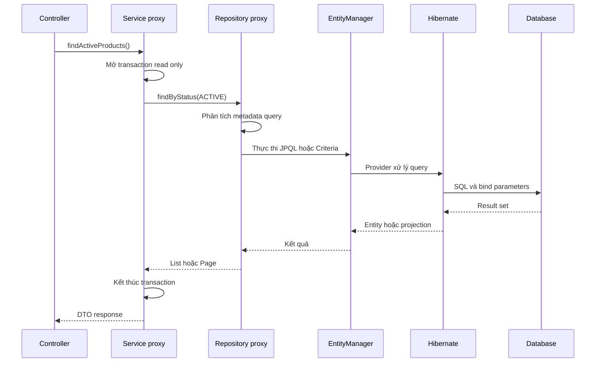
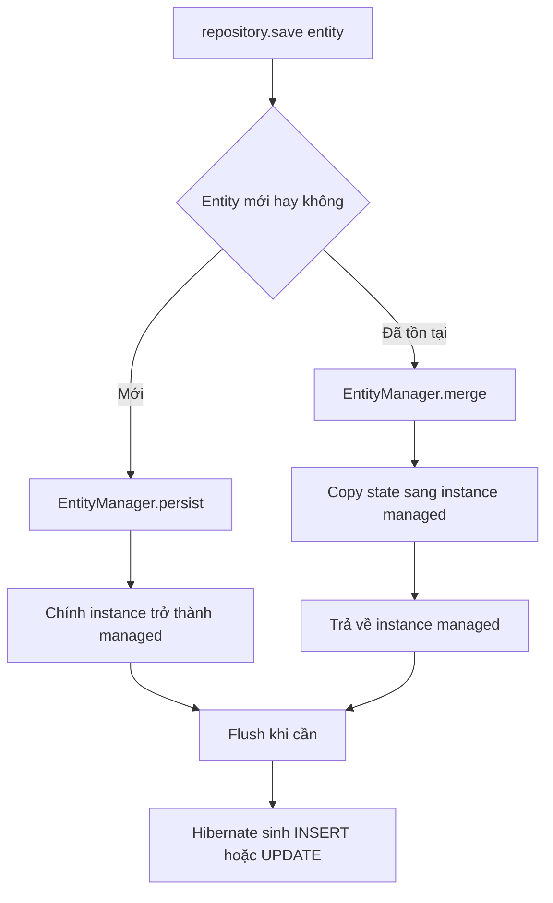

> [!NOTE]
> Bài này dành cho ứng dụng Spring Boot hiện đại dùng namespace `jakarta.persistence.*`. Mục tiêu không chỉ là viết repository nhanh, mà còn dự đoán được lúc nào Spring Data tạo query, lúc nào JPA quản lý entity và lúc nào Hibernate thực sự gửi SQL xuống database.

## Mục lục

- [Mục tiêu và phạm vi](#mục-tiêu-và-phạm-vi)
- [JPA Hibernate và Spring Data JPA](#jpa-hibernate-và-spring-data-jpa)
  - [Ba lớp có trách nhiệm khác nhau](#ba-lớp-có-trách-nhiệm-khác-nhau)
  - [Luồng thực thi một lời gọi repository](#luồng-thực-thi-một-lời-gọi-repository)
- [Mô hình ví dụ](#mô-hình-ví-dụ)
  - [Entity Category](#entity-category)
  - [Entity Product](#entity-product)
  - [Repository và transaction boundary](#repository-và-transaction-boundary)
- [Chọn repository interface](#chọn-repository-interface)
- [Query derivation](#query-derivation)
  - [Đọc tên method thành điều kiện](#đọc-tên-method-thành-điều-kiện)
  - [Chọn return type đúng ý nghĩa](#chọn-return-type-đúng-ý-nghĩa)
  - [Dừng lại khi tên method quá dài](#dừng-lại-khi-tên-method-quá-dài)
- [Query khai báo](#query-khai-báo)
  - [JPQL với Query](#jpql-với-query)
  - [Native SQL](#native-sql)
  - [Update và delete với Modifying](#update-và-delete-với-modifying)
  - [Kiểm soát fetch plan với EntityGraph](#kiểm-soát-fetch-plan-với-entitygraph)
- [Projection](#projection)
  - [Interface projection](#interface-projection)
  - [DTO projection bằng record](#dto-projection-bằng-record)
  - [Giới hạn của projection](#giới-hạn-của-projection)
- [Bộ lọc động](#bộ-lọc-động)
  - [Specification](#specification)
  - [Query by Example](#query-by-example)
  - [Chọn công cụ lọc](#chọn-công-cụ-lọc)
- [Save persist và merge](#save-persist-và-merge)
  - [Spring Data nhận biết entity mới](#spring-data-nhận-biết-entity-mới)
  - [SQL của persist và merge](#sql-của-persist-và-merge)
  - [Entity managed không cần save lại](#entity-managed-không-cần-save-lại)
  - [ID tự gán và Persistable](#id-tự-gán-và-persistable)
  - [SaveAll flush và batch](#saveall-flush-và-batch)
- [Phân trang và xử lý dữ liệu lớn](#phân-trang-và-xử-lý-dữ-liệu-lớn)
  - [Page Slice và List](#page-slice-và-list)
  - [Sort ổn định](#sort-ổn-định)
  - [Keyset scrolling với Window](#keyset-scrolling-với-window)
  - [Stream trong transaction](#stream-trong-transaction)
- [Transaction và flush](#transaction-và-flush)
  - [Đặt transaction ở service](#đặt-transaction-ở-service)
  - [Read only không phải hàng rào ghi dữ liệu](#read-only-không-phải-hàng-rào-ghi-dữ-liệu)
  - [Flush không phải commit](#flush-không-phải-commit)
- [Custom repository fragment](#custom-repository-fragment)
- [Hiệu năng và SQL cần quan sát](#hiệu-năng-và-sql-cần-quan-sát)
  - [N cộng một query](#n-cộng-một-query)
  - [Đọc đúng lượng dữ liệu](#đọc-đúng-lượng-dữ-liệu)
  - [Bulk operation và persistence context](#bulk-operation-và-persistence-context)
- [Anti pattern và cách sửa](#anti-pattern-và-cách-sửa)
- [Kiểm thử và xác minh](#kiểm-thử-và-xác-minh)
  - [Repository test](#repository-test)
  - [Bật SQL và bind parameter](#bật-sql-và-bind-parameter)
- [Checklist và cheat sheet](#checklist-và-cheat-sheet)
  - [Khi thiết kế repository](#khi-thiết-kế-repository)
  - [Khi ghi dữ liệu](#khi-ghi-dữ-liệu)
  - [Bảng nhớ nhanh](#bảng-nhớ-nhanh)
- [Tài liệu liên quan](#tài-liệu-liên-quan)

## Mục tiêu và phạm vi

**Spring Data JPA** là module xây dựng repository trên nền Jakarta Persistence. Repository là một interface mô tả thao tác dữ liệu; Spring tạo implementation ở runtime để giảm code lặp như gọi `EntityManager`, bind tham số và chuyển exception.

Abstraction này không thay đổi quy luật của ORM. Entity vẫn đi qua persistence context, quan hệ lazy vẫn có thể gây N+1, `merge` vẫn có thể cần `SELECT`, và transaction vẫn quyết định khi nào thay đổi được flush. Sau bài này, bạn có thể:

- chọn đúng repository interface và return type;
- biết lúc nào dùng derived query, `@Query`, projection, `Specification` hoặc Query by Example;
- giải thích chính xác `save()` gọi `persist()` hay `merge()`;
- đọc SQL do Hibernate sinh ra và phát hiện các anti-pattern phổ biến;
- đặt transaction boundary ở service thay vì rải transaction theo từng repository call.

> [!IMPORTANT]
> Spring Data JPA giúp viết data access layer, nhưng không phải một ORM mới. Muốn hiểu entity state, dirty checking và flush trước, hãy đọc [Persistence Context và Entity Lifecycle](./persistence-context-and-entity-lifecycle).

## JPA Hibernate và Spring Data JPA

### Ba lớp có trách nhiệm khác nhau

**Jakarta Persistence**, thường vẫn được gọi là **JPA**, là đặc tả chuẩn: annotation như `@Entity`, API như `EntityManager`, JPQL và quy tắc lifecycle. Đặc tả nói hệ thống phải hành xử thế nào, nhưng không tự kết nối database.

**Hibernate ORM** là một persistence provider, tức implementation thực thi đặc tả Jakarta Persistence. Hibernate quản lý persistence context, dirty checking, SQL generation, JDBC batching và cache. Hibernate còn có API riêng ngoài chuẩn JPA, nhưng chỉ nên dùng khi lợi ích đáng để đổi lấy sự phụ thuộc provider.

**Spring Data JPA** nằm trên JPA. Nó tạo repository proxy, phân tích tên method, dựng query, áp dụng pagination/projection và ủy quyền xuống `EntityManager`.

| Lớp | Cung cấp | Ví dụ trong code |
|---|---|---|
| Jakarta Persistence | API và quy tắc ORM chuẩn | `@Entity`, `EntityManager`, JPQL, `persist`, `merge` |
| Hibernate | Implementation của JPA và engine ORM | dirty checking, SQL, proxy lazy, batching |
| Spring Data JPA | Repository abstraction và tích hợp Spring | `JpaRepository`, `@Query`, `Specification`, `Page` |
| JDBC driver | Giao tiếp theo protocol của database | bind parameter, gửi câu lệnh, đọc result set |

Nói ngắn gọn: Spring Data chọn *thao tác nào cần làm*, JPA định nghĩa *ý nghĩa thao tác*, Hibernate quyết định *cách thực thi*, còn JDBC chuyển SQL tới database.

### Luồng thực thi một lời gọi repository



Có hai proxy khác nhau trong sơ đồ. Service proxy thường áp dụng `@Transactional`; repository proxy thực thi method repository. Bên dưới cả hai vẫn là một `EntityManager` gắn với persistence context của transaction hiện tại.

## Mô hình ví dụ

Bài viết dùng catalog tối giản: mỗi `Product` thuộc một `Category`. Quan hệ `ManyToOne` được để `LAZY`, nghĩa là category chưa chắc được đọc cùng product. Đây là lựa chọn an toàn hơn việc vô tình tải quan hệ ở mọi query.

### Entity Category

```java
package com.example.catalog;

import jakarta.persistence.Column;
import jakarta.persistence.Entity;
import jakarta.persistence.GeneratedValue;
import jakarta.persistence.GenerationType;
import jakarta.persistence.Id;
import jakarta.persistence.Table;

@Entity
@Table(name = "categories")
public class Category {

    @Id
    @GeneratedValue(strategy = GenerationType.IDENTITY)
    private Long id;

    @Column(nullable = false, unique = true)
    private String name;

    protected Category() {
        // Constructor không tham số cho JPA.
    }

    public Category(String name) {
        this.name = name;
    }

    public Long getId() {
        return id;
    }

    public String getName() {
        return name;
    }
}
```

### Entity Product

`@Version` là cột phiên bản dùng cho optimistic locking. Kiểu wrapper `Long` còn giúp Spring Data nhận biết entity mới vì giá trị ban đầu là `null`.

```java
package com.example.catalog;

import jakarta.persistence.Column;
import jakarta.persistence.Entity;
import jakarta.persistence.EnumType;
import jakarta.persistence.Enumerated;
import jakarta.persistence.FetchType;
import jakarta.persistence.GeneratedValue;
import jakarta.persistence.GenerationType;
import jakarta.persistence.Id;
import jakarta.persistence.JoinColumn;
import jakarta.persistence.ManyToOne;
import jakarta.persistence.Table;
import jakarta.persistence.Version;
import java.math.BigDecimal;
import java.time.Instant;

@Entity
@Table(name = "products")
public class Product {

    @Id
    @GeneratedValue(strategy = GenerationType.IDENTITY)
    private Long id;

    @Version
    private Long version;

    @Column(nullable = false, unique = true)
    private String sku;

    @Column(nullable = false)
    private String name;

    @Enumerated(EnumType.STRING)
    @Column(nullable = false)
    private ProductStatus status;

    @Column(nullable = false, precision = 19, scale = 2)
    private BigDecimal price;

    @ManyToOne(fetch = FetchType.LAZY, optional = false)
    @JoinColumn(name = "category_id", nullable = false)
    private Category category;

    @Column(name = "created_at", nullable = false, updatable = false)
    private Instant createdAt;

    protected Product() {
        // Constructor cho JPA và Query by Example.
    }

    public Product(
            String sku,
            String name,
            ProductStatus status,
            BigDecimal price,
            Category category) {
        this.sku = sku;
        this.name = name;
        this.status = status;
        this.price = price;
        this.category = category;
        this.createdAt = Instant.now();
    }

    public void changePrice(BigDecimal newPrice) {
        this.price = newPrice;
    }

    public void setName(String name) {
        this.name = name;
    }

    public void setStatus(ProductStatus status) {
        this.status = status;
    }

    public Long getId() { return id; }
    public Long getVersion() { return version; }
    public String getSku() { return sku; }
    public String getName() { return name; }
    public ProductStatus getStatus() { return status; }
    public BigDecimal getPrice() { return price; }
    public Category getCategory() { return category; }
    public Instant getCreatedAt() { return createdAt; }
}
```

```java
package com.example.catalog;

public enum ProductStatus {
    DRAFT,
    ACTIVE,
    ARCHIVED
}
```

> [!TIP]
> Dùng `EnumType.STRING` để database lưu `ACTIVE` thay vì ordinal như `1`. Ordinal dễ hỏng dữ liệu khi đổi thứ tự enum constant.

### Repository và transaction boundary

`JpaRepository<Product, Long>` khai báo aggregate type là `Product` và kiểu primary key là `Long`. `JpaSpecificationExecutor` là fragment tùy chọn để chạy `Specification`.

```java
package com.example.catalog;

import org.springframework.data.jpa.repository.JpaRepository;
import org.springframework.data.jpa.repository.JpaSpecificationExecutor;

public interface ProductRepository
        extends JpaRepository<Product, Long>, JpaSpecificationExecutor<Product> {
}
```

Service đặt transaction boundary, tức ranh giới một đơn vị công việc phải thành công hoặc rollback cùng nhau.

```java
package com.example.catalog;

import java.math.BigDecimal;
import org.springframework.stereotype.Service;
import org.springframework.transaction.annotation.Transactional;

@Service
public class ProductService {

    private final ProductRepository products;

    public ProductService(ProductRepository products) {
        this.products = products;
    }

    @Transactional
    public Product create(
            String sku,
            String name,
            BigDecimal price,
            Category category) {
        Product product = new Product(
                sku, name, ProductStatus.DRAFT, price, category);
        return products.save(product);
    }

    @Transactional
    public void changePrice(long productId, BigDecimal newPrice) {
        Product product = products.findById(productId)
                .orElseThrow(() -> new IllegalArgumentException("Product not found"));
        product.changePrice(newPrice);
        // Không cần save(product): entity đang managed và Hibernate dirty-check khi flush.
    }
}
```

## Chọn repository interface

Repository hierarchy đã được tách nhỏ theo capability. Không cần thuộc toàn bộ cây kế thừa; hãy chọn interface nhỏ nhất đáp ứng use case.

| Interface | Capability chính | Khi dùng |
|---|---|---|
| `Repository<T, ID>` | Marker interface, không tự thêm CRUD method | Muốn tự công khai rất ít method |
| `CrudRepository<T, ID>` | `save`, `findById`, `existsById`, `delete` và CRUD cơ bản | Module Spring Data nói chung |
| `ListCrudRepository<T, ID>` | Như CRUD nhưng các thao tác nhiều phần tử trả `List` | Muốn API collection thuận tiện |
| `PagingAndSortingRepository<T, ID>` | `findAll(Sort)` và `findAll(Pageable)` | Cần paging/sorting; ở Spring Data hiện đại không nên giả định nó tự mang mọi CRUD method |
| `JpaRepository<T, ID>` | Kết hợp CRUD dạng `List`, paging/sorting và thao tác riêng của JPA | Lựa chọn mặc định cho Spring Data JPA |
| `JpaSpecificationExecutor<T>` | Thực thi `Specification` và fluent query | Thêm khi cần filter động |

Các method riêng của `JpaRepository` như `flush()`, `saveAndFlush()`, `deleteAllInBatch()` và `getReferenceById()` phơi bày semantics của JPA rõ hơn. Chúng không phải lúc nào cũng tốt hơn method CRUD thông thường.

Nếu muốn giới hạn API, tạo một base interface riêng:

```java
import java.util.Optional;
import org.springframework.data.repository.NoRepositoryBean;
import org.springframework.data.repository.Repository;

@NoRepositoryBean
public interface ReadMostlyRepository<T, ID> extends Repository<T, ID> {
    Optional<T> findById(ID id);
    boolean existsById(ID id);
    <S extends T> S save(S entity);
}
```

`@NoRepositoryBean` báo cho Spring Data rằng đây là interface nền, không phải repository cần tạo bean trực tiếp.

## Query derivation

**Query derivation** là cơ chế suy ra query từ tên method. Spring Data phân tách chủ ngữ như `find`, `exists`, `count`, rồi đọc predicate sau `By` theo tên **property Java**, không theo tên column SQL.

### Đọc tên method thành điều kiện

Đặt các method sau vào `ProductRepository`:

```java
import java.math.BigDecimal;
import java.util.List;
import java.util.Optional;
import org.springframework.data.domain.Pageable;
import org.springframework.data.domain.Slice;

Optional<Product> findBySkuIgnoreCase(String sku);

List<Product> findTop10ByStatusOrderByCreatedAtDesc(ProductStatus status);

Slice<ProductSummary> findByStatusAndPriceBetweenOrderByIdAsc(
        ProductStatus status,
        BigDecimal minPrice,
        BigDecimal maxPrice,
        Pageable pageable);

boolean existsByCategory_IdAndStatus(Long categoryId, ProductStatus status);

long countByStatus(ProductStatus status);
```

Method thứ ba có thể được hiểu như JPQL sau:

```sql
select p
from Product p
where p.status = :status
  and p.price between :minPrice and :maxPrice
order by p.id asc
```

Hibernate chuyển query đó thành SQL gần giống:

```sql
select
    p.id, p.sku, p.name, p.price, p.created_at
from products p
where p.status = ?
  and p.price between ? and ?
order by p.id
offset ? rows fetch first ? rows only
```

Tên alias, cú pháp limit/offset và danh sách column phụ thuộc Hibernate version, projection và database dialect. Điều ổn định cần quan sát là predicate, join, sort, số câu query và số row được đọc.

> [!NOTE]
> Dấu gạch dưới trong `findByCategory_Id` làm rõ đường đi `category.id`. Không có nó, parser vẫn thường phân tách được `CategoryId`, nhưng dạng có `_` giảm mơ hồ khi property lồng nhau.

### Chọn return type đúng ý nghĩa

| Return type | Cam kết | Hành vi đáng chú ý |
|---|---|---|
| `Product` | Phải có tối đa một kết quả | Có thể trả `null`; nên tránh API mơ hồ này |
| `Optional<Product>` | Có hoặc không có một kết quả | Ném `IncorrectResultSizeDataAccessException` nếu có nhiều hơn một |
| `List<Product>` | Không hoặc nhiều kết quả | Spring Data trả list rỗng, không trả `null` |
| `Page<Product>` | Một trang và metadata tổng số | Thường cần thêm count query |
| `Slice<Product>` | Một lát và cờ còn trang sau hay không | Đọc `pageSize + 1`, không cần tổng số |
| `Stream<Product>` | Đọc dần trong khi resource còn mở | Phải đóng stream và giữ transaction |
| `Window<Product>` | Một cửa sổ dùng scrolling | Hợp với offset/keyset scrolling ở version hỗ trợ |

Return type là một phần của contract. Dùng `Optional` không đảm bảo uniqueness ở database; vẫn cần unique constraint cho `sku`.

### Dừng lại khi tên method quá dài

Derived query phù hợp khi điều kiện ngắn và ổn định. Tên sau là tín hiệu nên đổi công cụ:

```java
// Có thể chạy, nhưng khó đọc và khó thay đổi.
List<Product> findByStatusAndCategory_IdAndPriceGreaterThanEqualAndNameContainingIgnoreCaseOrderByCreatedAtDesc(
        ProductStatus status,
        Long categoryId,
        BigDecimal minPrice,
        String name);
```

Cách sửa:

- dùng `@Query` nếu query cố định nhưng tên method trở nên khó đọc;
- dùng `Specification` nếu nhiều filter là tùy chọn;
- dùng projection nếu use case chỉ cần một số column;
- dùng custom fragment nếu cần Criteria phức tạp, query hint hoặc phối hợp API ngoài JPA.

## Query khai báo

### JPQL với Query

`@Query` mặc định nhận JPQL. JPQL truy vấn entity và property Java, không truy vấn trực tiếp table và column.

```java
import java.math.BigDecimal;
import java.util.List;
import org.springframework.data.jpa.repository.Query;
import org.springframework.data.repository.query.Param;

@Query("""
        select p
        from Product p
        join fetch p.category
        where p.status = :status
          and p.price >= :minPrice
        order by p.id
        """)
List<Product> findSellableProducts(
        @Param("status") ProductStatus status,
        @Param("minPrice") BigDecimal minPrice);
```

`join fetch` vừa join vừa đưa `category` vào persistence context. Khi code gọi `product.getCategory().getName()`, Hibernate không cần query category riêng.

Đối với filter tùy chọn, có thể viết:

```java
@Query("""
        select p
        from Product p
        where (:status is null or p.status = :status)
          and (:term is null or lower(p.name) like lower(concat('%', :term, '%')))
        """)
List<Product> search(
        @Param("status") ProductStatus status,
        @Param("term") String term);
```

Mẫu `:param is null or ...` dễ đọc với vài filter. Khi số nhánh tăng, câu query dài và database có thể khó chọn index tốt. Khi đó, `Specification` thường rõ hơn vì chỉ thêm predicate thật sự có mặt.

### Native SQL

Native query dùng SQL của database. Chỉ chọn nó khi JPQL/Criteria không diễn đạt tốt tính năng cần dùng, ví dụ full-text search, window function, CTE hoặc operator riêng của PostgreSQL.

```java
@Query(
        value = """
                select p.*
                from products p
                where p.status = :status
                order by p.id
                """,
        countQuery = """
                select count(*)
                from products p
                where p.status = :status
                """,
        nativeQuery = true)
org.springframework.data.domain.Page<Product> findNativePage(
        @Param("status") String status,
        org.springframework.data.domain.Pageable pageable);
```

Khi native query trả entity, result set phải chứa đủ column provider cần để hydrate entity. Nếu trả interface projection, alias SQL phải khớp tên property. Với DTO class/record và mapping phức tạp, hãy dùng mapping tường minh thay vì dựa vào thứ tự column.

> [!WARNING]
> Native SQL giảm tính portable và Hibernate không thể kiểm tra property path như JPQL. Luôn bind parameter; không nối chuỗi input người dùng vào SQL. Với pagination, khai báo `countQuery` rõ ràng nếu Spring Data không thể suy ra count query đúng.

### Update và delete với Modifying

`@Modifying` báo rằng `@Query` là câu lệnh thay đổi dữ liệu thay vì select.

```java
import java.util.Collection;
import org.springframework.data.jpa.repository.Modifying;

@Modifying(flushAutomatically = true, clearAutomatically = true)
@Query("""
        update Product p
        set p.status = :status
        where p.id in :ids
        """)
int updateStatus(
        @Param("ids") Collection<Long> ids,
        @Param("status") ProductStatus status);
```

Method cần chạy trong transaction ghi, thường do service bên ngoài cung cấp. Giá trị trả về là số row bị ảnh hưởng.

Bulk JPQL update/delete đi thẳng tới database. Nó không gọi setter, callback entity hay dirty checking cho từng object. Nó cũng có thể làm entity đang managed trở nên stale. `flushAutomatically` đẩy thay đổi đang chờ trước bulk query; `clearAutomatically` xóa persistence context sau đó để lần đọc kế tiếp không lấy state cũ.

### Kiểm soát fetch plan với EntityGraph

**Fetch plan** là tập association được tải cùng query hiện tại. `@EntityGraph` cho phép đổi fetch plan theo use case mà không đổi mapping mặc định.

```java
import org.springframework.data.jpa.repository.EntityGraph;

@EntityGraph(attributePaths = "category")
List<Product> findTop20ByStatusOrderByIdAsc(ProductStatus status);
```

Hibernate có thể sinh SQL một query với join:

```sql
select
    p.id, p.name, p.price, p.category_id,
    c.id, c.name
from products p
join categories c on c.id = p.category_id
where p.status = ?
order by p.id
fetch first ? rows only
```

`@EntityGraph` phù hợp khi vẫn muốn trả entity. Nếu endpoint chỉ cần vài field, projection thường rẻ và rõ contract hơn.

## Projection

**Projection** là view chỉ chứa dữ liệu use case cần, thay vì trả toàn bộ entity graph. Nó giảm số column được chọn và tránh để web layer chạm vào lazy association ngoài transaction.

### Interface projection

Closed interface projection có getter trùng property của entity:

```java
package com.example.catalog;

import java.math.BigDecimal;
import java.time.Instant;

public interface ProductSummary {
    Long getId();
    String getSku();
    String getName();
    BigDecimal getPrice();
    Instant getCreatedAt();
}
```

```java
List<ProductSummary> findByStatusOrderById(ProductStatus status);
```

Spring Data thường dùng tuple query rồi tạo proxy implementation cho interface. SQL chỉ cần các top-level property đã khai báo.

### DTO projection bằng record

Record là lựa chọn tốt khi muốn giá trị immutable và constructor tường minh.

```java
package com.example.catalog;

import java.math.BigDecimal;

public record ProductRow(
        Long id,
        String sku,
        String name,
        BigDecimal price,
        String categoryName) {
}
```

JPQL constructor expression dùng tên class đầy đủ:

```java
@Query("""
        select new com.example.catalog.ProductRow(
            p.id, p.sku, p.name, p.price, c.name)
        from Product p
        join p.category c
        where p.status = :status
        order by p.id
        """)
List<ProductRow> findRowsByStatus(@Param("status") ProductStatus status);
```

DTO projection không được managed. Thay đổi field của DTO không thể được dirty-check và không tạo `UPDATE`. Đây chính là ưu điểm cho read model.

### Giới hạn của projection

- Nested interface projection có thể khiến Spring Data join và materialize toàn bộ property lồng nhau, không chỉ vài getter tưởng tượng ở phía Java.
- Open projection dùng biểu thức động có thể ngăn tối ưu danh sách column.
- Projection không tự giải quyết count query chậm của `Page`.
- Entity projection một phần không nên được giả lập bằng native query thiếu column; entity managed phải có state phù hợp với mapping.
- Projection là contract truy vấn, không thay thế aggregate/entity cho luồng ghi.

Kết luận thực dụng: trả DTO/interface projection cho màn hình đọc; tải entity khi cần thay đổi state theo lifecycle JPA.

## Bộ lọc động

### Specification

`Specification<T>` bọc một predicate của JPA Criteria API. **Predicate** là biểu thức đúng/sai dùng trong `WHERE`. Mỗi specification nhỏ có thể tái sử dụng và ghép bằng `and`, `or`, `not`.

```java
package com.example.catalog;

import java.math.BigDecimal;
import java.util.Locale;
import org.springframework.data.jpa.domain.Specification;

public final class ProductSpecifications {

    private ProductSpecifications() {
    }

    public static Specification<Product> hasStatus(ProductStatus status) {
        return (root, query, cb) -> status == null
                ? cb.conjunction()
                : cb.equal(root.get("status"), status);
    }

    public static Specification<Product> inCategory(Long categoryId) {
        return (root, query, cb) -> categoryId == null
                ? cb.conjunction()
                : cb.equal(root.get("category").get("id"), categoryId);
    }

    public static Specification<Product> priceAtLeast(BigDecimal minPrice) {
        return (root, query, cb) -> minPrice == null
                ? cb.conjunction()
                : cb.greaterThanOrEqualTo(root.get("price"), minPrice);
    }

    public static Specification<Product> nameContains(String term) {
        return (root, query, cb) -> {
            if (term == null || term.isBlank()) {
                return cb.conjunction();
            }
            String pattern = "%" + term.toLowerCase(Locale.ROOT) + "%";
            return cb.like(cb.lower(root.get("name")), pattern);
        };
    }
}
```

```java
import static com.example.catalog.ProductSpecifications.hasStatus;
import static com.example.catalog.ProductSpecifications.inCategory;
import static com.example.catalog.ProductSpecifications.nameContains;
import static com.example.catalog.ProductSpecifications.priceAtLeast;

Specification<Product> spec = hasStatus(filter.status())
        .and(inCategory(filter.categoryId()))
        .and(priceAtLeast(filter.minPrice()))
        .and(nameContains(filter.term()));

Page<Product> page = products.findAll(spec, pageable);
```

Criteria API bind giá trị thành parameter, nên `term` không trở thành SQL fragment. Tuy vậy `%` và `_` trong input vẫn có ý nghĩa wildcard của `LIKE`; nếu nghiệp vụ cần tìm literal, hãy escape chúng và khai báo escape character.

> [!TIP]
> String path như `root.get("price")` chỉ lỗi ở runtime khi rename property. Dự án lớn có thể dùng JPA static metamodel (`Product_.price`) để compiler kiểm tra.

### Query by Example

**Query by Example**, viết tắt QBE, tạo query từ một entity mẫu gọi là **probe**. Property khác `null` của probe trở thành điều kiện.

```java
import org.springframework.data.domain.Example;
import org.springframework.data.domain.ExampleMatcher;

Product probe = new Product();
probe.setName("java");
probe.setStatus(ProductStatus.ACTIVE);

ExampleMatcher matcher = ExampleMatcher.matchingAll()
        .withIgnoreCase()
        .withStringMatcher(ExampleMatcher.StringMatcher.CONTAINING)
        .withIgnorePaths("id", "version", "sku", "price", "category", "createdAt");

Example<Product> example = Example.of(probe, matcher);
List<Product> matches = products.findAll(example);
```

QBE dễ dùng cho form lọc phẳng. Nó không phù hợp với range giá, nhóm điều kiện như `(A OR B) AND C`, aggregate, subquery hoặc join phức tạp.

### Chọn công cụ lọc

| Nhu cầu | Công cụ nên bắt đầu |
|---|---|
| Một đến ba điều kiện cố định | Derived query |
| Query cố định nhưng cần join hoặc projection rõ | `@Query` với JPQL |
| Form nhiều filter tùy chọn | `Specification` |
| So khớp object phẳng, chủ yếu equality/string | Query by Example |
| Tính năng riêng của database | Native query |
| Criteria phức tạp hoặc cần API hạ tầng khác | Custom repository fragment |

Không có công cụ nào luôn tốt nhất. Hãy chọn abstraction thấp nhất vẫn diễn đạt query rõ ràng và kiểm thử được.

## Save persist và merge

`save()` không đồng nghĩa với SQL `INSERT OR UPDATE`. Implementation nền `SimpleJpaRepository` trước tiên hỏi entity có mới không, rồi chọn một trong hai thao tác JPA.



### Spring Data nhận biết entity mới

Chiến lược mặc định đi theo thứ tự:

1. Nếu entity có property `@Version` kiểu không primitive, giá trị `null` nghĩa là entity mới.
2. Nếu không có version phù hợp, ID `null` nghĩa là entity mới.
3. Entity có thể implement `Persistable<ID>` để tự quyết định qua `isNew()`.
4. Custom `EntityInformation` là lối mở rộng sâu và hiếm khi cần.

Entity ví dụ có `@Version Long version`, nên product mới được nhận diện dù chiến lược ID thay đổi. Không dùng primitive `long` cho mục đích này vì giá trị mặc định `0` không biểu diễn trạng thái chưa persist theo cách Spring Data cần.

### SQL của persist và merge

Với product mới dùng `GenerationType.IDENTITY`, `save()` đi vào `persist()`. Hibernate cần lấy ID do database sinh nên thường thực thi `INSERT` sớm:

```sql
insert into products
    (category_id, created_at, name, price, sku, status, version)
values
    (?, ?, ?, ?, ?, ?, ?)
```

Với entity được xem là đã tồn tại, `save()` đi vào `merge()`. Nếu persistence context chưa có instance cùng ID, Hibernate thường đọc state hiện tại trước:

```sql
select
    p.id, p.category_id, p.created_at, p.name,
    p.price, p.sku, p.status, p.version
from products p
where p.id = ?
```

Sau khi state được copy và transaction flush, Hibernate mới tạo `UPDATE` nếu dirty checking phát hiện thay đổi:

```sql
update products
set category_id = ?, name = ?, price = ?, sku = ?, status = ?, version = ?
where id = ? and version = ?
```

Điều kiện version giúp phát hiện concurrent update. Nếu row đã có version khác, update ảnh hưởng 0 row và provider ném optimistic locking exception.

> [!IMPORTANT]
> `merge(detached)` không gắn chính object detached vào persistence context. Nó trả về một instance managed chứa state đã copy. Vì vậy luôn dùng object mà `save()` trả về, đặc biệt với entity có ID/version do provider gán.

### Entity managed không cần save lại

Trong `ProductService.changePrice()`, `findById()` tải product vào persistence context. Thay đổi `price` làm entity dirty. Khi flush, Hibernate tự sinh `UPDATE`.

```java
@Transactional
public void changePrice(long id, BigDecimal price) {
    Product product = products.findById(id).orElseThrow();
    product.changePrice(price);
    // products.save(product) là dư thừa theo semantics JPA.
}
```

Gọi `save()` ở đây thường không làm update xảy ra ngay. Nó cũng không thay thế transaction. Có thể giữ lời gọi nếu team muốn nhất quán với repository abstraction, nhưng phải hiểu SQL vẫn phụ thuộc flush và entity state.

### ID tự gán và Persistable

Entity dùng ID do ứng dụng tự gán luôn có ID khác `null`. Nếu không có `@Version` nullable, Spring Data có thể hiểu nhầm entity mới là entity cũ và gọi `merge()`, dẫn tới một `SELECT` không cần thiết trước `INSERT`.

Một base class có thể tự báo trạng thái mới:

```java
import jakarta.persistence.MappedSuperclass;
import jakarta.persistence.PostLoad;
import jakarta.persistence.PostPersist;
import jakarta.persistence.Transient;
import org.springframework.data.domain.Persistable;

@MappedSuperclass
public abstract class AssignedIdEntity<ID> implements Persistable<ID> {

    @Transient
    private boolean newEntity = true;

    @Override
    public boolean isNew() {
        return newEntity;
    }

    @PostPersist
    @PostLoad
    void markNotNew() {
        newEntity = false;
    }
}
```

Chỉ dùng pattern này khi ID thực sự do ứng dụng cấp. `isNew()` sai có thể biến insert thành merge hoặc cố insert một row đã tồn tại.

### SaveAll flush và batch

`saveAll()` lặp qua các entity và áp dụng logic new detection cho từng phần tử. Nó **không tự biến** danh sách thành một câu SQL bulk insert.

JDBC batching còn phụ thuộc:

- `hibernate.jdbc.batch_size`;
- thứ tự insert/update và mapping quan hệ;
- transaction có đủ lớn để gom statement;
- chiến lược sinh ID; `IDENTITY` thường hạn chế insert batching vì phải lấy ID ngay;
- database driver và dialect.

`saveAndFlush()` gọi save rồi ép đồng bộ persistence context. `flush()` có thể làm constraint violation xuất hiện sớm hơn, nhưng transaction vẫn có thể rollback sau đó.

> [!WARNING]
> Đừng gọi `saveAndFlush()` trong mỗi vòng lặp. Nó phá cơ hội batching và tăng round trip. Với import lớn, xử lý theo chunk, `flush()` rồi `clear()` có chủ đích để giới hạn memory.

## Phân trang và xử lý dữ liệu lớn

### Page Slice và List

```java
Page<Product> findByStatus(ProductStatus status, Pageable pageable);

Slice<Product> findSliceByStatus(ProductStatus status, Pageable pageable);

List<Product> findListByStatus(ProductStatus status, Pageable pageable);
```

`Page` thường cần data query và count query:

```sql
select p.*
from products p
where p.status = ?
order by p.created_at, p.id
offset ? rows fetch first ? rows only;

select count(*)
from products p
where p.status = ?;
```

`Slice` lấy nhiều hơn page size một row để biết còn phần tiếp theo. Nó không biết tổng số page. `List` với `Pageable` chỉ giới hạn dữ liệu và không cung cấp cả total lẫn cờ `hasNext`.

Chọn theo UI:

- UI cần “trang 3 trên 42” thì dùng `Page` và tối ưu count query;
- nút “xem thêm” hoặc infinite scroll thì dùng `Slice`;
- job chỉ cần một chunk cố định thì `List` đủ.

### Sort ổn định

Offset pagination phải có thứ tự ổn định. Sort chỉ theo `createdAt` không đủ nếu nhiều row trùng timestamp. Thêm primary key làm tie-breaker:

```java
Pageable pageable = org.springframework.data.domain.PageRequest.of(
        0,
        50,
        org.springframework.data.domain.Sort.by(
                org.springframework.data.domain.Sort.Order.asc("createdAt"),
                org.springframework.data.domain.Sort.Order.asc("id")));
```

Sort nhận property Java, không phải tên column. Với sort do client gửi, hãy allowlist field được phép để tránh property không tồn tại, query đắt hoặc vô tình lộ cấu trúc domain.

### Keyset scrolling với Window

Offset lớn buộc database bỏ qua nhiều row trước khi lấy page. **Keyset pagination** dùng giá trị sort cuối cùng làm mốc, ví dụ `(created_at, id) > (?, ?)`, nên tận dụng index tốt hơn.

Spring Data hiện đại hỗ trợ `Window<T>` và `ScrollPosition` cho scrolling:

```java
import org.springframework.data.domain.KeysetScrollPosition;
import org.springframework.data.domain.ScrollPosition;
import org.springframework.data.domain.Window;

Window<ProductSummary> findFirst100ByStatusOrderByCreatedAtAscIdAsc(
        ProductStatus status,
        KeysetScrollPosition position);
```

```java
KeysetScrollPosition position = ScrollPosition.keyset();
Window<ProductSummary> window = products.findFirst100ByStatusOrderByCreatedAtAscIdAsc(
        ProductStatus.ACTIVE, position);

while (!window.isEmpty()) {
    window.forEach(row -> System.out.println(row.getSku()));

    if (window.isLast()) {
        break;
    }

    position = (KeysetScrollPosition) window.positionAt(window.size() - 1);
    window = products.findFirst100ByStatusOrderByCreatedAtAscIdAsc(
            ProductStatus.ACTIVE, position);
}
```

Keyset cần sort ổn định và index cùng hướng, ví dụ `(status, created_at, id)`. Projection phải chứa mọi sort key; vì vậy `ProductSummary` có cả `createdAt` và `id`. API scrolling đã phát triển qua các dòng Spring Data; hãy kiểm tra chữ ký `Window`/`KeysetScrollPosition` đúng với version của dự án.

### Stream trong transaction

Repository có thể trả `Stream<T>` để xử lý tuần tự mà không materialize toàn bộ list:

```java
import java.util.stream.Stream;

@Query("""
        select p
        from Product p
        where p.status = :status
        order by p.id
        """)
Stream<Product> streamByStatus(@Param("status") ProductStatus status);
```

Resource JDBC chỉ đóng khi stream đóng. Consume stream bên trong transaction bằng try-with-resources:

```java
@Transactional(readOnly = true)
public void exportActiveProducts() {
    try (Stream<Product> stream = products.streamByStatus(ProductStatus.ACTIVE)) {
        stream.forEach(product -> System.out.println(product.getSku()));
    }
}
```

Không trả stream thẳng từ controller. Khi HTTP serialization bắt đầu, transaction có thể đã kết thúc và connection/resource vẫn bị giữ ngoài ý muốn.

## Transaction và flush

### Đặt transaction ở service

Các CRUD method kế thừa từ `SimpleJpaRepository` có transactional metadata mặc định: read method thường là `readOnly = true`, method ghi dùng transaction bình thường. Tuy nhiên, một use case thường gọi nhiều repository hoặc thay đổi nhiều aggregate. Transaction của service mới bao trọn tất cả thao tác.

```java
@Transactional
public Product archiveAndCreateReplacement(long currentId, Product replacement) {
    Product current = products.findById(currentId).orElseThrow();
    current.setStatus(ProductStatus.ARCHIVED);
    return products.save(replacement);
}
```

Nếu transaction chỉ nằm ở từng repository call, product hiện tại có thể bị detach trước khi đổi status. Insert replacement cũng có thể commit tách biệt với update product. Service boundary bảo đảm hai thay đổi cùng commit hoặc cùng rollback.

> [!NOTE]
> Query method tự khai báo không nên được giả định luôn có transaction chỉ vì nằm trong repository. Hãy để service khai báo transaction rõ theo use case. Xem sâu hơn tại [Transactions với JPA](./transactions-with-jpa).

### Read only không phải hàng rào ghi dữ liệu

`@Transactional(readOnly = true)` là hint tối ưu, không phải cơ chế authorization. Với Hibernate, Spring có thể điều chỉnh flush mode để giảm dirty checking. Database/driver cũng có thể nhận read-only hint, nhưng mức cưỡng chế phụ thuộc hệ thống.

Do đó:

- dùng `readOnly = true` cho query service;
- không dựa vào nó để chặn code ghi;
- tách rõ command và query nếu cần enforcement ở kiến trúc hoặc database permission.

### Flush không phải commit

**Flush** đồng bộ thay đổi trong persistence context thành SQL. **Commit** xác nhận transaction để thay đổi bền vững. Flush có thể xảy ra:

- trước commit;
- trước một query có thể bị ảnh hưởng bởi thay đổi đang chờ khi flush mode là `AUTO`;
- khi gọi `EntityManager.flush()` hoặc repository `flush()`;
- khi gọi `saveAndFlush()`.

```java
@Transactional
public Product createAndValidate(Product product) {
    Product saved = products.save(product);
    products.flush(); // Unique/FK constraint có thể ném exception tại đây.
    validateWithAnotherQuery(saved);
    return saved;     // Sau đó vẫn có thể rollback.
}
```

Khi debug “exception xuất hiện muộn”, hãy tìm transaction boundary và điểm flush, không chỉ nhìn dòng `save()`.

## Custom repository fragment

Khi derived query, `@Query`, QBE và `Specification` không còn diễn đạt tốt use case, thêm một **repository fragment**. Fragment là interface nhỏ cùng implementation được ghép vào repository proxy.

```java
package com.example.catalog;

import java.math.BigDecimal;
import java.util.List;

public interface ProductSearchRepository {
    List<ProductRow> findForExport(
            Long categoryId,
            BigDecimal minPrice,
            int limit);
}
```

Implementation mang hậu tố `Impl` theo **tên fragment**:

```java
package com.example.catalog;

import jakarta.persistence.EntityManager;
import java.math.BigDecimal;
import java.util.List;

class ProductSearchRepositoryImpl implements ProductSearchRepository {

    private final EntityManager entityManager;

    ProductSearchRepositoryImpl(EntityManager entityManager) {
        this.entityManager = entityManager;
    }

    @Override
    public List<ProductRow> findForExport(
            Long categoryId,
            BigDecimal minPrice,
            int limit) {
        return entityManager.createQuery("""
                        select new com.example.catalog.ProductRow(
                            p.id, p.sku, p.name, p.price, c.name)
                        from Product p
                        join p.category c
                        where c.id = :categoryId
                          and p.price >= :minPrice
                        order by p.id
                        """, ProductRow.class)
                .setParameter("categoryId", categoryId)
                .setParameter("minPrice", minPrice)
                .setMaxResults(limit)
                .setHint("org.hibernate.readOnly", true)
                .getResultList();
    }
}
```

Ghép fragment vào repository:

```java
public interface ProductRepository extends
        JpaRepository<Product, Long>,
        JpaSpecificationExecutor<Product>,
        ProductSearchRepository {
}
```

Pattern cũ đặt implementation theo tên repository như `ProductRepositoryImpl` chỉ cho một custom implementation và đang được thay thế bởi composition theo fragment. Tên `ProductSearchRepositoryImpl` thể hiện capability, tái sử dụng được và tránh biến repository thành một class khổng lồ.

## Hiệu năng và SQL cần quan sát

### N cộng một query

Đoạn code sau có thể tạo một query lấy products rồi thêm một query category cho mỗi category chưa có trong persistence context:

```java
List<Product> result = products.findByStatus(ProductStatus.ACTIVE);

for (Product product : result) {
    log.info("{}", product.getCategory().getName());
}
```

Mẫu SQL:

```sql
select p.* from products p where p.status = ?;       -- 1 query
select c.* from categories c where c.id = ?;         -- lặp N lần
```

Cách sửa theo nhu cầu:

- `@EntityGraph(attributePaths = "category")` nếu cần entity và category;
- `join fetch` trong JPQL nếu fetch plan gắn với query;
- DTO projection nếu chỉ cần `category.name`;
- batch fetching khi phải lazy-load nhiều reference theo lô.

Không đổi association sang `EAGER` để chữa N+1. EAGER áp dụng cho mọi use case và vẫn không đảm bảo mọi query dùng đúng một join. Xem [Fetching Strategies và Proxies](./fetching-strategies-and-proxies).

### Đọc đúng lượng dữ liệu

Các lựa chọn có chi phí khác nhau:

| Nhu cầu | Tránh | Ưu tiên |
|---|---|---|
| Kiểm tra tồn tại | `findBy...().isPresent()` rồi bỏ entity | `existsBy...` |
| Đếm row | tải `List` rồi gọi `size()` | `countBy...` |
| Hiển thị bảng | trả entity đầy đủ | projection |
| Infinite scroll | `Page` với count đắt | `Slice` hoặc keyset `Window` |
| Cập nhật một tập lớn | load rồi sửa từng entity | bulk query nếu chấp nhận bỏ qua callback/lifecycle |
| Lấy reference để gán FK | select entity chỉ để có ID | `getReferenceById()` trong transaction |

`getReferenceById()` có thể trả proxy chưa hit database. Lỗi “không tồn tại” có thể chỉ xuất hiện khi proxy được khởi tạo hoặc khi flush kiểm tra foreign key.

### Bulk operation và persistence context

Các method có hậu tố `InBatch` hoặc bulk `@Modifying` tối ưu số câu SQL, nhưng không đồng bộ từng entity đang managed.

```java
@Transactional
public int archive(Collection<Long> ids) {
    int updated = products.updateStatus(ids, ProductStatus.ARCHIVED);
    // clearAutomatically=true bảo đảm lần find tiếp theo không lấy state cũ.
    return updated;
}
```

Bulk update cũng không tự tăng `@Version` theo lifecycle như update từng entity. Nếu optimistic locking là yêu cầu, hãy thiết kế điều kiện/version update tường minh hoặc cập nhật từng aggregate.

## Anti pattern và cách sửa

| Anti-pattern | Vấn đề | Cách sửa |
|---|---|---|
| Controller gọi repository trực tiếp | Transaction và mapping DTO bị rải ở web layer | Tạo application/service boundary |
| Trả entity thẳng qua JSON | Lazy load ngoài transaction, vòng lặp quan hệ, lộ schema | Map sang DTO/projection trong service |
| `findAll()` rồi filter bằng Java | Đọc thừa row, column và memory | Đẩy filter/paging xuống query |
| Derived query dài như một câu văn | Khó đọc, khó đổi và dễ sai property path | `@Query` hoặc `Specification` |
| Gọi `save()` sau mọi setter | Hiểu sai dirty checking, code nhiễu | Sửa managed entity trong transaction |
| Bỏ qua object trả về từ `save()` | Với merge, tiếp tục dùng object detached | Dùng instance được trả về |
| Dùng `saveAndFlush()` trong loop | Nhiều round trip, mất batching | Flush theo chunk có chủ đích |
| Nghĩ `saveAll()` là bulk insert | Vẫn persist/merge từng entity | Cấu hình batching hoặc dùng bulk loader phù hợp |
| Dùng `Page` cho mọi danh sách | Count query có thể rất đắt | `Slice`, `List` hoặc `Window` theo UI |
| Sort offset page không có tie-breaker | Trùng hoặc mất row giữa các page | Thêm `id` vào sort ổn định |
| Đổi mọi quan hệ sang EAGER để tránh lazy error | Over-fetch và N+1 khó dự đoán | Fetch plan theo query, projection |
| Bulk update rồi dùng entity cũ | Persistence context stale | Flush trước, clear sau |
| Nối input vào JPQL/SQL | Injection và lỗi escaping | Named parameter/Criteria API |
| Dùng native query cho CRUD đơn giản | Mất portability và mapping phức tạp | Derived query hoặc JPQL |
| Bắt exception quá xa điểm flush | Khó biết constraint nào lỗi | Flush có chủ đích khi cần phản hồi sớm |

## Kiểm thử và xác minh

### Repository test

`@DataJpaTest` khởi tạo JPA slice và rollback sau mỗi test. Test nên flush rồi clear để kết quả không đến từ first-level cache.

```java
package com.example.catalog;

import static org.assertj.core.api.Assertions.assertThat;

import jakarta.persistence.EntityManager;
import java.math.BigDecimal;
import org.junit.jupiter.api.Test;
import org.springframework.beans.factory.annotation.Autowired;
import org.springframework.boot.test.autoconfigure.orm.jpa.DataJpaTest;

@DataJpaTest
class ProductRepositoryTest {

    @Autowired
    ProductRepository products;

    @Autowired
    EntityManager entityManager;

    @Test
    void derivesQueryFromStatusAndPriceRange() {
        Category books = new Category("Books");
        entityManager.persist(books);

        products.save(new Product(
                "JAVA-001",
                "Effective Java",
                ProductStatus.ACTIVE,
                new BigDecimal("45.00"),
                books));
        products.save(new Product(
                "JAVA-002",
                "Draft Notes",
                ProductStatus.DRAFT,
                new BigDecimal("15.00"),
                books));

        entityManager.flush();
        entityManager.clear();

        var page = products.findByStatusAndPriceBetweenOrderByIdAsc(
                ProductStatus.ACTIVE,
                new BigDecimal("40.00"),
                new BigDecimal("50.00"),
                org.springframework.data.domain.PageRequest.of(0, 10));

        assertThat(page).extracting(ProductSummary::getSku)
                .containsExactly("JAVA-001");
    }
}
```

H2 tiện cho test nhanh nhưng không mô phỏng hoàn toàn dialect, collation, index, lock và query planner production. Với native SQL hoặc performance-sensitive query, thêm integration test bằng đúng database engine, thường qua Testcontainers.

### Bật SQL và bind parameter

Trong môi trường local/test:

```properties
logging.level.org.hibernate.SQL=DEBUG
logging.level.org.hibernate.orm.jdbc.bind=TRACE
spring.jpa.properties.hibernate.format_sql=true
spring.jpa.properties.hibernate.generate_statistics=true
```

Kiểm tra bốn câu hỏi:

1. Một use case phát bao nhiêu SQL statement?
2. Query chọn những column và join nào?
3. Pagination có phát count query không?
4. Flush tạo `INSERT`/`UPDATE` ở thời điểm nào?

Log bind parameter có thể chứa dữ liệu nhạy cảm. Chỉ bật mức `TRACE` có kiểm soát, không bật mặc định ở production.

Với query quan trọng, copy SQL cùng parameter đại diện vào `EXPLAIN` hoặc `EXPLAIN ANALYZE` của database. Hibernate statistics cho biết số query; execution plan cho biết database thực thi chúng có hiệu quả hay không.

## Checklist và cheat sheet

### Khi thiết kế repository

- [ ] Repository quản lý đúng aggregate root và đúng kiểu ID.
- [ ] Chỉ extend `JpaSpecificationExecutor` hoặc fragment khi thực sự dùng.
- [ ] Derived query ngắn, property path rõ và có unique constraint nếu return `Optional` theo khóa nghiệp vụ.
- [ ] Query đọc chỉ chọn field/association cần thiết.
- [ ] Native query có lý do rõ, bind parameter và count mapping phù hợp.
- [ ] Sort phân trang có tie-breaker duy nhất như `id`.
- [ ] `Page`, `Slice`, `List`, `Window` hoặc `Stream` khớp nhu cầu caller.

### Khi ghi dữ liệu

- [ ] Transaction boundary nằm ở service use case.
- [ ] Entity mới có cơ chế `isNew` đúng với ID/version strategy.
- [ ] Luôn dùng object `save()` trả về nếu có khả năng đi qua `merge()`.
- [ ] Không gọi `save()` chỉ để “kích hoạt update” cho managed entity.
- [ ] Không nhầm `flush` với `commit`.
- [ ] Bulk update/delete xử lý persistence context stale và yêu cầu version/callback.
- [ ] Import lớn có batch/chunk, flush và clear được đo đạc.

### Bảng nhớ nhanh

| Câu hỏi | Câu trả lời ngắn |
|---|---|
| Spring Data JPA có phải ORM không? | Không; nó là repository abstraction trên JPA |
| Hibernate là gì? | Persistence provider thường thực thi JPA và sinh SQL |
| `save()` luôn insert hay update? | Không; entity mới dùng `persist`, còn lại dùng `merge` |
| Sửa entity đã load có cần `save()`? | Không theo JPA nếu entity còn managed trong transaction |
| `saveAndFlush()` có commit không? | Không; nó chỉ ép flush |
| `saveAll()` có phải một bulk SQL không? | Không; nó xử lý từng entity, batching cần cấu hình riêng |
| Khi nào dùng `Page`? | Khi thật sự cần total count |
| Khi nào dùng `Specification`? | Khi filter động cần ghép predicate |
| Cách tránh N+1? | Projection, fetch join hoặc entity graph theo use case |
| Repository có thay service transaction không? | Không; service mới bao trọn đơn vị công việc |

## Tài liệu liên quan

- [Tổng quan JPA và Hibernate](./jpa-hibernate-overview) — phân biệt specification, provider và ORM.
- [Persistence Context và Entity Lifecycle](./persistence-context-and-entity-lifecycle) — managed, detached, dirty checking, persist và merge.
- [JPQL Criteria và Native Query](./jpql-criteria-and-native-query) — đào sâu các ngôn ngữ truy vấn.
- [Fetching Strategies và Proxies](./fetching-strategies-and-proxies) — lazy loading, fetch join và N+1.
- [Relationships Mapping](./relationships-mapping) — ánh xạ quan hệ và ownership.
- [Transactions với JPA](./transactions-with-jpa) — transaction boundary, flush và locking.
- [Hibernate Performance Troubleshooting](./hibernate-performance-troubleshooting) — đọc SQL, statistics và execution plan.
- [Spring Data JPA Reference](https://docs.spring.io/spring-data/jpa/reference/) — tài liệu chính thức về repository, query, projection và transaction.
- [Jakarta Persistence EntityManager](https://jakarta.ee/specifications/persistence/3.2/apidocs/jakarta.persistence/jakarta/persistence/entitymanager) — semantics chuẩn của persistence context, `persist`, `merge` và flush.
- [Hibernate ORM User Guide](https://docs.hibernate.org/stable/orm/userguide/html_single/) — hành vi provider, SQL, fetching và batching.
