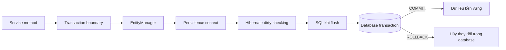
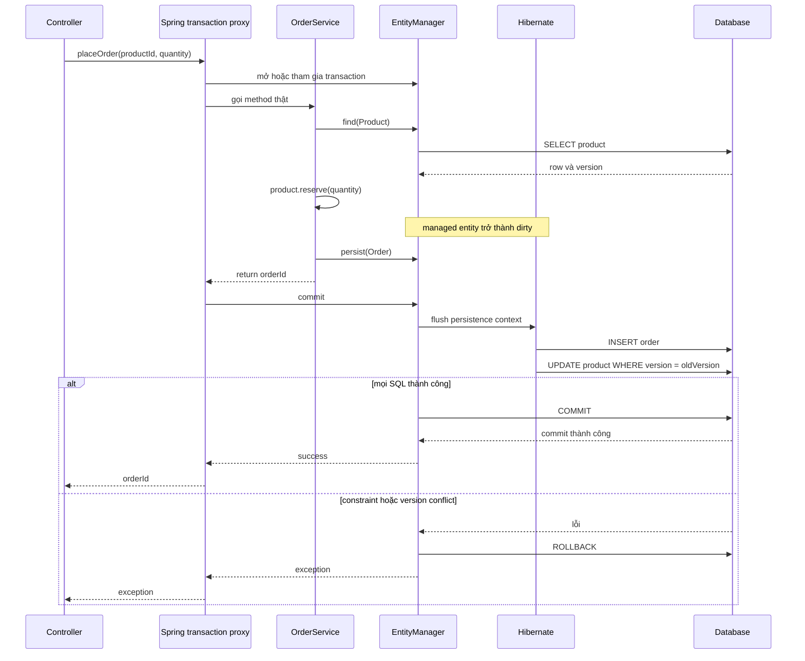
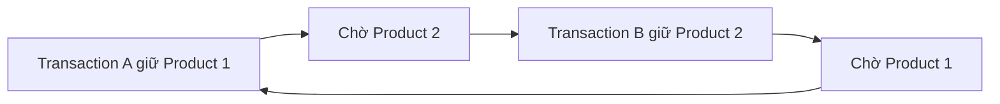

Transaction không chỉ là thêm `@Transactional` lên một method. Muốn dữ liệu đúng khi có lỗi hoặc nhiều request chạy đồng thời, bạn cần xác định **transaction boundary** — điểm bắt đầu và kết thúc của một đơn vị công việc — rồi hiểu `EntityManager`, Hibernate và database phối hợp bên trong boundary đó như thế nào.

> [!NOTE]
> Bài viết dùng Jakarta Persistence hiện đại, vì vậy import nằm trong namespace `jakarta.persistence.*`. Nếu dự án cũ còn dùng `javax.persistence.*`, khái niệm không đổi nhưng cần nâng cấp dependency và import trước khi dùng nguyên mẫu code.

## Mục lục

- [Bức tranh tổng thể](#bức-tranh-tổng-thể)
- [Phân biệt JPA Hibernate và Spring Data JPA](#phân-biệt-jpa-hibernate-và-spring-data-jpa)
- [Ranh giới transaction và EntityManager](#ranh-giới-transaction-và-entitymanager)
  - [Transaction tài nguyên cục bộ](#transaction-tài-nguyên-cục-bộ)
  - [Transaction do Spring quản lý](#transaction-do-spring-quản-lý)
- [Ví dụ xuyên suốt](#ví-dụ-xuyên-suốt)
  - [Entity Product và schema](#entity-product-và-schema)
  - [Use case đặt hàng](#use-case-đặt-hàng)
- [Lifecycle của một transaction](#lifecycle-của-một-transaction)
- [Flush và commit](#flush-và-commit)
  - [Flush tự động](#flush-tự-động)
  - [Ép flush để phát hiện lỗi sớm](#ép-flush-để-phát-hiện-lỗi-sớm)
- [Quản lý transaction với Spring](#quản-lý-transaction-với-spring)
  - [Proxy và self invocation](#proxy-và-self-invocation)
  - [Quy tắc rollback](#quy-tắc-rollback)
  - [Propagation](#propagation)
  - [Isolation](#isolation)
  - [Read only](#read-only)
- [Optimistic locking](#optimistic-locking)
  - [Version phát hiện lost update](#version-phát-hiện-lost-update)
  - [Retry đúng cách](#retry-đúng-cách)
- [Pessimistic locking](#pessimistic-locking)
  - [Lock timeout](#lock-timeout)
  - [Deadlock và thứ tự khóa](#deadlock-và-thứ-tự-khóa)
- [Hiệu ứng bên ngoài transaction](#hiệu-ứng-bên-ngoài-transaction)
- [Anti pattern và cách sửa](#anti-pattern-và-cách-sửa)
- [Kiểm thử hành vi transaction](#kiểm-thử-hành-vi-transaction)
- [Checklist và cheat sheet](#checklist-và-cheat-sheet)
- [Tài liệu liên quan](#tài-liệu-liên-quan)

## Bức tranh tổng thể

Một transaction database thường được kỳ vọng có bốn thuộc tính ACID:

- **Atomicity**: hoặc toàn bộ thay đổi thành công, hoặc toàn bộ bị rollback.
- **Consistency**: dữ liệu đi từ một trạng thái hợp lệ sang trạng thái hợp lệ khác theo constraint và quy tắc nghiệp vụ.
- **Isolation**: các transaction chạy đồng thời không nhìn thấy trạng thái trung gian của nhau ngoài mức mà isolation level cho phép.
- **Durability**: sau khi commit thành công, dữ liệu tồn tại dù tiến trình ứng dụng gặp sự cố.

JPA không thay thế transaction của database. Nó giữ thay đổi trên entity trong **persistence context** — vùng quản lý các entity đang được theo dõi — rồi Hibernate chuyển các thay đổi đó thành SQL. Cuối cùng, database mới là nơi commit hoặc rollback dữ liệu.



Điểm quan trọng là **flush không phải commit**. Flush gửi SQL xuống database nhưng SQL vẫn nằm trong transaction hiện tại và vẫn có thể rollback. Commit mới kết thúc transaction và làm thay đổi trở nên bền vững.

## Phân biệt JPA Hibernate và Spring Data JPA

Ba tên này nằm ở ba tầng khác nhau:

| Thành phần | Vai trò | API điển hình |
|---|---|---|
| Jakarta Persistence, thường gọi là JPA | Đặc tả chuẩn cho mapping entity, persistence context, query, transaction và locking | `EntityManager`, `EntityTransaction`, `@Version`, `LockModeType` |
| Hibernate ORM | Một persistence provider hiện thực đặc tả JPA và sinh SQL; đồng thời có API mở rộng riêng | `Session`, dirty checking, batching, Hibernate flush mode |
| Spring Data JPA | Lớp abstraction repository xây trên JPA; không phải persistence provider | `JpaRepository`, `@Query`, `@Lock` |
| Spring Framework | Quản lý transaction theo kiểu khai báo hoặc lập trình | `@Transactional`, `JpaTransactionManager`, `TransactionTemplate` |

Trong ứng dụng Spring Boot phổ biến, lời gọi `productRepository.findById(...)` đi qua Spring Data JPA, dùng `EntityManager` của JPA, rồi Hibernate sinh SQL. `@Transactional` thuộc Spring, không thuộc JPA hay Hibernate.

> [!IMPORTANT]
> Đừng đồng nhất `repository.save()` với commit. `save()` chỉ chuyển yêu cầu xuống persistence context thông qua `persist()` hoặc `merge()` tùy trạng thái entity. Transaction manager mới quyết định commit; Hibernate có thể chưa chạy SQL tại dòng `save()`.

## Ranh giới transaction và EntityManager

`EntityManager` là API trung tâm của JPA để tìm, persist, remove và query entity. Trong một persistence context, mỗi hàng theo cùng entity type và primary key được biểu diễn bởi một managed instance. Khi managed entity thay đổi, Hibernate dùng **dirty checking** — so sánh trạng thái để phát hiện thuộc tính đã đổi — và tạo SQL tại lúc flush.

Ranh giới transaction nên bao quanh một use case nghiệp vụ hoàn chỉnh. Ví dụ, “giữ hàng và tạo đơn” cần cùng thành công hoặc cùng thất bại. Nếu tách mỗi repository call thành một transaction độc lập, trạng thái nửa vời có thể bị commit.

`EntityManager` có thể tồn tại khi chưa có transaction; một lệnh `find()` đơn lẻ vẫn có thể đọc dữ liệu. Tuy nhiên, flush, pessimistic lock và các thay đổi cần đồng bộ xuống database phải chạy trong transaction, nếu không JPA có thể ném `TransactionRequiredException`. Với resource-local, transaction thuộc về chính `EntityManager`. Với JTA, transaction tồn tại bên ngoài; container thường tự cho `EntityManager` tham gia, còn `joinTransaction()` cho phép yêu cầu tham gia transaction JTA đang active một cách tường minh. Có thể kiểm tra bằng `isJoinedToTransaction()` khi chẩn đoán tích hợp container.

### Transaction tài nguyên cục bộ

Trong Java SE hoặc khi tự quản lý một persistence unit kiểu `RESOURCE_LOCAL`, JPA cung cấp `EntityTransaction`:

```java
import java.math.BigDecimal;

import jakarta.persistence.EntityManager;
import jakarta.persistence.EntityManagerFactory;
import jakarta.persistence.EntityTransaction;

public final class ProductCommand {
    private final EntityManagerFactory emf;

    public ProductCommand(EntityManagerFactory emf) {
        this.emf = emf;
    }

    public void changePrice(long productId, BigDecimal newPrice) {
        EntityManager em = emf.createEntityManager();
        EntityTransaction tx = em.getTransaction();

        try {
            tx.begin();

            Product product = em.find(Product.class, productId);
            if (product == null) {
                throw new IllegalArgumentException("Product not found: " + productId);
            }
            product.changePrice(newPrice);

            tx.commit();
        } catch (RuntimeException | Error ex) {
            if (tx.isActive()) {
                tx.rollback();
            }
            throw ex;
        } finally {
            em.close();
        }
    }
}
```

Entity được tải trong transaction là managed nên không cần gọi `em.merge(product)` sau khi đổi giá. Hibernate phát hiện thay đổi và flush trước commit.

Không dùng `EntityTransaction` khi container đang quản lý transaction JTA hoặc khi Spring đã cung cấp `JpaTransactionManager`. Trộn hai cơ chế dễ gây lỗi “transaction already active”, dùng sai connection hoặc đóng nhầm `EntityManager` do container quản lý.

### Transaction do Spring quản lý

Trong Spring Boot, cách thông dụng là đặt boundary ở service:

```java
import java.math.BigDecimal;

import org.springframework.stereotype.Service;
import org.springframework.transaction.annotation.Transactional;

@Service
public class PricingService {
    private final ProductRepository products;

    public PricingService(ProductRepository products) {
        this.products = products;
    }

    @Transactional
    public void changePrice(long productId, BigDecimal newPrice) {
        Product product = products.findById(productId)
                .orElseThrow(() -> new ProductNotFoundException(productId));

        product.changePrice(newPrice);
    }
}
```

Spring mở transaction trước khi vào method, gắn một `EntityManager` với thread đang xử lý, rồi commit hoặc rollback sau khi method kết thúc. `@PersistenceContext` và Spring Data repository nhận một proxy trỏ tới `EntityManager` đang gắn với transaction hiện tại. Bạn không tự `close()` đối tượng đó.

Với transaction-scoped persistence context, entity được quản lý trong transaction hiện tại. Sau khi transaction kết thúc, các entity trả ra ngoài thường trở thành detached, nghĩa là không còn được dirty checking theo dõi.

## Ví dụ xuyên suốt

Ta dùng bài toán trừ tồn kho. Hai request có thể cùng đặt một sản phẩm, vì vậy ví dụ vừa thể hiện atomicity vừa bộc lộ concurrent update.

### Entity Product và schema

```java
package com.example.shop.product;

import java.math.BigDecimal;

import jakarta.persistence.Column;
import jakarta.persistence.Entity;
import jakarta.persistence.Id;
import jakarta.persistence.Table;
import jakarta.persistence.Version;

@Entity
@Table(name = "product")
public class Product {
    @Id
    private Long id;

    @Column(nullable = false)
    private String name;

    @Column(nullable = false)
    private int stock;

    @Column(nullable = false, precision = 19, scale = 2)
    private BigDecimal price;

    @Version
    private long version;

    protected Product() {
    }

    public void reserve(int quantity) {
        if (quantity <= 0) {
            throw new IllegalArgumentException("Quantity must be positive");
        }
        if (stock < quantity) {
            throw new OutOfStockException(id, stock, quantity);
        }
        stock -= quantity;
    }

    public void changePrice(BigDecimal newPrice) {
        if (newPrice == null || newPrice.signum() < 0) {
            throw new IllegalArgumentException("Price must not be negative");
        }
        price = newPrice;
    }

    public int getStock() {
        return stock;
    }

    public long getVersion() {
        return version;
    }
}
```

Schema tối thiểu tương ứng:

```sql
create table product (
    id bigint primary key,
    name varchar(200) not null,
    stock integer not null check (stock >= 0),
    price numeric(19, 2) not null check (price >= 0),
    version bigint not null
);
```

`@Version` đánh dấu cột phiên bản phục vụ optimistic locking. Mỗi lần cập nhật thành công, Hibernate tăng `version`. Các check constraint là lớp bảo vệ cuối ở database, nhưng quy tắc nghiệp vụ vẫn nên được kiểm tra trong domain để trả lỗi dễ hiểu.

### Use case đặt hàng

```java
package com.example.shop.order;

import org.springframework.stereotype.Service;
import org.springframework.transaction.annotation.Transactional;

@Service
public class OrderService {
    private final ProductRepository products;
    private final OrderRepository orders;

    public OrderService(ProductRepository products, OrderRepository orders) {
        this.products = products;
        this.orders = orders;
    }

    @Transactional
    public Long placeOrder(long productId, int quantity) {
        Product product = products.findById(productId)
                .orElseThrow(() -> new ProductNotFoundException(productId));

        product.reserve(quantity);

        Order order = new Order(productId, quantity);
        orders.save(order);

        return order.getId();
    }
}
```

`Product` đã managed nên không cần `products.save(product)`. `orders.save(order)` đăng ký entity mới để persist. Cả cập nhật tồn kho và insert đơn hàng nằm trong cùng transaction; nếu insert order vi phạm constraint, transaction rollback cả hai.

SQL minh họa do Hibernate sinh ra ở lúc flush có thể giống sau:

```sql
select
    p.id, p.name, p.price, p.stock, p.version
from product p
where p.id = ?;

insert into purchase_order (product_id, quantity, id)
values (?, ?, ?);

update product
set name = ?, price = ?, stock = ?, version = ?
where id = ? and version = ?;
```

Thứ tự SQL cụ thể phụ thuộc mapping, chiến lược sinh ID, batching và action queue của Hibernate. Đừng viết logic dựa vào thứ tự quan sát được trong log nếu không có constraint hoặc flush rõ ràng bảo đảm điều đó.

## Lifecycle của một transaction

Luồng dưới đây mô tả lời gọi qua proxy Spring với Hibernate làm JPA provider:



Các mốc cần nhớ:

1. Spring transaction proxy quyết định mở transaction mới hay tham gia transaction có sẵn theo propagation.
2. `EntityManager` tham gia transaction và persistence context bắt đầu theo dõi entity được tải.
3. Code thay đổi object Java; SQL update thường chưa chạy ngay.
4. Flush chuyển thay đổi thành SQL. Database có thể phát hiện constraint violation hoặc version conflict ở đây.
5. Commit kết thúc transaction. Nếu commit thất bại, ứng dụng nhận exception dù method nghiệp vụ đã chạy xong.

Sau rollback, không nên tiếp tục dùng các managed entity cũ như thể chúng phản ánh database. Trạng thái object trong bộ nhớ không tự quay ngược theo rollback. Hãy kết thúc unit of work, bỏ persistence context cũ và tải lại dữ liệu trong transaction mới.

## Flush và commit

**Flush** là thao tác đồng bộ trạng thái của persistence context xuống database bằng SQL. **Commit** là thao tác xác nhận transaction. Một transaction có thể flush nhiều lần rồi vẫn rollback toàn bộ.

```text
thay đổi entity → flush → SQL đã chạy nhưng chưa bền vững → commit
                         └──────────────────────────→ rollback vẫn hủy được
```

Đừng gọi `flush()` sau mỗi `save()`. Làm vậy tăng round trip tới database, giảm khả năng batching và khiến code phụ thuộc quá sâu vào provider. Chỉ flush sớm khi bạn thực sự cần SQL chạy tại một checkpoint cụ thể.

### Flush tự động

Với `FlushModeType.AUTO`, JPA provider bảo đảm thay đổi cần thiết được đồng bộ để query trả kết quả phù hợp. Hibernate thường flush:

- trước commit;
- trước JPQL hoặc HQL query có liên quan đến dữ liệu đang pending;
- khi ứng dụng gọi `EntityManager.flush()`;
- đôi khi sớm hơn do chiến lược sinh khóa, ví dụ một số trường hợp `IDENTITY` cần insert để lấy ID.

Không nên giả định “mọi query đều flush” hoặc “`save()` luôn chạy SQL ngay”. Hành vi với native query và các tối ưu riêng có thể khác theo API và provider. Khi thứ tự là yêu cầu nghiệp vụ, hãy biểu diễn nó bằng constraint, transaction boundary hoặc `flush()` có chủ đích.

`FlushModeType.COMMIT` cho phép trì hoãn nhiều hơn đến commit. Tuy vậy, kết quả query trước commit có thể phụ thuộc provider trong những tình huống có thay đổi chưa flush. Chỉ dùng sau khi đã có test chứng minh semantics mong muốn.

### Ép flush để phát hiện lỗi sớm

Giả sử cần đổi một unique key rồi bắt lỗi ngay tại một vị trí xác định:

```java
import jakarta.persistence.EntityManager;
import jakarta.persistence.PersistenceContext;
import org.springframework.stereotype.Service;
import org.springframework.transaction.annotation.Transactional;

@Service
public class CustomerService {
    @PersistenceContext
    private EntityManager entityManager;

    @Transactional
    public void changeEmail(long customerId, String email) {
        Customer customer = entityManager.find(Customer.class, customerId);
        customer.changeEmail(email);

        entityManager.flush();
        // Unique constraint được kiểm tra trước khi chạy bước tiếp theo.
    }
}
```

Nếu email trùng, Hibernate có thể ném `PersistenceException`; Spring thường dịch exception truy cập dữ liệu thành một subtype của `DataAccessException`, chẳng hạn `DataIntegrityViolationException`. Loại exception cuối cùng còn phụ thuộc database, driver và vị trí exception được dịch.

Không flush sớm chỉ để “chắc chắn đã lưu”. Nếu transaction rollback sau đó, dữ liệu vẫn không được commit.

## Quản lý transaction với Spring

`@Transactional` của Spring là metadata mô tả transaction. `TransactionInterceptor` đọc metadata này khi lời gọi đi qua AOP proxy, sau đó dùng `PlatformTransactionManager`. Với JPA, implementation thường là `JpaTransactionManager`.

Boundary tốt thường nằm trên public method của application service:

```java
@Transactional
public Receipt checkout(CheckoutCommand command) {
    // Đọc dữ liệu cần nhất quán.
    // Áp dụng quy tắc nghiệp vụ.
    // Ghi mọi thay đổi thuộc cùng use case.
    return receipt;
}
```

Giữ transaction đủ ngắn để giảm thời gian giữ connection và lock. Tuy nhiên, đừng cắt nó ngắn đến mức một invariant nghiệp vụ bị chia thành nhiều commit độc lập.

### Proxy và self invocation

Lời gọi từ bean khác đi qua proxy nên transaction advice chạy. Lời gọi nội bộ qua `this` không đi qua proxy:

```java
@Service
public class ImportService {
    public void importAll(List<Row> rows) {
        for (Row row : rows) {
            this.importOne(row); // Sai kỳ vọng: bỏ qua transaction proxy.
        }
    }

    @Transactional(propagation = Propagation.REQUIRES_NEW)
    public void importOne(Row row) {
        // Annotation không tạo transaction mới khi bị gọi qua this.
    }
}
```

Cách sửa rõ ràng nhất là tách `importOne()` sang một bean khác rồi gọi bean đó. Nếu boundary động hoặc cần lặp với transaction riêng, `TransactionTemplate` cũng phù hợp. Tránh self injection hoặc `AopContext.currentProxy()` nếu không có lý do mạnh, vì chúng làm thiết kế phụ thuộc cơ chế proxy.

Ngoài self invocation, method `private`, `final` hoặc object tự tạo bằng `new` cũng thường không đi qua transaction proxy. Hãy để Spring quản lý bean và đặt boundary trên method có thể được proxy intercept theo cấu hình của dự án.

### Quy tắc rollback

Theo cấu hình mặc định, Spring rollback khi method ném `RuntimeException` hoặc `Error`. Checked exception không tự động rollback:

```java
@Transactional(rollbackFor = PaymentGatewayException.class)
public void confirmPayment(long orderId) throws PaymentGatewayException {
    // Checked exception này sẽ đánh dấu rollback nhờ rollbackFor.
}
```

Từ Spring Framework 6.2, ứng dụng có thể đổi quy tắc mặc định toàn cục sang rollback với mọi exception. Vì vậy, hãy kiểm tra cấu hình transaction management của dự án thay vì đoán. Quy tắc khai báo trực tiếp trên method vẫn được ưu tiên khi khớp exception.

Chỉ khai báo `rollbackFor` khi exception thật sự có nghĩa là unit of work phải thất bại. Một lựa chọn khác là thiết kế exception nghiệp vụ cần rollback kế thừa `RuntimeException`, nhưng cần dùng nhất quán trong toàn hệ thống.

Ba tình huống thường gây bất ngờ:

- Method bắt exception rồi không ném lại. Proxy thấy method thành công nên sẽ commit, trừ khi transaction đã được đánh dấu rollback-only.
- Inner method dùng `REQUIRED`, ném runtime exception và đánh dấu transaction chung là rollback-only. Outer method bắt exception rồi trả về bình thường. Khi outer commit, Spring ném `UnexpectedRollbackException` vì transaction đã không còn được phép commit.
- Lỗi chỉ xuất hiện lúc flush hoặc commit. Exception được ném sau khi body method trả về, nhưng vẫn nằm trong lời gọi proxy và vẫn được chuyển tới caller.

Nếu bắt exception chỉ để thêm context, hãy ném lại exception cùng cause:

```java
try {
    reserveInventory(command);
} catch (InventoryException ex) {
    throw new CheckoutException("Cannot reserve inventory", ex);
}
```

Không nên gọi `setRollbackOnly()` ở khắp business code. Cơ chế đó hữu ích với API lập trình như `TransactionTemplate`, nhưng exception rõ nghĩa thường dễ quan sát và kiểm thử hơn.

### Propagation

**Propagation** mô tả một method nên làm gì khi caller đã có transaction. Đây là khái niệm của Spring, không phải annotation chuẩn JPA.

| Propagation | Khi đã có transaction | Khi chưa có transaction | Dùng khi |
|---|---|---|---|
| `REQUIRED` | Tham gia transaction hiện tại | Tạo mới | Mặc định cho hầu hết use case |
| `REQUIRES_NEW` | Tạm ngưng transaction ngoài, tạo transaction độc lập | Tạo mới | Audit hoặc tác vụ phải commit độc lập, sau khi cân nhắc consistency |
| `SUPPORTS` | Tham gia | Chạy không transaction | Đọc có thể dùng chung context nhưng không bắt buộc transaction |
| `MANDATORY` | Tham gia | Ném exception | Helper bắt buộc caller thiết lập boundary |
| `NOT_SUPPORTED` | Tạm ngưng | Chạy không transaction | Tác vụ chủ ý không được giữ transaction |
| `NEVER` | Ném exception | Chạy không transaction | Assertion rằng code không nằm trong transaction |
| `NESTED` | Tạo savepoint trong transaction hiện tại nếu transaction manager hỗ trợ | Thường tạo transaction mới như `REQUIRED` | Rollback một phần trên cùng physical transaction |

Một **physical transaction** là transaction thật trên connection database. Nhiều scope `REQUIRED` có thể là nhiều **logical transaction scope** nhưng cùng chia sẻ một physical transaction.

`REQUIRES_NEW` cần một connection độc lập trong lúc connection của outer transaction vẫn bị giữ. Nếu nhiều thread đều làm vậy mà connection pool không đủ dư, hệ thống có thể chờ connection lẫn nhau. Chỉ dùng khi tính độc lập commit là yêu cầu thật.

`NESTED` không phải nested transaction chuẩn JPA. Nó phụ thuộc savepoint của JDBC và khả năng của transaction manager. Với `JpaTransactionManager`, rollback về savepoint không tự bảo đảm trạng thái entity trong persistence context cũng quay về tương ứng. Vì vậy, đừng dùng `NESTED` cho entity state nếu chưa kiểm thử chính xác với provider và transaction manager đang chạy.

> [!WARNING]
> `REQUIRES_NEW` không phải cách “chữa cháy” rollback. Nếu inner transaction commit rồi outer transaction rollback, thay đổi của inner vẫn còn. Điều đó có thể phá atomicity của use case.

### Isolation

**Isolation level** quy định một transaction có thể quan sát thay đổi đồng thời đến mức nào. Spring ánh xạ isolation xuống JDBC/database khi tạo transaction mới; JPA không cung cấp API portable để đặt isolation level cho từng transaction.

```java
@Transactional(isolation = Isolation.REPEATABLE_READ)
public StockSnapshot loadSnapshot(long productId) {
    // Isolation thực tế còn phụ thuộc database và driver.
}
```

| Isolation | Ngăn dirty read | Ngăn non repeatable read | Ngăn phantom theo định nghĩa chuẩn | Ghi chú |
|---|:---:|:---:|:---:|---|
| `READ_UNCOMMITTED` | Không | Không | Không | Ít database hiện thực đúng nghĩa mức này |
| `READ_COMMITTED` | Có | Không | Không | Mặc định phổ biến; mỗi statement có thể thấy snapshot khác |
| `REPEATABLE_READ` | Có | Có | Tùy database | MVCC và lock strategy làm hành vi thực tế khác nhau |
| `SERIALIZABLE` | Có | Có | Có | Mạnh nhất, có thể tăng blocking hoặc serialization failure |

- **Dirty read** là đọc dữ liệu transaction khác chưa commit.
- **Non-repeatable read** là đọc cùng một row hai lần nhưng nhận hai giá trị đã commit khác nhau.
- **Phantom** là chạy lại cùng điều kiện tìm kiếm nhưng tập row thay đổi vì transaction khác insert hoặc delete.

Isolation cao hơn không tự giải quyết mọi lost update trong logic read-modify-write. Dùng `@Version`, lock phù hợp hoặc atomic SQL update để biểu đạt xung đột rõ ràng.

Thuộc tính isolation chỉ có tác dụng khi scope thực sự tạo physical transaction mới. Nếu method `REQUIRED` tham gia transaction sẵn có, isolation của outer transaction thắng. Có thể bật kiểm tra nghiêm ngặt của transaction manager để phát hiện khai báo isolation không tương thích, nhưng mặc định thường không tạo isolation mới cho inner scope.

### Read only

```java
@Transactional(readOnly = true)
public ProductView getProduct(long id) {
    return products.findProjectedById(id)
            .orElseThrow(() -> new ProductNotFoundException(id));
}
```

`readOnly = true` là hint tối ưu cho transaction manager, driver và provider. Với Hibernate tích hợp qua Spring, nó có thể giảm công việc dirty checking hoặc điều chỉnh flush mode; mức tối ưu cụ thể phụ thuộc phiên bản và cấu hình.

`readOnly` không phải hàng rào bảo mật và không thay thế quyền `SELECT` ở database. Đừng dựa vào nó để bảo đảm mọi database đều từ chối `INSERT` hoặc `UPDATE`. Hãy coi đây là cam kết thiết kế: method chỉ đọc, trả projection hoặc dữ liệu không bị sửa.

## Optimistic locking

**Optimistic locking** không khóa row trong suốt thời gian đọc. Thay vào đó, nó giả định xung đột hiếm và kiểm tra version khi update. Cách này phù hợp với request ngắn hoặc quy trình có thời gian “suy nghĩ” của người dùng.

### Version phát hiện lost update

**Lost update** xảy ra khi hai transaction cùng đọc một giá trị, cùng sửa, rồi lần ghi sau đè mất thay đổi của lần ghi trước.

Với `@Version`, hai transaction cùng đọc `version = 7`. Transaction A update thành công và tăng version lên 8:

```sql
update product
set name = ?, price = ?, stock = ?, version = ?
where id = ? and version = ?;
-- bind: stock = 9, new version = 8, id = 42, old version = 7
-- affected rows: 1
```

Transaction B vẫn dùng version 7:

```sql
update product
set name = ?, price = ?, stock = ?, version = ?
where id = ? and version = ?;
-- bind: stock = 8, new version = 8, id = 42, old version = 7
-- affected rows: 0
```

Affected row bằng 0 cho Hibernate biết dữ liệu đã bị transaction khác thay đổi. JPA biểu diễn xung đột bằng `OptimisticLockException`; qua Spring, caller thường nhận `ObjectOptimisticLockingFailureException` hoặc một subtype khác của `OptimisticLockingFailureException`.

Không tự sửa field version. JPA provider sở hữu giá trị này. Jakarta Persistence 3.2 cho phép `int`, `Integer`, `short`, `Short`, `long`, `Long`, `java.sql.Timestamp`, `Instant` và `LocalDateTime`. Số nguyên thường dễ dự đoán và tránh vấn đề độ phân giải thời gian.

Có thể yêu cầu kiểm tra optimistic lock ngay cả khi entity chưa đổi:

```java
Product product = entityManager.find(
        Product.class,
        productId,
        LockModeType.OPTIMISTIC
);
```

`OPTIMISTIC_FORCE_INCREMENT` còn tăng version để biểu đạt rằng transaction đã sử dụng một tài nguyên logic cần làm các writer khác xung đột. Chỉ dùng khi invariant thực sự yêu cầu vì nó tạo thêm update.

### Retry đúng cách

Retry chỉ an toàn khi toàn bộ operation có thể chạy lại và side effect bên ngoài chưa xảy ra hoặc có tính idempotent. **Idempotent** nghĩa là lặp lại cùng yêu cầu không tạo thêm kết quả ngoài ý muốn, chẳng hạn không trừ tiền hai lần.

Mỗi lần retry phải dùng transaction và persistence context mới để tải version mới:

```java
import org.springframework.dao.OptimisticLockingFailureException;
import org.springframework.stereotype.Service;
import org.springframework.transaction.PlatformTransactionManager;
import org.springframework.transaction.TransactionDefinition;
import org.springframework.transaction.support.TransactionTemplate;

@Service
public class InventoryCommand {
    private static final int MAX_ATTEMPTS = 3;

    private final ProductRepository products;
    private final TransactionTemplate transactions;

    public InventoryCommand(
            ProductRepository products,
            PlatformTransactionManager transactionManager) {
        this.products = products;
        this.transactions = new TransactionTemplate(transactionManager);
        this.transactions.setPropagationBehavior(
                TransactionDefinition.PROPAGATION_REQUIRES_NEW
        );
    }

    public void reserveWithRetry(long productId, int quantity) {
        for (int attempt = 1; attempt <= MAX_ATTEMPTS; attempt++) {
            try {
                transactions.executeWithoutResult(status -> {
                    Product product = products.findById(productId)
                            .orElseThrow(() -> new ProductNotFoundException(productId));
                    product.reserve(quantity);
                });
                return;
            } catch (OptimisticLockingFailureException ex) {
                if (attempt == MAX_ATTEMPTS) {
                    throw ex;
                }
                backoff(attempt);
            }
        }
    }

    private void backoff(int attempt) {
        // Dùng scheduler hoặc policy retry có jitter trong production.
    }
}
```

Không đặt vòng lặp retry bên trong một `@Transactional` duy nhất. Persistence context cũ đã chứa state và version lỗi; transaction cũng có thể đã rollback-only. Hãy retry từ bên ngoài boundary như ví dụ trên.

Với contention cao, retry liên tục có thể tạo retry storm. Dùng số lần hữu hạn, exponential backoff có jitter và metric để quan sát tỷ lệ conflict. Nếu xung đột là trạng thái bình thường chứ không còn hiếm, cân nhắc pessimistic lock hoặc atomic update.

## Pessimistic locking

**Pessimistic locking** yêu cầu database giữ lock khi đọc vì giả định xung đột có khả năng cao. `PESSIMISTIC_WRITE` thường ánh xạ thành `SELECT ... FOR UPDATE` hoặc cú pháp tương đương:

```java
import java.util.Optional;

import jakarta.persistence.LockModeType;
import jakarta.persistence.QueryHint;
import org.springframework.data.jpa.repository.JpaRepository;
import org.springframework.data.jpa.repository.Lock;
import org.springframework.data.jpa.repository.Query;
import org.springframework.data.jpa.repository.QueryHints;
import org.springframework.data.repository.query.Param;

public interface ProductRepository extends JpaRepository<Product, Long> {
    @Lock(LockModeType.PESSIMISTIC_WRITE)
    @Query("select p from Product p where p.id = :id")
    @QueryHints(@QueryHint(
            name = "jakarta.persistence.lock.timeout",
            value = "3000"
    ))
    Optional<Product> findByIdForUpdate(@Param("id") long id);
}
```

Service phải gọi query khóa bên trong transaction:

```java
@Transactional
public void reserveWithLock(long productId, int quantity) {
    Product product = products.findByIdForUpdate(productId)
            .orElseThrow(() -> new ProductNotFoundException(productId));

    product.reserve(quantity);
}
```

SQL thường có dạng:

```sql
select p.id, p.name, p.price, p.stock, p.version
from product p
where p.id = ?
for update;
```

Các lock mode chính:

| Lock mode | Ý nghĩa |
|---|---|
| `PESSIMISTIC_READ` | Giữ shared/read lock nếu database hỗ trợ; ngăn một số writer nhưng có thể cho reader khác đi qua |
| `PESSIMISTIC_WRITE` | Giữ exclusive/write-oriented lock để tuần tự hóa cập nhật cạnh tranh |
| `PESSIMISTIC_FORCE_INCREMENT` | Lấy pessimistic lock và tăng version của versioned entity |

Mapping SQL, phạm vi row bị khóa và tương tác với join phụ thuộc dialect, execution plan và database. Luôn xác minh bằng SQL log cùng tài liệu database đang dùng.

### Lock timeout

Hint `jakarta.persistence.lock.timeout` dùng đơn vị millisecond theo JPA, nhưng đây là hint: provider hoặc database có thể không hỗ trợ, bỏ qua hoặc chỉ áp dụng trong một số loại query. Exception có thể là `LockTimeoutException` nếu statement thất bại mà transaction không bị đánh dấu rollback, hoặc `PessimisticLockException` nếu lỗi locking làm transaction rollback. Spring có thể dịch chúng sang exception thuộc nhóm `CannotAcquireLockException` hoặc `PessimisticLockingFailureException`.

Trong production, cấu hình timeout ở tầng database hoặc transaction đôi khi đáng tin cậy hơn hint portable. Hãy test bằng chính dialect và driver đang triển khai, không chỉ bằng H2.

### Deadlock và thứ tự khóa

Deadlock xảy ra khi các transaction chờ lock của nhau theo vòng tròn:



Database thường chọn một transaction làm nạn nhân và rollback nó. Giảm rủi ro bằng cách:

- luôn khóa nhiều row theo cùng thứ tự ổn định, ví dụ sort theo primary key;
- giữ transaction ngắn và không gọi HTTP trong lúc giữ lock;
- có index phù hợp để câu query khóa đúng tập row cần thiết;
- retry hữu hạn các lỗi transient như deadlock với backoff;
- quan sát deadlock log của database thay vì chỉ nhìn stack trace ứng dụng.

Pessimistic lock không loại bỏ nhu cầu retry. Nó chuyển một phần conflict thành chờ lock, timeout hoặc deadlock.

## Hiệu ứng bên ngoài transaction

Transaction JPA thông thường chỉ bao phủ database resource. Nó không tự rollback email, HTTP request, message đã publish hoặc file đã ghi.

Anti-pattern dễ gặp:

```java
@Transactional
public void placeOrder(Command command) {
    Order order = orders.save(map(command));
    paymentClient.charge(order.total()); // Remote call nằm trong DB transaction.
}
```

Nếu remote call chậm, transaction giữ connection và lock lâu. Nếu payment thành công nhưng commit database thất bại, tiền đã trừ mà order chưa tồn tại.

Các hướng thiết kế phổ biến:

- Dùng idempotency key khi gọi dịch vụ bên ngoài.
- Ghi business data và một outbox event trong cùng database transaction. Worker publish event sau commit.
- Dùng saga hoặc state machine cho quy trình nhiều service thay vì giả vờ có một transaction ACID xuyên mạng.
- Nếu chỉ cần chạy callback sau commit trong cùng process, có thể dùng transaction synchronization hoặc `@TransactionalEventListener(phase = AFTER_COMMIT)`. Cơ chế này không bền vững khi process chết; outbox phù hợp hơn khi không được mất event.

> [!IMPORTANT]
> Không có annotation JPA nào biến database transaction thành distributed transaction an toàn cho mọi side effect. Hãy thiết kế consistency boundary một cách tường minh.

## Anti pattern và cách sửa

| Anti-pattern | Vì sao sai | Cách sửa |
|---|---|---|
| Đặt `@Transactional` trên mọi repository call | Chia một use case thành nhiều commit hoặc tạo boundary không rõ | Đặt boundary ở application service bao quanh invariant nghiệp vụ |
| Gọi method transactional qua `this` | Bỏ qua Spring proxy | Tách sang bean khác hoặc dùng `TransactionTemplate` |
| Gọi `save()` sau mọi thay đổi managed entity | Thừa, dễ che khuất dirty checking; với entity detached còn có thể dẫn tới merge ngoài ý muốn | Sửa managed entity trong transaction; chỉ `save()` khi abstraction repository thật sự cần |
| Gọi `flush()` sau mọi `save()` | Tăng round trip và phá batching | Để AUTO flush; chỉ flush tại checkpoint cần phát hiện lỗi hoặc bảo đảm thứ tự |
| Bắt exception rồi trả kết quả thành công | Proxy có thể commit hoặc outer nhận `UnexpectedRollbackException` | Ném lại exception, chuyển thành exception có nghĩa hoặc xác định rõ partial failure |
| Retry optimistic conflict trong cùng transaction | Dùng lại persistence context và transaction đã lỗi | Retry từ ngoài boundary với transaction mới mỗi lần |
| Dùng `REQUIRES_NEW` để “bảo đảm lưu” | Inner commit không rollback cùng outer, có thể phá atomicity và tốn thêm connection | Chỉ dùng cho dữ liệu thực sự độc lập; ưu tiên một transaction chung hoặc outbox |
| Giữ pessimistic lock khi gọi API ngoài | Giữ connection và lock lâu, tăng timeout và deadlock | Tách remote workflow; dùng idempotency và outbox hoặc saga |
| Cho rằng `readOnly` cấm ghi | Chỉ là hint, mức cưỡng chế phụ thuộc stack | Dùng quyền database, API chỉ đọc và test kiến trúc |
| Chỉ test với H2 | Lock, isolation, timeout và SQL dialect khác production | Dùng Testcontainers hoặc database tương đương production cho integration test |
| Dùng entity detached làm command rồi `merge()` toàn bộ graph | Có thể ghi đè field mới hơn hoặc cascade ngoài dự kiến | Nhận DTO command, tải entity managed trong transaction rồi áp dụng thay đổi có chủ đích |

Một anti-pattern tinh vi là OSIV, viết tắt của **Open Session in View**. Cơ chế này giữ persistence context mở đến tầng web để lazy loading còn hoạt động sau service. OSIV không kéo dài database transaction theo cách an toàn cho business logic; nó có thể tạo query bất ngờ ngoài boundary. Hãy fetch dữ liệu cần thiết trong service và trả DTO hoặc projection. Xem thêm [Fetching strategies và proxy](./fetching-strategies-and-proxies.md).

## Kiểm thử hành vi transaction

Một test tốt cần chứng minh cả success path, rollback path và concurrent path. Đừng chỉ mock repository, vì mock không thể tái hiện flush, constraint, version check hoặc lock của database.

Ví dụ dưới đây buộc Hibernate chạy SQL rồi ném exception để chứng minh rollback vẫn hủy thay đổi đã flush:

```java
import static org.assertj.core.api.Assertions.assertThat;
import static org.assertj.core.api.Assertions.assertThatThrownBy;

import org.junit.jupiter.api.Test;
import org.springframework.beans.factory.annotation.Autowired;
import org.springframework.boot.test.context.SpringBootTest;
import org.springframework.transaction.PlatformTransactionManager;
import org.springframework.transaction.support.TransactionTemplate;

@SpringBootTest
class ProductTransactionTest {
    @Autowired
    private ProductRepository products;

    @Autowired
    private PlatformTransactionManager transactionManager;

    @Test
    void rollsBackAnUpdateThatWasAlreadyFlushed() {
        TransactionTemplate transactions =
                new TransactionTemplate(transactionManager);

        int stockBefore = transactions.execute(status ->
                products.findById(42L).orElseThrow().getStock()
        );

        assertThatThrownBy(() -> transactions.executeWithoutResult(status -> {
            Product product = products.findById(42L).orElseThrow();
            product.reserve(1);
            products.flush(); // UPDATE đã chạy trong database transaction.
            throw new IllegalStateException("force rollback");
        })).isInstanceOf(IllegalStateException.class);

        int stockAfter = transactions.execute(status ->
                products.findById(42L).orElseThrow().getStock()
        );

        assertThat(stockAfter).isEqualTo(stockBefore);
    }
}
```

Test giả định fixture có product `id = 42` và `stock > 0`. Mỗi lần `TransactionTemplate.execute(...)` phía trên tạo một transaction vì caller không có transaction sẵn. Lần đọc cuối dùng persistence context mới, nên assertion kiểm tra trạng thái thật trong database thay vì entity còn nằm trong bộ nhớ.

`@DataJpaTest` mặc định chạy test trong transaction và rollback sau test. Điều đó tiện cho isolation nhưng có thể che lỗi chỉ xảy ra lúc commit. Có ba cách xác minh:

1. Gọi `flush()` để ép SQL và kiểm tra lỗi flush-time.
2. Dùng `TestTransaction.flagForCommit()` rồi `TestTransaction.end()` khi cần kiểm tra commit thật trong test transaction.
3. Gọi service transactional từ một test không bọc transaction, sau đó mở transaction mới để đọc lại trạng thái.

Test concurrency nên dùng hai thread và hai transaction độc lập, phối hợp bằng `CountDownLatch` hoặc barrier để cả hai cùng đọc trước khi update. Với locking, chạy test trên đúng database production qua Testcontainers và đặt timeout hữu hạn để test không treo.

Các tín hiệu quan sát hữu ích:

- SQL và bind parameter trong môi trường test, nhưng không bật log nhạy cảm bừa bãi ở production;
- metric thời gian transaction, connection pool wait và số rollback;
- số optimistic conflict, lock timeout và deadlock;
- trace span bao quanh application service boundary;
- database slow query và lock wait report.

## Checklist và cheat sheet

Trước khi merge một use case ghi dữ liệu, kiểm tra:

- [ ] Boundary nằm ở application service và bao trọn invariant nghiệp vụ.
- [ ] Lời gọi `@Transactional` đi qua Spring proxy, không qua `this` hoặc object tạo bằng `new`.
- [ ] Đã chọn propagation có chủ đích; mặc định `REQUIRED` là đủ cho phần lớn trường hợp.
- [ ] Không giả định isolation của inner method ghi đè transaction outer.
- [ ] Checked exception cần rollback đã có `rollbackFor` hoặc được chuyển thành runtime exception phù hợp.
- [ ] Không nhầm `save`, `flush` và `commit`.
- [ ] Managed entity được sửa bằng dirty checking; không merge graph detached một cách mù quáng.
- [ ] Entity có `@Version` nếu lost update cần được phát hiện.
- [ ] Retry dùng transaction mới, số lần hữu hạn, backoff và operation idempotent.
- [ ] Pessimistic lock có timeout, thứ tự khóa ổn định và test trên database thật.
- [ ] Không giữ transaction trong lúc gọi API ngoài hoặc làm tác vụ chậm.
- [ ] Side effect cần độ tin cậy cao dùng outbox hoặc workflow phù hợp.
- [ ] Test đã ép flush hoặc commit khi cần và có case rollback.

Cheat sheet ngắn:

| Mục tiêu | Công cụ ưu tiên |
|---|---|
| Một use case nhiều bước cùng thành công hoặc thất bại | `@Transactional` trên service method |
| Phát hiện hai writer đè nhau, conflict hiếm | `@Version` và optimistic retry hữu hạn |
| Tuần tự hóa cập nhật, conflict cao và transaction ngắn | `PESSIMISTIC_WRITE` cùng timeout |
| Cập nhật counter đơn giản với throughput cao | Atomic SQL như `update ... set stock = stock - ? where stock >= ?` và kiểm tra affected rows |
| Boundary động trong vòng lặp hoặc retry | `TransactionTemplate` |
| Publish event đáng tin cậy sau thay đổi DB | Transactional outbox |
| Chỉ đọc | `@Transactional(readOnly = true)` và projection khi phù hợp |

## Tài liệu liên quan

- [Persistence Context và Entity Lifecycle](./persistence-context-and-entity-lifecycle.md) giải thích managed, detached, dirty checking và flush sâu hơn.
- [Spring Data JPA](./spring-data-jpa.md) trình bày repository abstraction, `save()`, query và projection.
- [Entity Mapping và Identity](./entity-mapping-and-identity.md) giúp thiết kế khóa, version và mapping entity an toàn.
- [Fetching Strategies và Proxies](./fetching-strategies-and-proxies.md) liên hệ transaction boundary với lazy loading và OSIV.
- [Hibernate Performance Troubleshooting](./hibernate-performance-troubleshooting.md) hướng dẫn đọc SQL, batching và chẩn đoán truy vấn.
