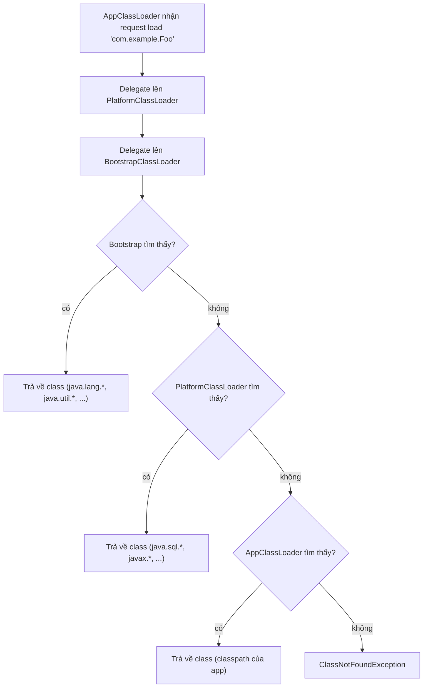

## Mục lục

- [Redeploy mà class cũ vẫn sống — memory leak 2GB](#1-redeploy-mà-class-cũ-vẫn-sống--memory-leak-2gb)
- [ClassLoader là gì — mỗi class có một "danh tính kép"](#2-classloader-là-gì--mỗi-class-có-một-danh-tính-kép)
- [Parent Delegation Model — tìm class từ trên xuống](#3-parent-delegation-model--tìm-class-từ-trên-xuống)
- [Ba ClassLoader mặc định — Bootstrap, Platform, Application](#4-ba-classloader-mặc-định--bootstrap-platform-application)
- [Loading → Linking → Initializing — 3 phase chi tiết](#5-loading--linking--initializing--3-phase-chi-tiết)
- [Class.forName() vs ClassLoader.loadClass() — khác gì nhau?](#6-classforname-vs-classloaderloadclass--khác-gì-nhau)
- [Custom ClassLoader — override findClass()](#7-custom-classloader--override-findclass)
- [Context ClassLoader — Thread.getContextClassLoader()](#8-context-classloader--threadgetcontextclassloader)
- [Hot-reload: tại sao phải tạo ClassLoader mới?](#9-hot-reload-tại-sao-phải-tạo-classloader-mới)
- [ClassLoader leak — PermGen/Metaspace OOM khi redeploy](#10-classloader-leak--permgenmetaspace-oom-khi-redeploy)
- [Module System (JDK 9+) và thay đổi ClassLoader hierarchy](#11-module-system-jdk-9-và-thay-đổi-classloader-hierarchy)
- [SPI & ServiceLoader — phá vỡ parent delegation có kiểm soát](#12-spi--serviceloader--phá-vỡ-parent-delegation-có-kiểm-soát)
- [Tóm tắt — Cheat sheet & 5 nguyên tắc](#13-tóm-tắt--cheat-sheet--5-nguyên-tắc)

---

## 1. Redeploy mà class cũ vẫn sống — memory leak 2GB

Team vận hành Tomcat với 50+ webapp. Mỗi lần **hot redeploy** (undeploy → deploy lại WAR mới), heap monitor cho thấy Metaspace **chỉ tăng, không giảm**. Sau 10 lần redeploy: Metaspace từ 128MB → 2.1GB → `OutOfMemoryError: Metaspace`.

Heap dump cho thấy: **class cũ vẫn reachable** — có thread, static field, hoặc JDBC driver giữ reference tới ClassLoader cũ → GC không thể thu hồi ClassLoader → mọi class nó load vẫn sống.

```
WebappClassLoader (old deploy #1) → giữ 3000 class definitions ← LEAKED
WebappClassLoader (old deploy #2) → giữ 3000 class definitions ← LEAKED
WebappClassLoader (current)       → 3000 class definitions     ← ACTIVE
```

> [!IMPORTANT]
> Để GC thu hồi **class metadata**, cần thu hồi **ClassLoader**. Để thu hồi ClassLoader, **không còn reference nào** trỏ tới nó hoặc bất kỳ class nào nó load. Một `static` field, một thread chưa stop, một JDBC driver chưa deregister — đủ để giữ toàn bộ ClassLoader sống mãi.

Phần còn lại của doc sẽ đi qua: ClassLoader là gì & class identity (§2) → parent delegation model (§3) → ba ClassLoader mặc định (§4) → loading → linking → initializing (§5) → Class.forName vs loadClass (§6) → custom ClassLoader (§7) → context ClassLoader (§8) → hot-reload (§9) → ClassLoader leak & Metaspace OOM (§10) → module system JDK 9+ (§11) → SPI & ServiceLoader (§12).

---

## 2. ClassLoader là gì — mỗi class có một "danh tính kép"

Trong JVM, danh tính duy nhất của một class là **(tên đầy đủ, ClassLoader đã load nó)**. Hai ClassLoader khác nhau load cùng file `.class` → JVM coi là **hai class khác nhau**:

```java
ClassLoader cl1 = new URLClassLoader(new URL[]{jarUrl});
ClassLoader cl2 = new URLClassLoader(new URL[]{jarUrl});

Class<?> a = cl1.loadClass("com.example.Foo");
Class<?> b = cl2.loadClass("com.example.Foo");

a == b;           // false! — khác ClassLoader = khác class
a.isInstance(b.getDeclaredConstructor().newInstance());  // false
```

Hệ quả: `ClassCastException: com.example.Foo cannot be cast to com.example.Foo` — cùng tên nhưng khác ClassLoader.

> [!NOTE]
> Đây là nền tảng của **isolation** trong app server (Tomcat, WildFly): mỗi webapp có ClassLoader riêng → class cùng tên ở 2 webapp không xung đột. Cũng là nền tảng cho hot-reload: tạo ClassLoader mới = load "phiên bản" class mới.

---

## 3. Parent Delegation Model — tìm class từ trên xuống

Khi ClassLoader nhận yêu cầu load class, nó **không tự tìm trước** — nó delegate lên parent:

```java
// java.lang.ClassLoader.loadClass() — simplified
protected Class<?> loadClass(String name, boolean resolve) throws ClassNotFoundException {
    synchronized (getClassLoadingLock(name)) {
        // 1. Đã load trước đó? Trả về từ cache
        Class<?> c = findLoadedClass(name);
        if (c == null) {
            try {
                // 2. Delegate lên parent
                if (parent != null)
                    c = parent.loadClass(name, false);
                else
                    c = findBootstrapClassOrNull(name);  // root: Bootstrap
            } catch (ClassNotFoundException e) {
                // parent không tìm thấy — bình thường
            }
            if (c == null) {
                // 3. Parent thất bại → TỰ TÌM
                c = findClass(name);  // subclass override method này
            }
        }
        if (resolve) resolveClass(c);  // linking
        return c;
    }
}
```



**Vì sao delegation từ dưới lên?**

1. **An toàn**: không ai có thể "fake" `java.lang.String` — Bootstrap luôn load nó trước.
2. **Tránh trùng lặp**: class được load ở level cao nhất có thể → chia sẻ cho mọi child.
3. **Deterministic**: cùng class luôn được load bởi cùng loader → tránh ClassCastException.

> [!WARNING]
> Parent delegation là **convention**, không phải rule cứng. Custom ClassLoader có thể override `loadClass()` để phá vỡ nó (ví dụ: OSGi, Tomcat's WebappClassLoader load class app trước parent cho tính isolation).

---

## 4. Ba ClassLoader mặc định — Bootstrap, Platform, Application

| ClassLoader | Load gì | Ở đâu | Đặc điểm |
|------------|---------|-------|-----------|
| **Bootstrap** | `java.base` module (`java.lang.*`, `java.util.*`, `java.io.*`) | Native code (C++) | `null` khi gọi `getClassLoader()` — không phải Java object |
| **Platform** (JDK 9+, thay ExtClassLoader) | Các module platform (`java.sql`, `java.xml`, `javax.crypto`) | `$JAVA_HOME/lib` | Hạn chế hơn Bootstrap |
| **Application** (= System) | Classpath của ứng dụng (`-cp`, `CLASSPATH`) | `java.class.path` | ClassLoader mặc định cho code user |

```java
// Bootstrap → parent = null (native)
String.class.getClassLoader();           // null ← Bootstrap

// Platform
java.sql.Connection.class.getClassLoader();  // PlatformClassLoader

// Application
com.example.MyApp.class.getClassLoader();    // AppClassLoader
```

JDK 9+ thay đổi lớn: **Module System** (JPMS) thay thế Extension ClassLoader bằng Platform ClassLoader, và giới hạn quyền truy cập giữa các module.

---

## 5. Loading → Linking → Initializing — 3 phase chi tiết

### 5.1. Loading

ClassLoader đọc bytecode (`.class` file) từ nguồn (file system, JAR, network, database...) và tạo `java.lang.Class` object trong Metaspace:

```
.class file (bytes) → ClassLoader.defineClass() → Class<?> object
```

Ở phase này: class đã tồn tại trong JVM nhưng **chưa dùng được** — chưa verify, chưa resolve references.

### 5.2. Linking (3 bước con)

| Bước | Nội dung | Exception nếu lỗi |
|------|----------|-------------------|
| **Verification** | Kiểm tra bytecode hợp lệ: magic number `0xCAFEBABE`, version, structural constraints | `VerifyError` |
| **Preparation** | Cấp phát bộ nhớ cho static field, gán **default value** (0, null, false) — CHƯA chạy initializer | — |
| **Resolution** (lazy) | Resolve symbolic references (class name, field name, method name) → direct references | `NoClassDefFoundError`, `NoSuchMethodError` |

```
class Foo {
    static int x = 42;       // Preparation: x = 0; Initialization: x = 42
    static Bar bar = new Bar(); // Preparation: bar = null; Initialization: bar = new Bar()
}
```

> [!TIP]
> **Resolution là lazy** (JDK spec cho phép): symbolic reference chỉ resolve khi **thực sự dùng lần đầu**. Nghĩa là class có thể load + link thành công mà không có dependency — lỗi chỉ nổ khi runtime gọi tới method/field đó.

### 5.3. Initialization

Chạy `<clinit>` — class initializer (gồm static blocks + static field assignments theo thứ tự xuất hiện):

```java
class Foo {
    static int a = 1;           // ①
    static { a = 2; }           // ②
    static int b = a + 10;      // ③
    // <clinit> chạy: a=1 → a=2 → b=12
}
```

**JVM đảm bảo `<clinit>` chỉ chạy đúng 1 lần** — thread đầu tiên trigger initialization, các thread khác **block chờ**:

```java
class Singleton {
    private static final Singleton INSTANCE = new Singleton();
    // Thread-safe! JVM đảm bảo <clinit> atomic
}
```

> [!IMPORTANT]
> **Thứ tự initialization**: class cha init trước class con. Interface KHÔNG init khi implement — chỉ init khi dùng `static` field/method cụ thể của interface đó.

---

## 6. Class.forName() vs ClassLoader.loadClass() — khác gì nhau?

| | `Class.forName(name)` | `classLoader.loadClass(name)` |
|-|----------------------|-------------------------------|
| Phase | Load + Link + **Initialize** | Load + Link (**KHÔNG** Initialize) |
| Default ClassLoader | Caller's ClassLoader | Explicit |
| Static block chạy? | ✅ Có | ❌ Không (trừ khi dùng đến) |

```java
// JDBC driver registration — vì sao dùng Class.forName?
Class.forName("com.mysql.cj.jdbc.Driver");
// → triggers <clinit> → static block register driver vào DriverManager

// Nếu dùng loadClass:
ClassLoader.getSystemClassLoader().loadClass("com.mysql.cj.jdbc.Driver");
// → KHÔNG trigger <clinit> → driver CHƯA register → getConnection() fail
```

`Class.forName(name, initialize, classLoader)` — overload cho phép chọn:
- `initialize = true` → load + link + init (default)
- `initialize = false` → load + link only (như loadClass)

> [!NOTE]
> Từ JDBC 4.0 (JDK 6+), driver tự register qua SPI (`META-INF/services/java.sql.Driver`), không cần `Class.forName` nữa. Nhưng pattern này vẫn xuất hiện ở nhiều library cũ cần trigger static initializer.

---

## 7. Custom ClassLoader — override findClass()

Tạo ClassLoader riêng để load class từ nguồn tuỳ ý (network, encrypted file, database):

```java
public class NetworkClassLoader extends ClassLoader {

    private final String baseUrl;

    public NetworkClassLoader(String baseUrl, ClassLoader parent) {
        super(parent);   // delegate parent cho java.* classes
        this.baseUrl = baseUrl;
    }

    @Override
    protected Class<?> findClass(String name) throws ClassNotFoundException {
        // Chỉ gọi khi parent KHÔNG tìm thấy (parent delegation giữ nguyên)
        try {
            String path = name.replace('.', '/') + ".class";
            byte[] bytes = downloadBytes(baseUrl + "/" + path);

            // defineClass: bytes → Class object trong JVM
            return defineClass(name, bytes, 0, bytes.length);
        } catch (IOException e) {
            throw new ClassNotFoundException(name, e);
        }
    }
}

// Sử dụng:
ClassLoader netLoader = new NetworkClassLoader("https://repo.internal/classes", 
                                                getClass().getClassLoader());
Class<?> plugin = netLoader.loadClass("com.plugin.Handler");
Object handler = plugin.getDeclaredConstructor().newInstance();
```

**Quy tắc:**
- Override `findClass()` (KHÔNG override `loadClass()`) → giữ parent delegation.
- `defineClass()` chỉ gọi được **một lần** per class name per loader — lần sau throw `LinkageError`.
- Package sealing: nếu class thuộc package đã sealed bởi loader khác → `SecurityException`.

> [!WARNING]
> Override `loadClass()` (phá delegation) chỉ khi **thực sự cần isolation** (app server, plugin system). Nếu chỉ cần load từ nguồn khác, `findClass()` đủ rồi.

---

## 8. Context ClassLoader — Thread.getContextClassLoader()

Mỗi thread có một "context ClassLoader" gán qua `setContextClassLoader()`:

```java
Thread.currentThread().getContextClassLoader();   // thường = AppClassLoader
```

**Vì sao cần?** Giải quyết **inversion problem**: khi code ở level cao (loaded by Bootstrap/Platform) cần load class ở level thấp (user classpath).

Ví dụ: `javax.xml.parsers.DocumentBuilderFactory` (Platform ClassLoader) cần load implementation `com.xerces.XmlParser` (Application ClassLoader). Parent delegation bình thường **không thể** — Platform không thể delegate **xuống** App.

```java
// Bên trong javax.xml (Platform level):
public static DocumentBuilderFactory newInstance() {
    // Dùng context ClassLoader (= AppClassLoader) thay vì this.getClass().getClassLoader()
    ClassLoader cl = Thread.currentThread().getContextClassLoader();
    return ServiceLoader.load(DocumentBuilderFactory.class, cl).findFirst().get();
}
```

> [!TIP]
> Rule: framework/library code nên dùng `Thread.currentThread().getContextClassLoader()` khi cần load class từ "user space". Application code bình thường không cần quan tâm context ClassLoader.

---

## 9. Hot-reload: tại sao phải tạo ClassLoader mới?

**JVM không hỗ trợ "unload" một class đơn lẻ.** Một class chỉ bị GC khi:
1. Không còn instance nào tồn tại.
2. `Class<?>` object không còn reference.
3. **ClassLoader** đã load class đó không còn reachable.

→ Muốn "reload" class = phải **bỏ cả ClassLoader cũ**, tạo ClassLoader mới, load lại toàn bộ:

```java
// Hot-reload loop (simplified — Tomcat WebappClassLoader concept)
while (running) {
    URLClassLoader loader = new URLClassLoader(classpath, parentLoader);
    Class<?> appClass = loader.loadClass("com.app.Main");
    Object app = appClass.getDeclaredConstructor().newInstance();
    // ... chạy app ...

    if (fileChanged()) {
        // "Reload": đóng loader cũ, tạo mới
        loader.close();     // release JAR file handles
        loader = null;      // cho GC thu hồi
        // Vòng lặp tạo loader mới ở đầu
    }
}
```

**JRebel / DCEVM** cheat bằng cách **instrument bytecode** hoặc patch HotSpot VM để cho phép redefine class structure (thêm field/method) — vượt qua giới hạn bình thường của `java.lang.instrument` (chỉ cho đổi method body).

---

## 10. ClassLoader leak — PermGen/Metaspace OOM khi redeploy

### 10.1. Nguyên nhân phổ biến

| Leak source | Cơ chế | Fix |
|-------------|--------|-----|
| **ThreadLocal** | Thread sống lâu (Tomcat worker) giữ value có class từ webapp loader | Clear ThreadLocal trong `contextDestroyed()` |
| **JDBC Driver** | Driver register vào DriverManager (Bootstrap level) → reference ngược về webapp loader | `DriverManager.deregisterDriver()` khi undeploy |
| **Static collection** | Singleton/cache ở parent loader giữ object từ child loader | Weak reference hoặc explicit clear |
| **Shutdown hook** | `Runtime.addShutdownHook(thread)` — thread reference class → loader | Remove hook khi undeploy |
| **Logging framework** | LogManager giữ Logger → Logger reference Handler class → loader | Giải phóng handler |

### 10.2. Cách phát hiện

```bash
# Heap dump + MAT (Memory Analyzer Tool):
# 1. Tìm instance của WebappClassLoader
# 2. Check GC Root path → ai giữ reference?
jmap -dump:live,format=b,file=heap.hprof <pid>

# Hoặc JVM flag:
-verbose:class          # log mỗi class load/unload
-Xlog:class+unload      # JDK 9+: log class unloading
```

> [!IMPORTANT]
> Tomcat từ 7+ có `WebappClassLoaderBase.clearReferencesThreadLocals()` tự dọn ThreadLocal khi undeploy. Nhưng nó chỉ clear value — nếu **ThreadLocal key** chính nó reference webapp class (custom ThreadLocal subclass) → vẫn leak.

---

## 11. Module System (JDK 9+) và thay đổi ClassLoader hierarchy

JDK 9 thêm **Java Platform Module System (JPMS)**:

```
JDK 8:   Bootstrap → Extension → Application
JDK 9+:  Bootstrap → Platform → Application
                        ↑
                  (thay Extension, scope khác)
```

| Thay đổi | Hệ quả |
|----------|--------|
| `rt.jar` bị xoá | Không còn load từ 1 JAR khổng lồ — modular |
| `sun.misc.Unsafe` trong `jdk.unsupported` module | Cần `--add-opens` / `--add-exports` để truy cập |
| Strong encapsulation | Reflection vào internal packages bị block mặc định |
| `--module-path` thay `--classpath` cho modules | Module-aware ClassLoader |

```java
// JDK 9+: truy cập module info
Module mod = String.class.getModule();   // java.base
mod.getName();                           // "java.base"
mod.getClassLoader();                    // null (Bootstrap)

// Mở module cho reflection (runtime):
// --add-opens java.base/java.lang=ALL-UNNAMED
```

> [!NOTE]
> Code trên **classpath** (unnamed module) vẫn chạy bình thường — module system backward compatible. Nhưng reflection vào `java.base` internal cần explicit `--add-opens`. Nhiều library (Spring, Hibernate) cần flag này.

---

## 12. SPI & ServiceLoader — phá vỡ parent delegation có kiểm soát

**Service Provider Interface (SPI)** là pattern JDK cho phép code ở parent loader **discover** implementation ở child loader:

```
META-INF/services/java.sql.Driver
└── com.mysql.cj.jdbc.Driver         ← tên class implementation
```

```java
// ServiceLoader (java.util — Platform level) load service từ classpath (App level):
ServiceLoader<Driver> drivers = ServiceLoader.load(Driver.class);
// Bên trong dùng Thread.contextClassLoader để tìm implementation
for (Driver d : drivers) {
    // d = com.mysql.cj.jdbc.Driver (loaded by AppClassLoader)
}
```

**JDK 9+ module-info.java**:
```java
module com.mysql.driver {
    provides java.sql.Driver with com.mysql.cj.jdbc.Driver;
}

module java.sql {
    uses java.sql.Driver;  // declare intent to consume
}
```

> [!TIP]
> SPI + ServiceLoader là cách "chính thức" để phá parent delegation có kiểm soát. Thay vì hardcode class name, declare `provides/uses` → loose coupling, pluggable implementations.

---

## 13. Tóm tắt — Cheat sheet & 5 nguyên tắc

**Cỗ máy trong 6 dòng:**

```
1. Class identity = (fully-qualified name, ClassLoader) — khác loader = khác class
2. Parent delegation: child → parent → ... → Bootstrap. Parent fail → child tự findClass()
3. Loading → Linking (verify + prepare + resolve) → Initializing (<clinit>, chạy 1 lần)
4. Class.forName() trigger <clinit>; loadClass() KHÔNG trigger
5. Class unload = GC ClassLoader — chỉ khi không còn reference nào tới loader/class/instance
6. Context ClassLoader giải quyết inversion: parent code load child class (SPI pattern)
```

| Phase | Khi nào | Kết quả |
|-------|---------|---------|
| Loading | Lần đầu cần class | Class<?> object trong Metaspace |
| Linking | Ngay sau loading | Bytecode verified, memory allocated, symbolic refs resolved |
| Initialization | Khi dùng lần đầu (new, static access, reflection) | `<clinit>` chạy, static field có giá trị thực |

**5 nguyên tắc khắc cốt:**

1. **Parent delegation giữ an toàn** — không ai fake được `java.lang.String`. Đừng override `loadClass()` trừ khi hiểu rõ hệ quả.
2. **Mỗi ClassLoader = 1 namespace** — cùng class name, khác loader = khác class. ClassCastException "đồng tên" = dấu hiệu của multi-loader issue.
3. **Class unload gắn liền với ClassLoader GC** — leak 1 reference = giữ sống toàn bộ ClassLoader + mọi class nó load.
4. **`Class.forName` ≠ `loadClass`** — forName trigger initialization (static block chạy). Dùng sai = driver không register, singleton không init.
5. **Context ClassLoader cho SPI** — khi framework cần load user class, dùng `Thread.getContextClassLoader()`, không dùng caller's loader.

> [!TIP]
> Một câu để nhớ: *ClassLoader là gatekeeper — nó quyết định class nào được nhìn thấy, bởi ai, và khi nào bị quên. Hiểu parent delegation và class identity là hiểu tại sao classpath hell tồn tại.*
