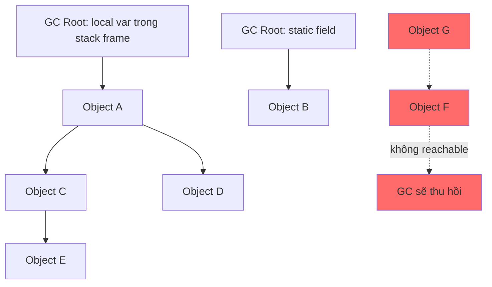
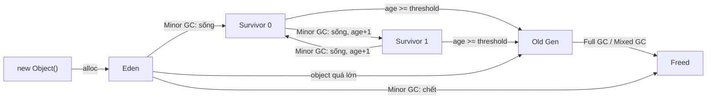
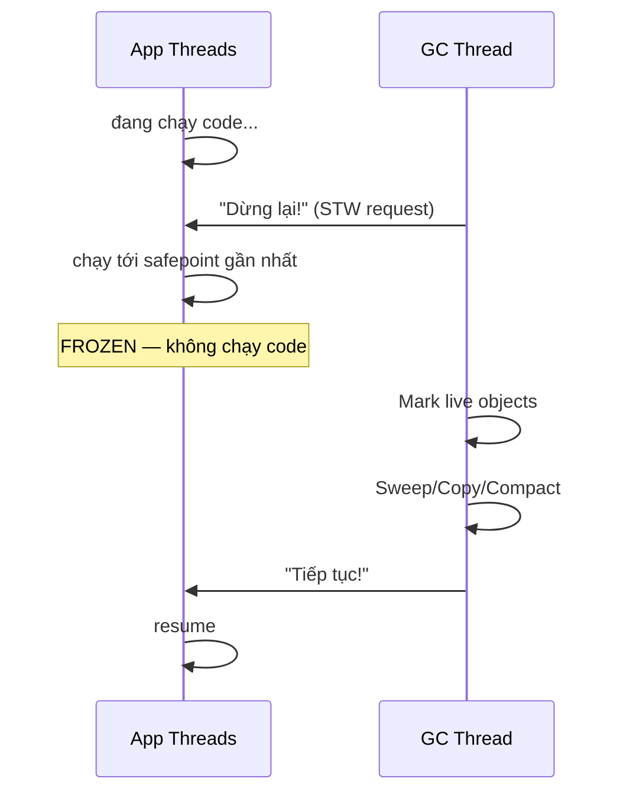
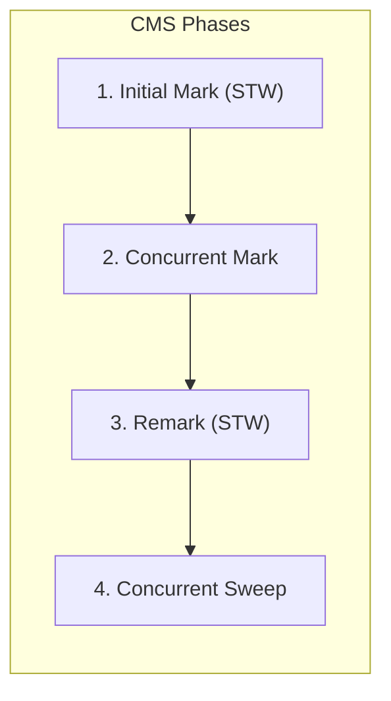
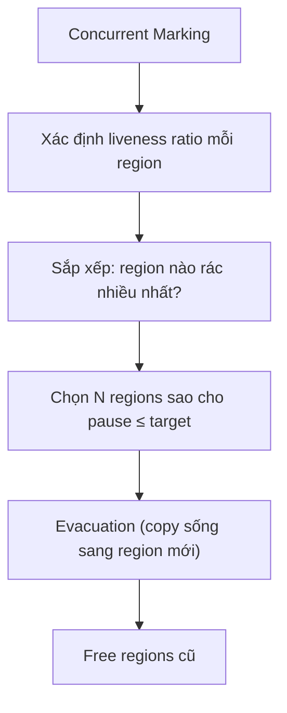

Garbage Collection tự động thu hồi vùng nhớ của object không còn reachable trong JVM. GC giúp lập trình viên không phải giải phóng từng object, nhưng vẫn tạo ra trade-off giữa throughput, pause time và memory footprint.

## Mục lục

- [Tổng quan](#1-tổng-quan)
- [GC Roots & Reachability — ai sống, ai chết?](#2-gc-roots--reachability--ai-sống-ai-chết)
- [Generational Hypothesis — vì sao chia Young/Old](#3-generational-hypothesis--vì-sao-chia-youngold)
- [Heap Layout: Eden, Survivor, Old, Metaspace](#4-heap-layout-eden-survivor-old-metaspace)
- [Ba thuật toán nền tảng: Mark-Sweep, Copying, Mark-Compact](#5-ba-thuật-toán-nền-tảng-mark-sweep-copying-mark-compact)
- [Stop-the-World — tại sao GC phải dừng ứng dụng](#6-stop-the-world--tại-sao-gc-phải-dừng-ứng-dụng)
- [Serial & Parallel Collector — thế hệ đầu](#7-serial--parallel-collector--thế-hệ-đầu)
- [CMS — Concurrent Mark Sweep (deprecated)](#8-cms--concurrent-mark-sweep-deprecated)
- [G1 — Garbage First (default từ JDK 9)](#9-g1--garbage-first-default-từ-jdk-9)
- [ZGC — Sub-millisecond pause (JDK 15+)](#10-zgc--sub-millisecond-pause-jdk-15)
- [So sánh 5 Collector](#11-so-sánh-5-collector)
- [GC Log — đọc hiểu và phân tích](#12-gc-log--đọc-hiểu-và-phân-tích)
- [Tuning thực chiến — flags quan trọng nhất](#13-tuning-thực-chiến--flags-quan-trọng-nhất)
- [Anti-patterns gây GC pressure](#14-anti-patterns-gây-gc-pressure)
- [Tóm tắt — Cheat sheet & 5 nguyên tắc](#15-tóm-tắt--cheat-sheet--5-nguyên-tắc)

---

## 1. Tổng quan

Collector xác định object còn sống từ GC Roots, sau đó áp dụng các thuật toán copy, mark, sweep hoặc compact theo cách tổ chức heap. Giả thuyết thế hệ giúp phần lớn collector xử lý object ngắn hạn và dài hạn bằng chiến lược khác nhau.

Không có collector tốt nhất cho mọi hệ thống. Việc chọn và tuning phải dựa trên mục tiêu latency, kích thước heap, allocation rate và dữ liệu từ GC log thay vì chỉ thay đổi flag theo kinh nghiệm.

## 2. GC Roots & Reachability — ai sống, ai chết?

GC xác định object **sống** hay **chết** bằng **reachability analysis** (không dùng reference counting như Python):



**GC Roots** — tập hợp gốc mà GC bắt đầu duyệt:

| GC Root | Ví dụ |
|---------|-------|
| Local variables trong stack frame | Biến `order` trong method đang chạy |
| Active thread (Thread object) | Thread pool thread |
| Static fields của loaded class | `static Map<> cache` |
| JNI references | Native code giữ reference |
| Synchronized monitor | Object đang bị lock |
| Class loaded bởi system ClassLoader | `java.lang.String.class` |

**Thuật toán**: bắt đầu từ tất cả GC Roots, duyệt theo reference (BFS/DFS). Mọi object **không reachable** từ bất kỳ root nào → **eligible for collection**.

> [!WARNING]
> Object có thể vẫn **chiếm memory** dù bạn đã "xoá reference" — nếu còn một reference ẩn giữ nó (memory leak). Ví dụ điển hình: `static List<>` chỉ `add()` không bao giờ `remove()` → Old Gen đầy dần.

### 2.1. Finalization & Phantom Reference

Object có `finalize()` **không bị thu hồi ngay** — nó phải qua hàng đợi finalization (chạy bởi `FinalizerThread`), sau đó **lần GC tiếp theo** mới thực sự giải phóng. Nghĩa là object "chết" tồn tại thêm **ít nhất 1 GC cycle**.

```java
// ❌ Đừng dùng finalize() — deprecated từ JDK 9
protected void finalize() { closeConnection(); }

// ✅ Dùng try-with-resources hoặc Cleaner (JDK 9+)
Cleaner.create().register(obj, () -> closeConnection());
```

---

## 3. Generational Hypothesis — vì sao chia Young/Old

Quan sát thực nghiệm trên hầu hết ứng dụng:

> **"Most objects die young."** — 80-98% object trở thành rác ngay sau khi method kết thúc.

```text
Object lifetime distribution (typical web app):
╠══════════════════════════════╗
║  ~95% chết trong < 1 GC     ║ ← Young Generation
╠══════════════════════════════╝
╠═════╗
║ ~5% ║ sống lâu (cache, pool, singleton) ← Old Generation
╠═════╝
```

Từ đó, JVM chia heap thành **generations**:
- **Young Gen**: object mới tạo → GC thường xuyên, nhanh (chỉ scan vùng nhỏ)
- **Old Gen**: object sống qua nhiều GC cycle → GC ít thường xuyên hơn, nhưng đắt hơn

**Lợi ích**: thay vì scan **toàn bộ** heap mỗi lần, Minor GC chỉ scan Young Gen (thường < 10% heap) → pause **mili-giây** thay vì **giây**.

---

## 4. Heap Layout: Eden, Survivor, Old, Metaspace

```
┌─────────────────────────────────────────────────────────────────┐
│                          JVM Heap                               │
├────────────────────────────────────┬────────────────────────────┤
│          Young Generation          │       Old Generation       │
├───────────────┬────────┬───────────┤                            │
│     Eden      │  S0    │    S1     │          Tenured           │
│  (new objects)│(from)  │  (to)     │    (long-lived objects)    │
│    ~80%       │ ~10%   │  ~10%     │                            │
├───────────────┴────────┴───────────┴────────────────────────────┤
│                        Metaspace (off-heap)                     │
│              Class metadata, method bytecode, constant pool     │
└─────────────────────────────────────────────────────────────────┘
```

| Vùng | Kích thước mặc định | Vai trò |
|------|---------------------|---------|
| Eden | ~80% Young Gen | Object mới được allocate ở đây |
| Survivor 0, 1 | ~10% mỗi cái | Object sống qua Minor GC được copy qua lại |
| Old (Tenured) | ~⅔ total heap | Object sống qua `MaxTenuringThreshold` lần GC |
| Metaspace | Không giới hạn (native) | Class metadata — thay PermGen từ JDK 8 |

### 4.1. Object lifecycle flow



> [!NOTE]
> `MaxTenuringThreshold` mặc định là **15** (G1) hoặc **6** (CMS). JVM có thể **tự động giảm** threshold nếu Survivor space quá chật (dynamic age computation). Object rất lớn (> `PretenureSizeThreshold`) vào thẳng Old Gen — tránh copy chi phí cao.

---

## 5. Ba thuật toán nền tảng: Mark-Sweep, Copying, Mark-Compact

### 5.1. Mark-Sweep

```
Phase 1 — Mark: duyệt từ GC Roots, đánh dấu object sống
Phase 2 — Sweep: quét toàn bộ heap, giải phóng object không đánh dấu

Trước:  [A][B][C][D][E][F]   (B,D,F không reachable)
Mark:   [A*][ ][C*][ ][E*][ ]
Sweep:  [A][ ̻][C][ ̻][E][ ̻]   ← các "lỗ hổng" = fragmentation
```

**Ưu điểm**: không di chuyển object → pointer không đổi.
**Nhược điểm**: **fragmentation** — nhiều mảnh nhớ rời rạc, không allocate được object lớn dù tổng free đủ.

### 5.2. Copying (Young Gen dùng)

```
Chia heap thành 2 nửa: From-space / To-space
Copy object sống từ From → To (liên tục, không fragmentation)
Swap 2 nửa

From:  [A][B][C][D][E]   (B,D chết)
To:    [A][C][E][  ][  ]  ← compact, liên tục, nhanh
```

**Ưu điểm**: không fragmentation, allocate nhanh (bump pointer), chi phí tỉ lệ với **object sống** (không phải tổng heap).
**Nhược điểm**: tốn **50% space** cho To-space. Nhưng vì 95% object trong Young Gen chết → copy rất ít → cực nhanh.

> [!TIP]
> Đây là lý do Eden:S0:S1 = 8:1:1 — Survivor nhỏ vì rất ít object sống qua mỗi Minor GC. JVM chỉ cần copy ~5% từ Eden sang Survivor.

### 5.3. Mark-Compact (Old Gen dùng)

```
Phase 1 — Mark: đánh dấu object sống
Phase 2 — Compact: dồn object sống về đầu heap

Trước:  [A][ ][C][ ][E][ ]
Compact: [A][C][E][     free     ]   ← liên tục, không fragmentation
```

**Ưu điểm**: không fragmentation + không tốn 50% space.
**Nhược điểm**: phải **di chuyển** object + **cập nhật** mọi pointer trỏ vào chúng → chậm hơn, cần STW lâu.

---

## 6. Stop-the-World — tại sao GC phải dừng ứng dụng

**Stop-the-World (STW)**: JVM yêu cầu **tất cả** application thread dừng lại tại **safepoint** trước khi GC bắt đầu.



**Tại sao cần STW?** Nếu app thread tiếp tục chạy:
- Có thể tạo reference mới (GC đánh dấu sai "chết")
- Có thể xoá reference (GC giữ nhầm "sống")
- Object di chuyển (compact) mà pointer chưa cập nhật → crash

**Safepoint**: điểm trong code mà JVM biết chính xác tất cả reference (vd cuối mỗi method call, cuối mỗi loop iteration). Thread đến safepoint thì dừng.

> [!WARNING]
> STW pause = **tất cả** thread dừng, kể cả thread xử lý request. Pause 12s = mất 12s throughput. Đây là lý do collector hiện đại (G1, ZGC) cố gắng **giảm STW** xuống tối thiểu bằng concurrent marking.

---

## 7. Serial & Parallel Collector — thế hệ đầu

### 7.1. Serial GC (`-XX:+UseSerialGC`)

- **1 thread** cho cả Minor và Full GC
- STW toàn bộ thời gian GC
- Young Gen: copying. Old Gen: mark-compact
- Dùng cho: app nhỏ, client-mode, single-core

### 7.2. Parallel GC (`-XX:+UseParallelGC`) — default JDK 8

- **Nhiều thread GC** song song → giảm pause trên multi-core
- Young Gen: parallel copying. Old Gen: parallel mark-compact
- Vẫn **STW** toàn bộ — chỉ rút ngắn thời gian pause nhờ multi-thread

```text
Serial:    |----Mark----|----Compact----|   (1 thread, 200ms)
Parallel:  |--Mark--|--Compact--|            (8 threads, ~50ms)
```

| Flag | Ý nghĩa |
|------|---------|
| `-XX:ParallelGCThreads=N` | Số thread GC (default = CPU cores) |
| `-XX:MaxGCPauseMillis=200` | Target pause (JVM tự adjust heap) |
| `-XX:GCTimeRatio=99` | App/GC time ratio (99 = GC chiếm ≤1%) |

> [!NOTE]
> Parallel GC tối ưu **throughput** (tổng công việc / thời gian) — phù hợp batch processing, chấp nhận pause dài miễn tổng thời gian GC thấp. Không phù hợp latency-sensitive service.

---

## 8. CMS — Concurrent Mark Sweep (deprecated)

CMS (Concurrent Mark Sweep) là collector đầu tiên làm phần **mark** song song với app:



| Phase | STW? | Làm gì |
|-------|------|--------|
| Initial Mark | **Có** (rất ngắn) | Mark objects trực tiếp từ GC Roots |
| Concurrent Mark | Không | Trace từ roots xuống — app vẫn chạy |
| Remark | **Có** (ngắn) | Fix lại reference thay đổi trong concurrent mark |
| Concurrent Sweep | Không | Giải phóng dead objects — app vẫn chạy |

**Ưu điểm**: STW cực ngắn (chỉ Initial Mark + Remark, ~10-50ms).
**Nhược điểm nghiêm trọng**:
- **Không compact** → fragmentation tích tụ → cuối cùng trigger **Full GC** (fallback Serial, STW dài)
- **Floating garbage**: object chết trong lúc concurrent mark sẽ sống thêm 1 cycle
- **CPU hungry**: concurrent threads cạnh tranh CPU với app

> [!WARNING]
> CMS bị **deprecated** từ JDK 9, **removed** từ JDK 14. Nếu bạn đang dùng CMS → migrate sang **G1** hoặc **ZGC** ngay.

---

## 9. G1 — Garbage First (default từ JDK 9)

### 9.1. Region-based layout

G1 chia heap thành **hàng trăm regions** cùng kích thước (1-32MB), mỗi region có thể là Eden/Survivor/Old/Humongous:

```
┌───┬───┬───┬───┬───┬───┬───┬───┬───┬───┬───┬───┐
│ E │ E │ E │ S │ O │ O │ H │ H │ O │ E │ F │ F │
└───┴───┴───┴───┴───┴───┴───┴───┴───┴───┴───┴───┘
E = Eden, S = Survivor, O = Old, H = Humongous, F = Free
```

**Khác biệt lớn với Parallel/CMS**: G1 **không** cần Young/Old liền mạch. Regions linh hoạt — một region Free có thể trở thành Eden hoặc Old tuỳ nhu cầu.

### 9.2. Mixed GC — chỉ thu regions "rác nhiều nhất"



G1 **chọn** regions có nhiều rác nhất (**"garbage first"**) để thu — đạt hiệu quả tối đa trong target pause time.

### 9.3. Các phase của G1

| Phase | STW? | Mô tả |
|-------|------|-------|
| Young GC (Evacuation) | **Có** (~5-15ms) | Copy sống từ Eden/Survivor → Survivor/Old |
| Concurrent Mark | Không | Trace reachability trên Old regions |
| Remark | **Có** (ngắn) | Finalize marking, process references |
| Cleanup | **Có** (rất ngắn) | Identify fully-empty regions |
| Mixed GC | **Có** (~15-30ms) | Evacuate Young + selected Old regions |

### 9.4. Remembered Set & Card Table

Vấn đề: khi GC Young Gen, làm sao biết Old Gen có reference tới Young?

G1 dùng **Remembered Set (RSet)**: mỗi region giữ set "ai trỏ vào tôi". Khi GC một region, chỉ cần scan RSet thay vì toàn bộ heap:

```
Region A (Old) có field trỏ tới Region B (Young)
→ Region B's RSet ghi nhận: "Region A, offset X trỏ vào tôi"
→ Minor GC chỉ scan roots + RSets → không cần scan toàn Old
```

**Write barrier**: mỗi lần app ghi reference (`obj.field = other`), JVM insert code kiểm tra cross-region reference → cập nhật RSet. Đây là overhead của G1 (~5-10% throughput).

### 9.5. SATB Write Barrier — Snapshot-At-The-Beginning

G1 dùng **SATB** (Snapshot-At-The-Beginning) cho concurrent marking: lưu snapshot trạng thái reference tại thời điểm mark bắt đầu.

**Vấn đề:** Khi concurrent mark đang chạy, app thread có thể xóa reference → GC mất track object (false negative → object sống bị thu nhầm!)

**Giải pháp:** SATB write barrier — mỗi khi app **overwrite** một reference field:

```java
// Pseudo-code SATB write barrier (injected by JIT):
void fieldStore(Object obj, Object newRef) {
    Object oldRef = obj.field;       // đọc ref CŨ
    if (marking_active) {
        SATB_enqueue(oldRef);        // lưu ref cũ vào SATB buffer
    }
    obj.field = newRef;              // ghi ref mới (actual store)
}
```

**Flow:**
1. App ghi `obj.field = newRef`
2. Write barrier lưu **old reference** vào thread-local SATB buffer
3. GC thread drain SATB buffers → mark những objects này là reachable
4. Kết quả: GC **không bao giờ miss** object đang sống tại snapshot time

```
Thread-local SATB Buffer (per-thread):
┌─────┬─────┬─────┬─────┐
│old₁ │old₂ │old₃ │ ... │ → khi đầy → flush vào global queue
└─────┴─────┴─────┴─────┘
              ↓
GC thread: drain + mark old references → safe
```

> [!NOTE]
> SATB có thể dẫn đến **floating garbage** (object chết nhưng vẫn được giữ tới GC cycle sau). Đây là trade-off: correctness (không miss object sống) quan trọng hơn precision (thu hồi ngay mọi garbage).

> [!TIP]
> Flag `-XX:MaxGCPauseMillis=200` (default) là **target** — G1 tự adjust số region thu mỗi lần để đạt target. Giảm target = GC thường xuyên hơn, pause ngắn hơn, nhưng throughput giảm.

---

## 10. ZGC — Sub-millisecond pause (JDK 15+)

### 10.1. Thiết kế mục tiêu

ZGC hướng tới: **pause < 1ms** bất kể heap size (có thể lên **16TB**).

```text
Collector      Max pause (typical)    Heap limit
Parallel       200ms - 2s             ~32GB thực tế
G1             50-200ms               ~64GB thực tế  
ZGC            < 1ms                  16TB
```

### 10.2. Colored Pointers

ZGC lưu metadata **trong chính pointer** (dùng bit cao của 64-bit address):

```
64-bit pointer layout (ZGC):
┌──────────┬─┬─┬─┬─┬────────────────────────────────────┐
│ unused   │M│R│F│ │        Object address (42 bits)    │
└──────────┴─┴─┴─┴─┴────────────────────────────────────┘
             │ │ │
             │ │ └─ Finalizable
             │ └── Remapped
             └─── Marked (0 or 1)
```

Lợi ích: GC có thể kiểm tra trạng thái object (marked? relocated?) chỉ bằng **đọc pointer** — không cần lookup bảng phụ.

### 10.3. Load Barrier

ZGC dùng **load barrier** (thay vì write barrier): mỗi lần app **đọc** reference, JVM insert code kiểm tra pointer color:

```java
// Pseudo-code load barrier
Object ref = obj.field;              // app code
if (ref.colorBits != expectedColor)  // barrier check
    ref = zgc_slow_path(ref);        // fixup: remap/mark/relocate
```

Nếu pointer chưa được remap (object đã di chuyển) → barrier **tự cập nhật** pointer ngay lúc đọc. Kết quả: app luôn thấy pointer đúng, GC di chuyển object **concurrent** mà không cần STW dài.

### 10.4. Concurrent phases

```
ZGC: gần như MỌI THỨ concurrent
┌─────────────────────────────────────────────────────────┐
│ Pause Mark Start (<1ms)                                 │
│ Concurrent Mark & Remap                                 │
│ Pause Mark End (<1ms)                                   │
│ Concurrent Relocate                                     │
│ (app thread tự fixup khi đọc qua load barrier)          │
└─────────────────────────────────────────────────────────┘
STW chỉ ở 2 điểm: Mark Start + Mark End → tổng < 1ms
```

> [!IMPORTANT]
> ZGC đạt pause < 1ms bằng cách: **(1)** concurrent mark, **(2)** concurrent relocate, **(3)** load barrier self-healing pointer. Trade-off: throughput giảm ~5-15% so với Parallel do barrier overhead. Nhưng cho latency-sensitive service, đây là "near-free" GC.

### 10.5. Generational ZGC (JDK 21+)

JDK 21 thêm **Generational ZGC** — kết hợp generational hypothesis + ZGC:

```bash
java -XX:+UseZGC -XX:+ZGenerational MyApp    # JDK 21
java -XX:+UseZGC MyApp                        # JDK 23+ (generational là default)
```

Young objects thu gom thường xuyên hơn (nhỏ, nhanh), Old objects ít hơn → giảm work tổng thể, tăng throughput so với non-generational ZGC.

---

## 11. So sánh 5 Collector

| Tiêu chí | Serial | Parallel | CMS | G1 | ZGC |
|----------|--------|----------|-----|----|----|
| STW pause | Dài | Trung bình | Ngắn (nhưng fragmentation → Full GC) | **Target-based** (~200ms) | **< 1ms** |
| Throughput | Thấp | **Cao nhất** | Trung bình | Tốt | Giảm ~5-15% |
| Heap size phù hợp | < 256MB | 1-8GB | 2-16GB | 4-64GB | **4GB - 16TB** |
| Fragmentation | Không (compact) | Không (compact) | **Có** (sweep) | Không (evacuate) | Không (relocate) |
| Concurrent | Không | Không | **Có** (mark+sweep) | **Có** (mark) | **Gần như toàn bộ** |
| Default JDK | — | JDK 8 | — (removed JDK 14) | **JDK 9-20** | JDK 21+ (gen) |
| Use case | Embedded, client | Batch, throughput | (Legacy) | **General purpose** | Ultra-low latency |

> [!TIP]
> **Chọn nhanh**: Batch job cần throughput → Parallel. Service cần latency ổn → G1. Service cần p99 < 10ms hoặc heap > 32GB → ZGC. Không chắc → G1 (default, an toàn).

---

## 12. GC Log — đọc hiểu và phân tích

### 12.1. Bật GC log

```bash
# JDK 9+ (Unified Logging)
java -Xlog:gc*:file=gc.log:time,level,tags -jar app.jar

# Chi tiết hơn:
java -Xlog:gc*,gc+heap=debug,gc+phases=debug:file=gc.log:time,uptime,level,tags
```

### 12.2. Đọc G1 log

```text
[0.523s][info][gc] GC(3) Pause Young (Normal) (G1 Evacuation Pause)
[0.523s][info][gc] GC(3)   Eden: 24M(24M)->0B(24M) Survivors: 4M->4M Heap: 45M(256M)->29M(256M)
[0.523s][info][gc] GC(3) Pause Young (Normal) (G1 Evacuation Pause) 16M->5M(256M) 8.234ms
```

Giải mã:
- `Pause Young (Normal)`: Minor GC, chỉ Young regions
- `Eden: 24M→0B`: Eden clear hết (copy sống sang Survivor)
- `Heap: 45M→29M(256M)`: Tổng heap giảm từ 45MB xuống 29MB (max 256MB)
- `8.234ms`: **pause time** — thời gian STW

### 12.3. Dấu hiệu cần attention

| Pattern trong log | Nghĩa | Hành động |
|-------------------|-------|-----------|
| `Pause Full` | Full GC — STW rất dài | Tăng heap, check memory leak |
| `To-space exhausted` | Survivor/Old đầy, không có nơi evacuate | Tăng heap hoặc giảm allocation rate |
| `Concurrent Mark Abort` | Marking không kịp → fallback Full GC | Tăng `-XX:InitiatingHeapOccupancyPercent` |
| `Humongous allocation` | Object > 50% region → allocate đặc biệt | Giảm object size hoặc tăng region size |
| GC frequency > 1/s | GC quá thường xuyên | Tăng Young Gen hoặc giảm allocation rate |

---

## 13. Tuning thực chiến — flags quan trọng nhất

### 13.1. Heap sizing

```bash
java -Xms4g -Xmx4g     # Min = Max → tránh resize heap runtime
     -XX:NewRatio=2     # Old:Young = 2:1 (Young = 1/3 heap)
     -jar app.jar
```

> [!IMPORTANT]
> **Luôn set Xms = Xmx** cho production. Nếu khác nhau, JVM phải resize heap (allocate/release memory từ OS) — tốn thời gian và unpredictable.

### 13.2. G1 tuning

```bash
java -XX:+UseG1GC
     -XX:MaxGCPauseMillis=100          # Target pause 100ms
     -XX:InitiatingHeapOccupancyPercent=45  # Bắt đầu concurrent mark khi heap 45%
     -XX:G1HeapRegionSize=16m          # Region 16MB (heap lớn)
     -XX:G1ReservePercent=15           # Reserve 15% heap cho evacuation
     -jar app.jar
```

### 13.3. ZGC tuning

```bash
java -XX:+UseZGC
     -XX:+ZGenerational               # Generational ZGC (JDK 21)
     -XX:SoftMaxHeapSize=4g           # ZGC giữ heap ≤ 4GB nếu có thể
     -Xmx8g                           # Hard limit 8GB
     -jar app.jar
```

ZGC cần ít tuning — chủ yếu set heap đủ lớn (rule of thumb: **2-3x live data set**).

### 13.4. Diagnostic flags

```bash
-XX:+HeapDumpOnOutOfMemoryError       # Auto dump khi OOM
-XX:HeapDumpPath=/var/dumps/           # Nơi lưu heap dump
-XX:+PrintGCApplicationStoppedTime    # Log thời gian app bị dừng
-XX:NativeMemoryTracking=summary      # Track native memory
```

---

## 14. Anti-patterns gây GC pressure

| Anti-pattern | GC impact | Giải pháp |
|--------------|-----------|-----------|
| Allocate triệu object nhỏ trong tight loop | Young Gen đầy → Minor GC liên tục | Object pooling, primitive array, varargs |
| `String` concatenation trong loop (pre-JDK 9) | Tạo `StringBuilder` + `String` mỗi iteration | `StringBuilder` explicit |
| Giữ `static List<>` chỉ add không remove | Old Gen đầy → Full GC | Bounded cache (Caffeine, LRU) |
| Large array resize (`ArrayList.add` triệu lần) | Copy mảng cũ → GC rác + tốn CPU | Pre-size `new ArrayList<>(n)` |
| Autoboxing trong hot path (`Map<Integer, Integer>`) | Mỗi `int` → `Integer` object | Primitive map (Eclipse Collections, HPPC) |
| `finalize()` | Object sống thêm 1+ GC cycle | `Cleaner` hoặc try-with-resources |
| Premature promotion (Young quá nhỏ) | Short-lived object vào Old → Full GC | Tăng Young Gen (`-XX:NewRatio`) |

```java
// ❌ Allocation storm — 1M String objects
String result = "";
for (int i = 0; i < 1_000_000; i++) {
    result += i;    // mỗi += tạo StringBuilder + String mới
}

// ✅ 1 allocation
StringBuilder sb = new StringBuilder(7_000_000);
for (int i = 0; i < 1_000_000; i++) {
    sb.append(i);
}
String result = sb.toString();
```

> [!TIP]
> Tool phân tích GC: **GCViewer**, **GCEasy.io** (upload GC log), **JFR** (Java Flight Recorder) + **JMC** (Mission Control). Luôn bật GC log trên production — overhead gần bằng 0, nhưng là cứu cánh khi troubleshoot.

---

## 15. Tóm tắt — Cheat sheet & 5 nguyên tắc

**Cỗ máy trong 6 dòng:**

```
1. GC xác định sống/chết bằng reachability từ GC Roots (không phải ref counting)
2. Heap chia Young (Eden+Survivor) / Old — 95% object chết ở Young
3. Minor GC = copying trong Young (~ms). Full GC = compact Old (~s)
4. G1: region-based, target pause, mixed GC chọn regions rác nhiều nhất
5. ZGC: colored pointer + load barrier → concurrent relocate → pause < 1ms
6. GC log là nguồn truth duy nhất — luôn bật, đọc hiểu pattern
```

| Collector | Khi nào chọn |
|-----------|-------------|
| Parallel | Batch job, throughput is king |
| G1 | General purpose, latency cần ≤ 200ms |
| ZGC | Ultra-low latency, heap > 32GB, p99 < 10ms |

**5 nguyên tắc khắc cốt:**

1. **Xms = Xmx** — loại bỏ heap resize runtime.
2. **Hiểu allocation rate** — GC pressure ∝ tốc độ tạo object mới. Giảm allocation = giảm GC.
3. **Object sống ngắn là tốt** — chết ở Young Gen = Minor GC rẻ. Sống lâu vô lý = Old Gen pressure.
4. **Luôn bật GC log** — overhead gần 0, troubleshoot cực nhanh khi sự cố.
5. **Đừng tune mù** — đo trước (baseline), đổi 1 flag, đo lại. Không bao giờ copy-paste flags từ Stack Overflow.

> [!TIP]
> Một câu để nhớ: *GC nhanh khi bạn tạo ít rác, để rác chết sớm, và cho collector đủ room để làm việc. Mọi vấn đề GC production, lần ngược lại, gần như luôn quy về allocation rate quá cao hoặc memory leak khiến Old Gen nghẹt.*
