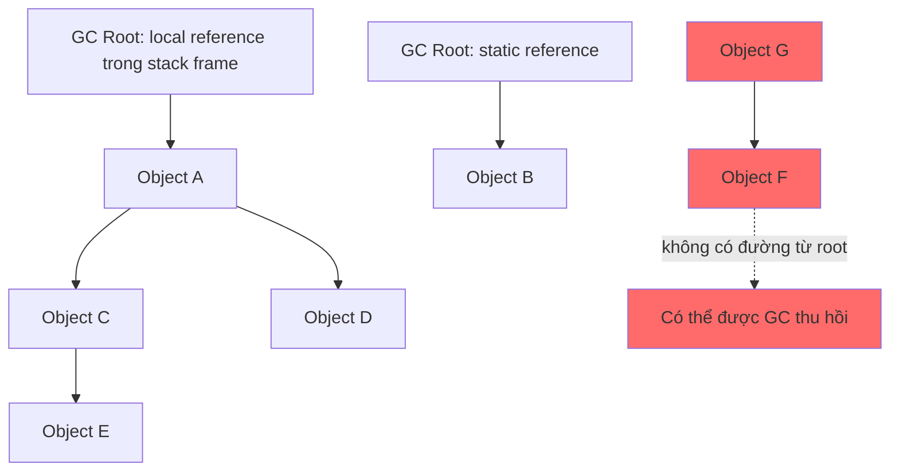
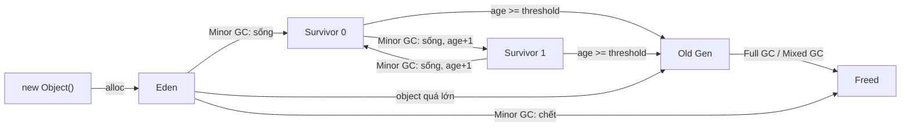
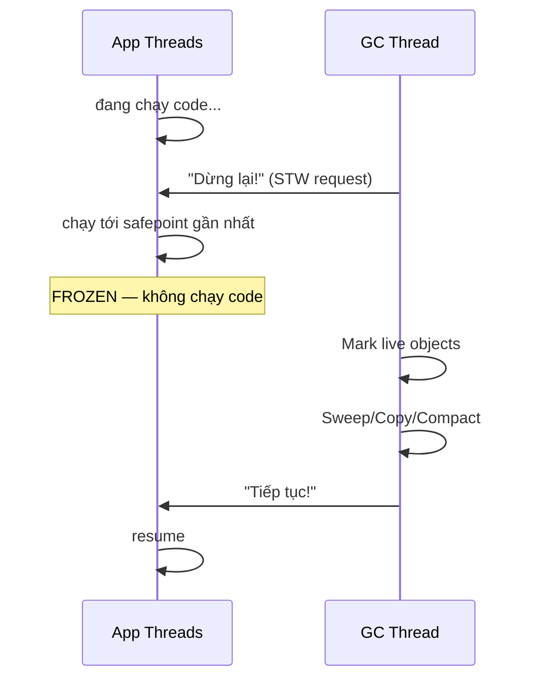
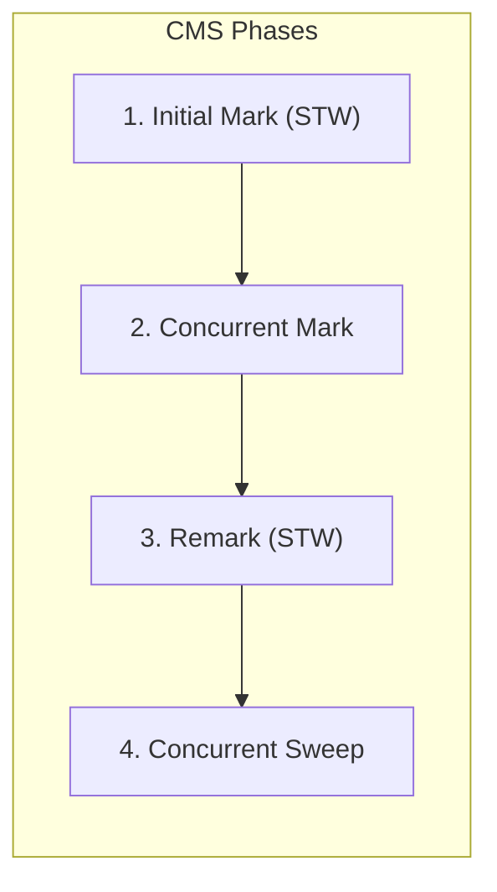
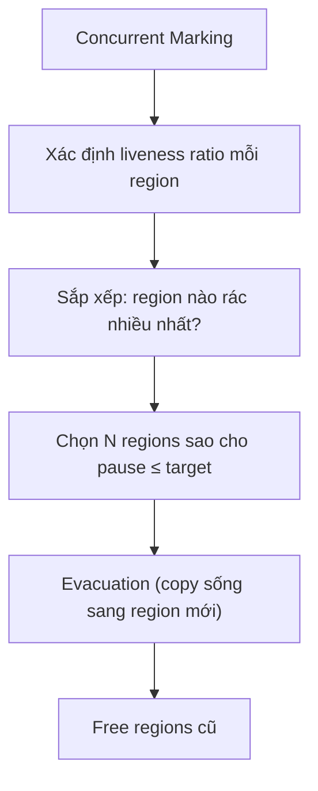

Garbage Collection tự động thu hồi vùng nhớ của object không còn reachable trong JVM. GC giúp lập trình viên không phải giải phóng từng object, nhưng vẫn tạo ra trade-off giữa throughput, pause time và memory footprint.

## Mục lục

- [Tổng quan](#1-tổng-quan)
- [GC Roots & Reachability — ai sống, ai chết?](#2-gc-roots--reachability--ai-sống-ai-chết)
- [Generational Hypothesis — vì sao chia Young/Old](#3-generational-hypothesis--vì-sao-chia-youngold)
- [Heap Layout: Eden, Survivor, Old, Metaspace](#4-heap-layout-eden-survivor-old-metaspace)
- [Ba thuật toán nền tảng: Mark-Sweep, Copying, Mark-Compact](#5-ba-thuật-toán-nền-tảng-mark-sweep-copying-mark-compact)
- [Stop-the-World — tại sao GC phải dừng ứng dụng](#6-stop-the-world--tại-sao-gc-phải-dừng-ứng-dụng)
- [Serial & Parallel Collector — thế hệ đầu](#7-serial--parallel-collector--thế-hệ-đầu)
- [CMS — Concurrent Mark Sweep (deprecated)](#8-cms--concurrent-mark-sweep-deprecated)
- [G1 — Garbage First (default từ JDK 9)](#9-g1--garbage-first-default-từ-jdk-9)
- [ZGC — Sub-millisecond pause (JDK 15+)](#10-zgc--sub-millisecond-pause-jdk-15)
- [So sánh 5 Collector](#11-so-sánh-5-collector)
- [GC Log — đọc hiểu và phân tích](#12-gc-log--đọc-hiểu-và-phân-tích)
- [Tuning thực chiến — flags quan trọng nhất](#13-tuning-thực-chiến--flags-quan-trọng-nhất)
- [Anti-patterns gây GC pressure](#14-anti-patterns-gây-gc-pressure)
- [Tóm tắt — Cheat sheet & 5 nguyên tắc](#15-tóm-tắt--cheat-sheet--5-nguyên-tắc)

---

## 1. Tổng quan

Collector xác định object còn sống từ GC Roots, sau đó áp dụng các thuật toán copy, mark, sweep hoặc compact theo cách tổ chức heap. Giả thuyết thế hệ giúp phần lớn collector xử lý object ngắn hạn và dài hạn bằng chiến lược khác nhau.

Không có collector tốt nhất cho mọi hệ thống. Việc chọn và tuning phải dựa trên mục tiêu latency, kích thước heap, allocation rate và dữ liệu từ GC log thay vì chỉ thay đổi flag theo kinh nghiệm.

## 2. GC Roots & Reachability — ai sống, ai chết?

### 2.1. GC Root là biến nào trong code?

> [!IMPORTANT]
> **Không có biến đặc biệt nào tên hoặc kiểu là `GC Root`.** Một biến trở thành **nguồn GC Root** vì vị trí mà reference của nó đang được lưu, không phải vì tên, kiểu dữ liệu hay annotation.

Xét trực tiếp đoạn code sau:

```java
class OrderService {
    // (1) CACHE: static reference → nguồn GC Root khi class còn được load
    static final List<Order> CACHE = new ArrayList<>();

    void process() {
        // (2) order: local reference → nguồn GC Root khi method đang chạy
        Order order = new Order();

        // (3) customer: cũng là local reference → nguồn GC Root khi còn được dùng
        Customer customer = order.customer();

        // Phần tử nằm trong ArrayList KHÔNG phải root
        CACHE.add(order);
        sendEmail(customer);
    }
}
```

Trong ví dụ này, câu trả lời cho “biến nào là GC Root?” là:

| Thành phần | Là nguồn GC Root? | Lý do |
|------------|-------------------|-------|
| Static reference `CACHE` | **Có** | JVM có thể bắt đầu từ static field của class đang được load |
| Local reference `order` | **Có**, khi còn live trong method | JVM có thể bắt đầu từ slot `order` trong stack frame đang chạy |
| Local reference `customer` | **Có**, khi còn live trong method | Nó cũng nằm trong stack frame đang chạy |
| Object tạo bởi `new Order()` | **Không** | Đây là object trong Heap được `order` trỏ tới |
| Field bên trong object `Order` | **Không** | GC chỉ thấy field này sau khi đã đi tới object `Order` |
| Phần tử `Order` bên trong `CACHE` | **Không** | Đây là reference thông thường bên trong `ArrayList` |
| Biến primitive như `int count` | **Không** | Primitive không trỏ tới object nào trong Heap |

Có thể hình dung Heap nằm bên phải đường phân cách:

```text
        NƠI JVM BẮT ĐẦU                         HEAP

[stack slot: order] ────────────────────────→ [Order object]
      GC Root                                    │
                                                 └──→ [Customer object]

[static slot: CACHE] ───────────────────────→ [ArrayList object]
      GC Root                                    │
                                                 └──→ [Order object]
```

**GC Root là nơi bắt đầu mũi tên ở bên trái, không phải object `Order` hay `ArrayList` ở bên phải.** Nói ngắn gọn:

> GC Root = reference mà JVM có thể lấy ra trực tiếp từ trạng thái thực thi như stack, static storage, thread hoặc JNI, thay vì phải đi qua một object khác trong Heap.

Khi `process()` kết thúc, stack frame bị xóa nên hai nguồn root `order` và `customer` biến mất. Nhưng object `Order` vẫn sống vì còn đường khác:

```text
static root CACHE → ArrayList → Order
```

Nếu gọi `CACHE.clear()` và không còn root nào khác dẫn tới `Order`, object đó mới trở thành đối tượng có thể được GC thu hồi.

> [!NOTE]
> Nói chính xác ở mức JVM, root là **slot/handle đang chứa reference**, không phải cái tên `order` hay `CACHE`. Các tên biến chỉ giúp lập trình viên nhận ra slot đó trong source code. Heap dump tool đôi khi gọi luôn object được slot trỏ tới là “GC Root”, nên cách hiển thị có thể gây nhầm.

### 2.2. JVM dùng GC Roots như thế nào?

GC xác định object **sống** hay **chết** bằng **reachability analysis** (không dùng reference counting):



Trong sơ đồ, `A`, `B`, `C`, `D`, `E` sống vì có ít nhất một đường đi từ GC Root. `F` và `G` có thể tham chiếu lẫn nhau nhưng vẫn chết vì cả cụm không có đường đi từ bất kỳ root nào.

Các nguồn GC Root phổ biến:

| Nguồn GC Root | Ví dụ | Root tồn tại trong bao lâu? |
|----------------|-------|-----------------------------|
| Local reference trong stack frame | Biến `order` của method đang chạy | Đến khi JVM không còn cần slot đó hoặc stack frame kết thúc |
| Active thread | Thread pool worker chưa dừng | Trong khi thread còn được JVM xem là active |
| Static reference của loaded class | `static Map<String, User> cache` | Thường đến khi class được unload hoặc field được gán lại |
| JNI global/local reference | Native code giữ Java object | Đến khi native code xóa handle hoặc native frame kết thúc |
| JVM internal reference | System class, class loader, một số VM structure | Theo vòng đời structure tương ứng trong JVM |
| Monitor đang được JVM sử dụng | Object liên quan đến synchronization đang hoạt động | Trong thời gian JVM còn cần monitor đó |

**Thuật toán khái niệm**:

1. JVM chụp tập GC Roots tại thời điểm phù hợp.
2. Đánh dấu object được các root trỏ trực tiếp tới.
3. Duyệt tiếp toàn bộ reference từ các object đã đánh dấu.
4. Object nào không được đánh dấu, tức không có đường từ root, thì **eligible for collection**.

> [!IMPORTANT]
> “Eligible for collection” nghĩa là GC **được phép** thu hồi, không đảm bảo object sẽ được thu hồi ngay lập tức. Thời điểm thực tế phụ thuộc collector và chu kỳ GC.

> [!WARNING]
> Object có thể vẫn **chiếm memory** dù ứng dụng không còn cần nó nếu vẫn có đường reference từ một GC Root — đây là bản chất của memory leak trong Java. Ví dụ: `static List<>` chỉ `add()` mà không `remove()` sẽ giữ toàn bộ phần tử sống.

### 2.3. Finalization & Phantom Reference

Object có `finalize()` **không bị thu hồi ngay** — nó phải qua hàng đợi finalization (chạy bởi `FinalizerThread`), sau đó **lần GC tiếp theo** mới thực sự giải phóng. Nghĩa là object "chết" tồn tại thêm **ít nhất 1 GC cycle**.

```java
// ❌ Đừng dùng finalize() — deprecated từ JDK 9
protected void finalize() { closeConnection(); }

// ✅ Dùng try-with-resources hoặc Cleaner (JDK 9+)
Cleaner.create().register(obj, () -> closeConnection());
```

---

## 3. Generational Hypothesis — vì sao chia Young/Old

Quan sát thực nghiệm trên hầu hết ứng dụng:

> **"Most objects die young."** — 80-98% object trở thành rác ngay sau khi method kết thúc.

```text
Object lifetime distribution (typical web app):
╠══════════════════════════════╗
║  ~95% chết trong < 1 GC     ║ ← Young Generation
╠══════════════════════════════╝
╠═════╗
║ ~5% ║ sống lâu (cache, pool, singleton) ← Old Generation
╠═════╝
```

Từ đó, JVM chia heap thành **generations**:
- **Young Gen**: object mới tạo → GC thường xuyên, nhanh (chỉ scan vùng nhỏ)
- **Old Gen**: object sống qua nhiều GC cycle → GC ít thường xuyên hơn, nhưng đắt hơn

**Lợi ích**: thay vì scan **toàn bộ** heap mỗi lần, Minor GC chỉ scan Young Gen (thường < 10% heap) → pause **mili-giây** thay vì **giây**.

---

## 4. Heap Layout: Eden, Survivor, Old, Metaspace

```
┌─────────────────────────────────────────────────────────────────┐
│                          JVM Heap                               │
├────────────────────────────────────┬────────────────────────────┤
│          Young Generation          │       Old Generation       │
├───────────────┬────────┬───────────┤                            │
│     Eden      │  S0    │    S1     │          Tenured           │
│  (new objects)│(from)  │  (to)     │    (long-lived objects)    │
│    ~80%       │ ~10%   │  ~10%     │                            │
├───────────────┴────────┴───────────┴────────────────────────────┤
│                        Metaspace (off-heap)                     │
│              Class metadata, method bytecode, constant pool     │
└─────────────────────────────────────────────────────────────────┘
```

| Vùng | Kích thước mặc định | Vai trò |
|------|---------------------|---------|
| Eden | ~80% Young Gen | Object mới được allocate ở đây |
| Survivor 0, 1 | ~10% mỗi cái | Object sống qua Minor GC được copy qua lại |
| Old (Tenured) | ~⅔ total heap | Object sống qua `MaxTenuringThreshold` lần GC |
| Metaspace | Không giới hạn (native) | Class metadata — thay PermGen từ JDK 8 |

### 4.1. Object lifecycle flow



> [!NOTE]
> `MaxTenuringThreshold` mặc định là **15** (G1) hoặc **6** (CMS). JVM có thể **tự động giảm** threshold nếu Survivor space quá chật (dynamic age computation). Object rất lớn (> `PretenureSizeThreshold`) vào thẳng Old Gen — tránh copy chi phí cao.

---

## 5. Ba thuật toán nền tảng: Mark-Sweep, Copying, Mark-Compact

Cả ba thuật toán giải quyết **cùng một bài toán**: thu hồi memory của object chết, nhưng làm sao cho phần memory còn lại **vẫn cấp phát nhanh được**. Không thuật toán nào làm trọn vẹn cả hai — mỗi cái phải trả giá bằng một thứ khác nhau. Nắm được sự đánh đổi này thì mọi collector phía sau (CMS, G1, ZGC) đều chỉ là biến thể của chính ba thuật toán nền này.

### 5.1. Bài toán thật sự: cấp phát object cần vùng nhớ LIỀN MẠCH

Điểm mấu chốt dễ bị bỏ qua: khi code gọi `new byte[1_000_000]`, JVM cần **một khối 1MB nằm liền nhau** trong heap. Không thể gom 1MB rải rác từ nhiều hốc nhỏ ở các vị trí khác nhau.

Nhờ yêu cầu "liền mạch" đó, khi heap còn một vùng trống lớn, cấp phát cực nhanh. JVM chỉ giữ một con trỏ `ptr` trỏ tới đầu vùng trống:

```text
Heap trống:  [ptr...............................]

new A() → đặt A ngay tại ptr, đẩy ptr lên:  [A][ptr........]
new B() → đặt B ngay tại ptr, đẩy ptr lên:  [A][B][ptr.....]
```

Mỗi lần `new` chỉ tốn vài lệnh CPU — kỹ thuật này gọi là **bump-the-pointer** (tăng con trỏ). Đây là lý do `new` trong Java nhanh gần bằng cấp phát trên stack.

Nhưng mọi thứ đổ vỡ khi vùng trống **bị chia nhỏ thành nhiều hốc** — gọi là **fragmentation** (phân mảnh):

```text
Heap 10MB sau một thời gian chạy:

[A][ trống 0.5MB ][B][ trống 0.3MB ][C][ trống 0.2MB ][D]...

Tổng chỗ trống:    1MB  ✓
Hố trống lớn nhất: 0.5MB ✗
→ new byte[1MB] → OutOfMemoryError, dù "heap còn 1MB trống"!
```

> [!WARNING]
> **OutOfMemoryError dù heap vẫn còn chỗ trống** không phải lý thuyết suông. Collector CMS (mục 8) dùng Mark-Sweep nên không bao giờ dồn object — chạy càng lâu càng phân mảnh, đến một lúc không còn hố đủ lớn, CMS phải fallback về collector single-threaded kèm pause dài hàng giây. Fragmentation là một trong những lý do CMS bị deprecated từ JDK 9.

Vậy "dọn rác" thôi là chưa đủ — GC còn phải giữ cho vùng trống **liền mạch**. Ba thuật toán dưới đây là ba cách trả giá khác nhau cho yêu cầu đó.

### 5.2. Mark-Sweep — dọn rác, nhưng không dọn nhà

Hình dung một căn phòng: Mark-Sweep chỉ **nhặt rác đi**, đồ còn dùng vẫn đứng **ngay vị trí cũ**. Sàn nhà sạch — nhưng giữa các món đồ chừa lại những khoảng trống lổn nhổn.

Chạy làm 2 phase:

```text
Phase 1 — MARK: duyệt từ GC Roots, đánh dấu object sống

[A][B][C][D][E][F]
     ✗     ✗      ✗        ✗ = không reachable → coi như rác

Phase 2 — SWEEP: quét lần lượt từng ô, ô nào không đánh dấu thì trả về heap

[A][··][C][··][E][··]      ·· = ô trống rời rạc → fragmentation
```

**Ưu điểm**: không di chuyển object. Mọi reference vẫn trỏ đúng địa chỉ cũ — GC không phải sửa gì cả. Đây cũng là thuật toán đơn giản nhất.

**Nhược điểm**: phân mảnh đúng như ví dụ ở 5.1. Object chết nằm xen kẽ object sống nên sau khi sweep, chỗ trống cũng nằm xen kẽ — càng chạy lâu càng nhiều hốc nhỏ, đến lúc không hố nào đủ lớn cho một object lớn.

### 5.3. Copying — chuyển đồ sống sang nhà bên (Young Gen dùng)

Cách khác hẳn: thay vì dọn rác trong nhà, **chuyển toàn bộ đồ còn dùng sang nhà bên cạnh** và xếp liền vào từ đầu nhà. Nhà cũ bỏ luôn — rác tự biến mất mà không cần quét từng món.

Vùng nhớ được chia thành 2 nửa: **From-space** (đang chứa object) và **To-space** (luôn giữ trống):

```text
FROM: [A][B][C][D][E]        (B, D chết)
TO:   [ ................ ]   (trống)

Bước 1 — copy object SỐNG từ FROM sang TO, xếp liền tù tì từ đầu:

TO:   [A][C][E][ .......... ]

Bước 2 — FROM giờ toàn rác → xóa sổ cả nửa, rồi hoán đổi vai trò:

FROM mới (đã xóa): [ ........ ]
TO cũ:              [A][C][E][ ........ ]  ← liền mạch, dùng bump-the-pointer luôn
```

Điểm tài tình: chi phí **tỉ lệ với số object sống**, không tỉ lệ với kích thước vùng nhớ. GC không hề "đụng" tới rác — rác tự mất khi cả nửa FROM bị bỏ. Càng nhiều rác, Copying càng **rẻ** (việc gì phải copy thứ đã chết?).

Young Gen vì vậy là nơi lý tưởng cho Copying: ~95% object **chết trẻ**, mỗi Minor GC chỉ phải copy ~5% object sống sót — gần như miễn phí, đổi lại một vùng Survivor sạch bong để bump-the-pointer.

**Cái giá**: phải dành sẵn 50% không gian cho To-space mà không được dùng để đặt object. Với vùng rác nhiều thì cái giá này rẻ; nhưng với vùng mà object gần như sống hết thì Copying trở thành thảm họa (xem 5.4).

> [!TIP]
> Đây chính là lý do tỉ lệ Eden:S0:S1 = 8:1:1. Hai Survivor đóng vai From/To — nhưng mỗi vòng chỉ ~5% object sống sót nên Survivor không cần to. Eden chiếm 8/10 để việc cấp phát (bump-the-pointer) diễn ra suôn sẻ nhất có thể.

### 5.4. Mark-Compact — dồn đồ về đầu nhà (Old Gen dùng)

Cách thứ ba giống việc **dọn kho**: đánh dấu đồ còn dùng, rồi **dồn tất cả về một phía** — mọi khoảng trống tự gom lại thành một mảng lớn, liền mạch ở phía còn lại.

```text
Phase 1 — MARK: giống Mark-Sweep, đánh dấu object sống

[A][··][C][··][E][··]

Phase 2 — COMPACT: dồn object sống về đầu heap, chỗ trống gom hết về phía cuối

[A][C][E][ .................... ]
          ↑ một mảng trống LIỀN MẠCH duy nhất
```

**Ưu điểm**: hết fragmentation mà **không** phải hi sinh 50% không gian như Copying.

**Nhược điểm**: phải **di chuyển object** — và khi object di chuyển, mọi reference trỏ vào nó đều phải được **sửa lại địa chỉ**. Việc sửa phải làm lúc mọi application thread đang dừng (STW, mục 6): nếu app chạy giữa chừng mà đọc địa chỉ cũ thì crash ngay. Vì vậy Mark-Compact cho STW pause dài nhất trong ba thuật toán.

Vì sao Old Gen lại chọn cách chậm nhất này? Vì hai phương án kia còn tệ hơn với vùng "gần như ai cũng sống, mà heap lại to":

- Dùng **Copying**: object Old sống rất lâu, chết rất ít → phải copy gần như **toàn bộ** Old Gen mỗi lần GC. Chưa kể mất 50% của một vùng vài GB — quá đắt.
- Dùng **Mark-Sweep**: không tốn gì nhưng phân mảnh dần dần → premature OOM như ví dụ 5.1.
- Còn **Mark-Compact**: chậm, nhưng chạy thỉnh thoảng (Old ít khi cần GC) và kết quả luôn sạch sẽ → phương án duy nhất chấp nhận được.

### 5.5. Vì sao cần đủ cả 3 thuật toán?

Bảng so sánh toàn bộ sự đánh đổi:

|  | Mark-Sweep | Copying | Mark-Compact |
|---|---|---|---|
| Di chuyển object? | Không | Có (copy sang nửa kia) | Có (dồn tại chỗ) |
| Fragmentation? | ⚠️ **Có** | Không | Không |
| Mất thêm không gian? | Không | **50%** cho To-space | Không |
| Chi phí GC ∝ | Toàn bộ vùng (phải sweep hết) | **Chỉ object sống** | Object sống + sửa mọi reference |
| Pause / độ phức tạp | Thấp nhất | Nhanh nhất khi rác nhiều | STW dài nhất |

Không cái nào "thắng tuyệt đối" — nên JVM **ghép chúng theo đặc điểm rác của từng vùng**:

- **Nơi rác nhiều (Young Gen)** → **Copying**: chi phí chỉ tính theo object sống, mà số object sống thì ít → cực nhanh.
- **Nơi rác ít + heap lớn (Old Gen)** → **Mark-Compact**: chấp nhận STW dài đổi lấy không phân mảnh và không lãng phí 50%.
- **Nơi cần tránh di chuyển** → **Mark-Sweep**: đổi "không phá vỡ reference" lấy fragmentation — CMS đã đánh cuộc này và trả giá bằng nó.

> [!NOTE]
> Việc dồn object sống lại gần nhau (mà Copying và Mark-Compact đều làm) còn kèm hai lợi ích phụ:
> 1. **Vùng trống liền mạch** → cấp phát trở về bump-the-pointer, và các allocation lớn (`byte[10MB]`) luôn tìm được chỗ.
> 2. **CPU cache locality**: object được tạo cùng lúc thường được *truy cập* cùng lúc (object và field của nó, array và phần tử). Nằm gần nhau trong memory → nằm chung cache line → ít cache miss hơn heap phân mảnh.

Nói gọn một câu: **GC không chỉ cần "giải phóng chỗ trống" — nó cần giải phóng một vùng trống liền mạch, đủ lớn.** Ba thuật toán tồn tại vì không cái nào vừa nhanh, vừa không lãng phí, vừa không phân mảnh.

---

## 6. Stop-the-World — tại sao GC phải dừng ứng dụng

**Stop-the-World (STW)**: JVM yêu cầu **tất cả** application thread dừng lại tại **safepoint** trước khi GC bắt đầu.



**Tại sao cần STW?** Nếu app thread tiếp tục chạy:
- Có thể tạo reference mới (GC đánh dấu sai "chết")
- Có thể xoá reference (GC giữ nhầm "sống")
- Object di chuyển (compact) mà pointer chưa cập nhật → crash

**Safepoint**: điểm trong code mà JVM biết chính xác tất cả reference (vd cuối mỗi method call, cuối mỗi loop iteration). Thread đến safepoint thì dừng.

> [!WARNING]
> STW pause = **tất cả** thread dừng, kể cả thread xử lý request. Pause 12s = mất 12s throughput. Đây là lý do collector hiện đại (G1, ZGC) cố gắng **giảm STW** xuống tối thiểu bằng concurrent marking.

---

## 7. Serial & Parallel Collector — thế hệ đầu

### 7.1. Serial GC (`-XX:+UseSerialGC`)

- **1 thread** cho cả Minor và Full GC
- STW toàn bộ thời gian GC
- Young Gen: copying. Old Gen: mark-compact
- Dùng cho: app nhỏ, client-mode, single-core

### 7.2. Parallel GC (`-XX:+UseParallelGC`) — default JDK 8

- **Nhiều thread GC** song song → giảm pause trên multi-core
- Young Gen: parallel copying. Old Gen: parallel mark-compact
- Vẫn **STW** toàn bộ — chỉ rút ngắn thời gian pause nhờ multi-thread

```text
Serial:    |----Mark----|----Compact----|   (1 thread, 200ms)
Parallel:  |--Mark--|--Compact--|            (8 threads, ~50ms)
```

| Flag | Ý nghĩa |
|------|---------|
| `-XX:ParallelGCThreads=N` | Số thread GC (default = CPU cores) |
| `-XX:MaxGCPauseMillis=200` | Target pause (JVM tự adjust heap) |
| `-XX:GCTimeRatio=99` | App/GC time ratio (99 = GC chiếm ≤1%) |

> [!NOTE]
> Parallel GC tối ưu **throughput** (tổng công việc / thời gian) — phù hợp batch processing, chấp nhận pause dài miễn tổng thời gian GC thấp. Không phù hợp latency-sensitive service.

---

## 8. CMS — Concurrent Mark Sweep (deprecated)

CMS (Concurrent Mark Sweep) là collector đầu tiên làm phần **mark** song song với app:



| Phase | STW? | Làm gì |
|-------|------|--------|
| Initial Mark | **Có** (rất ngắn) | Mark objects trực tiếp từ GC Roots |
| Concurrent Mark | Không | Trace từ roots xuống — app vẫn chạy |
| Remark | **Có** (ngắn) | Fix lại reference thay đổi trong concurrent mark |
| Concurrent Sweep | Không | Giải phóng dead objects — app vẫn chạy |

**Ưu điểm**: STW cực ngắn (chỉ Initial Mark + Remark, ~10-50ms).
**Nhược điểm nghiêm trọng**:
- **Không compact** → fragmentation tích tụ → cuối cùng trigger **Full GC** (fallback Serial, STW dài)
- **Floating garbage**: object chết trong lúc concurrent mark sẽ sống thêm 1 cycle
- **CPU hungry**: concurrent threads cạnh tranh CPU với app

> [!WARNING]
> CMS bị **deprecated** từ JDK 9, **removed** từ JDK 14. Nếu bạn đang dùng CMS → migrate sang **G1** hoặc **ZGC** ngay.

---

## 9. G1 — Garbage First (default từ JDK 9)

### 9.1. Region-based layout

G1 chia heap thành **hàng trăm regions** cùng kích thước (1-32MB), mỗi region có thể là Eden/Survivor/Old/Humongous:

```
┌───┬───┬───┬───┬───┬───┬───┬───┬───┬───┬───┬───┐
│ E │ E │ E │ S │ O │ O │ H │ H │ O │ E │ F │ F │
└───┴───┴───┴───┴───┴───┴───┴───┴───┴───┴───┴───┘
E = Eden, S = Survivor, O = Old, H = Humongous, F = Free
```

**Khác biệt lớn với Parallel/CMS**: G1 **không** cần Young/Old liền mạch. Regions linh hoạt — một region Free có thể trở thành Eden hoặc Old tuỳ nhu cầu.

### 9.2. Mixed GC — chỉ thu regions "rác nhiều nhất"



G1 **chọn** regions có nhiều rác nhất (**"garbage first"**) để thu — đạt hiệu quả tối đa trong target pause time.

### 9.3. Các phase của G1

| Phase | STW? | Mô tả |
|-------|------|-------|
| Young GC (Evacuation) | **Có** (~5-15ms) | Copy sống từ Eden/Survivor → Survivor/Old |
| Concurrent Mark | Không | Trace reachability trên Old regions |
| Remark | **Có** (ngắn) | Finalize marking, process references |
| Cleanup | **Có** (rất ngắn) | Identify fully-empty regions |
| Mixed GC | **Có** (~15-30ms) | Evacuate Young + selected Old regions |

### 9.4. Remembered Set & Card Table

Vấn đề: khi GC Young Gen, làm sao biết Old Gen có reference tới Young?

G1 dùng **Remembered Set (RSet)**: mỗi region giữ set "ai trỏ vào tôi". Khi GC một region, chỉ cần scan RSet thay vì toàn bộ heap:

```
Region A (Old) có field trỏ tới Region B (Young)
→ Region B's RSet ghi nhận: "Region A, offset X trỏ vào tôi"
→ Minor GC chỉ scan roots + RSets → không cần scan toàn Old
```

**Write barrier**: mỗi lần app ghi reference (`obj.field = other`), JVM insert code kiểm tra cross-region reference → cập nhật RSet. Đây là overhead của G1 (~5-10% throughput).

### 9.5. SATB Write Barrier — Snapshot-At-The-Beginning

G1 dùng **SATB** (Snapshot-At-The-Beginning) cho concurrent marking: lưu snapshot trạng thái reference tại thời điểm mark bắt đầu.

**Vấn đề:** Khi concurrent mark đang chạy, app thread có thể xóa reference → GC mất track object (false negative → object sống bị thu nhầm!)

**Giải pháp:** SATB write barrier — mỗi khi app **overwrite** một reference field:

```java
// Pseudo-code SATB write barrier (injected by JIT):
void fieldStore(Object obj, Object newRef) {
    Object oldRef = obj.field;       // đọc ref CŨ
    if (marking_active) {
        SATB_enqueue(oldRef);        // lưu ref cũ vào SATB buffer
    }
    obj.field = newRef;              // ghi ref mới (actual store)
}
```

**Flow:**
1. App ghi `obj.field = newRef`
2. Write barrier lưu **old reference** vào thread-local SATB buffer
3. GC thread drain SATB buffers → mark những objects này là reachable
4. Kết quả: GC **không bao giờ miss** object đang sống tại snapshot time

```
Thread-local SATB Buffer (per-thread):
┌─────┬─────┬─────┬─────┐
│old₁ │old₂ │old₃ │ ... │ → khi đầy → flush vào global queue
└─────┴─────┴─────┴─────┘
              ↓
GC thread: drain + mark old references → safe
```

> [!NOTE]
> SATB có thể dẫn đến **floating garbage** (object chết nhưng vẫn được giữ tới GC cycle sau). Đây là trade-off: correctness (không miss object sống) quan trọng hơn precision (thu hồi ngay mọi garbage).

> [!TIP]
> Flag `-XX:MaxGCPauseMillis=200` (default) là **target** — G1 tự adjust số region thu mỗi lần để đạt target. Giảm target = GC thường xuyên hơn, pause ngắn hơn, nhưng throughput giảm.

---

## 10. ZGC — Sub-millisecond pause (JDK 15+)

### 10.1. Thiết kế mục tiêu

ZGC hướng tới: **pause < 1ms** bất kể heap size (có thể lên **16TB**).

```text
Collector      Max pause (typical)    Heap limit
Parallel       200ms - 2s             ~32GB thực tế
G1             50-200ms               ~64GB thực tế  
ZGC            < 1ms                  16TB
```

### 10.2. Colored Pointers

ZGC lưu metadata **trong chính pointer** (dùng bit cao của 64-bit address):

```
64-bit pointer layout (ZGC):
┌──────────┬─┬─┬─┬─┬────────────────────────────────────┐
│ unused   │M│R│F│ │        Object address (42 bits)    │
└──────────┴─┴─┴─┴─┴────────────────────────────────────┘
             │ │ │
             │ │ └─ Finalizable
             │ └── Remapped
             └─── Marked (0 or 1)
```

Lợi ích: GC có thể kiểm tra trạng thái object (marked? relocated?) chỉ bằng **đọc pointer** — không cần lookup bảng phụ.

### 10.3. Load Barrier

ZGC dùng **load barrier** (thay vì write barrier): mỗi lần app **đọc** reference, JVM insert code kiểm tra pointer color:

```java
// Pseudo-code load barrier
Object ref = obj.field;              // app code
if (ref.colorBits != expectedColor)  // barrier check
    ref = zgc_slow_path(ref);        // fixup: remap/mark/relocate
```

Nếu pointer chưa được remap (object đã di chuyển) → barrier **tự cập nhật** pointer ngay lúc đọc. Kết quả: app luôn thấy pointer đúng, GC di chuyển object **concurrent** mà không cần STW dài.

### 10.4. Concurrent phases

```
ZGC: gần như MỌI THỨ concurrent
┌─────────────────────────────────────────────────────────┐
│ Pause Mark Start (<1ms)                                 │
│ Concurrent Mark & Remap                                 │
│ Pause Mark End (<1ms)                                   │
│ Concurrent Relocate                                     │
│ (app thread tự fixup khi đọc qua load barrier)          │
└─────────────────────────────────────────────────────────┘
STW chỉ ở 2 điểm: Mark Start + Mark End → tổng < 1ms
```

> [!IMPORTANT]
> ZGC đạt pause < 1ms bằng cách: **(1)** concurrent mark, **(2)** concurrent relocate, **(3)** load barrier self-healing pointer. Trade-off: throughput giảm ~5-15% so với Parallel do barrier overhead. Nhưng cho latency-sensitive service, đây là "near-free" GC.

### 10.5. Generational ZGC (JDK 21+)

JDK 21 thêm **Generational ZGC** — kết hợp generational hypothesis + ZGC:

```bash
java -XX:+UseZGC -XX:+ZGenerational MyApp    # JDK 21
java -XX:+UseZGC MyApp                        # JDK 23+ (generational là default)
```

Young objects thu gom thường xuyên hơn (nhỏ, nhanh), Old objects ít hơn → giảm work tổng thể, tăng throughput so với non-generational ZGC.

---

## 11. So sánh 5 Collector

| Tiêu chí | Serial | Parallel | CMS | G1 | ZGC |
|----------|--------|----------|-----|----|----|
| STW pause | Dài | Trung bình | Ngắn (nhưng fragmentation → Full GC) | **Target-based** (~200ms) | **< 1ms** |
| Throughput | Thấp | **Cao nhất** | Trung bình | Tốt | Giảm ~5-15% |
| Heap size phù hợp | < 256MB | 1-8GB | 2-16GB | 4-64GB | **4GB - 16TB** |
| Fragmentation | Không (compact) | Không (compact) | **Có** (sweep) | Không (evacuate) | Không (relocate) |
| Concurrent | Không | Không | **Có** (mark+sweep) | **Có** (mark) | **Gần như toàn bộ** |
| Default JDK | — | JDK 8 | — (removed JDK 14) | **JDK 9-20** | JDK 21+ (gen) |
| Use case | Embedded, client | Batch, throughput | (Legacy) | **General purpose** | Ultra-low latency |

> [!TIP]
> **Chọn nhanh**: Batch job cần throughput → Parallel. Service cần latency ổn → G1. Service cần p99 < 10ms hoặc heap > 32GB → ZGC. Không chắc → G1 (default, an toàn).

---

## 12. GC Log — đọc hiểu và phân tích

### 12.1. Bật GC log

```bash
# JDK 9+ (Unified Logging)
java -Xlog:gc*:file=gc.log:time,level,tags -jar app.jar

# Chi tiết hơn:
java -Xlog:gc*,gc+heap=debug,gc+phases=debug:file=gc.log:time,uptime,level,tags
```

### 12.2. Đọc G1 log

```text
[0.523s][info][gc] GC(3) Pause Young (Normal) (G1 Evacuation Pause)
[0.523s][info][gc] GC(3)   Eden: 24M(24M)->0B(24M) Survivors: 4M->4M Heap: 45M(256M)->29M(256M)
[0.523s][info][gc] GC(3) Pause Young (Normal) (G1 Evacuation Pause) 16M->5M(256M) 8.234ms
```

Giải mã:
- `Pause Young (Normal)`: Minor GC, chỉ Young regions
- `Eden: 24M→0B`: Eden clear hết (copy sống sang Survivor)
- `Heap: 45M→29M(256M)`: Tổng heap giảm từ 45MB xuống 29MB (max 256MB)
- `8.234ms`: **pause time** — thời gian STW

### 12.3. Dấu hiệu cần attention

| Pattern trong log | Nghĩa | Hành động |
|-------------------|-------|-----------|
| `Pause Full` | Full GC — STW rất dài | Tăng heap, check memory leak |
| `To-space exhausted` | Survivor/Old đầy, không có nơi evacuate | Tăng heap hoặc giảm allocation rate |
| `Concurrent Mark Abort` | Marking không kịp → fallback Full GC | Tăng `-XX:InitiatingHeapOccupancyPercent` |
| `Humongous allocation` | Object > 50% region → allocate đặc biệt | Giảm object size hoặc tăng region size |
| GC frequency > 1/s | GC quá thường xuyên | Tăng Young Gen hoặc giảm allocation rate |

---

## 13. Tuning thực chiến — flags quan trọng nhất

### 13.1. Heap sizing

```bash
java -Xms4g -Xmx4g     # Min = Max → tránh resize heap runtime
     -XX:NewRatio=2     # Old:Young = 2:1 (Young = 1/3 heap)
     -jar app.jar
```

> [!IMPORTANT]
> **Luôn set Xms = Xmx** cho production. Nếu khác nhau, JVM phải resize heap (allocate/release memory từ OS) — tốn thời gian và unpredictable.

### 13.2. G1 tuning

```bash
java -XX:+UseG1GC
     -XX:MaxGCPauseMillis=100          # Target pause 100ms
     -XX:InitiatingHeapOccupancyPercent=45  # Bắt đầu concurrent mark khi heap 45%
     -XX:G1HeapRegionSize=16m          # Region 16MB (heap lớn)
     -XX:G1ReservePercent=15           # Reserve 15% heap cho evacuation
     -jar app.jar
```

### 13.3. ZGC tuning

```bash
java -XX:+UseZGC
     -XX:+ZGenerational               # Generational ZGC (JDK 21)
     -XX:SoftMaxHeapSize=4g           # ZGC giữ heap ≤ 4GB nếu có thể
     -Xmx8g                           # Hard limit 8GB
     -jar app.jar
```

ZGC cần ít tuning — chủ yếu set heap đủ lớn (rule of thumb: **2-3x live data set**).

### 13.4. Diagnostic flags

```bash
-XX:+HeapDumpOnOutOfMemoryError       # Auto dump khi OOM
-XX:HeapDumpPath=/var/dumps/           # Nơi lưu heap dump
-XX:+PrintGCApplicationStoppedTime    # Log thời gian app bị dừng
-XX:NativeMemoryTracking=summary      # Track native memory
```

---

## 14. Anti-patterns gây GC pressure

| Anti-pattern | GC impact | Giải pháp |
|--------------|-----------|-----------|
| Allocate triệu object nhỏ trong tight loop | Young Gen đầy → Minor GC liên tục | Object pooling, primitive array, varargs |
| `String` concatenation trong loop (pre-JDK 9) | Tạo `StringBuilder` + `String` mỗi iteration | `StringBuilder` explicit |
| Giữ `static List<>` chỉ add không remove | Old Gen đầy → Full GC | Bounded cache (Caffeine, LRU) |
| Large array resize (`ArrayList.add` triệu lần) | Copy mảng cũ → GC rác + tốn CPU | Pre-size `new ArrayList<>(n)` |
| Autoboxing trong hot path (`Map<Integer, Integer>`) | Mỗi `int` → `Integer` object | Primitive map (Eclipse Collections, HPPC) |
| `finalize()` | Object sống thêm 1+ GC cycle | `Cleaner` hoặc try-with-resources |
| Premature promotion (Young quá nhỏ) | Short-lived object vào Old → Full GC | Tăng Young Gen (`-XX:NewRatio`) |

```java
// ❌ Allocation storm — 1M String objects
String result = "";
for (int i = 0; i < 1_000_000; i++) {
    result += i;    // mỗi += tạo StringBuilder + String mới
}

// ✅ 1 allocation
StringBuilder sb = new StringBuilder(7_000_000);
for (int i = 0; i < 1_000_000; i++) {
    sb.append(i);
}
String result = sb.toString();
```

> [!TIP]
> Tool phân tích GC: **GCViewer**, **GCEasy.io** (upload GC log), **JFR** (Java Flight Recorder) + **JMC** (Mission Control). Luôn bật GC log trên production — overhead gần bằng 0, nhưng là cứu cánh khi troubleshoot.

---

## 15. Tóm tắt — Cheat sheet & 5 nguyên tắc

**Cỗ máy trong 6 dòng:**

```
1. GC xác định sống/chết bằng reachability từ GC Roots (không phải ref counting)
2. Heap chia Young (Eden+Survivor) / Old — 95% object chết ở Young
3. Minor GC = copying trong Young (~ms). Full GC = compact Old (~s)
4. G1: region-based, target pause, mixed GC chọn regions rác nhiều nhất
5. ZGC: colored pointer + load barrier → concurrent relocate → pause < 1ms
6. GC log là nguồn truth duy nhất — luôn bật, đọc hiểu pattern
```

| Collector | Khi nào chọn |
|-----------|-------------|
| Parallel | Batch job, throughput is king |
| G1 | General purpose, latency cần ≤ 200ms |
| ZGC | Ultra-low latency, heap > 32GB, p99 < 10ms |

**5 nguyên tắc khắc cốt:**

1. **Xms = Xmx** — loại bỏ heap resize runtime.
2. **Hiểu allocation rate** — GC pressure ∝ tốc độ tạo object mới. Giảm allocation = giảm GC.
3. **Object sống ngắn là tốt** — chết ở Young Gen = Minor GC rẻ. Sống lâu vô lý = Old Gen pressure.
4. **Luôn bật GC log** — overhead gần 0, troubleshoot cực nhanh khi sự cố.
5. **Đừng tune mù** — đo trước (baseline), đổi 1 flag, đo lại. Không bao giờ copy-paste flags từ Stack Overflow.

> [!TIP]
> Một câu để nhớ: *GC nhanh khi bạn tạo ít rác, để rác chết sớm, và cho collector đủ room để làm việc. Mọi vấn đề GC production, lần ngược lại, gần như luôn quy về allocation rate quá cao hoặc memory leak khiến Old Gen nghẹt.*
